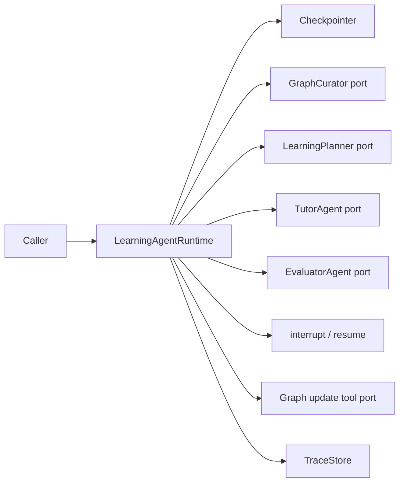
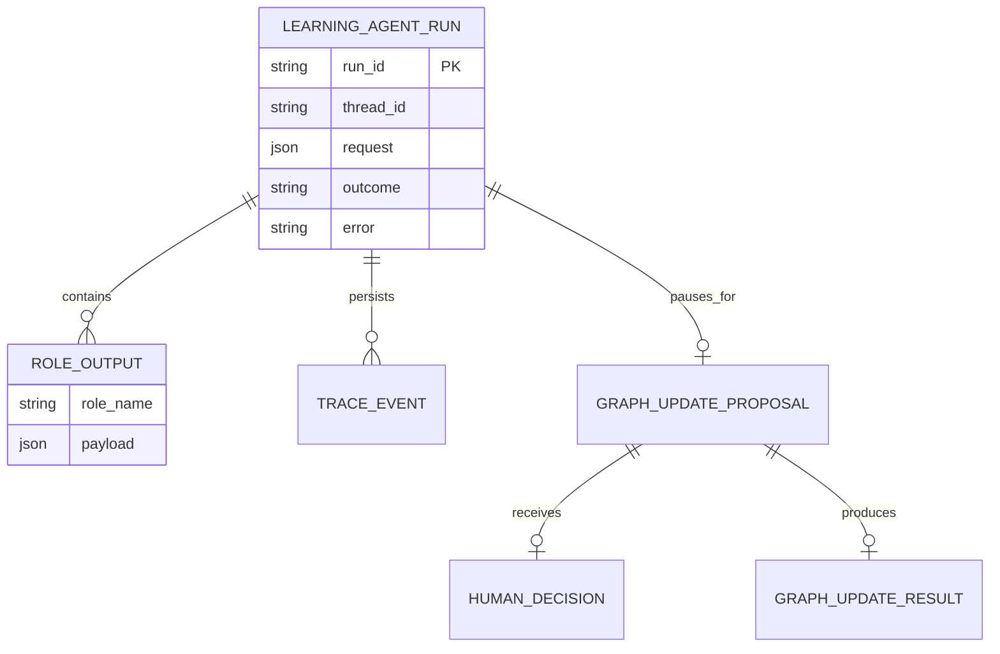
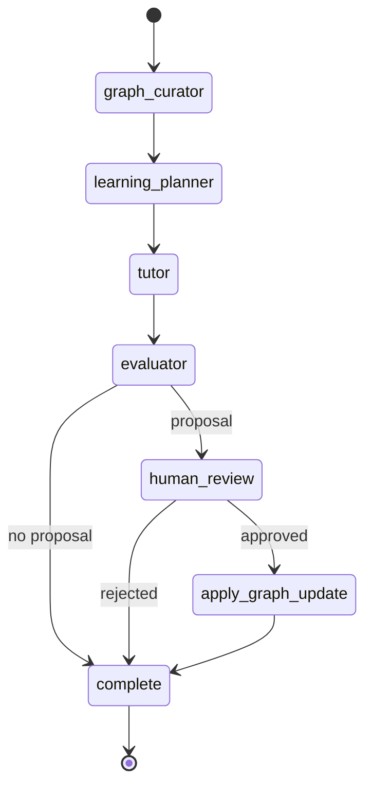

# 技术方案：Learning Agent Runtime 角色与工具接入

## 一、目标与非目标

新增 `agent/learning_runtime.py`，复用现有 LangGraph checkpointer、`RunResult` 与 `TraceStore`，把 GraphCurator、LearningPlanner、TutorAgent、EvaluatorAgent 接成确定状态图。角色与图谱写工具通过依赖注入进入 Runtime，使测试无需真实模型或数据库。

非目标：不修改现有通用 `LangGraphRuntime`；不接 HTTP/Flutter；不让角色动态控制跳转；不直接持久化 learning contracts。

## 二、模块边界

| 模块 | 职责 | 输入/输出 | 不负责 |
|------|------|-----------|--------|
| `LearningRuntimeRoles` | 四个结构化角色端口 | state view → dict | checkpoint、路由、写图 |
| `LearningRuntimeTools` | 受控副作用端口 | proposal → dict | 决定是否批准 |
| `LearningAgentRuntime` | 图编排、run/resume、Trace、失败收口 | request/decision → RunResult | 角色业务推理、图谱业务存储 |
| LangGraph checkpointer | thread 状态与 interrupt 恢复 | config/state | 业务 Trace |
| `TraceStore` | 持久化 RunResult 观察证据 | RunResult | 驱动恢复 |



## 三、状态与数据模型



| State 字段 | 类型 | 说明 |
|------------|------|------|
| request | dict | 原始运行输入 |
| graph_context | dict | GraphCurator 输出 |
| learning_plan | dict | LearningPlanner 输出 |
| tutor_content | dict | TutorAgent 输出 |
| evaluation | dict | EvaluatorAgent 输出 |
| graph_update_proposal | dict | evaluation 中可选提案 |
| graph_update_decision | dict | 标准化人工决定 |
| graph_update_result | dict | 已批准后的工具结果 |
| outcome | str | 完成语义 |

## 四、接口契约

### Python API

| 方法 | 说明 | 幂等 | Request | Response |
|------|------|------|---------|----------|
| `run(request, thread_id=None)` | 新建一次编排 | 否 | JSON object | `RunResult` |
| `resume(thread_id, decision, parent_run_id=None)` | 从 interrupt 恢复 | 对同一 checkpoint 否 | bool 或 `{approved: bool}` | `RunResult` |
| `checkpoint_history(thread_id)` | 查询 checkpoint 快照 | 是 | thread_id | tuple |
| `close()` | 关闭拥有的资源 | 是 | — | None |

角色签名统一为 `Callable[[dict[str, Any]], dict[str, Any]]`。工具签名为 `Callable[[dict[str, Any]], dict[str, Any]]`。Runtime 在边界校验返回值必须为 dict。

### Interrupt payload

```json
{
  "kind": "graph_update_confirmation",
  "proposal": {"operation": "record_evidence"}
}
```

### 终态

| outcome/error | 含义 |
|---------------|------|
| `completed` | 无提案或提案批准且工具执行成功 |
| `completed_without_graph_update` | 人工拒绝，业务正常结束 |
| `error != null` | 角色、工具、恢复或 Runtime 异常；Trace 以 `run failed` 收口 |

### 错误码/错误类型

本切片沿用 `RunResult.error` 文本契约，不新增 HTTP code；错误前缀稳定，供测试与未来 API adapter 映射。

| 前缀 | 含义 | 调用方处理 |
|------|------|------------|
| `INVALID_ROLE_OUTPUT` | 角色返回非 object | 修复角色适配器后重跑 |
| `INVALID_TOOL_OUTPUT` | 工具返回非 object | 修复工具适配器后重跑 |
| `INVALID_HUMAN_DECISION` | decision 无法解析 | 使用 bool 或 approved 字段恢复 |
| 其他异常类名 | 角色/工具或 checkpoint 异常 | 查看最后 TraceEvent 与异常信息 |

## 五、关键流程



执行器使用 LangGraph `stream(..., stream_mode="updates")` 收集节点 update 形成 `RunEvent`；interrupt 时 `RunResult.outcome=None`，resume 使用相同 thread_id 与 `Command(resume=decision)`。节点或工具异常由执行边界捕获，追加 `run failed` 后保存 TraceStore。

## 六、决策

选择“独立学习 Runtime + 注入端口”，不直接膨胀通用 Runtime。原因是现有通用 Runtime 的 plan/predict/act 语义与学习领域四角色不同；共享 `RunResult`、TraceStore 和 checkpointer 已足够复用，同时保持两套状态图各自可演进。

## 七、测试与回滚

- 先写五类测试：无提案完成、暂停、批准恢复、拒绝不写图、角色/工具失败。
- `agent.tests.test_learning_runtime` 通过后运行 `agent/tests` 全量回归。
- 新模块无迁移、无默认接线；回滚仅需移除模块与测试，不影响现有 runtime/learning contracts。

## 八、验收标准

- [x] 四角色节点顺序与结构化输出受 Runtime 控制。
- [x] 有提案时可暂停、查询 checkpoint 并恢复。
- [x] 未批准时写工具零调用。
- [x] 角色与工具异常形成失败终态 Trace。
- [x] 专项 8 tests、全量 agent 117 tests 通过。

## 反馈（skill_run）

```yaml
skill_run:
  skill: architecture-design-assistant
  plan: Plans/技术方案/2026-08-03-LearningAgentRuntime角色工具接入.md
  date: 2026-08-03
  contexts_used:
    - path: Plans/需求分析/2026-08-03-LearningAgentRuntime角色工具接入.md
      utility: high
      reason: "以 AC-S3 事件链约束角色、工具、人工确认和失败终态边界。"
    - path: Contexts/决策/Kit核心原则.md
      utility: high
      reason: "采用测试先行、最小投影与显式门禁，不提前扩张到 UI 和真实模型。"
  contexts_missing: []
  contexts_stale: []
  outcome_status: pass
  revisit_needed: false
```
