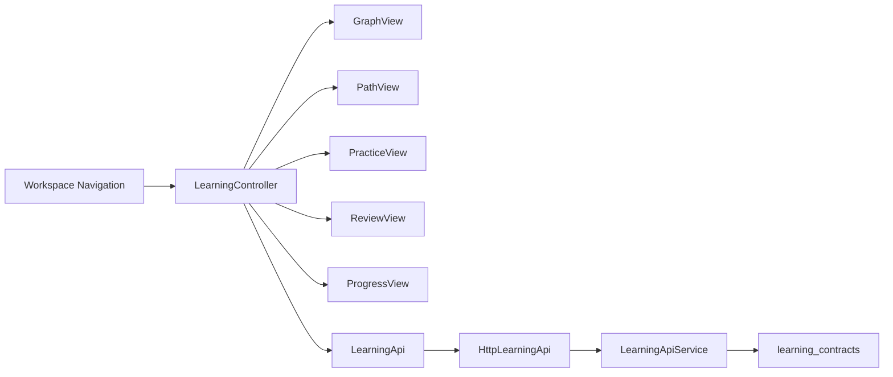
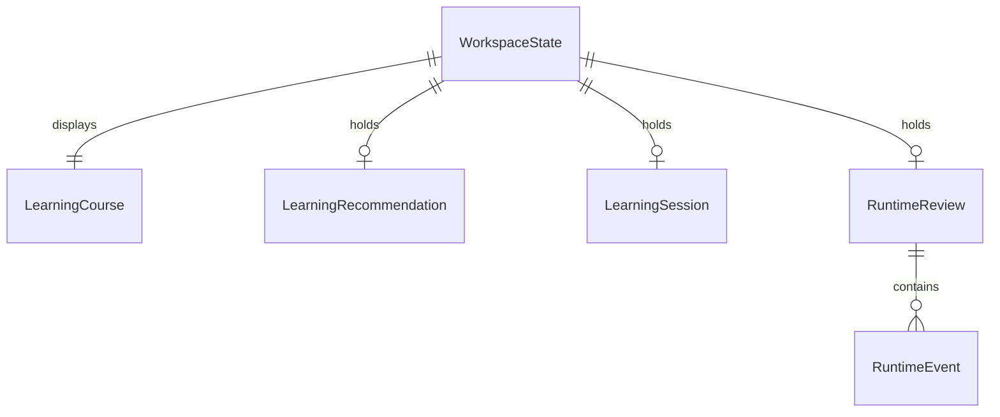
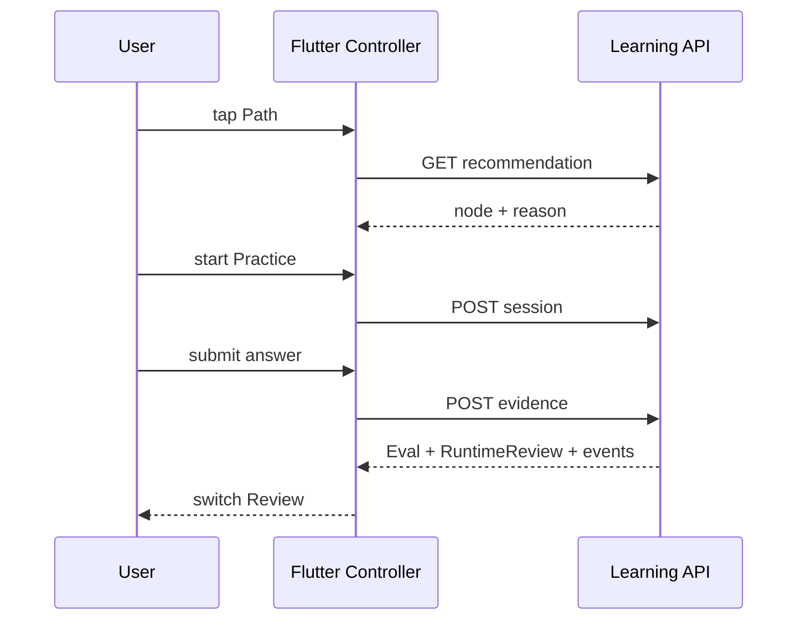

# 技术方案：R4 Flutter 学习工作台补全

## 一、背景与目标

在现有 `LearningController + LearningApi + LearningAgentRuntime` 上补齐 Path、Practice、Review、Progress 四个视图；Graph 保持现有实现。共享一个 controller，不新增平行状态容器。

非目标：真实 LLM、流式传输、账号/同步、历史 Review 持久化、远程部署。

## 二、模块边界

| 模块 | 职责 | 输入/输出 | 不负责 |
|------|------|-----------|--------|
| WorkspaceDestination | 声明五个页面与选中态 | user tap → enum | 业务数据 |
| LearningController | 共享 course/node/session/review/recommendation | API DTO → UI state | 画 UI |
| PathView | 展示后端推荐与启动练习入口 | recommendation | 计算推荐 |
| PracticeView | 展示节点题目、提交 Evidence | selected node/session/answer | 自算 Eval |
| ReviewView | 展示本轮 Eval 与 Runtime events | runtime response | 伪造历史 |
| ProgressView | 汇总 course mastery 与 node states | course DTO | 修改进度 |
| LearningApiService | 后端推荐、现有 Session/Evidence/Review | HTTP JSON | Flutter 页面状态 |



## 三、数据模型



| 模型 | 字段 | 类型 | 规则 |
|------|------|------|------|
| WorkspaceState | destination | enum | graph/path/practice/review/progress |
| LearningRecommendation | node, prerequisites, reason | DTO | 全部来自 API |
| RuntimeReview | runId, threadId, evaluation, proposal, events | DTO | events 按 sequence |
| ProgressSummary | mastery, stateCounts | view model | 只从 course DTO 派生展示 |

## 四、API Schema 与错误码

| Method | Path | Request | Response | 幂等 |
|--------|------|---------|----------|------|
| GET | `/api/learning/courses/{id}/recommendation` | path course id | node + prerequisite_node_ids + reason | 是 |
| POST | `/api/learning/sessions` | course_id + node_id | session | 否 |
| POST | `/api/learning/evidence` | session_id + answer | evidence + evaluation + runtime + course | 否 |
| POST | `/api/learning/reviews` | thread/run/course/approved | runtime + course | 否 |

```json
{
  "course_id": "course-123",
  "node": {"id": "course-123--checkpoint-interrupt", "title": "Checkpoint & Interrupt"},
  "prerequisite_node_ids": ["course-123--runtime-state"],
  "reason": "Prerequisites verified; lowest non-locked mastery."
}
```

| code | 含义 | 客户端处理 |
|------|------|------------|
| COURSE_NOT_FOUND | 课程不存在 | 回 Goal 页并显示错误 |
| NO_NEXT_NODE | 无可推荐节点 | Path 完成态 |
| INVALID_SESSION | 未绑定 course/node | 引导重新选节点 |
| RUNTIME_FAILED | Runtime 执行失败 | 保留 Evidence 输入并可重试 |

## 五、关键流程



## 六、实现与回滚

- 先增加 destination 与空态页面，保证导航状态稳定。
- 再加 recommendation endpoint/DTO，之后拆 Practice、Review/Progress。
- 每一切片保持 Flutter tests 通过；后端新增端点先写 service + HTTP tests。
- 回滚以删除新 destination 分支和 recommendation endpoint 为界，不改 S4b contracts/runtime。

## 七、验收标准

- [ ] AC-S6-1~5 与反例均映射到开发子任务。
- [ ] Flutter analyze/test/build 通过。
- [ ] Agent 全量测试通过。
- [ ] 桌面和 390px 页面无 RenderFlex overflow。

## 反馈（skill_run）

```yaml
skill_run:
  skill: architecture-design-assistant
  plan: Plans/技术方案/2026-08-03-R4Flutter学习工作台补全.md
  date: 2026-08-03
  contexts_used:
    - path: Plans/需求分析/2026-08-03-R4Flutter学习工作台补全.md
      utility: high
      reason: "以五视图、后端推荐、真实 Runtime events 与禁止客户端伪业务的 AC 固定模块和 API 边界。"
    - path: Plans/功能开发/2026-08-03-R4独立Flutter后端最小闭环.md
      utility: high
      reason: "复用已验证的 controller/API/runtime 分层，不引入第二套状态与后端。"
  contexts_missing: []
  contexts_stale: []
  outcome_status: pass
  revisit_needed: false
```
