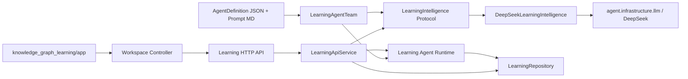
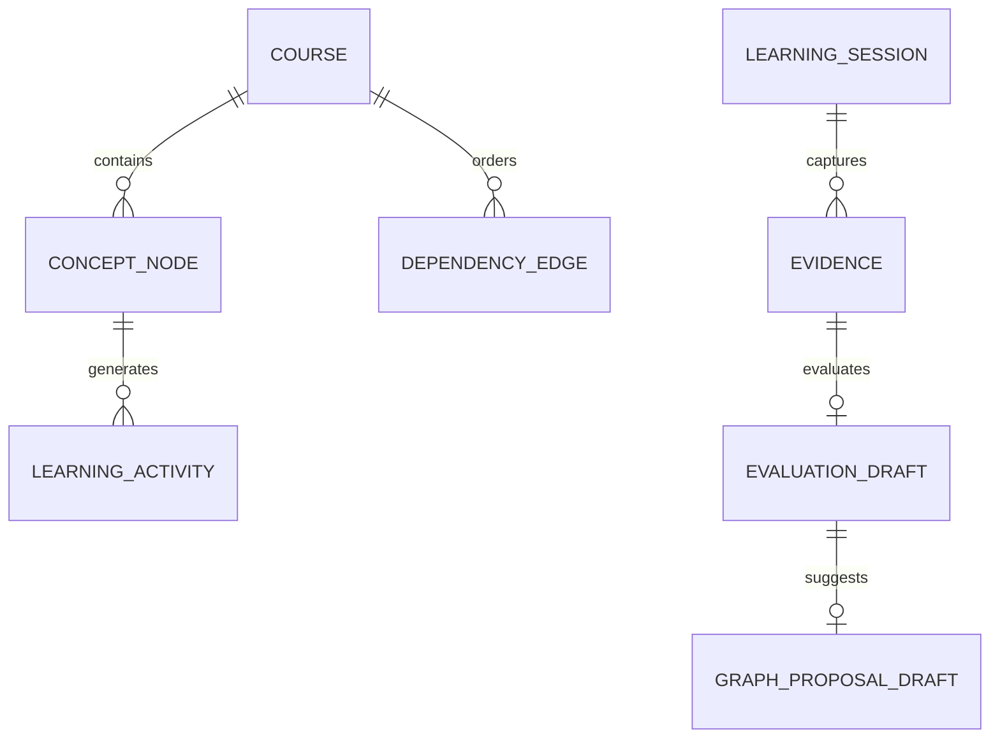

# 技术方案：R4 真实 DeepSeek 学习智能接入

## 一、背景与目标

- **真理源**：`Plans/需求分析/2026-08-03-R4真实DeepSeek学习智能接入.md`。
- **目标**：以可注入、可校验、可追踪的 LearningIntelligence 替换 R4 Learning API 与 Flutter 中全部语义假数据。
- **成功指标**：AC-S7-1～7 与反例通过；生产路径不存在固定课程、固定 Tutor、固定题目、长度评分、固定提案和假用户信息。
- **非目标**：账号/云同步/RAG/流式 token/远程部署。

## 二、原则与约束

| 原则 | 落地 |
|------|------|
| DIP | `LearningApiService` 依赖 `LearningIntelligence` Protocol，不直接依赖 OpenAI SDK。 |
| SRP | prompt+结构校验在 intelligence；持久化在 repository；状态编排在 runtime；展示在 Flutter。 |
| 原子写入 | 模型输出先完整验证，再创建/更新领域对象。 |
| 无伪降级 | 缺 key、调用异常、schema 异常映射为 typed API error。 |
| 可测试 | 单元/HTTP 使用 ScriptedLearningIntelligence；live smoke 显式 opt-in。 |

## 三、模块边界

| 模块 | 职责 | 输入/输出 | 依赖 |
|------|------|-----------|------|
| `agent/core/` | 通用 Definition 与 runtime-neutral trace/result 契约 | policy/result → stable public contract | 无产品依赖 |
| `agent/infrastructure/` | 通用 DeepSeek、checkpoint、trace 适配器 | external/local I/O ↔ core | `agent.core` |
| `agent/orchestration/` | 通用单 Agent / Team LangGraph 控制流 | role/capability → RunResult | core, cognition, infrastructure |
| `knowledge_graph_learning/backend/application/intelligence.py` | LearningIntelligence Protocol、DTO、schema/图校验与测试替身 | goal/course/node/evidence → draft/recommendation/activity/evaluation | domain only |
| `knowledge_graph_learning/backend/infrastructure/deepseek_intelligence.py` | 真实 DeepSeek 出站适配器 | intelligence port → `agent.infrastructure.llm` | application, agents, agent platform |
| `knowledge_graph_learning/backend/application/service.py` | 应用服务、错误映射、写入顺序 | use case DTO ↔ domain/repository | intelligence, runtime, repository |
| `knowledge_graph_learning/backend/interfaces/http_api.py` | HTTP/CLI 入站适配器 | HTTP JSON ↔ application service | application |
| `knowledge_graph_learning/backend/config.py` | 根目录 `.env` 与显式 `--env-file` 加载；进程环境优先 | local secret source → process environment | python-dotenv |
| `knowledge_graph_learning/backend/orchestration/runtime.py` | 学习角色 trace、checkpoint/interrupt、HITL | validated evaluation/proposal → events | agent platform |
| `knowledge_graph_learning/backend/agents/` | 四个 AgentDefinition、Prompt、Team 与 Runtime role adapters | definition id → typed agent/team/roles | `agent.core.definition`, `agent.roles.base` |
| `knowledge_graph_learning/app/` | Flutter API/controller/views | JSON → Graph/Path/Practice/Review/Progress | HTTP API |



### 变更影响结论

| 范围 | 处理 |
|------|------|
| R3 Definition schema | 增加必填 policy `version`，直接构造保留默认值；升级既有五份 JSON。 |
| R4 DeepSeek | 四种 structured call 分别消费对应 Definition prompt context。 |
| R4 Runtime | 角色对象与 callable 由 `LearningAgentTeam` 唯一装配，event 输出 id/version。 |
| Learning API | 删除 `_roles()`，只注入 Team、Intelligence、Tools 与 repository。 |
| Flutter/API Schema | 无破坏性变化；Definition 元数据只进入 runtime trace。 |
| 产品目录 | 正式 R4 从 `tmp/` 提升为根目录 `knowledge_graph_learning/`；运行数据移至被忽略的 `.runtime/knowledge-graph-learning/`。 |
| 通用底座目录 | `agent/` 按 core/cognition/infrastructure/orchestration/guardrails 分层，移除全部 R4 产品领域文件。 |
| Python 导入 | 内部导入全部迁至新包路径，不保留旧平铺模块兼容壳；测试直接约束真实架构。 |

### 声明式 Agent 目录与唯一真理源

```text
agent/                             # 通用智能体平台
├── core/                         # Definition、RunEvent、RunResult
├── cognition/                    # memory、world model、self improvement
├── infrastructure/               # llm、checkpoint、trace
├── orchestration/                # single/team LangGraph runtimes
├── guardrails/                   # safety policy
├── capabilities/                 # planning/act/reviewing
├── roles/                        # generic team roles
├── definitions/                  # 通用 Agent JSON 策略
└── prompts/                      # 通用 Agent 长指令

knowledge_graph_learning/         # R4 产品，与 agent/ 平级
├── backend/
│   ├── domain/contracts.py       # 学习领域与 repository 契约
│   ├── application/
│   │   ├── intelligence.py       # port、DTO、validator、scripted fake
│   │   └── service.py            # 用例编排与写入顺序
│   ├── agents/                   # catalog/team/definitions/prompts
│   ├── orchestration/runtime.py  # 学习 LangGraph/HITL
│   ├── infrastructure/           # DeepSeek 出站适配器
│   ├── interfaces/http_api.py    # HTTP/CLI 入站适配器
│   └── tests/                    # 产品后端测试
└── app/                          # Flutter 多端客户端

.runtime/knowledge-graph-learning/ # 本地数据，不进入版本库
```

AgentDefinition 拥有身份、目标、工具白名单、验收、指令和 policy version；Learning Runtime 拥有状态图、路由、interrupt/resume；Application Service 与 HTTP adapter 均不拥有角色 prompt 或角色实现。产品只允许依赖通用 `agent/` 底座，`agent/` 禁止反向依赖 `knowledge_graph_learning/`。

## 四、数据模型



| DTO | 字段 | 约束 |
|-----|------|------|
| `CourseGraphDraft` | `title,nodes,edges` | 6–12 nodes；unique slug/title；edge endpoints exist；DAG |
| `RecommendationDraft` | `node_id,reason` | node 在 course；所有 prerequisite 已满足 |
| `LearningActivity` | `content,insight,question,rubric` | 均非空；响应 session start，不扩展持久化 Session 契约 |
| `EvaluationDraft` | `passed,score,reason,gaps,proposal` | score 0..1；reason 非空；proposal optional |
| `GraphProposalDraft` | `summary,rationale,proposed_nodes,proposed_edges,risks` | 引用合法，最终转换为现有 GraphOperationProposal |

`LearningActivity` 作为 session response 的独立 DTO，不向 `LearningSession` 塞 UI 文本，避免破坏 session 生命周期与 repository 契约。

## 五、API Schema 与错误码

| 方法 | 路径 | 变化 | Response 核心字段 |
|------|------|------|-------------------|
| POST | `/learning/goals` | 调用真实 graph generation | `goal,course,nodes,edges,progress` |
| GET | `/learning/courses/{id}/recommendation` | 调用真实 planner | `node_id,reason` |
| POST | `/learning/sessions` | 调用真实 Tutor | `session,event,activity` |
| POST | `/learning/evidence` | 调用真实 Evaluator，成功后更新进度 | `evidence,eval_result,progress,events,proposal?` |

```json
{
  "activity": {
    "content": "...",
    "insight": "...",
    "question": "...",
    "rubric": ["..."]
  }
}
```

| code | HTTP | 含义 | 客户端处理 |
|------|------|------|------------|
| `LLM_NOT_CONFIGURED` | 503 | 缺少 DeepSeek key | 显示配置提示，允许重试 |
| `LEARNING_INTELLIGENCE_FAILED` | 502 | 模型/网络/结构修复后仍失败 | 显示错误，不改本地成功态 |
| `INVALID_INTELLIGENCE_OUTPUT` | 502 | schema/图/引用校验失败 | 显示无法验证，不应用结果 |
| 既有领域错误码 | 4xx | goal/course/node/session 不匹配 | 沿用当前处理 |

## 六、关键流程与写入顺序

```mermaid
sequenceDiagram
  participant API as Service
  participant AI as Intelligence
  participant Repo as Repository
  API->>AI: evaluate(course,node,answer,activity)
  AI-->>API: EvaluationDraft
  API->>API: validate score/references/proposal
  alt valid
    API->>Repo: save Evidence + EvalResult
    API->>Repo: update Progress
    API->>Repo: save pending Proposal
  else invalid/call failed
    API-->>API: typed error; no progress/proposal write
  end
```

创建课程同样遵守“generate → validate complete graph → persist”；不逐节点边生成边写。Evidence 在评估失败时允许作为用户事实持久化，但必须标明没有 Eval；进度与 proposal 绝不更新。

## 七、Prompt 与验证策略

- 每个能力单独 system prompt，要求只返回 JSON；输入包含当前目标/图谱/状态/节点/回答的最小必要事实。
- 继续复用 `chat_json` 的一次修复尝试，但业务 schema 校验失败不再二次自由修复或使用 fixture。
- 服务端使用 node id 映射和拓扑校验兜住 LLM 越权；推荐不能绕过 prerequisite。
- evaluator 的 `passed` 以 rubric 为语义判断，代码只验证类型/范围/一致性，不用答案长度重新评分。

## 八、测试与上线

| 层 | 做法 | 门禁 |
|----|------|------|
| DTO/validator | 非法 JSON、重复节点、悬空边、环、非法推荐、非法 score | 全部拒绝且无 repository 写入 |
| Service/HTTP | 注入 ScriptedLearningIntelligence | 原有回归稳定，新增真实数据流断言 |
| Flutter | 真实 HTTP fixture + 动态节点 | analyze/test/build 通过，无固定内容断言 |
| Live | `R4_LIVE_DEEPSEEK=1 DEEPSEEK_API_KEY=...` | goal→activity→eval smoke 成功 |

- **发布**：在仓库根目录以 `uv run python -m knowledge_graph_learning.backend` 启动；进程环境优先，否则自动读取根目录 `.env`；README 明确 live smoke 命令。
- **回滚**：回滚 S6 代码提交；不恢复假数据 fallback。模型不可用时系统明确不可用。
- **数据迁移**：无 schema 迁移；旧 fixture 课程可读取，但新创建路径不再使用。

## 九、实施计划

1. Intelligence port + DTO/校验/错误。
2. 动态 graph + recommendation。
3. Tutor activity + session API。
4. Evaluator/proposal/progress 原子流。
5. Flutter 动态消费与假数据清理。
5b. 复用 R3 AgentDefinition 统一四个学习角色、prompt 与 trace。
6. 全量回归、live smoke 和运行文档。

## 十、验收

- [ ] AC-S7-1～7 与反例全部映射到子任务和测试。
- [ ] `agent/tests`、Flutter analyze/test/build 通过。
- [ ] key 缺失时有明确错误且零假数据写入。
- [ ] 配置 key 后 live smoke 通过。

## 反馈（skill_run）

```yaml
skill_run:
  skill: architecture-design-assistant
  plan: Plans/技术方案/2026-08-03-R4真实DeepSeek学习智能接入.md
  date: 2026-08-03
  contexts_used:
    - path: Plans/需求分析/2026-08-03-R4真实DeepSeek学习智能接入.md
      utility: high
      reason: "以 AC-S7、显式失败、动态 UI 和图谱 HITL 作为架构边界。"
    - path: Templates/技术方案模板.md
      utility: high
      reason: "补齐模块、ER、API、错误码、流程、回滚和验收门禁。"
    - path: Plans/学习循环/2026-08-01-学习记录-智能体开发-08-R3.3-声明式Agent定义.md
      utility: high
      reason: "复用 R3 的 Definition 承载策略、Runtime 保留控制流边界，消除 R4 API 内第二套角色定义。"
  contexts_missing: []
  contexts_stale: []
  outcome_status: pass
  revisit_needed: false
```
