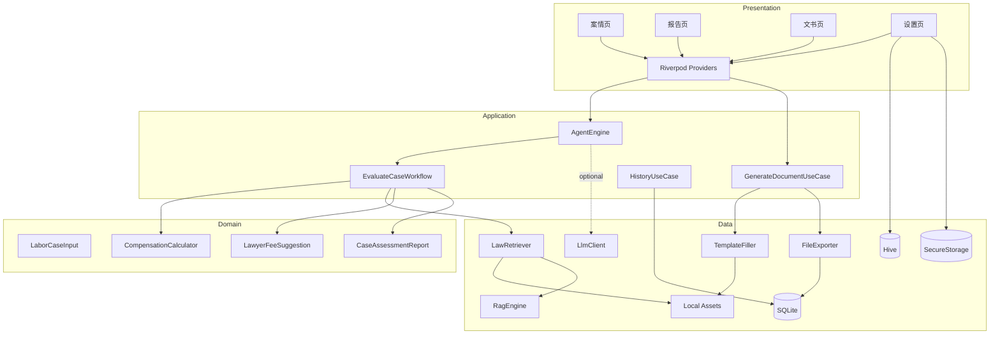
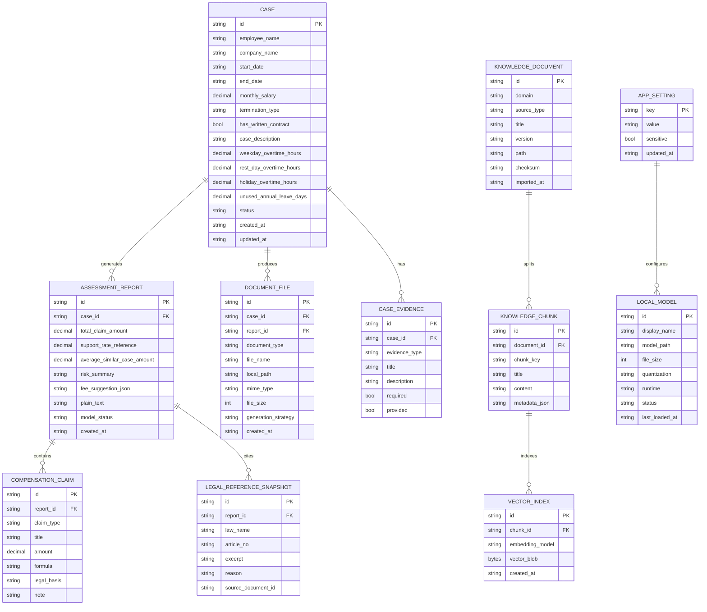
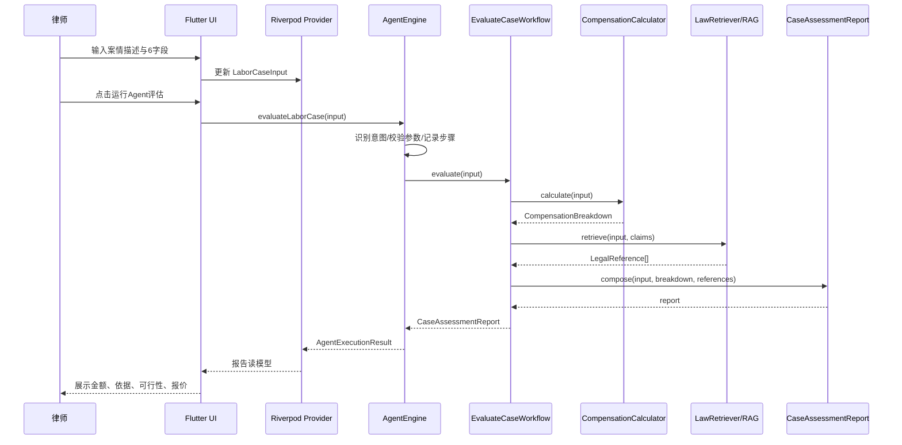
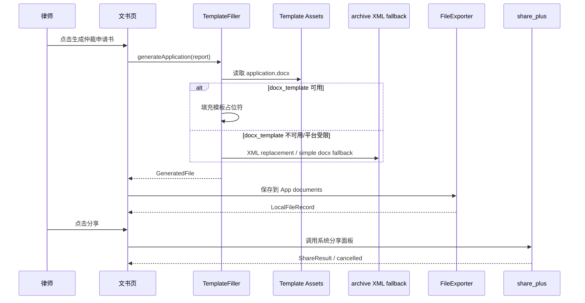
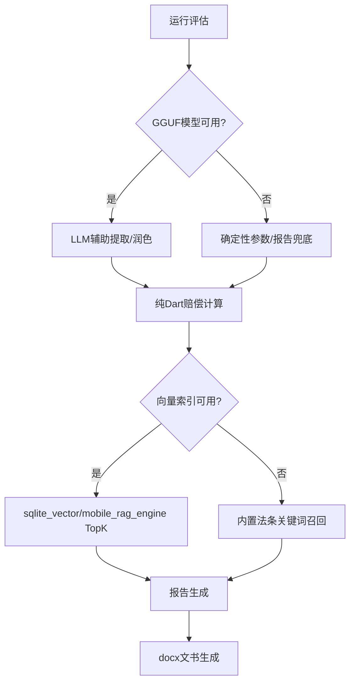

# 技术方案：Flutter版劳动仲裁生成式智能助手App

**创建日期**：2026-08-04  
**存放路径**：`Plans/技术方案/2026-08-04-Flutter版劳动仲裁生成式智能助手App.md`  
**状态**：已采纳  
**lifecycle_state**：architecture  
**平台**：Flutter 客户端（iOS / Android；Web 仅作开发验证）  
**关联需求（真理源）**：`Plans/需求分析/2026-08-04-Flutter版劳动仲裁生成式智能助手App.md`  
**关联 Epic**：`Plans/Epic/2026-08-04-Flutter版劳动仲裁生成式智能助手App.md`

---

## 一、背景与目标

### 1.1 业务痛点

目标用户是执业 1-5 年的小律师/独立律师。劳动争议咨询场景中，律师需要在短时间内判断：

- 案件是否值得接。
- 可主张金额大约是多少。
- 胜诉可行性和证据短板在哪里。
- 是否能快速产出仲裁申请书和证据清单初稿。

本生成式智能 App 的核心差异化是：**本地化部署 + 精准赔偿计算 + 一键生成 Word 文书 + 数据不出手机**；第一阶段可交付基线只用于控制验收节奏，不代表产品缩水为最小版本。

### 1.2 成功指标

| 指标 | 目标 | 验收方式 |
|------|------|----------|
| 案件评估耗时 | 完整字段输入后 30 秒内生成报告 | Widget / E2E |
| 样例计算正确性 | 月薪 8000、6 年、违法辞退：N=48,000，2N=96,000 | Unit Test |
| 金额来源 | 报告金额全部来自确定性 Dart 计算器 | Unit / Integration |
| 法条溯源 | 每条法律依据展示法名、条号、原文摘录 | Integration |
| 文书生成 | 生成《劳动仲裁申请书》《证据清单》docx | Integration |
| 隐私承诺 | App 明确展示“数据默认本地处理，不上传云端” | Widget / Manual |
| 模型降级 | 本地模型不可用时 P0 主链路仍可用 | Integration |

### 1.3 非目标

- 第一阶段可交付基线不要求正式接入可商用的本地 LLM 推理效果，但生成式增强版本必须完成本地 LLM 参数提取、追问补全和文书改写能力。
- 第一阶段可交付基线不要求 sqlite_vector / mobile_rag_engine 真机完整落地，但生产化路线必须保留本地向量知识库能力。
- 第一阶段不支持云端同步、团队协作、正式 Web 发布。
- 第一阶段不做“胜诉承诺”，只展示可行性参考、证据风险和本地样本参考。
- 第一阶段不覆盖所有地区劳动争议裁判口径；先实现标准测算并保留律师核对提示。

### 1.4 生成式能力路线

| 阶段 | 生成式能力 | 技术落点 | 验收重点 |
|------|------------|----------|----------|
| 基线 | 结构化评估报告、Word 文书填充 | AgentEngine + CompensationCalculator + TemplateFiller | 计算正确、法条可追溯、docx 可生成 |
| 增强 | 案情参数提取、缺字段追问、报告润色、文书动态改写 | LocalLlmClient + Prompt + JSON Schema 提取 | 模型不可用可降级，模型可用时生成质量提升 |
| 生产化 | 本地知识库向量检索、模型管理、历史案件复用、订阅试用 | RagEngine + SQLite/Hive + ModelManager | 真机性能、隐私边界、商业转化闭环 |

---

## 二、AI 行为准则

1. 赔偿金额必须由确定性 Dart 计算器生成，LLM 不得编造或覆盖金额。
2. 法条依据必须来自本地知识库或内置法条兜底，不得生成无来源引用。
3. 本地 LLM 只负责案情理解、参数提取、语言组织和解释，不作为法律结论唯一来源。
4. 模型、RAG、模板任一能力不可用时，P0 应回落到确定性计算 + 内置法条 + 最小 docx。
5. UI 不直连数据库；页面只通过 Provider / UseCase 获取读模型。
6. 客户案情、工资、公司信息默认本地保存，除系统分享面板由用户主动分享外不上传。

---

## 三、原则对照

| 原则 | 适用要求 |
|------|----------|
| SRP | 计算器只做金额计算；检索器只做依据召回；Agent 只做编排；UI 只做展示与输入。 |
| DIP | UI 依赖 Provider / UseCase 抽象，不直接依赖 SQLite、Hive、LLM、RAG 实现。 |
| OCP | 劳动领域以 `domains/labor/` 封装，后续交通事故、婚姻家事通过新 domain 扩展。 |
| ISP | LLM、RAG、文书生成、文件导出拆成小接口，避免一个大 Service 聚合所有能力。 |
| KISS | P0 使用内置法条 + 关键词检索兜底，不因向量 RAG 阻塞核心价值闭环。 |
| YAGNI | 不提前实现云同步、多租户、复杂 Agent 路由、正式 Web 端。 |
| DRY | 赔偿公式只在 `CompensationCalculator` 维护，报告和文书消费同一结果模型。 |

---

## 四、约束与前提

| 类别 | 约束 |
|------|------|
| 运行端 | iOS / Android 为正式目标；Web 只用于开发 smoke、Chrome 测试和演示。 |
| 状态管理 | Flutter + Riverpod，优先保持同步可测的 Provider 图。 |
| 本地存储 | SQLite 存案件、报告、文书索引、知识库元数据；Hive 存轻量设置；secure storage 存敏感配置。 |
| 本地模型 | flutter_llama / llama.cpp FFI + GGUF 为 Spike；P0 不依赖模型成功加载。 |
| RAG | sqlite_vector / mobile_rag_engine 为 Spike；P0 先使用内置法条 JSON + 关键词召回。 |
| 文书 | docx_template 优先；archive XML 替换兜底；Web 测试绕开 docx_template 阻塞。 |
| 隐私 | 默认本地处理，不接入云端 API；系统分享前由用户主动触发。 |
| 合规 | 胜诉率和判例支持率必须标注“参考/非承诺”。 |
| 性能 | 低端机模型加载失败时不能影响计算、报告和文书生成。 |

---

## 五、总体架构

### 5.1 分层结构

```text
Presentation（Flutter UI / Riverpod）
  -> Application（AgentEngine / UseCase / ReportComposer）
    -> Domain（LaborCaseInput / CompensationCalculator / CaseAssessmentReport）
      -> Data（Local DB / Knowledge Assets / File Exporter / LLM & RAG Adapter）
```

### 5.2 模块边界

| 模块 | 职责 | 输入 | 输出 | 依赖模块 |
|------|------|------|------|----------|
| UI Shell | 底部导航、页面容器、主题 | 用户点击、Provider 状态 | 页面状态 | Providers |
| Case Intake UI | 案情描述、6 字段输入、缺字段提示 | 文本、日期、工资、解除方式 | LaborCaseInput Draft | Providers |
| Report UI | 展示金额、法条、可行性、报价、完整报告 | CaseAssessmentReport | 报告读模型 | Providers |
| Document UI | 生成并分享文书 | CaseAssessmentReport | GeneratedFile / ShareResult | TemplateFiller / FileExporter |
| Settings UI | 模型、知识库、隐私、本地清理入口 | 用户设置 | AppSettings | SettingsRepository |
| AgentEngine | 案情理解、字段提取、步骤编排 | 案情描述或 LaborCaseInput | AgentExecutionResult | EvaluateCaseWorkflow / LlmClient |
| EvaluateCaseWorkflow | 劳动案件评估用例 | LaborCaseInput | CaseAssessmentReport | CompensationCalculator / LawRetriever |
| CompensationCalculator | N、2N、双倍工资、加班费、年假测算 | LaborCaseInput | CompensationBreakdown | 无 |
| LawRetriever | 本地法条召回与关键词兜底 | 案由、解除方式、合同状态 | LegalReference[] | KnowledgeStore |
| RagEngine | 本地知识库检索抽象 | query / topK | RagSearchResult[] | Keyword / sqlite_vector 实现 |
| LlmClient | 本地模型推理抽象 | prompt / schema | text / json | flutter_llama Spike |
| TemplateFiller | docx 模板填充与兜底生成 | report / template | GeneratedFile | docx_template / archive |
| FileExporter | 保存到 App 私有目录并生成分享文件 | GeneratedFile | LocalFileRecord | path_provider |
| Persistence | 案件、报告、文书、知识库、设置持久化 | Entity / DTO | Entity / DTO | SQLite / Hive / secure storage |

### 5.3 模块依赖图



---

## 六、领域模型与数据模型

### 6.1 领域对象

| 对象 | 说明 | 关键字段 |
|------|------|----------|
| LaborCaseInput | 劳动案件输入聚合 | 姓名、公司、入职/离职日期、工资、解除方式、合同状态、案情描述、加班/年假 |
| CompensationClaim | 单项赔偿主张 | 名称、金额、公式、依据、说明 |
| CompensationBreakdown | 赔偿明细聚合 | N、2N、双倍工资、加班费、年假、总额、主张项 |
| LegalReference | 法条引用 | 法名、条号、原文摘录、适用理由 |
| CaseAssessmentReport | 报告聚合 | 输入、赔偿明细、法条、支持率参考、报价建议、完整文本 |
| GeneratedFile | 生成文件 | 文件名、bytes、mimeType |
| AgentExecutionResult | Agent 执行结果 | intent、steps、input、report |
| RagDocument | 知识库文档 | id、title、source、content、metadata |
| LocalModel | 本地模型状态 | name、path、size、quantization、loaded |

### 6.2 ER 图



### 6.3 字段定义

| 实体/表 | 字段 | 类型 | 必填 | 说明 |
|---------|------|------|------|------|
| CASE | id | string | 是 | 本地 UUID，不含个人身份推断逻辑 |
| CASE | employee_name | string | 否 | 申请人姓名；可匿名草稿 |
| CASE | company_name | string | 否 | 被申请人名称 |
| CASE | start_date / end_date | ISO date | 是 | 计算工作年限 |
| CASE | monthly_salary | decimal | 是 | 月平均工资，必须 > 0 |
| CASE | termination_type | enum | 是 | illegalDismissal / mutualTermination / resignation |
| CASE | has_written_contract | bool | 是 | 是否签书面劳动合同 |
| CASE | case_description | text | 否 | 原始案情描述 |
| CASE | status | enum | 是 | draft / assessed / document_generated / archived |
| ASSESSMENT_REPORT | total_claim_amount | decimal | 是 | 由 CompensationBreakdown 汇总 |
| ASSESSMENT_REPORT | support_rate_reference | decimal | 否 | 参考值，必须展示非承诺文案 |
| ASSESSMENT_REPORT | model_status | enum | 是 | not_loaded / deterministic / llm_assisted |
| COMPENSATION_CLAIM | claim_type | enum | 是 | n / two_n / double_salary / overtime / annual_leave |
| COMPENSATION_CLAIM | formula | string | 是 | 面向律师可解释公式 |
| LEGAL_REFERENCE_SNAPSHOT | excerpt | text | 是 | 报告生成时的法条摘录快照 |
| DOCUMENT_FILE | generation_strategy | enum | 是 | docx_template / xml_replacement / simple_docx |
| KNOWLEDGE_DOCUMENT | checksum | string | 是 | 用于知识库版本和导入一致性 |
| KNOWLEDGE_CHUNK | metadata_json | json | 否 | articleNo、region、caseType、supportRate 等 |
| VECTOR_INDEX | vector_blob | bytes | 否 | P1/Spike；P0 可为空 |
| APP_SETTING | sensitive | bool | 是 | true 时写 secure storage，不进普通 Hive |
| LOCAL_MODEL | status | enum | 是 | missing / downloaded / loading / loaded / failed |

---

## 七、接口契约 / API Schema

> 本项目 P0 不接云端 API。这里的 API Schema 指 App 内部 UseCase / Repository 契约，路径使用 `local://` 表达，便于测试、日志和后续替换实现。

### 7.1 运行案件评估

| 方法 | 路径 | 说明 | 幂等 | Request | Response |
|------|------|------|------|---------|----------|
| POST | local://cases/evaluate | 根据案情输入生成评估报告 | 否 | EvaluateCaseRequest | EvaluateCaseResponse |

**Request 示例**：

```json
{
  "employeeName": "张三",
  "companyName": "某科技公司",
  "startDate": "2018-08-01",
  "endDate": "2024-08-01",
  "monthlySalary": 8000,
  "terminationType": "illegalDismissal",
  "hasWrittenContract": false,
  "caseDescription": "公司违法辞退，月平均工资8000，未签书面劳动合同。",
  "weekdayOvertimeHours": 0,
  "restDayOvertimeHours": 0,
  "holidayOvertimeHours": 0,
  "unusedAnnualLeaveDays": 0
}
```

**Response 示例**：

```json
{
  "code": 0,
  "data": {
    "caseId": "local-case-id",
    "reportId": "local-report-id",
    "totalClaimAmount": 184000,
    "primaryClaim": "违法解除赔偿金 2N",
    "supportRateReference": 0.89,
    "modelStatus": "deterministic",
    "legalReferences": [
      {
        "lawName": "劳动合同法",
        "articleNo": "第八十七条",
        "excerpt": "用人单位违反本法规定解除或者终止劳动合同的，应当依照本法第四十七条规定的经济补偿标准的二倍向劳动者支付赔偿金。"
      }
    ]
  }
}
```

### 7.2 赔偿计算

| 方法 | 路径 | 说明 | 幂等 | Request | Response |
|------|------|------|------|---------|----------|
| POST | local://compensation/calculate | 只计算赔偿明细，不生成报告 | 是 | CompensationRequest | CompensationResponse |

**Response 核心字段**：

```json
{
  "code": 0,
  "data": {
    "serviceMonths": 72,
    "compensationMonths": 6,
    "claims": [
      { "type": "n", "amount": 48000, "formula": "8000 × 6" },
      { "type": "two_n", "amount": 96000, "formula": "8000 × 6 × 2" },
      { "type": "double_salary", "amount": 88000, "formula": "8000 × min(72-1, 11)" }
    ],
    "totalClaimAmount": 184000
  }
}
```

### 7.3 法条 / 知识库检索

| 方法 | 路径 | 说明 | 幂等 | Request | Response |
|------|------|------|------|---------|----------|
| POST | local://knowledge/search | 检索本地法条和案例 | 是 | KnowledgeSearchRequest | KnowledgeSearchResponse |

**Request 示例**：

```json
{
  "query": "违法解除 未签劳动合同 双倍工资",
  "domain": "labor",
  "topK": 5,
  "includeCases": true
}
```

**Response 示例**：

```json
{
  "code": 0,
  "data": {
    "strategy": "keyword_fallback",
    "results": [
      {
        "id": "labor_contract_law_87",
        "sourceType": "law",
        "title": "劳动合同法 第八十七条",
        "excerpt": "用人单位违反本法规定解除或者终止劳动合同的...",
        "score": 0.92
      }
    ]
  }
}
```

### 7.4 文书生成

| 方法 | 路径 | 说明 | 幂等 | Request | Response |
|------|------|------|------|---------|----------|
| POST | local://documents/generate | 生成申请书或证据清单 docx | 否 | GenerateDocumentRequest | GenerateDocumentResponse |

**Request 示例**：

```json
{
  "caseId": "local-case-id",
  "reportId": "local-report-id",
  "documentType": "arbitration_application"
}
```

**Response 示例**：

```json
{
  "code": 0,
  "data": {
    "documentId": "local-document-id",
    "fileName": "劳动仲裁申请书.docx",
    "mimeType": "application/vnd.openxmlformats-officedocument.wordprocessingml.document",
    "generationStrategy": "xml_replacement",
    "localPath": "app-documents/labor_assistant/劳动仲裁申请书.docx"
  }
}
```

### 7.5 本地模型状态

| 方法 | 路径 | 说明 | 幂等 | Request | Response |
|------|------|------|------|---------|----------|
| GET | local://models/status | 查询本地模型下载与加载状态 | 是 | 无 | ModelStatusResponse |
| POST | local://models/load | 加载本地 GGUF 模型 | 否 | LoadModelRequest | ModelStatusResponse |

### 7.6 错误码

| code | 含义 | 客户端处理 | 优先级 |
|------|------|------------|--------|
| 0 | 成功 | 展示结果 | P0 |
| CASE_FIELD_MISSING | 缺少关键字段 | 高亮字段并阻止精确金额生成 | P0 |
| CASE_DATE_INVALID | 入职/离职日期非法 | 提示修改日期 | P0 |
| SALARY_INVALID | 工资为空、非数字、≤0 | 提示输入有效月平均工资 | P0 |
| COMPENSATION_RULE_UNSUPPORTED | 当前计算口径暂未覆盖 | 给出人工核对提示，不编造金额 | P0 |
| KNOWLEDGE_NOT_READY | 知识库索引未初始化 | 使用内置法条兜底 | P0 |
| LEGAL_REFERENCE_EMPTY | 未检索到可引用法条 | 报告提示“需人工补充依据”，不伪造法条 | P0 |
| DOC_TEMPLATE_MISSING | docx 模板缺失 | 使用最小 docx / XML 兜底 | P0 |
| DOC_GENERATION_FAILED | 文书生成失败 | 展示可复制文本兜底 | P0 |
| FILE_SAVE_FAILED | 本地保存失败 | 提示空间/权限问题，允许重试 | P0 |
| SHARE_CANCELLED | 用户取消分享 | 不报错，保留本地文件 | P1 |
| MODEL_NOT_FOUND | GGUF 模型不存在 | 使用确定性报告，提示下载模型 | P1 |
| MODEL_LOAD_FAILED | 模型加载失败 | 卸载/切换模型，P0 不受影响 | P1 |
| VECTOR_INDEX_UNAVAILABLE | 向量索引不可用 | 回退关键词检索 | P1 |
| STORAGE_QUOTA_LOW | 本地空间不足 | 阻止模型下载或大文件生成 | P1 |

---

## 八、关键流程

### 8.1 案件评估主链路



### 8.2 文书生成链路



### 8.3 模型与 RAG 降级链路



---

## 九、方案选项与决策矩阵

### 9.1 本地 LLM 接入

| 方案 | 性能 | 复杂度 | 成本 | 风险 | 结论 |
|------|------|--------|------|------|------|
| A：P0 必须接入 flutter_llama + Phi-3/Qwen GGUF | 中 | 高 | 高 | 真机性能、包体、审核、低端机失败会阻塞主链路 | 不采纳为 P0 |
| B：P0 保留 LLM 抽象，使用确定性提取/报告兜底；第二周 Spike 真机验证 | 高 | 中 | 中 | 语言效果不如真实 LLM，但核心价值闭环稳定 | 采纳 |
| C：接云端 LLM API | 高 | 中 | 中 | 违背本地隐私卖点，案情外传 | 不采纳 |

**推荐**：B。P0 以确定性业务闭环优先，flutter_llama/GGUF 在第二周作为 Spike，验证模型体积、加载耗时、内存、水位和提取质量。

### 9.2 RAG / 知识库检索

| 方案 | 性能 | 复杂度 | 成本 | 风险 | 结论 |
|------|------|--------|------|------|------|
| A：P0 直接 sqlite_vector/mobile_rag_engine | 中 | 高 | 中 | iOS/Android 编译、索引、审核成本不确定 | 不采纳为 P0 |
| B：P0 内置法条 JSON + 关键词检索；P1/Spike 接向量索引 | 高 | 低 | 低 | 召回能力有限 | 采纳 |
| C：远程检索判例库 | 高 | 中 | 中 | 隐私和联网依赖，不符合本地化 | 不采纳 |

**推荐**：B。P0 只要覆盖劳动合同法 47/82/87、仲裁时效和基础案例种子，保证法条不幻觉；P1 再做本地向量索引。

### 9.3 文书生成

| 方案 | 兼容性 | 复杂度 | 风险 | 结论 |
|------|--------|--------|------|------|
| A：只用 docx_template | 中 | 低 | Web/归档兼容问题会导致测试或平台阻塞 | 不单独采用 |
| B：docx_template 优先 + archive XML 替换兜底 + simple docx Web 兜底 | 高 | 中 | 需测试模板占位符完整性 | 采纳 |
| C：只导出纯文本/PDF | 中 | 低 | 不满足律师 Word 文书诉求 | 不采纳 |

**推荐**：B。保留 Word 模板能力，同时避免 docx_template 在 Web 或归档场景阻断 P0。

### 9.4 本地存储

| 方案 | 性能 | 复杂度 | 风险 | 结论 |
|------|------|--------|------|------|
| A：全用 Hive | 高 | 低 | 复杂查询、历史列表、关系数据不友好 | 不采纳 |
| B：SQLite 存业务数据 + Hive 存轻量设置 + secure storage 存敏感配置 | 高 | 中 | 需要 schema 迁移 | 采纳 |
| C：全用文件 JSON | 中 | 低 | 查询和迁移能力弱 | 不采纳 |

**推荐**：B。业务历史和文书索引用 SQLite，设置用 Hive，敏感配置用 flutter_secure_storage。

---

## 十、ADR

### ADR-001：P0 采用本地优先架构，不接云端 LLM/API

- **状态**：已采纳
- **决策**：P0 不把案情发送到云端；所有评估、计算、法条检索、文书生成在设备本地完成。
- **原因**：产品核心卖点是“所有数据均在本地，绝不外传”，劳动争议案情包含姓名、工资、公司、解除事实等敏感信息。
- **后果**：模型效果和知识库规模受设备限制；但隐私可信度和离线可用性更强。

### ADR-002：赔偿金额只由 `CompensationCalculator` 生成

- **状态**：已采纳
- **决策**：N、2N、双倍工资、加班费、未休年假统一由纯 Dart 计算器输出，报告和文书只能引用计算结果。
- **原因**：金额错误会直接影响律师报价和接案判断，不能由 LLM 概率生成。
- **后果**：新增赔偿项必须先补计算规则和测试，再进入 Agent 报告。

### ADR-003：LLM 能力作为 Spike，不阻塞 P0 主链路

- **状态**：已采纳
- **决策**：保留 `LlmClient` / `LocalLlmClient` 抽象；第二周验证 flutter_llama + GGUF；P0 使用确定性提取和报告兜底。
- **原因**：真机性能、模型体积、内存、平台审核存在不确定性。
- **后果**：第一阶段报告语言可能较模板化，但主链路可测、可交付；后续通过本地模型和提示词迭代提升生成质量。

### ADR-004：RAG 采用关键词兜底优先，向量索引后置

- **状态**：已采纳
- **决策**：P0 用本地 JSON 法条/案例种子 + 关键词召回；sqlite_vector / mobile_rag_engine 在 Spike 通过后接入 `RagEngine`。
- **原因**：法条可追溯比召回炫技更重要，向量能力不能阻塞 P0。
- **后果**：P0 召回范围有限，但能保证不编造法条。

### ADR-005：docx 生成必须具备模板失败兜底

- **状态**：已采纳
- **决策**：docx_template 优先；失败时使用 archive XML replacement；Web 测试使用 simple docx 兜底。
- **原因**：已发现 docx_template / archive 在部分平台有不可修改列表或 Chrome 测试卡住问题。
- **后果**：模板能力可持续增强，P0 文书输出不被单一库阻塞。

### ADR-006：Web 不作为正式交付端

- **状态**：已采纳
- **决策**：Web 仅用于开发验证和 smoke；正式验收以 iOS/Android 真机为准。
- **原因**：产品定位是手机本地处理；Headless Chrome 中文字体/CanvasKit 问题不代表移动端缺陷。
- **后果**：后续测试计划需包含真机验证，不能只用 Web 通过替代移动验收。

---

## 十一、安全、隐私与合规

| 风险 | 设计处理 | 测试/验收 |
|------|----------|-----------|
| 案情外传 | P0 不接云端 API；分享必须用户主动触发系统面板 | Manual / Code Review |
| 敏感配置泄露 | 模型路径、密钥类配置写 secure storage；普通设置写 Hive | Unit / Manual |
| 历史记录误删 | 清理本地数据必须二次确认 | E2E |
| 文书文件暴露 | 默认保存 App 私有目录；分享时才导出 | Manual |
| 胜诉率误导 | UI 标注“参考/非承诺”；报告文本避免承诺性表达 | Widget |
| 法条幻觉 | LegalReference 必须来自本地知识库或内置兜底 | Integration |
| 金额幻觉 | LLM 不得生成金额，报告引用计算器结果 | Unit / Integration |
| 低端机模型失败 | 模型不可用时确定性报告继续工作 | Integration / Manual |

---

## 十二、性能与容量策略

| 项 | 策略 | P0/P1 |
|----|------|-------|
| 首次启动 | 不加载大模型；只初始化轻量设置和内置法条索引 | P0 |
| 案件评估 | 计算器同步可测；法条关键词检索限制 TopK=5 | P0 |
| 文书生成 | 本地模板填充；失败快速进入 fallback | P0 |
| 历史列表 | SQLite 分页读取，不一次性加载全文 | P0 |
| 模型下载 | 检查剩余空间；优先小模型 Q4；允许不下载使用基础功能 | P1 |
| 模型加载 | 单例 runtime；加载失败标记状态并释放资源 | P1 |
| 向量索引 | 后台构建，失败回退关键词检索 | P1 |
| 知识库更新 | 使用 checksum 和 version 标识版本 | P1 |

---

## 十三、验收标准到架构组件映射

| AC | 需求描述 | 架构组件 | 测试类型 |
|----|----------|----------|----------|
| AC1 | 30 秒内生成评估报告 | Case Intake UI / AgentEngine / EvaluateCaseWorkflow | Widget / E2E |
| AC2 | 样例 N、2N 正确 | CompensationCalculator | Unit |
| AC3 | 协商解除不把 2N 标为适用主张 | CompensationCalculator / CaseAssessmentReport | Unit / Widget |
| AC4 | 缺工资阻止精确金额 | Case Intake UI / AgentEngine validation | Widget |
| AC5 | 违法辞退、未签合同引用对应法条 | LawRetriever / LegalReference | Unit / Integration |
| AC6 | 仲裁申请书 docx 生成 | TemplateFiller / FileExporter | Integration |
| AC7 | 证据清单按案情动态生成 | TemplateFiller / Evidence mapping | Integration |
| AC8 | docx_template 不可用时 fallback | TemplateFiller fallback | Integration |
| AC9 | 模型不可用仍生成基础报告 | LlmClient / AgentEngine / EvaluateCaseWorkflow | Widget / Integration |
| AC10 | 判例支持率标注非承诺 | Report UI / CaseAssessmentReport | Widget |
| AC11 | 清理本地数据二次确认 | Settings UI / Persistence | E2E |
| AC12 | 工作年限、双倍工资、非法日期边界 | CompensationCalculator / validation | Unit |

---

## 十四、上线与回滚

### 14.1 发布步骤

1. P0 测试通过：`flutter analyze`、`flutter test`、文书生成集成测试、UI smoke。
2. iOS/Android 真机验证：案情输入、报告、文书生成、分享、清理数据。
3. 隐私说明检查：确认 App 内文案和应用市场素材不承诺胜诉、不暗示云端同步。
4. 包体检查：P0 不内置大 GGUF 模型；模型下载入口作为 P1 设置能力。
5. 种子律师试用：收集文书模板、赔偿口径、报价建议反馈。

### 14.2 回滚触发

| 触发 | 回滚策略 |
|------|----------|
| 模型加载崩溃 | 关闭模型入口，保留确定性报告 |
| 向量索引失败 | 回退关键词检索 |
| docx_template 崩溃 | 强制使用 XML/simple docx 兜底 |
| 历史数据迁移失败 | 保留旧表只读，创建新版本表 |
| 法条数据错误 | 回滚知识库版本 checksum，提示更新 |

### 14.3 数据迁移

- P0 初始版本可使用 SQLite v1 schema。
- 后续新增字段只允许 additive migration，不删除用户历史。
- 文书文件保存在 App documents，数据库只存索引和路径。
- 知识库版本以 `version + checksum` 控制，失败可回退上一版本。

---

## 十五、实施计划

| 阶段 | 内容 | 预估 | 验收 |
|------|------|------|------|
| 1 | 技术方案 + ADR + 数据模型定稿 | 已完成 | 本 Plan status=已采纳 |
| 2 | 验收测试先行 | 0.5-1 天 | AC1-AC12 映射为测试计划，先红/可运行 |
| 3 | 任务拆分 | 0.5 天 | WBS 6-11 拆为可独立验收子任务 |
| 4 | UI Shell 与交互容器先行 | 1 天 | 四页入口、导航、fake Provider、AppTestIds 和基础空/加载态可运行 |
| 5 | 本地模型 Runtime 与 GGUF 接入（WBS 7d） | 2-3 天 | Runtime 生命周期、fake backend、iOS 本地推理与失败恢复可验证；不改变 P0 降级链路 |
| 6 | Agent 增强编排与工具契约（WBS 7e） | 2-3 天 | Prompt/JSON Schema、缺字段追问、工具调用、fallback 和 trace 测试通过 |
| 7 | Domain / Data / 文书工具接入 | 2-3 天 | 计算器、法条、持久化、两类 docx 作为 Agent 工具可调用且各自保持单一权威 |
| 8 | 全状态联调与回归 | 1-2 天 | 缺字段、模型不可用、模板失败、分享取消覆盖 |
| 9 | 真机回归和种子用户试用 | 1-2 天 | iOS golden path 通过；Android 按范围恢复后补验 |

---

## 十六、风险与待确认

| 风险 | 级别 | 当前决策 | 后续动作 |
|------|------|----------|----------|
| 地区赔偿口径差异 | 高 | P0 做标准测算 + 人工核对提示 | 律师访谈收集地区口径 |
| 本地 LLM 性能不足 | 中 | Spike，不阻塞 P0 | 真机测 Phi-3 / Qwen 小模型 Q4 |
| 向量库集成成本高 | 中 | P0 关键词检索兜底 | 第二周验证 sqlite_vector/mobile_rag_engine |
| Word 模板格式不符合仲裁委习惯 | 中 | 支持模板替换和字段映射 | 收集 2-3 个常用模板 |
| 胜诉率表达合规风险 | 高 | 标注参考/非承诺 | 发布前做法务文案审核 |
| Web 中文字体异常 | 低 | 不列为 P0 阻塞 | 正式验收看移动真机 |

---

## 十七、验收清单

- [x] 模块边界已明确，UI 不直连 DB / LLM / RAG。
- [x] ER 图和字段定义已覆盖案件、报告、赔偿项、法条、文书、知识库、模型与设置。
- [x] 本地 API / UseCase 契约和错误码已定义。
- [x] P0 主链路不依赖真实 LLM 和向量库。
- [x] 赔偿金额由纯 Dart 计算器负责。
- [x] 法条引用来自本地知识库或内置兜底。
- [x] docx 生成有模板失败兜底。
- [x] 隐私、本地存储、分享边界已明确。
- [x] AC1-AC12 已映射到架构组件和测试类型。
- [x] ADR 已覆盖关键技术取舍。

---

## 十八、下一阶段输入

技术方案已可进入 `test-first` 阶段。下一阶段应创建测试 Plan，重点把 AC1-AC12 映射为：

- `compensation_calculator_test.dart`：N、2N、双倍工资、加班费、年假、非法日期/工资边界。
- `agent_engine_test.dart`：模型不可用、字段提取、缺字段提示、确定性报告兜底。
- `law_retriever_test.dart`：第 47/82/87 条、仲裁时效、TopK、知识库未初始化兜底。
- `template_filler_test.dart`：申请书、证据清单、docx_template fallback、simple docx fallback。
- `widget_test.dart`：案情页、报告页、文书页、设置页隐私文案和非承诺提示。
- 真机手测清单：iOS/Android 文书保存、分享取消、低端机模型加载失败。

## 续做

```text
/resume plan=Plans/技术方案/2026-08-04-Flutter版劳动仲裁生成式智能助手App.md 进度=test-first
```

**下一阶段 Skill**：`test-generator`，创建验收测试先行 Plan。

---

## 反馈（skill_run）

```yaml
skill_run:
  skill: architecture-design-assistant
  plan: Plans/技术方案/2026-08-04-Flutter版劳动仲裁生成式智能助手App.md
  date: 2026-08-04
  contexts_used:
    - path: Plans/需求分析/2026-08-04-Flutter版劳动仲裁生成式智能助手App.md
      utility: high
      reason: 作为需求真理源，技术方案逐项承接 AC1-AC12、边界情况、异常矩阵和 P0/P1/P2 范围。
    - path: Templates/技术方案模板.md
      utility: high
      reason: 用于确保模块边界、ER 图、接口契约、错误码、上线回滚和验收清单结构完整。
    - path: Contexts/决策/Skill反馈协议.md
      utility: high
      reason: 用于按 fenced YAML 格式追加合法 skill_run，满足 plan-gate-check 校验。
    - path: Plans/Epic/2026-08-04-Flutter版劳动仲裁生成式智能助手App.md
      utility: high
      reason: 用于对齐 client-dev Epic、WBS 3、技术路线和子 Plan 路径映射。
  contexts_missing: []
  contexts_stale: []
  outcome_status: pass
  revisit_needed: false
```
