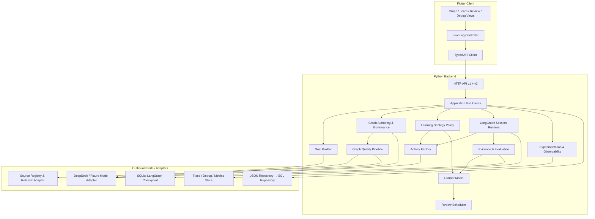
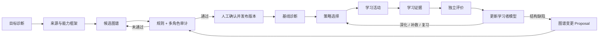
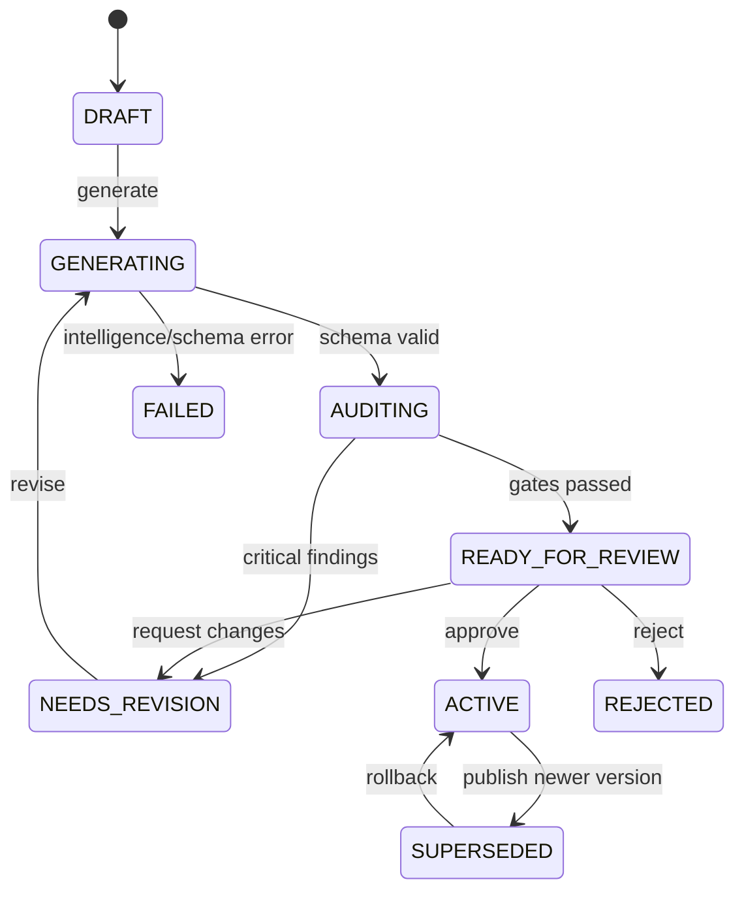
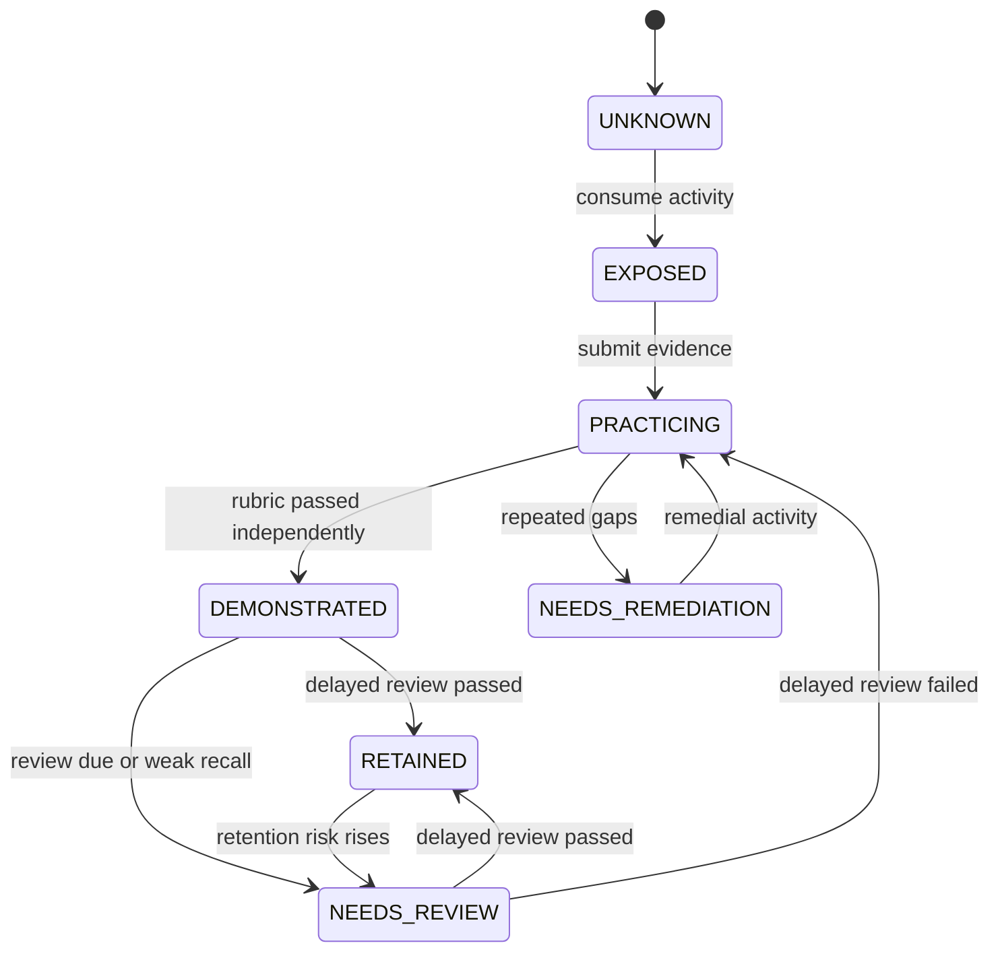
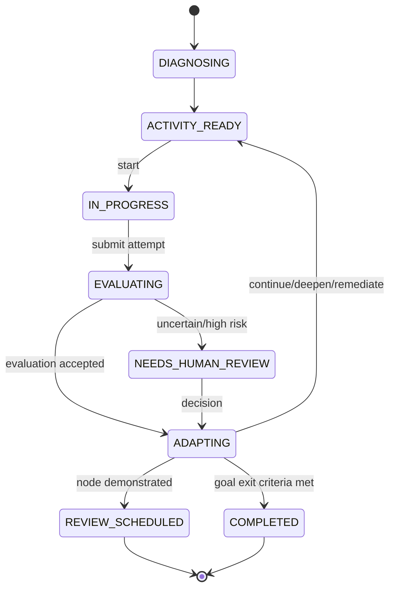
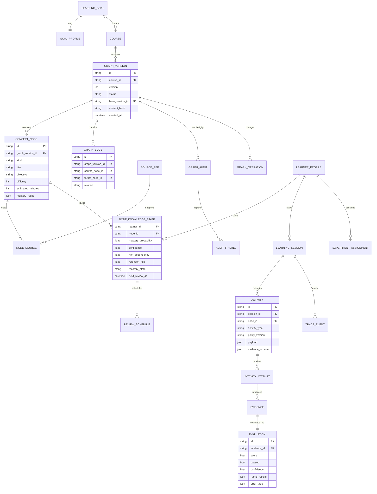
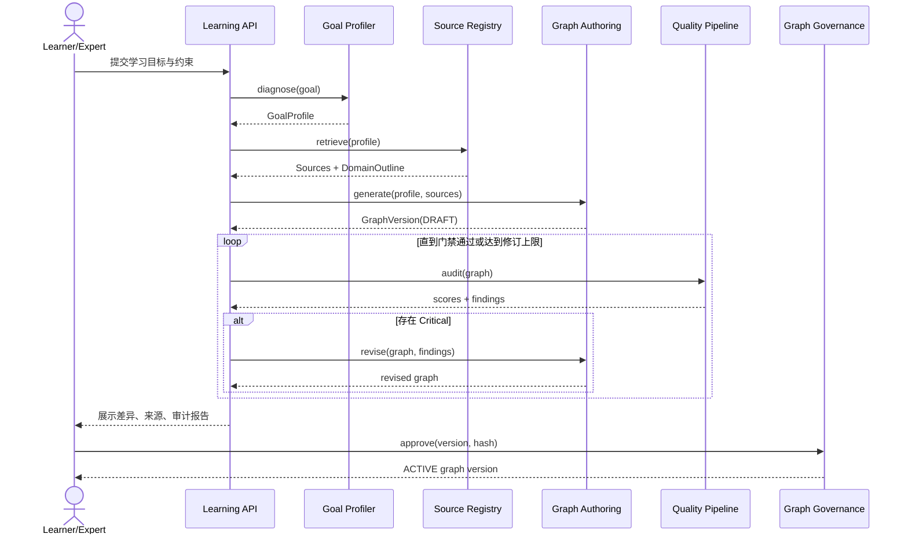
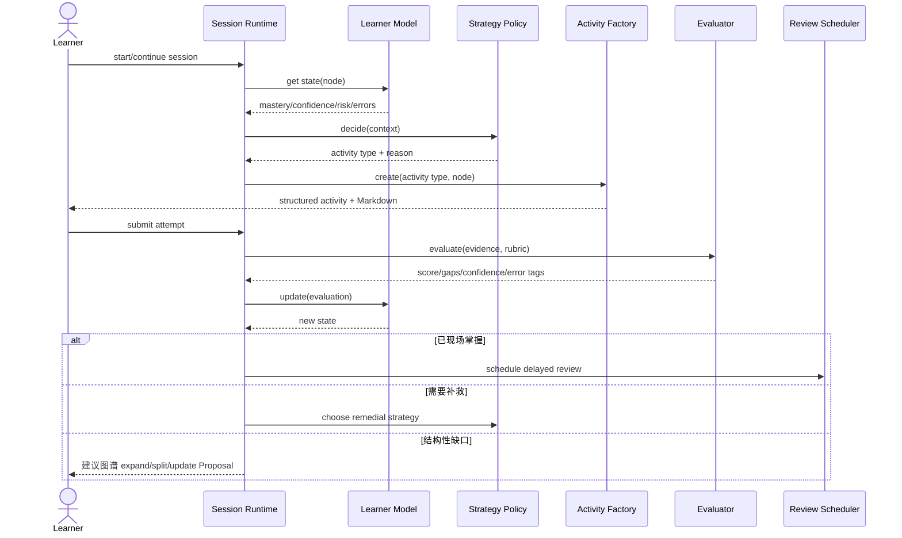

# 技术方案：自适应知识图谱学习系统（Learning Loop 2.0）

**创建日期**：2026-08-08
**存放路径**：`Plans/技术方案/2026-08-08-自适应知识图谱学习系统架构设计.md`
**状态**：已采纳（2026-08-08，用户确认开始落地并确认首个 8 点 Scope）
**lifecycle_state**：architecture
**实现仓库**：`/Users/wanglongxiang/git/knowledge_graph_learning`
**平台**：Flutter 客户端 + Python 服务端 + LangGraph 编排 + DeepSeek 出站适配器
**关联需求（真理源）**：`Plans/需求分析/2026-08-08-图谱质量审计.md`；当前已采纳范围为 US-001～US-003 的图谱质量与版本治理。

---

## 一、执行摘要

当前系统已具备图谱生成、节点学习、证据评价、图谱增删改拆、人工确认和调试日志，但核心学习闭环仍有两个结构性缺口：

1. **图谱只有“生成”，没有“质量保证链”**：当前模型固定生成 6–12 个节点、严格单根树，节点只有标题，无法表达跨分支依赖、学习目标、误区、评价量规与来源，也没有覆盖度和可学习性审计。
2. **学习只有“内容 + 问题 + 评价”，没有“教学策略系统”**：所有节点的学习过程近似同构，缺乏诊断、示例演练、情境模拟、检索练习、教回法、错因修复、微项目和间隔复习。

本方案不承诺“绝对保证学习效果”，而是把学习效果变成可审计、可测量、可持续优化的系统能力：

- 图谱发布前必须通过**来源、覆盖、依赖、粒度、可评估性**五类门禁；
- 每个知识节点必须绑定目标、误区、活动能力和掌握证据；
- 每次活动由可解释策略选择，而非随机换皮；
- 每次作答形成 Evidence，独立评价后更新 Learner Model；
- 系统使用即时表现、迁移任务和延迟保持共同衡量学习效果；
- 图谱和策略均版本化，可灰度、回滚和复盘。

**推荐方案**：保留现有 Flutter/Python/LangGraph 技术栈，新增模块化的 Graph Quality Pipeline、Learner Model、Strategy Policy、Activity Factory、Review Scheduler 和 Experimentation，不做大重写。

---

## 二、背景与目标

### 2.1 已确认问题

| ID | 问题 | 当前证据 | 业务影响 |
|---|---|---|---|
| P-01 | 图谱不够缜密、完整 | 图谱被约束为 6–12 节点严格树；节点仅有 `id/title` | 目标覆盖、先修关系、误区和评价标准不可验证 |
| P-02 | 学习方式单一、乏味 | 单个 `LearningActivity` 只有 `content/insight/question/rubric` | 不同知识类型复用同一交互，参与感和迁移能力弱 |
| P-03 | 效果评价过窄 | 当前主要用单次答案的 pass/score 更新 percent | 容易把短时答对误判为稳定掌握 |
| P-04 | 图谱演进缺少版本治理 | 有 expand/split/update/delete + HITL，但直接面向当前图 | 难以比较版本、灰度、审计和一键回滚 |

### 2.2 架构目标

- 建立从目标诊断、来源约束、候选图谱、多重审计到人工发布的图谱质量链。
- 支持至少 8 类可组合学习活动，并基于知识类型、学习者状态和历史效果选择活动。
- 建立可解释的节点级学习者模型，区分“接触、练习、当场掌握、延迟保持”。
- 保留节点扩展、拆分、更新、删除，全部以版本化 Proposal 方式执行。
- 端到端记录智能体、Skill、工具、数据交换、策略决策和模型版本，支持 Debug 与实验分析。
- 以兼容演进方式交付，现有 `/api/learning/*` 在迁移期继续可用。

### 2.3 成功指标

以下为试运行门槛，最终阈值需结合目标用户和基线数据确认：

| 维度 | 指标 | 试运行门槛 |
|---|---|---|
| 图谱覆盖 | 目标能力被节点与评价覆盖的比例 | ≥ 95% |
| 可评估性 | 激活节点拥有 objective、rubric、evidence policy | 100% |
| 来源可追溯 | 核心事实节点至少关联一个有效来源 | ≥ 90% |
| 图谱质量 | 发布版本 Critical 审计问题 | 0 |
| 近期学习 | 与现有单一问答相比，迁移任务通过率 | +10 个百分点（试验目标） |
| 保持效果 | 与现有流程相比，7 日延迟保持分 | +15%（相对提升目标） |
| 学习独立性 | 单位掌握节点的提示依赖 | 下降 20%（相对目标） |
| 体验 | 活动完成率、主动继续率 | 不低于基线且持续提升 |

### 2.4 非目标

- 不追求一次生成“全世界最完整”的知识图谱。
- P0/P1 不训练基础模型，也不立即上 Deep Knowledge Tracing。
- P0 不建设排行榜、社区、直播课堂或完整 LMS。
- P0 不要求生成视频、3D 或实时语音；先把文本、代码、卡片和场景交互做扎实。
- AI 不替代学科专家；高风险领域仍需专家确认来源和发布版本。

---

## 三、设计原则

| 原则 | 本方案落实方式 |
|---|---|
| SRP | 图谱生成、图谱审计、策略选择、活动生成、证据评价分别建模 |
| OCP | Activity Handler 与 Audit Rule 使用注册表扩展，不修改主流程 |
| DIP | Application 依赖 `IntelligencePort/SourcePort/RepositoryPort`，不依赖 DeepSeek、JSON 或 SQLite 细节 |
| ISP | 拆分 GraphAuthoring、Evaluation、Tutor、Source 等小端口，避免单一巨型智能接口 |
| DRY | 统一节点、证据、评价、错误响应和追踪 Envelope |
| KISS | 先使用规则 + 贝叶斯式状态更新；数据量足够后再评估 DKT |
| YAGNI | 保留本地单用户部署，不提前引入 Kafka、微服务或分布式图数据库 |
| 可解释优先 | 每次推荐和策略选择必须返回 reason、inputs、policy_version |
| 证据优先 | “看过内容”不是掌握；必须由活动尝试和评价证据推动状态 |

---

## 四、约束、假设与待确认

### 4.1 当前约束

- 客户端为 Flutter，已使用 `flutter_markdown_plus` 展示模型 Markdown。
- 服务端为 Python，现有分层为 API → Application → Domain → Infrastructure。
- LangGraph 已承载四个角色和 checkpoint/HITL；DeepSeek 是生产智能适配器。
- 当前持久化为本地 JSON 文件、SQLite checkpoint、JSONL Debug Event，适合单用户原型。
- 当前工作区存在未提交改动；本方案仅新增架构文档，不修改产品代码。

### 4.2 架构假设

- 第一阶段仍以单用户、本地优先为主，但所有学习数据都保留 `learner_id`，避免后续破坏性迁移。
- 学习主题可能跨多个领域，来源可信度由 Source Policy 按领域配置。
- 允许图谱生成是异步长任务；交互式活动生成和评价需要短响应。
- 模型输出始终经过 schema validation，不能把原始模型 JSON 直接写入领域库。

### 4.3 待确认

1. 首批目标用户是开发者、学生、职场学习者还是通用用户？
2. 首批重点领域是什么，哪些内容必须使用官方/学术一手来源？
3. 学习结果优先级是知识理解、考试成绩、项目产出还是岗位能力？
4. 是否长期保持本地单用户，还是需要账户、多设备同步和团队课程？
5. 可接受的单次图谱生成时延、每小时模型成本和离线能力要求是什么？
6. 首期是否需要语音、图片或代码沙箱；若需要，其安全与成本边界是什么？
7. 延迟保持的默认复习周期采用 1/3/7/14/30 日，还是允许用户/领域自定义？

---

## 五、目标架构

### 5.1 总体架构



### 5.2 核心闭环



### 5.3 模块边界

| 模块 | 职责 | 主要输入 / 输出 | 依赖 |
|---|---|---|---|
| Goal Profiler | 把自然语言目标转成受众、现状、期望能力、时间和约束 | GoalRequest → GoalProfile | IntelligencePort |
| Source Grounding | 管理来源、可信度、内容摘要与引用 | GoalProfile → SourceRef[] / DomainOutline | SourcePort |
| Graph Authoring | 生成候选节点与多类型边；处理增删改拆 Proposal | Profile + Sources → GraphVersion Draft | IntelligencePort, GraphRepo |
| Graph Quality | 执行确定性校验和 LLM Critic 审计，汇总问题 | GraphVersion → GraphAudit | AuditRuleRegistry, IntelligencePort |
| Graph Governance | 图谱版本、人工决策、乐观锁、发布与回滚 | Proposal/Decision → ActiveVersion | GraphRepo, EventStore |
| Learner Model | 维护节点掌握、信心、提示依赖、保持风险、错因 | Evidence/Evaluation → KnowledgeState | LearnerStateRepo |
| Strategy Policy | 根据节点类型、学习状态、近期历史选择教学策略 | PolicyContext → StrategyDecision | Learner Model, ExperimentPort |
| Activity Factory | 由策略生成结构化活动和 Markdown 展示内容 | StrategyDecision → Activity | HandlerRegistry, IntelligencePort |
| Session Runtime | 驱动诊断、活动、评价、适应和 HITL 状态流转 | Commands/Events → SessionState | LangGraph, Checkpointer |
| Evidence & Evaluation | 校验证据、独立评分、识别错因和不确定性 | Attempt → Evaluation | EvaluatorPort, Rubric |
| Review Scheduler | 生成间隔复习、交错练习与到期队列 | KnowledgeState → ReviewSchedule[] | SchedulerPolicy |
| Experimentation | 分流策略版本，计算学习与体验指标 | Assignment + Events → Metrics | EventStore |
| Observability | 记录 agent/skill/tool/data/policy/model 全链路日志并脱敏 | TraceEvent → Debug/Metric Query | TraceStore |

### 5.4 端口拆分

现有 `LearningIntelligence` 同时承担图谱、推荐、教学、问答、评价和图谱操作。v2 拆为：

```text
GoalProfilerPort
GraphAuthoringPort
GraphCriticPort
TutorPort
ActivityGenerationPort
EvidenceEvaluatorPort
SourceRetrievalPort
GraphRepositoryPort
LearnerStateRepositoryPort
ExperimentPort
TracePort
```

这样可以为关键评价使用不同模型或确定性逻辑，也能独立测试、缓存和降级。

---

## 六、图谱质量设计

### 6.1 从严格树升级为类型化属性图

当前严格树适合视觉分层，但不能表达跨分支先修、对比、应用和证据关系。v2 使用**类型化属性图**：

- `decomposes_to`：父主题到子主题，保持层级展示；
- `prerequisite_of`：掌握先后约束，可跨层级；
- `related_to`：概念关联，不阻塞学习；
- `contrasts_with`：用于辨析；
- `applies_to`：知识到应用/任务；
- `assessed_by`：节点到评价任务。

UI 默认展示 `decomposes_to` 骨架，其余边按需开关，避免视觉噪声。

### 6.2 丰富节点契约

```json
{
  "id": "node-json-rpc",
  "title": "JSON-RPC 消息模型",
  "kind": "concept",
  "objective": "能够解释并构造 request、response 与 notification",
  "key_questions": ["三种消息如何区分？"],
  "misconceptions": ["所有消息都必须返回 response"],
  "difficulty": 2,
  "estimated_minutes": 25,
  "activity_capabilities": ["worked_example", "retrieval", "error_diagnosis", "mini_project"],
  "mastery_rubric": [
    {"criterion": "识别消息类型", "weight": 0.4},
    {"criterion": "构造合法消息", "weight": 0.6}
  ],
  "source_refs": ["src-mcp-spec-jsonrpc"],
  "status": "active"
}
```

### 6.3 质量流水线

| 阶段 | 检查 | 执行者 | 失败处理 |
|---|---|---|---|
| Schema Gate | ID、字段、枚举、引用完整 | 确定性 validator | 直接拒绝 |
| Structural Gate | 无环 prerequisite、根/孤儿、重复节点、边合法 | 确定性 validator | 直接拒绝 |
| Coverage Audit | Goal Capability 是否被节点和评价覆盖 | Coverage Critic | 自动修订，最多 N 轮 |
| Granularity Audit | 节点是否过大、过碎、难以独立掌握 | Learnability Critic | 产生 split/merge 建议 |
| Dependency Audit | 先修、顺序和跨分支关系是否合理 | Dependency Critic | 修订边或标记争议 |
| Source Audit | 核心事实是否有可信来源、来源是否过期 | Source Critic + rules | 降级可信度或阻止发布 |
| Assessment Audit | Objective、Activity、Rubric、Evidence 是否对齐 | Alignment Critic | 补齐评价任务 |
| Human Review | 查看差异、来源、风险和审计报告 | 用户/专家 | approve / request_changes / reject |

### 6.4 图谱版本状态机



所有 expand/split/update/delete 都创建基于 `base_version` 的新草稿；根节点删除继续禁止，删除内部节点必须显式提供子节点迁移策略。

### 6.5 质量决策契约

质量流水线不能只返回一个无序的 `findings` 数组。`GraphAudit` 必须同时给出统一的发布决策和按用途分区的问题，避免 Application、模型 Adapter 与 Flutter 分别解释 severity：

```json
{
  "status": "needs_revision",
  "publish_decision": {
    "allowed": false,
    "blocking_count": 2,
    "advisory_count": 5
  },
  "blocking_findings": [
    {"severity": "critical", "code": "LEAF_MASTERY_RUBRIC_MISSING", "node_id": "node-tools"}
  ],
  "advisory_findings": [
    {"severity": "warning", "code": "NODE_SOURCE_MISSING", "node_id": "node-tools"}
  ],
  "findings": []
}
```

约束如下：

- `publish_decision.allowed` 只由 Quality Pipeline 计算；当前规则为 `blocking_findings.isEmpty`。
- 自动修订只接收 `blocking_findings`，warning 不消耗有限修订轮次；已有的非空来源和合格字段必须保留。
- `findings` 是兼容字段，必须以 critical 优先、warning 次之的稳定顺序输出；API 错误、Debug 和审计卡共享同一顺序。
- Flutter 只展示后端决策，不自行决定是否可发布；有限空间先展示 blocking，再汇总 advisory 数量。
- `NODE_SOURCE_MISSING` 在当前已确认 US-001 Scope 中是 advisory。引入 Source Grounding 后，由 Source Policy 根据节点类型、领域风险和核心事实属性决定哪些来源问题升级为 blocking，禁止全局硬编码“无 URL 即 Critical”。
- 达到修订上限仍失败时，错误主因只列 blocking code；advisory 单独展示，不能遮蔽真实失败原因。

---

## 七、多样化学习策略设计

### 7.1 活动类型

| activity_type | 适用场景 | 主要证据 |
|---|---|---|
| `socratic_dialogue` | 概念辨析、因果推理 | 推理链、关键概念使用 |
| `worked_example` | 新技能首次接触 | 分步理解、变式迁移 |
| `scenario_simulation` | 决策、沟通、系统设计 | 决策质量、后果解释 |
| `teach_back` | 检查是否真正理解 | 准确性、结构、类比质量 |
| `retrieval_practice` | 强化记忆和快速提取 | 无提示回忆、反应质量 |
| `error_diagnosis` | 消除稳定误区 | 错因定位、修复方案 |
| `mini_project` | 综合应用和迁移 | 可运行/可验证产物 |
| `spaced_review` | 延迟保持 | 延迟回忆、信心校准 |

每种类型由独立 `ActivityHandler` 定义 input schema、生成规则、UI renderer、evidence schema 和 evaluator。新增类型只需注册，不修改 Session Runtime。

### 7.2 策略选择

策略不是随机“换玩法”，而是受约束的决策：

```text
PolicyContext =
  node.kind + node.objective + activity_capabilities
  + mastery_probability + confidence + retention_risk
  + recent_activity_types + error_tags + hint_dependency
  + time_budget + accessibility_preferences
  + experiment_assignment
```

优先规则示例：

- 首次接触且难度高：`worked_example → variation → independent_attempt`；
- 自评高但客观分低：`error_diagnosis` 或 `teach_back`；
- 已掌握但保持风险高：`spaced_review`，并与其他主题交错；
- 多次失败且提示依赖高：降低跨度、换表征、补先修节点；
- 概念已掌握但迁移不足：`scenario_simulation` 或 `mini_project`。

每次决策落库：`policy_version`、候选策略、约束、选中原因和实验分组。

### 7.3 学习者模型

P0 使用可解释状态模型，不使用需要大量序列数据的黑盒 DKT：

```json
{
  "learner_id": "local-user",
  "node_id": "node-json-rpc",
  "mastery_probability": 0.72,
  "confidence": 0.55,
  "mastery_state": "demonstrated",
  "attempt_count": 4,
  "hint_dependency": 0.25,
  "error_tags": ["notification_requires_response"],
  "last_practiced_at": "2026-08-08T10:00:00+08:00",
  "retention_risk": 0.31,
  "next_review_at": "2026-08-11T10:00:00+08:00"
}
```

### 7.4 掌握状态机



### 7.5 会话状态机



---

## 八、数据模型

### 8.1 ER 图



### 8.2 字段定义

| 实体 | 关键字段 | 类型 | 必填 | 说明 |
|---|---|---|---|---|
| `GoalProfile` | audience/current_level/target_capabilities/time_budget/constraints | JSON | 是 | 图谱和策略的输入真理源 |
| `GraphVersion` | id/course_id/version/status/base_version_id/content_hash | object | 是 | 图谱不可原地覆盖 |
| `ConceptNode` | kind/title/objective/key_questions/misconceptions/difficulty/activity_capabilities/mastery_rubric | object | 是 | 可教、可练、可评的最小单元 |
| `GraphEdge` | source/target/relation/weight | object | 是 | relation 使用受控枚举 |
| `SourceRef` | uri/title/publisher/retrieved_at/trust_tier/content_hash | object | 是 | 支持过期检测和引用审计 |
| `GraphAudit` | rule_set_version/status/scores/findings | object | 是 | 记录每次审计结果 |
| `LearnerProfile` | learner_id/preferences/accessibility/timezone | object | 是 | P0 默认 `local-user` |
| `NodeKnowledgeState` | mastery_probability/confidence/state/hint_dependency/error_tags/retention_risk | object | 是 | 由证据更新，不由页面浏览更新 |
| `Activity` | type/payload/policy_version/evidence_schema/model_version | object | 是 | payload 为按类型校验的 tagged union |
| `ActivityAttempt` | answer/hints_used/duration/context | object | 是 | 原始行为记录，不可覆盖 |
| `Evidence` | kind/content_ref/normalized_features | object | 是 | 评价输入，可关联产物 |
| `Evaluation` | score/passed/confidence/rubric_results/error_tags | object | 是 | 低 confidence 不能直接推进掌握 |
| `ReviewSchedule` | due_at/interval/status/reason | object | 是 | 支持间隔复习和交错选择 |
| `GraphOperation` | type/base_version/diff/migration/risks/status | object | 是 | expand/split/update/delete 的统一变更单 |
| `TraceEvent` | trace_id/span_id/category/actor/input_ref/output_ref/duration/model/tool | object | 是 | payload 默认脱敏，支持 Debug 页面 |

### 8.3 持久化策略

- P0：继续 JSON Repository + SQLite checkpoint，新增 repository interface 和 schema version。
- P1：GraphVersion、ActivityAttempt、Evidence、Evaluation 采用 append-only 记录，派生状态可重建。
- 多用户/多设备成为明确需求后，再迁移 PostgreSQL；不在当前阶段引入图数据库。
- 大文本和学习产物保存为 content-addressed object，领域表只存 `content_ref` 与 hash。

---

## 九、API Schema / 接口契约

### 9.1 通用 Envelope

成功：

```json
{
  "data": {},
  "meta": {"request_id": "req-123", "schema_version": "2.0"}
}
```

失败：

```json
{
  "error": {
    "code": "GRAPH_AUDIT_FAILED",
    "message": "图谱仍有 2 个 Critical 问题",
    "details": {"audit_id": "audit-123"},
    "retryable": false
  },
  "meta": {"request_id": "req-123", "schema_version": "2.0"}
}
```

所有写操作接受 `Idempotency-Key`；图谱变更还接受 `If-Match: <content_hash>` 实现乐观并发控制。

### 9.2 API 列表

| 方法 | 路径 | 说明 | 幂等 |
|---|---|---|---|
| POST | `/api/v2/learning/goals/diagnose` | 创建目标诊断 | 是，Idempotency-Key |
| POST | `/api/v2/learning/courses/drafts` | 异步生成候选图谱 | 是 |
| GET | `/api/v2/operations/{operation_id}` | 查询长任务状态 | 是 |
| POST | `/api/v2/learning/graph-versions/{id}/audits` | 执行质量审计 | 是，按 hash 去重 |
| POST | `/api/v2/learning/graph-versions/{id}/decisions` | approve/request_changes/reject | 是 |
| GET | `/api/v2/learning/courses/{course_id}/graph` | 获取激活版本或指定版本 | 是 |
| POST | `/api/v2/learning/graph-operations` | 提议 expand/split/update/delete | 是 |
| POST | `/api/v2/learning/graph-operations/{id}/decisions` | 审批图谱变更 | 是 |
| POST | `/api/v2/learning/sessions` | 开始诊断/学习会话 | 是 |
| POST | `/api/v2/learning/sessions/{id}/activities/next` | 选择并生成下一活动 | 是，按 session revision |
| POST | `/api/v2/learning/activities/{id}/attempts` | 提交活动尝试 | 是 |
| POST | `/api/v2/learning/evidence/{id}/evaluate` | 独立评价证据 | 是 |
| GET | `/api/v2/learning/learner-state` | 查询学习者模型 | 是 |
| GET | `/api/v2/learning/reviews/due` | 查询到期复习 | 是 |
| GET | `/api/v2/learning/debug/events` | 按 trace/category/actor 查询日志 | 是 |

迁移期保留现有 `/api/learning/*`，由 v1 Facade 调用新 Application Use Case，直到客户端切换完成。

### 9.3 目标诊断示例

```json
{
  "goal": "两周内能够独立实现一个安全的 MCP Server",
  "current_level": "会 Python，不了解 MCP",
  "time_budget_minutes_per_day": 45,
  "desired_evidence": ["working_project", "oral_explanation"],
  "constraints": ["use_official_sources"]
}
```

```json
{
  "data": {
    "goal_profile_id": "gp-01",
    "target_capabilities": [
      {"id": "cap-protocol", "description": "解释协议与生命周期"},
      {"id": "cap-build", "description": "实现并测试 MCP Server"},
      {"id": "cap-security", "description": "识别并缓解安全风险"}
    ],
    "exit_criteria": ["项目测试通过", "延迟讲解评分 >= 0.8"]
  },
  "meta": {"request_id": "req-01", "schema_version": "2.0"}
}
```

### 9.4 图谱审计响应示例

```json
{
  "data": {
    "audit_id": "audit-01",
    "graph_version_id": "gv-03",
    "status": "needs_revision",
    "scores": {"coverage": 0.92, "source": 0.86, "learnability": 0.95, "alignment": 0.88},
    "findings": [
      {
        "severity": "critical",
        "code": "CAPABILITY_UNASSESSED",
        "node_id": "node-security",
        "message": "安全能力没有迁移型评价任务",
        "suggested_operation": "update"
      }
    ]
  },
  "meta": {"request_id": "req-02", "schema_version": "2.0"}
}
```

### 9.5 下一活动响应示例

```json
{
  "data": {
    "activity": {
      "id": "act-01",
      "type": "error_diagnosis",
      "node_id": "node-json-rpc",
      "content_markdown": "## 找出协议错误\n\n下面的 notification 为什么不合法？",
      "payload": {"artifact": "{...}", "questions": ["指出错误", "给出修复"]},
      "evidence_schema": {"type": "object", "required": ["diagnosis", "fix"]}
    },
    "decision": {
      "policy_version": "strategy-1.0",
      "reason": "连续两次出现 notification/response 混淆，且提示依赖偏高",
      "alternatives": ["teach_back", "retrieval_practice"]
    }
  },
  "meta": {"request_id": "req-03", "schema_version": "2.0"}
}
```

### 9.6 错误码

| code | HTTP | 含义 | 客户端处理 |
|---|---:|---|---|
| `INVALID_GOAL_PROFILE` | 422 | 目标信息不足或冲突 | 定位字段并补充 |
| `SOURCE_COVERAGE_INSUFFICIENT` | 422 | 核心节点来源不足 | 展示缺口，允许补来源 |
| `GRAPH_AUDIT_FAILED` | 409 | Critical 问题未清零 | 展示审计报告，不允许发布 |
| `GRAPH_VERSION_CONFLICT` | 409 | base version/hash 已过期 | 拉取最新差异后重提 |
| `ROOT_NODE_DELETE_FORBIDDEN` | 422 | 禁止删除图谱根 | 禁用确认并解释 |
| `INVALID_ACTIVITY_TRANSITION` | 409 | 会话状态不允许当前操作 | 刷新会话状态 |
| `EVIDENCE_SCHEMA_INVALID` | 422 | 提交证据不符合活动 schema | 标出缺失字段 |
| `EVALUATION_UNCERTAIN` | 202 | 评价置信不足 | 进入复评或人工确认 |
| `REVIEW_NOT_DUE` | 409 | 复习尚未到期 | 显示下次时间，可手动练习 |
| `LLM_NOT_CONFIGURED` | 503 | 模型配置缺失 | 打开设置入口 |
| `INTELLIGENCE_OUTPUT_INVALID` | 502 | 模型输出未通过校验 | 可重试并保留 trace_id |
| `RUNTIME_CONFLICT` | 409 | checkpoint/revision 冲突 | 恢复最新 checkpoint |

---

## 十、关键流程

### 10.1 图谱生成与发布



### 10.2 自适应学习



---

## 十一、非功能约束

| 维度 | 约束 | 验证方式 |
|---|---|---|
| 交互性能 | 已缓存条件下，下一策略选择 P95 < 500ms；含模型活动生成 P95 < 4s | 压测 + trace span |
| 评价性能 | 文本证据评价 P95 < 6s | 回放基准集 |
| 长任务 | 图谱生成/审计以 operation 异步执行，单轮超时 60s，总修订轮数有上限 | 超时/取消/恢复测试 |
| 可用性 | 所有长流程 checkpoint；重启后可从最近一致状态恢复 | 故障注入测试 |
| 一致性 | 图谱版本乐观锁；写 API 幂等；Evidence 不可覆盖 | 并发与重放测试 |
| 安全 | API Key 不进入响应/日志；Debug payload 递归脱敏；内容渲染禁用危险 HTML | secret scan + UI 安全测试 |
| 隐私 | 学习答案、偏好和调试内容可配置保留期；导出/删除范围可识别 | 数据清单审计 |
| 可审计 | 每次模型/工具/策略调用记录版本、输入输出引用、耗时和 trace_id | 端到端 trace 完整率 100% |
| 质量 | 领域对象只接受 schema-valid 输出；Critical Graph Finding 阻止发布 | contract/property tests |
| 兼容 | v1 API 在客户端完成切换前可用；v2 使用独立 schema_version | 双版本契约测试 |
| 成本 | 每会话记录 token/cost；策略支持模型分级与缓存 | 成本看板和预算告警 |
| 无障碍 | 活动必须提供键盘操作、文本替代和非颜色状态表达 | Flutter accessibility test |

---

## 十二、可观测性与 Debug

Debug 入口面向**本 App**，统一展示以下事件：

| category | 示例 |
|---|---|
| `agent` | GraphCurator、Planner、Tutor、Evaluator 开始/结束/失败 |
| `skill` | Skill 名称、版本、输入引用、输出摘要、耗时 |
| `tool` | 工具名、参数摘要、结果摘要、错误与重试 |
| `llm` | provider/model/prompt_version/token/latency/schema validation |
| `data` | API request/response、repository read/write、checkpoint |
| `policy` | 候选活动、约束、选择原因、policy_version |
| `graph` | audit、finding、proposal、version diff、human decision |
| `evaluation` | rubric score、confidence、error tags、state delta |

事件必须共享 `trace_id`，父子调用使用 `span_id/parent_span_id`。默认只存脱敏摘要，用户明确开启“详细 Payload”后才记录内容，并显示隐私提示与清除按钮。

---

## 十三、ADR

| ADR ID | 决策 | 备选与取舍 | 影响范围 | 状态 |
|---|---|---|---|---|
| ADR-001 | 图谱采用不可变版本，不原地覆盖 | 原地修改简单但不可审计/回滚 | Graph Governance、Repo、UI | 已采纳 |
| ADR-002 | 领域模型使用类型化属性图，展示层保留树骨架 | 严格树简单但表达力不足；通用图数据库当前过重 | Graph、UI、Validator | 待确认 |
| ADR-003 | 确定性 Gate + 多角色 LLM Critic 共同质检 | 仅 Prompt 无稳定门禁；纯规则难判断语义覆盖 | Quality Pipeline | 已采纳（当前先交付确定性 Gate） |
| ADR-004 | 教学活动采用 Policy + Handler Registry | 单一 Tutor 简单但不可针对知识类型优化 | Strategy、Activity、UI | 待确认 |
| ADR-005 | P0 使用可解释规则/贝叶斯式学习者模型 | DKT 潜力高但当前缺训练数据且难解释 | Learner Model | 待确认 |
| ADR-006 | Attempt/Evidence/Evaluation 采用 append-only，状态为派生结果 | 直接更新 percent 简单但丢失学习证据 | Data、Evaluation | 待确认 |
| ADR-007 | 保留 Flutter/Python/LangGraph/DeepSeek 现有栈 | 重写收益不足且增加交付风险 | 全系统 | 已采纳 |
| ADR-008 | 新能力通过 v2 API 和 Facade 渐进迁移 | 大爆炸替换会中断现有功能 | API、Client | 已采纳（当前由 v1 Facade 兼容） |
| ADR-009 | P0 不引入图数据库和消息队列 | SQL/JSON 已足够；基础设施复杂度暂不成立 | Infrastructure | 已采纳 |
| ADR-010 | Graph Quality 输出统一发布决策、blocking/advisory 分区和稳定顺序 | 扁平 findings 会让编排、模型和 UI 重复解释 severity，产生修订偏移和诊断遮蔽 | Quality Pipeline、Application、API、Flutter | 已采纳（2026-08-08 架构复审补充） |

---

## 十四、需求影响矩阵

> RQ-G01～RQ-G04 已映射到正式需求与已确认 Backlog；其余编号仍属于后续架构候选范围。

| 需求 ID | 影响模块 | API / 状态 / 数据契约 | ADR | 故事拆分约束 |
|---|---|---|---|---|
| RQ-G01 图谱完整性可审计 | Goal、Graph、Quality | GraphAudit/Findings/版本状态机 | 001/002/003 | 先交付确定性 Gate，再接 Critic |
| RQ-G02 图谱质量事实可见 | Graph、Quality、Flutter | GraphVersion/GraphAudit/审计卡 | 001/003/008 | 旧课程必须兼容 unavailable |
| RQ-G03 节点变更生成重审计版本 | Graph Governance、Quality | GraphOperation/base_version/GraphAudit | 001/003/008 | 保留根删除禁令和进度迁移 |
| RQ-G04 历史图谱可非破坏性回滚 | Graph Governance、Repo、Flutter | GraphSnapshot/active_version_id/回滚 API | 001/008/009 | 回滚不删除版本、证据或进度 |
| RQ-L01 学习活动多样化 | Strategy、Activity、Flutter | Activity tagged union/Renderer | 004 | 每个活动需端到端纵向交付 |
| RQ-L02 活动自适应选择 | Strategy、Learner Model | StrategyDecision/policy_version | 004/005 | 首版规则必须可解释可测试 |
| RQ-L03 间隔与交错复习 | Learner、Review | ReviewSchedule/retention state | 005/006 | 需支持时间测试与人工提前练习 |
| RQ-E01 学习效果可验证 | Evidence、Evaluation、Experiment | Attempt/Evidence/Evaluation/Metric | 005/006 | 同时覆盖即时、迁移、延迟指标 |
| RQ-O01 全链路 Debug | Observability、全部模块 | TraceEvent/trace_id/category | 006 | 脱敏和清除能力必须同 Story 交付 |
| RQ-C01 平滑兼容现有 App | API、Flutter | v1 Facade + v2 Envelope | 007/008 | 禁止大爆炸下线 v1 |

---

## 十五、方案选项与决策矩阵

| 方案 | 图谱质量 | 学习多样性 | 复杂度 | 演进性 | 主要风险 |
|---|---|---|---|---|---|
| A. 只优化 Prompt | 低—中 | 低 | 低 | 低 | 输出波动仍不可审计，无法建立效果闭环 |
| B. 模块化闭环（推荐） | 高 | 高 | 中 | 高 | 需要新增领域契约与迁移层 |
| C. 直接训练个性化模型/DKT | 潜在高 | 高 | 很高 | 中 | 数据不足、不可解释、验证周期长 |

**推荐 B**：它解决的是系统性缺口，同时复用现有技术栈；A 可作为局部优化但不能独立成为方案；C 仅在积累足够匿名化学习序列、建立离线基准和获得明显收益证据后再立项。

---

## 十六、上线、迁移与回滚

### 16.1 发布策略

1. 先补齐 trace、基线指标和 v2 schema，不改变用户路径。
2. 通过 `graph_quality_v2` 开关启用丰富节点和审计；旧课程继续读取 v1。
3. 通过 `adaptive_activity_v2` 开关启用前四类活动和策略解释。
4. 启用 Learner Model 与 Review Queue；双写期间核对 v1 progress 与 v2 state。
5. 小流量 A/B 对比现有单一问答，达门槛后逐步扩大。

### 16.2 数据迁移

- v1 Course 转换为 GraphVersion 1；原 `decomposition` 边映射为 `decomposes_to`。
- v1 Node 的 title 保留；objective/source/rubric 标记为 `needs_enrichment`，不能伪造。
- v1 percent/mastery_state 写入初始化事件 `legacy_progress_imported`，置信度设置为低。
- 每次迁移生成 manifest、content hash 和可重放日志；原 JSON 不删除。

### 16.3 回滚

- 触发：Critical 审计绕过、Evidence 丢失、P95 超阈值持续、活动错误率或用户中断率显著恶化。
- 操作：关闭对应 feature flag，客户端回到 v1 Facade；GraphVersion 回滚到上一 ACTIVE；append-only 证据保留。
- 禁止通过删除新数据回滚；回滚是“切换读取版本/策略版本”。

---

## 十七、实施计划

| 阶段 | 纵向目标 | 主要交付 | 预估 |
|---|---|---|---|
| 0. 基线与契约 | 先能测量现状 | v2 Envelope、Trace、基准任务、效果指标 | 1 Sprint |
| 1. 图谱质量 | 产出可审计图谱 | 丰富节点、类型边、GraphVersion、规则 Gate、审计 UI | 2 Sprints |
| 2. 活动多样化 | 形成有目的的多玩法 | Strategy Policy + 4 个 Activity Handler + Flutter Renderer | 2 Sprints |
| 3. 自适应闭环 | 根据证据调整教学 | Learner Model、错因、提示依赖、Review Queue | 2 Sprints |
| 4. 实验与扩展 | 证明效果并扩充策略 | A/B、延迟保持、其余 4 类活动、成本优化 | 1–2 Sprints |

实际排期必须在需求排序和 Story 拆分后确认；每个 Activity Handler 应作为可独立演示、评价、回滚的纵向 Story。

---

## 十八、测试与验收标准

### 18.1 测试策略

- Contract tests：所有模型输出、API、活动 tagged union、Evidence schema。
- Property tests：图谱引用完整、prerequisite 无环、版本不可变、幂等与重放。
- Golden tasks：固定目标、来源、图谱审计与学习轨迹，比较关键决策而非自然语言字面。
- Simulation：构造高信心低能力、提示依赖、长期未复习等学习者状态。
- Fault injection：模型超时、无效 JSON、checkpoint 恢复、版本冲突、来源失效。
- UI tests：每个活动 renderer、Markdown、安全链接、键盘/读屏、Debug 过滤。
- Learning experiment：即时分、迁移任务、7 日保持共同评估，活动完成率只作护栏指标。

### 18.2 验收清单

- [ ] ACTIVE 图谱 100% 通过 schema/structure gate，Critical finding 为 0。
- [ ] 每个可学习节点都有 objective、mastery rubric、evidence policy 和至少 2 类活动能力。
- [ ] 核心事实节点来源覆盖达到评审确认阈值，UI 可查看来源和审计时间。
- [ ] expand/split/update/delete 均生成版本差异、风险、迁移方案和人工确认；可回滚。
- [ ] 至少 4 种活动端到端可用，策略选择返回可读原因。
- [ ] “看过内容”不直接提升 mastered；独立 Evidence 和 Evaluation 才能更新状态。
- [ ] 当场掌握后会生成延迟复习，到期失败会回退到 practicing。
- [ ] Debug 可按 trace 展示 agent/skill/tool/data/policy/evaluation，并默认脱敏。
- [ ] v1 课程可继续学习，v2 可通过开关关闭。
- [ ] 关键流程具备 contract、回放、故障恢复和 Flutter widget 测试。
- [ ] 试验同时报告学习效果、体验、时延和成本，不以“对话次数”替代学习效果。

---

## 十九、下一步决策门

在进入 Story 拆分前，需要完成：

1. 将本文 7 个“待确认”转为正式需求和可测 AC。
2. 确认 ADR-001 至 ADR-009，尤其是属性图、学习者模型和 v2 迁移策略。
3. 选择首个垂直领域和 10–20 个 Golden Learning Tasks。
4. 建立现有单一问答流程的基线，避免上线后无法证明改进。
5. 再运行 `/task-splitter`，按“可独立演示的纵向价值”拆 Story。

## 续做

```text
/resume plan=Plans/技术方案/2026-08-08-自适应知识图谱学习系统架构设计.md 进度=等待需求与 ADR 评审
```

**下一阶段 Skill**：`/task-splitter`（前提：需求排序和 ADR 已确认）。

## 反馈（skill_run）

```yaml
skill_run:
  skill: architecture-design-assistant
  plan: Plans/技术方案/2026-08-08-自适应知识图谱学习系统架构设计.md
  date: 2026-08-08
  contexts_used:
    - path: Contexts/决策/Skill反馈协议.md
      utility: high
      reason: 明确了架构方案结尾的反馈结构、状态语义和缺失上下文记录方式
  contexts_missing:
    - 自适应学习系统的图谱质量与教学策略架构规范
    - 学习效果评估、延迟保持和实验指标规范
    - 已确认的目标用户、重点领域与非功能预算
  contexts_stale: []
  outcome_status: partial
  revisit_needed: true
  revisit_reason: 方案结构已完整，但需求分析和需求排序目录没有有效真理源，ADR 与指标阈值仍待产品评审
```

## 反馈（skill_run）

```yaml
skill_run:
  skill: architecture-design-assistant
  plan: Plans/技术方案/2026-08-08-自适应知识图谱学习系统架构设计.md
  date: 2026-08-08
  contexts_used:
    - path: Plans/需求分析/2026-08-08-图谱质量审计.md
      utility: high
      reason: 确认当前 Scope 中只有 Critical 阻断发布，来源缺失为 warning
    - path: Plans/Bug排查/2026-08-08-定位-图谱来源引用缺失导致质量门禁失败.md
      utility: high
      reason: 暴露扁平 findings 在修订输入和前端展示中的跨层重复解释
  contexts_missing: []
  contexts_stale: []
  workflow_stage: architecture
  outcome_status: pass
  revisit_needed: false
  notes: 新增 ADR-010 和质量决策契约，明确 blocking/advisory 分区、修订输入与展示规则。
```

## 反馈（skill_run）

```yaml
skill_run:
  skill: architecture-design-assistant
  plan: Plans/技术方案/2026-08-08-自适应知识图谱学习系统架构设计.md
  date: 2026-08-08
  contexts_used:
    - path: Plans/需求分析/2026-08-08-图谱质量审计.md
      utility: high
      reason: 将已闭环 AC1～AC11 对齐到版本治理架构
    - path: Plans/需求排序/2026-08-08-图谱质量审计.md
      utility: high
      reason: 将已确认 RQ-G01～RQ-G04 映射到模块、数据和 ADR
  contexts_missing: []
  contexts_stale: []
  workflow_stage: architecture
  outcome_status: pass
  revisit_needed: false
```
