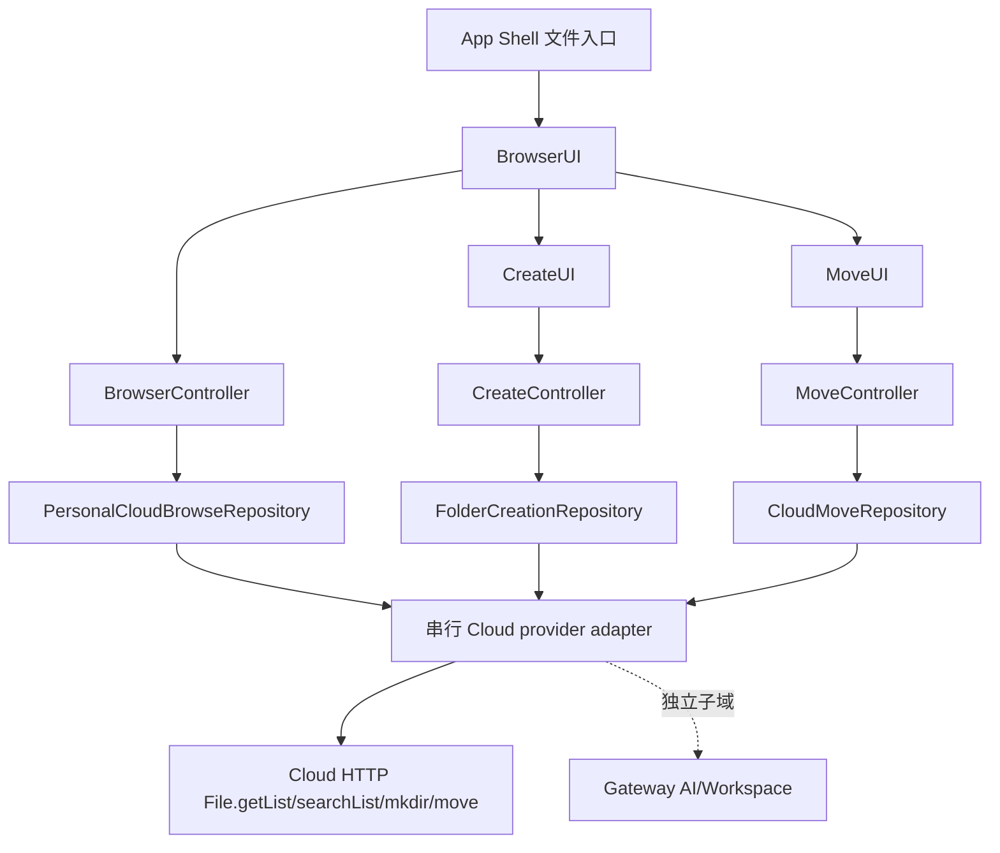
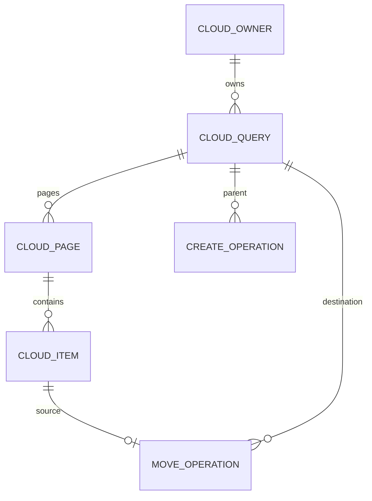
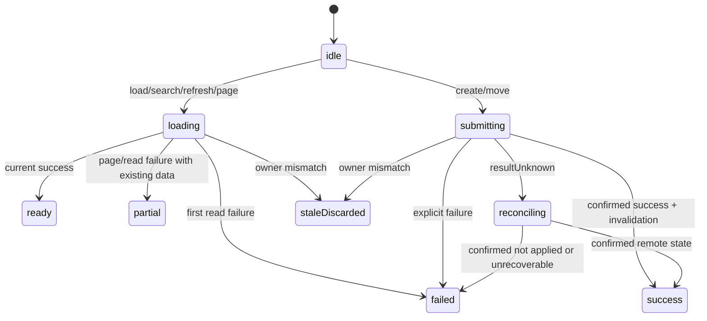

# 技术方案：个人云盘浏览、新建文件夹与移动

## 一、背景与目标

- **现状**：`CloudBrowserPage` 已接 App Shell，但 `CloudDriveRepository` 同时承载个人云盘、AI 文件、Workspace 和多个 mutation，并全部委托 Gateway filesystem；创建和移动只是输入路径的通用对话框。
- **目标**：在三张 Owned Path 中形成三个纵向能力，个人云盘只依赖 typed Cloud repository；UI 按固定 iOS 源码还原；owner、mutation 和缓存收敛符合两项 PRE。
- **非目标**：本方案不新增上传/下载/重命名/删除，不在 Feature 重写签名/Cloud token，不修改 Gateway AI/Workspace 语义。

## 二、原则对照

| 原则 | 落地 |
|------|------|
| SRP/DIP/ISP | browser、folder_creation、move 各自持有窄 Repository；View 只转发，Controller 管状态；生产 adapter 在 data/集成边界 |
| DRY | path/owner 规则保持小而显式；仅当共享路径获唯一 Owner 后再提升公共 Cloud domain，不让三个 Feature 互相 import |
| KISS/YAGNI | 不实现通用文件管理器、离线 mutation 队列或 transport 重试框架 |

## 三、约束与前提

- Flutter `3.44.8` / Dart `3.12.2`，Riverpod、GoRouter、现有 design system。
- iOS 固定视觉/行为 Oracle：`NamiWork@4d405cf...` 的 UserUpload/CreateFolder/FileMovePopup 与 Cloud HTTP API。
- Android checkout 未配置，新增 Android 事实 fail closed；目标行为使用已冻结 Android inventory/MAP/PRE。
- `lib/app/composition_root.dart`、`lib/navigation/**`、`lib/l10n/**` 和共享 Cloud transport 为串行接线队列；仍计入任务完成范围。

## 四、模块边界

| 模块 | 职责 | 公开输入/输出 | 禁止依赖 |
|------|------|---------------|----------|
| `browser/domain` | CloudOwner、目录 query/page/item、typed failure/capability、Repository | `CloudBrowseRequest -> CloudBrowseResult` | Gateway payload、Dio、iOS 类型 |
| `browser/application` | 首屏/刷新/分页/搜索/导航、generation fence、partial error、滚动/选择状态 | immutable `CloudBrowserState` | Widget context、transport |
| `browser/presentation` | iOS 列表信息架构与三档 renderer；发出 create/move intent | typed callbacks | 直接 Repository/API |
| `folder_creation/domain+application` | 名称 policy、single-flight、operation owner、结果未知/失效 | `CreateFolderCommand -> FolderCreationResult` | browser controller、Gateway |
| `folder_creation/presentation` | iOS 居中弹窗、键盘动画、草稿/错误/提交状态 | result callback | transport |
| `move/domain+application` | 目录选择、路径栈、非法目标、single-flight、reconcile、双目录失效 | `MoveCommand -> CloudMoveResult` | browser controller、Gateway |
| `move/presentation` | iOS 近全高底部弹层、drag/header/breadcrumb/list/bottom bar | result callback | transport |
| 串行 Cloud adapter | 将三个窄 Repository 映射到 Cloud HTTP/YunPan、Auth owner 和真实 root | typed contracts | 页面状态 |



## 五、数据模型



| 模型 | 关键字段 | 不变量 |
|------|----------|--------|
| `CloudOwner` | environmentId, accountId, providerId, stableId, generation | 完整相等才可提交异步结果 |
| `CloudFolderQuery` | owner, folderPath, keyword, cursor, pageSize | cursor 只属于同一 owner/folder/query |
| `CloudItem` | providerId, remoteId, name, path, kind, metadata | stable identity=`providerId+remoteId/path` |
| `CloudPage` | items, nextCursor, hasMore, totals | items 不可变；merge 按 stable identity |
| `FolderCreationState` | owner, parent, draft, phase, operationId, failure | submitting 时禁止第二命令 |
| `CloudMoveState` | owner, sources, destination stack/page, phase, operationId | 目录 source 禁止 destination=自身/后代 |

## 六、API Schema / 接口契约

### Dart 领域接口

| 方法 | 输入 | 输出 | 幂等/恢复 |
|------|------|------|-----------|
| `browse(request)` | owner+folder+keyword+cursor | `CloudPageResult` | read 可用同 query 重试 |
| `validateName(request)` | owner+name | allowed/blocked/degraded | 网络失败为 degraded，不冒充 blocked |
| `createFolder(command)` | owner+parent+trimmedName+operationId | success/failure/resultUnknown | single-flight；unknown 先 reconcile |
| `listDestinations(request)` | owner+folder+cursor | directory-only page | read 可重试 |
| `move(command)` | owner+sources+destination+operationId | success/failure/resultUnknown | single-flight；unknown 先 reconcile |
| `reconcile(operation)` | owner+source/destination | confirmedMoved/notMoved/unknown | 只读服务端真值 |
| `invalidate(keys)` | current/source/destination/search keys | completion | owner 改变后不得刷新新 owner |

### iOS wire 证据（adapter 私有）

| method | 关键参数 | Flutter 映射 |
|--------|----------|--------------|
| `File.getList` | page/page_size/path/order/field/nodetype | browse/listDestinations；adapter 产生 cursor |
| `File.searchList` | keyword/category/page/page_size 等 | browse(keyword) |
| `File.mkdir` | 完整目标目录路径 | createFolder |
| `File.move` | `src_name` 竖线连接、`new_name` 目标路径 | move |

不得在 Feature 暴露 wire method、字符串 Map、签名字段或 Cloud token。

### 统一失败

| kind | 用户/Controller 处理 |
|------|---------------------|
| denied / unauthenticated | 保留旧数据/草稿/路径，等待 owner 修复 |
| unsupported / degraded | 显式原因；不得假空成功 |
| validation / policyBlocked | 字段提示，不发 mutation |
| transport / server / codec | read 可重试；mutation 保持上下文 |
| cancelled / staleDiscarded | 不成功、不提示旧 owner 结果 |
| timeout / resultUnknown | 进入 reconcile，禁止直接重发 |

## 七、状态与关键流程



- Controller 在发起前快照 owner/query/operation；返回后先检查 owner/generation，再变更 state。
- invalidate sink 收到 source/destination/search keys；完成回调也检查原 owner。
- resize 只选择 renderer；Controller/route/draft/scroll owner 不重建。

## 八、非功能约束

| 维度 | 约束 | 验证 |
|------|------|------|
| 并发 | 重叠 read 仅最新代提交；mutation single-flight；迟到 0 回写 | deterministic pending Fake tests |
| 性能 | 页面不一次性请求无限条；分页 merge O(n) 且 stable identity 去重 | unit + 500/1000 item fixture |
| 可访问性 | 44/48pt 点击区、语义标签、键盘焦点/ESC/返回 | widget tests |
| 自适应 | 三档切换保持路径、query、draft、scroll、pending | widget/golden |
| 隐私 | 不记录 token/sign/query 正文；安全错误文案 | analyzer/review/log inspection |
| 兼容 | Android Phone/Pad/Fold、iPhone/iPad 同一业务状态 | device integration evidence |

## 九、ADR

| ADR ID | 决策 | 备选与取舍 | 影响 | 状态 |
|--------|------|------------|------|------|
| ADR-001 | 个人云盘使用独立 Cloud provider Repository | 继续复用 Gateway 简单但语义/身份/接口错误 | browser/create/move/接线 | 已采纳 |
| ADR-002 | 三张卡按 Owned Path 形成纵向模块，不继续堆入 `CloudBrowserPage` | 单文件改动快但无法独立 review/验收 | 文件结构、测试 | 已采纳 |
| ADR-003 | 以 iOS 固定源码/同状态运行结果为视觉动效主 Oracle | Material 默认样式成本低但不符合产品基线 | presentation/golden/device | 已采纳 |
| ADR-004 | mutation timeout 一律 resultUnknown→reconcile | 自动重试可能重复创建/移动 | controller/repository/tests | 已采纳 |
| ADR-005 | Flutter 收紧非法移动目标为自身+后代 | 复制 iOS 过滤会保留已知缺陷 | move | 已采纳 |
| ADR-006 | 共享 l10n/route/Cloud adapter 由唯一集成 Owner 串行修改 | 各卡直接改共享路径会产生冲突/第二事实源 | 接线队列 | 已采纳 |

## 十、需求影响矩阵

| 需求 ID | 模块 | 契约/状态 | ADR | Story 约束 |
|---------|------|-----------|-----|------------|
| BUS-046 | browser + Cloud adapter | browse/page/search/owner fence | 001/002/003/006 | 必须能用真实个人云盘演示完整浏览 |
| BUS-048 | folder_creation + policy/Cloud adapter | create/single-flight/reconcile/invalidate | 002/003/004/006 | 必须从当前目录打开、成功后列表收敛 |
| BUS-053 | move + Cloud adapter | destination browse/move/reconcile/double invalidate | 002/003/004/005/006 | 必须通过目录 UI 选择目标，不接受自由文本路径 |

## 十一、实施与回滚

1. 先锁定当前错误行为的 Red tests，再建立 browser typed owner/page contract和三档状态。
2. 在 `folder_creation/**` 完成 iOS 弹窗和 controller；在 `move/**` 完成 iOS 弹层和 controller。
3. 串行接入真实 Cloud adapter、Auth owner、l10n 和 App Shell intent；移除个人云盘的 Gateway 映射。
4. 集成/设备证据通过前三张卡保持 `PARTIAL`。

回滚以 Feature 接线为单位：恢复旧入口只用于紧急回滚，不把旧 Gateway 个人云盘标记为正确实现；无数据迁移。

## 十二、验收标准

- [ ] 三个模块仅依赖 typed contract，技术命名不含任务 ID。
- [ ] GWT-001～018 有 unit/widget/integration 映射。
- [ ] 真实个人云盘 provider 完成 list/search/create/move。
- [ ] iOS 视觉/动效代表性证据和三档 Golden 无已知偏差。
- [ ] 五形态核心链路、全仓测试与独立 reviewer 反向查漏通过。

## 反馈（skill_run）

```yaml
skill_run:
  skill: architecture-design-assistant
  workflow_stage: architecture
  plan: Plans/技术方案/2026-08-10-cloud-drive-browser-folder-move.md
  date: 2026-08-10
  contexts_used:
    - path: Contexts/需求分析/需求分析规范.md
      utility: high
      reason: "以需求事件、异常和 AC 约束模块、状态机与 API Schema"
    - path: Contexts/决策/AI-Work-Kit工作流总览.md
      utility: high
      reason: "保持 client-dev 架构阶段与后续纵向 Story、TDD 和测试门禁一致"
  contexts_missing:
    - "个人云盘 Cloud HTTP Flutter 生产 adapter 的账号 token/签名接线说明"
  contexts_stale: []
  outcome_status: pass
  revisit_needed: false
```
