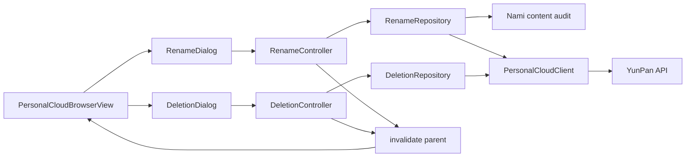
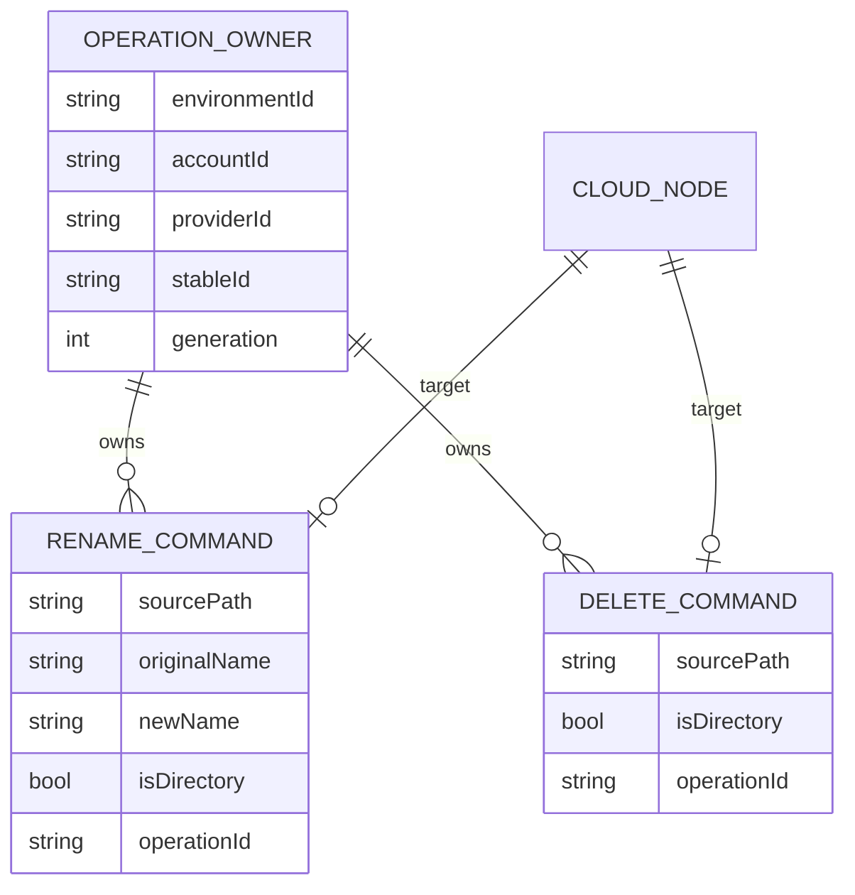
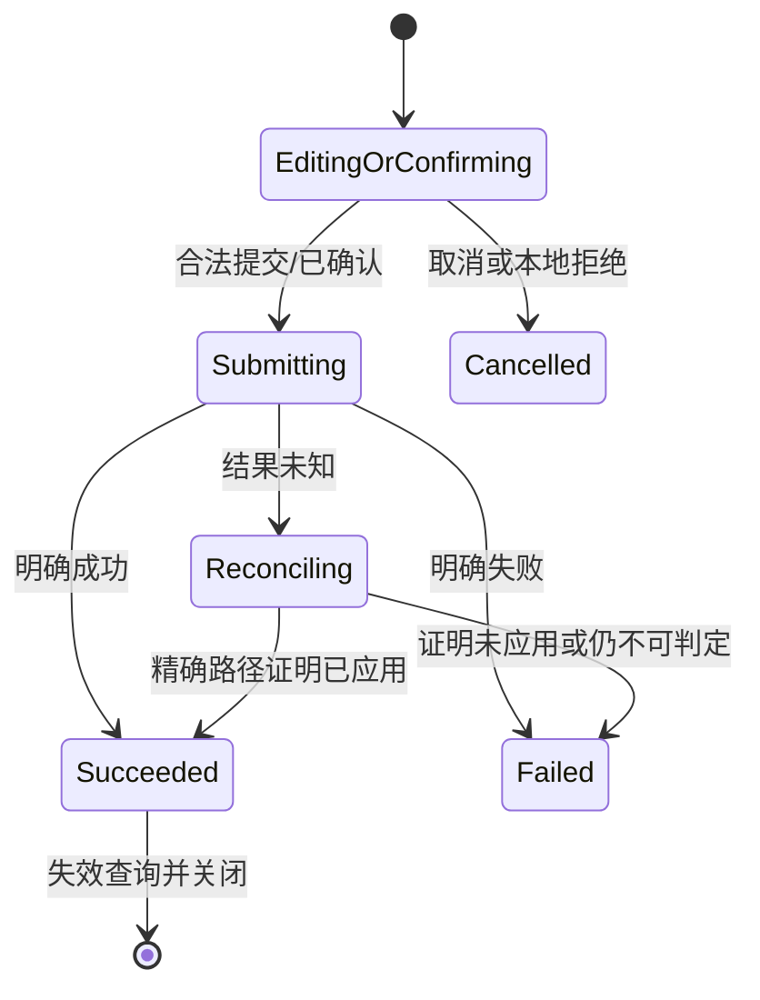
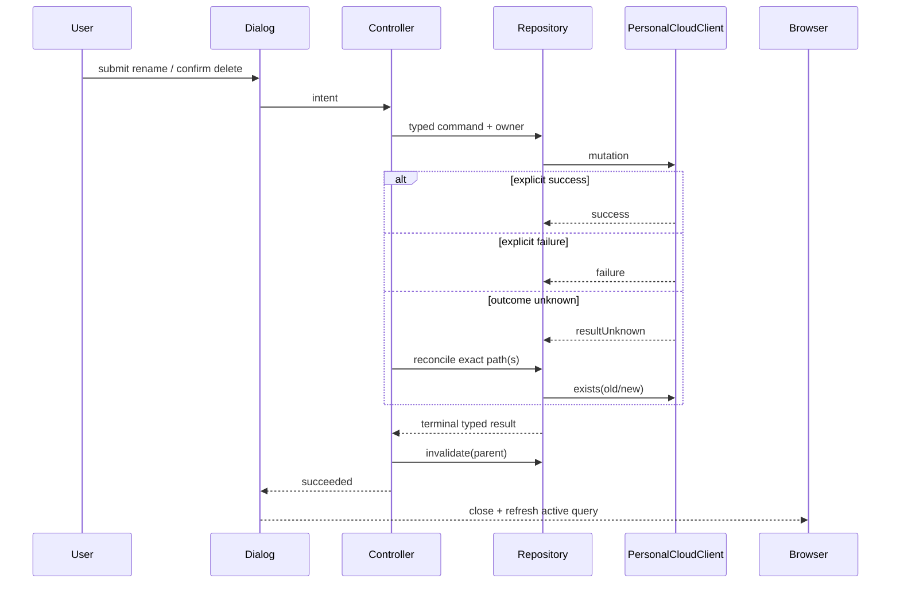

# 技术方案：个人云盘重命名与永久删除

**平台**：Flutter（共享 iOS / Android）  
**状态**：已采纳

## 一、背景与目标

- 在既有个人云盘浏览、YunPan token/signature、owner guard 上增加两个纵向文件操作。
- mutation 必须区分明确成功、明确失败和结果未知；只有精确路径对账确认后才把未知结果升级为成功。
- View 只渲染和转发，Controller 管状态，Repository 是业务结果事实源，Core client 只负责 YunPan 协议。
- 非目标：回收站、批量操作、Workspace、上传下载、抽取尚未拥有第二个真实消费者的通用 mutation 框架。

## 二、原则与约束

| 原则 | 落地 |
|---|---|
| SRP / DIP | Dialog 依赖 typed Controller；Controller 依赖领域 Repository；Repository 依赖 `PersonalCloudClient` 和 Nami 内容审核端口 |
| ISP | 重命名与删除分别拥有最小 Repository，不互相 import Feature |
| DRY / KISS | 复用 core token/sign/transport 和既有 owner 组合；两套业务状态不强行合并成泛型框架 |
| YAGNI | YunPan adapter 当前无二级缓存，`invalidate` 保持明确端口，由 Browser 成功后重拉当前查询 |

- Flutter/Dart 使用仓库锁定版本，不新增生产依赖。
- 外部依赖：Nami `/api/yp/tokens`、`/api/audit/content`；YunPan `File.rename`、`File.delete`、`File.getNodeInfoByPaths`。
- owner 由 environment/account/provider/session generation 构成；任何异步边界前后都校验。
- 源路径必须在 `personalCloudRootPath` 内；目录路径保留尾 `/`。
- 写操作不记录路径、名称、token、签名或服务端原始 body。

## 三、模块边界

| 模块 | 职责 | 输入/输出 | 依赖 |
|---|---|---|---|
| `core/personal_cloud` | 增加 rename/permanentDelete 协议封装；维持 token 单次刷新和 outcomeUnknown 分类 | form 参数 → typed call result | Dio transport、token source、signer |
| `cloud_drive/rename/domain` | Owner、Command、policy/result/reconcile/phase 契约与名称规则 | immutable values | 无 Feature 依赖 |
| `cloud_drive/rename/data` | 内容审核、调用 rename、精确旧/新路径对账、owner guard | domain result | core network、personal cloud |
| `cloud_drive/rename/application` | draft 校验、single-flight、generation fence、状态迁移、失效 | `RenameState` | rename repository |
| `cloud_drive/rename/presentation` | 自适应重命名对话框，提交中禁止退出/重复提交 | 用户意图 ↔ state | rename controller |
| `cloud_drive/deletion/domain` | Owner、Command、result/reconcile/phase 契约 | immutable values | 无 Feature 依赖 |
| `cloud_drive/deletion/data` | 永久删除、精确路径不存在对账、owner guard | domain result | personal cloud core |
| `cloud_drive/deletion/application` | 已确认后 single-flight、generation fence、结果收敛与失效 | `DeletionState` | deletion repository |
| `cloud_drive/deletion/presentation` | 明示不可恢复的危险确认，提交中禁止退出 | 用户确认 ↔ state | deletion controller |
| `app/personal_cloud_runtime` | 组装两个 Owner/Repository，承接 session owner | runtime ports | composition root |
| `browser/presentation` | 操作菜单入口；成功后 refresh 当前目录/搜索查询 | 当前 item | runtime + 两个 Feature 公共入口 |



## 四、数据模型与状态机



| 实体 | 字段 | 类型 | 必填 | 不变条件 |
|---|---|---|---|---|
| OperationOwner | environment/account/provider/stable/generation | value | 是 | 与 runtime 当前快照完全匹配 |
| RenameCommand | sourcePath/originalName/newName/isDirectory/operationId | value | 是 | 根内路径；newName trim 后合法且不同 |
| DeleteCommand | sourcePath/isDirectory/operationId | value | 是 | 根内路径；必须由确认 UI 创建 |
| MutationResult | success/failure/resultUnknown | sealed | 是 | 只有 transport/HTTP/decoding 等不确定写结果进入 unknown |
| ReconcileResult | applied/missing/indeterminate | sealed | 是 | applied 必须由精确路径证据支持 |



## 五、API Schema / 接口契约

### Dart 领域端口

```dart
abstract interface class CloudDriveRenameRepository {
  Future<CloudDriveNamePolicyResult> checkNamePolicy(NamePolicyRequest request);
  Future<CloudDriveRenameResult> rename(CloudDriveRenameCommand command);
  Future<CloudDriveRenameReconcileResult> reconcile(CloudDriveRenameCommand command);
  Future<void> invalidate(String directoryPath);
}

abstract interface class CloudDriveDeletionRepository {
  Future<CloudDriveDeletionResult> deletePermanently(CloudDriveDeletionCommand command);
  Future<CloudDriveDeletionReconcileResult> reconcile(CloudDriveDeletionCommand command);
  Future<void> invalidate(String directoryPath);
}
```

### YunPan form 契约

| 方法 | 说明 | 幂等 | Request form（除公共字段） | 成功 data |
|---|---|---|---|---|
| `File.rename` | 单项目重命名 | 否 | `src_name`, `new_name`, `file_ext={"ks_id":""}`；签名键 `src_name,new_name` | Bool |
| `File.delete` | 永久删除 | 否 | `fname=<exact path>`, `is_clean_master=1` | Bool |
| `File.getNodeInfoByPaths` | 精确路径存在性对账 | 是 | `paths=<exact path>` | `node_list` |

重命名成功证据：旧路径不存在且按 parent + newName + 目录尾 `/` 构造的新路径存在。  
删除成功证据：精确源路径不存在。存在性查询失败不是“不存在”，必须返回 indeterminate/failure。

### 结果与错误语义

| code/类型 | 含义 | Controller 处理 |
|---|---|---|
| `cloud_owner_changed` | owner 已变化 | 丢弃迟到结果，不刷新新 owner |
| `rename_name_empty/too_long/invalid_character/emoji/unchanged` | 本地名称拒绝 | 保持 editing，不发请求 |
| `rename_name_not_allowed` | 内容审核明确拒绝 | failed，保留输入 |
| `rename_policy_unavailable` | 审核网络降级 | 记录降级提示，继续服务端 mutation |
| `cloud_*` 明确业务失败 | 服务端未应用 | failed，保留当前列表 |
| `*ResultUnknown` | mutation 可能已应用 | 自动转 reconcile，禁止重复 mutation |
| `rename_source_present` / `rename_destination_missing` | 对账证明未完成 | failed，可刷新后再发新 operation |
| `deletion_source_present` | 对账证明仍存在 | failed，不从列表删除 |
| `*_reconcile_indeterminate` | 对账失败或无证据 | failed，不声称成功，允许刷新恢复 |

## 六、关键流程



## 七、非功能约束

| 维度 | 约束 | 验证方式 |
|---|---|---|
| 一致性 | 不重复非幂等 mutation；未知结果必须对账 | repository/controller unit tests |
| 并发 | owner/generation fence 覆盖审核、mutation、reconcile、invalidate 每个 await | delayed fake tests |
| 安全 | 删除必须二次确认；路径限制在个人云盘根；日志不含敏感值 | unit/widget review |
| 可用性 | 明确失败保留输入/项目；提交中禁止退出；对账不可判定不伪成功 | widget tests |
| 自适应 | Compact 使用可用宽度；Medium/Expanded 最大宽度；键盘后不溢出 | 三档 widget tests |
| 可访问性 | 输入、关闭、确认、危险操作均有语义标签且支持键盘焦点 | widget semantics tests |
| 兼容性 | Pure Dart 共享实现，不按平台复制业务 | analyze + 四端/折叠屏证据 |

## 八、ADR

| ADR | 决策 | 备选与取舍 | 影响 | 状态 |
|---|---|---|---|---|
| ADR-001 | 删除使用 `File.delete` + `is_clean_master=1` | `File.recycle` 与 Files Tab 真实调用及不可恢复文案冲突 | deletion core/data/UI | 已采纳 |
| ADR-002 | unknown 结果用精确路径存在性自动对账 | 直接重试可能重复非幂等写；直接失败会制造幽灵状态 | 两个 Controller/Repository | 已采纳 |
| ADR-003 | 重命名与删除分 Feature，不建泛型 mutation 框架 | 当前状态/交互不同；泛型会泄漏业务错误语义 | 目录与测试边界 | 已采纳 |
| ADR-004 | 成功后 Browser 重拉当前目录或搜索查询 | 仅局部改当前分页会让跨页/搜索快照陈旧 | controller/host | 已采纳 |
| ADR-005 | 内容审核逻辑本轮留在 rename adapter | 现有 folder adapter 尚未成为稳定共享端口，跨 Feature import 禁止；待第三个消费者/独立重构再抽取 | rename data | 已采纳 |

## 九、需求影响矩阵

| 需求 | 影响模块 | API/状态/数据契约 | ADR | 故事约束 |
|---|---|---|---|---|
| BUS-052 重命名 | core client、rename 四层、runtime、browser host、l10n | rename/policy/reconcile sealed result | 002/003/004/005 | 先完成独立纵向故事并验证共享收敛模式 |
| BUS-054 永久删除 | core client、deletion 四层、runtime、browser host、l10n | delete/reconcile sealed result | 001/002/003/004 | 必须在危险确认之后创建命令 |

## 十、方案比较与发布

| 方案 | 复杂度 | 一致性风险 | 结论 |
|---|---|---|---|
| A：Controller + typed Repository + unknown reconcile | 中 | 低 | 采纳 |
| B：页面直接调 Client，成功后局部删改 item | 低 | 高，跨页/search/owner 容易陈旧 | 拒绝 |
| C：建立全局通用文件 mutation 引擎 | 高 | 中，过早抽象且错误语义被抹平 | 暂不采用 |

- 无数据迁移、无新生产依赖、无服务端发布。
- 回滚以移除 Browser 菜单入口和 runtime 接线为主；已有浏览能力保持可用。
- 真实账号、Android oracle 和五形态证据未关闭前任务状态保持 PARTIAL。

## 十一、验收标准

- [x] 模块边界、ER、状态机、API/错误语义、ADR 和影响矩阵已定义。
- [ ] 两个故事完成 Red→Green→Refactor 及目标测试。
- [ ] 全仓 analyze/test 与任务命名门禁通过。
- [ ] iPhone/iPad/Android 手机/Pad/折叠屏及真实写操作证据完成；否则只报 PARTIAL。

## 续做

```text
/resume plan=Plans/技术方案/2026-08-10-cloud-drive-rename-delete.md 进度=架构已采纳，进入 Story 拆分
```

## 反馈（skill_run）

```yaml
skill_run:
  skill: architecture-design-assistant
  workflow_stage: architecture
  plan: Plans/技术方案/2026-08-10-cloud-drive-rename-delete.md
  date: 2026-08-10
  contexts_used:
    - path: Contexts/需求分析/需求分析产出标准.md
      utility: high
      reason: "用已采纳需求的边界、异常和 AC 反推模块、状态与 API 契约"
  contexts_missing: []
  contexts_stale: []
  outcome_status: pass
  revisit_needed: false
```
