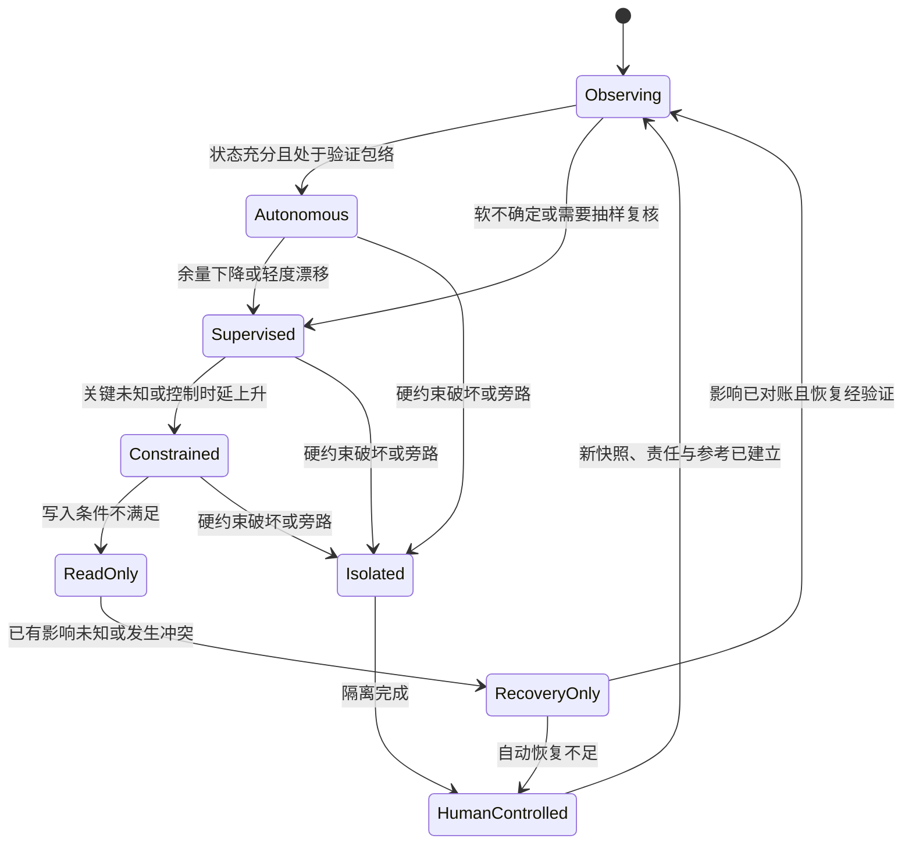
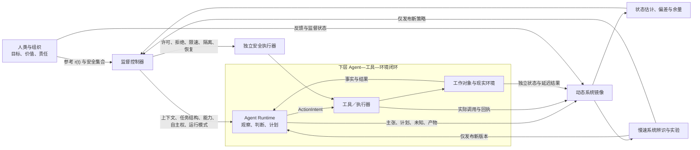
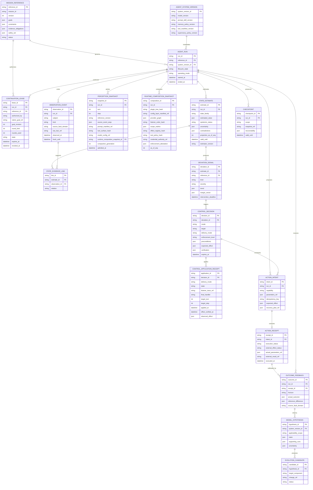
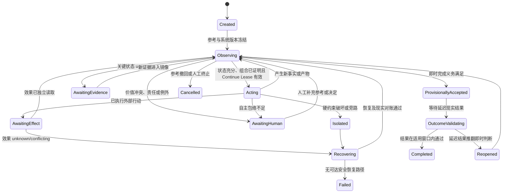
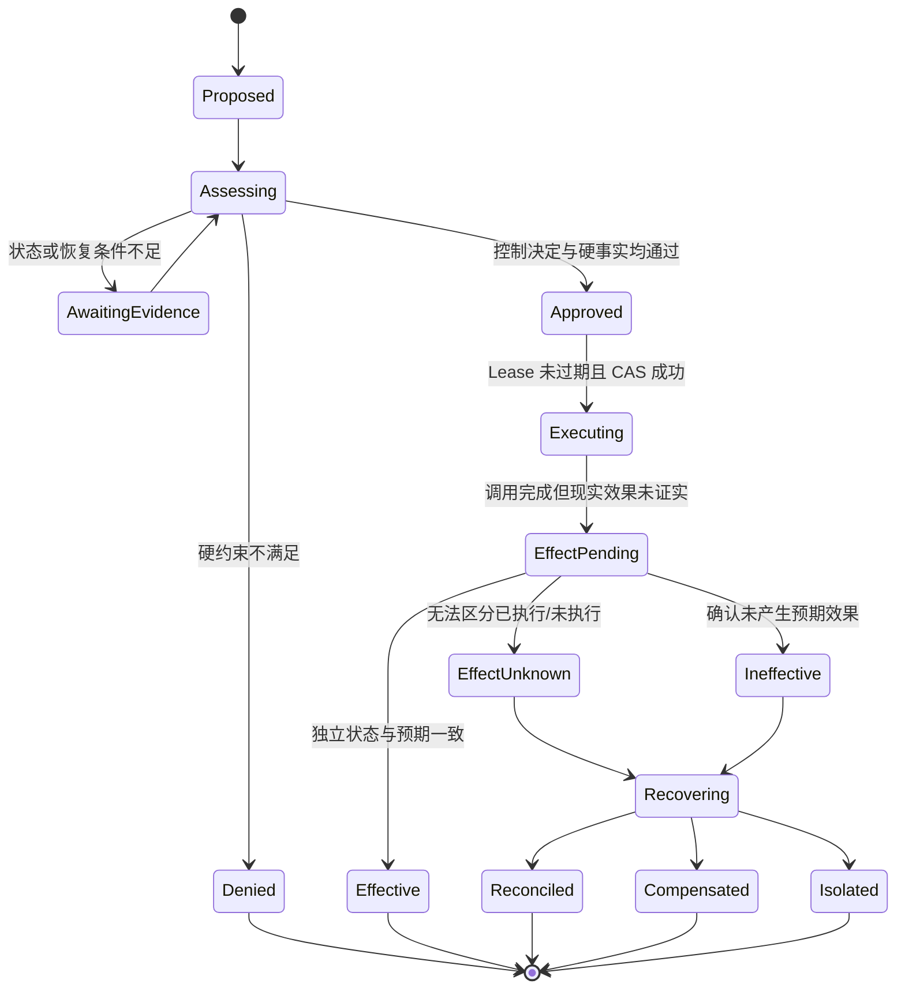
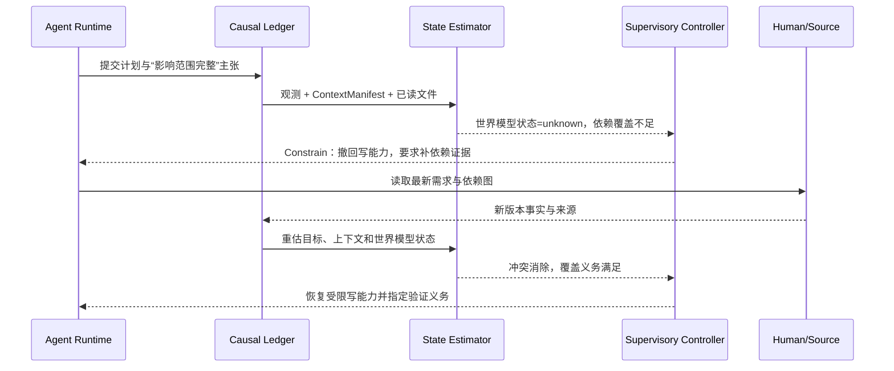
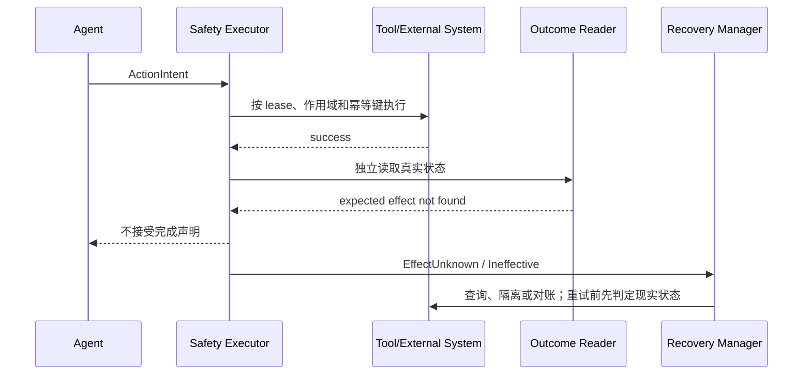
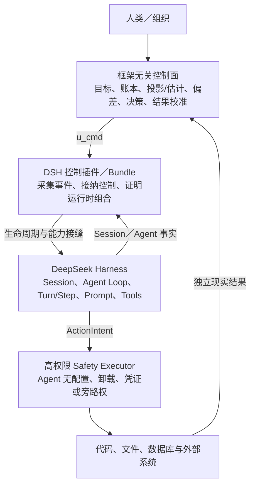

# 技术方案：智能体系统控制母模型 v0.1

**创建日期**：2026-08-14<br>
**存放路径**：`Plans/技术方案/2026-08-14-智能体系统控制母模型-v0.1.md`<br>
**状态**：草稿<br>
**lifecycle_state**：architecture<br>
**平台**：工具与业务无关的逻辑母模型；实现语言、运行框架和云厂商待后续选型<br>
**关联需求真理源**：`01-brief.md`、`02b-agent-system-content-inventory.md`、`03-human-notes.md`

> 本文不是对旧 MVP 的又一次局部修补，而是重新建立上位模型。先从 AI Agent 的主体性和运行闭环出发，定义系统边界、状态、观测、扰动、控制输入、稳定性和演化，再推导模块、数据与 MVP。2026-08-14 用户决定删除旧 MVP 文档；其中仍成立的机制已在本文重新归位，旧文档不再作为依赖或并行真理源。

**2026-08-14 架构校正**：基于 DeepSeek Harness 提交 `47f943859bef60e4160492346772ded9b24f765a` 的源码与官方文档复核，本次不改变控制母模型主干，只校正 Runtime 接入模式、组合态证明、控制应用回执、继续授权派生关系，以及安全能力的权限/信任域边界。Harness 原生机制与本系统推导出的生产控制契约必须分开表述。

## 一、为什么需要母模型

### 1.1 原始问题

智能体作为下一代生产工具，人类如何在不替代其自主判断的前提下，持续知道系统正在做什么、依据什么、处于什么状态、可能向哪里演化，并在必要时及时改变它参与生产的条件、行动与后果？

研究主线保持为：

```text
面向控制目标的充分观测
  → 动态系统镜像与状态估计
  → 偏差、余量与可达性判断
  → 分层监督控制
  → 可委托、可验收、可恢复、可进化的生产自主权
```

这里的“精细控制”不是逐 token 指挥模型，也不是用规则引擎代替智能，而是让不确定性始终落在可观察、可干预、影响有界、仍可恢复的运行包络内。

### 1.2 现有方案发生了什么偏移

现有材料已经形成许多有价值的局部机制，但它们没有稳定地从同一个 Agent 系统模型推导：

| 偏移 | 表现 | 后果 |
|---|---|---|
| 从控制对象转向产品功能 | 从单 Agent 控制闭环扩张到名册、编排画布、评估中心、进化实验室和治理中心 | MVP 同时验证过多假设，无法知道哪个机制产生了价值 |
| 从 Agent 系统转向外部副作用 | 为避免伪装控制 LLM，把工程控制论严格限于券、队列、预算和权限 | Agent 的目标理解、证据状态、上下文一致性、行动承诺和可恢复性失去统一模型 |
| 从母模型转向临时裁决 | 每次质疑都新增一个层、模块、状态或例外 | 局部正确但整体主从关系持续变化 |
| 从原始读者场景转向退款平台 | 面向编码 Agent 的研究被不可撤回补券主导 | 业务治理样例反客为主，无法验证 Agent 本体控制假设 |
| 从可证伪假设转向平台完备性 | 先补齐 UI、ER、API、发布与进化 | 文档很完整，但核心闭环是否成立仍未被单独验证 |

现有 `TaskContract`、因果账本、状态机、Action Gateway、Checkpoint、结果校准和安全退路仍可能成立；本母模型只改变它们的推导位置和优先级，不预设全部推倒。

### 1.3 母模型的目标

1. 从 Agent 是任务环境中的控制主体出发，定义人类要监督的完整下层闭环。
2. 在不读取隐藏思维链的前提下，定义足以支持控制的功能状态。
3. 区分事实、估计、偏差、控制决定、现实效果和系统学习。
4. 为单 Agent、多 Agent、编码、业务操作和长期自主任务提供同一套上位语义。
5. 从母模型推导最小 MVP，而不是从 UI、框架或业务接口倒推系统。

### 1.4 成功指标

母模型通过评审至少要满足：

- 任意一个具体 Agent 任务都能明确映射出参考目标、系统边界、关键状态、观测、扰动、控制输入和结果；
- “LLM 隐藏状态不可见”不会导致 Agent 运行状态整体不可建模；
- 每个关键偏差都有至少一个可执行控制动作，或被明确标记为当前不可控；
- 能定义什么叫系统运行稳定、何时必须降级、何时仍可恢复；
- 单 Agent MVP 可以独立验证母模型，不依赖多 Agent 编排和完整平台 UI；
- 后续模块、数据、API 和产品能力都能指出自己服务于哪个控制关系。

### 1.5 非目标

- 不声称智能体已经被证明是严格数学意义上的混沌系统；本文将其视为开放、随机、部分可观测、时变、混合的复杂系统。
- 不估计或保存完整隐藏思维链，不把“真正理解”作为可测状态。
- 不承诺精确预测 LLM 下一段输出，也不追求同输入同输出。
- 不把自然语言自信度、单一 Judge 或统一健康分当作真实状态。
- 不在本阶段设计通用多 Agent 组织、完整用户工作台或跨业务生产平台。
- 不在母模型阶段决定 LangGraph、Temporal、Kafka、数据库或模型供应商。

## 二、理论边界：借鉴的是工程控制论的建模次序

### 2.1 可借鉴的核心

工程控制论给予本系统的不是一组名词，而是一条设计次序：

1. 明确系统要达到的参考状态和绝不能越过的安全集合；
2. 确定被控系统与环境边界；
3. 识别可测输出和无法直接测量的状态；
4. 用观测器持续重建控制相关状态并保留误差；
5. 比较参考、估计状态与约束，形成偏差信号；
6. 判断系统是否可控、是否仍可稳定、控制动作是否足以覆盖扰动；
7. 执行控制并验证真实效果；
8. 用结果修正系统模型，而不是把一次成功写成永久规律。

### 2.2 最关键的主体关系

Agent 不是一台等待人类输入控制量的被动机器。Agent 面对任务环境时，本身就是一个下层控制器：

```text
目标与约束
  → Agent 观察环境
  → 形成任务/世界状态估计
  → 选择行动
  → 通过工具改变工作对象与现实环境
  → 观察结果并继续调整
```

人类生产控制面是更高一层的监督控制器。它控制的不是 LLM 内部神经状态，而是：

> Agent 以某个版本、上下文、记忆、工具、权限和资源，在某个环境中形成的完整闭环行为。

因此系统是嵌套反馈，而不是“控制器 → LLM → 文本”的单层流水线。

### 2.3 《工程控制论》与复杂巨系统方法的分工

| 方法 | 在本文中的位置 | 不承担什么 |
|---|---|---|
| 工程控制论 | 运行闭环、状态估计、偏差、稳定性、控制输入、恢复与系统辨识 | 不把开放语义任务伪装成已知线性对象 |
| 系统工程 | 系统边界、层级、接口、依赖、责任和全生命周期 | 不替代运行时反馈 |
| 开放复杂巨系统与综合集成 | 多主体、人机协同、目标冲突、定性知识与定量证据综合 | 不直接等同于 1954 年《工程控制论》的具体机制 |

母模型先解决单个 Agent 闭环能否被认识和监督；多 Agent 与组织级综合集成在此基础上扩展。

## 三、系统本体与边界

### 3.1 六类基本内容

智能体系统首先由六类内容构成，而不是由监控工具或平台模块构成：

| 基本内容 | 回答的问题 | 典型实例 |
|---|---|---|
| 主体 | 谁在观察、判断、行动、监督和负责 | 用户、Agent、工具、审批者、受影响者 |
| 意图 | 系统试图改变什么，不能改变什么 | 任务目标、阶段目标、价值取舍、安全边界 |
| 认知材料 | 系统依据什么认识任务和世界 | 上下文、知识、记忆、假设、证据、未知 |
| 行为 | 系统如何形成决定并产生行动 | 计划、选择、委托、工具调用、完成声明 |
| 世界状态 | 内外部实际发生了什么 | 代码、文件、服务、业务对象、用户结果 |
| 演化 | 结果如何改变未来系统 | 经验、评估、候选变更、版本、能力边界 |

任何监控维度、数据对象和产品功能都必须能回到这六类内容及其变化关系。

### 3.2 系统边界

母模型的最小系统边界为：

```text
System(t) =
  HumanReferenceAndOversight
  + AgentRuntime(version, context, memory, policy)
  + ToolAndCapabilitySet
  + WorkObject
  + ExternalEnvironment
  + ControlPlane
  + HistoricalTrajectory
```

边界外仍可能存在未知环境、第三方变化、攻击者和延迟业务结果，它们作为扰动或外部观测进入系统。

### 3.3 主体与责任

| 主体 | 控制角色 | 可以决定 | 不得独自决定 |
|---|---|---|---|
| 人类目标责任人 | 给定参考、价值和风险容忍 | 目标、边界、例外、不可逆取舍 | 隐去责任而让 Agent 自定最终价值 |
| Agent | 下层任务控制器 | 探索、判断、计划、生成候选、提交行动意图 | 自批高风险动作、修改自己的生产控制律 |
| 工具/执行器 | 改变工作对象或世界 | 按契约执行具体能力 | 扩大作用域、解释任务目标 |
| 上层监督控制器 | 调整 Agent 运行条件 | 继续、补证、限权、切换、暂停、恢复、接管 | 伪造业务真值、替代领域责任人作价值判断 |
| 独立安全执行器 | 强制硬约束 | 校验权限、幂等、预算、版本、作用域和停止条件 | 评价开放语义产物是否有价值 |
| 结果校准器 | 读取现实结果 | 校准先前状态和控制效果 | 直接在线改写 Agent 或控制策略 |

## 四、统一控制模型

### 4.1 符号与关系

对离散时间 `t`，定义：

```text
r(t)      = MissionReference：目标、成功定义、约束和安全集合
x(t)      = AgentSystemState：完整真实状态，通常无法直接取得
y(t)      = Observation：可直接取得的运行与现实输出
x_proj(t) = DeterministicProjection：由持久事实纯函数折叠出的确定状态
x_hat(t)  = AgentSystemStateEstimate：根据历史观测重建的控制相关状态
d(t)      = Disturbance：内生、外生、结构性和监督扰动
e(t)      = Deviation：参考、估计状态、安全集合与趋势之间的偏差
u_cmd(t)  = CommandedControl：监督控制器发出的控制命令
u_applied(t) = AppliedControl：经接纳点实际作用于 Runtime/执行器的控制量
a(t)      = RuntimeCompositionState：当前插件、服务、工具、策略和作用域拓扑
o(t)      = Outcome：即时与延迟现实结果
M(t)      = IdentifiedSystemModel：带版本、适用域和不确定性的系统模型
```

抽象关系为：

```text
x(t+1)     = F_version(x(t), agent_action(t), u_applied(t), a(t), d(t), environment(t))
y(t)       = H_version(x(t), environment(t)) + observation_error(t)
x_proj(t)  = Project(y(0..t), event_schema_version, as_of_seq)
x_hat(t)   = Estimate(x_proj(t), external_observations, M(t), provenance, uncertainty)
e(t)       = Compare(r(t), x_hat(t), safety_set, obligations, trend)
u_cmd(t)   = SupervisoryPolicy(e(t), margins(t), authority, intervention_window)
u_applied(t) = Admit(u_cmd(t), control_surface, runtime_state, delay, saturation)
M(t+1)     = Identify(M(t), trajectory, o(t), human_judgment)  # 只产生新候选版本
```

这些公式是数据与职责契约，不声称 Agent 是线性系统，也不要求存在可微、单调或全局最优控制律。

### 4.2 参考输入 `r(t)`

参考输入不是一句 prompt，而是版本化任务契约：

| 分量 | 内容 |
|---|---|
| 目的 | 最终希望改变的现实结果 |
| 成功定义 | 可以独立验证的结果与观察窗口 |
| 失败定义 | 流程完成但价值失败、约束破坏或副作用失控 |
| 边界 | 工作对象、时间、数据、工具、组织和影响范围 |
| 价值函数 | 质量、速度、成本、安全和人工负担的取舍 |
| 证据义务 | 完成前必须存在的事实、反例和外部核验 |
| 安全集合 | 任何时候不能越过的硬约束 |
| 人工责任 | 谁可修改目标、批准例外、接管和承担后果 |

参考输入变化必须创建新版本或显式变更事件；不能把需求变化伪装成 Agent 自己理解错了。

### 4.3 功能状态 `x_hat(t)`

不估计隐藏思维过程，但必须估计下列对控制有用、可通过显式产物和行为反驳的功能状态：

| 状态族 | 关键问题 | 主要证据 | 可接受表示 |
|---|---|---|---|
| 目标状态 | Agent 当前工作是否仍指向已生效目标与约束 | 任务解释、计划、当前动作、需求版本 | `aligned / drifted / conflict / unknown` |
| 世界模型状态 | Agent 所依据的代码、工具和环境认识是否仍新鲜、完整 | 读取范围、版本、外部查询、依赖图 | 事实集合 + 未知 + 冲突 |
| 证据状态 | 关键主张是否有足够且独立的支持 | 引用、测试、工具事实、反例、外部结果 | obligation coverage，不用单一总分 |
| 计划与承诺状态 | 当前计划、已作承诺和实际动作是否一致 | 计划版本、决策、待办、ActionIntent | 状态图 + 偏离原因 |
| 上下文与记忆状态 | 当前决策所需信息是否在场，是否出现压缩损失或污染 | ContextManifest、记忆读写、摘要谱系 | 缺口、冲突、新鲜度、来源 |
| 能力与权限状态 | 剩余任务是否有可用能力完成，行动是否获得相称授权 | 工具清单、错误、租约、历史表现 | 能力包络 + 置信区间 |
| 运行时组合状态 | 当前实际加载了哪些模型适配器、Prompt、工具、策略、监听器和执行提供者 | RuntimeCompositionSnapshot、Profile/Bundle/Patch 来源与顺序、插件树、Provider 图、监听器顺序、作用域、凭证和 Sandbox 权限 | 版本化拓扑 + 来源链 + 完整性证明 |
| 继续运行授权状态 | 目标尚未完成时，Agent 是否仍获准启动下一轮、最多还能运行多少轮 | ContinuationLease、目标 revision、round、预算 | `armed / disarmed / expired / revoked` |
| 工作对象状态 | 代码、文档、业务对象或环境实际处于何种版本和成熟度 | diff、测试、数据库、外部读取 | 可重建事实与版本 |
| 运行与资源状态 | 系统是否有进展，预算和时间是否仍足够 | token、成本、循环、等待、队列 | 余量、趋势、饱和状态 |
| 协作与责任状态 | 信息、任务和责任是否在交接中丢失或冲突 | 委托、交接、异议、审批、所有者 | 责任图 + 未决项 |
| 现实影响状态 | 已经执行什么，真实世界是否按预期改变 | ActionReceipt、独立读取、延迟结果 | `not_started / effective / ineffective / unknown / conflicting` |
| 可恢复状态 | 当前是否仍存在可达恢复点、隔离与补偿窗口 | Checkpoint、可逆性、演练、责任人 | 可达状态集合 + 截止时间 |
| 模型匹配状态 | 当前行为是否仍落在已验证版本和任务域内 | 漂移、失败切片、版本、负载 | `matched / degrading / out_of_domain / unknown` |

每项状态必须标记：

```text
measured | estimated | unknown
+ supporting_observations
+ confidence_or_interval
+ contradictions
+ valid_until
+ estimator_version
```

`unknown` 是有效状态，不得自动沿用旧值或用 Agent 自信度补齐。

### 4.4 偏差 `e(t)`

偏差不等于“答案离正确文本有多远”，而是当前系统状态相对任务参考、安全域和预期轨迹出现了什么可操作差异：

- 目标漂移：当前行动未覆盖或违背已生效目标；
- 认识偏差：关键世界状态缺失、过期、冲突或错误；
- 证据偏差：完成声明超过证据支持范围；
- 行动偏差：实际执行与批准意图、作用域或参数不一致；
- 进度偏差：循环、停滞、错误恢复或资源消耗没有带来信息增益；
- 协作偏差：委托、交接、责任或异议在主体间丢失；
- 现实偏差：工具回执与真实外部结果不一致；
- 恢复偏差：继续行动将使安全状态或补偿窗口不可达；
- 模型偏差：当前系统行为超出历史辨识模型的适用范围。

### 4.5 控制输入 `u_cmd(t)` 与实际输入 `u_applied(t)`

控制输入作用于 Agent 的运行条件、任务结构、能力边界和现实行动，不直接要求其隐藏认知达到某个数值：

| 控制族 | 可执行动作 |
|---|---|
| 信息控制 | 补充、删除、隔离或更新上下文；强制重新读取；引入独立事实源 |
| 认识控制 | 要求显式假设、反例、证据义务、未知清单和置信边界 |
| 任务控制 | 拆分、合并、改变顺序、建立检查点、重新设定阶段目标 |
| 采样与主体控制 | 独立重采样、切换模型/Agent、引入反方、交接给领域专家 |
| 能力控制 | 增减工具、数据范围、并发、持续时间、预算和自主权 |
| 行动控制 | dry-run、限速、限额、批准、拒绝、延迟、分阶段执行 |
| 运行控制 | 继续、补证、暂停、降级、恢复、接管、隔离、终止 |
| 结果控制 | 行动后读取、对账、回滚内部状态、隔离影响、外部补偿 |
| 进化控制 | 创建候选、历史回放、影子、灰度、晋级或撤回新版本 |

若关键扰动没有对应控制动作，系统在该作用域内不可控；增加监控不能把它变成可控。以下控制族首先产生 `u_cmd(t)`，只有经过明确接纳点和回执后才形成 `u_applied(t)`。

### 4.6 控制命令不等于控制已经生效

控制器发出 `u_cmd(t)` 后，Runtime 可能已经完成本轮输入认领、正在执行工具、处于取消收敛、等待下一轮唤醒，或因版本/作用域变化拒绝命令。因此每个控制动作必须声明接纳语义：

| delivery_mode | 生效位置 | 是否唤醒 | 典型用途 |
|---|---|---|---|
| `immediate-abort` | 当前活动的取消边界 | 是 | 急停、撤销当前工具树 |
| `next-step` | 下一次模型请求输入认领前 | 运行中不额外唤醒 | 纠偏、补上下文、改变工具面 |
| `next-turn` | 新 Turn 开始时 | 是 | 新目标、人工追问、重新规划 |
| `passive-context` | 后续任一被允许的接纳点 | 否 | 非紧急背景信息、提示 |
| `capability-boundary` | 下一次能力解析/执行前 | 否 | 撤权、限额、Sandbox 收紧 |

控制面必须获得 `ControlApplicationReceipt`。它是本系统定义的跨 Runtime 控制契约，不是假设某个框架原生存在的对象；Adapter 必须把具体 Runtime 的队列、事件 waterfall、短路和执行结果映射为统一状态：

```text
pending → claimed → intercepted
                    ├─ delegated → admitted → applied → effect_verified
                    ├─ short_circuited
                    ├─ rejected
                    └─ superseded / expired
```

`intercepted` 只说明命令到达某个监听器；`delegated` 说明监听器将控制权交给下游；`short_circuited` 说明某个监听器已经结束该接纳链。只有 `applied` 且随后取得 `effect_verified`，才能认为控制输入进入被控系统并产生预期效果。

## 五、扰动模型

### 5.1 扰动分类

| 类型 | 例子 | 首选响应方向 |
|---|---|---|
| Agent 内生扰动 | 幻觉、过早收敛、计划漂移、无效重试、遗忘、错误自评 | 补证、重估、换主体、改变任务结构 |
| 信息扰动 | 上下文截断、过期文档、错误摘要、记忆污染、来源冲突 | 恢复来源、扩大观测、隔离污染 |
| 工具与环境扰动 | 命令假成功、网络超时、第三方漂移、并发、版本变化 | 独立读取、幂等、限权、隔离、重辨识 |
| 目标扰动 | 需求变化、目标冲突、价值权重变化、隐含边界出现 | 新参考版本、暂停旧承诺、重新规划 |
| 人与组织扰动 | 审批过载、责任人缺席、自动化偏见、团队目标冲突 | 降低自主权、转责任主体、延长或停止行动 |
| 控制面自身扰动 | 状态估计错误、监控丢事件、策略过期、安全核旁路 | 只读降级、独立 Watchdog、人工控制、隔离 |
| 结构性扰动 | 模型、提示、技能、记忆策略或工具集合改变 | 视为新系统版本，旧能力结论失效 |

### 5.2 扰动不是错误标签

同一现象可能由不同扰动产生。例如“重复调用工具”可能来自工具超时、状态读取失败、目标不清、计划循环或控制器错误。控制器必须基于状态与证据选择动作，不能用关键词直接映射固定处置。

## 六、动态系统镜像：观测系统的核心产物

### 6.1 不是全量日志

动态系统镜像不是复制全部 token，而是持续维护以下因果关系：

```text
谁
  基于什么目标和版本
  看到了哪些材料
  提出了什么主张与未知
  作出了什么决定和承诺
  发起了什么行动
  系统实际执行了什么
  工作对象与现实世界如何变化
  即时与延迟结果是什么
  这些结果如何校准此前判断
```

详尽度按闭环语义衡量：关键关系丢失时，即使原始日志很多也不算详尽；超出控制需要的全量采集则可能增加时延、隐私和注意力风险。

### 6.2 观测契约

每条 `ObservationEvent` 至少包含：

```yaml
observation_id: obs_123
run_id: run_123
subject: agent | context | artifact | tool | environment | human | control_plane
kind: claim | read | write | tool_result | state_change | feedback | resource
source: "具体来源及故障域"
observed_at: "可信时间"
system_version: asv_123
raw_fact_ref: "密封事实或内容地址"
provenance: ["转换链"]
reliability: "来源可靠性说明"
fresh_until: "有效期"
sensitivity: public | internal | restricted | secret
```

高风险控制决定所依赖的关键事实必须能指向独立故障域；Agent 自述、Agent 生成测试和同源 Judge 不能伪装成三个独立证据。

### 6.3 状态镜像的不变量

- 事实不可被估计覆盖；估计只能引用事实；
- 新观测可以推翻旧估计，但不能修改历史事件；
- 所有估计和决定都绑定系统、参考、策略与估计器版本；
- 高风险行动必须存在行动前快照和行动后独立观测；
- 敏感原文可以密封、脱敏和过期删除，但因果引用与删除证明必须保留；
- 镜像无法重建关键状态时，系统必须显式进入 `Unknown` 或降级模式。

### 6.4 三类事件平面必须分离

DeepSeek Harness 的事件体系说明：持久事实、实时协调和能力约束虽都表现为“事件”，却有不同的一致性与时限要求。母模型将其分成三个平面：

| 平面 | 典型内容 | 主要保证 | 禁止混淆 |
|---|---|---|---|
| Durable Fact Plane | Session、消息、工具调用与结果、参考版本、检查点 | 追加、可重放、稳定序号 | 不能把瞬时命令队列当成已经发生的事实 |
| Live Control Plane | pre-step、pre-request、request-error、turn-stopping、steer/follow-up | 在明确接纳点及时传递并回执 | 不能只因命令入队就声称控制已生效 |
| Capability Enforcement Plane | 工具策略、Sandbox、审批、凭证、预算、作用域 | 在能力解析和执行边界确定性拒绝 | 不能用 prompt 建议冒充硬约束 |

三个平面通过稳定的 `run_id / turn_id / step_id / tool_call_id / decision_id` 关联，但分别记录事实水位、接纳时序和执行强度。

### 6.5 确定性投影与认识性估计分层

```text
ObservationEvent
  → Deterministic State Projector(as_of_seq, projection_version)
  → ProjectionSnapshot x_proj(t)
  → Epistemic State Estimator(+ external observations + M)
  → StateEstimate x_hat(t)
```

投影器只做事件纯折叠，同一事件序列和版本必须得到相同结果；估计器才负责处理不完整观测、来源冲突、有效期和模型不确定性。这样可以区分“事实投影错了”和“基于正确事实作出了错误估计”，避免把可重放状态与推断结果混成一个缓存。

### 6.6 模型可见即因果可重建

每次模型请求前必须冻结 `PerceptionSnapshot / RequestEnvelope`，至少记录：

- `reference_version`、`source_event_seqs` 与投影水位；
- prompt 各分区的来源和版本，而非要求保存隐藏思维链；
- 工具 Schema、限制与审批状态；
- 模型、Provider、采样配置和压缩代次；
- `runtime_composition_snapshot_id`、Turn/Step 接纳点与敏感级别。

凡是能够影响模型输出的系统输入，都必须能在风险分级的数据策略下追溯其来源、版本和装配过程。敏感原文可以密封或到期删除，但不能删除其因果引用与删除证明。

### 6.7 运行时组合证明与信任域

`RuntimeCompositionSnapshot` 不能只列插件名称。每个高风险 Step 或 ActionIntent 必须绑定可验证的组合证明，至少包括：

- Profile、Bundle 和 Patch 的来源、内容哈希及严格应用顺序；
- 插件身份、版本、作用域 realm、服务 Provider 图和监听器执行顺序；
- waterfall 中的短路、委托与最终处理者；
- 已注册 effect 的 owner、disposer 状态和卸载结果；
- 工具、凭证、审批、Sandbox 与外部执行端点的实际授权关系。

安全边界由“谁能修改配置、卸载能力、取得凭证和旁路执行”决定，而不是由代码是否叫插件、是否与 Runtime 同进程单独决定。安全 Provider 可以使用插件形式实现，但其挂载权、配置权、凭证和最终执行权必须处于被控 Agent 无法支配的更高权限或独立信任域；组合证明不完整时只能收紧权限，不能推断安全基线仍然存在。

## 七、可观测性、可控性与稳定性

### 7.1 可观测性判据

一个状态在给定干预窗口内满足以下条件，才算对该控制目标可观测：

1. 能由直接观测或有来源的估计重建；
2. 能区分会导致不同控制动作的关键状态；
3. 不确定性和有效期已知；
4. 观测时延小于需要采取行动的剩余窗口；
5. 观测链没有完全依赖被监督 Agent 自己正确工作。

不能满足时，系统只能缩小自主范围、增加独立观测或承认当前不可观测。

### 7.2 可控性判据

本系统不问“能否让 LLM 输出指定文本”，而问：

> 当系统进入目标漂移、证据不足、资源失控、现实效果未知或安全边界附近时，是否存在有权限、能及时生效且效果可验证的控制输入，把系统带回允许状态或更安全状态？

若暂停依赖 Agent 主动配合、急停无法阻断真实执行器、恢复点已经失效或人工响应晚于扩散窗口，则该状态不可控。

### 7.3 操作性稳定定义

智能体系统稳定不意味着每次生成相同文本，而是同时满足：

- **目标有界**：任务偏差不会持续扩大且无人察觉；
- **资源有界**：循环、重试、并发、token、时间和人工消耗受到限制；
- **影响有界**：真实副作用不超出授权作用域、速率和预算；
- **进展可判**：系统能区分有效探索、停滞、退化与完成；
- **恢复可达**：继续运行不会悄然耗尽全部恢复路径；
- **责任连续**：任何阶段都有可识别的决定者、执行者和接管者；
- **模型可校准**：结果能回写并暴露旧模型失配，系统不会把一次通过永久化。

### 7.4 控制余量向量

第一版不建立单一“稳定分”，而维护下列余量、可信度、趋势和证据：

| 余量 | 耗尽意味着什么 |
|---|---|
| 目标余量 | 正在高效完成错误目标 |
| 上下文余量 | 下一判断可能依赖被截断、过期或污染的信息 |
| 证据余量 | 完成和行动超过事实支持范围 |
| 能力余量 | 剩余任务超出当前 Agent、工具或环境能力 |
| 资源余量 | 即使方向正确也无法可靠完成 |
| 安全余量 | 下一步可能越过权限、政策或不可逆边界 |
| 协作余量 | 责任、交接、并发或异议即将失联 |
| 监督余量 | 人工或独立监督无法在窗口内作出有效判断 |
| 恢复余量 | 再继续一步可能失去回退、隔离或补偿能力 |
| 模型匹配余量 | 当前系统已经超出已验证的版本、任务域或负载 |

### 7.5 运行模式



运行模式由状态、余量、控制能力和时限共同决定；不能仅由任务风险等级静态决定。

### 7.6 控制强度与覆盖率

每项约束必须同时声明 `enforcement_level` 与 `enforcement_coverage`：

- 强度依次为 `advisory → context-intercept → authoritative-reject → monotonic-deny → capability-enforced → environment-enforced`；
- 覆盖率为 `full / partial / unknown`，Sandbox 或平台只覆盖部分工具时不得标记为完整隔离；
- 安全约束单调收紧：下层可以进一步拒绝，上层或普通插件不得重新开放已被硬层禁止的能力；
- Runtime 插件与 Provider 可以替换，但安全执行器、凭证边界、Watchdog 和组合证明不能通过普通 profile、overlay 或插件卸载移除。

软引导适合改善 Agent 行为，硬约束负责保证安全集合；两者必须在控制台和审计中明确区分。

## 八、三层嵌套控制环

### 8.1 第一层：Agent 行动环

```text
观察 → 形成任务/世界估计 → 生成候选 → 选择行动 → 使用工具 → 读取结果
```

这是智能产生和任务推进的主体。上层控制器不进入隐藏推理过程，只要求下层通过显式主张、假设、证据、计划、行动意图和结果与外部系统连接。

### 8.2 第二层：生产监督环

```text
Observation
  → Durable Ledger
  → Deterministic Projection
  → Epistemic State Estimate
  → Deviation & Margins
  → Supervisory Decision
  → 调整上下文/任务/能力/运行模式
  → 验证控制效果
```

该环按秒到小时运行，负责让 Agent 的自主空间随认识、风险和可恢复性动态变化。

### 8.3 第三层：系统辨识与进化环

```text
Trajectory + Immediate Outcome + Delayed Outcome + Human Judgment
  → Failure Slice / Model Residual
  → System Hypothesis
  → Evolution Candidate
  → Replay / Shadow / Canary
  → New AgentSystemVersion or SupervisoryPolicyVersion
```

该环按天到周运行。它可以由 Agent 生成候选，但不能让候选自评、自批或原地修改正在运行的系统。

### 8.4 总体关系



### 8.5 生命周期控制面

Agent Runtime 的可控点不是单一“暂停按钮”，而是分布在 `Run > Turn > Step > ToolCall > ExternalEffect` 的层级边界：

| 控制点 | 可改变对象 | 最迟生效条件 |
|---|---|---|
| session-start | 参考、系统版本、运行时组合 | Run 创建前 |
| pre-step | 本步上下文、预算、继续授权 | 本步模型请求前 |
| pre-request | RequestEnvelope、工具面、模型配置 | Provider 调用前 |
| request-error | 重试、换 Provider、降级与终止 | 下一次请求前 |
| pre-tool / tool-execute | 参数、审批、作用域、凭证 | 外部副作用前 |
| post-tool | 结果解释、效果待定与恢复路径 | 下一步推理前 |
| turn-stopping | 是否终止、补证或继续新一轮 | Turn 结束前 |
| between-turn | 新目标、人工追问、继续运行 | 下一 Turn 被唤醒前 |

`ContinuationLease` 把“目标生命周期”与“进程继续运行权”分开：目标可以仍为 `active`，但没有有效 Lease、超过轮次上限或已被撤回时，Runtime 不得自行开启下一轮。具体 Runtime 可以提供 Goal revision、phase、轮数上限、activation/disarm 等原生事实；M2 负责读取这些事实，控制面再结合授权主体、预算、有效期与撤销状态派生 Lease。不得把 Runtime 原生 Goal 状态等同于本系统的 `ContinuationLease`。

## 九、模块边界

### 9.1 逻辑模块

| ID | 模块 | 职责 | 输入 | 输出 | 禁止职责 |
|---|---|---|---|---|---|
| M1 | Mission Reference Manager | 管理目标、约束、价值、证据义务和变更版本 | 人类输入、领域规则 | MissionReferenceVersion | 不根据 Agent 输出偷偷改目标 |
| M2 | Agent Runtime Adapter | 以原生插件或外部事件网关两种模式统一不同 Agent 的生命周期钩子、显式产物、组合证明与控制接纳点 | 参考、上下文、工具、`u_cmd` | Claim、Artifact、ActionIntent、PerceptionSnapshot、RuntimeEvent、RuntimeCompositionSnapshot、ControlApplicationReceipt | 不把框架包结构写入领域契约，不拥有生产写凭证，不自批完成 |
| M3 | Observation & Causal Ledger | 追加保存观测、来源、版本和因果关系 | Runtime、工具、环境、人、控制器事件 | ObservationEvent、可回放轨迹 | 不把推断写成事实 |
| M4a | Deterministic State Projector | 按稳定序号纯折叠事实事件，生成可重放镜像 | ObservationEvent、projection_version | ProjectionSnapshot(`as_of_seq`) | 不引入概率推断，不修改事实 |
| M4b | Epistemic State Estimator | 基于投影、外部观测和系统模型估计未知、冲突与有效期 | ProjectionSnapshot、外部观测、系统模型 | StateEstimate | 不读取隐藏思维链，不输出控制决定 |
| M5 | Deviation & Margin Engine | 比较参考、估计状态、安全集合和趋势 | Reference、StateEstimate、Policy | DeviationSignal、MarginVector | 不执行工具，不用总分覆盖硬缺口 |
| M6 | Supervisory Controller | 选择最小充分的监督控制动作与预期接纳点 | Deviation、Margins、Authority、Window | ControlDecision、application expectation | 不把命令入队当成已生效，不修改历史事实 |
| M7 | Deterministic Safety Executor | 在 Agent 不可支配的权限/信任域中强制权限、作用域、幂等、预算、版本、组合证明和急停 | ActionIntent、ControlDecision、硬事实、RuntimeCompositionAttestation | ExecutionLease、ActionReceipt、拒绝 | 不评价开放语义价值，不把“独立进程”当作唯一安全证明 |
| M8 | Recovery Manager | 管理检查点、内部恢复、影响隔离、对账和补偿 | 失败、未知效果、恢复计划 | RecoveryDecision、RecoveryReceipt | 不把代码回滚等同现实恢复 |
| M9 | Outcome Calibrator | 关联即时/延迟现实结果并校准旧估计 | 外部事实、人类反馈、业务结果 | OutcomeFeedback、CalibrationRecord | 不在线改 Agent 或控制律 |
| M10 | System Identification & Evolution | 建立版本化行为模型和变更候选 | 轨迹、校准结果、失败切片 | ModelHypothesis、EvolutionCandidate、Experiment | 不自批新版本 |
| M11 | Human Supervisory Console | 呈现状态、证据、未知、余量、替代动作与责任 | 投影、控制请求、监督容量 | 人工决定、目标变更、接管 | 不用仪表盘分数替人作价值判断 |
| M12 | Control-plane Watchdog | 从 Agent 不可修改的观察与降级权限域监控事件丢失、策略/插件移除、旁路、控制器故障和时限 | 心跳、能力图、组合证明、队列、审计 | Degrade、Isolate、Alert | 不承担业务语义判断，不与被监控 Runtime 共用唯一故障域 |

### 9.2 依赖方向

```text
Agent Runtime / Tool / Environment / Human
  → Observation & Causal Ledger
  → Deterministic State Projector
  → Epistemic State Estimator
  → Deviation & Margin Engine
  → Supervisory Controller
  → Agent Runtime control ports

ActionIntent
  → Deterministic Safety Executor
  → Tool / Environment

Outcome
  → Outcome Calibrator
  → System Identification & Evolution
  → new version only
```

M4a、M4b、M5、M6 不得反向修改 M3 的历史事实；M10 不得原地修改当前 Run；M2 不得绕过 M7 触达受控写能力。

### 9.3 MVP 部署边界

首版采用模块化单体承载 M1—M6、M8—M10 的逻辑职责。M2 支持两种接入模式：对 Cordis 类 Runtime 使用 out-of-tree 原生插件/Bundle 接入，对不提供稳定插件接缝的 Runtime 使用 SDK 或外部事件网关；两者复用同一组框架无关领域契约和 Adapter contract tests。M7/M12 的安全性以 Agent 无法修改配置、卸载能力、取得执行凭证或旁路调用的权限/信任域为准；生产部署通常采用独立进程、独立凭证和独立降级通道，但进程边界本身不是充分证明。M11 只做最小监督控制台。是否进一步拆服务由真实吞吐、故障域和团队边界决定。

## 十、数据模型

### 10.1 ER 图



### 10.2 核心字段约束

| 实体 | 必须满足的不变量 |
|---|---|
| MissionReference | 发布后不可原地修改；变更必须新版本并标记旧 Run 如何处理 |
| AgentSystemVersion | 模型、提示/技能、记忆、工具和监督策略版本必须可重建 |
| ObservationEvent | 追加式；事实引用、来源、时间、版本和故障域不可缺失 |
| PerceptionSnapshot | 模型可见输入必须能由来源事件、版本、工具面和组合快照因果重建 |
| RuntimeCompositionSnapshot | 插件树、Provider 图、工具策略和强制覆盖证明必须绑定稳定水位 |
| ContinuationLease | 目标 active 不代表可继续；轮次、到期、撤回和授权主体必须可验证 |
| ProjectionSnapshot | 同一事件前缀和投影版本必须产生相同状态，并携带 `as_of_seq` |
| StateEstimate | 必须引用投影水位与观测；必须有 `measured/estimated/unknown`、不确定性与有效期 |
| DeviationSignal | 必须指出比较基准、趋势、剩余干预窗口和受影响余量 |
| ControlDecision | 必须包含权限、前置条件、预期效果、验证和失败后的下一动作 |
| ControlApplicationReceipt | 命令入队、被认领、被接纳、实际应用和效果验证必须分态记录 |
| ActionIntent | 只表达候选行动；不代表已经批准或真实生效 |
| ActionReceipt | API 成功与现实效果分别记录，现实效果允许 `unknown` |
| Checkpoint | 必须说明能恢复什么、不能恢复什么以及有效期 |
| OutcomeFeedback | 即时与延迟结果分开；不得覆盖当时的历史判断 |
| ModelHypothesis | 带适用域、样本和不确定性；不能写成跨版本永久人格 |

## 十一、状态机

### 11.1 AgentRun 生命周期



### 11.2 ActionIntent 生命周期



### 11.3 EvolutionCandidate 生命周期

```text
Proposed → ReplayTesting → ShadowTesting → Canary → Promoted
    └──────── any failed gate ────────→ Rejected
Promoted → RolledBack
```

候选发布只创建新的 `AgentSystemVersion` 或 `SupervisoryPolicyVersion`，不得修改正在运行的旧版本。

### 11.4 ContinuationLease 生命周期

```text
Proposed → Armed → Consumed(round) → Armed（尚有轮次且目标版本未变）
Armed → Disarmed | Revoked | Expired | Exhausted
```

`Disarmed / Revoked / Expired / Exhausted` 均禁止 Runtime 自行唤醒下一轮；只有责任主体签发新 Lease 或显式重新授权才能回到 `Armed`。目标修订时旧 Lease 自动失效。

### 11.5 ControlApplication 生命周期

```text
Commanded → Pending → Claimed → Admitted → Applied → Verified
Pending/Claimed/Admitted → Superseded | Expired | Rejected
```

`Commanded` 只表示控制器做出决定，`Applied` 表示 Runtime 已改变运行条件，`Verified` 才表示独立观测确认预期效果。控制效果指标不得把前三者计为成功。

## 十二、API Schema 与控制端口

### 12.1 接口总览

| 方法 | 路径 | 说明 | 幂等 |
|---|---|---|---|
| POST | `/v1/mission-references` | 创建不可变任务参考版本 | 是，`Idempotency-Key` |
| POST | `/v1/agent-runs` | 以冻结参考和系统版本创建 Run | 是 |
| POST | `/v1/agent-runs/{run_id}/observations` | 追加观测事件 | 是，按 `observation_id` |
| GET | `/v1/agent-runs/{run_id}/mirror` | 读取动态镜像、未知、冲突和余量 | 否 |
| GET | `/v1/agent-runs/{run_id}/perception-snapshots/{turn}/{step}` | 读取模型请求的可重建输入包 | 否 |
| POST | `/v1/agent-runs/{run_id}/continuation-leases` | 签发或更新继续运行授权 | 是，按目标修订与轮次 |
| POST | `/v1/agent-runs/{run_id}/control-decisions` | 根据当前快照生成/提交监督决定 | 是，按快照哈希 |
| GET | `/v1/control-decisions/{decision_id}/application` | 查询命令实际接纳与效果状态 | 否 |
| POST | `/v1/control-decisions/{decision_id}/receipts` | Runtime 追加控制接纳回执 | 是，按接纳点 |
| POST | `/v1/agent-runs/{run_id}/action-intents` | Agent 提交行动意图 | 是，按业务幂等键 |
| POST | `/v1/action-intents/{intent_id}/execute` | 安全执行器执行已批准行动 | 是，按 lease + CAS |
| POST | `/v1/agent-runs/{run_id}/outcomes` | 写入即时或延迟现实结果 | 是，按来源与观察窗口 |
| POST | `/v1/agent-runs/{run_id}/recoveries` | 发起隔离、恢复、对账或补偿 | 是 |
| POST | `/v1/evolution-candidates` | 从校准结果创建版本候选 | 是 |

### 12.2 创建 AgentRun

```json
POST /v1/agent-runs
{
  "reference_id": "ref_20260814_v1",
  "agent_system_version_id": "asv_001",
  "initial_context_manifest_ref": "ctx_001",
  "requested_autonomy": "supervised",
  "idempotency_key": "mission-123-attempt-1"
}
```

```json
{
  "run_id": "run_001",
  "lifecycle_state": "Observing",
  "operating_mode": "Supervised",
  "frozen_versions": {
    "reference": "ref_20260814_v1",
    "agent_system": "asv_001"
  },
  "next_required_observations": ["work_object_version", "tool_manifest_health"]
}
```

### 12.3 监督控制决定

```json
POST /v1/agent-runs/run_001/control-decisions
{
  "snapshot_hash": "sha256:...",
  "deviation_ids": ["dev_context_gap_01"],
  "requested_by": "supervisory-controller-v1"
}
```

```json
{
  "decision_id": "decision_001",
  "mode": "constrain",
  "target": "agent-runtime",
  "delivery_mode": "next-step",
  "enforcement_level": "authoritative-reject",
  "expected_admission": {"before_turn": 12, "before_step": 3},
  "actions": [
    {"type": "rebuild_context", "required_sources": ["latest_requirement", "dependency_graph"]},
    {"type": "revoke_capability", "capability": "write_repository"}
  ],
  "reason": "目标版本冲突且依赖范围未知",
  "expected_effect": "恢复目标与世界模型的一致性",
  "verification": ["new_context_manifest", "conflict_resolved", "dependency_coverage_updated"],
  "expires_at": "2026-08-14T12:00:00+08:00"
}
```

### 12.4 ActionIntent

```json
POST /v1/agent-runs/run_001/action-intents
{
  "capability": "write_repository",
  "target_scope": ["src/refund/*", "tests/refund/*"],
  "parameters_ref": "sealed://intent-params/001",
  "expected_effect": "实现已确认规则并新增失败路径测试",
  "evidence_refs": ["obs_req_v3", "obs_dependency_graph", "obs_red_test"],
  "idempotency_key": "repo:commit:mission-123:change-1",
  "recovery_plan_ref": "recovery_001"
}
```

提交成功只返回 `Proposed`，不能返回“已批准”或“已生效”。

### 12.5 控制实际生效回执

```json
POST /v1/control-decisions/decision_001/receipts
{
  "application_id": "app_001",
  "state": "effect_verified",
  "delivery_mode": "next-step",
  "target_turn": 12,
  "target_step": 3,
  "listener_trace_ref": "sealed://control-waterfall/app_001",
  "final_handler": "runtime-adapter:pre-step",
  "runtime_composition_snapshot_id": "composition_017",
  "applied_at": "2026-08-14T11:42:03+08:00",
  "effect_verified_at": "2026-08-14T11:42:04+08:00",
  "observed_effect": {
    "write_repository": "revoked",
    "request_envelope": "ctx_008"
  }
}
```

若目标 Step 已越过接纳点，必须返回 `superseded` 或 `expired`；若 waterfall 被监听器终止，必须返回 `short_circuited` 并记录 final handler。控制器据此决定急停、等待下一接纳点或隔离，不能伪造 `applied/effect_verified`。

### 12.6 错误码

| code | HTTP | 含义 | 调用方处理 |
|---|---:|---|---|
| `REFERENCE_VERSION_CONFLICT` | 409 | Run 使用的目标版本已失效或冲突 | 暂停并由责任人决定迁移 |
| `STATE_UNKNOWN` | 409 | 关键控制状态不可观测 | 补证、缩权或转人工 |
| `ESTIMATE_EXPIRED` | 409 | 状态估计已过有效期 | 重新观测，不得沿用旧决定 |
| `EVIDENCE_NOT_INDEPENDENT` | 422 | 高风险依据来自同一故障域 | 引入独立事实源 |
| `CONTROL_WINDOW_EXPIRED` | 409 | 决定无法在干预窗口内生效 | 进入更保守模式或隔离 |
| `CONTROL_NOT_APPLIED` | 409 | 命令已发出但未到达声明的接纳点 | 改变 delivery mode、急停或隔离 |
| `CONTROL_SHORT_CIRCUITED` | 409 | 控制接纳 waterfall 被监听器提前终止 | 检查 listener trace、Provider 顺序与最终处理者 |
| `CONTINUATION_NOT_AUTHORIZED` | 403 | 没有有效 Continue Lease | 停止下一轮，等待责任主体授权 |
| `RUNTIME_COMPOSITION_UNATTESTED` | 409 | 当前插件/策略/Provider 组合未被证明 | 撤销写能力并隔离 |
| `SAFETY_AUTHORITY_UNPROVEN` | 403 | 无法证明 Agent 不具备安全配置、卸载、凭证或旁路权 | 只读/隔离，补齐权限图与独立验证 |
| `ENFORCEMENT_PARTIAL` | 422 | 所声明硬约束只覆盖部分能力 | 标明缺口并降级，不得声称完整强制 |
| `PERCEPTION_NOT_RECONSTRUCTABLE` | 409 | 模型可见输入无法从版本化来源重建 | 停止高风险行动并重建 RequestEnvelope |
| `AUTONOMY_ENVELOPE_EXCEEDED` | 403 | 行动超出当前自主范围 | 拒绝、缩小作用域或人工批准 |
| `RECOVERY_NOT_REACHABLE` | 422 | 目标恢复点已不可达 | 隔离、止损、补偿、接管 |
| `EXECUTION_EFFECT_UNKNOWN` | 202 | 调用已结束但现实效果未知 | 禁止盲重试，进入效果查询/恢复 |
| `SYSTEM_MODEL_OUT_OF_DOMAIN` | 409 | 当前版本/任务/负载超出已验证域 | 降级并重新辨识 |
| `CONTROL_PLANE_DEGRADED` | 503 | 观测器、控制器或账本异常 | 只读、恢复专用或人工模式 |

## 十三、关键流程

### 13.1 上下文丢失后的监督控制



### 13.2 工具假成功后的效果控制



### 13.3 延迟结果推翻完成判断

```text
ProvisionallyAccepted
  → 7/30 天 OutcomeFeedback
  → 原完成判断被现实结果推翻
  → Run Reopened
  → CalibrationRecord
  → ModelHypothesis
  → EvolutionCandidate
  → 新版本实验
```

## 十四、由母模型推导的 MVP

### 14.1 首版验证对象

首版只验证一个 Agent 在一类长任务中的监督控制闭环。建议使用与研究原始读者一致的“遗留代码修改任务”，而不是让退款补券成为系统本体：

- 一个固定 AgentSystemVersion；
- 一个真实或可复现的遗留代码库；
- 一类跨文件、包含外部依赖和明确验收的修改任务；
- 只读、写文件、运行测试三个工具能力；
- 写文件为受控能力，提交/推送默认不开放；
- 一个最小人工监督台；
- 一个慢速结果校准入口。

退款补券可以在母模型通过后继续作为“不可逆外部副作用适配器”的专项验证，而不是首个 Agent 本体模型的唯一证据。

### 14.2 MVP 最小模块

1. Agent Runtime Adapter；
2. Observation & Causal Ledger；
3. Deterministic State Projector + Epistemic State Estimator；
4. Deviation & Margin Engine；
5. Supervisory Controller；
6. Deterministic Safety Executor；
7. Checkpoint & Recovery Manager；
8. Outcome Calibrator；
9. 最小 Human Supervisory Console。

多 Agent 名册、自动团队选择、编排画布、完整 Eval Center 和 Evolution Lab 延后。

Runtime Adapter 首版可借鉴 DeepSeek Harness 的 Session/Agent/Capability 事件分域、pre-step/pre-request/pre-tool/turn-stopping 钩子与可逆插件组合；但生产控制的不变量、权限根、Watchdog 和事实账本由本系统拥有，不绑定 Harness 的内部 API 或兼容性。

### 14.3 对照实验

| 组别 | 配置 | 验证问题 |
|---|---|---|
| A 基线 | Agent + 常规日志与现有权限 | 当前任务价值、静默失败和成本基线 |
| B 观测 | A + 因果账本、动态镜像、状态估计；只告警 | 能否更早、准确地重建控制相关状态 |
| C 闭环 | B + 监督控制、能力收缩、检查点、恢复和效果验证 | 控制是否降低失败与损失，同时保持任务价值 |

三组锁定相同模型、提示、工具、代码基线、任务样本和故障种子。

### 14.4 首版故障注入

| ID | 扰动 | 期望状态估计 | 期望控制动作 |
|---|---|---|---|
| F01 | 隐去关键需求边界 | 目标状态=`unknown/conflict` | 暂停写入，补参考契约 |
| F02 | 上下文压缩丢失已确认约束 | 上下文余量耗尽 | 重建 ContextManifest，撤回旧承诺 |
| F03 | 提供过期代码或接口文档 | 世界模型新鲜度不足 | 强制读取当前版本 |
| F04 | 测试命令返回成功但未执行目标测试 | 证据义务未满足 | 拒绝完成，独立验证测试范围 |
| F05 | Agent 连续重复同一无效操作 | 进展停滞、资源余量下降 | 改变观测/策略、限次、交接 |
| F06 | 写文件后工作树与预期 diff 不一致 | 行动偏差 | 隔离后续写入，恢复检查点 |
| F07 | 需求在运行中升级版本 | 参考版本冲突 | 暂停旧 Run，人工决定迁移或重开 |
| F08 | 状态估计器漏掉关键事件 | 控制面自身不可靠 | Watchdog 触发只读或人工模式 |
| F09 | 人工监督超时 | 监督余量耗尽 | 降权、暂停或安全终止 |
| F10 | Agent/工具版本静默变化 | 模型匹配=`out_of_domain` | 旧能力结论失效，重新验证 |
| F11 | 控制命令在 pre-step 认领后才到达 | `u_cmd` 存在但 `u_applied` 缺失 | 不计控制成功，转急停或下一接纳点 |
| F12 | 普通 overlay 移除安全插件或改变 Provider 图 | 运行时组合未证明 | M7/M12 撤销写能力并隔离 |
| F13 | 目标仍 active，但 Continue Lease 已撤回/耗尽 | 继续授权无效 | 禁止自动启动下一轮 |
| F14 | 状态投影落后于决定快照水位 | 投影过期 | 禁止沿用旧决定，追平事件后重估 |
| F15 | 工具调用事实已持久化但结果缺失 | 外部效果=`unknown` | 禁止盲重试，查询、对账或恢复 |

### 14.5 MVP 成功判据

首轮不预写伪精确百分比；先以真实基线冻结门槛。必须联合报告：

- 关键状态重建率与状态估计校准误差；
- 静默目标漂移、工具假成功和错误完成声明的发现率；
- 控制动作在干预窗口内的生效率；
- 命令到实际接纳的延迟、未应用控制率与接纳点分布；
- 模型可见输入的因果可重建率、投影水位一致性与运行时组合证明完整率；
- 故障后的恢复可达率与状态重建时间；
- C 相对 A/B 的任务成功、真实损失、返工、时延、token、人工和误杀；
- `Unknown` 的比例、持续时间及其最终去向；
- 每次失败是否能归因到观测、估计、控制动作、执行器或系统模型缺口。

采纳条件不是“拦截更多”，而是：

> C 组在任务价值不出现不可接受下降的前提下，比 A/B 更早识别并限制关键偏差，且真实恢复能力、影响边界和人工可理解性得到可重复改善。

## 十五、非功能约束

| 维度 | 约束 | 验证方式 |
|---|---|---|
| 可重建性 | 任一高风险决定能从版本化观测、估计、偏差和权限重放 | 随机抽取 Run 做离线重建 |
| 感知可重建 | 任一高风险模型请求能重建来源、prompt 装配、工具面、模型配置和组合快照 | 抽样回放 PerceptionSnapshot，并验证敏感原文删除证明 |
| 投影一致性 | 同一事件前缀与版本得到相同投影，估计必须声明所用水位 | 乱序、重复、断点恢复和跨节点重放 |
| 控制接纳可见 | `u_cmd`、intercept/delegate/short-circuit、`u_applied` 与效果验证分别计时和记录 | 注入 late command、waterfall 短路、被覆盖命令和 Runtime 取消 |
| 时延 | 观测—估计—决定—执行总时延小于对应扰动干预窗口 | 按故障类型测 p50/p95/p99，不用统一阈值 |
| 一致性 | 事实追加、决定与执行使用快照哈希、CAS 和幂等键 | 并发、重复和错序故障注入 |
| 降级 | 控制面故障时能进入只读、恢复专用、人工或隔离模式 | 断开估计器、账本和控制器演练 |
| 安全 | Agent 无受控生产能力的长期凭证，且不能修改/卸载/旁路安全执行权；执行器校验短时 lease | 权限图、配置写权、凭证扫描、旁路测试 |
| 单调强制 | 低权限插件/配置只能收紧安全约束，不能重新开放高权限信任域的拒绝；部分覆盖必须显式暴露 | 插件卸载、Patch/overlay 变更、Provider 替换与 Sandbox 覆盖注入 |
| 组合证明 | 每次高风险行动绑定 Profile/Bundle/Patch 来源顺序、插件身份、作用域、Provider 图、监听器顺序、effect owner 与工具策略快照 | 静默变更组合或 waterfall 短路后验证自动降级 |
| 副作用恢复 | 插件注册 effect 的 disposer 只证明注册效应已撤销，不证明外部世界已恢复 | 卸载插件后独立检查文件、数据库和外部对象，未知效果进入 M8 对账/补偿 |
| 隐私 | 按风险分层采集；敏感原文密封、最小访问、可删除 | 数据分类、访问审计、删除证明 |
| 模型独立 | 核心事实与硬门不依赖同一个 LLM/Judge 故障域 | 故障域图与同源错误注入 |
| 版本隔离 | 模型、提示、技能、记忆、工具、估计器和策略均可重建 | 旧 Run 回放与版本漂移测试 |
| 人类可理解 | 控制摘要展示事实、未知、替代动作、后果和接管责任 | 可用性测试，不以仪表盘浏览代替 |
| 成本 | 遥测、估计、控制和人工成本与安全收益联合报告 | A/B/C 对照，不只报平均 token |
| 语义写前检查点 | 模型请求、顶层工具执行和下一 Step 前先持久化意图与控制快照 | 在三个边界注入崩溃，验证不盲重试未知副作用 |

## 十六、ADR

| ADR ID | 决策 | 备选与取舍 | 影响范围 | 状态 |
|---|---|---|---|---|
| ADR-001 | 被控对象定义为“Agent—工具—环境—人”的下层闭环 | 只控制 LLM：边界过窄；只控制外部副作用：丢失 Agent 运行状态 | 全部 | 待确认 |
| ADR-002 | 不估计隐藏思维链，估计可证伪的功能状态 | 完全黑箱只看结果：干预过晚；完整 CoT：不可靠且高风险 | 状态镜像、数据 | 待确认 |
| ADR-003 | Agent 是下层控制器，控制面是上层监督控制器 | 把 Agent 当普通执行器：无法解释自主判断与环境闭环 | 架构、权限 | 待确认 |
| ADR-004 | 事实、估计、偏差、决定和结果分账 | 统一 trace 或总分：无法区分观测错误与控制错误 | 数据、审计 | 待确认 |
| ADR-005 | 稳定性定义为目标、资源、影响和恢复的有界性 | 同输出或单一健康分：不适配开放语义任务 | 指标、运行模式 | 待确认 |
| ADR-006 | 控制输入作用于信息、任务、能力、行动和运行模式 | 仅修改 prompt：控制动作种类不足 | Runtime、Controller | 待确认 |
| ADR-007 | 单 Agent 闭环先于多 Agent 编排进入 MVP | 多 Agent 先行：同时引入协作与控制两组变量 | MVP Scope | 待确认 |
| ADR-008 | 写能力通过独立安全执行器，Agent 只提交 Intent | Agent 直接持凭证：上层控制不可强制 | 执行、安全 | 待确认 |
| ADR-009 | 在线控制与慢速进化版本隔离 | 在线自修改：无法归因和安全回退 | 进化、版本 | 待确认 |
| ADR-010 | 编码任务验证 Agent 本体，退款补券验证不可逆能力适配器 | 单独用补券代表全部 Agent 系统：业务模型反客为主 | 验证方案 | 待确认 |
| ADR-011 | 持久事实、实时控制和能力强制分成三个事件平面 | 统一事件总线：隐藏不同一致性、时限和审计语义 | M2、M3、M7 | 待确认 |
| ADR-012 | 确定性状态投影与认识性状态估计分层 | 一个 StateEstimator 同时折叠事实和推断：无法定位错误来源 | M4a、M4b、数据 | 待确认 |
| ADR-013 | 目标阶段与继续运行授权分离；Runtime 原生 Goal 事实只作为 Lease 派生输入 | 仅靠 goal active 自动续轮：目标存在被误当作进程授权；直接把 Goal 当 Lease：缺授权主体、过期与撤销语义 | Runtime、状态机 | 待确认 |
| ADR-014 | `u_cmd` 与 `u_applied` 分账并强制应用回执 | 命令入队即算成功：无法识别错过接纳点和被覆盖命令 | M2、M6、API | 待确认 |
| ADR-015 | Runtime 组合可插拔；安全基线由 Agent 不可支配的权限/信任域保护并必须证明 | 以“是否插件/是否同进程”划边界：无法判断真正的配置权、凭证权和旁路能力 | M2、M7、M12 | 待确认 |
| ADR-016 | 模型可见输入必须可因果重建，原文按风险分级保存 | 全量 token 永久保存：隐私和成本过高；只存摘要：无法审计 | M2—M4、数据 | 待确认 |
| ADR-017 | 外部副作用前执行语义写前检查点，未知效果禁止盲重试 | 仅靠进程级事务或自动重试：可能重复现实副作用 | M3、M7、M8 | 待确认 |
| ADR-018 | Cordis 可逆 effect 与现实副作用恢复分层 | 把插件卸载/disposer 当作文件、数据库或业务动作回滚：会产生虚假恢复声明 | M2、M8、M12 | 待确认 |
| ADR-019 | M2 同时支持 Runtime 原生插件接入与外部事件网关接入，领域契约保持框架无关 | 只支持外部 Adapter：浪费原生 seam；让 Cordis 类型进入领域：被上游结构锁定 | M2、端口、测试 | 待确认 |

## 十七、需求影响矩阵

| 需求 ID | 需求 | 影响模块 | 核心契约 | ADR | 后续故事约束 |
|---|---|---|---|---|---|
| SYS-01 | 从智能体系统内容推导监控而非从工具倒推 | M1—M5 | Observation、StateEstimate | ADR-001/004 | 先验证六类本体覆盖 |
| SYS-02 | 详尽监控形成动态系统镜像 | M3—M4 | Causal Ledger、Mirror | ADR-002/004 | 事实与估计不可混写 |
| SYS-03 | 人类能精细控制而不替代 Agent 智能 | M2、M5、M6、M11 | ControlDecision、OperatingMode | ADR-003/006 | 至少覆盖五类控制动作 |
| SYS-04 | 不确定性处于可观察、可干预、可恢复边界 | M4—M8 | MarginVector、Checkpoint | ADR-005/008 | `unknown` 不得默认放行 |
| SYS-05 | 真实结果反哺系统模型但不在线自改 | M9—M10 | Outcome、ModelHypothesis、Candidate | ADR-009 | 新版本必须通过实验 |
| SYS-06 | MVP 单独验证核心闭环 | M1—M9 | A/B/C 实验、故障集 | ADR-007/010 | 不把多 Agent UI 作为前置 |
| SYS-07 | 高风险行动可强制停止与验证 | M7—M8、M12 | Lease、Receipt、Recovery、AuthorityAttestation | ADR-008/015/018 | 配置、卸载、凭证和执行均不存在 Agent 旁路才可开放 |
| SYS-08 | 控制命令的实际接纳与效果可验证 | M2、M6、M12 | ControlApplicationReceipt | ADR-011/014 | 不能以命令发送率替代生效率 |
| SYS-09 | 模型请求输入与运行时组合可重建 | M2—M4、M12 | PerceptionSnapshot、RuntimeCompositionSnapshot | ADR-015/016/019 | 高风险动作必须绑定配置来源顺序、Provider/监听器与权限组合证明 |
| SYS-10 | 目标有效与继续运行权分离 | M1、M2、M7 | ContinuationLease | ADR-013 | 无 Lease 不得自动续轮 |
| SYS-11 | 事实投影与认识估计可分别校验 | M3、M4a、M4b | ProjectionSnapshot、StateEstimate | ADR-012 | 先追平投影再作控制决定 |
| SYS-12 | Runtime 原生机制与控制面派生契约可区分 | M2、M6—M8 | NativeGoalFacts、ContinuationLease、EffectDisposal、RecoveryReceipt | ADR-013/018/019 | Adapter 契约测试不得把 Goal 当 Lease、把 disposer 当现实恢复 |

## 十八、方案选项与裁决

| 方案 | 描述 | 优点 | 主要问题 | 裁决 |
|---|---|---|---|---|
| A 产品平台先行 | 工作台 + 多 Agent 编排 + Eval + Evolution + Governance | 用户功能完整 | 同时验证过多变量，母模型继续漂移 | 暂不采用 |
| B 外部副作用控制面 | 只对业务状态、权限和执行建立确定性控制 | 安全边界清楚、可快速工程化 | 不能回答 Agent 如何被认识、监督和恢复 | 作为专项适配器保留 |
| C Agent 系统监督控制母模型 | 先建完整下层闭环的观测、估计、控制和辨识，再逐步产品化 | 直接对应用户原始问题，可用单 Agent 验证 | 状态模型需要真实任务迭代标定 | 推荐 |

推荐 C。它不排斥 B，而是把 B 放在确定性安全执行层；A 在母模型与 MVP 经验证后再按真实用户任务展开。

## 十九、与既有方案的迁移关系

| 既有内容 | 处理 | 新位置/原因 |
|---|---|---|
| TaskContract / MissionSpec | 保留并提升 | `MissionReference`，作为参考输入而非 UI 表单附属物 |
| 追加式账本 | 保留并收紧 | M3，事实、来源、版本、故障域与因果关系不可缺失 |
| StateEstimator / Deviation | 拆层并限义 | M4a 纯投影事实，M4b 估计 Agent 功能状态，不估计隐藏认知真相 |
| Gateway / Safety Kernel | 保留 | M7，承担可强制执行的硬安全，不再代表系统全部控制 |
| Checkpoint / Recovery | 保留并扩展 | 同时覆盖任务状态、上下文、能力和现实影响的可达性 |
| Completion Gate | 融入生命周期 | `ProvisionallyAccepted → OutcomeValidating → Completed` |
| Evaluation / Evolution | 保留并后移 | M9—M10 慢环，不作为首版完整产品中心 |
| Agent Profile | 降级为辨识产物 | 只能是按版本和任务域成立的 `ModelHypothesis` |
| 多 Agent 选择与编排 | 延后 | 单 Agent 母模型验证后，作为多控制器耦合扩展 |
| User Workbench 七中心 | 延后 | 首版只保留 Human Supervisory Console |
| 退款补券 | 改为专项验证 | 验证不可逆外部能力，不再定义 Agent 系统本体 |

2026-08-14 用户决定删除旧实施稿；其中仍成立的追加式账本、Safety Kernel、Checkpoint、Completion Gate 等机制已通过本表迁入本文。旧文件不再是真理源，删除副本保留在系统废纸篓供必要审计恢复；本文仍保持 `草稿`，不会因删除旧稿而自动变为 `已采纳`。

## 二十、评审与验收标准

### 20.1 母模型评审样例

至少用以下场景逐项填写 `r/x_proj/x_hat/y/d/e/u_cmd/u_applied/a/o/M`，任何一项无法表达都视为模型缺口：

1. 编码 Agent 因上下文压缩忘记用户明确约束；
2. Agent 执行了错误测试并高置信宣布完成；
3. 工具返回成功但目标文件没有产生预期变化；
4. 用户在任务进行中修改需求版本；
5. Agent 陷入没有信息增益的循环并持续消耗资源；
6. 控制面自身漏事件或状态估计错误；
7. 人类审批人在干预窗口内不可用；
8. AgentSystemVersion 变化后旧能力结论被错误继承；
9. 代码任务即时验收通过但延迟结果暴露回归；
10. 不可逆外部动作出现“调用超时但可能已生效”。

### 20.2 文档验收清单

- [x] 明确 Agent 作为下层控制器、控制面作为上层监督控制器；
- [x] 定义系统边界、参考、状态、观测、扰动、偏差、控制输入和结果；
- [x] 区分隐藏认知与可证伪功能状态；
- [x] 定义可观测性、可控性、稳定性与控制余量；
- [x] 给出三层闭环、模块边界和依赖方向；
- [x] 给出 ER 图、字段约束、状态机、API 和错误码；
- [x] 给出 NFR、ADR、需求影响矩阵和旧方案迁移表；
- [x] 从母模型重新推导单 Agent MVP 与 A/B/C 验证；
- [x] 用户已决定删除旧 MVP，有效机制与历史迁移关系已写入本文；
- [ ] 用户确认母模型是否准确表达原始设计意图；
- [ ] 用至少三个真实编码任务完成状态变量校准；
- [ ] 获得正式需求分析、需求排序和真实工程仓库后再转 `已采纳`；

## 二十一、当前结论与待确认

本母模型的核心主张是：

> 智能体生产系统的控制对象不是 LLM 的隐藏思维，也不只是它触达的外部业务资源，而是 Agent 作为下层控制器，与工具、工作对象、环境和人形成的完整运行闭环。人类控制面通过动态系统镜像重建功能状态，依据偏差、余量和可恢复性调整 Agent 的信息、任务、能力、自主权、行动与运行模式，并用现实结果持续辨识系统；它不替 Agent 思考，但决定 Agent 在什么条件下可以继续自主地改变世界。

当前仍需要用户确认的 P0 判断：

1. “完整下层闭环”是否是你要设计的智能体系统本体；
2. 功能状态是否覆盖了你所说的“详尽监控”，还是仍遗漏关键状态族；
3. 稳定性是否应定义为目标、资源、影响、进展、恢复和责任的有界性；
4. 单 Agent 编码任务是否适合作为母模型 MVP，退款补券是否退回专项适配器。

在以上四个判断确认前，本文保持 `草稿`，不进入 Story 拆分。旧实施稿删除决策已完成，不再作为待确认项。

## 附录 A：理论来源与使用边界

| 来源 | 本文采用的启发 | 使用边界 |
|---|---|---|
| H. S. Tsien, *Engineering Cybernetics*, 1954 | 输入—输出、反馈、随机输入、非线性、优化与误差控制的工程建模次序 | 不把语言模型强行线性化，不声称可精确预测语义输出 |
| 钱学森，第三版《工程控制论》序言，1978/1979 | 能控性、能观测性以及系统性质会变化、需要随时测量系统性质 | 转化为版本化系统辨识与模型匹配状态，不引用为现成 Agent 数学定理 |
| 钱学森、于景元、戴汝为，“一个科学新领域——开放的复杂巨系统及其方法论”，1990 | 开放复杂系统中的人机结合、定性知识与定量证据综合 | 用于多主体和组织级扩展，不混写为 1954 年著作的具体机制 |
| `02c-engineering-cybernetics-mapping.md` | 本项目已核验的嵌套反馈、状态估计、控制余量和综合集成边界 | 作为邻近理论映射，仍需真实 Agent 运行证据校准 |

可核验入口：

- [Engineering Cybernetics（Google Books 书目与目录）](https://books.google.com/books/about/Engineering_Cybernetics.html?id=NfgvAAAAIAAJ)
- [《工程控制论》第三版序言（科学出版社）](https://www.ecsponline.com/book/2018/yz/9787030300942-003007-curved-sam.pdf)
- [钱学森科学思想与开放复杂巨系统方法介绍（教育部）](https://www.moe.gov.cn/jyb_xwfb/xw_zt/moe_357/s5129/s6118/s6123/200910/t20091031_127809.html)

## 附录 B：DeepSeek Harness 工程启发与边界

本轮核验基于 DeepSeek Harness 仓库提交 `47f943859bef60e4160492346772ded9b24f765a`。它提供的是基于 Cordis、遵循“万物皆插件”的可组合 Agent Runtime substrate，适合通过 out-of-tree 插件/Bundle 或外部事件网关支撑 M2；它不是现成的生产控制面，也没有替本文定义 `StateEstimate / Deviation / MarginVector / SupervisoryPolicy` 与组织责任边界。

### B.1 DSH 与本控制系统的关系

一句话定义：**DSH 负责下层 Agent 怎样运行；本控制系统负责 Agent 在什么条件下可以继续运行并改变世界。**



因此，采用 DSH 时的产品不是一个 Harness fork，而是：

```text
DeepSeek Harness（下层 Runtime）
+ out-of-tree 控制插件/Bundle（Runtime 内传感与接纳）
+ 框架无关控制面（上层监督判断）
+ 高权限 Safety Executor / Watchdog（不可旁路执行与降级）
= 智能体控制系统
```

其中生产 orchestration/Agent Loop 仍由 DSH 内部拥有；控制面不重写第二套生产 Turn/Step 编排。母模型在逻辑上保持 Runtime 无关；2026-08-17 当前工程已确认全仓 TypeScript，生产默认只采用 DSH，同时保留隔离的 TypeScript/LangGraph.js Learning Runtime。Learning Runtime 不接生产控制面、凭证或热切换；Mission、Ledger、Projection、Estimate、ControlDecision、Safety 和 Outcome 的逻辑契约继续与两个框架的内部类型隔离。

下表严格区分“上游原生事实”和“母模型派生契约”：

| Harness 原生机制 | 母模型基于它派生的契约 | 边界与不得误称 |
|---|---|---|
| Session 持久事实与 `agent/*` 存活实例事件分离 | 三事件平面、稳定关联 ID、事实水位与接纳时序分账 | Capability Plane 是母模型对工具、Sandbox、审批、凭证等 seam 的统一归类，不是单个 Harness 核心对象 |
| Session projection 是对已提交事件的同步纯折叠，可带 `asOfSeq` | M4a 确定性投影与 M4b 认识性估计分层 | Projection 是可选能力，不是 Agent Loop 的特权核心，也不是世界真相 |
| pre-step、request、tool、turn-stopping 等事件/钩子 | 生命周期接纳点和 `delivery_mode` | 不假设任何命令都能即时生效 |
| follow-up、steer、inject 具有不同唤醒和接纳时序；事件监听具有 waterfall 语义 | `u_cmd / u_applied` 与 `ControlApplicationReceipt` | Receipt 及其 `intercepted/delegated/effect_verified` 状态是本系统统一抽象，不是 Harness 原生实体 |
| Goal 具有 revision、phase、`maxGoalRounds`、`roundsStarted` 与 process-local activation/disarm | 控制面从 Goal 事实、预算、授权主体、有效期和撤销状态派生 `ContinuationLease` | Harness 没有原生的、带过期/撤销语义的 ContinuationLease |
| Cordis 共享上下文、服务、类型化事件、插件树与带 disposer 的注册 effect | RuntimeCompositionSnapshot、组合证明和卸载审计 | 可逆 effect 只撤销已注册 effect，不回滚文件、数据库、支付等任意外部副作用 |
| Profile、Bundle 与严格分层的 Patch 覆盖 | 组合态来源链、配置顺序证明和漂移检测 | 上层 Patch 可以改变下层组合，因此“包已安装”不能证明安全 Provider 仍生效 |
| Plan/工具 guard、审批与 Sandbox | 强制等级、覆盖率与单调拒绝 | 不把软 prompt 或部分 Sandbox 声称为硬隔离 |
| 请求、顶层工具和下一步前的 durability checkpoint | 语义写前检查点与未知效果禁止盲重试 | 不用进程恢复替代现实副作用对账 |
| GUI 事故复盘要求检查外部世界与正确对象身份 | 独立结果观测和世界对象身份进入验收 | 不用内部流程成功或 HTTP 200 替代真实验收目标 |

直接证据入口：

- [Architecture](https://github.com/deepseek-ai/deepseek-harness/blob/47f943859bef60e4160492346772ded9b24f765a/docs/architecture.md)
- [Agent lifecycle](https://github.com/deepseek-ai/deepseek-harness/blob/47f943859bef60e4160492346772ded9b24f765a/docs/agent-lifecycle.md)
- [Session projection](https://github.com/deepseek-ai/deepseek-harness/blob/47f943859bef60e4160492346772ded9b24f765a/docs/subsystems/session-projection.md)
- [Goal subsystem](https://github.com/deepseek-ai/deepseek-harness/blob/47f943859bef60e4160492346772ded9b24f765a/docs/subsystems/goal.md)
- [Plan subsystem](https://github.com/deepseek-ai/deepseek-harness/blob/47f943859bef60e4160492346772ded9b24f765a/docs/subsystems/plan.md)
- [Tool subsystem](https://github.com/deepseek-ai/deepseek-harness/blob/47f943859bef60e4160492346772ded9b24f765a/docs/subsystems/tools.md)
- [GUI feedback-loop postmortem](https://github.com/deepseek-ai/deepseek-harness/blob/47f943859bef60e4160492346772ded9b24f765a/docs/postmortem/0003-web-agent-gui-feedback-loop.md)

该项目当前自述为 developer preview，API 和配置允许破坏性变化。因此母模型只吸收已验证的架构语义，通过 Runtime Adapter 隔离依赖，不把其现有包结构升级为本系统的稳定领域契约。接入策略是不 fork 上游，优先验证 out-of-tree Cordis 插件/Bundle；正式选型前必须让该插件路径与现有 Runtime Adapter 通过同一套生命周期、事实、控制回执、组合证明和安全权限边界 contract tests。

## 续做

```text
/resume plan=Plans/技术方案/2026-08-14-智能体系统控制母模型-v0.1.md 进度=等待用户评审四个 P0 判断，随后用真实编码任务校准状态变量与新增运行时控制契约
```

📌 当前阶段：架构母模型评审 | 下一个阶段：architecture-design-assistant（校准） | 如需中断：`/resume plan=Plans/技术方案/2026-08-14-智能体系统控制母模型-v0.1.md`

## 反馈（skill_run）

```yaml
skill_run:
  skill: architecture-design-assistant
  plan: Plans/技术方案/2026-08-14-智能体系统控制母模型-v0.1.md
  date: 2026-08-14
  workflow_stage: architecture
  contexts_used:
    - path: Pattern-Insights/ai-agent-legacy-code-review/cycles/2026-08-13-agent-control-plane-mvp/03-human-notes.md
      utility: high
      reason: "恢复用户从智能体系统本体、详尽监控、精细控制和工程控制论出发的原始意图，避免再次由局部机制倒推系统。"
    - path: Pattern-Insights/ai-agent-legacy-code-review/cycles/2026-08-13-agent-control-plane-mvp/02b-agent-system-content-inventory.md
      utility: high
      reason: "以主体、意图、认知材料、行为、世界状态和演化六类内容作为状态与观测模型的本体来源。"
    - path: Pattern-Insights/ai-agent-legacy-code-review/cycles/2026-08-13-agent-control-plane-mvp/02c-engineering-cybernetics-mapping.md
      utility: high
      reason: "用于定义嵌套反馈、状态估计、偏差、可观测性、可控性、控制余量和综合集成的适用边界。"
    - path: Pattern-Insights/ai-agent-legacy-code-review/cycles/2026-08-13-agent-control-plane-mvp/02h-mvp-validation-plan.md
      utility: high
      reason: "复用 A/B/C 对照、故障注入和安全收益与生产损耗联合评价方法，并将退款补券降为专项适配器。"
    - path: Contexts/决策/Kit核心原则.md
      utility: high
      reason: "确保新母模型写入 Plans、保持草稿门禁、先定义验收再推进实现且不越权写入长期 Contexts。"
    - path: Contexts/决策/Skill反馈协议.md
      utility: high
      reason: "按仓库强制协议记录本轮架构执行、引用上下文、缺口和回退判断。"
  contexts_missing:
    - "真实编码 Agent 的上下文、计划、工具、资源、恢复和延迟结果轨迹"
    - "功能状态可观测性、状态估计校准误差与干预窗口的生产基线"
    - "正式需求分析、需求排序 Plan 与实际 Agent 工程仓库"
  contexts_stale: []
  outcome_status: partial
  friction: "母模型已从 Agent 下层控制器视角重建，但功能状态最小充分集与稳定余量仍需真实任务校准。"
  revisit_needed: false
```

```yaml
skill_run:
  skill: architecture-design-assistant
  plan: Plans/技术方案/2026-08-14-智能体系统控制母模型-v0.1.md
  date: 2026-08-14
  workflow_stage: architecture
  contexts_used:
    - path: Contexts/决策/Kit核心原则.md
      utility: high
      reason: "保持母模型为框架无关真理源；当前工程已选 DSH，但仍以前置契约测试和显式 Gate 约束生产切换。"
    - path: Contexts/决策/Skill反馈协议.md
      utility: high
      reason: "按协议记录本轮 Harness 架构校正对母模型契约、缺口和后续验证的影响。"
  contexts_missing:
    - "DeepSeek Harness out-of-tree 控制插件在真实任务中的事件时序、组合证明与旁路测试结果"
  contexts_stale: []
  outcome_status: pass
  friction: "Harness 原生 Goal、可逆 effect 与本系统 ContinuationLease、现实恢复此前表述过近，本轮已拆分原生事实和派生契约。"
  revisit_needed: false
```

```yaml
skill_run:
  skill: architecture-design-assistant
  plan: Plans/技术方案/2026-08-14-智能体系统控制母模型-v0.1.md
  date: 2026-08-14
  workflow_stage: architecture
  contexts_used:
    - path: Pattern-Insights/ai-agent-legacy-code-review/cycles/2026-08-13-agent-control-plane-mvp/02c-engineering-cybernetics-mapping.md
      utility: high
      reason: "用于判断 Harness 运行时机制应进入观测、接纳、强制或辨识的哪一层，避免由框架组件倒推母模型。"
    - path: Pattern-Insights/ai-agent-legacy-code-review/cycles/2026-08-13-agent-control-plane-mvp/02h-mvp-validation-plan.md
      utility: high
      reason: "用于把命令延迟接纳、组合漂移、续轮越权、投影落后和未知工具效果转化为可执行故障注入。"
    - path: Contexts/决策/Skill反馈协议.md
      utility: high
      reason: "用于校验本轮架构吸收仍以 plan 记录来源、缺口、摩擦与回访状态。"
  contexts_missing:
    - "DeepSeek Harness 在真实生产负载下的兼容性、事件丢失率、接纳延迟和安全旁路基线"
    - "本系统拟接入 Runtime 的实际事件 Schema、取消语义、Sandbox 覆盖范围和凭证边界"
  contexts_stale: []
  outcome_status: partial
  friction: "Harness 提供了清晰的运行时生命周期与投影机制，但其 developer preview 定位和可插拔内核不能直接证明生产安全基线；因此只吸收语义并增加适配隔离。"
  revisit_needed: false
```

```yaml
skill_run:
  skill: change-impact-analysis
  plan: Plans/技术方案/2026-08-14-智能体系统控制母模型-v0.1.md
  date: 2026-08-14
  contexts_used:
    - path: Contexts/决策/Kit核心原则.md
      utility: high
      reason: "以一份框架无关母模型统一 DSH Runtime、控制插件、上层控制面和高权限执行域，避免多份文档各自定义关系。"
    - path: Contexts/决策/Skill反馈协议.md
      utility: high
      reason: "记录本轮关系澄清已归位到母模型、执行计划与文章链路，并保留 Runtime Spike 缺口。"
  contexts_missing:
    - "DSH 控制插件在纯 TypeScript 目标工程中的真实接缝、组合证明与安全旁路测试结果"
  contexts_stale: []
  outcome_status: pass
  revisit_needed: false
```

```yaml
skill_run:
  skill: change-impact-analysis
  workflow_stage: architecture
  plan: Plans/技术方案/2026-08-14-智能体系统控制母模型-v0.1.md
  date: 2026-08-17
  contexts_used:
    - path: Plans/技术方案/2026-08-17-智能体控制系统工程架构-v0.1.md
      utility: high
      reason: "同步全仓 TypeScript、DSH 生产默认与 LangGraph.js Learning Runtime 的工程选型，同时保持母模型逻辑层 Runtime 无关"
    - path: Plans/代码重构/2026-08-17-agent控制系统工程落点-v0.1.md
      utility: high
      reason: "确认 LangGraph.js 是目标 Learning Runtime，Python 只从 baseline tag/worktree 提供迁写证据"
  contexts_missing:
    - "DSH 原生控制插件的真实接缝、组合证明与安全旁路测试结果"
  contexts_stale: []
  outcome: "母模型实现附录已记录 DSH 唯一生产 Runtime 与 LangGraph.js Learning Runtime，逻辑控制契约保持独立"
  utility: high
  reason: "避免把工程选型误写成母模型定律，也避免 Learning Runtime 漂移为第二生产入口"
```
