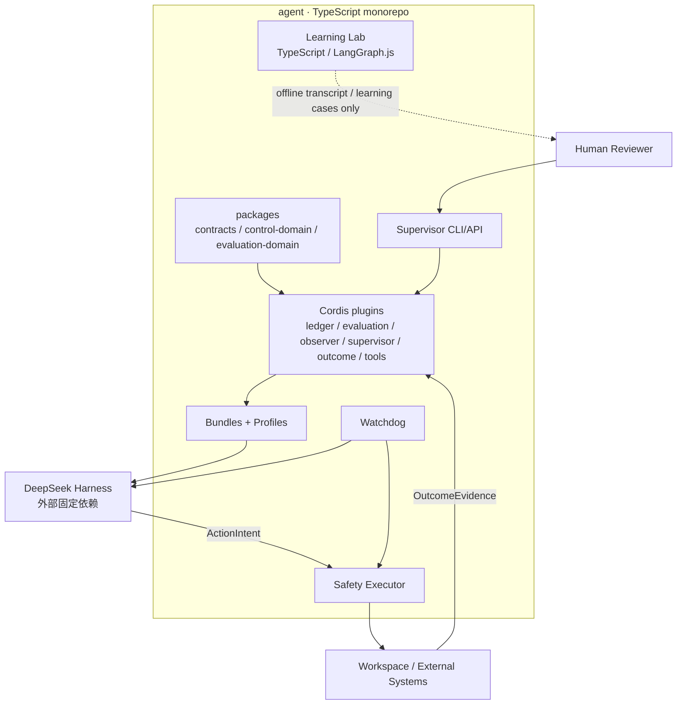
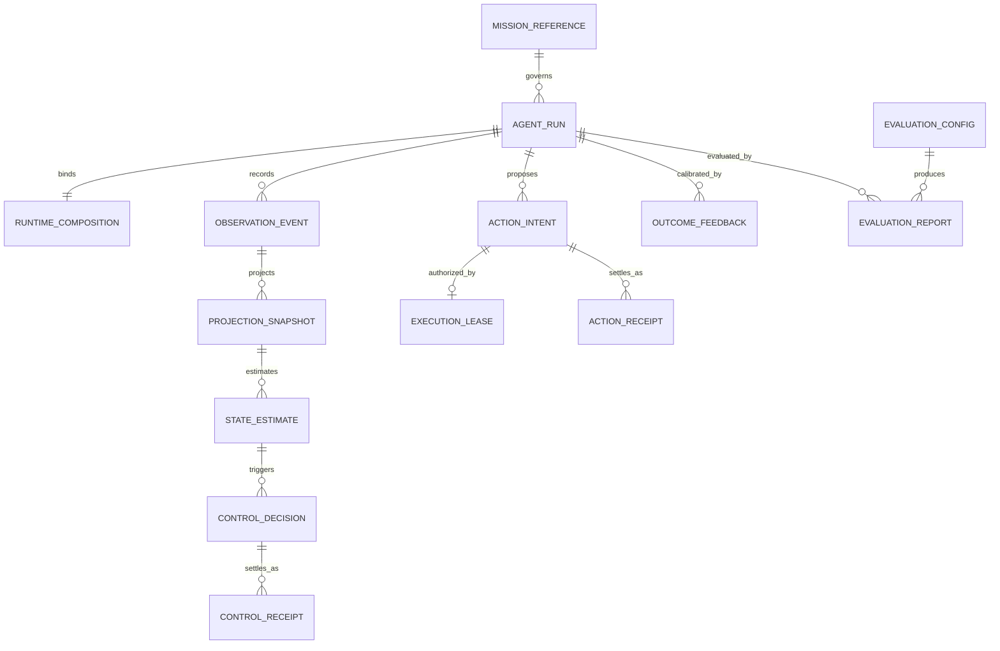
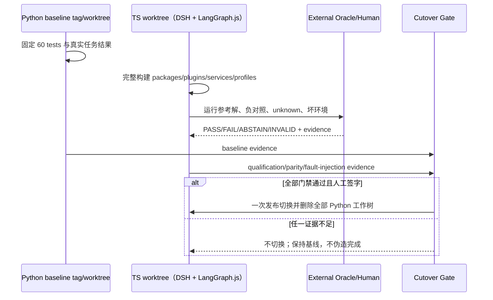

# 技术方案：智能体控制系统工程架构 v0.1

**目标仓库**：`/Users/wanglongxiang/git/agent`；整个目标仓库为 TypeScript，同时保留 DSH 与 LangGraph.js 两个 Runtime
**Runtime 基座**：精确固定 `@deepseek-ai/dsh@0.1.0-rc.6`、同版本直接 DSH 包、`@deepseek-ai/cordis@4.0.1`，通过依赖与 out-of-tree Cordis 插件接入，不 fork、不 vendoring
**架构裁决**：2026-08-17 用户确认生产路径一次性重建为 TypeScript + DSH/Cordis；同时把现有 Python/LangGraph 完整迁成 TypeScript/LangGraph.js 学习 Runtime，不保留 Python 代码
**交付方式**：一次发布切换；生产默认入口切到 DSH，LangGraph.js 位于 `labs/runtimes/langgraph-ts/`，旧 Python 只保留 baseline tag
**状态**：已采纳；需求、排序、Safety Executor v0.1、首个真实 Evaluation Case 与 Control Ledger v0.1 Provider 均已确认。下一阶段只允许在本架构约束下拆分纵向 Story，尚不等于代码开发授权
**实现落点**：`Plans/代码重构/2026-08-17-agent控制系统工程落点-v0.1.md`

## 一、目标与非目标

目标是让 `/agent` 成为纯 TypeScript 的双 Runtime 学习型工程：DSH 是唯一生产默认 Runtime，拥有生产 Agent Loop、Session Log、工具管线和插件生命周期；现有 LangGraph 行为使用 LangGraph.js `StateGraph`、checkpoint、interrupt/Command 和 streaming 重建，作为可运行、可测试的学习 Runtime，但不参与生产装配或热切换。

“一次性改成 TS”定义为：在隔离工作区完整构建 DSH 生产 Runtime 和 LangGraph.js 学习 Runtime，通过可信评估、60 个测试语义迁移、行为等价、故障注入和人工验收后，以一次切换删除 Python 工作树。它不表示覆盖当前工作区后再补测试，也不允许为了完成迁移而伪造评估结论。

本方案不包含：在 Python 中仿造 Cordis、fork DSH、把 DSH 源码复制进仓库、维护生产 LangGraph Adapter、生产双 Runtime/热切换、多 Agent 组织平台、在线自修改或不可恢复的生产写操作。

## 二、工程原则

| 原则 | 工程要求 |
|---|---|
| 全仓单语言 | 业务、Runtime、插件、服务、测试、CLI 和 Learning Lab 全部 TypeScript；cutover 后不保留 `.py` |
| 单一 Agent Loop | DSH Agent Loop 是唯一 Turn/Step 编排器；控制面不实现第二套循环 |
| 万物皆插件，但非万物同权限 | Runtime 内能力使用 Cordis Service/Event/Effect；Safety Executor 与 Watchdog 仍是独立进程和权限域 |
| 无特权插件 | 控制插件必须可装卸且 Effect 可逆；不得靠修改 DSH 内核获得特殊路径 |
| 领域与框架分层 | `packages/*-domain` 不 import Cordis/DSH；只有 `plugins/*` 读取 DSH 原生事件与服务 |
| 模型可见即入日志 | 到达模型的内容必须能从 DSH Session Log 重建；控制账本只追加控制域事实，不伪造模型历史 |
| 技术完成不等于现实成功 | DSH turn/step 完成不能直接映射 Evaluation PASS 或业务 Completed |
| 一次切换、完整门禁 | 开发期可在独立 worktree 比较旧基线；生产只切换一次，不长期维护兼容层 |
| 先证明评估 | G-EQ 未通过，禁止删除 Python 基线、开放生产写或宣称迁移完成 |
| 学习 Runtime 隔离 | LangGraph.js Lab 保留等价能力、TS 测试和入口，但无生产凭证、控制面 Adapter、部署清单或反向依赖 |

## 三、物理工程与部署边界



| 进程/故障域 | 内容 | 权限边界 |
|---|---|---|
| DSH Runtime | Agent Loop、Session Log、控制/评估/领域工具插件、Profile/Bundle | 无长期生产写凭证；只能提交 ActionIntent |
| Safety Executor | 权威校验、短时 Lease、幂等执行、效果核验 | 独立配置和凭证；Runtime 无法卸载或修改 |
| Watchdog | 心跳、事件水位、组合指纹、失联降级/隔离 | 独立启动与降级通道 |
| Supervisor App | 人工查看证据、审批、裁决和恢复命令 | 不直连数据库表，不绕过领域服务 |
| LangGraph.js Learning Lab | 迁写后的 TS Runtime、60 tests 语义、教程和离线对照 | 不接生产控制面，不持生产凭证，不被生产包 import |

单语言只消除 Python/TypeScript 的构建和类型边界，不取消进程、权限和故障边界。

## 四、目标仓库结构

```text
agent/
├── package.json
├── pnpm-workspace.yaml
├── tsconfig.base.json
├── packages/
│   ├── contracts/                    # 版本化事件、命令、回执、错误与 Schema
│   ├── agent-definition/             # 两个 Runtime 共享 Definition/Prompt 资产模型
│   ├── control-domain/               # Mission/State/Deviation/Decision，纯 TS
│   ├── evaluation-domain/            # Case/Oracle/Verdict/Report，纯 TS
│   └── dsh-bridge/                   # 唯一吸收 DSH/Cordis 版本差异的薄层
├── plugins/
│   ├── control-ledger/               # 追加控制事实与稳定序号
│   ├── evaluation/                   # 资格测试、Oracle 调度、报告
│   ├── control-observer/             # session/event、agent/* → Observation
│   ├── control-supervisor/           # pre-step/tool/turn 接纳与回执
│   ├── outcome-feedback/             # 即时/延迟现实结果
│   └── domain-tools/                 # 项目特有工具；通用 fs/shell 用 DSH 原生 Provider
├── services/
│   ├── safety-executor/              # 独立 TypeScript 进程
│   └── watchdog/                     # 独立 TypeScript 进程
├── bundles/
│   ├── control-base/
│   └── control-production/
├── profiles/
│   ├── evaluation/
│   ├── controlled/
│   └── recovery/
├── apps/
│   ├── supervisor-cli/
│   └── supervisor-api/
├── experiments/                      # A/B/C、故障种子、结果矩阵
├── tests/
│   ├── qualification/
│   ├── plugin-lifecycle/
│   ├── integration/
│   ├── fault-injection/
│   └── acceptance/
├── labs/
│   ├── runtimes/langgraph-ts/        # LangGraph.js StateGraph/checkpoint/interrupt + TS tests
│   └── comparisons/                  # 离线 transcript/学习任务对照，不做 live Adapter
└── docs/
    ├── architecture/
    ├── adr/
    └── runbooks/
```

目标目录没有 Python、`runtime_adapters/`、DSH Python SDK、Python MCP Tool Gateway 或 `legacy/`。DSH 本身就是生产 Runtime；LangGraph.js 是独立学习 Runtime，不被根生产入口或部署制品引用。

## 五、模块边界

| 模块 | 职责 | 主要输入/输出 | 禁止职责 |
|---|---|---|---|
| packages/contracts | 稳定 Envelope、状态、错误、JSON Schema | RuntimeManifest、ControlCommand、Receipt | 不 import DSH/Cordis，不写策略 |
| packages/control-domain | 状态估计、偏差、控制决定 | Observation → Decision | 不监听 DSH 事件，不执行工具 |
| packages/evaluation-domain | 四态评估和证据约束 | Execution + Evidence → Verdict | 不把 DSH status 当 PASS |
| packages/dsh-bridge | 隔离固定 DSH 提交的类型和注册细节 | DSH native ↔ local contracts | 不放领域规则，不成为第二 Runtime |
| plugins/control-ledger | 追加控制事实、投影和重放 | ControlFact → Projection | 不改写 Session Log |
| plugins/evaluation | 运行 Case/Oracle、生成报告 | Session facts + external evidence | 不为赶进度强制 PASS |
| plugins/control-observer | 选择正确事件域并产生 Observation | session/event、agent/* | 不做 StateEstimate |
| plugins/control-supervisor | 接纳 pause/restrict/stop，生成 waterfall receipt | Command → Receipt | 不直接持生产凭证 |
| plugins/outcome-feedback | 关联延迟现实结果 | OutcomeEvidence → Feedback | 不覆盖原始事实 |
| plugins/domain-tools | 仅项目独有工具 | tools/call → result | 不复制通用 fs/shell，不绕过 Safety Executor |
| services/safety-executor | 权限、Lease、幂等、执行、效果核验 | ActionIntent → ActionReceipt | 不接受 Agent 修改安全配置 |
| services/watchdog | 控制面失效检测与降级 | heartbeat/composition/watermark | 不替代业务监督策略 |
| apps | 人工监督和 API | query/command/adjudication | 不内嵌领域规则 |
| labs/runtimes/langgraph-ts | 学习 LangGraph StateGraph、checkpoint、interrupt/resume 和对照旧行为 | 独立 TS CLI/Vitest/transcripts | 不实现生产 Adapter，不被生产包 import，不持生产凭证 |

依赖规则：

```text
apps/plugins → domain packages → contracts
plugins → dsh-bridge → external DSH/Cordis
DSH Runtime → ActionIntent → Safety Executor → Reality
Watchdog → Runtime/Safety Executor（独立权限）
labs/langgraph-ts ↔ shared contracts/offline fixtures/transcripts only（无 live production edge）
```

`control-domain`、`evaluation-domain` 和 `contracts` 不允许 import Cordis、DSH、模型 SDK、数据库或 UI；Cordis Context 和 Typed Events 只停留在插件及 `dsh-bridge`。

## 六、持久化契约

即使不跨语言，以下 Schema 仍需版本化，因为它们跨进程、跨版本、需要重放和审计：

| Schema | 用途 |
|---|---|
| `runtime-manifest.v1` | Runtime 类型、`runtimeRole=production|learning`、版本、DSH 组合指纹或 LangGraph.js graph/checkpointer 指纹 |
| `control-command.v1` | pause/inject/restrict/stop 及预期接纳点 |
| `control-receipt.v1` | intercepted/delegated/admitted/applied/effect_verified/short_circuited |
| `action-intent.v1` | 工具、参数摘要、作用域、幂等键、风险与证据 |
| `action-receipt.v1` | 执行状态、现实效果状态和外部引用 |
| `outcome-feedback.v1` | 即时/延迟现实结果及来源 |
| `evaluation-report.v1` | PASS/FAIL/ABSTAIN/INVALID、配置指纹、证据和人工裁决 |

TypeScript 类型从 Schema 生成或与 Schema 做一致性测试。生产 launcher 只接受 `runtimeRole=production` 且 `runtimeType=dsh`；LangGraph.js Manifest 固定为 `learning`。破坏性变化创建 `v2`；未知状态不得映射为成功。

## 七、数据模型



核心字段约束：对象带 `schemaVersion`；判断带 `sourceRefs`；命令带 `commandId` 与预期接纳点；动作带 `actionId` 和幂等键；报告带 `runtimeManifestId`、`configFingerprint`；估计和结果不得覆盖 Session/控制原始事实。

| 实体 | 关键字段 | 类型/约束 | 持久化语义 |
|---|---|---|---|
| `AgentRun` | `runId`, `missionRef`, `runtimeManifestId`, `state`, `createdAt` | ID 非空；状态只按 §八状态机迁移 | 生命周期聚合根，不覆盖历史状态事实 |
| `RuntimeComposition` | `manifestId`, `runtimeRole`, `runtimeType`, `dshVersion`, `lockHash`, `compositionFingerprint` | production 只能是 `dsh`；DSH/lock/fingerprint 精确匹配 | 每次启动生成不可变快照 |
| `ControlFact` | `factId`, `runId`, `sequence`, `factType`, `payload`, `sourceRefs`, `recordedAt` | `(runId, sequence)` 唯一且单调；`factId` 幂等 | append-only；修正通过新事实表达 |
| `ProjectionSnapshot` | `runId`, `throughSequence`, `projectionVersion`, `stateHash` | 只能由事实前缀纯函数生成 | 可删除重建，不是真理源 |
| `ControlDecision` | `decisionId`, `runId`, `basisSequence`, `decisionType`, `reason`, `sourceRefs` | 必须绑定稳定事实水位 | 追加记录，不改写观察事实 |
| `ActionIntent` | `actionId`, `runId`, `idempotencyKey`, `scope`, `riskLevel`, `compositionFingerprint`, `evidenceRefs` | `actionId/idempotencyKey` 唯一；高风险必须有证据 | Safety Executor 接纳前不可产生现实写 |
| `ActionReceipt` | `receiptId`, `actionId`, `stage`, `effectStatus`, `externalRefs`, `recordedAt` | stage 单调追加；unknown 不得改写为 success，只能追加 reconcile | 技术执行与现实效果分账 |
| `EvaluationReport` | `reportId`, `caseId`, `runtimeManifestId`, `verdict`, `configFingerprint`, `evidenceRefs` | verdict 四态；PASS/FAIL 必须有不可变证据 | Case/Oracle/fixture 版本变化生成新报告 |
| `HumanReview` | `reviewId`, `subjectId`, `reviewer`, `decision`, `reason`, `sourceRefs`, `signedAt` | 只能由指定人工身份写入；AI 不代签 | 追加签署；撤回通过新 review 表达 |

## 八、状态机

AgentRun：

```text
Created → Observing → Running → ProvisionallyAccepted → OutcomeValidating → Completed
                         ↘ Paused / Constrained / ReadOnly / RecoveryOnly
                         ↘ Failed / Isolated
```

ActionIntent：

```text
Proposed → Denied
         → Authorized → Executing → Succeeded
                                ↘ Failed
                                ↘ EffectUnknown → Reconciled/Compensated/HumanRequired
```

Evaluation：

```text
DraftCase → Qualifying → Qualified
                     ↘ Invalid
Qualified → PASS | FAIL | ABSTAIN | INVALID
ABSTAIN → HumanAdjudication → new versioned verdict
```

插件生命周期：

```text
Declared → Installed → Ready → Active → Disposed
                  ↘ Failed
Disposed 必须撤销该插件贡献的全部 Effect
```

## 九、API Schema / 接口契约

| 接口 | 边界 | 说明 |
|---|---|---|
| Cordis Service/Event/Effect | DSH ↔ plugins | Runtime 内原生组合，不通过 Python SDK |
| DSH Session Log | DSH ↔ ledger/evaluation/UI | 模型历史、回放和证据来源 |
| ActionIntent API | DSH → Safety Executor | 受控写；需要幂等键、作用域、风险和证据 |
| ActionReceipt/Outcome API | Safety/World → plugins | applied 与 effect_verified 分账 |
| Watchdog control channel | Watchdog → Runtime/Safety | 独立降级与隔离 |

进程内插件使用 Cordis Service/Typed Event，不为同进程调用套 HTTP。以下 API 只用于跨进程边界，生产跨主机使用 mTLS HTTPS，单机开发允许 Unix Domain Socket；所有 payload 先按版本化 JSON Schema 校验。

| 方法 | 路径 | 调用边界 | 幂等 | Request Schema | Response Schema |
|---|---|---|---|---|---|
| `POST` | `/v1/actions/intents` | DSH Runtime → Safety Executor | 是，`idempotencyKey` | `action-intent.v1` | `action-receipt.v1` |
| `GET` | `/v1/actions/{actionId}` | Runtime/Supervisor → Safety Executor | 只读 | path `actionId` | `action-receipt.v1` 最新投影 + receipt refs |
| `POST` | `/v1/runs/{runId}/commands` | Supervisor → control-supervisor | 是，`commandId` | `control-command.v1` | `control-receipt.v1` |
| `GET` | `/v1/runs/{runId}/facts?after={sequence}` | Supervisor/Watchdog → control-ledger | 只读 | 稳定水位 `after` | `control-fact-page.v1` |
| `POST` | `/v1/evaluations/{caseId}/reviews` | 指定 reviewer → evaluation | 是，`reviewId` | `human-review.v1` | `evaluation-qualification.v1` |
| `GET` | `/v1/evaluations/reports/{reportId}` | Supervisor/CI → evaluation | 只读 | path `reportId` | `evaluation-report.v1` |
| `POST` | `/v1/watchdog/attestations` | Watchdog → Safety/Runtime gate | 是，`attestationId` | `authority-attestation.v1` | `attestation-receipt.v1` |

`action-intent.v1` 最小示例：

```json
{
  "schemaVersion": "action-intent.v1",
  "actionId": "act_01",
  "runId": "run_01",
  "idempotencyKey": "run_01:tool_03",
  "toolName": "domain.issue.update",
  "argumentsDigest": "sha256:...",
  "scope": ["issue:123:status"],
  "riskLevel": "high",
  "compositionFingerprint": "sha256:...",
  "evidenceRefs": ["control-fact://run_01/42"]
}
```

`action-receipt.v1` 最小示例：

```json
{
  "schemaVersion": "action-receipt.v1",
  "receiptId": "rcpt_01",
  "actionId": "act_01",
  "stage": "effect_verified",
  "executionStatus": "succeeded",
  "effectStatus": "verified",
  "policyVersion": "policy.v1",
  "leaseId": "lease_01",
  "externalRefs": ["target://issue/123/revision/9"]
}
```

统一错误响应为 `{ code, message, retryable, evidenceRefs, correlationId }`。未知、超时和失联默认失败关闭或转人工，不得自动成功。

| code | HTTP/通道语义 | 含义 | 调用方处理 |
|---|---:|---|---|
| `CONTRACT_INVALID` | 400 | Schema/字段/版本非法 | 修正请求；不得部分执行 |
| `RUNTIME_ROLE_DENIED` | 403 | Learning Runtime 或错误身份访问生产边界 | 拒绝并记录隔离证据 |
| `POLICY_DENIED` | 403 | Scope、风险或策略拒绝 | 不重试；修改请求或人工审批 |
| `COMMAND_NOT_ADMITTED` | 409 | 控制命令未在预期接纳点生效 | 查看 waterfall receipt，不推断已应用 |
| `COMPOSITION_MISMATCH` | 409 | DSH/Profile/Bundle/Patch/Provider 指纹漂移 | 停止启动或 rehearsal |
| `EVALUATION_INVALID` | 422 | Case/Oracle/环境无效 | 修复 Case 并重新资格化 |
| `EVIDENCE_INSUFFICIENT` | 422 | 无法支持 PASS/FAIL | 输出 ABSTAIN，补证或人工裁决 |
| `EFFECT_UNKNOWN` | 202/409 | 外部效果无法判定 | 禁止盲重试，创建 reconcile 任务 |
| `WATCHDOG_DEGRADED` | 503 | 心跳、水位或组合证明不完整 | 降级只读/恢复/隔离 |
| `UPSTREAM_INCOMPATIBLE` | 构建门禁 | 固定 DSH 组合不可构建或类型不兼容 | 阻断升级，保留上一已资格化组合 |

## 十、一次切换流程



开发允许有内部阶段和 Red→Green→Refactor，但没有分阶段生产迁移，也不保留双生产 Runtime。旧 Python 的可信基线由 Git tag/独立 worktree 固定；cutover 后只保留迁写完成的 LangGraph.js Learning Lab，其结果不得直接充当生产控制证据。

## 十一、非功能约束

| 属性 | 约束 | 验证 |
|---|---|---|
| 可重放 | 同一 Session/Control 前缀、Schema 与 projection 版本必须产生相同 state hash；差异率必须为 0 | golden replay + property tests |
| 持久性 | ControlFact 只有 durable commit 成功后才能确认追加；`factId` 幂等且 `(runId, sequence)` 单调唯一 | kill-before/after-commit、重复提交与损坏恢复测试 |
| 插件可逆 | 卸载后 Service/Event/Effect 无残留 | lifecycle/fault tests |
| 安全 | Agent 无安全配置、卸载、长期凭证和旁路权；跨主机仅 mTLS，目标 IAM 只授予 Executor | 权限图、凭证扫描、网络策略与旁路故障注入 |
| 可靠性 | unknown 不自动转成功；外部效果禁止盲重试 | timeout/kill/reconcile tests |
| 可用性 | Ledger、Safety 或 Watchdog 任一关键证明不可用时，受控写自动降级为 read-only/recovery，不允许“高可用”绕过安全 | dependency-kill + degraded-mode acceptance |
| 性能 | B0 先记录基线 p50/p95 与吞吐；架构不伪造固定 SLA。控制链不得出现无界扫描，事实分页和投影查询必须有索引 | benchmark evidence + query-plan/heap guard |
| 可升级 | DSH 只允许从当前精确 rc.6 通过 ADR、lock hash、compatibility、lifecycle、qualification、rehearsal 升级 | pinned-upstream test |
| 可观测 | 每个 command/action/evaluation 必须 100% 关联 runId、稳定水位、composition fingerprint 与证据引用 | receipt waterfall + correlation completeness tests |
| 隐私 | 敏感内容可密封/删除，因果引用与删除证明保留 | 数据分类和删除演练 |
| 切换安全 | 切换前旧基线可从 tag/worktree 重放；失败不删除基线 | release rehearsal |
| 学习隔离 | LangGraph.js Lab 无生产凭证、网络配置和部署入口 | dependency scan + credential/fault tests |

## 十二、ADR

| ADR | 决策 | 备选与取舍 | 影响范围 | 状态 |
|---|---|---|---|---|
| ENG-001 | `/agent` 目标态采用纯 TypeScript pnpm monorepo | 保留 Python：迁移风险较低但长期双语言成本违背目标 | 全仓构建、测试、cutover | **用户已确认** |
| ENG-002 | DSH 是唯一生产 Agent Runtime | 双生产 Runtime/热切换：增加语义与安全组合爆炸 | launcher、部署、凭证 | **用户已确认** |
| ENG-003 | 精确固定 DSH rc.6/Cordis 4.0.1 外部依赖，不 fork、不 vendoring | 跟随 master/fork：能快速改内核但升级与责任边界失控 | dsh-bridge、lockfile、CI | 已采纳 |
| ENG-004 | Runtime 内能力使用 out-of-tree Cordis Plugin/Bundle/Profile | 修改 DSH 核心：形成特权路径和维护分叉 | plugins、bundles、profiles | **用户已确认** |
| ENG-005 | 完整构建后一次 cutover，Python 仅保留 baseline 引用 | 分阶段双生产：回滚直观但形成长期兼容层 | release、回滚、删除清单 | **用户已确认** |
| ENG-006 | Domain 纯 TS；Cordis/DSH 类型只停留在 plugins/dsh-bridge | Domain 直接依赖框架：开发快但无法独立测试/替换 seam | packages、测试依赖规则 | 已采纳 |
| ENG-007 | Safety Executor/Watchdog 使用独立进程、身份、凭证与故障域 | 同进程普通插件：可卸载、可改配置且无法证明无旁路 | services、IAM、网络、recovery | **用户已确认** |
| ENG-008 | 持久化与跨进程契约采用版本化 JSON Schema | 只用 TS 类型：运行时、重放和跨版本无法校验 | contracts、fixtures、API | 已采纳 |
| ENG-009 | G-EQ、60 tests 等价、故障注入、rehearsal、人工签字后才能删除 Python | 按进度强制 PASS：违背可信评估且不可审计 | evaluation、CI、release | **用户已确认** |
| ENG-010 | 通用 fs/shell 使用 DSH 原生受控 Provider，只迁移项目独有领域工具 | 全量重写工具：重复维护且偏离上游 seam | domain-tools、工具策略 | 已采纳 |
| ENG-011 | LangGraph.js 仅为隔离 Learning Runtime | 删除学习 Runtime：更简单但丢失对照与学习价值 | labs、依赖扫描、部署 | **用户已确认** |
| ENG-012 | 当前无生产部署时，最终切换采用 `local_repository` boundary decision，不伪造 production evidence；该决定不得用于未来生产发布 | 继续要求不存在的部署证据：无法完成本地重构且诱导伪签 | release contract、rehearsal、cutover plan | **用户于 2026-08-20 明确确认直接本地切换** |
| ENG-012 | v0.1 Control Ledger 采用 SQLite WAL 单写者 + Provider Port；多实例/跨主机一致写需求出现后通过新 ADR 切 PostgreSQL Provider | 直接 PostgreSQL：支持多实例但提前引入外部运维；纯 JSONL：简单但唯一序号、事务和查询证明弱 | control-ledger、projection、备份/迁移 | **用户已确认** |

## 十三、2026-08-17 变更影响

| 原设计 | 新裁决 | 影响 |
|---|---|---|
| Python 控制面 + TS DSH 插件 | 全部 TypeScript | 删除 Python 包、SDK Adapter、跨语言 CI 设计 |
| LangGraph 与 DSH 比较后选型 | DSH 已选定为唯一 Runtime | 旧 LangGraph 只作为验收基线，不做 Adapter |
| 分阶段迁移并保留兼容层 | 完整构建后一次切换 | 增加切换门禁、发布演练和删除清单 |
| Python MCP 领域工具 | Cordis/TS 领域工具 | 逐项重写，通用 fs/shell 不迁 |
| DSH Python SDK 驱动 | DSH 原生 Profile/Bundle/Cordis | 删除 SDK 与 JSON-RPC Host Adapter |
| 跨语言 fixtures | 单语言 Schema/持久化/契约 fixtures | 仍保留版本化 Schema，但取消 Python/TS parity |
| Python 仅留 tag/worktree | 将现有 LangGraph 完整迁写为 LangGraph.js Learning Lab | 全仓保持 TypeScript，同时保留两个 Runtime 的学习价值 |

受影响并需重写：控制面改造计划及旧 `.impl.json`、可信评估计划及 `.impl.json`、工程落点及 `.impl.json`、相关文章中的 Runtime 图。母模型的逻辑控制契约不变，只更新生产/学习边界。

## 十四、需求影响矩阵

| 需求 ID | 影响模块 | API/状态/数据契约 | ADR | 故事拆分约束 |
|---|---|---|---|---|
| B0 | baseline manifest、evaluation-domain、qualification tests | `runtime-manifest.v1`、`evaluation-report.v1`；DraftCase→Qualified/Invalid | ENG-003/009 | 首个故事必须证明基线和评估准绳可区分正例、负例、unknown、坏环境；不能依赖未来实现补证据 |
| B1 | workspace、contracts、dsh-bridge、bundles/profiles、LangGraph.js Lab | composition fingerprint、production/learning role gate、插件生命周期 | ENG-001/002/003/004/006/011 | 生产 DSH 与 Learning Lab 分别可启动，但必须有依赖与凭证隔离测试 |
| B2 | agent-definition、evaluation plugin、domain-tools、LangGraph.js tests | 四态 verdict、60 test mapping、MigrationSlice blocked/accepted | ENG-008/009/010 | 每个纵切包含旧语义映射和真实 Red/Green；禁止按测试数量批量宣称等价 |
| B3 | control-domain、control-ledger、observer、supervisor、outcome | `control-command.v1`、`control-receipt.v1`、ControlFact/Projection 状态 | ENG-006/008/012 | 先交 append/replay/幂等与 receipt waterfall，再接策略；Provider 未确认不做持久化实现 |
| B4 | safety-executor、watchdog、domain-tools、recovery Profile | `action-intent.v1`、`action-receipt.v1`、AuthorityAttestation；ActionIntent 状态机 | ENG-007/008/010 | 必须包含旁路、重复 Intent、效果未知、Watchdog 失联四类反例；同进程 mock 不能充当生产安全证明 |
| B5 | 全仓、release runbook、acceptance/fault tests | CutoverCandidate blocked/approved/cutover、baseline refs、人工 review | ENG-005/009/011 | 独立 cutover Story 最后执行；任一红灯不得删除 Python 或切生产入口 |

需求 Plan 已采纳且 `p0_open=0`，Backlog、Safety Executor v0.1、Case v1 和 ENG-012 Control Ledger v0.1 Provider 均已确认。架构门禁通过后进入 Story 拆分；在 Scope、故事点和逐 Story 实现落点确认前仍不进入代码开发。

## 十五、验收标准

- [ ] 目标工作树不包含 Python；生产入口和部署制品不依赖 LangGraph.js Lab；
- [ ] DSH Agent Loop 是唯一生产循环，LangGraph.js 循环只能由 Learning Lab 入口启动；插件卸载可撤销全部 Effect；
- [ ] Domain packages 不 import Cordis、DSH、模型 SDK、数据库或 UI；
- [ ] 参考解 PASS、已知错误 FAIL、证据不足 ABSTAIN、坏题/坏环境 INVALID；
- [ ] DSH technical success 可被外部 Oracle 推翻；
- [ ] 控制命令从 intercepted 到 effect_verified 全链有分账回执；
- [ ] Runtime 无法修改或卸载 Safety Executor/Watchdog；
- [ ] 当前 Python 基线的真实行为和 60 tests 有不可变证据；
- [ ] LangGraph.js Lab 可独立运行迁写后的 60 tests，且生产包/部署对它零依赖；
- [ ] 切换前完成一次 release rehearsal，失败时不删除 baseline tag；
- [ ] 用户现有未提交修改未被覆盖或丢失。

## 续做

```text
/resume plan=Plans/Epic/2026-08-17-agent全仓TypeScript重构.md 进度=story-split
```

📌 当前阶段：正式架构已采纳 | 下一个阶段：`task-splitter` | 如需中断：`/resume plan=Plans/Epic/2026-08-17-agent全仓TypeScript重构.md 进度=story-split`

## 反馈（skill_run）

```yaml
skill_run:
  skill: change-impact-analysis
  workflow_stage: architecture
  plan: Plans/技术方案/2026-08-17-智能体控制系统工程架构-v0.1.md
  date: 2026-08-17
  contexts_used:
    - path: Plans/技术方案/2026-08-17-智能体控制系统工程架构-v0.1.md
      utility: high
      reason: "定位 polyglot、LangGraph Adapter、Python SDK 和分阶段迁移的全部旧假设"
    - path: Plans/代码重构/2026-08-17-agent控制系统工程落点-v0.1.md
      utility: high
      reason: "定位需要替换的 Python 文件落点、跨语言测试和迁移阶段"
  contexts_missing:
    - "首个真实 Evaluation Case、Oracle 与人工验收责任人"
    - "Safety Executor 传输、凭证和旁路部署决策"
  contexts_stale: []
  outcome: "确认单语言一次切换是 P0 变更，废止 Python/TS 双语言与 LangGraph/DSH 双 Runtime 目标"
  utility: high
  reason: "避免旧机器清单继续派生 Python Adapter，并把一次切换与跳过评估明确分开"
```

```yaml
skill_run:
  skill: architecture-design-assistant
  workflow_stage: architecture
  plan: Plans/技术方案/2026-08-17-智能体控制系统工程架构-v0.1.md
  date: 2026-08-17
  contexts_used:
    - path: Plans/技术方案/2026-08-14-智能体系统控制母模型-v0.1.md
      utility: high
      reason: "保持三层闭环、M1—M12、事实分账和安全权限边界不因语言选择而漂移"
    - path: /Users/wanglongxiang/git/agent/README.md
      utility: high
      reason: "确认现有 Python LangGraph 工程是 TS/LangGraph.js 行为迁写来源，但不能直接充当 DSH 插件体系"
  contexts_missing:
    - "智能体控制系统正式需求分析 Plan"
    - "已采纳需求排序 Backlog"
  contexts_stale: []
  outcome: "形成全仓 TypeScript、DSH 唯一生产 Runtime、LangGraph.js Learning Runtime、Cordis 原生插件与一次发布切换的目标架构"
  utility: high
  reason: "消除跨语言复杂度，用 runtimeRole 硬隔离生产与学习，同时保留两个 Runtime 的学习价值"
```

```yaml
skill_run:
  skill: architecture-design-assistant
  workflow_stage: architecture
  plan: Plans/技术方案/2026-08-17-智能体控制系统工程架构-v0.1.md
  date: 2026-08-17
  contexts_used:
    - path: Plans/需求分析/2026-08-17-agent全仓TypeScript重构.md
      utility: high
      reason: "以已采纳的 22 组 GWT、四态评估、60/60 迁移矩阵和 Safety 边界作为架构真理源"
    - path: Plans/需求排序/2026-08-17-agent全仓TypeScript重构.md
      utility: high
      reason: "按已确认的 B0→B1→B2→B3→B4→B5 顺序建立需求影响矩阵和故事拆分约束"
    - path: Plans/技术方案/2026-08-14-智能体系统控制母模型-v0.1.md
      utility: high
      reason: "保持事实账本、动态投影、技术/现实分账、权限根与组合证明不变式"
    - path: /Users/wanglongxiang/git/agent
      utility: high
      reason: "核对当前分支、TypeScript 评估骨架和尚未存在的生产 Ledger Provider，避免把目标架构写成已实现"
  contexts_missing:
    - "ENG-012 Control Ledger v0.1 选择 SQLite WAL 还是 PostgreSQL 的用户确认"
  contexts_stale:
    - path: Plans/代码重构/2026-08-17-agent控制系统工程落点-v0.1.md
      reason: "仍记录 Safety、Case、Ledger 三项待确认，架构采纳后需同步已闭环状态和最终 Provider 裁决"
  outcome: "补齐可执行 API Schema、实体字段、错误码、非功能约束、完整 ADR 与 B0—B5 需求影响矩阵；清除已闭环的需求/Safety/Case 旧状态，仅保留 Ledger Provider 人工裁决"
  utility: high
  reason: "正式架构现在能约束后续纵向 Story 和 Red 测试，同时不靠伪造 SLA 或自动选择存储让门禁变绿"
```

```yaml
skill_run:
  skill: architecture-design-assistant
  workflow_stage: architecture
  plan: Plans/技术方案/2026-08-17-智能体控制系统工程架构-v0.1.md
  date: 2026-08-17
  contexts_used:
    - path: Plans/需求分析/2026-08-17-agent全仓TypeScript重构.md
      utility: high
      reason: "确认需求已采纳、P0=0，且 Ledger 选择不改变四态评估和失败关闭约束"
    - path: Plans/需求排序/2026-08-17-agent全仓TypeScript重构.md
      utility: high
      reason: "确认 ENG-012 归属于 B3，不改变已确认的 B0→B5 顺序"
    - path: Plans/技术方案/2026-08-17-智能体控制系统工程架构-v0.1.md
      utility: high
      reason: "将用户确认写入 ADR、数据持久性约束和后续 Story 拆分边界"
  contexts_missing: []
  contexts_stale: []
  outcome: "用户确认 ENG-012：Control Ledger v0.1 采用 SQLite WAL 单写者与 Provider Port；正式架构状态改为已采纳"
  utility: high
  reason: "最后一个开放架构裁决由用户承担，Provider 可替换边界明确且没有提前引入 PostgreSQL 运维成本"
```
