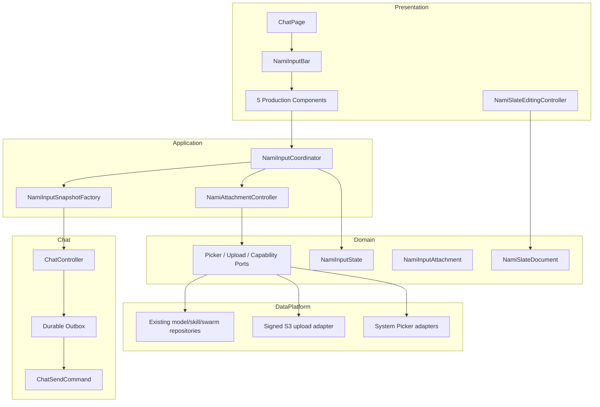
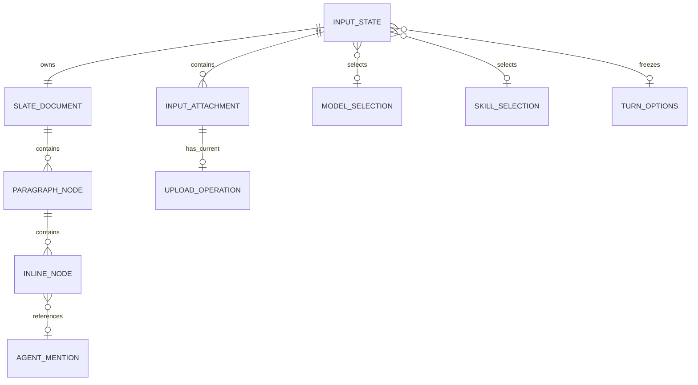
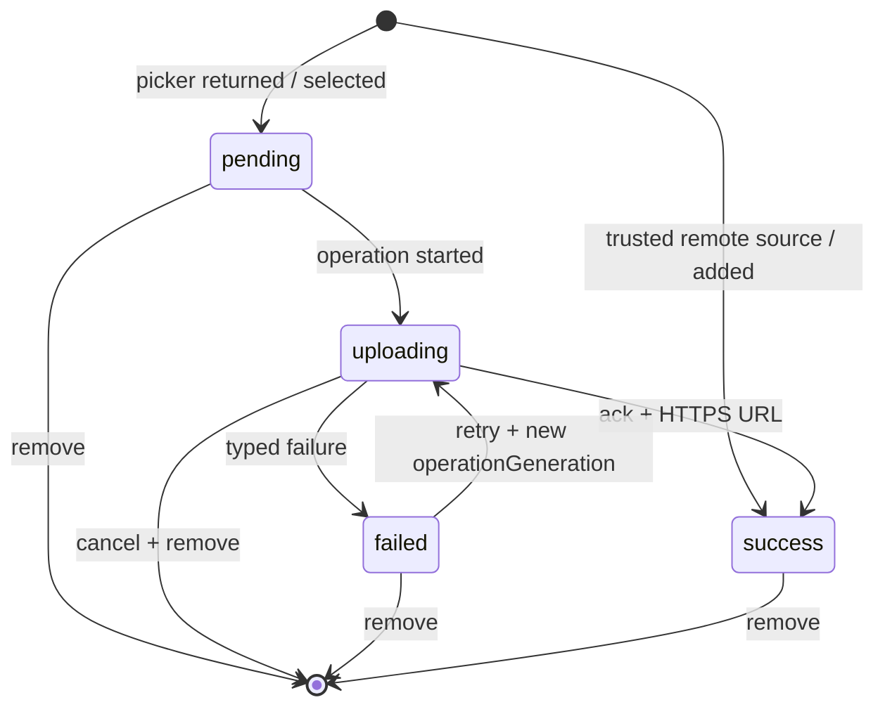
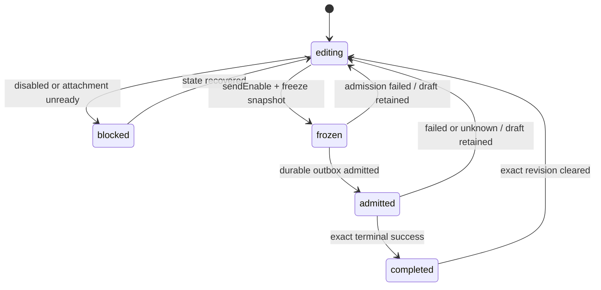
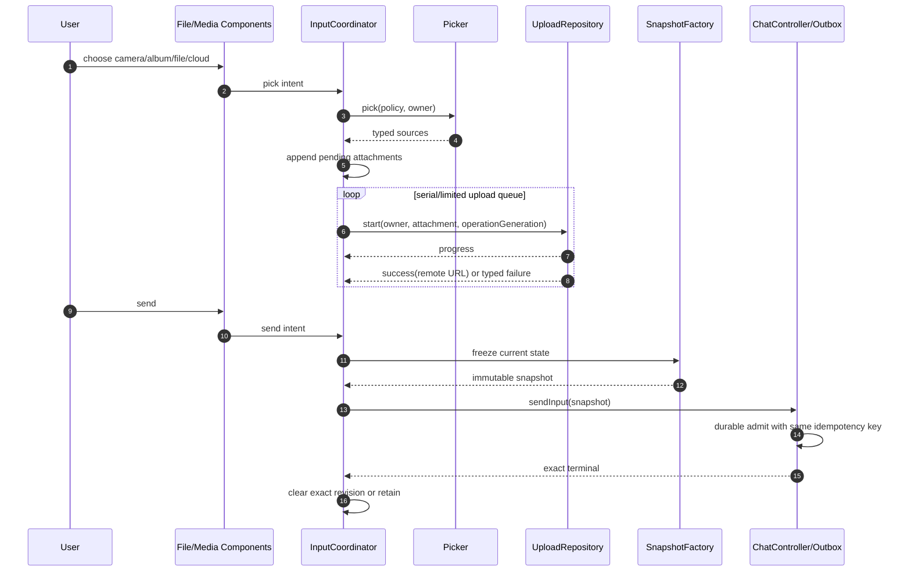

# 技术方案：Flutter 组件化 InputBar

## 一、目标与架构裁决

本方案把 `474e5cd2` 的同步组件底座扩展为可生产使用的输入域。Flutter 继续负责所有共享 UI；平台层只提供系统 Picker/权限等无可靠纯 Dart 等价的能力。成功标准是用户最终确认的 5 类组件（Slate Text、FileInput、MediaPreview、Model、Skill）均有真实 Flutter 消费者，Slate/@、选择、上传、预览和 durable 发送闭环。

非目标：Dark/旧 FormTextView、自研 Camera/Photo UI、PlatformView 文本桥接、10 万字性能门禁。

## 二、总体架构与依赖方向



固定依赖：

```text
View/Component → Application Controller → Domain Port ← Data/Platform Adapter
ChatPage → SnapshotFactory → ChatController → Outbox/Repository → Gateway
```

`NamiInputBar` 只做同步组装/分发；异步 Picker、Upload 和能力加载由 owner-bound `NamiInputCoordinator` 管理。Component 不得直接 import Gateway、Dio、MethodChannel 或 ChatController。

多实例约束：`NamiInputBar` 只接收组件，不进入 App 聚合根或 Product Chat 运行时。每个使用处为当前 InputBar 实例创建独立 Controller，并把 Picker/Upload 等端口显式注入需要它们的子组件；Controller、attachment list、Picker operation、upload task 与 cancellation token 均随实例销毁。禁止 App/Riverpod 全局 InputBar runtime/provider，也不为 InputBar 增设共享 Factory。

状态防重入约束：对齐 iOS `NMInputBar` 的新旧 State 比较、组件字段差量同步与文本 `inReplace` 语义。Flutter Controller 分发 `applyExternalState` 期间忽略组件的同步状态回报；Slate 的外部 `applyDocument/clearDocument` 只刷新投影，不作为用户编辑上报。真实键盘输入、Mention 替换和附件异步事件仍可在分发结束后正常合并，禁止形成 `apply → report → merge → apply` 同步递归。

## 三、模块边界

| 模块 | 层 | 职责 | 允许依赖 |
|---|---|---|---|
| `input_bar/domain/slate/*` | Domain | paragraph/text/mention 节点、codec、range、display/prompt 导出及最小候选投影 | Dart core |
| `input_bar/domain/attachment/*` | Domain | attachment、phase、owner、failure、picker/upload ports | Dart core |
| `nami_input_state.dart` | Domain | 唯一输入真值、派生 sendEnable/isUploading、selection snapshot | Slate/Attachment domain |
| `nami_input_bar.dart` | Presentation | Component 注册、四位置、同步 merge/distribute、双 Delegate | Domain + Flutter |
| `application/nami_input_coordinator.dart` | Application | 当前 owner、异步 intent、迟到结果围栏、完整 snapshot | Domain ports |
| `application/nami_attachment_controller.dart` | Application | pick→validate→queue upload→retry/remove/reconcile | Picker/Upload ports |
| `components/nami_slate_text_input_component.dart` | Presentation | Flutter editable projection、@触发、原子 mention、发送 | Slate editor + contract |
| `components/nami_media_preview_component.dart` | Presentation | 缩略图/文件卡、进度、失败、重试、删除、预览 | typed callbacks only |
| `components/nami_file_input_component.dart` | Presentation | Camera/Album/File/Cloud actions 与展开态 | typed callbacks only |
| `components/nami_model_component.dart` | Presentation | model/mode/@/workspace 胶囊行 | typed selection/callbacks |
| `components/nami_skill_component.dart` | Presentation | 已选 Skill 展示和移除 | typed selection |
| `data/platform_*_picker.dart` | Data/Platform | 复用 image_picker、系统 DocumentPicker、Cloud picker | Plugins/Channel |
| `data/dio_nami_attachment_upload_repository.dart` | Data | 注入当前 owner 的签名会话，调用 `/api/s3/upload`、输出 progress/HTTPS URL、支持 cancel | Signed HTTP/Dio |
| `chat_controller.dart` | Chat Application | `sendInput(snapshot)` 冻结到 ChatSendCommand/Outbox | Chat domain |

## 四、数据模型



| 实体 | 关键字段 | 约束 |
|---|---|---|
| `NamiSlateDocument` | version、blocks | immutable；JSON sorted/round-trip；空文档合法 |
| `NamiSlateText` | text | 保留换行/emoji；不得存 range，range 每次投影计算 |
| `NamiSlateMention` | nodeId、agentId、displayName、iconUrl? | agentId/name 非空；编辑器中原子长度按 display projection 计算 |
| `NamiSlateEditingProjection` | value、spans、documentRevision | `TextEditingValue` 只对应同 revision 文档；selection/composing 均校验范围 |
| `NamiInputAttachment` | id、source、name、mime、size、phase、progress、localUri?、remoteUri?、error?、operationGeneration | id 唯一；success 必须 HTTPS remoteUri；普通日志禁止 URI |
| `NamiInputOwner` | environment/account/workspace/session/generation | 所有异步结果必须 `owns` 当前 owner |
| `NamiInputSubmissionSnapshot` | revision、prompt、displayText、attachments、mentionedAgentIds、turnOptions | immutable；只含 success attachments；进入 delivery 后不可改 |

### Slate 交换格式

```json
[
  {
    "type": "paragraph",
    "children": [
      {"text": "请让 "},
      {
        "type": "mention",
        "nodeType": "agent",
        "nodeId": "m1",
        "payload": {"agent": {"id": "agent_1", "name": "研究员", "icon": ""}},
        "children": [{"text": ""}]
      }
    ]
  }
]
```

展示导出为 `请让 @研究员`；发送导出为 `请让 @[研究员](agent_1)`。文件远程 URL 由 `NamiInputPromptComposer` 按受控模板追加，不写入 Slate 节点。

## 五、状态机

### Attachment



### Input delivery



## 六、API Schema / 接口契约（必填）

### Domain ports

| 接口 | 方法 | 结果 | 围栏/错误 |
|---|---|---|---|
| `NamiAttachmentPicker` | `pick(kind, maxItems)`、`release(localSource)` | `Picked(sources)` / `Cancelled` / `Failed(safeCode)` | owner 在 Controller 等待返回后复核；临时文件按 `releaseRequired` 释放 |
| `NamiAttachmentUploadRepository` | `upload(NamiAttachmentUploadRequest)` | `Stream<Progress / Succeeded(httpsUri) / Failed(safeCode)>` | request 携带 owner + attachmentId + operationGeneration + deadline + cancellationToken |
| `NamiAttachmentPreviewLauncher` | `preview(attachment, siblings)` | `Future<void>` | launcher 只接收当前实例 immutable snapshot，不持有 InputBar 状态 |
| `NamiInputCapabilityRepository` | `models/skills(owner)` | typed current catalog | stale/degraded/unsupported |
| `NamiInputSnapshotFactory` | `freeze(state, policy)` | valid snapshot or typed rejection | input_empty/attachment_unready/model_unavailable |

### Signed S3 上传协议

| 方法/路径 | Request | Response | 幂等/围栏 |
|---|---|---|---|
| POST `{apiBaseUri}/api/s3/upload` | `multipart/form-data`，字段 `up_file`；文件名使用已校验 basename；签名、会话、workspace 与 operation metadata 由使用处创建的 isolated Dio session 注入 | HTTP 2xx 且 `data.up_url` 为无 fragment 的 HTTPS URI 才是成功；其他响应映射 typed failure | HTTP 本身不声明幂等；客户端用 owner + attachmentId + operationGeneration 丢弃重试/删除/换会话后的迟到结果 |

**Request 示例（仅表达 multipart 字段，不记录文件内容）**：

```text
Content-Disposition: form-data; name="up_file"; filename="report.pdf"
<binary omitted>
```

**Response 示例**：

```json
{
  "data": {
    "up_url": "https://cdn.example.com/path/report.pdf"
  }
}
```

上传 adapter 复用现有 isolated Dio 的设备签名、认证会话、workspace owner 和脱敏日志规则；Feature 不读取或记录签名 Header、Cookie、Token、本地 URI、远程 URL 或文件内容。session factory 在 owner 已换代、签名元数据缺失或运行时身份不一致时返回 unavailable，不降级为无签名上传。

### Chat 发送契约

新增：

```dart
Future<ChatSendReceipt?> sendInput(
  NamiInputSubmissionSnapshot snapshot, {
  String? idempotencyKey,
  VoidCallback? onAccepted,
});
```

映射：`snapshot.prompt → ChatSendCommand.message`，Model 的 `internalModelId → selectedModel`（由 Gateway client 编码进 `extraParams`）。普通 InputBar Skill 对齐 iOS，通过云控 `use_skill` 模板冻结在 prompt 顶部；不写 `chat.send.skillId/skillName`，这两个顶层字段经服务端源码确认只用于技能创建/调试草稿续写。远程文件 URL 已由受控 prompt composer 纳入 message；若 Gateway 明确支持 remote attachment schema，再通过新 ADR 扩展，当前不滥用只接受 base64 的 `ChatSendAttachment.content`。

| 安全码 | 含义 | UI/恢复 |
|---|---|---|
| `input_attachment_permission_denied` | Picker 权限拒绝 | 设置引导；不改已有草稿 |
| `input_attachment_limit_exceeded` | 数量/大小超限 | 拒绝超限项；保留已有项 |
| `input_upload_failed` | 可确定失败 | failed 卡片，可 retry/remove |
| `input_upload_outcome_unknown` | 结果未知 | 禁止发送，reconcile 或 retry |
| `input_owner_stale` | 迟到结果 | 静默丢弃，不污染新 owner |
| `input_attachment_unready` | 发送时附件未成功 | 阻断发送，聚焦失败/上传项 |

## 七、关键流程



## 八、非功能约束

| 维度 | 约束 | 验证 |
|---|---|---|
| 状态一致性 | document/attachment/options 单一 State；异步结果必须 owner+operation 双围栏 | unit/widget race tests |
| 草稿安全 | admission 前不清空；exact revision 成功才清；retry 冻结同 snapshot | controller/outbox tests |
| 上传可靠性 | progress 单调；timeout/cancel/reconcile typed；临时文件 release | repository tests |
| 安全隐私 | 不记录正文、Slate JSON、local/remote URI、token、multipart body | review/log tests |
| 兼容性 | iPhone/iPad/Android Phone/Pad/Fold 共享 Dart；系统 Picker 仅平台 port | focused platform tests；里程碑真机 |
| 无障碍 | 操作热区 ≥44/48、语义标签、进度可朗读、错误不只靠颜色 | widget/semantics tests |
| 性能 | 不在 build 读文件/base64；缩略图按尺寸解码；相等 state 不广播 | profile/widget tests |
| 可恢复 | 权限、失败、未知、后台中断、owner 切换均显式 | GWT regression |

## 九、ADR

| ADR | 决策 | 备选与取舍 | 状态 |
|---|---|---|---|
| ADR-IB-001 | Flutter 文本 renderer + Slate domain document | 不用 PlatformView；实现 projection/atomic mention 成本可控 | 已采纳 |
| ADR-IB-002 | 按用户最终裁决实现 5 类组件：Slate Text、FileInput、MediaPreview、Model、Skill | 不全量复制 InputBar 目录；明确排除 TextAndVoice、Voice、AIGC 和未消费变体 | 已采纳 |
| ADR-IB-003 | 同步 Bar 与异步 InputCoordinator 分离 | 避免组件直接 I/O 或把 async 状态塞进 Widget | 已采纳 |
| ADR-IB-004 | attachment 使用 typed immutable state + owner/operation 围栏 | 不用 Map/dynamic 或仅靠列表 count 比较 | 已采纳 |
| ADR-IB-005 | 复用现有签名网络基础设施实现 `/api/s3/upload`，每个 InputBar 实例注入独立 session factory | 不用 Fake/云盘 ID 冒充聊天远程 URL；不把 Dio/凭证下沉到组件 | 已采纳 |
| ADR-IB-006 | remote file 通过受控 prompt composer 发送 | 当前 Gateway attachment 是 base64 契约，不误填 URL | 已采纳 |
| ADR-IB-007 | mention prompt 对齐 `@[name](agentId)` | 同时保留 mentioned IDs，不等新字段才提供用户功能 | 已采纳 |
| ADR-IB-008 | 发送冻结完整 snapshot 并进入现有 durable outbox | 不在按钮点击后重新读取 model/skill/files | 已采纳 |
| ADR-IB-009 | Flutter 自动布局取代 componentHeight/inputComponentUpdateHeight | 保留整体 `AnimatedSize`，不把 iOS 约束回调搬到 Dart | 已采纳 |
| ADR-IB-010 | AgentSummary/Skill 等外部数据只通过最小投影值接入 | InputBar 不抢先修改其他模块公共模型；生产 adapter 排在对应契约稳定后 | 已采纳 |
| ADR-IB-011 | 普通 Skill 选择按 iOS `use_skill` 模板写入冻结 prompt，发送成功后清除 | 不把 `skillKey/catalogId` 猜作 `chat.send.skillId`；服务端顶层 skill 字段只用于技能创建/调试场景 | 已采纳 |

## 十、需求影响矩阵

| 需求 | 模块/契约 | ADR | Story 约束 |
|---|---|---|---|
| REQ-IB-001 | Bar/State/5 components | 002、003 | 现有底座只能作为首个消费者依赖，不算完整交付 |
| REQ-IB-002 | Slate/Editor/Mention projection | 001、007、009、010 | 必须含可注入 @ picker 和 prompt 导出；外部 Agent 数据 adapter 不在本 Story 抢定义 |
| REQ-IB-003 | Picker ports/File component | 002、003 | 至少相机/相册/本地文件/云盘形成用户入口 |
| REQ-IB-004 | Attachment controller/Qiniu/Preview | 004、005、006 | 选择→上传→重试/删除→可发送为同一纵切 |
| REQ-IB-005 | Model/Skill + external projection | 002、008、010 | 排到外部数据结构稳定后；选择必须进入 snapshot，不只是展示胶囊 |
| REQ-IB-006 | SnapshotFactory/ChatController/Outbox | 006、007、008 | 同一 delivery 冻结 prompt/files/options，覆盖 retry/owner |

## 十一、实施与回滚

实施顺序严格遵循 Backlog：Slate/@ → Picker → Upload/Preview → Model/Skill → sendInput/outbox → 生产 Chat composition。每个阶段先 Red 测试再实现，不新增长期 Feature Flag。

若生产接线回归，回滚只切换 ChatPage composer renderer；Slate/attachment domain 与已上传临时状态没有持久数据迁移。旧 commit `474e5cd2` 保留为可编译底座，不再作为完成证据。

## 反馈（skill_run）

```yaml
skill_run:
  skill: architecture-design-assistant
  workflow_stage: architecture
  plan: Plans/技术方案/2026-08-18-Flutter组件化InputBar.md
  date: 2026-08-19
  contexts_used:
    - path: Plans/需求分析/2026-08-18-Flutter组件化InputBar.md
      utility: high
      reason: "把 Slate/@、选择、上传、5 组件和 durable 发送 AC 转成模块、状态机与接口契约"
    - path: Plans/需求排序/2026-08-18-Flutter组件化InputBar.md
      utility: high
      reason: "按已确认依赖确定 Slate→Picker→Upload→能力组件→完整发送的架构顺序"
    - path: Templates/技术方案模板.md
      utility: high
      reason: "补齐 ER、状态机、API/error、NFR、ADR 与需求影响矩阵"
  contexts_missing:
    - "Chat 远程附件协议尚未提供独立 typed schema"
  contexts_stale: []
  outcome_status: pass
  revisit_needed: false
```

## 续做

```text
/resume plan=Plans/技术方案/2026-08-18-Flutter组件化InputBar.md 进度=进入 story-split
```

## 反馈（skill_run）

```yaml
skill_run:
  skill: architecture-design-assistant
  workflow_stage: architecture
  plan: Plans/技术方案/2026-08-18-Flutter组件化InputBar.md
  date: 2026-08-19
  contexts_used:
    - path: Plans/需求分析/2026-08-18-Flutter组件化InputBar.md
      utility: high
      reason: "把已补齐的 Picker、权限、上传失败、owner 换代和防回写异常矩阵落实为 typed API 契约"
    - path: Plans/需求排序/2026-08-18-Flutter组件化InputBar.md
      utility: high
      reason: "保持附件选择与上传位于 Slate 之后、完整发送之前的已确认依赖顺序"
    - path: Plans/功能开发/2026-08-18-Flutter组件化InputBar-US-IB-002.impl.json
      utility: high
      reason: "对齐当前生产代码的 `/api/s3/upload`、per-instance session factory 和 owner/operation 围栏，清除旧 Qiniu 方案漂移"
  contexts_missing: []
  contexts_stale: []
  outcome_status: pass
  friction: "旧技术方案已有接口内容但标题不满足机械门禁，且上传协议仍残留早期 Qiniu 设计"
  revisit_needed: false
```
