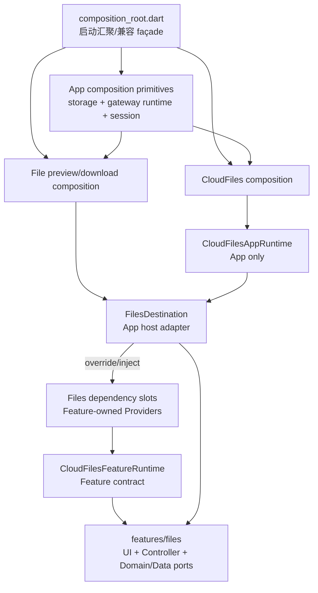
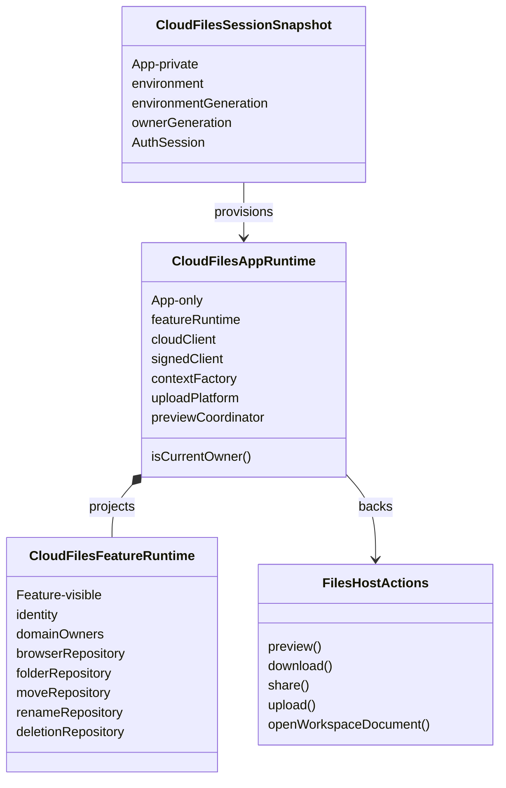
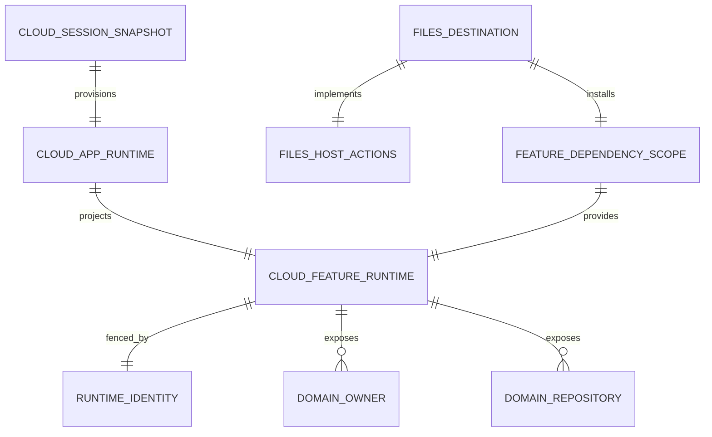
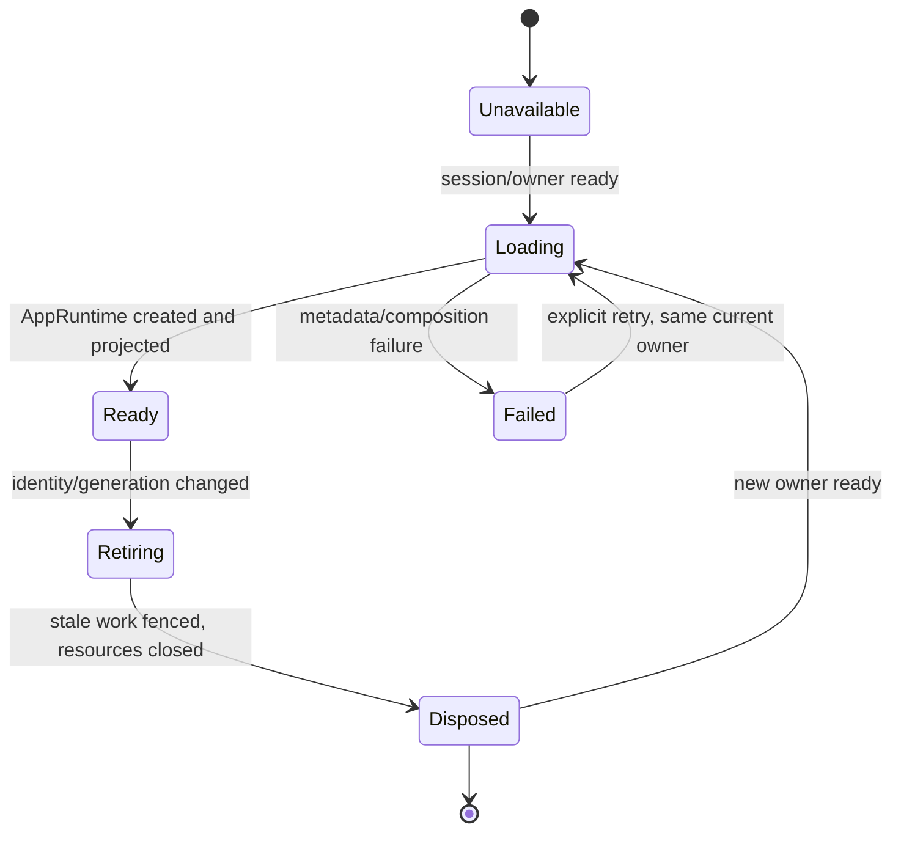
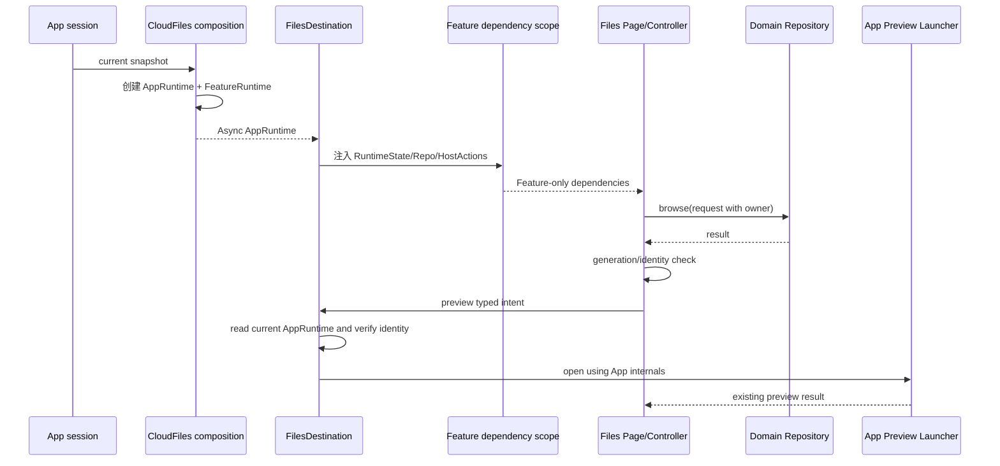

# 技术方案：Flutter CloudFiles 与文件预览依赖边界重构

**状态**：已采纳
**平台**：Flutter（Android Phone/Pad/Fold、iPhone/iPad）
**关联需求真理源**：`Plans/需求分析/2026-08-19-Flutter-CloudFiles与文件预览依赖边界重构.md`
**关联 Backlog**：`Plans/需求排序/2026-08-19-Flutter-CloudFiles与文件预览依赖边界重构.md`

## 一、背景与目标

### 根因

现状把两种对象混为一个 `CloudFilesRuntime`：

- App 装配对象：Dio、鉴权会话、签名、token source、平台上传下载、预览 coordinator、缓存目录；
- Feature 消费对象：owner、领域 Repository、预览/上传下载动作。

因此出现三条错误依赖：

1. `lib/features/files/**` 直接导入 `lib/app/composition_root.dart`、App Provider 和 `CloudFilesRuntime`；
2. `lib/app/composition/*files*` 为读取共享 Provider 反向导入 `composition_root.dart`；
3. App host 的回调把整个 Runtime 重新传回 App launcher，使实现细节沿调用链扩散。

这不是“Provider 不能放 App composition”，而是**具体装配、Feature contract、根汇聚入口没有分层**。

### 成功指标

- `lib/features/files/** -> lib/app/**` 非法 import 数量从当前多处降为 0。
- `lib/app/composition/** -> composition_root.dart` 非法 import 数量降为 0。
- Files 页面、AI Files Controller/SDK 不再读取 App Provider 或 `ActiveGatewayRuntimeIdentity`。
- Feature 可见 Runtime 不含 client、AuthSession、签名、token、platform、coordinator、Provider Ref。
- owner 切换迟到结果、Runtime lifecycle、云文件预览、上传下载的定向回归保持通过。
- 网络协议、错误语义、缓存 namespace `personal-cloud`、持久化格式和 UI diff 为 0。

### 非目标

- 不治理 Chat、Claw Discovery 等其他 Feature → App 历史依赖。
- 不重写文件预览引擎、下载管理器或上传插件。
- 不修改 Gateway/Cloud API、签名协议、缓存格式和产品交互。
- 不在本阶段确定逐文件实现落点、拆 Story、估故事点或写代码。

## 二、原则对照

| 原则 | 本方案约束 |
|---|---|
| SRP | Root 只汇聚；composition 创建实现；Host 适配；Feature 表达状态与业务动作 |
| DIP | Files 依赖自己的 Repository/Port；App 依赖并实现这些 contract |
| ISP | 预览、传输、Workspace 文档和 Cloud Repository 分为窄能力，不暴露大 Runtime |
| OCP | 新文件来源通过 typed source/host adapter 扩展，不修改 Feature 对 App 的依赖规则 |
| DRY/KISS | 复用现有 Repository 与 preview coordinator；不新建第二套状态机或网络协议 |
| YAGNI | 只治理 Files 范围，不借本 Epic 拆完整 `composition_root.dart` |

## 三、约束与前提

- 当前生产代码、现有测试和已采纳需求是事实。
- App composition 仍是生产依赖唯一创建者；“不在根文件”不等于“放进 Feature”。
- `CloudFilesSessionSnapshot/Store` 是 App 内部的鉴权/环境快照和 revision store，不是页面 Session，不进入 Feature。
- 现有具体 Repository 已包含 owner 判断时继续复用；新边界不得削弱 generation/identity fence。
- App 根中被 Files composition 使用的共享 Provider 需要提取其**最小依赖闭包**为叶子装配模块；非 Files 消费者可经 root 兼容 export 过渡。
- 不新增 feature flag；这是结构重构，采用小步可回滚提交与测试门禁。

## 四、目标架构

### 4.1 依赖方向



禁止边：

```text
features/files -X-> app/**
app/composition/** -X-> composition_root.dart
CloudFilesFeatureRuntime -X-> Dio/AuthSession/SignedHttpClient/Platform/WidgetRef
Files callbacks -X-> CloudFilesAppRuntime
```

### 4.2 模块边界

| 模块 | 职责 | 输入 / 输出 | 允许依赖 |
|---|---|---|---|
| Files Feature contracts | 声明 Feature Runtime、runtime state、Repository、Host action port、依赖槽 Provider | 输入窄契约；输出页面/Controller 所需能力 | Flutter/Riverpod、Files domain、稳定 claw API/domain |
| Files Presentation/Application | 渲染、转发、管理加载/搜索/取消和本地 generation | 输入 Feature contract；输出 typed intent | Files contracts/domain；不得依赖 App |
| App composition primitives | 提供目录、Gateway runtime identity、transition、ClawApi、CloudFiles session 等共享前置 Provider | 输出可被其他 composition 模块 watch 的 Provider | Core/Claw/App runtime；不得依赖 Files composition |
| CloudFiles composition | 构造网络、签名、token、Repository、上传下载/Cloud preview 资源 | 输出 `AsyncValue<CloudFilesAppRuntime?>` | primitives、Core、Files Repository 实现、平台包 |
| File preview/download composition | 构造 Gateway/Workspace/AI 预览、下载、缓存与平台实现 | 输出 App runtime/launcher | primitives、App integrations、平台包 |
| `FilesDestination` | 将 App Runtime 投影成 Feature Runtime；将 Preview/Download/Upload/Document 动作注入 Feature | 输入 App Provider；输出 Feature dependency overrides | App composition + Files contracts |
| `composition_root.dart` | 启动汇聚、跨 App 协调、兼容 export | 输入叶子 Provider；输出 App 入口 | App composition modules；子模块不得依赖它 |

### 4.3 Provider 归属规则

| Provider 类型 | 定义位置 | 示例 |
|---|---|---|
| Feature dependency slot | Files Feature | Cloud runtime state、Workspace Repository、Gateway lease、Host actions |
| 具体生产 builder/provider | App composition | CloudFiles App runtime、preview runtime、download runtime |
| 跨 composition 前置 Provider | App composition primitive | directories、gateway identity/API、CloudFiles session |
| 启动协调/全局副作用 | composition root 或 App coordinator | 登录变化 invalidation、App lifecycle coordination |

Feature dependency slot 的默认实现必须 fail-fast 或显式 unavailable；生产环境由 `FilesDestination` 的子 `ProviderScope`/等价注入覆盖。这样 Feature 内部仍可使用 Riverpod，但不知道具体依赖从哪个 App Provider 创建。

### 4.4 Runtime 拆分



`CloudFilesFeatureRuntime` 不包含：

- `CloudFileClient` / `SignedHttpClient` / context factory；
- `AuthSession`、token 或签名材料；
- `NamiCloudUploadPlatform`、download platform；
- `AppFilePreviewCoordinator`、App cache、platform previewer；
- `Ref`、`WidgetRef` 或任何 App Provider。

上传、下载、分享和预览由 Host action 接受 typed item + expected identity/generation；App host 在执行时读取当前 `CloudFilesAppRuntime` 并复核 owner，绝不让 Feature 把 Runtime 传回来。

### 4.5 Gateway/AI/Workspace 边界

- `CloudDriveSdk` 接口和 `CloudDriveRepository` 继续属于 Files；`FilesystemGateway` 适配器的生产创建移到 App composition/host。
- `CloudBrowserController` 不再读取 `clawApiProvider` 或 `ActiveGatewayRuntimeIdentity`；连接恢复进入 Repository/DataSource，Controller 只消费 Feature 的 Gateway lease 与 Repository。
- `WorkspaceBrowserRepository` contract 留 Files；`GatewayWorkspaceBrowserRepository` 由 App 创建并注入。
- Gateway lease 只含稳定 id、owner 维度和 generation，不含 Claw runtime、Provider 或连接实现。

## 五、数据模型

本方案不新增数据库或迁移；下图是运行期依赖实体。



| 实体 | 字段 | 类型 | 必填 | 说明 |
|---|---|---|---|---|
| CloudFilesSessionSnapshot | environment | EnvironmentDescriptor | 是 | App 内部环境快照 |
| CloudFilesSessionSnapshot | environmentGeneration / ownerGeneration | int | 是 | 运行时代次 |
| CloudFilesSessionSnapshot | session | AuthSession | 是 | 敏感，仅 App composition |
| CloudFilesRuntimeIdentity | environmentId / providerId / stableId / generation | value fields | 是 | Feature 可比较 owner 身份，不含凭据 |
| CloudFilesFeatureRuntime | identity / domain owners / repositories | immutable refs | 是 | Feature 唯一 Cloud 能力投影 |
| FilesGatewayLease | stableId / gateway owner / generation | value fields | 是 | AI/Workspace 异步结果 fence |
| FilesHostActions | typed actions | interface | 是 | App 实现，Feature 发意图 |

持久化影响：**无**。继续使用既有 `personal-cloud` owner namespace 和现有 cache/download 目录。

## 六、状态机



Feature 接收的状态为 `Unavailable | Loading | Ready(FeatureRuntime) | Failed(safeError)`。App Runtime 的 Retiring/Disposed 细节不暴露给 UI；迟到结果由 Repository owner fence、Host identity 复核和 Controller 本地 generation 三层共同拒绝。

## 七、API Schema / 接口契约

本轮无 HTTP API 变化。以下是内部 Dart 边界 Schema，命名在实现落点阶段可微调，但字段可见性不可放宽。

### 7.1 Feature Runtime

```text
CloudFilesFeatureRuntime {
  identity: CloudFilesRuntimeIdentity
  browserOwner: CloudFileOwner
  folderOwner: FolderCreationOwner
  moveOwner: CloudMoveOwner
  renameOwner: CloudDriveRenameOwner
  deletionOwner: CloudDriveDeletionOwner
  browserRepository: CloudFileBrowserRepository
  folderRepository: FolderCreationRepository
  moveRepository: CloudMoveRepository
  renameRepository: CloudDriveRenameRepository
  deletionRepository: CloudDriveDeletionRepository
}
```

### 7.2 Feature 依赖状态

```text
sealed FilesRuntimeState<T>
  Unavailable
  Loading
  Ready<T>(value)
  Failed(safeError, retryable)
```

### 7.3 Host actions

```text
previewCloud(context, expectedIdentity, item, cancellation, siblings)
downloadCloud(expectedIdentity, item)
shareCloud(expectedIdentity, item)
uploadCloud(expectedIdentity, targetDirectory, progress)
previewAi/context + FilesGatewayLease + typed item
previewWorkspace/context + FilesGatewayLease + typed item
```

每个动作执行前和异步返回后都复核 expected identity；参数中禁止出现 `CloudFilesAppRuntime`、`Ref` 或 Provider。

### 7.4 内部错误码

| code | 来源 | 处理 |
|---|---|---|
| `cloud_file_device_metadata_unavailable` | 现有 composition | 保持现有失败/重试 |
| `cloud_file_host_platform_mismatch` | 现有 composition | 显式失败，不跨平台降级伪成功 |
| `cloud_file_preview_unavailable` | 现有 preview | 保持现有提示 |
| `cloud_file_owner_stale` | 新边界内部归一化 | 丢弃结果/返回取消，不显示旧数据 |
| `files_dependency_not_installed` | Feature dependency slot | Debug/test fail-fast；生产 Host 必须覆盖 |

不改变服务端 code、HTTP body 或用户可见文案。

## 八、关键流程



## 九、非功能约束

| 维度 | 约束 | 验证方式 |
|---|---|---|
| 依赖可维护性 | Files→App、composition→root 均为 0 | 静态 import boundary test，输出非法路径 |
| 安全 | AuthSession、token、signing/client 不进入 Feature 或日志 | 类型字段测试 + diff 审查 |
| 并发 | owner 切换后迟到加载/预览/下载不得提交 | generation/identity 回归测试 |
| 生命周期 | Dio、download/upload platform、coordinator 最多创建/释放一次 | ProviderContainer lifecycle test |
| 性能 | 不新增网络请求、缓存层或重复 runtime | 请求计数/identity 测试；focused regression |
| 兼容性 | iOS/Android 预览选择、目录、namespace、协议不变 | 既有 Preview/CloudFiles tests；完整设备矩阵留里程碑 |
| 可测试性 | Files Widget/Controller 可用 Feature Fake 测试，不启动 App root | Feature scoped tests |
| 可观测性 | stale/failed stage 脱敏记录，不记录凭据/文件内容 | 日志审查 |

## 十、ADR

| ADR ID | 决策 | 备选与取舍 | 影响范围 | 状态 |
|---|---|---|---|---|
| ADR-CFR-001 | 具体 Provider graph 留 App composition，Feature 只持有 contract/slot | 全搬 Feature 会泄漏平台与鉴权；全放 root 继续耦合 | Files/App composition | 已采纳 |
| ADR-CFR-002 | 使用 Feature-owned dependency slots，由 `FilesDestination` 以子 Scope/等价方式注入 | 全构造参数会穿透巨大页面树；Feature 直接 watch App Provider 违反 DIP | Files presentation/controller | 已采纳 |
| ADR-CFR-003 | 拆为 `CloudFilesAppRuntime` + `CloudFilesFeatureRuntime`，SessionSnapshot 留 App 私有 | 单大 Runtime 简单但持续泄漏；完全不聚合会参数爆炸 | CloudFiles runtime | 已采纳 |
| ADR-CFR-004 | Preview/Download/Upload 由 Host typed actions 读取并验证当前 AppRuntime | 把 Runtime 传入 callback 会让边界失效 | FilesDestination/launchers | 已采纳 |
| ADR-CFR-005 | 提取 composition primitives 的最小依赖闭包，root 可临时兼容 export | 一次拆完整 root 风险过大；保留反向 import 则仍有环 | App composition/root | 已采纳 |
| ADR-CFR-006 | 无数据迁移、无 feature flag；按可回滚结构提交推进 | 双架构长期共存增加分支与生命周期复杂度 | 发布/回滚 | 已采纳 |

评审只需确认前三项；后 3 项是前三项的直接实现约束。

## 十一、需求影响矩阵

| 需求 ID | 影响模块 | API/状态/数据契约 | ADR | 后续拆分约束 |
|---|---|---|---|---|
| CFR-001 | boundary tests、Files/Preview regressions | 禁止 import + owner/lifecycle 不变量 | 全部 | 第一纵切必须先红后绿 |
| CFR-002 | root、composition primitives、files composition | Provider 依赖图 | ADR-005 | 先最小闭包，禁止顺带拆全 root |
| CFR-003 | cloud runtime/session composition | AppRuntime/FeatureRuntime/identity | ADR-001/003 | 不得先删 owner fence 或旧生产能力 |
| CFR-004 | FilesDestination、FilesPage、AI/Workspace controllers | dependency slots/runtime state/gateway lease | ADR-002/004 | 必须闭合真实页面入口 |
| CFR-005 | preview launcher/coordinator/download/transfer actions | typed host action + existing result | ADR-004 | iOS/Android 行为与 cancellation 不变 |
| CFR-006 | main、Projects、download consumers、tests | App internal consumers/compat export/lifecycle | ADR-003/005 | 所有消费者关闭后旧 Runtime 才可移除 |
| CFR-007 | root comment、任务约束、boundary tests | “module 装配，root 汇聚”规则 | ADR-001/005 | 文档与自动门禁同一 Story 验收 |

### 代码影响范围（设计预判，非实施清单）

- App：`cloud_files_runtime.dart`、`composition_root.dart`、Files/Preview/Download composition、`FilesDestination`、Projects/Main 等旧消费者。
- Feature：`features/files/presentation`、AI Files SDK/Controller、Workspace browser contract/provider 边界。
- 测试：App composition boundary、CloudFiles runtime provider、Preview runtime、Files integration、owner/lifecycle tests。
- 文档：目标架构与直接要求 Provider 注册方式的任务约束。

## 十二、方案选项与决策矩阵

| 方案 | 复杂度 | 边界清晰度 | 行为风险 | 长期成本 |
|---|---|---|---|---|
| A. 继续大 Runtime，仅把文件移动 | 低 | 低 | 中，循环和泄漏仍在 | 高 |
| B. Provider 全搬进 Feature | 中 | 低，方向反转 | 高，鉴权/平台下沉 | 高 |
| C. App concrete composition + Feature contracts + Host injection | 中 | 高 | 中低，可渐进且保留实现 | 低 |
| D. 一次拆完整 composition root | 高 | 高 | 高，超出范围 | 中 |

**推荐 C**：它保留 App 对跨来源、平台与凭据的所有权，同时让 Files 真正独立于 App；配合“最小 primitive extraction”避免扩大成全根重构。

## 十三、实施与回滚计划（未来阶段）

| 顺序 | 未来实施内容 | 完成门槛 |
|---|---|---|
| 1 | 锁定 import、行为与生命周期回归 | 新测试先失败且指向现有问题 |
| 2 | 提取 composition primitives 最小闭包 | 子 composition 不再 import root |
| 3 | 拆 AppRuntime/FeatureRuntime | 字段边界测试通过，owner 语义不变 |
| 4 | Host 安装 Feature dependencies | Files/AI/Workspace 不再 import App |
| 5 | Preview/Transfer typed actions | 回调不接 Runtime，现有预览结果不变 |
| 6 | 迁移 Main/Projects/Download 等消费者 | 旧 Runtime 暴露面可删除，lifecycle 通过 |
| 7 | 固化文档与边界门禁 | 规则文字和测试一致 |

回滚：

- 每一步保持可独立回滚；若生产行为测试回退，回滚当前结构提交而非修改协议/清缓存。
- 无数据迁移，无数据库/缓存回滚脚本。
- owner、namespace、签名或平台预览出现差异即停止推进，状态保持 PARTIAL。

## 十四、验收标准

- [ ] `features/files/**` 对 `app/**` import 为 0。
- [ ] `app/composition/**` 对 `composition_root.dart` import 为 0。
- [ ] Feature Runtime 类型无 App/网络/鉴权/平台/Provider 实现字段。
- [ ] FilesDestination 为唯一生产注入点，Feature dependency slots 全部覆盖。
- [ ] AI Files/Workspace Controller 不读取 App Provider，连接恢复由 Repository/DataSource 负责。
- [ ] Preview/Download/Share/Upload callback 不传 AppRuntime，并前后复核 identity。
- [ ] owner 切换、迟到结果、取消、失败重试和 resource dispose 回归通过。
- [ ] 协议、签名、namespace、持久化格式、UI/文案无变化。
- [ ] Main/Projects/Download 等生产消费者完成迁移，不以 Fake/Contract 代替完成。
- [ ] 文档写明“App composition module 装配、root 汇聚”，自动测试防止回退。

## 十五、架构评审结论

2026-08-19 用户确认当前 Preview 装配与整体依赖边界方案“看上去合理”，三项架构裁决正式采纳：

1. 采用 Feature-owned dependency slots + `FilesDestination` 子 Scope/等价注入。
2. 采用 `CloudFilesAppRuntime` / `CloudFilesFeatureRuntime` 两层边界；具体类型后缀可在实现落点阶段按职责选择 `Runtime` 或 `Scope`，不得放宽字段边界。
3. 允许 `composition_root.dart` 在本 Epic 内为非 Files 消费者保留兼容 export，完整 root 清理不进入本 Scope。

架构开放项为 0，技术方案状态更新为“已采纳”。本次确认不授权 Story 拆分、源码修改、提交或推送。

## 续做

```text
/resume plan=Plans/Epic/2026-08-19-Flutter-CloudFiles与文件预览依赖边界重构.md 进度=架构已采纳；等待明确授权 Story 拆分，禁止开始开发
```

## 反馈（skill_run）

```yaml
skill_run:
  skill: architecture-design-assistant
  workflow_stage: architecture
  plan: Plans/技术方案/2026-08-19-Flutter-CloudFiles与文件预览依赖边界重构.md
  date: 2026-08-19
  contexts_used:
    - path: Plans/需求分析/2026-08-19-Flutter-CloudFiles与文件预览依赖边界重构.md
      utility: high
      reason: 以已采纳的边界、异常、数据字典和 14 组 GWT 作为架构真理源。
    - path: Plans/需求排序/2026-08-19-Flutter-CloudFiles与文件预览依赖边界重构.md
      utility: high
      reason: 按不变量、单向装配、Runtime 分离、Host 注入和消费者闭合的确认顺序设计。
    - path: Contexts/需求分析/需求分析产出标准.md
      utility: high
      reason: 确保模块、状态、契约和验收逐项回应已采纳需求。
    - path: Contexts/决策/Skill反馈协议.md
      utility: high
      reason: 按统一协议记录架构技能的输入、缺口和结果。
    - path: /Users/wanglongxiang/git/namiwork-flutter/docs/versions/2.0.0/plan/baseline/target-architecture.md
      utility: high
      reason: 复核 Feature 不依赖 App、只依赖领域 Repository 和稳定 API 的基线方向。
    - path: /Users/wanglongxiang/git/namiwork-flutter/docs/versions/2.0.0/plan/28-file-preview-architecture.md
      utility: high
      reason: 保留 App 负责跨来源预览装配的原始裁决，同时关闭其已记录的 import cycle 风险。
  contexts_missing: []
  contexts_stale:
    - path: /Users/wanglongxiang/git/namiwork-flutter/docs/versions/2.0.0/plan/28-file-preview-architecture.md
      reason: 其中“Provider 定义移出 root”不足以约束 Feature→App 和 composition→root，需由本方案修订。
  outcome_status: partial
  revisit_needed: true
  revisit_reason: 三项 ADR 待用户评审；未授权 Story 拆分和源码修改。
```

```yaml
skill_run:
  skill: architecture-design-assistant
  workflow_stage: architecture
  plan: Plans/技术方案/2026-08-19-Flutter-CloudFiles与文件预览依赖边界重构.md
  date: 2026-08-19
  contexts_used:
    - path: Plans/需求分析/2026-08-19-Flutter-CloudFiles与文件预览依赖边界重构.md
      utility: high
      reason: 复核已采纳需求、P0=0、Preview App 装配边界与无行为变化约束。
    - path: Plans/需求排序/2026-08-19-Flutter-CloudFiles与文件预览依赖边界重构.md
      utility: high
      reason: 确认架构采纳不改变已确认的依赖顺序和本轮 Scope。
    - path: Plans/技术方案/2026-08-19-Flutter-CloudFiles与文件预览依赖边界重构.md
      utility: high
      reason: 将用户对三项 ADR 的确认写入架构真理源并关闭开放项。
    - path: Contexts/决策/Skill反馈协议.md
      utility: high
      reason: 保留原评审记录并追加采纳记录，形成可审计反馈链。
  contexts_missing: []
  contexts_stale: []
  outcome_status: pass
  revisit_needed: false
```
