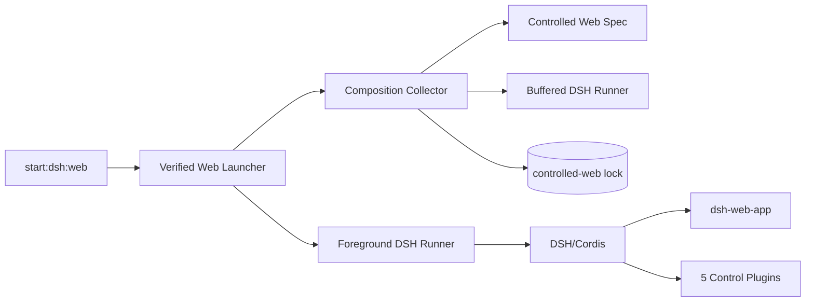
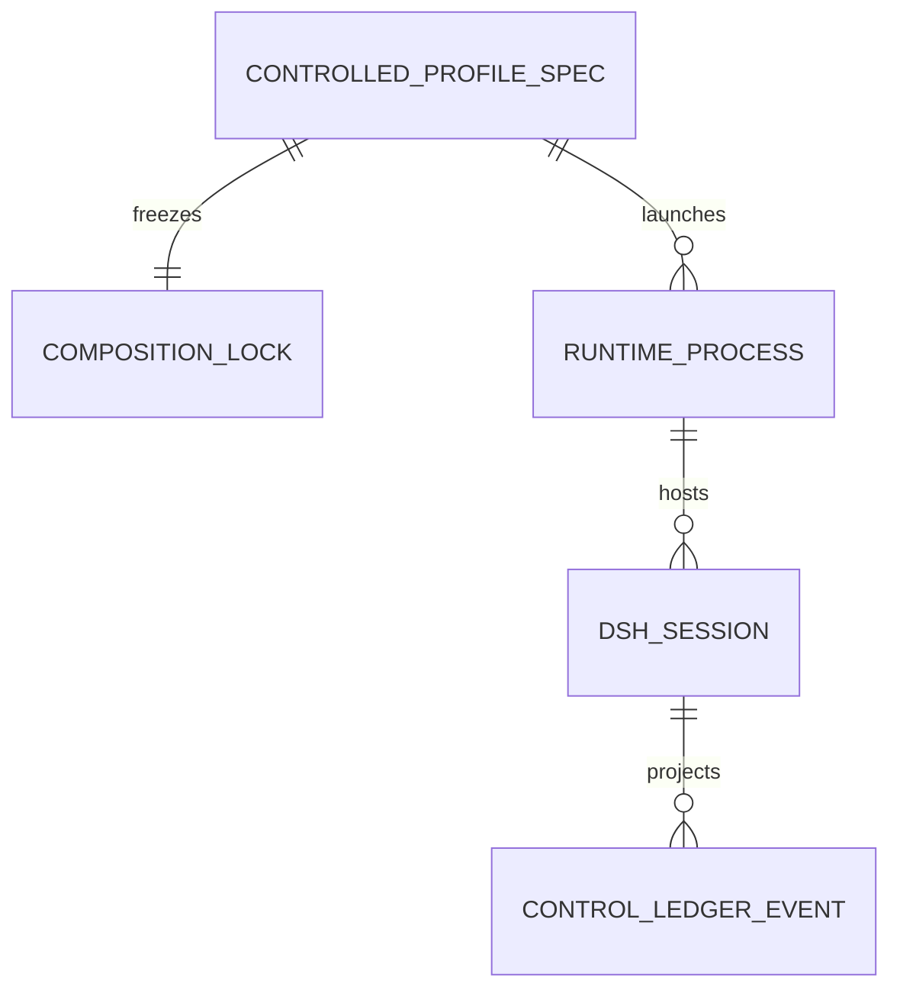
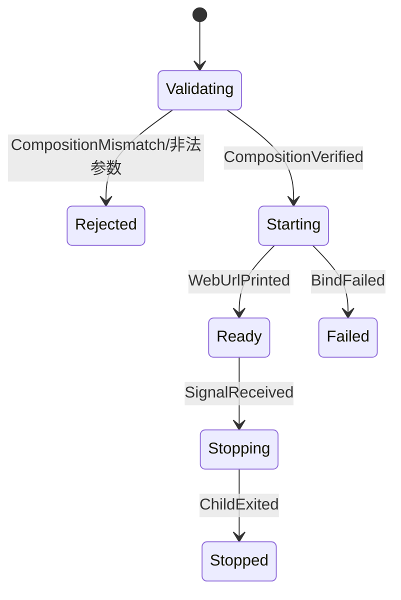

# 技术方案：Agent 受控 DSH 交互式 Web 入口

## 一、背景与目标

- **痛点**：现有 verified launcher、composition contract 和 lock 只表达 `controlled + dsh-headless`；裸 `dsh web` 不包含控制插件。
- **成功指标**：`controlled-web` 能输出本地 URL并提供官方 Web；五个控制插件与 Web Surface 同树；两个 profile 独立 verify；headless 215+ 回归不退化。
- **非目标**：不开发 UI，不新增业务 HTTP API，不公网部署，不自动拉起 Safety Executor/Watchdog，不改变 DSH Session 数据模型。

## 二、原则对照

| 原则 | 采用方式 |
|------|----------|
| SRP | DSH CLI 负责 profile boot；composition 负责事实采集；launcher 负责生产门禁；Web App 负责交互表面 |
| OCP/DIP | 通过受控 ProfileSpec 扩展 Web，不复制一套校验算法；runner 端口支持 buffered/foreground 两种实现 |
| DRY/KISS | 两个 profile 共享五个控制插件、bundle 与校验内核；仅 profile、surface bundle、manifestId、lock 不同 |
| YAGNI | 不抽象任意第三种 Surface；规格仅允许 `controlled` 与 `controlled-web` 两个已批准值 |

## 三、约束与前提

- Node `22.19.0`、pnpm `11.7.0`、DSH `0.1.0-rc.6`、Cordis `4.0.1`。
- 官方 `@deepseek-ai/dsh-web-app` 已在根 DSH 依赖闭包并包含构建后的 frontend dist。
- `NodeDshRunner` 当前缓冲 stdout 直到子进程退出，不适合长驻 Web；需新增继承 stdio 的 foreground runner。
- Web 默认 `127.0.0.1:3080`；不添加公网/鉴权层。
- 根仓库存在用户未跟踪 `docs/plans/`，本 Epic 不修改、不提交。

## 四、模块边界

| 模块 | 职责 | 输入/输出 | 依赖 |
|------|------|-----------|------|
| `ControlledProfileSpec` | 枚举批准的 headless/Web profile、bundle、manifestId、lock 路径 | profile key → 固定规格 | contracts |
| composition collector | 按规格校验 lock、profile、最终 dump、源码/dist 与脚本 | spec + buffered runner → manifest | DSH CLI、fs |
| verified launcher | 禁止 profile/patch/Executor secret，校验 manifest 后启动固定 profile | args → exit code | collector、runner |
| buffered runner | `--version`/`--dump-config`/help 与测试 | argv → stdout/stderr/exit | child_process |
| foreground runner | Web 长驻前台、实时输出 URL、继承终端信号 | argv/env → exit code | child_process |
| `profiles/controlled-web` | 固定 Web + control bundle 层与独立 lock | profile manifest/patch | DSH Web App、control bundles |
| runtime scripts | freeze/verify/start 参数入口 | CLI → bridge | dsh-bridge |



依赖规则：`scripts → dsh-bridge → contracts/upstream DSH`；profile 只声明 bundle/dependency，不反向依赖 scripts；官方 Web 客户端不导入本地控制实现。

## 五、数据模型

不新增业务数据库；复用 DSH Session 与 Control Ledger。新增的是配置身份。



| 实体 | 字段 | 类型 | 必填 | 说明 |
|------|------|------|------|------|
| ControlledProfileSpec | key | `headless \| web` | 是 | 代码内批准枚举，不接受用户输入 |
| ControlledProfileSpec | profileName | `controlled \| controlled-web` | 是 | DSH_HOME 下固定目录 |
| ControlledProfileSpec | manifestId | string literal | 是 | `controlled-production-v1` / `controlled-web-production-v1` |
| ControlledProfileSpec | orderedBundles | readonly string[] | 是 | base + surface + control 两层 |
| RuntimeCompositionManifest.profile | name | union literal | 是 | schema 从单一 const 扩展为 enum |
| RuntimeCompositionManifest | compositionFingerprint | sha256 | 是 | 每个 profile 独立计算 |

## 六、API Schema / 接口契约

本 Epic 不拥有 DSH Web HTTP API；`/`、`/api`、SSE 均由官方 Web App 提供并按其契约透传。新增契约是 CLI/TypeScript port。

| 方法/命令 | 路径/签名 | 说明 | 幂等 | 输入 | 输出 |
|-----------|-----------|------|------|------|------|
| CLI | `pnpm start:dsh:web -- [web args]` | verified Web 前台入口 | 否 | `--host/--port/--trusted-host` | 实时日志 + exit code |
| CLI | `pnpm composition:web:verify` | Web 组合只读验证 | 是 | 无 | fingerprint |
| CLI | `pnpm composition:web:freeze -- --write` | 显式重写 Web lock | 是 | `--write` | fingerprint |
| TS | `collectCurrentComposition(root, runner, spec)` | 按批准规格采集事实 | 是 | repo/runner/spec | manifest |
| TS | `launchControlledWebProfile(root,args,options)` | 校验后前台启动 | 否 | args + ports | exit code |
| HTTP | `GET /` | 官方 Web 静态入口 | 是 | loopback 请求 | 200 HTML |

```ts
interface ControlledProfileSpec {
  readonly key: "headless" | "web";
  readonly profileName: "controlled" | "controlled-web";
  readonly manifestId: "controlled-production-v1" | "controlled-web-production-v1";
  readonly orderedBundles: readonly string[];
}

interface DshForegroundRunner {
  runForeground(args: readonly string[], environment?: Readonly<Record<string, string>>): Promise<number>;
}
```

### 错误码/异常契约

| code/name | 含义 | 调用方处理 |
|-----------|------|------------|
| `COMPOSITION_MISMATCH` | Web 当前事实与 lock 不一致 | 不绑定端口；重新构建/审查/freeze |
| `TypeError` profile/patch | 试图替换固定生产 profile | 修正命令；禁止透传 |
| Executor-only config error | 进程收到独立权限域 secret | 清理环境后重启 |
| `EADDRINUSE`/非零 DSH exit | 端口占用或上游启动失败 | 显示 stderr；更换端口/修复配置 |
| `MISSING_CREDENTIAL` | 模型凭证未配置 | Web 展示错误；不影响服务配置页启动 |

## 七、关键状态与流程



```mermaid
sequenceDiagram
  participant Script
  participant Launcher
  participant Collector
  participant BufferedRunner
  participant ForegroundRunner
  participant DSH
  Script->>Launcher: launchControlledWebProfile(args)
  Launcher->>Collector: collect(webSpec)
  Collector->>BufferedRunner: --version / --dump-config
  Launcher->>Launcher: assert lock == actual
  Launcher->>ForegroundRunner: --profile controlled-web + args + fingerprint env
  ForegroundRunner->>DSH: inherited stdio
  DSH-->>Script: URL/logs in real time; final exit code
```

## 八、非功能约束

| 维度 | 约束 | 验证方式 |
|------|------|----------|
| 安全 | 默认 loopback；拒绝 profile/patch；不携带 Executor secrets；日志不含 API Key | 反例测试 + 环境扫描 |
| 完整性 | profile lock、bundle、patch、scripts、src/dist、最终 dump 全部入 Web fingerprint | drift fault injection |
| 可用性 | URL 输出实时可见；端口冲突非零退出；SIGTERM 释放端口 | 子进程 HTTP/signal 测试 |
| 兼容性 | Node 22.19；macOS/Linux 进程测试；Windows path/typecheck 不退化 | CI/本地矩阵 |
| 性能 | 冷启动至 URL ≤15 秒；验证不启动 Web Server | 计时 smoke + 端口探测 |
| 回归 | headless、recovery、release rehearsal 与 215+ tests 保持通过 | 全量测试 |

## 九、ADR

| ADR ID | 决策 | 备选与取舍 | 影响范围 | 状态 |
|--------|------|------------|----------|------|
| ADR-CW-001 | 双 profile：`controlled` headless + `controlled-web` | 替换默认入口会破坏自动化；单 profile 动态 Surface 会削弱冻结组合 | profiles/scripts/docs | 已采纳 |
| ADR-CW-002 | ProfileSpec 枚举 + 共享 collector | 复制 collector 简单但安全规则会漂移；任意字符串 profile 又过度开放 | contracts/dsh-bridge | 已采纳 |
| ADR-CW-003 | 每个 Surface 独立 composition lock | 单 lock 无法同时冻结不同 bundle/finalConfig | profiles/release | 已采纳 |
| ADR-CW-004 | Web 使用 foreground runner | buffered runner 会直到退出才显示 URL且累积日志；直接 exec 难测试 | dsh-bridge/scripts | 已采纳 |
| ADR-CW-005 | 复用官方 Web，不开发 UI | 自研 TUI/Web 成本高且偏离 DSH profile 架构 | Scope | 已采纳 |
| ADR-CW-006 | manifestId 由 verified launcher 环境注入 | 当前 patch 写死 headless 身份，复制 patch 会冒用身份 | control-production | 已采纳 |

## 十、需求影响矩阵

| 需求 ID | 影响模块 | API/状态/数据契约 | ADR | 故事拆分约束 |
|---------|----------|-------------------|-----|--------------|
| CW1 | contracts、composition、profile/lock、control patch | ProfileSpec/manifest union | CW-002/003/006 | 必须先证明 Web 树与身份可冻结 |
| CW2 | launcher、foreground runner、runtime scripts、README | start:dsh:web/HTTP readiness | CW-001/004/005 | 交付必须能真实打开官方 Web |
| CW3 | tests、release rehearsal、fault injection | error/signal/headless contracts | CW-001—004 | 不能拆成“只写测试”的横向 Story，应随可运行入口验收 |
| CW4 | README、人工 smoke | 无新增 API | CW-005 | 不读取/记录用户 Key；P1 |

## 十一、方案选项与决策矩阵

| 方案 | 完整性 | 复杂度 | 风险 | 结论 |
|------|--------|--------|------|------|
| A：直接 `dsh web` | 低 | 低 | 绕过控制 profile/lock | 拒绝 |
| B：把 `controlled` 的 headless 换成 web | 中 | 低 | 破坏脚本/CI与一次性契约 | 拒绝 |
| C：独立 controlled-web + 共享验证内核 | 高 | 中 | 需泛化 contract/runner | 采用 |
| D：自研 TUI | 未知 | 高 | 偏离 Scope、重复 UI | 拒绝 |

## 十二、发布与回滚

- **发布**：新增命令但不改变默认 `start`；Web lock 通过、HTTP smoke 与全量回归后才在 README 标为受控入口。
- **回滚触发**：Web 无法启动、控制插件缺失、headless 回归、端口/信号清理失败。
- **回滚操作**：回退本 Epic 提交即可；无数据迁移，现有 headless profile/lock 保持可用。
- **数据迁移**：无。官方 Session 数据保持 DSH 所有权。

## 十三、验收

- [x] 模块、数据身份、CLI/API、状态机、错误码、NFR、ADR 和需求影响矩阵齐全。
- [x] P0=0、Backlog 已确认；方案 C 已采纳。
- [ ] 后续 Story 必须具备真实 HTTP smoke、组合反例、前台信号和 headless 回归。

## 续做

```text
/resume plan=Plans/技术方案/2026-08-20-agent受控DSH交互式Web入口.md 进度=story-split
```

## 反馈（skill_run）

```yaml
skill_run:
  skill: architecture-design-assistant
  workflow_stage: architecture
  plan: Plans/技术方案/2026-08-20-agent受控DSH交互式Web入口.md
  date: 2026-08-20
  contexts_used:
    - path: Plans/需求分析/2026-08-20-agent受控DSH交互式Web入口.md
      utility: high
      reason: "以双入口、14 条 AC 和失败关闭边界约束方案"
    - path: Plans/需求排序/2026-08-20-agent受控DSH交互式Web入口.backlog.json
      utility: high
      reason: "按 CW1→CW2→CW3→CW4 依赖组织架构"
    - path: /Users/wanglongxiang/git/agent/packages/dsh-bridge/src/composition.ts
      utility: high
      reason: "识别 profile/lock/finalConfig 写死 controlled 的扩展点"
    - path: /Users/wanglongxiang/git/agent/packages/dsh-bridge/src/launcher.ts
      utility: high
      reason: "识别 buffered runner 不适合 Web 实时输出并保持现有安全前置"
    - path: /Users/wanglongxiang/git/agent/node_modules/.pnpm/@deepseek-ai+dsh-web-app@0.1.0-rc.6_539f8eb61e63c7c169c9d771c66e69a3/node_modules/@deepseek-ai/dsh-web-app/README.zh.md
      utility: high
      reason: "复用官方 Web host/port/URL/frontend/Session Surface 契约"
  contexts_missing: []
  contexts_stale: []
  outcome: "采纳独立 controlled-web + ProfileSpec + 双 lock + foreground runner，不修改官方 UI"
  utility: high
  reason: "方案在保留 headless 的同时阻止 Web 绕过组合指纹、控制插件和 secret 边界"
  outcome_status: pass
  revisit_needed: false
```
