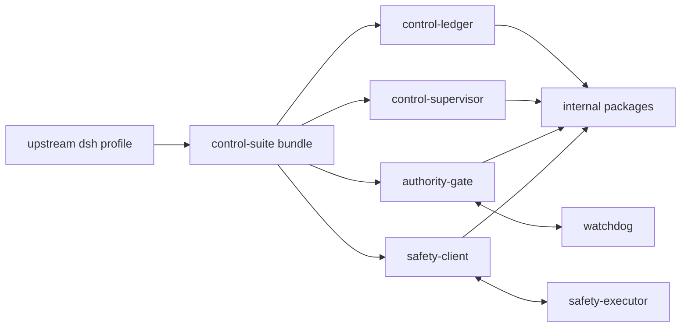

# 技术方案：Agent 收缩为 DSH 插件扩展仓库

## 目标与非目标

- 目标：上游 `@deepseek-ai/dsh` 拥有 Runtime、CLI、Profile 启动和 Web；本仓库只开发可装配的 Cordis 插件、其内部库和可选的独立安全进程。
- 非目标：不 fork/修改 DSH 基座，不自建 launcher、profile 锁、LangGraph runtime、Python 迁移/切换/评估系统。

## 模块边界

| 层 | 保留内容 | 依赖方向 |
|---|---|---|
| 上游基座 | npm 依赖 `@deepseek-ai/dsh` / Cordis | 不依赖本仓库 |
| 插件 | `control-ledger` / `control-supervisor` / `authority-gate` / `safety-client` | DSH/Cordis + 内部纯库 |
| 内部库 | `contracts` / `control-domain` / `safety-domain` / `dsh-bridge` | 不拥有 DSH 启动权；`dsh-bridge` 仅保留 DSH 事件/控制适配 |
| 分发组合 | 单一 `bundles/control-suite` | 由官方 `dsh plugin --profile ... add` 安装 |
| 独立进程 | `safety-executor` / `watchdog` | 只通过明确的 socket/HTTP 契约与插件通信 |



## 组合与配置契约

- Bundle 自身声明 4 个插件依赖和 `dsh.bundle.patch`，用户不再手动编辑仓库内 profile。本地 `link:` 开发时，因 pnpm 不将链接包的传递依赖提升到 profile，需在同一条 `dsh plugin add` 中同时传入 bundle 和 4 个插件路径；发布包仍由 bundle dependencies 表达关系。
- `runtime-composition` 不再是独立插件；`authority-gate` 直接接收 `compositionManifestId` / `compositionFingerprint`，避免对自建 launcher/lock 的隐式依赖。
- 开发时用官方 profile：`headless` 或 `web`；用 `DSH_HOME=.runtime/dsh` 隔离本地状态。

## ADR

| ID | 决策 | 原因 |
|---|---|---|
| ADR-PX-001 | 删除自建 controlled/recovery profile 与 launcher | Profile/CLI 是上游 DSH 责任 |
| ADR-PX-002 | 两个 bundle 合并为 `control-suite` | 插件安装单元应自包含依赖和配置 |
| ADR-PX-003 | 删除 runtime-composition 插件 | 它只为自建锁与 launcher 服务，不是 DSH 功能插件 |
| ADR-PX-004 | 保留 safety sidecars | 独立权限边界是控制套件本身的设计，不侵入 DSH |
| ADR-PX-005 | 删除 labs/evaluation/migration/evidence/release | 它们是历史实验和迁移交付物，不是插件产品边界 |

## 非功能约束与验收

- 目录门禁会拒绝已删除的第二基座目录和非插件包重新出现。
- Bundle 必须可由 DSH 识别，并且其 patch 只挂载保留的 4 个插件。
- 保留插件、内部库、sidecar 全部 typecheck 和测试通过；官方 DSH `--dump-config` 可看到插件。

## 反馈（skill_run）

```yaml
skill_run:
  skill: architecture-design-assistant
  workflow_stage: architecture
  plan: Plans/技术方案/2026-08-21-agent-DSH插件扩展仓库收缩.md
  date: 2026-08-21
  contexts_used:
    - path: /Users/wanglongxiang/git/agent/node_modules/@deepseek-ai/dsh/README.zh.md
      utility: high
      reason: "确认 profile、bundle 和 dsh plugin 的官方所有权边界"
    - path: /Users/wanglongxiang/git/agent/packages/dsh-bridge
      utility: high
      reason: "识别 DSH 适配与自建 launcher/composition 两类不同责任"
  contexts_missing: []
  contexts_stale: []
  friction: "旧仓库边界把本地扩展层定义成了 Agent platform/production runtime 基座"
  outcome: "采纳上游 DSH 基座 + 本地 control-suite 插件扩展边界"
  utility: high
  reason: "消除了与上游 DSH 重复的运行时所有权"
```
