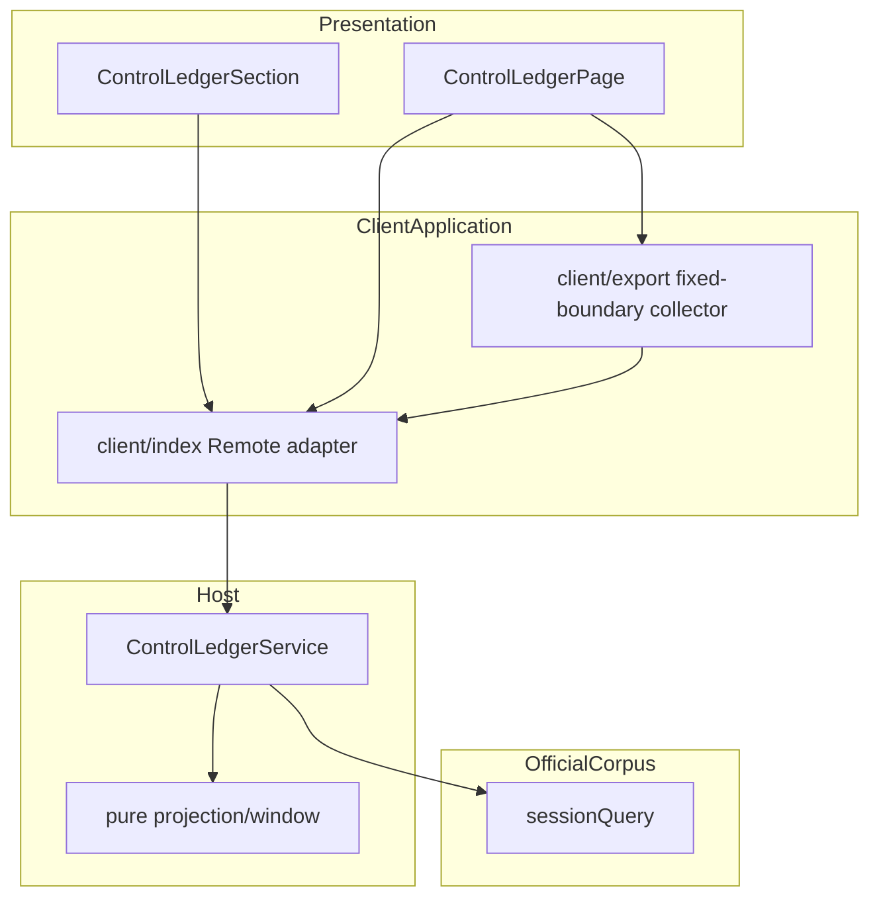
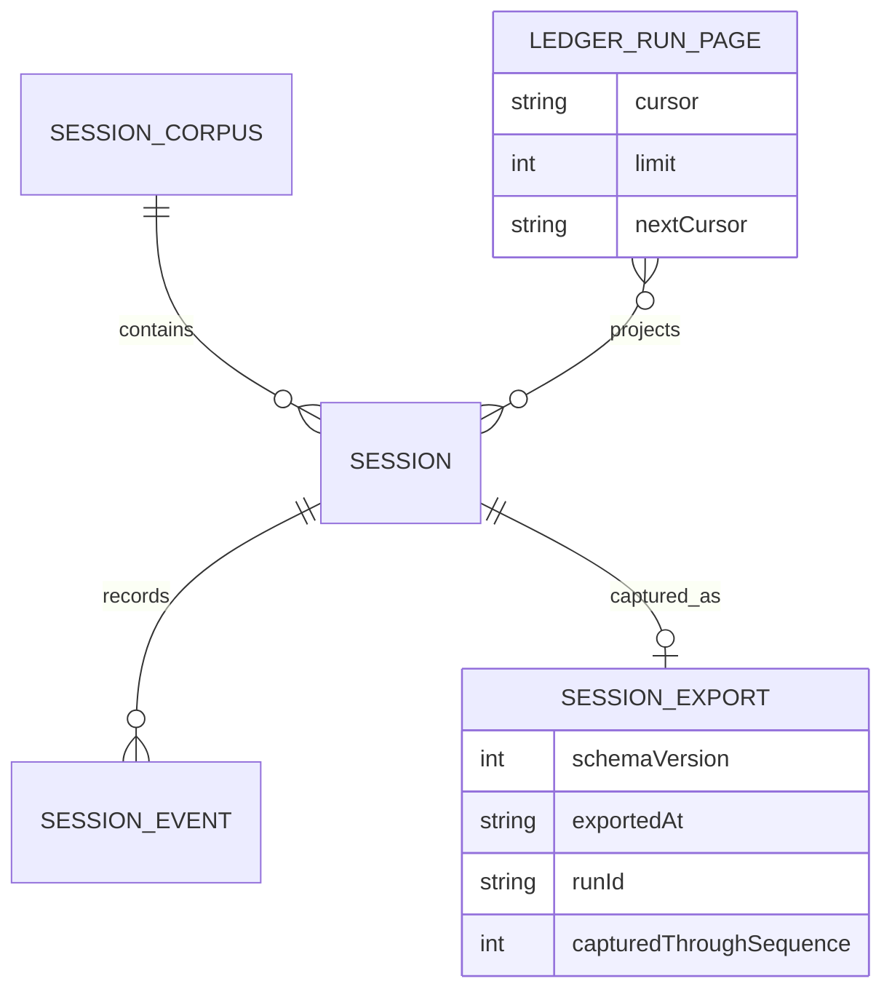
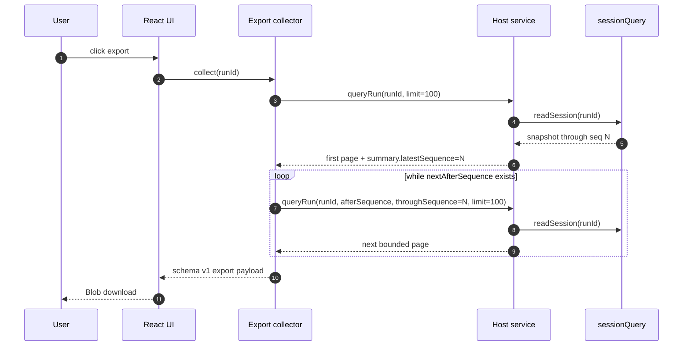

# 技术方案：控制账本分页与会话导出

**创建日期**：2026-08-28
**存放路径**：`Plans/技术方案/2026-08-28-控制账本分页与会话导出.md`
**状态**：已采纳
**lifecycle_state**：architecture
**平台**：TypeScript Host 插件 + React Web 插件
**关联需求（真理源）**：`Plans/需求分析/2026-08-28-控制账本分页与会话导出.md` ← 架构变动须先回看

---

## 一、背景与目标

- **业务需求/痛点**：当前 Web 客户端只调用 `listRuns({ limit: 50 })`，旧会话不可达；详情事件虽能加载更多，但无法导出当前 Session 的完整固定快照。
- **成功指标**：连续游标翻页可到达 corpus 中全部会话且无重复；Host 每页最多读取 `limit` 个完整 Session；导出覆盖首次捕获末序号内 100% 有序事件，失败不下载半文件。
- **非目标**：不做搜索/总页数/随机跳页、批量导出、CSV/PDF、服务端落盘、导入、持久化或额外授权/脱敏层。

---

## 二、AI 行为准则

1. 先输出模块划分 + 接口草案，再写实现细节。
2. UI/Handler 不写直连 DB；遵守 YAGNI。
3. 缺信息列「待确认」，不猜测。

---

## 三、原则对照（必遵守）

| 原则 | 要求 |
|------|------|
| SRP / OCP / DIP / ISP / LSP | Host 只提供 corpus 投影；纯分页/导出汇集函数不依赖 React；UI 只负责状态与交互；依赖方向保持 UI → Remote adapter → Host → sessionQuery |
| DRY / KISS / YAGNI | 复用 `queryRun` 与事件窗口，不增加无界 `exportRun` Remote；新增 `listRunPage` 保留旧 `listRuns` 兼容；游标只作为不透明字符串回传 |

---

## 四、约束与前提

- **版本/环境**：Node `^22.19.0 || >=24`、TypeScript 6、React 18、Vitest 4；继续产出并提交 `lib/`。
- **依赖服务**：`@deepseek-ai/dsh-session-query` 的 `listSessions/readSession`；Typert `/api` RPC；浏览器 Blob/URL/download anchor。
- **特性开关 / 灰度**：无独立开关；插件版本整体发布，Host 与 client 同包升级。旧 `listRuns/queryRun` 调用保持可用。
- **合规**：导出只由已打开详情页显式触发，内容与现有可见档案/事件一致；不上传、不服务端落盘、不新增权限旁路。

---

## 五、架构设计

### 客户端分层（platform=客户端 时）

Presentation → Domain → Data（Clean Arch + MVVM）

### 服务端分层（platform=服务端 时）

API → Application/Service → Domain → Infrastructure

### 模块边界（必填）

| 模块 | 职责 | 输入/输出 | 依赖模块 |
|------|------|-----------|----------|
| `src/types.ts` | 公开 Remote/分页/导出数据契约 | request/page/query/export 类型 | 仅 DSH Session 类型 |
| `src/projection.ts` | 纯摘要、档案、事件窗口投影 | Session snapshot/events → JSON-safe projection | `src/types.ts`、官方纯 fold |
| `src/index.ts` | Host service 与 corpus 分页编排 | Typert request → page/query | sessionQuery、projection |
| `src/typert.ts` | 严格 Remote 参数描述 | Zod request schema → Typert contribution | zod |
| `src/client/export.ts` | 固定边界分页汇集、导出对象与安全文件名 | `queryRun` 函数 → export payload | `src/types.ts`，不依赖 React/DOM（下载动作除外独立函数） |
| `src/client/index.ts` | `/api` adapter、浏览器下载、slot 注入 | UI injected face ↔ Remote | connection、export helper |
| `ControlLedgerSection.tsx` | 当前页、游标栈、首尾/失败状态 | page loader/openRun → 列表 UI | injected page loader |
| `ControlLedgerPage.tsx` | 详情加载、事件追加与导出按钮状态 | queryRun/exportRun → 详情 UI | injected functions |



### 数据模型（必填：ER 图 + 字段定义）



| 实体/表 | 字段 | 类型 | 必填 | 说明 |
|---------|------|------|------|------|
| `ListControlLedgerRunPageRequest` | `limit` | number | 否 | 默认 20，整数 1–100 |
| `ListControlLedgerRunPageRequest` | `cursor` | string | 否 | 由上一页返回；客户端不得解析 |
| `ControlLedgerRunPage` | `runs` | summary[] | 是 | 当前页，最新优先，0–limit 条 |
| `ControlLedgerRunPage` | `nextCursor` | string | 否 | 仅 corpus 中仍有后续会话时返回 |
| `QueryControlLedgerRunRequest` | `throughSequence` | number | 否 | 固定导出上界；整数 -1–MAX_SAFE_INTEGER |
| `ControlLedgerSessionExport` | `schemaVersion` | 1 | 是 | 首版导出契约常量 |
| `ControlLedgerSessionExport` | `capturedThroughSequence` | number/null | 是 | 取首次 query summary.latestSequence |
| `ControlLedgerSessionExport` | `summary/dossier/events` | object/object/event[] | 是 | 首次快照投影 + 边界内完整有序事件 |

### API Schema / 接口契约（必填）

| 方法 | 路径 | 说明 | 幂等 | Request | Response |
|------|------|------|------|---------|----------|
| RPC | `controlLedger/listRunPage` | 新增：返回一页会话摘要 | 是（只读） | `{ limit?, cursor? }` | `{ runs, nextCursor? }` |
| RPC | `controlLedger/listRuns` | 保留：旧版最新 N 条数组 | 是（只读） | `{ limit? }` | `summary[]` |
| RPC | `controlLedger/queryRun` | 扩展：可按固定末尾序号分页读事件 | 是（只读） | `{ runId, afterSequence?, throughSequence?, limit? }` | 现有 query 契约 |

**Request 示例**：

```json
{
  "limit": 20,
  "cursor": "opaque-cursor-from-previous-page"
}
```

**Response 示例**：

```json
{
  "runs": [
    {
      "runId": "session-20",
      "title": "Task title",
      "technicalStatus": "completed",
      "eventCount": 42,
      "turnCount": 3,
      "toolCallCount": 5,
      "failedToolCallCount": 0,
      "latestSequence": 41,
      "createdAt": 1787850000000,
      "latestRecordedAt": 1787850300000
    }
  ],
  "nextCursor": "session-20"
}
```

**错误码**：

| code | 含义 | 客户端处理 |
|------|------|------------|
| `INVALID_REQUEST` | Zod 拒绝非 number/string 参数 | 初始页显示错误；翻页保留当前页 |
| `INVALID_LIMIT` | limit 非整数或不在 1–100 | 不重试无效请求；开发测试捕获 |
| `INVALID_CURSOR` | cursor 非空但不在当前 corpus | 保留当前页，显示分页失败并允许刷新第一页 |
| `RUN_ID_REQUIRED` | queryRun runId 为空 | 详情错误态 |
| `INVALID_SEQUENCE_BOUND` | after/through 越界或 after 大于固定边界 | 导出失败且不下载 |
| `SOURCE_READ_FAILED` | sessionQuery listing/read 失败或会话消失 | 失败关闭，用户可重试 |
| `DOWNLOAD_FAILED` | Blob/URL/anchor 创建或点击失败 | 恢复导出按钮并显示错误 |

### 关键流程



### 非功能约束（必填）

| 维度 | 约束 | 验证方式 |
|------|------|----------|
| 性能 | 列表每页只 `readSession` 当前页最多 100 个 id；导出每次最多 100–200 事件，避免无界单 RPC | service spy 断言读取次数；多页导出单测 |
| 一致性 | cursor 锚定上一页末项；导出所有后续请求固定首次 `latestSequence` | 新会话插入测试；运行中追加事件测试 |
| 安全 | 仅详情页显式本地下载；不上传/持久化；权限与 `/api` 相同 | 注入测试确认无额外接口/后台下载 |
| 可用性 | 翻页失败保留当前页；导出失败不落半文件；按钮 single-flight | React 交互测试 / helper 失败测试 |
| 兼容性 | 新增 `listRunPage`，不改变 `listRuns`；`queryRun` 新字段可选，旧请求语义不变 | 现有 service tests 原样保留并新增 Remote marker |
| 可维护性 | 导出汇集与文件名为纯函数；React 不拼 Remote 分页协议 | 单元测试、typecheck |

### ADR（必填）

| ADR ID | 决策 | 备选与取舍 | 影响范围 | 状态 |
|--------|------|------------|----------|------|
| ADR-001 | 新增 `listRunPage`，保留 `listRuns` | 直接把 `listRuns` 从数组改成 page 会破坏公开类型和旧客户端 | types/index/typert/client | 已采纳 |
| ADR-002 | 下一页 cursor 锚定上一页末 Session id，并对客户端不透明 | offset 简单但顶部新增会话会造成重复/跳项；快照 token 需服务端状态 | Host list pagination / UI cursor stack | 已采纳 |
| ADR-003 | 导出复用 `queryRun` 分页，由客户端汇集 | 新增无界 `exportRun` 会造成巨大单 RPC；服务端落盘超出只读投影边界 | queryRun/types/client export helper | 已采纳 |
| ADR-004 | `throughSequence` 固定首次捕获末尾序号 | 不固定会使运行中会话的导出漂移，甚至持续追赶 | event window/queryRun/export helper | 已采纳 |
| ADR-005 | 导出 schema v1 JSON，summary/dossier 取首次 query，events 按 seq 有序汇集 | CSV/PDF 丢失嵌套证据；直接导出当前 UI 只含已加载事件 | export type/helper/UI | 已采纳 |

### 需求影响矩阵（必填）

| 需求 ID | 影响模块 | API/状态/数据契约 | ADR | 故事拆分约束 |
|---------|----------|-------------------|-----|--------------|
| REQ-CL-001 | types/index/typert/Section/client adapter | `listRunPage`、cursor stack、分页状态 | ADR-001/002 | 故事必须纵向覆盖 Host 契约 + UI 首尾/错误 + 兼容测试 |
| REQ-CL-002 | projection/types/client export/Page | optional throughSequence、schema v1、single-flight | ADR-003/004/005 | 故事必须纵向覆盖固定边界、多页/空/失败 + 实际下载入口 |
| REQ-CL-003 | locales/CSS/tests/lib/README | 中英文状态、键盘/小屏、发布构建 | 全部 | 不独立拆横向 UI 故事；归入上述两个用户能力及最终集成 |

---

## 六、方案选项与决策矩阵

| 方案 | 性能 | 复杂度 | 成本 | 风险 | 备注 |
|------|------|--------|------|------|------|
| A：offset list + 单次完整 export Remote | 列表 O(page)，导出单包无界 | 低 | 低 | 并发重复/跳项、超大 RPC | 不采用 |
| B：锚点 cursor + 客户端固定边界分页汇集 | 列表 O(page)，导出有界多 RPC | 中 | 中 | 客户端需汇集和失败恢复 | 推荐 |
| C：服务端 snapshot token + 临时导出文件 | 稳定 | 高 | 高 | 引入状态、清理、授权与持久化 | 超出只读插件范围 |

**推荐**：B — 在不引入服务端状态/持久化的前提下，同时保证向后翻页对新增会话稳定、导出对运行中会话有限且一致，并保留既有 Remote 兼容性。

---

## 七、上线与回滚

- **发布步骤**：完成 Red/Green 测试 → `npm test` → `npm run typecheck` → `npm run build` → 确认 `lib/` 与源码一致 → 更新 README API/行为说明。
- **回滚触发**：分页出现重复/不可达、旧 `listRuns/queryRun` 兼容测试失败、导出缺事件/越过边界、构建产物与源码不一致。
- **回滚操作**：回退本插件版本/commit 并重建 `lib/`；无数据回滚，因为插件不写 Session、不落导出状态。
- **数据迁移**：无。

---

## 八、实施计划

| 阶段 | 内容 | 预估 |
|------|------|------|
| 1 | 列表分页公开类型、纯页选择、Host Remote、Typert 与 service Red/Green | REQ-CL-001 |
| 2 | 列表 UI 游标栈、保留页加载/错误、首尾控制与 locale/CSS | REQ-CL-001/003 |
| 3 | throughSequence 事件窗口、导出汇集/文件名纯函数与 Red/Green | REQ-CL-002 |
| 4 | 详情导出按钮、single-flight/错误、浏览器下载与 locale/CSS | REQ-CL-002/003 |
| 5 | 全量回归、build 更新 `lib/`、README 与发布检查 | REQ-CL-003 |

---

## 九、验收标准

- [x] 模块、数据、API、错误、NFR、ADR 与需求影响矩阵已定义
- [x] 旧 `listRuns` 保留，`queryRun` 新边界字段可选
- [x] 不新增持久化/写路径/权限旁路
- [x] 每个 P0 AC 都映射到 Host 或 client helper/UI 测试位置
- [x] 回滚无需数据迁移，可按插件版本恢复

---

## 续做

```
/resume plan=Plans/技术方案/2026-08-28-控制账本分页与会话导出.md 进度=已采纳
```

**下一阶段 Skill**：`/task-splitter`，将已排序需求在本架构约束下拆为带故事点的纵向用户故事。

## 反馈（skill_run）

```yaml
skill_run:
  skill: architecture-design-assistant
  workflow_stage: architecture
  plan: Plans/技术方案/2026-08-28-控制账本分页与会话导出.md
  date: 2026-08-28
  contexts_used:
    - path: Contexts/需求分析/需求分析规范.md
      utility: high
      reason: "以需求事件链、边界与 AC 约束 Remote、状态和错误恢复设计"
    - path: Templates/技术方案模板.md
      utility: high
      reason: "按模块、ER、API、NFR、ADR 与需求影响矩阵完整收敛方案"
  contexts_missing: []
  contexts_stale: []
  outcome_status: pass
  revisit_needed: false
```
