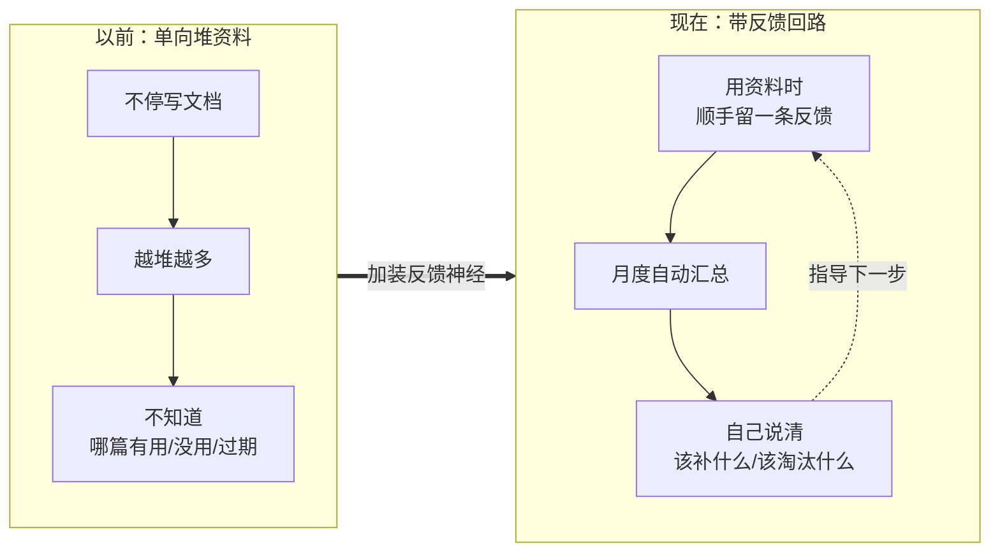
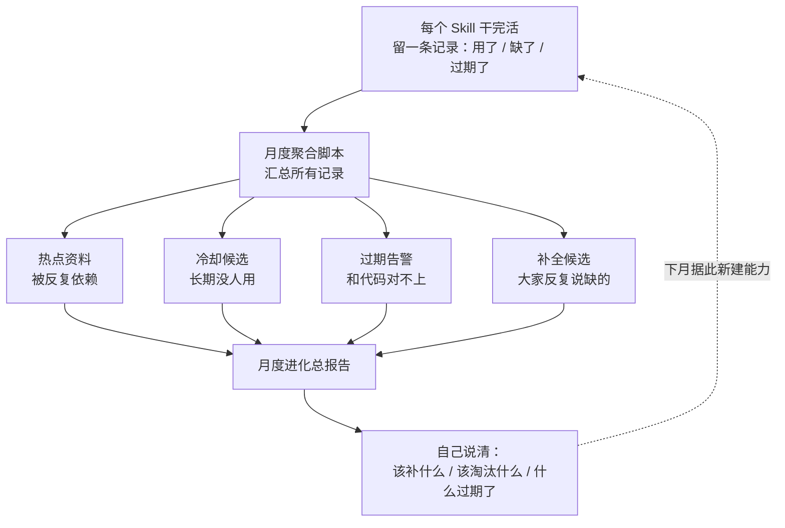

# 会自进化的知识库
### —— Skill 反馈回路与月度进化链

**王龙祥 · 技术 · 2026-07-01**

> **一句话**：每个 Skill 干完活自动留一条记录（用了/缺了/过期了哪些资料），月度脚本汇总成进化报告，直接告诉我们知识库下一步该补什么。知识库从「只进不出的死档案」变成了「会自己报告健康状况」的系统，零人工统计。

---

## 主题：给知识库装一套「反馈神经」

**多数团队的知识库是单向的——只管往里堆。**

- 哪篇被反复用到？不知道。
- 哪篇写完再没人看？不知道。
- 哪篇早和代码对不上了？还是不知道。

资料越堆越多，噪音越大，AI 依赖它们工作时反而越容易被过期内容带偏。

**这次分享的不是某篇文档或某个脚本，而是一套「反馈回路」机制。** 它让每个 Skill 完成任务时留下机器可读的痕迹，再把这些痕迹自动汇聚成「该往哪进化」的信号。

先看加装前后的对比：

---

## 我的想法：把「反馈」变成强制收尾动作

**单向写入的根子，在于「缺什么」这条信息从不被记录。**

任务当下最清楚缺什么，等月底复盘再回忆，早忘了。所以设计的第一原则是——趁上下文还热，收尾时当场记。

每次任务结束强制写一条记录，只记三样：

1. **用到**了哪些资料，各自有没有帮上忙；
2. **缺**了哪些本该有、库里却没有的资料；
3. 哪些资料和代码/现网**对不上了**。

> 三样里最关键的是「缺什么」——它是知识库下一步该长出什么的第一手证据，由真实任务暴露，不是拍脑袋想的。

**还有个顺带的设计：机器数据和人读文档分开存。** 脚本读机器记录，人读干净文档，互不干扰。

---

## 结论：一条全自动的进化链路

**机制落成后，数据全自动流动，不用人插手。**

**四类信号各有阈值，全由脚本自动算：**

- 被标「有用」累计 ≥ 3 次 → 热点资料
- 近 90 天没被有用引用 → 冷却候选
- 同一份被标「过期」≥ 2 次 → 过期告警
- 同一句「缺 XX」累计 ≥ 2 次 → 补全候选

> **「补全候选」这一路最有价值**：员工顺手记的「我缺 XX」，累计到阈值就自动浮现在月报里，成为下月建新能力的优先级。知识库的进化需求，是从真实使用中长出来的，不是靠猜的。

---

## 数据

| 维度 | 引入前 | 引入后 |
|------|--------|--------|
| 哪些资料有用/该补/过期 | 无人统计，靠月底回忆 | 每次任务当场记录，月度自动聚合 |
| 进化需求来源 | 拍脑袋 / 事后复盘 | 真实任务暴露的「缺什么」，按阈值浮现 |
| 反馈数据量 | 0 | 已累计多条，随每次运行增长 |
| 人工统计成本 | 每月手工梳理 | 一条命令，零人工 |

> 本案例的提效是机制层面的「从无到有」——引入前根本没有反馈统计，故不用耗时百分比衡量，而看「是否具备可自动运行的进化信号链路」。

---

## 复用

**前提**：每个 Skill 收尾强制产出反馈记录（已写进协议），且有聚合脚本 + 月度总调度脚本。

**下一步**：把月度总调度挂上定时任务（仓库已有配置文件），实现无人值守的月度进化报告。

**溯源**：

- 反馈协议 → `Contexts/决策/Skill反馈协议.md`
- 聚合逻辑与阈值 → `scripts/feedback-aggregate.py`
- 月度总调度 → `scripts/vault-evolve.py`

---

> **本质**：把「知识库该如何进化」这个原本靠人主观判断的问题，变成了由真实任务反馈驱动、可自动聚合的数据问题——让知识库能自我诊断、主动指出进化方向。
