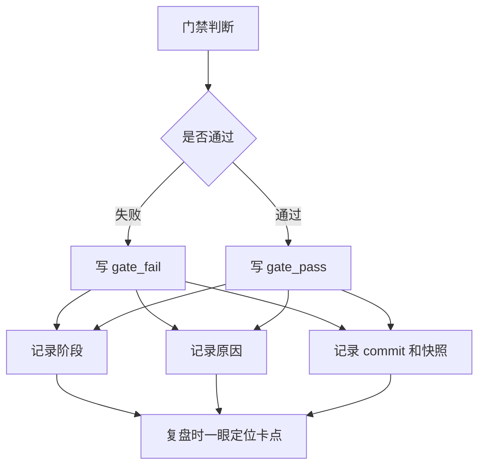

# 卡点留痕

用工作流事件把“为什么卡住”从口头回忆变成可复盘数据

一句话摘要：本周只讨论一个提效点：工作流事件留痕。它把过去需要翻对话、翻文件、靠人回忆的卡点定位，变成一行事件就能复盘的结构化数据。本次以纳米AI助理计划模式计划卡片任务作为样本：4 条门禁事件记录了阶段、失败原因、关联 commit、Plan 快照和时间戳，让“当时为什么不能继续”有了可复查证据。

## 主题：卡点不留痕，复盘就会失真

**复杂任务真正难复盘的，不是“最后做没做完”，而是“中间为什么卡住”。**

以计划模式计划卡片这个客户端需求为例，卡点不是一个大问题，而是一串小判断：

- 需求是否已经从评审中变成已采纳？
- P0 是否真的清零？
- 技术方案是否已经被采纳？
- 进入测试阶段时，测试 plan 是否存在？

旧办法也能推进，但卡点分散在对话、临时笔记、Plan 文本和人的记忆里。过几天再复盘，常见结论会变成“当时好像是需求没确认”或“应该是测试没补”，缺少可复算证据。

这次工作流事件解决的是一个很小但很关键的问题：**每次门禁判断，都把当时的事实写下来。**

## 方法：一条事件记录六个事实

**事件账本的价值，不是多存日志，而是把卡点拆成固定字段。**

以样本里的第一条失败事件为例，它不是只写“需求没过”，而是写清楚：

| 字段 | 本次值 | 复盘价值 |
|------|--------|----------|
| `type` | `gate_fail` | 明确这是失败，不是普通备注 |
| `stage` | `requirement` | 定位到需求阶段 |
| `reason` | 需求 plan `status` 仍是评审中 | 直接指出失败条件 |
| `git_commit` | `eff0ba2` | 能回到当时的代码与文档状态 |
| `plan_snapshot` | `389676...` | 能确认当时 Plan 内容没有被事后改写 |
| `created_at` | `2026-07-06T17:01:16+08:00` | 保留事件发生时刻，便于串起因果顺序 |

这让复盘从“问当时谁记得”变成“读事件字段”。对领导汇报时，结论也更稳：不是笼统说工作流提升效率，而是能指出效率提升来自卡点定位成本下降。

## 数据：4 条事件还原状态变化

**本次只用事件账本这一组数据，专注分析卡点如何被定位，不把中间人工校对时间当作提效主指标。**

| 顺序 | 类型 | 阶段 | 事件说明 | 效率含义 |
|------|------|------|----------|----------|
| 1 | `gate_fail` | requirement | 需求仍是评审中，不能进下一阶段 | 第一处卡点被精确定位 |
| 2 | `gate_pass` | requirement | 需求已采纳且 `p0_open=0` | 卡点解除有证据 |
| 3 | `gate_pass` | architecture | 技术方案已采纳 | 方案阶段无需再人工确认 |
| 4 | `gate_fail` | test-first | 自动化测试 plan 不存在 | 下一处阻塞被暴露 |

这里的重点不是计算中间经过了多久。那段过程里包含人工校对、需求确认、上下文切换和文档修订，拿它做主指标会误导。

真正有价值的是事件序列保住了因果链：

- 需求为什么不能继续：`status` 仍是评审中。
- 需求什么时候被认为可继续：`status` 已采纳且 `p0_open=0`。
- 方案为什么不再阻塞：技术方案已采纳。
- 下一处阻塞是什么：测试 plan 不存在。

> 提效的核心不是“所有阶段都变快”，而是“每个阶段为什么不能继续，能被立即定位”。

## 意义：事件让过程变得可信

**事件留痕的价值，是把过程里的判断固定下来，避免复盘时重新解释一遍。**

第一，它防止事后改写。Plan 会继续被编辑，人的记忆也会变化；事件里的 `git_commit` 和 `plan_snapshot` 把当时状态钉住，复盘时能回到“那一刻为什么失败”。

第二，它保留因果顺序。没有事件时，大家只能看到最终 Plan 状态，很容易误以为流程一直顺利。事件把“失败 → 修正 → 通过 → 新阻塞”留下来，让问题演进过程可见。

第三，它把隐性判断显性化。比如“需求评审中不能进下一阶段”过去可能只是执行者脑内规则，现在变成 `gate_fail.reason`，下次同类任务可以复用这个判断口径。

第四，它给流程优化提供入口。测试 plan 不存在这条事件，不只是一个失败记录，也是在提醒：当前蓝图对测试阶段的要求、项目实际验证方式之间可能需要更清晰的衔接规则。

## 提效原因：少三类无效沟通

**事件留痕减少的是定位、解释和交接三类成本。**

第一，减少定位成本。旧办法需要翻 Plan、翻对话、问人确认；现在读一条 `gate_fail.reason` 就能知道失败条件，少掉多轮“当时为什么没过”的追问。

第二，减少解释成本。事件里有 commit 和 Plan 快照，讨论时不再停留在“我记得当时是这样”，而是能回到当时状态。对跨天续做尤其重要。

第三，减少交接成本。接手的人不需要读完整上下文才能知道当前阶段，只要看事件序列：需求失败、需求通过、方案通过、测试失败。任务当前卡在哪里一目了然。

这就是本案例的提效点：**把状态判断从自然语言沟通，降级为结构化事件读取。**

## 复用：事件留痕适合所有长链路任务

**凡是超过一个阶段、需要跨天续做或多人协作的任务，都应该把卡点写成事件。**

建议固定四类事件字段：

1. 阶段：卡在需求、方案、测试、开发还是部署。
2. 结果：通过、失败、跳过、人工确认。
3. 原因：失败或跳过的具体条件，不能只写“未完成”。
4. 证据：commit、Plan 快照、子 Plan 路径和时间戳。

这样每周汇报提效时，只讲一个具体变化：**卡点从口头回忆变成可查询事件**。

这件事足够小，也足够有价值。它让工作流不只是推进任务的工具，还变成了分析效率的事实来源。
