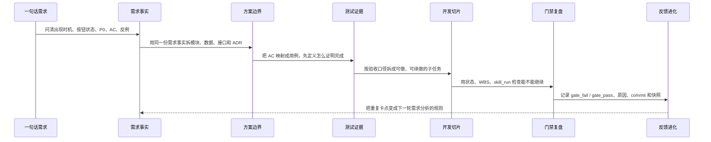
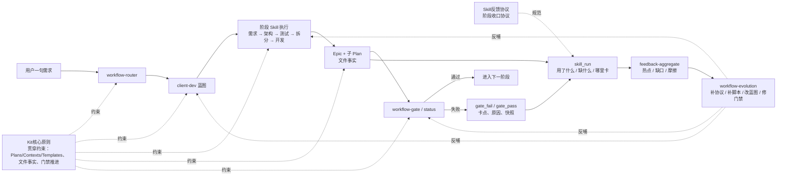

# 别让 AI 高速跑偏

会进化的开发流：给高效率 AI 加一条可执行、可验证、可复盘的轨道

一句话摘要：现在 AI 写代码、改界面、拆任务的速度已经很快，真正拖慢交付的反而是跑偏、返工、反复解释和跨天断档。本案例不编造耗时百分比，只用仓库内可复查证据说明 client-dev 如何把一句模糊需求加工成需求事实、方案边界、测试证据、开发切片和流程反馈，让 AI 的高执行力沿着同一条事实轨道推进。

## 主题：AI 已经够快，问题是容易跑偏

**今天的问题不再是 AI 写得慢，而是它太容易带着不完整上下文高速前进。**

在真实开发里，模型经常能很快给出代码、方案和页面。但只要需求边界、验收口径、状态流转没有被固定下来，它的速度越快，偏差也会越快放大：

- 一句话需求看起来懂了，落地时才发现按钮态、异常流程、历史状态都没定。
- 模型一次性给出实现，但方案边界散在对话里，下一轮接手还要重新解释。
- 测试最后才补，验收标准跟着实现走，反例和边界容易漏。
- 大任务跨天后，对话上下文断掉，续做时又要重新找状态。
- 卡点只停留在聊天记录里，下次遇到同类问题还会再踩一遍。

所以提效不只是“让 AI 多写一点”，而是给 AI 的执行过程加上轨道：什么时候该问清需求，什么时候该定方案，什么时候必须先有测试证据，什么时候不能继续往下做。

> 真正的提效点，是把高速执行变成可控执行：每一步判断都有证据、能交接、能验证、能复盘。

## 方法：用工作流给 AI 加轨道

**client-dev 不是为了增加流程感，而是把 AI 容易跑偏的地方拆成固定检查点。**

它把一条客户端需求拆成五个主阶段，每一站都解决一个常见 AI 痛点：

1. 需求分析：防止模型拿着模糊意图开工，把“要做什么”变成事件、反例、P0/P1、AC。
2. 技术方案：防止实现思路散在聊天里，把“怎么做”变成模块边界、数据模型、API Schema、ADR。
3. 验收测试先行：防止做完才补验收，把“怎么算完成”变成 AC 到用例的映射。
4. 原子任务拆分：防止大任务跨天断档，把“大功能”变成可落地、可分配、可续做的子任务。
5. 功能开发：防止状态靠记忆推进，按 WBS 和子 Plan 落地，并用门禁确认事实。

这张图的重点在最后一段：开发完成不是终点。门禁、事件和 `skill_run` 会把过程中的跑偏点留下来，让下一次同类任务少走弯路。

## 先进概念学习：从外部共识到本地应用

**好的 AI 工作流，不是把模型放出去“自己想办法”，而是把上下文、状态和控制流工程化。**

这不是 AI-Work-Kit 自己的孤立判断。几篇高质量工程文章都指向同一个方向：

- Anthropic 在 [Building Effective Agents](https://www.anthropic.com/engineering/building-effective-agents) 里把 `workflow` 和 `agent` 分开：工作流适合预定义路径，优势是可预测、一致；agent 适合开放问题，代价是更高的不确定性。client-dev 处理的是客户端功能交付，路径相对清楚，所以更应该用 workflow 承载，而不是让模型自由游走。
- Anthropic 的 [Effective context engineering for AI agents](https://www.anthropic.com/engineering/effective-context-engineering-for-ai-agents) 强调，长任务不能把所有信息一次塞进上下文，而要用文件路径、查询、链接等轻量引用，让 agent 按需取用。AI-Work-Kit 的 `Plans/`、`Contexts/`、Epic 和子 Plan，本质上就是把上下文变成可检索、可续做的外部结构。
- Martin Fowler / Thoughtworks 的 [Context Engineering for Coding Agents](https://martinfowler.com/articles/exploring-gen-ai/context-engineering-coding-agents.html) 把 rules、skills、specs、workflows 都看成 coding agent 的上下文工程。它的关键不是“提示词写得更漂亮”，而是决定模型什么时候看到什么、按什么规则行动。
- HumanLayer 的 [12-Factor Agents](https://github.com/humanlayer/12-factor-agents) 也在强调：即使模型继续变强，可靠的 LLM 应用仍然需要工程手段来管理上下文、状态、控制流和可观测性。client-dev 的蓝图、门禁、事件和 `skill_run`，对应的正是这些工程抓手。

更具体地说，这套工作流也吸收了 Claude Code 里的几类模式，但没有照搬工具形态，而是转成了 AI-Work-Kit 自己的文件系统工作流。汇报时重点应该放在“学到什么模式，以及它怎么提升效率”：

| 学到的模式 / 概念 | 对效率的价值 | 在 AI-Work-Kit 里的应用 |
|-------------------|--------------|--------------------------|
| Claude Skills / 专家能力按需加载 | 减少每次重新解释规则的成本 | `Skills/` 与多端 skill 同步，按阶段路由到需求、架构、测试、开发 |
| Claude Hooks / 确定性检查 | 减少“AI 自己忘了检查”的返工 | `plan-gate-check.sh`、`workflow-gate.sh`、`workflow-status.py` |
| 项目级规则文件 | 减少跨会话沟通成本 | `AGENTS.md`、`Contexts/决策/*`、`Templates/模板约定` |
| Context Engineering | 减少上下文丢失和跨天恢复成本 | `Plans/`、`Contexts/`、Epic、子 Plan 作为可检索事实源 |
| Workflow 优先 | 减少自由发挥带来的跑偏 | `client-dev.json` 固化阶段、Skill、WBS、exitCriteria |
| Observability / Feedback | 减少同类卡点重复发生 | `gate_fail` / `gate_pass`、`skill_run`、`feedback-aggregate` |
| Evolution Loop | 把一次提效变成后续复用能力 | `workflow-evolution` 反哺 Skills、脚本、蓝图和协议 |

这也是“会进化”的核心：不是期待模型每次都记得更好，而是让系统把每次跑偏、卡点和修正都变成下一轮可用的流程资产。

## 架构：为什么这条链能跑起来

**整体架构不是一串 Skill，而是核心原则、反馈协议、入口、蓝图、文件事实、门禁和反馈聚合的分层协作。**

client-dev 能提效，是因为它把“AI 怎么做事”拆成了几层：

- 原则层：`Kit核心原则` 定义 Plans / Contexts / Templates 的边界，以及文件事实、门禁、反馈闭环这些底层规则。
- 协议层：`Skill反馈协议` 规定每次 Skill 结束必须留下 `skill_run`，并用统一字段进入聚合。
- 入口层：`workflow-router` 把自然语言任务路由到具体蓝图。
- 蓝图层：`client-dev.json` 定义阶段、Skill、WBS 和 exitCriteria。
- 执行层：需求、架构、测试、拆分、开发 Skill 各自加工一个阶段。
- 事实层：Epic 和子 Plan 保存阶段事实，不靠聊天记忆驱动流程。
- 门禁层：`workflow-gate` / `workflow-status` 只读文件事实，判断能否继续。
- 事件层：`gate_fail` / `gate_pass` 记录卡点、原因、commit 和快照；执行中暴露的摩擦会立即推动 Plan、门禁口径或下一步动作修正。
- 进化层：`skill_run` 进入 `feedback-aggregate`，沉淀下轮改进。

这张架构图解释了一个关键点：**执行主链横向推进，核心原则贯穿约束，反馈协议约束阶段收口，Plan 是事实源，Gate 是判断器，Feedback 是进化入口。** Skill 可以换，模型可以换，但这些层稳定存在，工作流才不会变成一次性提示词。

这里的“进化”有两种节奏：

- **执行中进化**：门禁失败、Plan 缺字段、WBS 不匹配时，当前任务会立即补 Plan、补测试、修正状态口径或调整下一步动作。
- **执行后进化**：`skill_run` 和事件日志进入聚合，沉淀为脚本、蓝图、Contexts 或 Skill 的长期改进。

前者保证当前任务不断线，后者保证下一次任务少踩坑。

## 需求：把“想要什么”整理清楚

**需求分析阶段减少的是理解偏差，而不是简单生成需求文档。**

旧做法里，需求常常以自然语言开始，也以自然语言推进。每个人都觉得自己理解了，但真正进入实现时，才会发现按钮状态、异常流程、边界条件和验收口径不一致。

client-dev 把需求拆成可评审结构：

- 用事件风暴先看业务过程里发生了什么。
- 用实例化需求把场景写成 Given-When-Then。
- 用 P0/P1 区分阻塞项和可后置项。
- 用验收标准把“做完”变成可验证条件。

以当前仓库样本看，`纳米AI助理计划模式计划卡片` 的需求 Plan 已沉淀出 AC、按钮态模型、P0 闭环结论，并用 `status: 已采纳`、`p0_open: 0` 作为门禁事实。

这一步的深层价值，是把“需求确认”从一次聊天变成一个可审查的状态：

- `status: 已采纳` 说明需求已经可以被后续阶段引用。
- `p0_open: 0` 说明阻塞级问题已经清零。
- AC 和反例说明测试应该证明什么。
- 异常流程说明开发不能只走 happy path。

这会直接降低返工概率。因为后续方案、测试和开发不是重新理解需求，而是消费同一组需求事实。

## 方案：把“怎么做”拆成边界

**技术方案阶段减少的是实现解释成本。**

一个客户端功能如果只写“调用接口、渲染卡片、处理点击”，看起来清楚，落地时却容易混在一起。client-dev 要求技术方案至少说明：

- 模块边界：哪些逻辑属于 Domain、Data、UI 或交互层。
- 数据模型：前端状态、服务端返回、展示模型如何对应。
- API Schema：接口入参、出参、错误和兼容策略。
- ADR：关键决策为什么这么定，放弃了什么方案。

这种拆解让后续任务不再从零理解方案。`test-generator` 可以按方案定位被测单元，`task-splitter` 可以按模块边界拆任务，开发阶段也能避免把状态机、展示和接口处理混成一块。

更重要的是，方案把“谁负责什么”讲清楚：

| 如果不拆边界 | 后续风险 | 方案阶段怎么消除 |
|--------------|----------|------------------|
| UI 直接处理业务状态 | 组件越来越重，难测 | 状态机和展示模型分层 |
| 接口返回直接进视图 | 兼容逻辑散落 | Data 层做转换和兜底 |
| 点击行为临时写 | 审批、停止、历史态冲突 | 交互规则进入 ADR 和状态表 |
| 测试不知道测哪层 | 用例只能测表面 | 按模块边界映射测试点 |

所以方案不是“写一份技术文档”，而是把实现的争议点提前放到桌面上。

## 测试：先确定怎么证明完成

**测试先行阶段减少的是最后补验收的风险。**

如果测试最后补，用例往往会跟着实现走，漏掉需求里的反例和边界。client-dev 的 `test-first` 阶段要求先有自动化测试 Plan，并完成 WBS 4 的用例映射。

当前事件日志里已经出现过测试阶段卡点：

- `test-first` 因自动化测试 Plan 不存在而失败。
- `test-first` 因 WBS 4 未完成而重复失败。

这不是坏事，反而说明门禁发挥了作用：它没有让开发带着未定义的验收继续往后走。

测试先行真正改变的是开发顺序：

1. 先从需求 AC 里抽出必须证明的行为。
2. 再从技术方案里找到这些行为应该在哪一层验证。
3. 最后把用例映射回 WBS，避免“实现做完了但没人知道怎么验收”。

这一步让验收从“开发结束后的检查”变成“开发开始前的导航”。

## 拆分与开发：把大任务切成可续做小块

**任务拆分阶段减少的是上下文恢复成本。**

client-dev 不直接从方案跳到代码，而是先让 `task-splitter` 把工作拆成原子任务。进入开发阶段后，蓝图会检查 WBS 6-11、`plan-gate-check`、开发追溯和必要的 UI 裁决。

仓库里已经能看到这种拆分的执行痕迹：

- `纳米AI助理计划模式计划卡片` 拆出了 answerPlan RPC、命令与 CellVM、ExitPlanMode 识别、计划卡片 Cell、审批交互、等待态、停止置灰与历史等子任务。
- 多个子任务状态已经到 `已完成` 或 `已完成（编译通过，走查待真机）`。
- 事件日志中同一开发门禁失败原因重复出现 6 次，说明 WBS 缺口被稳定识别，而不是散落在对话里。

这里的提效不是“少写代码”，而是让大功能变成可切换、可检查、可恢复的小块。跨天继续时，Agent 和人都能从 Plan 找到当前进度。

更直观地看，大需求被拆成子任务后，每个子任务都能回答四个问题：

- 这块改什么文件或模块。
- 依赖哪条需求 AC。
- 做完后怎么证明。
- 如果中断，下次从哪里继续。

这就是“可续做”的本质。它不是把任务列表写得更细，而是让每个切片都有上下游证据。

## 门禁：卡点从回忆变成证据

**门禁事件让流程复盘不再靠记忆。**

当前 `.workflows/events` 已有 3 个事件文件。统计结果显示：

| 指标 | 当前证据 | 含义 |
|------|----------|------|
| 事件文件 | 3 个 | 已有多个需求进入事件留痕 |
| `gate_fail` | 10 次 | 卡点被结构化记录 |
| `gate_pass` | 2 次 | 阶段解除也有证据 |
| 重复开发卡点 | 同因 6 次 | WBS 缺口可被聚合识别 |
| 重复测试卡点 | 同因 2 次 | 测试先行缺口可被提前暴露 |

事件里不只写“失败了”，还会记录阶段、原因、commit、Plan 快照和时间戳。这样复盘时不用问“当时为什么没继续”，直接读事件字段。

> 工作流的下一步提效，就是把这些事件从“可查”升级成“自动汇总、自动提示下一步”。

这也是为什么当前事件日志很有价值。比如同一开发门禁失败原因重复 6 次，说明问题不是某次执行偶然卡住，而是 WBS 与阶段完成条件之间存在稳定摩擦。只要把这类重复原因聚合出来，就能反推工作流该补什么能力。

## 反馈：一次交付反哺下一次流程

**反馈进化让每次任务都变成流程改进样本。**

client-dev 的另一个关键点，是任务结束不只留下产物，还留下 `skill_run`。这些反馈会进入 `feedback-aggregate.py`，再被工作流进化消费。

本次 dry-run 2026-07 聚合报告时，脚本已识别到：

- 本月 `skill_run` 执行 21 次。
- 热点 Contexts 已能按引用次数排序。
- `friction` 已能进入执行质量区。
- 孤立反馈里已有 WBS DAG、stage 智能规划、门禁自愈循环等进化候选。

这说明 Kit 已经有了闭环雏形：不是一次任务做完就结束，而是把真实执行里的摩擦变成下一轮工作流改进的输入。

这里有一个更深的判断：**AI 工作流真正的复利，不在单次任务，而在任务结束后留下的数据能不能改进下一次流程。**

如果没有 `skill_run`，每次提效都只是个人经验。接入反馈聚合后，经验会变成三类信号：

- 哪些 Contexts 真的有用。
- 哪些能力反复缺失。
- 哪些阶段经常卡住或返工。

这就是“会进化”的来源。

## 同构：它和现代智能体开发是一套思想

**client-dev 不是传统项目管理模板，而是把现代 Agent Runtime 的关键概念落到了本地工作流里。**

现在的智能体开发，不再只是“给模型一段 Prompt”。更主流的做法，是把长任务拆成可管理的运行时能力：指令、工具、状态、交接、护栏、追踪和人工审批。

client-dev 的架构与这套思想是同构的：

| 现代 Agent 概念 | client-dev 里的对应物 | 为什么重要 |
|-----------------|------------------------|------------|
| Instructions / Policy | Skill 说明、Contexts、蓝图规则 | 让模型按稳定规则做事，不靠临场发挥 |
| Tools | 脚本、MCP、代码仓操作、浏览器自检 | 让模型能执行动作，而不是只给建议 |
| Sessions / State | Epic Plan、子 Plan、事件日志 | 长任务可续做，跨天不丢上下文 |
| Handoffs | workflow 阶段切换、子 Skill 接力 | 不同阶段由不同专家能力处理 |
| Guardrails | workflow-gate、plan-gate-check、exitCriteria | 防止需求没清、测试没补就继续 |
| Tracing | gate_fail / gate_pass、commit、plan_snapshot | 出问题后能复盘，不靠回忆 |
| Evaluation / Feedback | gate 事件、skill_run、feedback-aggregate、workflow-evolution | 执行中修正当前任务，执行后反哺下一轮流程 |

这也是为什么它更像一个“开发智能体运行时”，而不是一套文档模板：模型负责推理和生成，工作流负责状态、边界、检查和复盘。

## 迁移：工作流资产不绑平台

**真正可复用的不是某个聊天窗口，而是被文件化的流程资产。**

这套工作流能跨平台迁移，原因在于核心资产都是工具中性的：

- 蓝图是 `.workflows/blueprints/*.json`，不是某个编辑器私有配置。
- 任务事实是 `Plans/**/*.md`，任何 Agent 都能读写。
- 长期上下文是 `Contexts/**/*.md`，不依赖单一模型记忆。
- 门禁是 `scripts/*.sh` / `scripts/*.py`，Codex、Claude Code、Cursor 都能调用。
- 反馈是 `.meta.yaml` / `skill_run`，可以被聚合脚本消费。

所以平台迁移时，真正需要替换的是“执行外壳”：哪个 Agent 调脚本、哪个浏览器做自检、哪个模型生成内容。底层的蓝图、Plan、Gate、Feedback 仍然可以保留。

> 这就是 AI-Work-Kit 的长期价值：把一次对话里的经验，变成跨模型、跨工具、跨团队可迁移的工作流资产。

## 深度：三本账让流程稳定

**这套流程好理解的方式，不是把它看成一堆 Skill，而是看成三本账。**

| 账本 | 记录什么 | 为什么提效 |
|------|----------|------------|
| Plan 任务账 | 需求、方案、测试、拆分和开发事实 | 换人或跨天继续时，不必重新翻对话 |
| Gate 检查账 | 状态是否采纳、P0 是否清零、WBS 是否完成、skill_run 是否存在 | “能不能继续”不靠感觉判断 |
| Feedback 进化账 | 哪些 Contexts 有用、哪些能力缺失、哪些阶段卡住 | 下一轮流程能根据真实摩擦变好 |

三本账连起来，client-dev 才不是“跑完一次流程”，而是每次执行都能让流程本身更清楚。

## 数据：本案例只用可复查事实

**因为缺少旧流程耗时基线，本案例不写节省百分比。**

| 维度 | 可复查证据 | 提效解释 |
|------|------------|----------|
| 阶段结构 | `client-dev.json` 五阶段蓝图 | 把模糊开发过程拆成固定阶段 |
| 需求清晰度 | 需求 Plan 的 AC、P0、`p0_open: 0` | 提前收敛边界和验收口径 |
| 方案可复用 | 技术方案 Plan 的模块边界、数据模型、API Schema | 后续测试和拆分能复用 |
| 卡点留痕 | 10 次 `gate_fail`、2 次 `gate_pass` | 卡点从回忆变成事件 |
| 重复问题识别 | 同一开发 WBS 缺口重复 6 次 | 可进一步做自动洞察 |
| 反馈闭环 | 2026-07 聚合到 21 次 `skill_run` | 流程摩擦可进入进化链 |

这个口径更稳：它不声称“效率提升多少”，而是证明 client-dev 已经把需求、方案、测试、开发和反馈变成可查、可复用、可继续优化的链路。

## 下一步：从记录卡点到主动提效

**当前最值得沉淀的能力，是 workflow 事件洞察。**

建议把下一轮工作流提效集中在三件事：

1. 做 `workflow-insights`：自动汇总 `.workflows/events/*.jsonl`，输出重复卡点、阻塞阶段、最近一次失败和建议动作。
2. 强化 `workflow-status.py`：不仅告诉用户卡在哪里，还给出下一条可执行命令和应读取的 Plan。
3. 统一 Plan 状态枚举：把 `已完成（编译通过，走查待真机）` 这类自然语言状态拆成机器状态和备注字段。

这些改进会让 client-dev 从“可复盘”继续升级为“会提醒、会归因、会进化”。

## 小结

**client-dev 的本质，是把客户端开发变成一条能留下事实、暴露卡点、持续进化的链路。**

它的提效不是单点自动化，而是每个阶段都减少一种隐性成本：需求减少误解，方案减少解释，测试减少后补，拆分减少断点，门禁减少回忆，反馈减少重复踩坑。

这才是 AI 工作流真正值得沉淀的地方。
