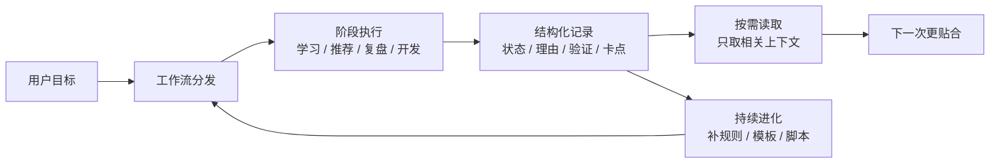

# AI 工作流会学习

一个让 AI 从“每次重新解释”变成“越用越懂业务”的个人工作流实践

一句话摘要：我在做一套 AI-Work-Kit 工作流，把日常学习、资料筛选、任务复盘和流程卡点沉淀成可复用记录。它解决的不是“让 AI 回答一次更快”，而是让 AI 在连续工作中记住背景、理解我的学习进度、知道上次哪里卡住，并把这些经验用于下一次。当前仓库已经留下 47 条执行反馈、19 个学习循环记录、8 期每周知识推荐和 4 个流程事件文件；旧基线按“临时聊天 + 人工回忆 + 手动筛选”保守推断，本文只说明变化方向，不编造精确节省百分比。

## 背景：我在解决什么问题

**我做的不是一个单次提问工具，而是一套让 AI 陪我长期完成学习、研发和复盘的工作流。**

现在 AI 单次回答已经很快，但真实工作不是一次问答。一个人要持续学习新知识、筛选行业资料、复盘项目卡点、整理最佳实践，中间会跨天、跨主题、跨任务。

如果只靠普通聊天，问题很快出现：

- 上次学到哪里，要重新解释一遍。
- 哪些概念已经懂了，哪些还没懂，AI 只能凭当前对话猜。
- 每周知识推荐每次重新找，缺少连续判断标准。
- 项目为什么卡住，过几天只能翻聊天记录或靠人回忆。
- 一次复盘里的经验，下次不一定能自动用上。

所以这次实践的目标很明确：**把 AI 使用过程从“一次性聊天”升级成“连续可复用的工作流”。**

这件事对团队有价值，因为它把个人经验、任务过程和 AI 协作方式都沉淀下来。后续不只是我自己少解释，其他人也能复用这套方法做学习、知识推荐、研发复盘和流程改进。

## 旧做法：每次都要重新对齐背景

**旧做法最大的问题不是慢，而是上下文会丢。**

以前如果我要用 AI 辅助学习一个新主题，大概是这样：

1. 先告诉 AI 我想学什么。
2. AI 给一份资料或解释。
3. 我学完后继续问下一个问题。
4. 过一天再回来，要重新说明我学过什么、哪里没懂。
5. 如果要做知识推荐或复盘，又要重新翻资料、翻聊天、整理结论。

这种方式短期可用，但越往后越累。因为每一次 AI 都像重新认识我一次。

用在每周知识推荐上也是类似问题。普通做法是“本周找几篇 AI 文章，挑一篇写总结”。但领导真正关心的不是“看了哪篇文章”，而是：

- 这篇文章和我们的工作有什么关系？
- 它能不能指导下一步实践？
- 它和前几期判断是否一致？
- 它能不能沉淀成团队方法？

如果没有连续记录，知识推荐就容易变成信息搬运，而不是体系化判断。

## 新做法：让每次执行都留下可复用记录

**AI-Work-Kit 的核心做法，是把每次任务都拆成“人能读、机器能查、下次能复用”的记录。**

这套工作流主要做了三件事。

第一，学习不再只停留在聊天里。每一轮学习都会形成学习记录，写清楚本轮主题、资料、答疑、实践、验证、复盘和下一步。它记录的不只是“学过什么”，还包括“掌握到哪一层、哪里还不稳、下一步该练什么”。

第二，每周知识推荐不再只是临时找文章。每期知识推荐会记录候选文章、评分理由、是否重复、为什么选中，以及它和当前工作流的关系。这样后面再选题时，可以沿着同一条判断主线继续，而不是每周从零开始。

第三，每次工作流执行完都会留下反馈。反馈里会写：这次用了哪些资料、缺了什么能力、哪里卡住、结果是否通过。后续可以随时读取、按需聚合，反推哪些规则、模板、脚本或流程应该优化。

这就是“工作流会学习”的含义。不是 AI 自己凭空变聪明，而是每次工作都把有价值的信息整理成下一次能用的结构。

## 整体架构：不是塞历史，而是分层进化

**这套工作流的关键不是把过去所有聊天都塞给 AI，而是把历史拆成几类结构化信号，再按需读取。**

它的架构可以分成五层：

1. 入口层：用户提出学习、知识推荐、复盘或开发目标。
2. 执行层：AI 按任务类型完成资料准备、互动答疑、实践验证、推荐筛选或问题定位。
3. 记录层：把结果拆成学习状态、推荐理由、验证结论、执行反馈和卡点。
4. 读取层：下一次任务只读取相关记录，不把所有历史原封不动塞进上下文。
5. 进化层：当某类缺口反复出现，就沉淀成规则、模板、脚本或流程改造。



这张图里最重要的是“结构化记录”这一层。它不是聊天全文，也不是流水账，而是把历史加工成几类可复用材料：

| 记录类型 | 记录什么 | 下次怎么用 |
|----------|----------|------------|
| 学习状态 | 学到哪一层、哪些已掌握、哪些还不稳 | 解释概念时接着当前水平讲 |
| 推荐理由 | 为什么推荐、和当前目标有什么关系、是否重复 | 每周知识推荐不再从零筛选 |
| 验证结论 | 哪次实践通过、哪里没通过、下一步练什么 | 防止“听懂了但不会用” |
| 执行反馈 | 用了哪些资料、缺什么能力、哪里卡住 | 随时聚合成改进项 |
| 流程改造 | 哪些规则、模板或脚本被补上 | 下次执行默认更顺 |

所以它看起来越来越懂你，不是因为“记住了所有历史”，而是因为它知道哪些历史值得变成状态，哪些问题值得变成规则，哪些资料值得变成下一次推荐依据。

## 例子一：持续学习时，AI 越讲越贴合

**学习效果变好的原因，是 AI 能看到我的学习进度和薄弱点。**

以任意一个长期学习主题为例，工作流不会只保存“我正在学习”。它会记录一张学习地图：

| 阶段 | 记录内容 | 当前状态 | 对后续学习的帮助 |
|------|----------|----------|------------------|
| 入门理解 | 核心概念、基本框架、常见误区 | 已完成 | 后续不用从零解释背景 |
| 方法掌握 | 关键方法、适用场景、判断边界 | 已完成 | 后续可以直接进入更深问题 |
| 实践验证 | 用一个小任务验证是否真懂 | 进行中 | 发现薄弱点，避免“以为懂了” |

同时，复盘里也记录了我的薄弱点：

- 哪些概念只是听懂了，还不能自己解释。
- 哪些方法知道名称，但不知道什么时候用。
- 哪些实践步骤容易漏掉边界条件。

这就解释了为什么后续学习会更贴合。AI 不需要重新讲最基础的概念，而是会接着前面的认知台阶讲：

```text
你已经理解基础概念。
现在进入方法层：这个方法解决什么问题，什么时候适用，什么时候不适用。
你上次实践时容易漏边界，所以这次先用一个小练习验证。
```

这种解释比泛泛介绍概念更有效，因为它接住了我的上一轮学习状态。

## 例子二：每周知识推荐从信息搬运变成体系推荐

**知识推荐变清晰，是因为筛选标准开始围绕长期主线收敛。**

第 10 期每周知识推荐没有选普通新闻，而是选了一篇讲“运行记录如何反哺系统改进”的一手资料。选择它的原因不是“它看起来新”，而是它和我正在做的 AI-Work-Kit 很像：

| 外部文章讲的机制 | 我们工作流里的对应做法 | 价值 |
|------------------|------------------------|------|
| 保存运行轨迹 | 保存 Plan、事件和执行反馈 | 知道 AI 当时到底怎么做 |
| 人类和模型反馈 | 记录缺口、卡点和人工判断 | 把评价变成可追踪数据 |
| eval 验收 | 门禁脚本和检查清单 | 防止经验只停留在口头 |
| handoff 交接 | 工作流进化任务 | 把改进交给下一轮执行 |

这就是知识推荐“更成体系”的原因。它不再只是总结外部文章，而是在回答一个更贴近业务的问题：

> 这篇外部资料能不能帮助我们改进自己的 AI 工作流？

这样沉淀出来的知识推荐，对领导和团队更有价值。因为它不是信息摘抄，而是把外部趋势翻译成内部方法。

## 数据：当前已经有可复查证据

**这套机制已经在仓库里留下了可查样本，不是口头描述。**

当前能看到的证据如下：

| 指标 | 当前值 | 说明 |
|------|--------|------|
| 执行反馈 `skill_run` | 47 条 | 记录每次工作流用了什么、缺什么、哪里卡 |
| 学习循环记录 | 19 个 | 覆盖学习主题、资料、答疑、实践、验证、复盘 |
| 每周知识推荐 | 8 期 | 形成连续选题、评分和去重轨迹 |
| 独立元数据文件 | 10 个 | 给后续聚合和进化使用 |
| 工作流事件文件 | 4 个 | 记录流程通过、失败和卡点 |
| 门禁失败 / 通过事件 | 22 / 17 条 | 让“为什么不能继续”可复盘 |

这些数字的意义不是“文档变多了”，而是说明工作流已经有了正反馈样本：

- 学习样本让 AI 更懂我当前的知识水平。
- 知识推荐样本让 AI 更懂我关心什么方向。
- 事件样本让 AI 更懂流程哪里容易卡。
- 执行反馈让后续可以反推该补哪些规则和工具。

## 对照：旧基线与当前效果

**旧基线来自当前优化后的保守反推，只用于说明变化方向，不作为精确工时统计。**

| 场景 | 旧基线（推断） | 当前效果 | 变化 |
|------|----------------|----------|------|
| 继续学习 | 重新说明上次学到哪里 | 读取学习 Epic 和复盘记录 | 背景恢复成本下降 |
| 解释概念 | 泛讲理论，难贴合当前水平 | 根据已掌握和未掌握点解释 | 理论更容易接到实践 |
| 选知识推荐 | 每周重新找文章、凭感觉筛 | 按候选评分、去重和主线关系筛 | 推荐更成体系 |
| 复盘卡点 | 翻聊天、问当时为什么卡 | 读取事件和失败原因 | 卡点定位更稳定 |
| 改进流程 | 口头说“下次注意” | 聚合执行反馈形成改造候选 | 经验能进入下一轮流程 |

这次不写“提升 X%”，因为旧流程没有精确计时。更稳的结论是：

> 原来很多成本花在重新解释背景、重新筛选资料、重新回忆卡点；现在这些信息被沉淀成文件事实，下一次可以直接读取。

## 可复用价值：不是个人笔记，而是团队方法

**这套方法可以复用到任何长期任务：学习、知识推荐、研发、项目复盘、最佳实践沉淀。**

复用时不需要先做复杂系统，只要守住四个动作：

1. 每个任务有记录：写清楚这次做了什么。
2. 每轮结束有复盘：写清楚学会什么、没掌握什么、下一步是什么。
3. 每次执行有反馈：写清楚用了什么资料、缺什么能力、哪里卡。
4. 随时做聚合：把高频问题变成规则、模板、脚本或流程改造；需要汇报时也能再按周、按月汇总。

这也是我认为这件事值得汇报的原因：它不是一次漂亮的 AI 输出，而是一个能持续积累的工作方式。

## 下一步：把“知道问题”升级成“自动改进”

**当前已经能知道哪里卡，下一步要让工作流更容易把卡点变成可执行改造。**

建议继续补三件事：

- 给每个能力缺口增加验收说明：不只写“缺什么”，还写“补好后怎么证明有效”。
- 生成改造交接视图：把高优先级问题整理成可直接执行的改造任务。
- 规范卡点记录格式：固定为“阶段 / 动作 / 卡点 / 建议”，方便后续聚合。

这样工作流就会从“能复盘”继续升级到“能推动自己改进”。

## 小结

**AI-Work-Kit 变聪明的原因，是它把个人学习、资料筛选和流程反馈放进了同一条进化回路。**

它解决的核心问题不是单次回答，而是连续工作里的上下文丢失。学习记录让 AI 知道我学到哪里，知识推荐记录让 AI 知道我关心什么，执行反馈让 AI 知道流程哪里该改。

最终效果是：AI 不再每次从零开始，而是能沿着之前留下的事实继续工作。

## 反馈（skill_run）

```yaml
skill_run:
  skill: best-practice-digest
  plan: Plans/最佳实践/2026-07-10-会学习的工作流.md
  date: 2026-07-10
  contexts_used:
    - path: Contexts/最佳实践/提效度量口径.md
      utility: high
      reason: "按可测量可验证原则区分仓库事实与推断旧基线，不输出伪精确百分比。"
    - path: Contexts/最佳实践/案例报告模板.md
      utility: high
      reason: "按技术博客结构组织主题、方法、数据、案例和复用建议。"
    - path: Contexts/最佳实践/进化闭环.md
      utility: high
      reason: "解释最佳实践案例如何反哺 skill_run、feedback-aggregate 与 workflow-evolution。"
    - path: Contexts/决策/Skill反馈协议.md
      utility: high
      reason: "核对 skill_run 字段、contexts_missing、friction 与反馈聚合消费方式。"
    - path: Contexts/决策/Kit核心原则.md
      utility: high
      reason: "确认 Plans/Contexts/Templates 边界，以及反馈闭环和写回边界。"
    - path: Contexts/规范/炫酷建站规范.md
      utility: high
      reason: "生成自渲染 HTML，包含 Mermaid、关键数字主角化和多宽度适配自检。"
    - path: Plans/Epic/2026-07-08-智能体开发.md
      utility: high
      reason: "作为学习循环、学习地图和知识图谱增量的主要证据。"
    - path: Plans/情报周报/2026-07-10-第10期.meta.yaml
      utility: high
      reason: "作为知识推荐从普通信息筛选转向反馈进化机制的证据。"
  contexts_missing:
    - "feedback handoff 视图：把高优先级 contexts_missing 自动整理为可执行改造包。"
    - "contexts_missing 验收提示字段：当缺口指向可落地能力时，记录补好后如何证明有效。"
    - "friction 结构化写法：固定为 阶段/动作/卡点/建议，便于聚合具体流程改造点。"
  contexts_stale: []
  outcome_status: pass
  friction: "用户反馈领导读者缺少背景，已重写为先讲业务问题、旧做法、新做法和价值，再解释内部机制。"
  revisit_needed: false
```
