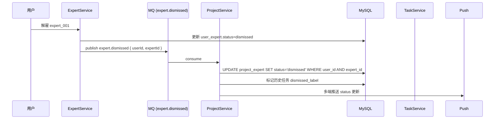

# 技术方案：项目内专家团（服务端 · v1.2.0）

> **需求依据**：`Plans/需求分析/2026-06-24-项目内专家团.md`（已采纳，P0=0）
> **客户端方案**：`Plans/客户端技术方案/2026-06-24-项目内专家团-客户端.md`
> **接口契约**：见需求 plan §十三（6 接口 v1.0）

## 一、背景与目标

支撑 v1.2.0 项目内专家团：**项目 → 专家 多对多关系**、**@ 任务**（属于项目，全局不可见）、**全局解雇联动**。

**非目标**：商店专家市场改造（v1.2.1）；项目跨用户共享。

## 二、整体架构

### 服务边界

```
┌─────────────────┐    ┌─────────────────┐    ┌─────────────────┐
│  纳米Work APP   │───▶│  Project Service │───▶│ Expert Service  │
│  (iOS / Andr)   │    │ (本方案主体)     │    │ (商店 / 已雇佣) │
└─────────────────┘    └─────────────────┘    └─────────────────┘
                            │      │
                            ▼      ▼
                    ┌────────┐  ┌────────────┐
                    │  MySQL │  │ Task Service│
                    │（含本期│  │（一期已有） │
                    │ 4 新表 │  └────────────┘
                    └────────┘
                            │
                            ▼
                    ┌────────────────┐
                    │ MQ: expert.dismissed │  // 全局解雇事件
                    └────────────────┘
```

### 序列图：解雇联动



## 三、数据模型

### 3.1 表设计（4 张新表 + 2 张扩展）

**`project`**（一期已有，本期扩展）

| 字段 | 类型 | 说明 |
|------|------|------|
| `id` | bigint PK | |
| `user_id` | bigint | 项目归属 |
| `name` | varchar(50) | |
| `icon` | varchar(64) | nullable |
| `icon_color` | varchar(8) | hex |
| `custom_instruction` | text | nullable |
| `created_at` | datetime | |
| `deleted_at` | datetime | 软删 |

索引：`(user_id, deleted_at)`

**`project_expert`**（新，多对多）

| 字段 | 类型 | 说明 |
|------|------|------|
| `id` | bigint PK | |
| `project_id` | bigint FK | |
| `expert_id` | varchar(64) | |
| `status` | enum | `active` / `removed` / `dismissed` |
| `joined_at` | datetime | |
| `removed_at` | datetime | nullable |
| `dismissed_at` | datetime | nullable |
| `install_status` | enum | `installed` / `installing` / `failed` |
| `install_failure_reason` | varchar(255) | nullable |

索引：`UNIQUE(project_id, expert_id)`、`(expert_id, status)` 用于解雇联动反查

**`project_task`**（一期已有，本期扩展）

新增字段：

| 字段 | 类型 | 说明 |
|------|------|------|
| `source` | enum | `manual` / `at_mention` |
| `expert_id` | varchar(64) | @ 任务必填 |
| `is_global_visible` | tinyint(1) | 项目内任务 = 0 |
| `dismissed_label` | tinyint(1) | 专家解雇后标 1，UI 显示"已解雇" |

索引：`(project_id, status, created_at DESC)` 用于项目内任务列表分页

**`project_recommend_config`**（新，云控推荐项目名 v1.2.1 预留）

本期不实现，表结构预留。

### 3.2 状态机：`project_expert.status`

```
active ──[移除]──▶ removed
active ──[解雇联动]──▶ dismissed
removed ──[重新添加]──▶ active   // 注意：恢复时 join_at 不重置
```

`dismissed` 终态：不再允许同 `expert_id` 重新添加（直到用户重新雇佣）。

## 四、API / 协议（实现细节）

接口列表与字段定义见需求 plan §十三。本节补充实现侧约束。

### 4.1 POST /api/v1/project/create

**事务边界**：

```
BEGIN;
  INSERT project (...);
  IF expertIds.length > 0:
    BATCH INSERT project_expert (project_id, expert_id, install_status='installing');
COMMIT;
异步任务：
  FOR each expert IN expertIds:
    异步调 ExpertService 安装；
    成功 → UPDATE install_status='installed';
    失败 → UPDATE install_status='failed', install_failure_reason=...;
```

主流程 ≤ 200ms（不等待异步安装）；`Response.installationFailures[]` 在创建瞬间为空，后续通过 `GET /experts` 返回最新状态。

**幂等**：客户端必传 `clientToken`（header `X-Idempotency-Key`），相同 token 24h 内返回相同 `projectId`。

**强校验**：`expertIds.length ≤ 5` 服务端拦截；超出返回 `40001`。

### 4.2 GET /api/v1/project/{projectId}/experts

- 默认过滤 `status='active'`；附加 query `includeRemoved=true` 时返回 removed + dismissed
- `task_count` JOIN `project_task` 计数 + Redis 缓存（key: `project_expert_task_count:{projectId}:{expertId}`, TTL 60s）
- 鉴权：仅 `project.user_id == current_user_id` 可访问

### 4.3 POST /api/v1/project/{projectId}/experts/add

**事务 + 上限校验**：

```
SELECT COUNT(*) FROM project_expert WHERE project_id=? AND status='active' FOR UPDATE;
IF count + req.expertIds.length > 5: 返回 40001
BATCH INSERT;
触发异步安装；
```

`failed[]` 包含：超上限的、状态为 `dismissed` 不可重添的、商店侧不存在的。

### 4.4 POST /api/v1/project/{projectId}/experts/remove

**单调性**：

```
UPDATE project_expert
SET status='removed', removed_at=NOW()
WHERE project_id=? AND expert_id=? AND status='active';
```

进行中任务**不变更**（保留 `expert_id`，UI 端按 status 标灰）。

### 4.5 POST /api/v1/project/{projectId}/task/create

**前置校验**：

1. 项目存在且属于当前用户
2. `expert_id` 在 `project_expert` 中状态为 `active`（拒绝 removed / dismissed）
3. 长度限制：`content ≤ 5000` 字符

**写入**：

```
INSERT project_task (project_id, expert_id, content, source='at_mention',
                    is_global_visible=0, status='pending');
```

下发 Task Service 调度执行。

### 4.6 GET /api/v1/project/{projectId}/tasks

支持 query：

- `status` （pending / executing / completed）
- `expertId`
- 分页：`pageSize` ≤ 50, `pageToken`

返回 `expertName` / `expertAvatar` 由 JOIN `expert` 表得到（Redis 缓存专家元数据 5min）。

## 五、关键流程

### 5.1 商店全局解雇联动

触发：`ExpertService` 处理用户解雇请求后发 `expert.dismissed` MQ 事件。

`ProjectService.dismissedConsumer`：

```
fun onExpertDismissed(userId, expertId):
  rows = SELECT project_id FROM project_expert
         WHERE expert_id=? AND status IN ('active', 'removed')
           AND project_id IN (SELECT id FROM project WHERE user_id=?)

  UPDATE project_expert
  SET status='dismissed', dismissed_at=NOW()
  WHERE project_id IN (rows) AND expert_id=?;

  UPDATE project_task
  SET dismissed_label=1
  WHERE project_id IN (rows) AND expert_id=?;

  push status_update 多端
```

幂等：相同 userId+expertId 重复消费安全（status 单向迁移）。

### 5.2 项目删除

```
UPDATE project SET deleted_at=NOW() WHERE id=?;
// project_expert / project_task 不级联，保留审计；
// UI 通过 project.deleted_at IS NOT NULL 过滤即可
```

按需求 plan Q13：专家本身不受影响（仍在用户已雇佣列表）。

### 5.3 一期"空项目"兼容

`project_expert` 中无数据 → API 13.2 返回 `total: 0, list: []`；前端按空态渲染（AC-10）。

## 六、客户端 / 服务端拆分

见客户端方案 §六。本节补充服务端独有职责：

| 职责 | 说明 |
|------|------|
| 强校验 | 专家上限 / 项目归属 / 内容长度 / clientToken 幂等 |
| 异步安装 | 主流程不阻塞；通过 `install_status` 通知客户端 |
| 解雇联动 | MQ 消费 + 数据库更新 + 多端推送 |
| 任务隔离 | `is_global_visible=0` 字段 + 首页 SQL 过滤 |
| 鉴权 | 所有接口校验 `project.user_id == current_user_id` |
| 限流 | 防止恶意批量创建：单用户每秒 ≤ 2 次 create |

## 七、风险与回滚

| 风险 | 等级 | 影响 | 应对 | 回滚 |
|------|------|------|------|------|
| 并发添加导致超上限 | 中 | 实际入库超 5 | `SELECT ... FOR UPDATE` 行锁 + 事务 | DB 约束 + 定时任务清理 |
| 解雇 MQ 丢失 | 高 | 状态不一致 | 至少一次投递 + 消费者幂等；旁路定时全量对账（日级）| 手动触发对账脚本 |
| 商店专家安装超时 | 中 | install_status 永远 installing | 异步任务 30s 超时 → failed | 客户端可手动重试 13.3 |
| Redis 缓存击穿 | 低 | DB 压力 | 热 key 加分布式锁 | 直接走 DB |
| 任务列表慢 | 中 | API 13.6 性能差 | 复合索引 + 分页 + 限制最大返回 | 加 ES 索引（v1.2.1）|
| 数据迁移：一期 project 表新增字段 | 低 | 老数据 NULL | 字段 nullable 兼容；新建时填 | ALTER 在低峰执行 |
| **总回滚开关** | — | 接口异常 | **配置中心 `feature.project_expert_team` 开关**：OFF 时新增接口返回 410，老接口（项目创建无 `expertIds`）正常工作 | 5 分钟生效 |

### 灰度与监控

| 监控 | 阈值 | 告警 |
|------|------|------|
| `POST /create` 成功率 | < 99% | P0 |
| `POST /task/create` p99 | > 500ms | P1 |
| `expert.dismissed` 消费延迟 | > 30s | P0 |
| `install_status=failed` 占比 | > 5% | P1 |
| 4xx 错误码分布 | 异常突增 | P1 |

## 八、Domain / 服务接口

```
ProjectExpertService
  listByProject(projectId) -> [ProjectExpert]
  addBatch(projectId, expertIds) -> {added, failed}
  remove(projectId, expertId) -> Void
  markDismissed(userId, expertId) -> [updatedProjectIds]      // MQ 消费用

MentionTaskService
  create(projectId, expertId, content) -> Task

ProjectInstallationService
  installAsync(projectId, expertId) -> Void                   // 异步落 install_status
```

## 九、待评审

- [ ] 服务端 RD：表结构 / 索引 / 事务边界 / Redis 缓存 key 设计 / MQ 消费者幂等实现
- [ ] 客户端 RD：契约对齐（字段命名、错误码、`clientToken` 实现位置）/ `install_status` 轮询 vs 推送
- [ ] 测试：AC-5（安装失败）/ AC-10（升级兼容）/ AC-11（解雇联动）E2E 覆盖
- [ ] PM：埋点 P0 点位 SLA 验收 / `source` `fail_reason` 枚举封闭值
- [ ] 运维：MQ 消费监控 / 数据库 ALTER 执行窗口 / 配置中心 feature flag

## 十、续做

```
/resume plan=Plans/服务端技术方案/2026-06-24-项目内专家团-服务端.md 进度=【】
```

## 十一、反馈（skill_run）

```yaml
skill_run:
  skill: architecture-design-assistant
  plan: Plans/服务端技术方案/2026-06-24-项目内专家团-服务端.md
  date: 2026-06-24
  contexts_used:
    - path: Plans/需求分析/2026-06-24-项目内专家团.md
      utility: high
      reason: "§九 12 AC + §十三 6 接口 schema + §十四 埋点表 + §十一 产品决策（解雇联动/项目删除/进行中任务）直接定型服务端表结构 / 事务 / MQ 消费逻辑"
    - path: Templates/技术方案模板.md
      utility: high
      reason: "服务端方案 10 章节骨架来源"
    - path: Plans/客户端技术方案/2026-06-24-项目内专家团-客户端.md
      utility: high
      reason: "客户端方案 §六 拆分表 + §四 错误码映射 决定服务端职责边界 + 强校验项"
```
