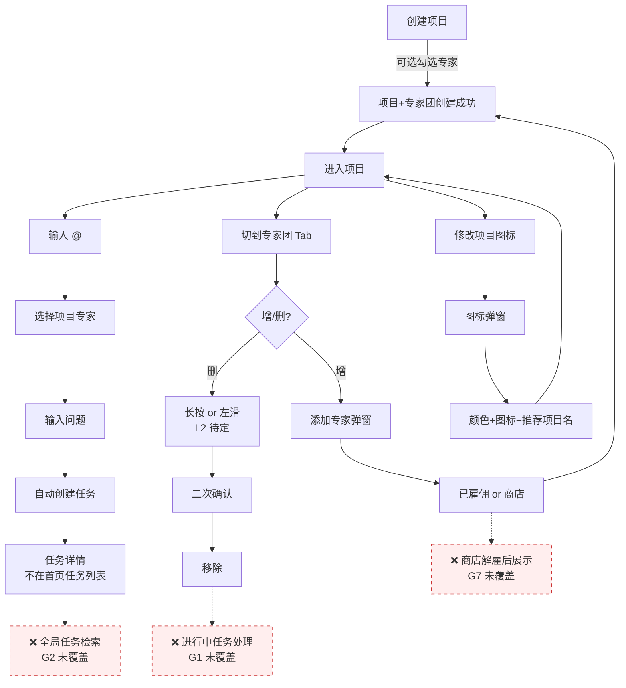

# 需求分析：项目内专家团（v1.2.0）

> PRD（当次链接，不存档）：https://q854rwlc63.feishu.cn/docx/UNKdd529soFQrfxGPmScKRwXnJf
> 模块：纳米Work APP · 项目Tab · v1.2.0
> 来源 PRD 版本：v1.1 / 2026-06-22
> 真理源：本 plan。代码对照：未做（工作区为 Vault，非代码仓库）。

## 一、PRD 摘要

二期目标：在一期"空项目"基础上引入**项目内专家团** + **@ 创建任务** + **项目图标**三大能力：

1. 创建项目时勾选专家（上限存疑，见 L1）→ 项目自动生成专家团
2. 项目内输入 `@` → 弹出本项目专家列表 → 自动创建任务（任务归属于当前项目，不显示首页任务列表）
3. 项目详情页新增「专家团」Tab，支持增/删专家（手势存疑，见 L2）
4. 输入框文案统一为「输入问题」
5. 项目图标改为弹窗交互；附带云控推荐项目名 + 图标

## 二、范围矩阵

| 入口 | 场景 | 目标页 |
|------|------|--------|
| 项目 Tab 列表页 | 点击「创建项目」 | 创建项目（基本信息 + 专家两步）|
| 项目详情页 | 切换到「专家团」Tab | 专家团列表（增/删）|
| 项目详情页 | 输入框输入 `@` | 专家浮层 → 选定 → 自动创建任务 |
| 项目内 | 点击输入框左侧图标 | 图标弹窗（颜色 + 图标 + 推荐项目名）|

## 三、逻辑问题表（PRD 写了但矛盾 / 分支未定义）

| # | 模块 | 矛盾点 | PRD 引用 | 严重度 |
|---|------|--------|----------|--------|
| L1 | **专家上限** | §1/§2.1/§2.2 均写 **5 个**；§3.1 多处写 **8 个**（"已选 8 个专家"、"满 8 个时... 置灰"）| §1, §2.1, §2.2 vs §3.1 | **P0** |
| L2 | **删除手势** | §2.2 "**左滑**专家卡片"；§3.2 "**长按**卡片" — iOS 标准为左滑，长按非标 | §2.2 vs §3.2 | **P0** |
| L3 | **商店专家安装时机** | §3.1 "创建时，从专家商店添加的专家**直接安装**"；§3.5 "**触发对话后**对应专家下载安装" | §3.1 vs §3.5 | **P0** |
| L4 | **空专家项目输入框** | §3.4 "无专家时**显空态** + 跳转 Tab 按钮"；§3.5 "无专家则**默认显示纳米AI助理**" | §3.4 vs §3.5 | **P0** |
| L5 | 创建项目专家来源 | §2.1 "已雇佣 + 商店推荐"；§3.1 "显示**已添加**的专家"（无商店）| §2.1 vs §3.1 | P1 |
| L6 | 项目图标功能边界 | §2.5 "**仅是挪到单独弹窗**处理"；§3.6 引入新功能（颜色 + 云控推荐项目名）| §2.5 vs §3.6 | P1 |
| L7 | 多选 / 单选 | §2.1 创建时"**可多选**"；§3.5 输入框专家是"**选中对应专家**"——单/多选未明 | §2.1 vs §3.5 | P1 |

## 四、交互冲突表（入口、空态、状态、Tab）

| # | 位置 | 问题 | 严重度 |
|---|------|------|--------|
| I1 | 创建项目 → 专家选择 | §3.1 截图只示意已添加列表，但 §2.1 说"展示已雇佣 + 商店"——首屏到底显示什么？默认 Tab？| P0 |
| I2 | 专家团 Tab 与现有 Tab | §3.2 "现有：任务 / 知识 / 专家团" — Tab 顺序、默认 Tab、记忆策略均未说 | P1 |
| I3 | 输入 @ 浮层 | §3.4 "底部弹出，半屏高度" — 与键盘的层级（覆盖键盘？跟随键盘）未说 | P1 |
| I4 | @ 标签删除手势 | "支持删除" — 退格删整 tag 还是点 x？ | P2 |
| I5 | 添加专家两种容器 | §3.1 嵌入页面，§3.3 弹窗——同语义两个 UI 容器，行为是否一致？| P1 |
| I6 | 项目图标默认值 | §3.6 "初始未设置时显示**默认图标**" — 默认图标是什么？与一期一致？| P2 |
| I7 | **推荐项目名替换** | §3.6 "输入框有内容时**直接替换**" — 用户已输入的内容会丢失？无二次确认？ | **P0** |

## 五、整体遗漏表（PRD 全文未提及但功能上线必需）

> 对照 [[Contexts/需求分析/PRD分析检查清单]] §3.1–3.6 逐类扫描。每条标明：**缺失内容** / **不补时开发只能怎么猜** / **严重度**。

### 5.1 用户旅程闭环

| # | 缺失 | 开发只能猜 | 严重度 |
|---|------|-----------|--------|
| G1 | **已被删除专家的进行中任务怎么处理？** §3.2 只说"历史保留"，未说进行中 | 继续执行 / 立即中断 / 标灰但允许查看 — 三种行为差别巨大 | **P0** |
| G2 | **项目内任务"不显示首页"，用户如何全局检索？** | 默认无 / 加搜索框 / 加"全部任务"入口 | **P0** |
| G3 | 商店专家**安装失败回退** | 静默忽略 / Toast / 阻塞创建项目 | P1 |

### 5.2 接口与字段

| # | 缺失 | 开发只能猜 | 严重度 |
|---|------|-----------|--------|
| G4 | **全文无任何接口定义**（创建项目带专家、添加/删除专家、@ 创建任务、专家团列表、解雇联动）| 客户端自定义 schema → 服务端必返工 | **P0** |
| G5 | 云控字段 `assistant_work_app_base_set.project_recommendation_info` **拉取时机 / 缓存 / 降级**未说 | 启动拉 / 每次进入拉；失败 → 无推荐 or 内置默认 | P1 |

### 5.3 删除 / 启停 / 数据回收

| # | 缺失 | 开发只能猜 | 严重度 |
|---|------|-----------|--------|
| G6 | **整个项目删除时，专家团数据何处理？** | 联动删除 / 转回"我已雇佣" / 仅解绑 | P1 |
| G7 | **解雇某专家（商店侧）后，已存在项目内如何展示？** | 灰显 / 自动移除 / 不影响 | **P0** |

### 5.4 边界（空数据 / 弱网 / 权限 / 并发）

→ 详见 §六。

### 5.5 埋点与数据统计

| # | 缺失 | 开发只能猜 | 严重度 |
|---|------|-----------|--------|
| G8 | **全文 0 埋点要求** — 创建项目带专家数、添加 / 移除专家、@ 触发率、任务来源分布、推荐项目名点击率... | 客户端按经验补 → 数据组不可用 | **P0** |

### 5.6 验收标准（AC）

| # | 缺失 | 开发只能猜 | 严重度 |
|---|------|-----------|--------|
| G9 | **PRD 全文未提供任何可测 AC** | 测试组自写 → 与产品理解偏离 | **P0** |

### 5.7 其它

- 一句话简介字段长度：**PRD 全文未提及** → P2，假设按现网专家卡片规范
- 国际化（英文 / 日文 UI）：**PRD 全文未提及** → P2
- 多端同步（iOS / Android / Web 专家列表实时性）：**PRD 全文未提及** → P1
- 性能（@ 浮层加载、专家团列表渲染上限）：**PRD 全文未提及** → P2

## 六、边界情况清单

| 类目 | 场景 |
|------|------|
| 空数据 | 项目专家列表空 / 专家商店空 / 推荐项目名云控为空 / 已雇佣专家列表空 |
| 极长文本 | 专家名称超长（中 / 英）/ 项目名超长 / 一句话简介超长 |
| 弱网 | 创建项目时商店头像加载失败 / @ 发送时网络断 / 专家安装中断 |
| 权限 | 未登录态可否进入项目 / 商店专家需付费 |
| 并发 | 同一项目多端同时增删专家 / @ 时另一端正在删除该专家 / 双击发送 |
| 重复 | 重复 @ 同一专家 / 重复添加已存在专家 / 重复点击图标推荐项 |
| 异常组合 | 项目刚创建即网络断创建按钮可点 / 升级中切到后台 |
| 兼容性 | 一期已存在的"空项目"升级 v1.2 后的专家团状态 |

## 七、异常流程矩阵

| 触发条件 | 用户反馈 | 系统行为 |
|---------|---------|---------|
| 添加专家超上限（5 or 8 待定）| Toast「每个项目最多添加 N 个专家」| 阻止添加，列表不变 |
| @ 时该专家已被删 | Toast「该专家已不在本项目」| 浮层重新拉列表 |
| 商店专家安装失败（网络）| Toast「专家添加失败，请重试」| 该专家不入项目专家团；创建项目继续 |
| 创建项目时商店列表加载失败 | 占位错误态 + 重试按钮 | 不阻塞创建；可跳过专家步骤 |
| 项目无专家时输入 @ | （L4 待定）显空态 or 纳米AI助理 | 不创建任务 / 走纳米AI助理任务流 |
| 删除专家二次确认时取消 | 弹窗关闭 | 列表不变 |
| 多端并发：删除已被另一端 @ 的专家 | 见 G1（未决）| 见 G1 |
| 推荐项目名替换正在输入的内容 | 见 I7（未决）| 见 I7 |
| 项目图标弹窗未选择直接关闭 | 不变（保持默认或之前的图标）| 不写入 |
| 云控拉取失败 | 无推荐项目名展示（兜底无内置默认时）| 输入框照常工作 |

## 八、用户旅程闭环图



**红色虚线节点**为 PRD 未覆盖环节（G1 / G2 / G7）。

## 九、验收标准（AC）

> PRD 全文未提供 AC（G9），以下为本分析补齐的**可测 AC 表**。**待产品确认后**作为测试组真理源。

| # | 场景 | 前置 | 操作 | 期望 | 优先级 |
|---|------|------|------|------|--------|
| AC-1 | 创建项目带专家 | 已雇佣 ≥ 1 专家 | 创建项目 → 勾选 1 专家 → 创建 | 项目专家团含该专家，列表 1 人 | P0 |
| AC-2 | 上限校验（按 Q1 定）| 项目专家 = 上限 | 再添加 1 个 | Toast 拦截，列表不变 | P0 |
| AC-3 | @ 创建任务 | 项目专家 ≥ 1 | 输入 @ → 选专家 → 输入内容 → 发 | 创建任务，归属当前项目，不在首页 | P0 |
| AC-4 | 移除专家保留历史 | 该专家有 1 历史任务 | 移除该专家 | 任务历史可访问；再 @ 不见该专家 | P0 |
| AC-5 | 空专家项目输入 @ | 项目 0 专家 | 输入 @ | （L4 待定）显空态 or 纳米AI助理 | P0 |
| AC-6 | 项目图标选择 | — | 点击图标 → 选颜色 + 图标 → 确认 | 输入框右侧显示所选图标 | P1 |
| AC-7 | 图标选择后展示 | — | 弹窗选图标 + 颜色 → 确认 | 输入框正确显示所选图标（推荐项目名 v1.2.1 再做）| P1 |
| AC-8 | 多端同步 | iOS 添加专家 | Web 端打开同项目 | 专家列表一致（实时性 SLA 待定）| P1 |
| AC-9 | 弱网创建项目 | 网络受限 | 创建时商店头像加载失败 | 创建仍可完成，头像占位 | P1 |
| AC-10 | 一期项目升级 | 已存在空项目升 v1.2 | 打开 | 专家团 Tab 空态 + 输入框文案已更新 | P0 |
| AC-11 | 商店解雇联动 | 项目 A 含专家 X | 商店侧解雇 X | （G7 待定）灰显 / 自动移除 / 不影响 | P0 |
| AC-12 | 删除项目联动 | 项目 A 含专家 + 任务 | 删除项目 A | （G6 待定）任务 / 专家团数据处置 | P1 |

## 十、与现状对照

> 当前工作区为 AI-Work-Kit Vault，**非代码仓库**。本节为分析局限性记录：未做代码对照。
> 若需深入：用户指定 `仓库=/path/to/纳米Work` 重跑 `/requirement-analyst 续做`，对照 v1.1 项目模块代码 + 一期 @ 组件 + 专家商店现有实现。

可推断的现状依赖（来自 PRD §五 关联需求）：

- **NAMI-015**（一期项目）：项目创建链路存在 → 二期复用并增加"专家选择"步骤
- **NAMI-017**（创建专家团）：专家团创建链路存在 → 项目内专家团**复用其创建链路**
- **NAMI-016**（对话框 @ 专家）：@ 专家组件存在 → 项目内 @ **复用其 @ 交互组件**

复用度高 ≠ 风险低：复用边界（特别是任务归属字段、@ 范围参数）必须由 G4 接口定义阶段定清。

## 十一、待产品确认清单（已闭环 ✅）

> **2026-06-24 续做**：产品已全量答复，9 条 P0 全部闭环。

### A. 逻辑交互（已闭环）

| # | 问题 | 产品决策 | 与我方建议 |
|---|------|---------|-----------|
| Q1 | 专家上限 5 vs 8 | ✅ **5**（§3.1 "8 个"为笔误，已修）| 一致 |
| Q2 | 删除手势 | ✅ **左滑**（iOS/Android 标准）| 一致 |
| Q3 | 商店专家安装时机 | ✅ **创建时同步安装**；输入框临时添加同样触发安装 | 一致 |
| Q4 | 空专家项目输入框 | ✅ **默认纳米AI助理** | 一致 |
| Q5 | 创建时是否含商店专家 | ✅ **不含**；底部"从商店添加更多" | 一致 |
| Q6 | §3.6 范围 | ✅ **本期仅图标 + 颜色**；云控推荐项目名延后 v1.2.1 | 我方建议拆 v1.2.1，被采纳 |
| Q7 | 输入框专家单/多选 | ✅ **单选**；多专家发多条 @ | 一致 |

### B. 整体遗漏（已闭环）

| # | 缺失 | 产品决策 |
|---|------|---------|
| Q8 | 删除专家时进行中任务 | ✅ **进行中任务继续执行**；新 @ 不可；任务列表标灰 / "已移除" 标签 |
| Q9 | 项目内任务全局检索 | ✅ **不在首页**；项目内"任务" Tab 全量；首页搜索按项目名过滤但不透出条目（保"项目沙盒"概念）|
| Q10 | 商店专家安装失败 | ✅ Toast 提示，允许跳过 / 重试 |
| Q11 | 接口定义 | ✅ **6 个接口清单已给**（见 §十三），本周内出文档 |
| Q12 | 云控字段 | ✅ **本期不实现**（云控延后 v1.2.1）|
| Q13 | 项目删除时专家团数据 | ✅ **专家团解散**；关联任务归档不可恢复；专家本身保留在"已雇佣"列表 |
| Q14 | 商店解雇联动 | ✅ **项目内自动移除**；保留历史任务标"已解雇" |
| Q15 | 埋点 | ✅ 清单会后提供（含 P0 标注）|
| Q16 | AC 表确认 | ✅ **全采纳 AC-1 ~ AC-12**；仅 AC-7（推荐项目名）改为"图标选择后正确更新"（见 §九 已更新）|

### C. 编辑性（已闭环）

- §3.6 「乐意」→ 「可以」 ✅
- §3.1 「8 个」→ 「5 个」 ✅

## 十二、分析结论（更新 2026-06-24 续做）

| 状态 | 含义 |
|------|------|
| ✅ **可开发** | P0 = 0（9 条全闭环）· AC 全采纳 · 接口清单已给（文档周内出）· 埋点清单会后提供 |

**下一步路径**：

1. 进 `/architecture-design-assistant`（接口与数据流是新增的，必须经架构设计）
   - 输入：本 plan §九 AC + §十三 接口清单
   - 关注：复用 NAMI-015 / 016 / 017 边界（创建链路 / 专家团创建 / @ 组件）
   - 产出：`Plans/客户端技术方案/...md` 与 `Plans/服务端技术方案/...md`
2. ⚠️ **建议先建 Epic**：本 plan **未挂 `epic:`**，无 Epic 进 `Plans/功能开发/` 会卡 `plan-gate-check.sh`。建议先跑：
   ```text
   /full-cycle 模块=项目内专家团
   ```
   把本 plan 挂到 Epic 母 plan 上，避免后续阶段返工。
3. 外部依赖：埋点表（产品本周内）/ 接口文档（产品 + 服务端本周内）→ 进架构前补齐。

## 十三、接口 Schema（产品 + 服务端 · 2026-06-24）

**基础路径**：`/api/v1/project` · **接口数**：6

| # | 方法 | 路径 | 用途 |
|---|------|------|------|
| 13.1 | POST | `/api/v1/project/create` | 创建项目（含专家团）|
| 13.2 | GET | `/api/v1/project/{projectId}/experts` | 专家团列表 |
| 13.3 | POST | `/api/v1/project/{projectId}/experts/add` | 添加专家（批量）|
| 13.4 | POST | `/api/v1/project/{projectId}/experts/remove` | 移除专家 + 解雇联动 |
| 13.5 | POST | `/api/v1/project/{projectId}/task/create` | @ 创建任务 |
| 13.6 | GET | `/api/v1/project/{projectId}/tasks` | 项目内任务列表（一期扩展）|

基础路径：`/api/v1/project`

### 13.1 POST /api/v1/project/create — 创建项目（含专家团）

**Request**

```json
{
  "name": "研究记录",
  "icon": "icon-home",
  "iconColor": "#FF6B6B",
  "expertIds": ["exp_001", "exp_002"],
  "customInstruction": "..."
}
```

字段约束：

| 字段 | 类型 | 必填 | 约束 |
|------|------|------|------|
| `name` | string | ✅ | ≤ 50 字符 |
| `icon` | string | — | 索引值；空则默认 |
| `iconColor` | string | — | hex |
| `expertIds` | string[] | — | ≤ 5，服务端强校验 |
| `customInstruction` | string | — | 一期已支持 |

**Response（成功）**

```json
{
  "code": 0,
  "data": {
    "projectId": "proj_123456",
    "name": "研究记录",
    "icon": "icon-home",
    "iconColor": "#FF6B6B",
    "experts": [
      {
        "expertId": "exp_001",
        "name": "张伟",
        "avatar": "https://...",
        "installStatus": "installed"
      }
    ],
    "installationFailures": [
      { "expertId": "exp_003", "reason": "网络超时" }
    ],
    "createdAt": "2026-06-24T10:00:00Z"
  }
}
```

**错误码**：`40001` 专家数超上限 · `40002` 项目名为空 · `50001` 商店专家安装服务异常（主项目仍创建成功）

### 13.2 GET /api/v1/project/{projectId}/experts — 专家团列表

```json
{
  "code": 0,
  "data": {
    "projectId": "proj_123456",
    "total": 2,
    "maxLimit": 5,
    "list": [
      {
        "expertId": "exp_001",
        "name": "张伟",
        "avatar": "https://...",
        "title": "高级算法工程师",
        "taskCount": 12,
        "status": "active"
      }
    ]
  }
}
```

`status` 枚举：`active` / `removed` / `dismissed`（解雇联动）

### 13.3 POST /api/v1/project/{projectId}/experts/add — 添加专家（批量）

**Request**：`{ "expertIds": ["exp_004", "exp_005"] }`

**Response**

```json
{
  "code": 0,
  "data": {
    "added": ["exp_004"],
    "failed": [
      { "expertId": "exp_005", "reason": "已达项目专家上限（5）" }
    ]
  }
}
```

### 13.4 POST /api/v1/project/{projectId}/experts/remove — 移除专家

**Request**：`{ "expertId": "exp_001" }`

**Response**：`{ "code": 0, "msg": "移除成功，进行中任务将继续执行，该专家不可再被 @" }`

**联动逻辑（服务端保证）**：

1. 该专家状态标记为 `removed`
2. 已有进行中任务保留 `expertId`，但不再出现在 @ 浮层
3. 商店侧全局解雇 → 本项目自动置 `dismissed`，历史任务标"已解雇"

### 13.5 POST /api/v1/project/{projectId}/task/create — @ 创建任务

**Request**

```json
{
  "expertId": "exp_001",
  "content": "帮我整理用户反馈数据",
  "source": "at_mention"
}
```

**Response**

```json
{
  "code": 0,
  "data": {
    "taskId": "task_789",
    "projectId": "proj_123456",
    "expertId": "exp_001",
    "content": "帮我整理用户反馈数据",
    "status": "pending",
    "createdAt": "2026-06-24T10:05:00Z",
    "isGlobalVisible": false
  }
}
```

`isGlobalVisible: false` 固定不在首页透出（对应 Q9）。

### 13.6 GET /api/v1/project/{projectId}/tasks — 任务列表（复用一期，增筛选）

Query：`status`（`pending` / `executing` / `completed`）、`expertId`
Response：一期结构 + `expertName`、`expertAvatar` 字段

---

## 十四、埋点表（v1.0 · 2026-06-24 产品提供）

命名规范：`{模块}_{动作}_{属性}`，全小写下划线。

| 事件 ID | 名称 | 触发时机 | 必带参数 | P0 |
|---------|------|----------|----------|-----|
| E001 | `project_create_start` | 点击「创建项目」按钮 | `source` | ✅ |
| E002 | `project_expert_selected` | 创建时勾选/取消勾选 | `expert_id`, `action`(add/remove) | ✅ |
| E003 | `project_create_result` | 创建完成 | `project_id`, `expert_count`, `install_fail_count`, `result` | ✅ |
| E004 | `expert_tab_view` | 进入「专家团」Tab | `project_id`, `expert_total` | ✅ |
| E005 | `expert_add_click` | 点击「添加专家」 | `project_id` | ✅ |
| E006 | `expert_add_result` | 添加确认 | `project_id`, `expert_ids`, `result`, `fail_reason` | ✅ |
| E007 | `expert_remove_click` | 左滑点击「移除」 | `project_id`, `expert_id` | ✅ |
| E008 | `expert_remove_confirm` | 二次确认「确认移除」 | `project_id`, `expert_id`, `ongoing_task_count` | ✅ |
| E009 | `expert_remove_cancel` | 二次确认「取消」 | `project_id`, `expert_id` | ✅ |
| E010 | `at_trigger` | 输入框键入 @ | `project_id`, `expert_total` | ✅ |
| E011 | `at_select_expert` | 浮层选定专家 | `project_id`, `expert_id` | ✅ |
| E012 | `at_task_send` | 发送 @ 消息 | `project_id`, `expert_id`, `content_length` | ✅ |
| E013 | `at_task_create_result` | 任务创建返回 | `project_id`, `expert_id`, `task_id`, `result` | ✅ |
| E014 | `icon_picker_open` | 点击项目图标弹窗 | `project_id`（新建为空）| P1 |
| E015 | `icon_picker_confirm` | 确认选择 | `project_id`, `icon`, `color` | P1 |
| E016 | `empty_expert_at_fallback` | 无专家 @ 降级纳米AI助理 | `project_id` | P1 |

**漏斗指标**：`E010 → E011 → E013`（@ 触发率 → 选择转化 → 任务创建成功率）— 开发须保证这三步埋点准确。

---

## 十五、续做记录

### 2026-06-24 第 2 次（产品答复闭环 · 试点 run 2/3）

- 9 条 P0 全部闭环 + 3 条 P1（Q5/Q6/Q7/Q10/Q13）随产品回复闭环
- AC-7 按 Q16 调整：推荐项目名 v1.2.1 剔除 → 改为图标选择验证（§九 已更新）
- 新增 §十三 接口清单（产品提供 6 个接口名，schema 待出）
- frontmatter：`p0_open: 9 → 0`、`status: 进行中 → 已采纳`

### 2026-06-24 第 3 次（接口 schema + 埋点表落地）

- **§十三 落地**：6 接口完整 schema（request/response/字段约束/错误码/联动逻辑）— 作为客户端 / 服务端 / 测试的接口真理源
- **§十四 落地**：埋点表 16 个点位（E001-E016），13 个 P0 + 3 个 P1，含 `E010 → E011 → E013` 漏斗指标
- frontmatter 增 `epic: Plans/Epic/2026-06-24-项目内专家团.md`（Epic 母 plan 已建）
- **下一步**：可进 `/architecture-design-assistant`，所有上游材料齐备

---

## 反馈（skill_run · run 1 · 2026-06-24 初次分析）

```yaml
skill_run:
  skill: requirement-analyst
  plan: Plans/需求分析/2026-06-24-项目内专家团.md
  date: 2026-06-24
  contexts_used:
    - path: Contexts/需求分析/PRD分析检查清单.md
      utility: high
      reason: "对照 §3.1-3.6 逐类扫遗漏，定位接口/埋点/AC/灰度类目"
    - path: Contexts/需求分析/需求分析产出标准.md
      utility: high
      reason: "对齐输出五块 + 边界 + 异常矩阵 + 可测 AC + p0_open 字段"
    - path: Contexts/需求分析/示例-创建自动化任务-PRD问题模式.md
      utility: high
      reason: "对照已知问题模式（数量上限矛盾/入口与空态/删除手势）定位本 PRD 的类似漏洞 L1 L2 L4"
  contexts_missing:
    - "iOS/Android 平台标准手势规范（左滑 vs 长按删除约定）"
    - "项目模块埋点字段标准（点位命名规范、必备参数 schema）"
    - "云控字段命名与权限规范（assistant_work_app_base_set.* 索引位置 / 鉴权 / 缓存）"
```

## 反馈（skill_run · run 2 · 2026-06-24 续做闭环）

```yaml
skill_run:
  skill: requirement-analyst
  plan: Plans/需求分析/2026-06-24-项目内专家团.md
  date: 2026-06-24
  contexts_used:
    - path: Contexts/需求分析/需求分析产出标准.md
      utility: high
      reason: "对照'可开发最低字段'确认 p0_open=0 + AC ≥ 3 + 验收标准章节齐 → 可转架构阶段"
    - path: Contexts/需求分析/PRD分析检查清单.md
      utility: not-needed
    - path: Contexts/需求分析/示例-创建自动化任务-PRD问题模式.md
      utility: not-needed
```

## 反馈（skill_run · run 3 · 2026-06-24 接口 schema + 埋点表灌入）

```yaml
skill_run:
  skill: requirement-analyst
  plan: Plans/需求分析/2026-06-24-项目内专家团.md
  date: 2026-06-24
  contexts_used:
    - path: Contexts/需求分析/需求分析产出标准.md
      utility: high
      reason: "确认接口 schema + 埋点表灌入后，§十三/§十四/§十五 满足'架构阶段输入完备性'要求"
    - path: Plans/Epic/2026-06-24-项目内专家团.md
      utility: high
      reason: "Epic 母 plan 已建，本次更新需求 plan 与 Epic plans.requirement 字段一致"
```
