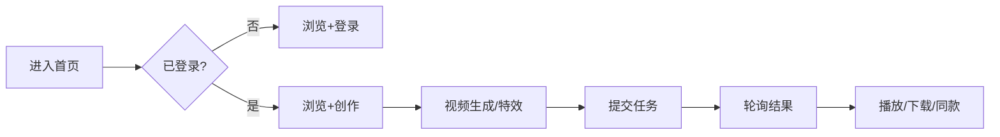

# 需求分析：纳米P视频Web

**创建日期**：2026-06-25  
**存放路径**：`Plans/需求分析/2026-06-25-纳米P视频Web.md`  
**状态**：草稿  
**lifecycle_state**：requirement  
**真理源**：本文件为后续架构 / 开发 / 测试 / 部署的**唯一需求基准**。

> **输入说明**：三份飞书 PRD + 接口文档 + Figma 链接由用户当次提供；Agent 当前会话无法直接读取飞书正文，§二 交集表基于用户硬约束 + Figma fileKey `o4XtLTcw56LUmy7YfjGE4g` 待 WBS#3 MCP 深扫校验。  
> **代码库**：绿field（旧 `pvideo-frontend` 已删除），§十 无现网对照。

---

## 一、PRD 摘要（3–5 句）

纳米 P 视频 Web（龙虾口喷专用）是 AI 视频创作工作台：用户在**首页**浏览运营位与灵感中心并一键同款；在**视频生成页**通过参考素材/首尾帧 + 提示词 + 模型参数提交任务，右侧查看任务进度与结果；在**特效玩法**通过模板化素材区完成特效类生成。会员体系含积分消耗、头像菜单、水印设置。范围硬约束：**仅实现 PRD 与设计稿交集**；接口文档用于联调阶段 Repository 契约，不扩大 PRD 范围。

---

## 二、范围与交集矩阵（需求 × 设计稿）

> 剔除规则：设计稿有 · 需求无 → **不开发**；需求有 · 设计稿无独立 frame → **标 P0 待确认或剔除**。

### 2.1 保留（初判 ✅，待 Figma MCP 复核 node-id）

| 模块 | 需求 PRD | Figma（待 WBS#3 绑 node） | 决策 |
|------|---------|---------------------------|------|
| 首页 · 导航/Banner/创意工具箱/灵感中心/骨架/未登录/已登录 | 首页 PRD | 首页相关 frame | ✅ 保留 |
| 头像下拉 · 积分明细 · AI 水印设置 · 退出确认 | 首页 PRD | 已登录头像弹窗系列 | ✅ 保留 |
| 灵感中心 · 瀑布流/分组横滑/内容卡片/一键同款 | 首页 PRD | 灵感中心 frame | ✅ 保留 |
| 视频生成 · 参考生视频（参数/模型/@引用/素材条/播放器/任务三态） | 生视频 PRD | 有提示词 · API 生图生视频 | ✅ 保留 |
| 视频生成 · 首尾帧 | 生视频 PRD | 同上（首帧/尾帧分支） | ✅ 保留 |
| 视频生成 · 右栏任务（生成中/成功/失败/重试/重编辑/删除确认） | 生视频 PRD | 含于有提示词 frame | ✅ 保留 |
| 特效 · 自由上传型素材区 | 特效 PRD | 无提示词 · 特效玩法 | ✅ 保留 |
| 特效 · 占位替换型素材区 | 特效 PRD | 同上 | ✅ 保留 |
| 特效 · 换玩法浮层 + 呼吸灯节流 | 特效 PRD | 右侧浮层 | ✅ 保留 |

### 2.2 剔除（设计稿有 · 需求未给）

| 模块 | 决策 |
|------|------|
| 资产库主体页（列表/骨架/缺省/失败/批量） | ❌ 剔除 |
| 创作工具聚合页 | ❌ 剔除 |
| 预览作品-模型直出（图/视频/特效） | ❌ 剔除 |

### 2.3 待确认（需求有 · 设计稿未单独列 frame）

| 项 | 风险 | 严重度 |
|----|------|--------|
| 任务卡片「待提交」态是否独立 UI | 开发可能合并进生成中 | P1 |
| 登录拦截 Modal / Toast / 通用二次确认 | 依赖组件库 frame，WBS#3 深扫 | P1 |
| 图片生成 / 顶部部分导航项 PRD 是否覆盖 | 设计稿可能有入口但需求未列 | **P0** |

---

## 三、入口与场景矩阵

| 入口/场景 | PRD | 触发条件 | 目标 |
|-----------|-----|----------|------|
| 未登录访问首页 | 首页 | 无 token | 首页未登录态 |
| 已登录首页 | 首页 | 有 token | Banner+工具箱+灵感中心 |
| 顶部/侧栏进视频生成 | 生视频 | 点击「视频生成/创作」 | `/video-gen` 工作台 |
| 灵感一键同款 | 首页+生视频 | 点击同款 | 跳转生视频并预填 |
| 参考生视频提交 | 生视频 | 素材+提示词+参数齐全 | 创建任务 |
| 首尾帧提交 | 生视频 | 首帧+尾帧齐全 | 创建任务 |
| 特效玩法 | 特效 | 选模板+素材满足模板 | 创建特效任务 |
| 积分不足 | 会员+生视频 | 鉴权失败 | 收银台/充值 |

---

## 四、边界情况清单

| # | 边界场景 | 期望行为（待 PRD 确认） | PRD 是否写明 | 严重度 |
|---|----------|-------------------------|--------------|--------|
| B1 | 未登录点击需登录能力 | 登录弹窗拦截 | ☐ | P0 |
| B2 | 首尾帧仅上传一张 | 禁止提交并提示 | ☐ | P0 |
| B3 | 同用户并发任务上限 | 排队或拒绝（接口 doc 待核对） | ☐ | P0 |
| B4 | 失败任务重新生成 | 消耗新积分 | ☐ | P1 |
| B5 | 弱网/轮询超时 | 任务卡展示失败可重试 | ☐ | P1 |
| B6 | 会员专享分辨率/模型 | 引导开通会员 | ☐ | P1 |
| B7 | 换玩法浮层呼吸灯节流 | 防频繁切换 | ☐ | P1 |
| B8 | 灵感中心空态 | 展示空态插画/文案 | ☐ | P2 |

---

## 五、异常流程矩阵

| 触发条件 | 用户可见反馈 | 系统行为 | 可恢复 | PRD 写明 |
|----------|--------------|----------|--------|----------|
| 表单校验失败 | 字段下提示 | 不提交 | 是 | ☐ |
| 积分不足 | Toast + 收银台 | 中断创建 | 是 | ☐ |
| 素材格式/大小不符 | Toast | 拒绝上传 | 是 | ☐ |
| 任务失败 | 卡片失败态+文案 | 可重试/重编辑 | 是 | ☐ |
| 删除任务 | 二次确认 Modal | 软删/硬删待 API | 是 | ☐ |
| 接口 5xx | Toast | 可重试 | 是 | ☐ |

---

## 六、逻辑问题

| # | 类型 | 问题 | 严重度 |
|---|------|------|--------|
| L1 | 范围 | 顶部导航「图片生成/创作工具」等是否在 PRD 范围内 | **P0** |
| L2 | 模式隔离 | 参考生/首尾帧/特效 Tab 草稿是否互不影响 | P1 |
| L3 | 同款回填 | 一键同款覆盖用户已填内容还是合并 | P1 |
| L4 | 任务删除 | 删除后列表与积分是否回滚 | P1 |

---

## 七、交互冲突

| # | 场景 A | 场景 B | 问题 | 建议问产品 |
|---|--------|--------|------|------------|
| I1 | 首页顶部导航 | 工作台左侧导航 | 两套导航并存，高亮规则 | 各路由用哪套 Layout |
| I2 | 灵感中心在首页 | 灵感中心在生视频右栏 | 数据是否同源 | 接口与 Tab 配置是否一致 |
| I3 | 全屏播放器 | 页面内预览 | 何时全屏何时内嵌 | 按设计稿 Variant |

---

## 八、整体需求遗漏

### 用户旅程（初稿）



| 环节 | PRD 是否写明 | 若未写，缺什么 |
|------|--------------|----------------|
| 埋点/统计 | ☐ | 关键转化漏斗字段 |
| 下载/收藏作品 | ☐ | 是否在 v1 范围 |
| 水印设置生效范围 | ☐ | 仅下载还是预览也带 |
| 360 鉴权/会员 SDK | ☐ | 见接口 doc，需与 PRD 对齐 |

---

## 九、验收标准（可测 · 交集功能）

| # | 验收项 | 前置条件 | 操作步骤 | 期望结果 | 优先级 |
|---|--------|----------|----------|----------|--------|
| AC1 | 未登录首页 | 无 token | 打开 `/` | 展示未登录态，与设计稿一致 | P0 |
| AC2 | 已登录首页 | 有效 token | 打开 `/` | Banner+工具箱+灵感中心，导航含积分/头像 | P0 |
| AC3 | 灵感 Tab 切换 | 有云控 Tab 数据 | 切换 Tab | 瀑布流/分组横滑与 Tab layout 一致 | P0 |
| AC4 | 参考生视频提交 | 已登录+积分足够 | 上传素材+提示词+选模型→生成 | 右侧出现任务卡，进入生成中态 | P0 |
| AC5 | 首尾帧校验 | 已登录 | 仅上传首帧点生成 | 按钮不可用或提示需尾帧 | P0 |
| AC6 | 任务成功播放 | 有成功任务 | 点击播放 | 全屏播放器符合设计稿 | P0 |
| AC7 | 任务失败重试 | 有失败任务 | 点重新生成 | 新任务创建，积分按 PRD 扣费 | P1 |
| AC8 | 特效换玩法浮层 | 在特效页 | 打开换玩法 | 浮层+呼吸灯节流符合设计 | P1 |
| AC9 | 积分不足 | 积分<预估 | 点生成 | 拉起收银台/充值，不创建任务 | P0 |
| AC10 | 范围剔除 | — | 访问资产库路由 | 不在 v1 范围，不应有入口或 404 | P0 |

**非功能**：Web 最低宽度 1280px（与设计稿一致）；关键路径接口错误有用户可读文案。

---

## 十、与代码库对照

| PRD 说法 | 代码/现状 | 冲突 |
|----------|-----------|------|
| 全模块 | 绿field，无代码仓 | 无冲突，全新实现 |

---

## 十一、产品决策（Agent 代决 · 2026-06-25）

> 用户授权「直接决定」；遵循硬约束「需求∩设计稿」，冲突时 **剔除**。

| # | 议题 | 决策 |
|---|------|------|
| P0-1 | 顶部/侧栏「图片生成、创作工具、资产库」 | **v1 不开发、不展示入口**（设计稿有、PRD 交集未保留） |
| P0-1b | v1 保留导航 | **首页 · 视频生成 · 灵感中心**；工作台左侧：**首页 · 创作（视频生成）· 用户区** |
| P0-2 | 未登录拦截 | **可浏览**首页与灵感；**需登录**：上传、生成、同款、积分、头像菜单 |
| P0-3 | 并发任务 | **同用户最多 5 个进行中任务**；第 6 个提交 → Toast「任务过多，请稍后再试」 |
| P1-1 | 一键同款 | **覆盖**当前 Tab 草稿（提示词+参数+素材），不合并 |
| P1-2 | 删除任务 | 二次确认后删除；**不退积分**（已消耗） |
| P1-3 | 下载/收藏 | **v1 不做**（PRD 交集未保留独立预览页） |
| P1-4 | 水印设置 | 仅影响 **导出/下载** 成品；预览播放器不带水印 |
| 遗漏 | 埋点 | v1 仅保留关键漏斗：同款点击、生成提交、成功/失败（字段联调阶段对齐） |

---

## 十二、分析结论

| 项 | 结论 |
|----|------|
| 可否进入架构设计 | ✅ **可进入** — `p0_open: 0` |
| 可否进入 Figma 度量（WBS#3） | ✅ 可并行启动 frame 清单 |
| 关联 Epic | `Plans/Epic/2026-06-25-纳米P视频Web.md` |
| 关联架构 plan | `Plans/客户端技术方案/2026-06-25-纳米P视频Web.md`（**已采纳**） |

---

## 续做

```
/resume plan=Plans/需求分析/2026-06-25-纳米P视频Web.md 进度=已采纳，P0 已代决
```

**下一阶段**：`figma-ui` WBS#3 → `task-splitter` WBS#4

## 反馈（skill_run）

```yaml
skill_run:
  skill: full-cycle-assistant
  plan: Plans/Epic/2026-06-25-纳米P视频Web.md
  date: 2026-06-25
  contexts_used:
    - path: Contexts/需求分析/PRD分析检查清单.md
      utility: high
      reason: "按七步扫描逻辑/交互/遗漏"
    - path: Templates/需求分析-带验收标准模板.md
      utility: high
      reason: "需求 plan 结构真理源"
    - path: Contexts/决策/Kit核心原则.md
      utility: high
      reason: "Plans 单轨、禁止代码仓平行 TASKS"
  contexts_missing:
    - "飞书 PRD 全文无法自动拉取，需用户粘贴或导出 Markdown"
```
