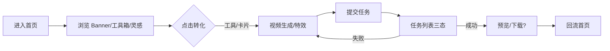

# 需求分析：纳米P视频 Web

**创建日期**：2026-06-25  
**存放路径**：`Plans/需求分析/2026-06-25-纳米P视频Web.md`  
**状态**：已采纳  
**lifecycle_state**：requirement  
**Epic**：`Plans/Epic/2026-06-25-纳米P视频Web.md`

> **范围硬约束**：仅交付 **PRD ∩ Figma** 功能；PRD 有但设计无 → 不开发；设计有但 PRD 无 → 不开发。

## PRD 来源（当次链接，不存档全文）

| 模块 | 链接 |
|------|------|
| 首页 | https://my.feishu.cn/docx/XmLrdC7v6oZQcBx78V9c5iKZn1d |
| 视频生成 | https://my.feishu.cn/docx/JREidKSuuow04GxIBpKcsLbdndb |
| 特效玩法 | https://my.feishu.cn/docx/FSRadZTsjowohOxZet0cbT2yn9d |
| 接口 | https://my.feishu.cn/docx/SFTodXNwWoFPFwxN7ifcNeKgnqh |
| Figma | node-id=2-29517（龙虾口喷专用 Web） |

---

## 一、PRD 摘要（3–5 句）

纳米 P 视频 Web 面向电商/营销/短视频创作者，本期聚焦 **首页流量入口**、**视频生成工作台**（参考生视频 + 首尾帧 + 特效玩法）三大模块。首页自上而下为顶栏、Banner、创意工具箱、灵感中心（分类 Tab + 瀑布流/分组横滑双形态）；未登录可浏览，登录拦截后置到生成/资产库等操作。视频生成页为左右两栏：左栏创作（模式 Tab、素材、提示词 @ 引用、参数胶囊、立即生成），右栏任务列表三态 + 灵感中心 Tab；特效玩法按后台 `type` 分自由上传型与占位替换型，提示词对用户不可见。接口挂在 `/api/pvideo/...`，需 QtUser 鉴权（Q/T Cookie 或 Header）。

---

## 二、范围与入口矩阵

| 入口/场景 | PRD 描述 | 触发条件 | 目标页面 |
|-----------|----------|----------|----------|
| 根 URL / 外链 | 首页四区块独立加载 | 无 | `/` 首页 |
| 主导航 | 首页/视频生成/灵感中心（**剔除**图片生成、创作工具 P0-1） | 点击 | 对应路由 |
| 创意工具箱卡片 | 云控配置工具入口 | 点击 | 各工具页（含视频生成/特效） |
| Banner | 运营位手动横滑 | 点击 | 活动/功能落地页 |
| 灵感中心卡片 | 瀑布流或分组横滑 | 点击 | 直达视频生成/特效（**不做**案例预览页 P0-5） |
| 视频生成主导航 | 工作台 | 已登录部分操作 | `/video`（路径待方案定） |
| 特效玩法 | 视频生成页生成模式 Tab | 选模板 | 同页左栏特效区 |
| 资产库 | PRD 有 | — | **本期不做**（P0-2） |
| 积分/升级 | PRD 有 | — | **本期不做**（P0-2） |

---

## 三、字段与规则清单（节选）

| 字段/规则 | 必填 | 校验/激活 | 默认值 | 疑问 |
|-----------|------|-----------|--------|------|
| 参考素材（图/视/音） | 按模型云控 | 类型/大小/时长上限 | 空态引导 | 云控字段清单未在抓取片段中 |
| 提示词 + @引用 | 按模型 | 字数上限计数器 | 占位文案见 PRD | @ 菜单交互细节在 PRD 后半（未完整抓取） |
| 首尾帧 | 各 1 张图 | 独立标签着色 | 空态 | 与参考生视频草稿隔离 |
| 特效模板 type | 后台下发 | free_upload / slot_replace 分支 | — | 切换模板清空素材 |
| 任务状态 | — | 生成中/成功/失败三态 | — | 轮询间隔 PRD 未写明 |
| 积分余额 | 已登录 | 接口失败展示 `--` | 进入页拉一次 | — |
| 会员态 | 已登录 | 失败用缓存，无缓存按非会员 | 升级 vs 充值文案分支 | — |

---

## 四、边界情况清单

| # | 边界场景 | 期望行为 | PRD 是否写明 | 严重度 |
|---|----------|----------|--------------|--------|
| B1 | 首页首访空数据 | 各区块骨架屏 → 云控内容 | ✅ 骨架屏 | P1 |
| B2 | 未登录触发生成 | 登录弹窗（360 用户中心） | ✅ | P0 |
| B3 | 积分接口失败 | 余额 `--`，胶囊仍可点 | ✅ | P1 |
| B4 | 会员态未知 | 保守非会员，文案「升级」 | ✅ | P1 |
| B5 | 素材超模型上限 | 被动移除 + Toast | ✅ 参考生视频 | P0 |
| B6 | 特效模板配置失败 | Inline 重试 | ✅ 特效 PRD | P1 |
| B7 | 任务失败 | 重新生成 / 重新编辑 | ✅ 视频生成 TL;DR | P0 |
| B8 | 切换生成模式 Tab | 各 Tab 独立草稿，任务列表共用 | ✅ | P1 |
| B9 | 换玩法浮层已开再点 | 呼吸灯提醒，不重复打开 | ✅ 特效 PRD | P1 |
| B10 | 弱网/超时 | **PRD 引用 _global-exception-conventions，全文未抓取** | ☐ | P0 |

---

## 五、异常流程矩阵

| 触发条件 | 用户可见反馈 | 系统行为 | 是否可恢复 | PRD 是否写明 |
|----------|--------------|----------|------------|--------------|
| 素材超限 | Toast | 拒绝上传或移除多余 | 是 | ✅ |
| 登录态过期 | 登录弹窗 | 不主动弹，操作时拦截 | 是 | ✅ 首页顶栏 |
| 特效模板下架 | 业务码 510002 | msg 文案 | 需重选模板 | ✅ 接口文档 |
| 素材数不匹配模板 | 510003 | msg 文案 | 调整素材 | ✅ 接口文档 |
| 任务不存在 | 404 | 列表移除或占位 | 刷新列表 | ✅ 接口文档 |
| 生成中网络断开 | **未写明** | **未写明** | ？ | ☐ P0 |
| 删除任务 | 二次确认 | 调删除接口 | 是 | ✅ 视频生成范围 |

---

## 六、逻辑问题

| # | 类型 | 问题 | PRD 摘录 | 严重度 |
|---|------|------|----------|--------|
| L1 | 导航外延 | 主导航含「图片生成」「创作工具」 | 首页 §3.1.1 | **已闭环** P0-1 不实现 |
| L2 | 外部依赖 | 资产库、会员收银台、计费 | 首页顶栏 | **已闭环** P0-2 不实现 |
| L3 | 案例预览 | 特效场景 4 一键复刻 | 特效 §1 | **已闭环** P0-5 不需要 |
| L4 | 任务去重 | superseded_by 指向旧任务，前端展示规则未完整描述 | 视频生成 TL;DR | P1 |
| L5 | 灵感中心双形态 | 首页瀑布流 vs 分组横滑切换条件（运营配置字段）未在抓取片段 | 首页 TL;DR | P1 |

---

## 七、交互冲突

| # | 场景 A | 场景 B | 问题 | 建议问产品 |
|---|--------|--------|------|------------|
| I1 | 未登录可浏览特效模板 | 点击生成拦截登录 | 浏览态下「换玩法」是否允许未登录切换 | 特效 §准入 vs 视频生成登录拦截 |
| I2 | 视频生成右栏「灵感中心」Tab | 首页/导航「灵感中心」页 | 是否为同一数据源与同一 UI | 需 PRD 或设计稿对照 |
| I3 | 资产库未登录点击 | 弹登录 vs 首页说未登录可浏览全部内容 | 资产库是否算「浏览」 | 首页 §3.1.1 约束 |
| I4 | 参考生视频 @ 引用 | 删除素材自动清标签 | 提示词内残留文本如何处理 | PRD §3.2 后半（未完整抓取） |

---

## 八、整体需求遗漏

### 用户旅程闭环



| 环节 | PRD 是否写明 | 若未写，缺什么 |
|------|--------------|----------------|
| 进入/退出 | 部分 | 各子路由 URL、浏览器后退草稿是否保留 |
| 任务成功后续 | ☐ | 预览/下载/分享是否在 Web 本期范围 |
| 图片生成/创作工具 | ☐ | 导航可点但无 PRD — **应按交集剔除或补 PRD** |
| 接口清单 | ☐ | 飞书接口文档仅抓到通用说明，**缺具体 endpoint 表** |
| 埋点 | 部分 | 特效 PRD 写明要埋点，首页/视频生成字段表未抓取 |
| 云控字段 schema | ☐ | Banner/工具箱/灵感/模型参数下发结构 |
| Figma 范围矩阵 | ☐ | **PRD∩设计稿清单尚未建立（WBS#3）** |

### 遗漏项（需产品补全或明确剔除）

| # | 缺失内容 | 开发若自行猜测的风险 | 严重度 |
|---|----------|---------------------|--------|
| M1 | PRD∩Figma 正式范围表 | — | **已产出** → `Plans/功能开发/2026-06-25-纳米P视频Web-Figma度量表.md` |
| M2 | API endpoint 表 | 联调返工 | **已索引** → `Plans/功能开发/2026-06-25-纳米P视频Web-接口索引.md` + 飞书链接 |
| M3 | 图片生成、创作工具 | — | **剔除** P0-1 |
| M4 | 资产库/会员/计费 | — | **剔除** P0-2 |
| M5 | 任务轮询策略与超时 | 列表状态卡住 | P1 |
| M6 | 案例预览/一键复刻 | — | **剔除** P0-5 |

---

## 九、验收标准（可测，基于已读 PRD）

| # | 验收项 | 前置条件 | 操作步骤 | 期望结果 | 优先级 |
|---|--------|----------|----------|----------|--------|
| AC1 | 首页四区块展示 | 云控有数据 | 打开根 URL | 顶栏+Banner+工具箱+灵感按 PRD 分区；骨架屏→内容 | P0 |
| AC2 | 未登录浏览 | 未登录 | 滚动首页 | 不弹登录；内容可见 | P0 |
| AC3 | 生成登录拦截 | 未登录 | 从首页进入生成并点「立即生成」 | 唤起 360 登录 | P0 |
| AC4 | 参考生视频提交 | 已登录+素材合规 | 上传素材、写提示词、点生成 | 右栏出现生成中卡片 | P0 |
| AC5 | 首尾帧模式 | 已登录 | 切 Tab、上传首尾帧、生成 | 胶囊含蓝「首帧」白「尾帧」标签 | P0 |
| AC6 | 特效类型一 | 已登录+free_upload 模板 | 填满占位格、生成 | 不展示提示词；任务提交成功 | P0 |
| AC7 | 特效类型二 | slot_replace 模板 | 仅替换可替换位 | 不可新增格；提交成功 | P0 |
| AC8 | 任务失败恢复 | 有失败任务 | 点重新生成/重新编辑 | 行为符合 PRD；列表去重 | P0 |
| AC9 | 换玩法浮层 | 特效页 | 打开浮层后再点按钮 | 呼吸灯，不叠两层浮层 | P1 |
| AC10 | PRD∩Figma | 度量表完成 | 设计走查 | 无「仅 PRD」或「仅设计」的擅自实现 | P0 |

**非功能**：Web 桌面端为主（Figma 龙虾口喷专用）；性能/兼容待方案补充。

---

## 十、与代码库对照

| PRD 说法 | 代码/现状 | 冲突 |
|----------|-----------|------|
| pkg/pvideo 后端已存在 | 前端仓 `/Users/wanglongxiang/git/pvideo-frontend`（空仓待脚手架） | 无冲突 |
| QtUser Q/T 鉴权 | 待对照现有 Web 项目登录封装 | 待查 |

---

## 十一、P0 确认记录（2026-06-25）

| 编号 | 结论 |
|------|------|
| P0-1 | **不实现** 图片生成、创作工具 |
| P0-2 | **不实现** 资产库、积分、会员/充值 |
| P0-3 | **需要** → 已产出 `Plans/功能开发/2026-06-25-纳米P视频Web-Figma度量表.md` |
| P0-4 | 接口真理源：https://my.feishu.cn/docx/SFTodXNwWoFPFwxN7ifcNeKgnqh → 索引 `Plans/功能开发/2026-06-25-纳米P视频Web-接口索引.md` |
| P0-5 | **不需要** 案例预览页 / 一键复刻 |

**待 P1（不阻塞架构）** · 任务成功后预览/下载；灵感中心独立路由 vs 嵌入；云控 schema。

---

## 十二、分析结论

| 项 | 结论 |
|----|------|
| 可否进入架构设计 | ✅ — `p0_open=0` |
| 关联架构 plan | `Plans/客户端技术方案/2026-06-25-纳米P视频Web.md`（待创建） |
| 代码仓 | `/Users/wanglongxiang/git/pvideo-frontend` |
| 下一步 | `architecture-design-assistant` + 飞书接口文档补全 endpoint 表 |

---

## 续做

```
/resume plan=Plans/需求分析/2026-06-25-纳米P视频Web.md 进度=P0 已闭环，待架构方案
```

**下一阶段 Skill**：`architecture-design-assistant`（P0=0 且需求 `status: 已采纳` 后）

---

## 反馈（skill_run）

```yaml
skill_run:
  skill: requirement-analyst
  plan: Plans/需求分析/2026-06-25-纳米P视频Web.md
  date: 2026-06-25
  contexts_used:
    - path: Contexts/需求分析/PRD分析检查清单.md
      utility: high
      reason: "七步分析对照逻辑/交互/遗漏三类扫描"
    - path: Templates/需求分析-带验收标准模板.md
      utility: high
      reason: "五块输出与 AC 表结构"
    - path: Contexts/Figma/Figma-MCP配置.md
      utility: high
      reason: "Figma REST 读节点建 PRD∩设计稿矩阵"
  contexts_missing:
    - "纳米P视频 Web 云控字段对照表"
  contexts_stale: []
```
