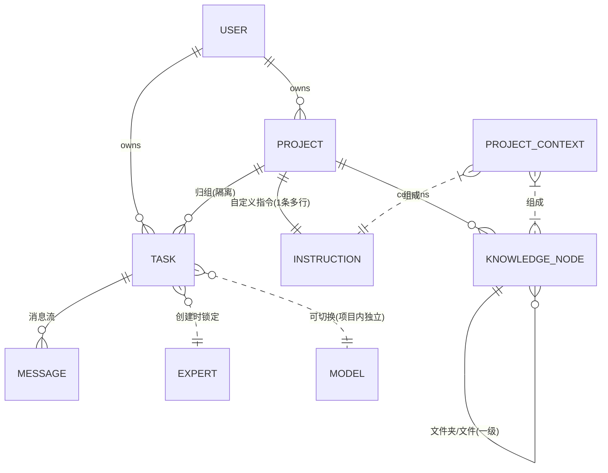
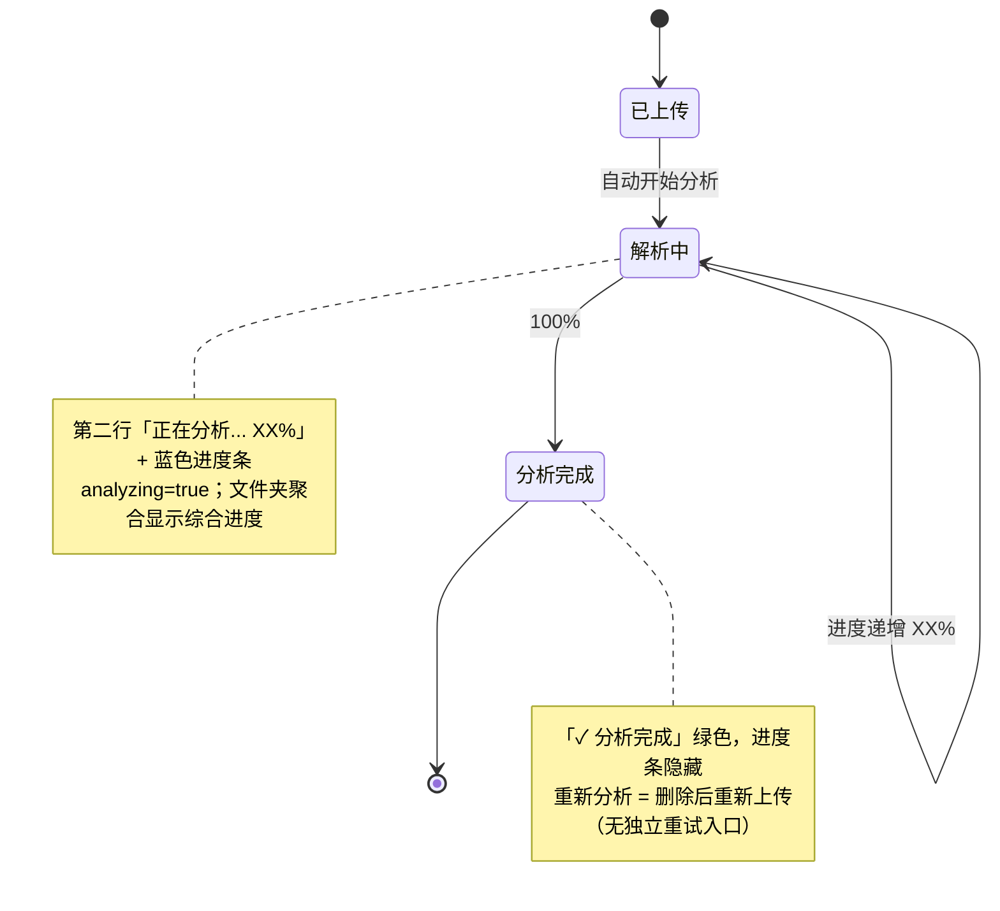
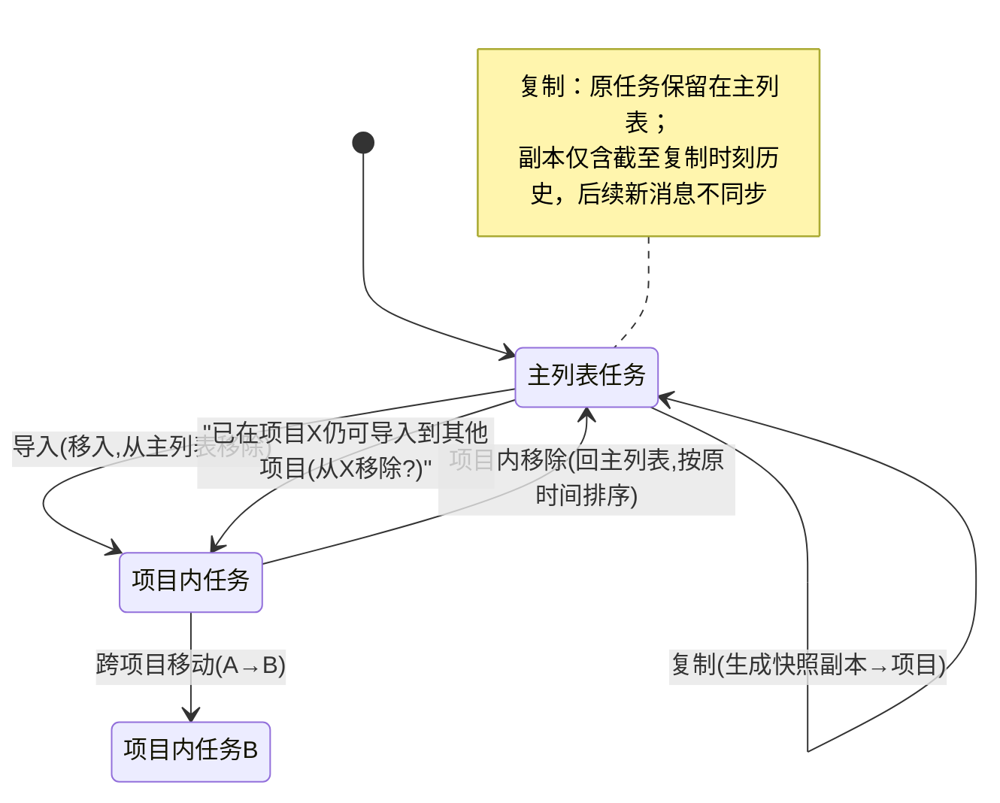
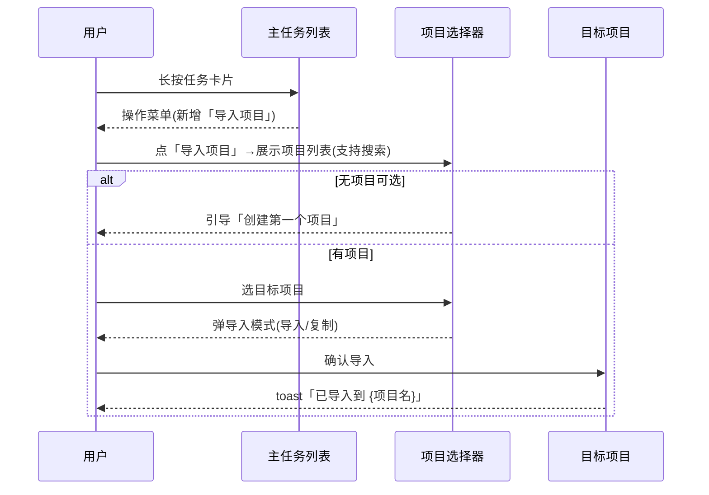

# 需求分析：纳米Work-项目功能

**创建日期**：2026-06-27  
**存放路径**：`Plans/需求分析/2026-06-27-纳米Work-项目功能.md`  
**状态**：草稿（待产品确认 6 个 P0）  
**lifecycle_state**：requirement  
**真理源**：本文件为后续架构 / 开发 / 测试 / 部署的唯一需求基准。  
**Epic**：[[Plans/Epic/2026-06-27-纳米Work-项目功能]]

---

## 〇、战略层（Why）

- **痛点**：当前所有对话混排在首页任务列表，无法按工作主题归组；缺少项目级上下文（自定义指令 + 知识文件），用户每次都要重复交代背景；知识文件只能放云盘，与具体工作脱节。
- **目标**：在底部新增「项目」Tab，让用户能把对话、文件、指令围绕一个持续性的工作主题集中管理，形成独立语境。对标 ChatGPT Projects，并在「文件上传即分析、行内进度」上做差异化。
- **用户故事**：作为纳米Work 的重度用户，我想要把某个长期工作的对话、参考文件、固定指令归到一个项目里，以便每次进入项目就自动带上语境、不必重复交代背景。

---

## 一、PRD 摘要（3–5 句）

1. 底部 Tab 从 5 个扩为 6 个，新增「项目」，位于专家与云盘之间。
2. 项目 = 自定义指令 + 项目知识（文件索引）构成的独立语境；项目内任务与首页主列表隔离，可跨项目移动。
3. 项目知识支持上传文件即分析（行内 % 进度）、一级文件夹、文件夹聚合进度；知识仅项目内可见，不进云盘。
4. 首次进入自动创建默认项目「我的项目」；项目可改名/改 icon/删除。
5. 正常任务列表的任务可「导入项目」，分「导入」（移入）与「复制」（留存当前快照）两种模式。

---

## 一·五、范围层（What）

| 包含功能                                 | 优先级 |
| ------------------------------------ | --- |
| 底部新增「项目」Tab（位于专家后、云盘前）               | P0  |
| 项目列表页（卡片、空态、新建、下拉刷新）                 | P0  |
| 创建项目（名称+icon颜色+图标选择器）                | P0  |
| 项目详情页 — 对话 Tab（任务列表、底部发起、长按移除）       | P0  |
| 项目内任务页（消息流、项目上下文生效、模型选择独立）           | P0  |
| 项目详情页 — 知识 Tab（文件/文件夹、筛选排序、面包屑、长按操作） | P0  |
| 知识添加面板（上传文件/创建文件夹/创建文件 md）           | P0  |
| 文件分析状态机（解析中%/完成、文件夹聚合进度）             | P0  |
| 项目设置页（改名/改icon/自定义指令/删除+二次确认）        | P0  |
| 项目级上下文规则（指令+知识，仅新消息生效，不回刷历史）         | P0  |
| 对话导入项目（导入/复制双模式 + 项目内移除）             | P0  |
| 二级页路由覆盖底部导航规则                        | P1  |

**明确不做**（PRD §六）：项目内任务搜索 · 项目模板/预设 · 项目协作（多人共享）· 项目归档 · 项目内任务批量操作 · 项目与云盘联动（从云盘拉文件到项目知识）。

> ⚠️ 矛盾点：§六排除「项目内任务批量操作」，但 §3.3 任务长按弹窗写了「批量编辑」。见 L1。

---

## 一·六、业务逻辑图（四步法）

**① 实体关系（ER 图）**



**② 状态机 — 知识文件分析（PRD §2.4 / §3.7）**



> ⚠️ 状态机缺口：PRD 未定义「解析失败 / 超时 / 不支持的文件」态。见 M1。

**② 状态机 — 任务归属（导入/复制/移除）**



> ⚠️ §7.1 说「任务已在一个项目中→仍可导入到其他项目（从原项目移除）」，但 §2.3 又说「任务可跨项目移动」——两者是同一操作还是两条路径？见 L2。

**③ 主流程（导入项目时序）**



---

## 二、范围与入口矩阵

| 入口/场景 | PRD 描述 | 触发条件 | 目标页面 | 覆盖底部导航 |
|-----------|----------|----------|----------|--------------|
| 项目 Tab | 底部第 4 个 Tab | 点击 Tab | 项目列表页 | 否 |
| 新建项目 | 顶部「+」/空态按钮 | 点击 | 创建项目半屏弹窗 | — |
| 进入项目 | 点击项目卡片 | 点击卡片主体 | 项目详情(对话Tab) | 是 |
| 项目设置 | 卡片左侧编辑 / 详情页顶部项目名 | 点击 | 项目设置页 | 是 |
| 发起/进入任务 | 底部输入发送 / 点任务卡片 | 发送或点击 | 项目内任务页 | 是 |
| 知识管理 | 详情页「知识」Tab | 切 Tab | 知识列表 | （在详情内） |
| 添加知识 | 右上「+」 | 点击 | 知识添加面板 BottomSheet | — |
| 导入项目 | 主列表任务长按 | 长按→菜单 | 项目选择器 BottomSheet | — |

> ⚠️ 入口冲突：§3.1 卡片左侧编辑按钮→「项目编辑页」，§3.9 又说项目设置入口是「详情页点击…/项目名」。是两个入口都进设置页，还是「编辑页」≠「设置页」？见 I1。

---

## 三、数据字典 / 字段规则

| 字段      | 类型         | 必填  | 长度/范围       | 默认值         | 来源   | 校验/激活              | 疑问                  |
| ------- | ---------- | --- | ----------- | ----------- | ---- | ------------------ | ------------------- |
| 项目名称    | string     | 是   | ≤30 字符，超出截断 | 无           | 用户输入 | 非空→「创建」可点          | 截断是输入即截断还是展示截断？     |
| 项目 icon | enum/emoji | 否   | —           | 系统默认        | 选择器  | 创建时默认展开            | 默认 icon 是什么？        |
| icon 颜色 | enum       | 否   | —           | 系统默认        | 选择器  | —                  | 颜色与 emoji 是组合还是二选一？ |
| 自定义指令   | text       | 否   | ≤2000 字符    | 空           | 用户输入 | 保存后生效              | 超 2000 截断还是禁止输入？    |
| 对话数 N   | int        | —   | ≥0          | 0           | 系统统计 | 卡片展示「N个对话」         | 含复制副本？含已移除？         |
| 文件数 M   | int        | —   | ≥0          | 0           | 系统统计 | 卡片展示「M个文件」         | 含文件夹？含分析中？          |
| 文件分析进度  | int%       | —   | 0–100       | —           | 后端推送 | analyzing=true 时显示 | 进度来源/刷新频率未定义        |
| 默认项目    | bool       | —   | —           | 首次自动建「我的项目」 | 系统   | 可改名可删              | 删光后再进 Tab 是否再次自动创建？ |

---

## 四、边界情况清单（必填）

| #   | 边界场景          | 期望行为                   | PRD 是否写明     | 严重度 |
| --- | ------------- | ---------------------- | ------------ | --- |
| B1  | 首次进入项目 Tab    | 自动创建「我的项目」             | ☑ §2.5       | P0  |
| B2  | 删光所有项目后再进 Tab | 是否再次自动创建默认项目？          | ☐ 未写         | P0  |
| B3  | 项目内无任务        | 任务Tab空态「在下方输入框发起第一个任务」 | ☑ §四         | P1  |
| B4  | 项目内无知识        | 知识Tab空态引导上传            | ☑ §四         | P1  |
| B5  | 导入时无项目可选      | 引导「创建第一个项目」            | ☑ §7.2       | P1  |
| B6  | 项目名超 30 字符    | 截断                     | ☑ §四（截断时机未明） | P1  |
| B7  | 自定义指令超 2000   | PRD 仅写「限制 2000」，未写超出行为 | ☐ 部分         | P1  |
| B8  | 文件夹内上传        | 归到该文件夹下                | ☑ §四         | P1  |
| B9  | 大量文件/项目       | 列表分页/虚拟滚动？             | ☐ 未写（文件数量不限） | P1  |
| B10 | 删除项目时项目内有任务   | 二次确认提示可先移出任务           | ☑ §四/§3.8    | P0  |
| B11 | 同一任务复制到多个项目   | 允许，各副本独立               | ☑ §7.2       | P1  |
| B12 | 文件分析中切走/退出项目  | 分析是否继续？回来进度是否保留？       | ☐ 未写         | P0  |

---

## 五、异常流程矩阵（必填）

| 触发条件 | 用户可见反馈 | 系统行为 | 是否可恢复 | PRD 是否写明 |
|----------|--------------|----------|------------|--------------|
| 创建项目名为空 | 「创建」按钮置灰不可点 | 阻止提交 | 是 | ☑ §3.2 |
| 创建项目失败 | toast「项目创建失败」 | 不跳转 | 是(重试) | ☑ §3.2 |
| 网络异常(创建/上传) | toast「操作失败，请重试」 | 中断当前操作 | 是 | ☑ §四 |
| 文件解析失败/超时 | ？ | ？（仅写删除后重传） | 仅删后重传 | ☐ 未写 |
| 不支持的文件类型 | ？ | PRD 说「所有文件」支持 | — | ☐ 隐含全支持 |
| 删除项目确认 | 二次确认弹窗+toast「项目已删除」 | 删除全部任务和知识 | 否(永久) | ☑ §3.8 |
| 项目内移除任务 | 二次确认「移除后对话回到任务列表」+toast | 任务回主列表 | 是 | ☑ §7.2 |

---

## 六、逻辑问题（写了，但有问题）

| #   | 类型         | 问题                                                                             | PRD 摘录                       | 严重度 |
| --- | ---------- | ------------------------------------------------------------------------------ | ---------------------------- | --- |
| L1  | 范围互斥       | §六排除「项目内任务批量操作」，§3.3 任务长按弹窗却含「批量编辑」                                            | §六 vs §3.3「从当前项目中移除、批量编辑、删除」 | P0  |
| L2  | 操作语义重叠     | 「跨项目移动(A→B)」(§2.3) 与「已在项目仍可导入到其他项目(从原项目移除)」(§7.1) 是否同一操作？入口/交互不同               | §2.3 / §7.1                  | P0  |
| L3  | 复制副本计数     | 复制产生的副本是否计入目标项目卡片「N个对话」？是否计入原列表？                                               | §7.1 复制 / §3.1 卡片字段          | P1  |
| L4  | 专家锁定 vs 默认 | 任务页「专家由创建时锁定，不提供切换」(§3.4)，但对话Tab底部「专家选择胶囊，默认选中纳米AI助手」(§3.3)——复制/导入进来的任务专家如何显示？ | §3.3 / §3.4                  | P1  |
| L5  | 模型选择隔离     | 「项目内模型选择不影响主应用」(§3.4)，但项目内不同任务间是否共享模型选择？任务页又有模型选择器                             | §3.4 / §3.3                  | P1  |

---

## 七、交互冲突（写了，但互相打架）

| #   | 场景 A                     | 场景 B               | 问题                                      | 建议问产品               |
| --- | ------------------------ | ------------------ | --------------------------------------- | ------------------- |
| I1  | §3.1 卡片左编辑→「项目编辑页」       | §3.9 设置入口=详情页…/项目名 | 「编辑页」与「设置页」是同一页吗？两个入口指向是否一致             | 统一为「项目设置页」，明确两入口都进它 |
| I2  | §3.1 空态按钮文案「创建第项目」(疑似漏字) | §3.2 创建弹窗          | 空态按钮文案缺字，应为「创建第一个项目」                    | 确认文案                |
| I3  | §3.3 长按弹窗「从项目移除」         | §7.2 项目内「左滑移除」     | 移除是长按弹窗还是左滑？两处不一致                       | 统一移除手势              |
| I4  | §3.6 创建文件「和用户上传创建md一致」   | §3.6 上传文件          | 「创建文件」=新建 md 编辑器，与「上传文件」是两条独立入口，但文案表述含混 | 明确创建文件=进入md编辑器后保存   |

---

## 八、整体需求遗漏（没写，但应该有）⭐

### 用户旅程闭环


| # | 遗漏维度 | PRD 覆盖 | 缺失内容 | 不补的风险 | 严重度 |
|---|----------|----------|----------|------------|--------|
| M1 | 文件分析异常态 | 未写 | 解析失败/超时/不支持文件的 UI 与行为；进度卡住如何处理 | 开发自行猜测，失败态无反馈 | P0 |
| M2 | 分析进度数据来源 | 未写 | 进度由前端模拟还是后端轮询/推送？刷新频率？退出再进是否续传 | 行内实时进度无法实现一致 | P0 |
| M3 | API/接口清单 | 未写 | 项目 CRUD、任务移动/复制、文件上传/分析/删除、指令保存各接口与错误码 | 无契约无法联调 | P0（转架构阶段） |
| M4 | 默认项目重建规则 | 未写 | 删光项目后再进 Tab 是否再次自动建「我的项目」(B2) | 空态行为不定 | P0 |
| M5 | 上下文长度与裁剪 | 未写 | 项目知识很多/很大时，发新消息如何组织进上下文？是否有 token 上限与裁剪策略 | 大项目下回答质量/性能不可控 | P1 |
| M6 | 埋点 | 未写 | 创建/进入项目、导入复制、上传分析等关键行为埋点 | 无法度量功能效果 | P1 |
| M7 | 文件夹层级 | 部分 | PRD 写「一级文件夹」，是否禁止文件夹嵌套？移动时目标范围 | 层级歧义 | P1 |
| M8 | 列表性能 | 未写 | 文件数量不限+无分页说明；项目/任务列表上限 | 大数据量卡顿 | P1 |

---

## 九、验收标准（必填，可测）

| # | 验收项 | Given（前置） | When（操作） | Then（期望） | 优先级 |
|---|--------|---------------|--------------|--------------|--------|
| AC1 | 底部 Tab 新增项目 | 已登录用户 | 进入 App 看底部栏 | 显示 6 个 Tab，顺序 首页/任务/专家/项目/云盘/我的 | P0 |
| AC2 | 首次自动建默认项目 | 用户从未进过项目 Tab | 首次点击项目 Tab | 自动出现 1 个「我的项目」，可改名可删 | P0 |
| AC3 | 创建项目按钮激活 | 在创建弹窗 | 名称输入框为空 | 「创建」按钮不可点；输入非空后可点 | P0 |
| AC4 | 创建成功跳转 | 名称已填 | 点「创建」成功 | 关闭弹窗并跳转新项目详情页 | P0 |
| AC5 | 项目内任务隔离 | 项目A内有任务T | 回首页任务列表 | T 不出现在首页列表 | P0 |
| AC6 | 上下文仅新消息生效 | 项目设了自定义指令+知识 | 在任务页发新消息 | 新回答带上下文；已生成的历史回答不回刷重跑 | P0 |
| AC7 | 知识变更不回刷 | 任务已有历史回答 | 增/删项目知识 | 仅影响后续新消息，历史回答不变 | P0 |
| AC8 | 文件上传即分析 | 在知识Tab | 上传一个文件 | 文件即时入列，第二行「正在分析... XX%」+蓝色进度条 | P0 |
| AC9 | 分析完成态 | 文件分析中 | 进度到 100% | 进度条隐藏，显示绿色「✓ 分析完成」 | P0 |
| AC10 | 文件夹聚合进度 | 文件夹内有分析中文件 | 查看文件夹卡片 | 蓝色边框+「正在分析中... XX%」综合进度 | P1 |
| AC11 | 导入(移入)模式 | 主列表任务T | 长按→导入项目→选项目→选「导入」→确认 | T 移入目标项目，从主列表消失，toast「已导入到 {项目名}」 | P0 |
| AC12 | 复制模式 | 主列表任务T | 长按→导入项目→选「复制」→确认 | 生成截至当前历史的副本入项目；原T仍在主列表；后续T新消息不同步副本 | P0 |
| AC13 | 项目内移除回列表 | 项目内任务T2 | 项目内移除→二次确认→确认 | T2 回主列表，按原时间排序，toast「已从项目移除」 | P0 |
| AC14 | 删除项目二次确认 | 项目内有任务/知识 | 设置页点「删除项目」 | 弹二次确认，含「永久删除所有任务和知识」提示；确认后返列表+toast | P0 |
| AC15 | 模型选择隔离 | 主应用选了模型M1 | 项目内任务选模型M2 | 项目内选 M2 不改主应用 M1，反之亦然 | P1 |
| AC16 | 二级页覆盖导航 | 在项目列表 | 进入项目详情/任务/设置 | 全屏覆盖底部 Tab 栏；返回时恢复 | P1 |
| **AC1-反** | Tab 不重复 | — | 进入 App | 不出现 7 个或旧 5 个 Tab，专家与云盘之间仅一个项目 Tab | P0 |
| **AC6-反** | 历史不重跑 | 项目已有历史回答 | 改指令后未发新消息 | 历史回答内容保持不变，不触发任何重新生成 | P0 |
| **AC12-反** | 复制不联动 | 已复制副本 | 原任务继续追加新消息 | 副本不出现这些新消息 | P0 |

**非功能验收**：性能——文件分析行内异步，不阻塞列表浏览/继续上传（§3.7）；列表上限/分页待 M8 补。

---

## 十、待产品确认（Push 产品清单）

> 按「逻辑 · 交互 · 遗漏」三块归类。**P0 共 6 条，须闭环后方可进入架构/开发**。

**【逻辑问题】**
- **P0-L1**：「批量编辑/批量操作」到底做不做？§六排除、§3.3 又写。建议：本期不做，删除 §3.3 的「批量编辑」。
- **P0-L2**：「跨项目移动」与「已在项目→导入到其他项目」是同一能力还是两条路径？建议统一为一套「移动/导入」语义并明确入口。

**【交互冲突】**
- **P1-I1**：「项目编辑页」与「项目设置页」是否同一页？建议统一为设置页。
- **P1-I3**：移除任务用长按弹窗还是左滑？建议二选一统一。

**【需求遗漏】**
- **P0-M1**：文件分析的失败/超时/不支持类型的 UI 与行为（目前只有「删除后重传」）。
- **P0-M2**：分析进度的数据来源与机制（前端模拟 vs 后端推送、退出再进是否续传）。
- **P0-M4**：删光所有项目后再进 Tab 是否再次自动创建默认项目。
- **P0-M3**：完整 API 契约与错误码（项目/任务/文件/指令）——可在架构阶段细化，但需求侧需产品确认范围。

---

## 十一、分析结论

| 项 | 结论 |
|----|------|
| 可否进入架构设计 | ⚠️ 有条件——6 个 P0（L1/L2/M1/M2/M3/M4）须先与产品确认闭环 |
| p0_open | 6 |
| 关联架构 plan | [ ] `Plans/客户端技术方案/2026-06-27-纳米Work-项目功能.md` |

> 门禁：`p0_open=6 > 0`，按 Epic 阶段门禁**不得进入 development**。需求 `status` 须经产品确认后置「已采纳」并将 `p0_open` 归 0。

---

## 续做

```
/resume plan=Plans/需求分析/2026-06-27-纳米Work-项目功能.md 进度=待产品确认6个P0
```

**下一阶段 Skill**：产品确认 P0 后 → `/architecture-design-assistant`，引用本 plan。

---

## 反馈（skill_run）

```yaml
skill_run:
  skill: requirement-analyst
  plan: Plans/需求分析/2026-06-27-纳米Work-项目功能.md
  date: 2026-06-27
  contexts_used:
    - path: Contexts/需求分析/需求分析规范.md
      utility: high
      reason: "按三层面+五手段+四步法组织分析结构"
    - path: Contexts/需求分析/PRD分析检查清单.md
      utility: high
      reason: "对照§3.1-3.6遗漏类别系统性扫M1-M8"
    - path: Templates/需求分析-带验收标准模板.md
      utility: high
      reason: "套用边界/异常/AC五块输出骨架"
    - path: Contexts/需求分析/业务逻辑梳理与图表.md
      utility: not-needed
  outcome: "产出需求plan；识别6个P0(2逻辑+4遗漏)阻塞，p0_open=6，未达进入开发条件"
```
