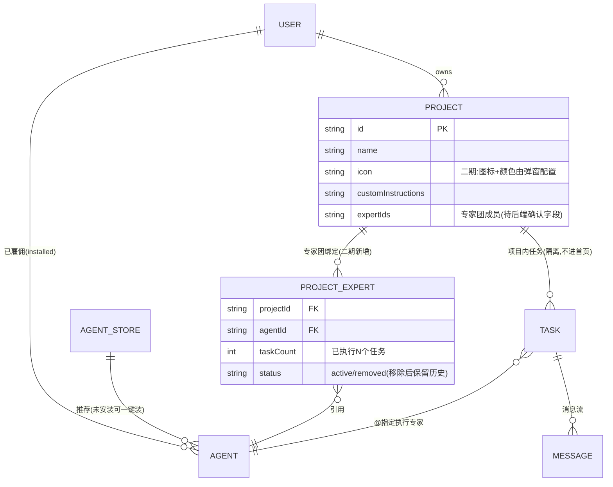
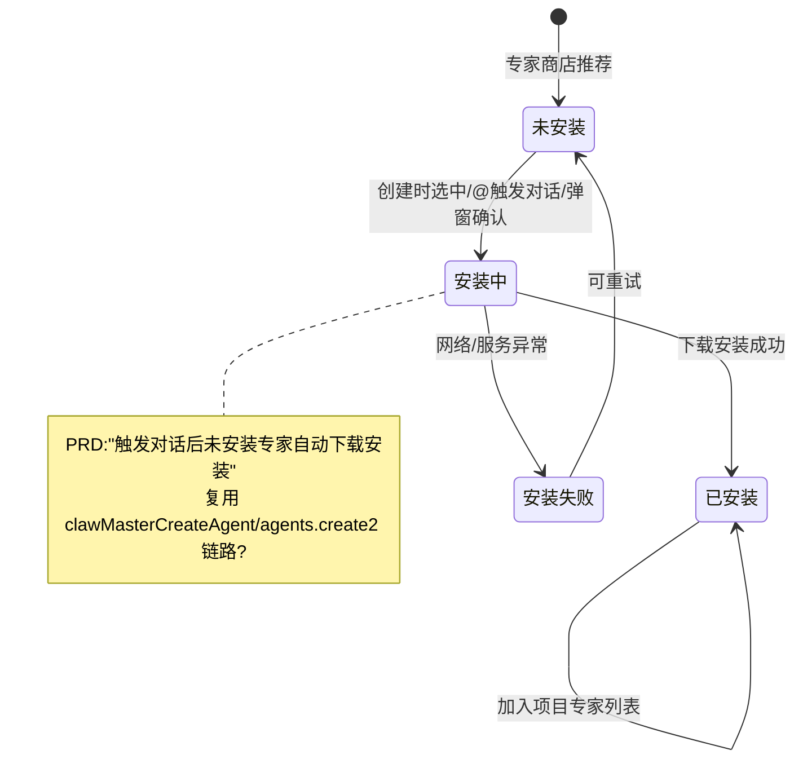
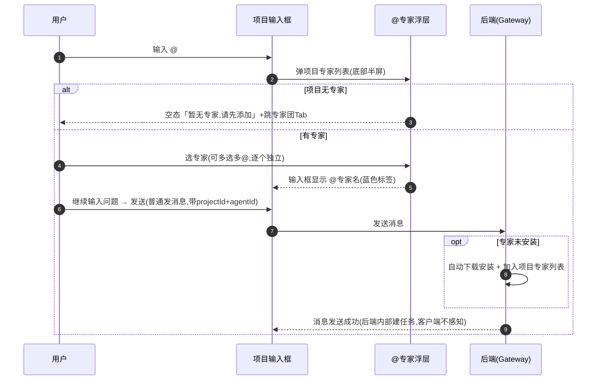
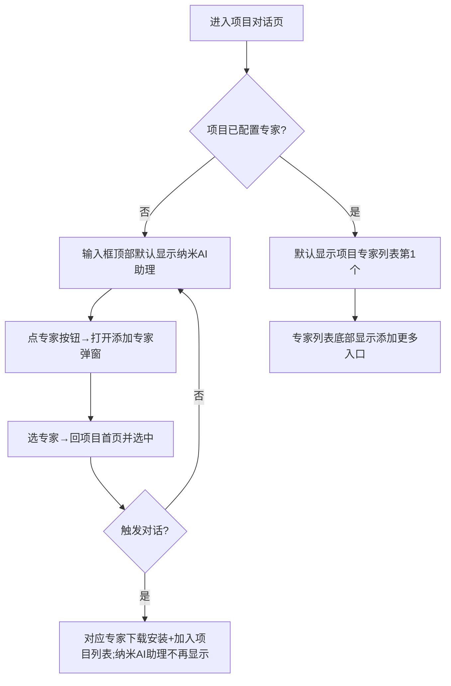

# 需求分析：纳米Work-项目二期（项目内专家团）

**创建日期**：2026-06-29  
**存放路径**：`Plans/需求分析/2026-06-29-纳米Work-项目二期-项目内专家团.md`  
**状态**：进行中（7 个 P0 已产品确认闭环，p0_open=0）  
**lifecycle_state**：requirement  
**真理源**：本文件为二期后续架构 / 开发 / 测试 / 部署的唯一需求基准。  
**Epic**：[[Plans/Epic/2026-06-29-纳米Work-项目二期-项目内专家团]]  
**版本**：v1.2.0（一期 v1.1.0 的延续，复用一期项目 Tab / 创建链路 / @ 组件）

> 一期需求基准见 [[Plans/需求分析/2026-06-27-纳米Work-项目功能]]。本文件只覆盖**二期新增/变更**，一期已采纳能力不重述。

---

## 〇·关键澄清（2026-06-29 产品确认，优先级最高）

> **「项目专家团」≠ 聊天里的「专家团（Swarm）」，两者无任何关系。**
>
> - 项目里的「专家团」本质只是**给该项目挂一份可 @ 的专家（Agent）名单**——在项目里加了几个专家，目的就是让项目输入框能 @ 到他们。
> - **不走** Swarm 的 PM/Worker 多专家并行协作机制（`NMSwarmTaskStateProvider` / `NMClawSwarmViewController` 那套与本需求无关）。
> - 项目内 @ 专家 = 在当前项目语境下，用所选专家（Agent）发起一次普通的单专家对话/任务，复用一期已有的项目内对话链路（`NMProjectsService` 发起对话已带 `projectId`+`agentId`）。
>
> 据此本文档相关条目已修正：~~L1/M2（多专家并行→Swarm）作废~~；多 @ 语义简化为「逐个指定专家、各自独立任务」，详见 §六 L1。

---

## 〇、战略层（Why）

- **痛点**：一期项目只是「对话+知识+指令」的容器，用户进项目后仍要手动选/找专家、手动发起对话；专家与项目割裂，无法围绕一个项目沉淀一份常用专家名单。
- **目标**：让项目挂一份专家名单——创建项目时即可选专家，项目内可直接 @ 这些专家发起对话/任务，不必每次重新挑选专家或离开项目。**专家团仅是项目维度的可 @ 名单，不是多专家协作。**
- **用户故事**：作为纳米Work 项目用户，我想要在项目里配置一份常用专家名单，以便在项目语境内直接 @ 指定专家发起对话，而不必每次重新挑选专家。

---

## 一、PRD 摘要（3–5 句）

1. 创建项目流程新增「选择专家成员」步骤：命名+自定义指令（一期已有）→ 选专家 → 创建；专家可多选、不限数量、非必选（D1）。
2. 项目详情页新增「专家团」Tab（现有 任务/知识 → 任务/知识/专家团），支持增（+ 进选择器）删（长按→移除+二次确认）专家（D2）。
3. 项目输入框输入 @ → 弹项目专家浮层 → 选专家（输入框显示 @标签）→ 输入问题 → 发送 → 自动创建归属当前项目的任务并指定专家执行；同一消息可多 @；任务不进首页任务列表（D3/S3）。
4. 项目输入框文案改为「输入问题」（D4）；项目图标配置从设置页移到弹窗，入口为项目名称输入框左侧图标（D5）。
5. 服务端：提供「已雇佣专家+专家商店推荐」数据、落库项目↔专家团绑定、@ 建任务、新增推荐项目名/图标云控 `assistant_work_app_base_set.project_recommendation_info`（S1–S4）。

---

## 一·五、范围层（What）

| 包含功能 | PRD 编号 | 优先级 | 复用一期资产 |
|----------|---------|--------|--------------|
| 创建项目页新增「专家选择」区（专家卡片列表+已选计数+添加更多弹窗） | D1 / 3.1 | P0 | 一期创建流程 `NMProjectsService.createProject` |
| 添加专家弹窗（多 Tab：我的专家 / 专家商店推荐，搜索，从商店选中即安装） | D1 / 3.3 | P0 | `GatewayAgentStore.installedAgents`、`NMClawHubRequestHandler` 推荐 |
| 项目详情页「专家团」Tab（专家卡片：头像+名称+简介+任务数；空态；点击进对话） | D2 / 3.2 | P0 | `NMProjectDetailSegmentView`（现 2 Tab→3 Tab） |
| 专家团增删（+ 进选择器；长按→红色「移除」+二次确认；不限上限） | D2 / 3.2 | P0 | — 新增 |
| 项目内 @ 专家建任务（@ 浮层取项目专家；多 @；@标签蓝色高亮可删） | D3 / 3.4 | P0 | `NMMentionExpertPopupController`（agentsProvider 可注入项目专家） |
| 项目输入框顶部专家选择（默认项目首位专家 / 无专家则纳米AI助理；可加更多） | D3 / 3.5 | P0 | `NMProjectDetailInputBarView` agentChip（现单选） |
| 输入框文案改「输入问题」 | D4 | P0 | `NMProjectDetailInputBarView` placeholder |
| 项目图标移入独立弹窗（入口=名称框左侧图标；选颜色+图标） | D5 / 3.6 | P0 | 一期 `NMProjectIcon`、设置页图标逻辑迁移 |
| 推荐项目名/图标云控展示（项目名下方推荐项，点选填入/替换名称+图标） | S4 / 3.6 | P0 | `NMCloudConfigManager+AppBaseSet` 云控范式 |
| 服务端：专家数据源 / 专家团绑定落库 / @ 建任务 / 移除保留历史 | S1/S2/S3 | P0 | `GatewayRPCClient+Projects`、Swarm 任务机制 |

**明确不做**（沿用一期 §六排除 + 二期未提及项）：一期已交付的项目基础功能本身不重做；专家团「创建链路」底层实现（复用 claw_master / Swarm 既有能力，不在二期重写）；专家评分/评论、专家商店付费、跨项目共享专家团配置、@ 专家的权限分级。

---

## 一·六、业务逻辑图（四步法）

**① 实体关系（ER 图）— 二期新增「项目↔专家团↔任务」绑定**



> ⚠️ `NMProjectRecord` 现有字段无专家团绑定（见现状盘点），二期须新增；字段名/结构待后端契约确认。见 M3。

**② 状态机 — 项目内专家成员生命周期**

```mermaid
stateDiagram-v2
  [*] --> 未加入
  未加入 --> 已加入: 创建时选中 / 详情页+添加 / @触发自动安装
  已加入 --> 已加入: 执行任务(taskCount++)
  已加入 --> 已移除: 长按→移除→二次确认
  已移除 --> 已加入: 重新添加
  note right of 已移除
    移除后:历史任务保留;无法再被@
    (软删除,非物理删除绑定关系)
  end note
```



**② 状态机 — 专家安装态（@ 或商店选中触发）**



> ⚠️ 安装失败处理（产品 2026-06-29 确认）：创建/发起对话触发的专家安装若失败，按「创建失败」处理——提示用户、让用户**重新点击创建/重发**即可，无需复杂回滚或自动重试。见 §五。

**③ 主流程（项目内 @ 专家时序）**

> 注（产品 2026-06-29 确认）：**对客户端而言，项目内 @ 专家 + 发送 = 一次普通的发送消息**（带 projectId + 所选 agentId）；「创建任务」是**后端**对这条消息的内部处理，客户端不感知、不专门处理任务对象。



**④ 用户路径决策图 — 项目输入框默认专家展示**



---

## 二、范围与入口矩阵

| 入口/场景 | PRD 描述 | 触发条件 | 目标页面 |
|-----------|----------|----------|----------|
| 创建项目选专家 | 创建页第二部分专家区 | 创建流程中 | 创建项目页 + 添加专家弹窗 |
| 专家团 Tab | 详情页第 3 个 Tab | 切 Tab | 专家团列表 |
| 添加专家 | 专家团 Tab「+」/ 创建页「添加更多」 | 点击 | 添加专家弹窗(我的/推荐双 Tab) |
| 移除专家 | 专家团卡片长按 | 长按→移除 | 二次确认弹窗 |
| @ 建任务 | 项目输入框输入 @ | 输入 @ 字符 | @专家浮层(底部半屏) |
| 输入框选专家 | 输入框顶部专家胶囊 | 点击专家按钮 | 添加专家弹窗 |
| 项目图标弹窗 | 名称输入框左侧图标 | 点击图标 | 图标选择弹窗(颜色+图标) |
| 推荐项目名 | 名称框下方推荐项 | 点击推荐项 | 填入/替换名称+图标 |

---

## 三、数据字典 / 字段规则

| 字段 | 类型 | 必填 | 长度/范围 | 默认值 | 来源 | 校验/激活 | 疑问 |
|------|------|------|-----------|--------|------|-----------|------|
| 项目专家列表 expertIds | array | 否 | 不限数量 | 空(无专家项目) | 创建时选 / 后续增删 | 创建直接安装商店专家 | 后端字段名/结构未定，见 M3 |
| 专家来源类型 | enum | — | 已雇佣 / 商店推荐 | — | S1 | 渲染选择器分 Tab | 推荐来源是否复用首页推荐接口? |
| 专家任务数 taskCount | int | — | ≥0 | 0 | 系统统计 | 卡片「已执行 N 个任务」 | 含已移除后历史任务? 跨成员去重? |
| @ 标签 | object | — | — | — | 用户选择 | 蓝色高亮可删；多 @ | 同一专家可被 @ 多次? |
| 项目内任务 projectId | string | 是 | — | 当前项目 | @ 建任务 | 不进首页列表(S3) | 复用一期隔离机制? |
| 项目图标 icon | string+color | 否 | — | 默认图标 | 图标弹窗 | 颜色+图标组合 | icon 与 color 同字段还是两字段? |
| 推荐项 icon | array | — | `[索引, url]` | — | 云控 | 渲染推荐项 | 索引/URL 优先用哪个? |
| 推荐项 showName | string | — | — | — | 云控 | 推荐列表展示名 | — |
| 推荐项 realName | string | — | — | — | 云控 | 点击后填入框实际名 | showName≠realName 的场景? |
| 推荐项 sort | int | — | — | — | 云控 | 越小越靠上 | — |
| 云控键 | — | — | `assistant_work_app_base_set.project_recommendation_info` | — | 云控 | App 启动拉取 | 现无此键，需后端配置(M5) |

---

## 四、边界情况清单（必填）

| # | 边界场景 | 期望行为 | PRD 是否写明 | 严重度 |
|---|----------|----------|--------------|--------|
| B1 | 创建无专家项目 | 允许；创建按钮始终可点(3.1) | ☑ | P0 |
| B2 | 项目专家为空 + 输入框 | 顶部默认显示纳米AI助理(3.5) | ☑ | P0 |
| B3 | 项目专家为空 + @ | 浮层空态「暂无专家,请先添加」+跳专家团Tab(3.4) | ☑ | P0 |
| B4 | 专家团 Tab 无专家 | 空态「暂未添加专家」+添加按钮(3.2) | ☑ | P1 |
| B5 | @ 未安装专家发起对话 | 自动下载安装+加入项目列表；安装失败按「创建失败」处理，提示用户重新点击即可 | ☑ 已确认 | P1 |
| B6 | 移除已执行过任务的专家 | 历史任务保留，无法再 @(D2/S2) | ☑ | P0 |
| B7 | 同一消息多 @ 多专家 | 逐个独立专家任务（不走 Swarm，已确认） | ☑ 已确认 | P1 |
| B8 | 名称框已有内容点推荐项 | 直接替换为推荐名+图标(3.6) | ☑ | P1 |
| B9 | 云控 project_recommendation_info 缺失/拉取失败 | 推荐区不展示，不阻塞创建 | ☐ 未写 | P1 |
| B10 | 商店专家安装中重复点击/并发 | 防重复安装 | ☐ 未写 | P1 |
| B11 | 项目专家数量极大 | 列表/选择器是否分页 | ☐ 未写(不限数量) | P1 |
| B12 | 纳米AI助理是否可被移除/@ | 兜底专家的可操作性 | ☐ 未写 | P1 |

---

## 五、异常流程矩阵（必填）

| 触发条件 | 用户可见反馈 | 系统行为 | 是否可恢复 | PRD 是否写明 |
|----------|--------------|----------|------------|--------------|
| 专家安装失败(@/创建) | toast「创建失败，请重试」(沿用一期创建失败) | 不落库；用户重新点击创建/重发即可 | 是(重新点击) | ☑ 已确认 |
| @ 时项目无专家 | 浮层空态+跳转按钮 | 阻止建任务 | 是 | ☑ 3.4 |
| 移除专家二次确认 | 「移除后历史保留，无法再@」弹窗 → Toast「已从项目移除」 | 软删除绑定 | 是(可重加) | ☑ 3.2 |
| 专家列表/推荐接口失败 | ？ | ？ | ？ | ☐ 未写 |
| 创建项目(带专家)失败 | toast「项目创建失败」(沿用一期) | 不跳转，专家不落库 | 是(重试) | ☑ 沿用一期 3.2 |
| 云控推荐拉取失败 | 推荐区隐藏 | 降级 | 是 | ☐ 未写 |

---

## 六、逻辑问题（写了，但有问题）

| # | 类型 | 问题 | PRD 摘录 | 严重度 |
|---|------|------|----------|--------|
| L1 | 多@语义 | 同一消息 @多个专家「@A做X @B做Y」→ 按〇·关键澄清，**不走 Swarm**；确认为「逐个指定专家、各自独立的单专家任务」，客户端按多个独立 @ 处理即可 | D3 / S3 | P1 |
| ~~L2~~ | ~~任务列表归属~~ | ~~@建任务展示在哪~~ → **非客户端需求**（产品 2026-06-29 确认，由服务端决定任务归属与展示口径），客户端不处理，作废 | S3 | — |
| L3 | 默认专家切换 | 3.5「无专家→默认纳米AI助理；触发对话后对应专家安装，纳米AI助理不再显示」——首次对话用的是纳米AI助理还是用户新选的专家? 兜底专家与所选专家的优先级 | 3.5 | P1 |
| L4 | 创建即安装时机 | 3.1「创建时从商店选中的专家直接安装」 vs 3.5「触发对话后下载安装」——创建时装还是用时装? 两处时机不一致 | 3.1 vs 3.5 | P1 |

---

## 七、交互冲突（写了，但互相打架）

| # | 场景 A | 场景 B | 问题 | 建议问产品 |
|---|--------|--------|------|------------|
| I1 | 3.2 专家团移除=「长按卡片→红色移除」 | D2 文字描述=「左滑卡片→红色移除」 | 移除手势是长按还是左滑? 两处不一致 | 统一一种手势(建议长按，与一期任务移除对齐 I3) |
| I2 | 3.1 创建页专家卡片=头像+名称+简介+删除按钮 | 3.2 专家团卡片=头像+名称+简介+任务数 | 创建页卡片用「删除」按钮直接删，详情页用「长按移除」——同一卡片两套删除交互 | 明确两处卡片样式与删除方式差异是否有意 |
| I3 | 3.3 添加专家=弹窗多 Tab(我的+推荐) | 3.5 输入框选专家=「打开选择弹窗可添加其他专家」 | 「添加专家弹窗」与「输入框选专家弹窗」是同一弹窗吗? | 统一为同一添加专家组件 |

---

## 八、整体需求遗漏（没写，但应该有）⭐

### 用户旅程闭环

```mermaid
flowchart LR
  A[创建项目选专家] --> B[进项目]
  B --> C[专家团Tab增删专家]
  C --> D[输入框@专家或选默认专家]
  D --> E[输入问题发送→建任务]
  E --> F[专家执行→任务数累加]
  F --> G[移除专家/退出]
```

| # | 遗漏维度 | PRD 覆盖 | 缺失内容 | 不补的风险 | 严重度 |
|---|----------|----------|----------|------------|--------|
| ~~M1~~ | ~~专家安装异常态~~ | 已确认 | 安装失败=「创建失败」，提示用户重新点击即可（产品 2026-06-29 确认）。降级，不再阻塞 | — | — |
| ~~M2~~ | ~~多@任务执行模型~~ | 已确认 | **与之前专家团(Swarm)无关**（产品确认）；项目@仅是单专家发消息，多@=逐个独立。作废 | — | — |
| M3 | 项目↔专家团接口契约 | 未写 | 项目专家增/删/查、移除保留历史、专家来源(我的+推荐) 各 RPC 与字段/错误码（注：@发消息复用一期发消息链路，非新建任务接口） | 无契约无法联调 | P1（转架构细化） |
| M4 | 任务数 taskCount 口径 | 未写 | 「已执行 N 个任务」统计口径：含进行中/失败/已移除后历史? 实时刷新? | 数字与实际不符 | P1 |
| ~~M5~~ | ~~云控 key 配置~~ | 已确认 | 云控 `project_recommendation_info` 参考一期已有云控（如 `homepage_bottom_input_box_expert_110`）的添加范式接入，后端配置。降级，不阻塞 | — | P1 |
| M6 | 埋点 | 未写 | 创建选专家、增删专家、@建任务、商店安装等关键行为埋点 | 无法度量二期效果 | P1 |
| M7 | 一期默认项目「我的项目」的专家团 | 未写 | 一期自动建的默认项目，二期上线后其专家团初始为空还是预置? | 老项目体验不定 | P1 |
| M8 | 纳米AI助理定位 | 部分 | 兜底专家是否真实 Agent、能否被移除/@、是否计入专家列表 | 兜底逻辑歧义(与 B12 联动) | P1 |

---

## 九、验收标准（必填，可测）

| # | 验收项 | Given（前置） | When（操作） | Then（期望） | 优先级 |
|---|--------|---------------|--------------|--------------|--------|
| AC1 | 创建页专家选择区 | 进入创建项目页 | 查看页面 | 出现「基本信息」+「专家」两部分，专家区含已选计数与「添加更多专家」 | P0 |
| AC2 | 创建无专家项目 | 创建页未选任何专家 | 点「创建」 | 创建成功，生成无专家项目，创建按钮全程可点 | P0 |
| AC3 | 创建带商店专家直接安装 | 创建页从商店选中未安装专家 | 点「创建」 | 该专家被安装并加入项目专家列表 | P0 |
| AC4 | 专家团 Tab 存在 | 进入项目详情 | 查看顶部分段 | 显示 任务/知识/专家团 三个 Tab | P0 |
| AC5 | 专家团增 | 专家团 Tab | 点「+」→选专家→确认 | 专家加入列表，卡片显示头像+名称+简介+「已执行 0 个任务」 | P0 |
| AC6 | 专家团删+二次确认 | 专家团有专家 | 长按卡片→移除 | 弹「移除后历史保留，无法再@」二次确认；确认后 Toast「已从项目移除」，卡片消失 | P0 |
| AC7 | 移除后历史保留 | 专家执行过任务后被移除 | 查看项目内任务历史 | 该专家的历史任务仍可见；该专家不再出现在 @ 浮层 | P0 |
| AC8 | @ 弹项目专家浮层 | 项目有专家 | 输入框输入 @ | 底部弹半屏浮层，仅展示当前项目专家 | P0 |
| AC9 | @ 建任务 | 选中专家+输入问题 | 发送 | 创建归属当前项目、指定该专家执行的任务 | P0 |
| AC10 | 多 @ 多专家 | 一条消息 @A @B | 发送 | 逐个独立专家任务（不走 Swarm 协作），客户端按多个 @ 标签发送 | P1 |
| AC11 | @ 空态 | 项目无专家 | 输入 @ | 浮层显示「暂无专家,请先添加」+跳专家团Tab 按钮 | P0 |
| AC12 | 输入框默认专家(无) | 项目无专家 | 进对话页看输入框顶部 | 默认显示纳米AI助理 | P0 |
| AC13 | 输入框默认专家(有) | 项目有专家 | 进对话页看输入框顶部 | 默认显示项目第 1 个专家，列表底部有「添加更多」入口 | P0 |
| AC14 | 输入框文案 | 项目对话页 | 查看输入框 | placeholder 为「输入问题」 | P0 |
| AC15 | 图标弹窗入口 | 项目基本信息页 | 点名称框左侧图标 | 打开图标选择弹窗，可选颜色+图标；确认后名称框左侧显示所选图标 | P0 |
| AC16 | 推荐项目名点选 | 云控有推荐项 | 名称框下点推荐项 | 名称+图标填入框；若框内已有内容则替换 | P0 |
| AC17 | 未安装专家@自动装 | @ 一个未安装专家 | 发送触发对话 | 该专家自动下载安装并加入项目专家列表 | P0 |
| **AC2-反** | 无专家不阻塞 | 创建页 | 不选专家点创建 | 不弹「请选择专家」类拦截 | P0 |
| **AC7-反** | 移除即不可@ | 专家已移除 | 输入 @ | 浮层不出现该专家 | P0 |
| **AC9-反** | 任务不进首页 | 项目内 @ 建任务 | 回首页任务列表 | 该任务不出现在首页 | P0 |

**非功能验收**：@ 浮层/专家选择器复用一期组件，交互一致；专家安装异步不阻塞输入；云控缺失时推荐区静默降级。

---

## 十、产品确认结论（2026-06-29 已闭环）

> 原 7 个 P0 已由产品逐条确认，全部闭环，`p0_open` 归 0。

| 原编号 | 问题 | 产品确认结论 |
|--------|------|--------------|
| L1 | 同一消息 @多个专家 | **不走 Swarm**；逐个独立专家任务，客户端按多个独立 @ 处理 → 降 P1 |
| L2 | @ 建任务展示在哪 | **非客户端需求**，由后端决定任务归属/展示，客户端不处理 → 作废 |
| M1 | 专家安装失败 | 按「创建失败」处理，提示用户**重新点击创建/重发**即可，无需回滚/自动重试 |
| M2 | 多专家执行模型 | **与之前专家团(Swarm)无关**；项目@仅是单专家发消息 → 作废 |
| M3 | 接口契约 | 架构阶段细化（注：@发消息复用一期发消息链路，非新建任务接口）→ P1 |
| M5 | 云控推荐项 | **参考一期已有云控添加范式**（如 `homepage_bottom_input_box_expert_110`）接入 → P1 |
| I1 | 专家移除手势 | **统一长按手势** |

**核心澄清（贯穿全文）**：项目「专家团」= 项目维度的可 @ 专家名单，**不是** Swarm 多专家协作；项目内 @ 专家+发送，对客户端就是「带 projectId+agentId 的普通发消息」，建任务是后端内部行为。

**剩余 P1（不阻塞，开发中按建议处理）**：L1 多@独立、L3 默认专家优先级、L4 安装时机、I2/I3 卡片与弹窗复用、M3 接口契约、M4 任务数口径、M5 云控接入、M6 埋点、M7 老默认项目专家团、M8 纳米AI助理定位、B9/B10/B11/B12 边界。

---

## 十一、分析结论

| 项 | 结论 |
|----|------|
| 可否进入架构设计 | ✅ 可——7 个 P0 已全部由产品确认闭环 |
| p0_open | 0 |
| 复用一期资产 | @组件 `NMMentionExpertPopupController`(agentsProvider 可注入)、项目创建 `NMProjectsService`、详情分段 `NMProjectDetailSegmentView`、输入框 `NMProjectDetailInputBarView` agentChip、云控范式 `NMCloudConfigManager+AppBaseSet`；**注：不复用 Swarm 专家团机制（无关）** |
| 关联架构 plan | [ ] `Plans/客户端技术方案/2026-06-29-纳米Work-项目二期-项目内专家团.md` |

> 门禁：`p0_open=0`，满足进入 architecture 条件。`status` 待产品/负责人最终签字后置「已采纳」即可进开发；本文档已可作为架构设计的需求基准。
> Figma 设计稿待补——不阻塞需求/架构，但阻塞 WBS 切片 3/6（UI）。

---

## 续做

```
/resume plan=Plans/需求分析/2026-06-29-纳米Work-项目二期-项目内专家团.md 进度=P0已闭环,可进架构
```

**下一阶段 Skill**：`/architecture-design-assistant`，引用本 plan。

---

## 反馈（skill_run）

```yaml
skill_run:
  skill: requirement-analyst
  plan: Plans/需求分析/2026-06-29-纳米Work-项目二期-项目内专家团.md
  date: 2026-06-29
  contexts_used:
    - path: Contexts/需求分析/需求分析规范.md
      utility: high
      reason: "按三层面+五手段组织二期增量分析结构"
    - path: Contexts/需求分析/业务逻辑梳理与图表.md
      utility: high
      reason: "四步法四图梳理项目↔专家团↔任务绑定与安装/移除状态机"
    - path: Templates/需求分析-带验收标准模板.md
      utility: high
      reason: "套用边界/异常/AC五块输出骨架"
    - path: Plans/需求分析/2026-06-27-纳米Work-项目功能.md
      utility: high
      reason: "一期需求基准,确认二期复用边界与不重述范围"
  outcome: "产出二期需求plan;结合一期代码现状盘点复用资产;识别7个P0(2逻辑+4遗漏+1交互)阻塞,p0_open=7,未达进入开发条件"
```
