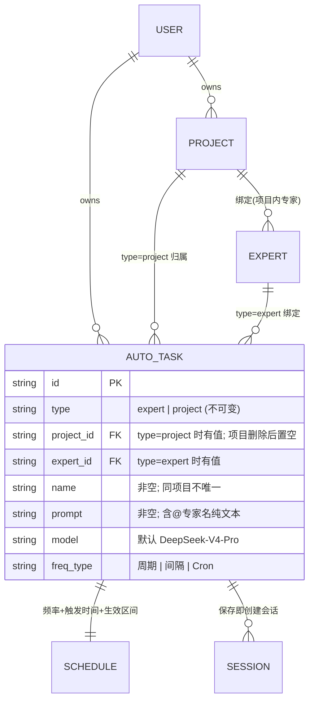
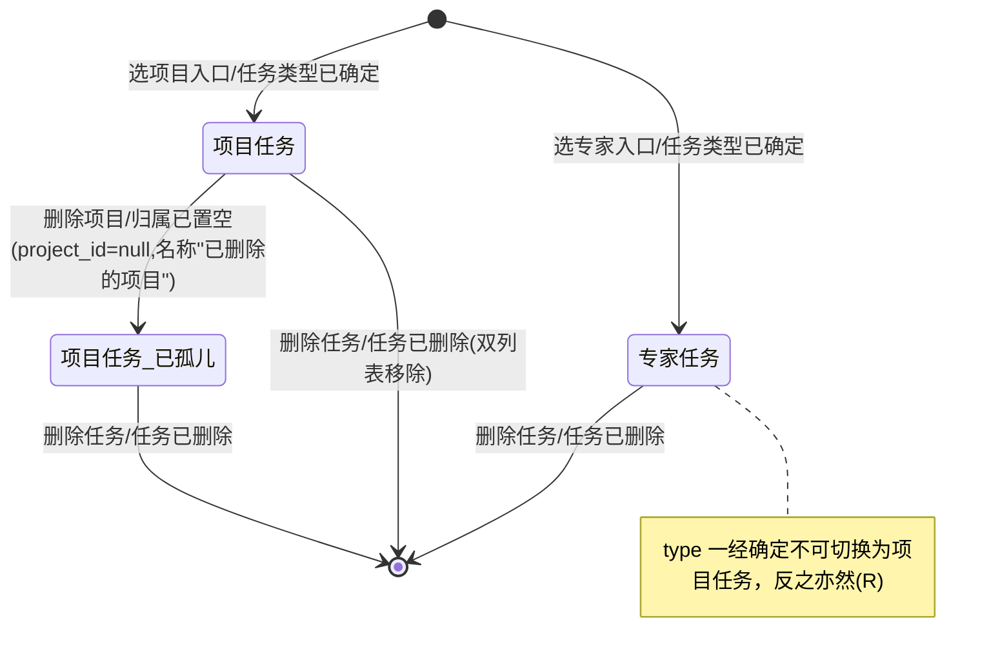
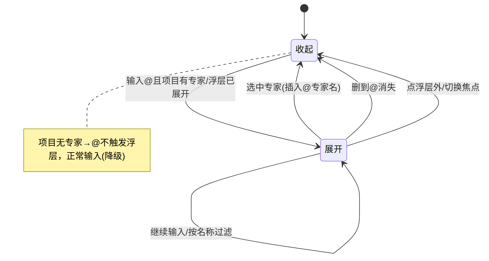
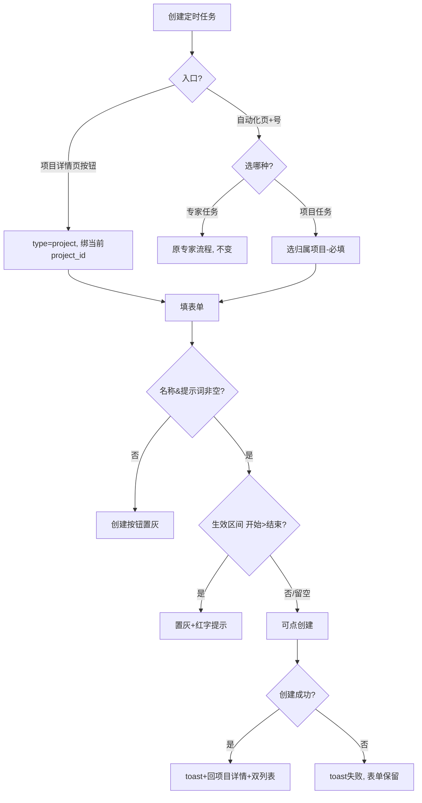

# 需求分析：纳米Work-项目支持创建定时任务

**创建日期**：2026-06-30  
**存放路径**：`Plans/需求分析/2026-06-30-纳米Work-项目定时任务.md`  
**状态**：草稿（待产品确认 4 个 P0）  
**lifecycle_state**：requirement  
**真理源**：本文件为后续架构 / 开发 / 测试 / 部署的唯一需求基准。  
**Epic**：[[Plans/Epic/2026-06-30-纳米Work-项目定时任务]]  
**前置依赖**：项目功能（项目 Tab、项目内任务、项目绑定专家）已上线/在研——本需求建立在「项目」已存在的基础上，见 [[Plans/需求分析/2026-06-27-纳米Work-项目功能]]。

> PRD 编号 NAMI-048 · v1.2.0。PRD 已按分层规范（🟫背景/🟦端D/🟪服模S/⬛规则R）组织，错误态与边界相对完整，本次分析聚焦：跨入口一致性、@引用与执行语义、定时频率字段细则遗漏、删除/启停生命周期。

---

# 人类卷（产品/开发 3 分钟读完即可开工）

## A. 用户使用地图

| 角色 | 场景（什么时候） | 任务（要干什么） |
|------|------------------|------------------|
| 项目重度用户 | 正在某项目里工作，想让该项目定时产出（如每天推 AI 新闻） | 在项目详情页点「创建自动化任务」→ 填表 → 任务归属当前项目 |
| 自动化页用户 | 在「自动化」页统一管理所有定时任务 | 点 + → 选「创建项目自动化任务」→ 先选项目 → 填表 |
| 自动化页用户 | 想创建归属某专家（非项目）的定时任务 | 点 + → 选「创建专家自动化任务」→ 走原有专家任务流程（不变） |
| 项目内用户 | 在提示词里指定"这一步让谁做" | 输入 @ → 选项目内专家 → 插入 `@专家名`（纯文本，不改归属/执行者） |

## B. 关键业务时刻

```text
用户选入口 → 【任务类型已确定(type=project/expert, 不可改)】 → 填表(@可选) →
【项目定时任务已创建】 → 任务出现在 项目任务Tab + 自动化列表(双列表) →
（到点）【定时任务已执行】 →（可选）【任务已删除/项目已删除→归属置空】
```

| 时刻（事件） | 谁触发 | 用户看到/得到什么 |
|--------------|--------|-------------------|
| 任务类型已确定 | 用户选入口 | 入口即决定 type；项目入口无项目/专家选择器，自动化页入口需选项目 |
| 项目定时任务已创建 | 用户点「创建」 | toast 成功→跳回项目详情页；任务进项目任务列表 + 自动化列表 |
| 定时任务已执行 | 系统调度 | 按频率/生效区间执行；project 类型不绑定具体专家 |
| 项目已删除 | 用户删项目 | 该项目下定时任务保留，project_id 置空，项目名显示「已删除的项目」 |
| 任务已删除 | 用户删任务 | 从自动化列表与项目任务列表**同时**移除 |

## C. 关键业务规则（Do / Don't）

- **Do**：双入口创建——项目详情页按钮（绑当前项目）+ 自动化页 + 号（专家/项目二选一）。
- **Do**：项目定时任务 `type=project`，执行**不绑定具体专家**；提示词支持 `@项目内专家`（纯文本引用）。
- **Do**：项目任务同时出现在「项目任务 Tab 会话列表」与「自动化列表」（双列表归属）。
- **Do**：项目无专家时按钮仍可用，@引用降级（不触发浮层，正常输入）。
- **Don't**：type 一经创建不可更改（项目任务不能转专家任务，反之亦然）。
- **Don't**：@引用不改变任务执行者/归属；不支持 @所有人、不支持 @外部专家。
- **Don't**：同一项目下任务名称不做唯一校验（可重复）。
- **前提 → 后果**：项目被删除 → 任务保留但 project_id 置空，名称展示「已删除的项目」。

## D. 需求问题清单（产品必读 · 不确认无法开工）

> 分三类：**🤔 不理解（语义不清）/ ⚔️ 矛盾（自相打架）/ 🕳️ 遗漏（该有没写）**。
> **P0 共 4 条**——不闭环就进不了架构/开发；P1 可并行但建议本期定。明细见底稿 §六/七/八/十。

| # | 类 | 一句话问题 | 要产品拍板的 |
|---|----|-----------|-------------|
| **P0-L1** | 🤔 不理解 | 项目任务"执行不绑定具体专家"、@ 又不改执行者——那到点**谁来执行**这条提示词？ | 项目定时任务的默认执行主体（默认 AI 助手？项目级默认模型？） |
| **P0-L3** | 🤔 不理解 | 项目删了，孤儿任务（project_id 置空）**还会不会到点执行**？还留在自动化列表吗？ | 孤儿任务是「保留展示但停调度」还是「继续执行」 |
| **P0-M1** | 🕳️ 遗漏 | PRD 只写了创建+删除——任务建完能不能**编辑 / 启停 / 看运行历史**？入口在哪？ | 本期是否含启停与详情页（定时类必备生命周期） |
| **P0-M2** | 🕳️ 遗漏 | 「定时任务已执行」**谁触发、产出写到哪**（生成会话消息？）、失败/超时怎么反馈？ | 执行结果的落点与失败反馈契约（需后端一起） |
| P0-M3 | 🕳️ 遗漏 | 频率三模式（周期/间隔/Cron）的**子字段、切换是否清空、Cron 校验**全没展开。 | 可转架构细化，但需求侧先确认范围 |
| P0-M4 | 🕳️ 遗漏 | 创建/列表/删除/编辑的**接口契约**（字段、错误码）未写。 | 转架构阶段，确认范围即可 |
| P1-I1 | ⚔️ 矛盾 | 点自动化列表里的项目任务卡片，是进**会话详情**还是**项目任务 Tab 高亮**？两处描述打架。 | 明确跳转目标 |
| P1-I2 | ⚔️ 矛盾 | 项目入口创建成功跳回项目详情；自动化页入口**跳哪没写**。 | 自动化页入口成功后的跳转 |
| P1-B9 | 🕳️ 遗漏 | 任务名称 / 提示词**长度上限**没定义，超长怎么办未知。 | 给上限与超长处理 |

---

<!-- AI工作底稿 ↓ -->

# AI 工作底稿（供 architecture / test 阶段消费）

## 〇、战略层（Why）

- **痛点**：当前定时任务只能在「自动化」页创建且一律是专家任务，无法直接归属项目；用户要在项目和自动化页之间反复跳转，定时产出与项目语境割裂。
- **量化目标**：减少"创建归属项目的定时任务"的操作路径（从 自动化页→建专家任务→无法关联项目，到 项目内一键创建）；项目定时任务在项目内即可见。
- **用户故事**：作为纳米Work 项目重度用户，我想要在项目内直接创建归属本项目的定时任务并在提示词里 @ 指定专家，以便定时产出与项目语境绑定、不必在项目与自动化页间跳转。
- **设计参考**：Notion Database Automations「从数据库内创建」；@引用参考 Slack/Discord mention（上下文引用，不改归属）。

---

## 一、PRD 摘要（3–5 句）

1. 定时任务从「单入口仅专家任务」扩为「双入口」：项目详情页新增「创建自动化任务」按钮 + 自动化页 + 号下拉区分「专家/项目」两条创建路径。
2. 任务新增 `type` 维度：`expert`（绑专家、无项目）/ `project`（绑 project_id、无执行专家），type 由入口决定且创建后不可改。
3. 项目定时任务双列表归属：同时出现在所属项目的任务 Tab 会话列表与自动化任务列表（图标区分类型）。
4. 项目自动化任务提示词输入框支持 `@项目内专家`（纯文本标记，不改执行者/归属，项目无专家则不触发浮层）。
5. 表单含名称/提示词/模型/频率(周期·间隔·Cron)/触发时间/生效日期区间；项目入口无项目选择器，自动化页入口多一个必填项目选择器。

---

## 一·五、范围层（What）

| 包含功能 | 优先级 |
|----------|--------|
| 项目详情页新增「创建自动化任务」按钮（绑当前项目） | P0 |
| 自动化页 + 号下拉菜单（专家/项目两路径） | P0 |
| 项目自动化任务创建页 — 项目入口（无项目/专家选择器） | P0 |
| 项目自动化任务创建页 — 自动化页入口（多项目选择器，必填） | P0 |
| 任务 type 判定与归属规则（S1：type 不可变） | P0 |
| 双列表归属（项目任务 Tab + 自动化列表，S2） | P0 |
| 自动化列表展示项目任务 + 类型图标区分（D2/3.5） | P0 |
| @引用浮层（项目内专家、过滤、纯文本插入，D1/3.6） | P0 |
| 表单字段：名称/提示词/模型/频率/触发时间/生效区间 | P0 |
| 生效日期区间校验（开始>结束→置灰红字提示） | P1 |
| 错误态（创建失败/防连点/项目选择器加载失败） | P1 |

**明确不做**（PRD 内隐含 + 排除）：项目任务转专家任务（type 不可变）· @所有人/@外部专家 · 任务名称唯一校验 · 自动化列表加载失败的额外处理（沿用现有降级）。

> ⚠️ PRD 未明确：定时任务的**启用/暂停/编辑**是否在本期范围。定时类功能高发遗漏，见 M1。

---

## 一·六、事件风暴 + 业务逻辑图

**⓪ 事件风暴表**

| 命令（动作） | 聚合 / 不变条件（业务规则） | 业务事件（过去式） |
|--------------|------------------------------|---------------------|
| 选择创建入口 | 入口决定 type；type 创建后不可变（S1） | 任务类型已确定 |
| 选择归属项目（自动化页入口） | project_id 必填、无默认 | 归属项目已选定 |
| 输入 @ | 当前项目有绑定专家（否则不触发） | @引用浮层已展开 |
| 选中专家 | 插入 `@专家名` 纯文本，不改执行者 | 专家引用已插入 |
| 点「创建」 | 名称非空 + 提示词非空（+生效区间合法） | 项目定时任务已创建 |
| 调度到点 | 频率/生效区间内；project 不绑专家 | 定时任务已执行（**触发/结果 PRD 未定义**, M2） |
| 删除任务 | — | 任务已删除（双列表同时移除） |
| 删除项目 | 任务保留，project_id 置空 | 项目已删除·任务归属已置空 |

> 闭环自检：**「定时任务已执行」事件无 PRD 命令/结果定义**（执行产出什么？写回哪？失败如何）——见 M2。**「编辑/启停」命令缺失**——见 M1。

**① 实体关系（ER 图）**



**② 状态机 — 任务归属类型（type 不可变 · 项目删除）**



> ⚠️ 状态机缺「启用/暂停」与「编辑」迁移——PRD 未提，见 M1。「孤儿任务」是否还能正常调度执行？PRD 未写，见 L3/M2。

**② 状态机 — @引用浮层（PRD §3.6）**



**③ 主流程（项目定时任务创建 · 时序）**

```mermaid
sequenceDiagram
  autonumber
  participant U as 用户
  participant F as 前端(创建页)
  participant B as 后端
  U->>F: 选入口(项目/自动化页)
  alt 自动化页入口
    U->>F: 选归属项目(必填)
    F->>B: 拉项目列表
    B-->>F: 项目列表(失败→"加载失败,点击重试")
  end
  U->>F: 填名称/提示词(可@专家)/模型/频率/时间/生效区间
  F->>F: 校验(名称+提示词非空; 开始≤结束)
  U->>F: 点「创建」
  F->>F: 按钮置灰+loading(防连点)
  F->>B: 创建任务(type,project_id?,expert_id?,schedule)
  alt 成功
    B-->>F: 任务已创建
    F-->>U: toast成功→回项目详情页; 进双列表
  else 失败
    B-->>F: 错误
    F-->>U: toast「创建失败，请重试」(表单保留)
  end
```

**④ 用户路径决策图**



---

## 二、范围与入口矩阵

| 入口/场景 | PRD 描述 | 触发条件 | 目标页面 | type 判定 |
|-----------|----------|----------|----------|-----------|
| 项目详情页按钮 | 会话列表下方「创建自动化任务」 | 点击（项目存在时可点；项目删除则隐藏） | 创建页(3.3,无项目/专家选择器) | project, 当前项目 |
| 自动化页 + → 项目任务 | + 下拉「创建项目自动化任务」(文件夹图标) | 点击 | 创建页(3.4,多项目选择器) | project, 用户选 |
| 自动化页 + → 专家任务 | + 下拉「创建专家自动化任务」(头像图标) | 点击 | 现有专家创建流程 | expert（不变） |
| 自动化列表项目任务卡片 | 项目图标+名称+「项目名·时间」 | 点击卡片 | 进入该项目+定位会话 | — |
| @引用 | 提示词输入 @ | 项目有绑定专家 | 键盘上方专家浮层 | — |

> ⚠️ 入口冲突：3.5 点击项目任务卡片「进入该项目+定位到该任务会话」，但 S2 说项目任务同时在「项目任务 Tab 会话列表」混排——点击自动化列表卡片落到的是「会话详情」还是「项目任务 Tab」？跳转目标需明确，见 I1。

---

## 三、数据字典 / 字段规则

| 字段 | 类型 | 必填 | 长度/范围 | 默认值 | 来源 | 校验/激活 | 疑问 |
|------|------|------|-----------|--------|------|-----------|------|
| type | enum | 是 | expert/project | 由入口决定 | 系统 | 创建后不可改(S1/R) | — |
| project_id | string | type=project 必填 | — | 项目入口=当前项目 | 入口/选择器 | 自动化页入口必选 | 删项目后置空(R) |
| 任务名称 | string | 是 | PRD 未写上限 | 无 | 用户 | 非空→参与「创建」激活 | **长度上限未定义** |
| 具体要求(提示词) | text | 是 | PRD 未写上限 | 无 | 用户 | 非空→参与激活；含@专家名 | **长度上限未定义** |
| 执行模型 | enum | 是 | — | DeepSeek-V4-Pro | 选择器 | — | 模型被下线时回退？ |
| 执行频率 | enum | 是 | 周期/间隔/Cron | PRD 未写默认 | 下拉 | — | **各模式子字段未展开** |
| 触发时间 | 双选择器 | 频率相关 | 周期(每天/周/月)+具体时间 | 无 | 选择器 | — | 间隔/Cron 模式下此项如何 |
| 生效日期区间 | date range | 否 | 开始≤结束 | 留空=始终生效 | 选择器 | 开始>结束→置灰红字 | 仅"始终生效"留空? 时区? |
| @专家名 | 纯文本标记 | 否 | — | — | @浮层选择 | 不改执行者/归属 | 删专家后历史@如何展示 |

> ⚠️ **频率三模式（周期/间隔/Cron）的子字段、模式切换是否清空、Cron 校验规则均未展开**——定时任务核心，见 M3。

---

## 四、边界情况清单（必填）

| # | 边界场景 | 期望行为 | PRD 是否写明 | 严重度 |
|---|----------|----------|--------------|--------|
| B1 | 项目无绑定专家 | 按钮仍可用；@引用降级不触发浮层 | ☑ §四 | P1 |
| B2 | 项目被删除 | 任务保留，project_id 置空，名称「已删除的项目」 | ☑ §四 | P0 |
| B3 | 孤儿任务（项目已删）是否继续调度执行 | ？ | ☐ 未写 | P0 |
| B4 | 任务删除 | 双列表同时移除 | ☑ §四 | P0 |
| B5 | 自动化页入口项目选择器加载失败 | 「加载失败，点击重试」 | ☑ §四 | P1 |
| B6 | 创建请求失败 | toast「创建失败，请重试」，表单保留 | ☑ §四 | P1 |
| B7 | 重复点击「创建」 | 首点后置灰+loading 直到返回 | ☑ §四 | P1 |
| B8 | 生效区间 开始>结束 | 置灰+红字「开始时间不能晚于结束时间」 | ☑ §四 | P1 |
| B9 | 任务名称/提示词超长 | ？（无上限定义） | ☐ 未写 | P1 |
| B10 | 频率=间隔/Cron 模式下的输入与校验 | ？ | ☐ 未写 | P0 |
| B11 | @专家后该专家被移出项目 | 历史 `@专家名` 文本如何展示/失效 | ☐ 未写 | P1 |
| B12 | 跨天/时区/夏令时（触发时间） | ？ | ☐ 未写 | P1 |

---

## 五、异常流程矩阵（必填）

| 触发条件 | 用户可见反馈 | 系统行为 | 是否可恢复 | PRD 是否写明 |
|----------|--------------|----------|------------|--------------|
| 名称或提示词为空 | 「创建」按钮置灰 | 阻止提交 | 是 | ☑ §3.3 |
| 生效区间 开始>结束 | 置灰+红字提示 | 阻止提交 | 是 | ☑ §四 |
| 创建请求失败(网络/5xx) | toast「创建失败，请重试」 | 表单内容保留不清空 | 是(重试) | ☑ §四 |
| 重复点击创建 | 按钮置灰+loading | 直到请求返回 | 是 | ☑ §四 |
| 项目选择器加载失败 | 「加载失败，点击重试」 | 阻塞选择 | 是 | ☑ §四 |
| 自动化列表加载失败 | 沿用现有降级 | 不额外处理 | — | ☑ §四 |
| 定时任务执行失败/超时 | ？ | ？（产出写回何处） | ？ | ☐ 未写 |
| 模型被下线/不可用 | ？ | ？ | ？ | ☐ 未写 |

---

## 五·五、集成与人机协同边界

| 集成点 / 异步任务 | 类型 | 触发事件 | 失败/补偿策略 |
|-------------------|------|----------|---------------|
| 定时调度引擎执行任务 | 定时任务 | 「定时任务已执行」 | **PRD 未定义**（重试/通知/产出写回，见 M2） |
| 大模型推理（执行提示词） | 异步/同步 API | 任务执行 | 模型下线回退未定义 |
| 项目专家列表（@引用候选） | 同步 API | @引用浮层已展开 | 项目无专家→降级不触发 |

**人机协同边界**

| 动作 / 事件 | 全自动 | AI建议+人工确认 | 纯人工 |
|-------------|:------:|:---------------:|:------:|
| 任务到点执行 | ☑ | ☐ | ☐ |
| 创建/删除任务 | ☐ | ☐ | ☑ |
| @专家引用插入 | ☐ | ☐ | ☑ |

---

## 六、逻辑问题（写了，但有问题）

| # | 类型 | 问题 | PRD 摘录 | 严重度 |
|---|------|------|----------|--------|
| L1 | 执行语义 | project 类型「执行不绑定具体专家」，那由谁/用什么角色执行提示词？@专家名是纯文本不改执行者——则项目任务实际执行主体是什么（默认 AI？项目默认配置？） | S2「project 类型执行不绑定具体专家」+ D1「@不改执行者」 | P0 |
| L2 | 双列表一致性 | 项目任务在「项目任务 Tab 会话列表」与「自动化列表」双展示，删除/状态变更是否两处实时同步？PRD 只写删除同时移除，未写执行状态/最近运行时间同步 | S2 + 四「删除同时移除」 | P1 |
| L3 | 孤儿任务调度 | 项目删除后 project_id 置空、任务保留——孤儿任务是否还会被调度执行？还出现在自动化列表但不在任何项目任务 Tab？ | 四「项目删除→任务保留，project_id 置空」 | P0 |
| L4 | type vs 列表入口 | 自动化列表点击项目任务「进入该项目+定位会话」，若任务已是孤儿（无项目）点击落到哪？ | 3.5 + 四 | P1 |

---

## 七、交互冲突（写了，但互相打架）

| # | 场景 A | 场景 B | 问题 | 建议问产品 |
|---|--------|--------|------|------------|
| I1 | 3.5 点项目任务卡片「进入该项目+定位任务会话」 | S2 任务在项目任务 Tab 会话列表与其他会话混排 | 点击落到「会话详情页」还是「项目任务 Tab 并高亮该会话」？ | 明确跳转目标页与定位行为 |
| I2 | 3.3 项目入口「保存后跳回项目详情页」 | 3.4 自动化页入口未写保存后跳哪 | 自动化页入口创建成功后跳回自动化列表还是进项目？ | 明确两入口各自的成功后跳转 |
| I3 | 3.1 按钮「项目已删除/不存在→隐藏」 | 项目详情页本身在项目删除后还可达吗 | 既然项目删了，按钮隐藏是否为不可达分支（冗余）？ | 确认按钮隐藏的真实触发场景 |

---

## 八、整体需求遗漏（没写，但应该有）⭐

### 用户旅程闭环

```mermaid
flowchart LR
  A[选入口] --> B[填表单/@引用]
  B --> C[创建成功-双列表]
  C --> D[到点执行]
  D --> E[查看运行结果/历史]
  E --> F[编辑/启停/删除]
  F --> G[项目删除→孤儿]
```

| # | 遗漏维度 | PRD 覆盖 | 缺失内容 | 不补的风险 | 严重度 |
|---|----------|----------|----------|------------|--------|
| M1 | 编辑/启用/暂停 | 未写 | 定时任务创建后能否编辑、启用/暂停、查看运行历史？入口在项目任务 Tab 还是自动化列表 | 定时类必备生命周期缺失，开发无从实现详情/管理页 | P0 |
| M2 | 执行机制与结果 | 未写 | 「定时任务已执行」由谁触发、产出写回哪（生成会话消息？）、执行失败/超时反馈、孤儿任务是否执行 | 行内最核心的"定时产出"无契约，无法联调与验收 | P0 |
| M3 | 频率三模式子字段 | 部分 | 周期/间隔/Cron 各自子字段表、模式切换是否清空已填、Cron 表达式校验规则、间隔单位 | 表单核心字段歧义，三模式实现不一致 | P0 |
| M4 | API/接口清单 | 未写 | 创建/列表/删除/(编辑) 接口、type+project_id+schedule 字段契约、错误码、项目专家列表接口 | 无契约无法联调（可转架构阶段细化，需求侧需确认范围） | P0（转架构） |
| M5 | 字段长度上限 | 未写 | 任务名称、提示词长度上限及超出处理 | 超长输入边界不定 | P1 |
| M6 | 时间/时区 | 未写 | 触发时间的时区、跨天、夏令时、生效区间时区 | 调度时间错位 | P1 |
| M7 | 埋点 | 未写 | 双入口创建点击、@引用使用、项目/专家任务区分、执行成功率 | 无法度量功能效果与入口偏好 | P1 |
| M8 | @引用持久化 | 未写 | 专家被移出项目后历史 `@专家名` 的展示/校验；@是否参与提示词长度计数 | 历史引用展示歧义 | P1 |

---

## 九、验收标准（必填，可测）

| # | 验收项 | 锚定事件 | Given（前置） | When（操作） | Then（期望，含事件已发生） | 优先级 |
|---|--------|----------|---------------|--------------|---------------------------|--------|
| AC1 | 项目入口创建归属当前项目 | 项目定时任务已创建 | 在项目X详情页 | 点「创建自动化任务」→填名称+提示词→创建 | 任务 type=project、project_id=X；toast 成功；回项目X详情页 | P0 |
| AC2 | 项目入口无项目/专家选择器 | — | 项目入口创建页 | 查看表单 | 不出现项目选择器、不出现专家选择器 | P0 |
| AC3 | 自动化页入口需选项目 | 归属项目已选定 | 自动化页点+→项目自动化任务 | 未选项目 | 「创建」不可点；选项目X后可填 | P0 |
| AC4 | 双列表归属 | 项目定时任务已创建 | 项目X已创建项目定时任务T | 分别看 项目X任务Tab / 自动化列表 | T 同时出现在两处；自动化列表 T 用项目图标+「项目名·时间」 | P0 |
| AC5 | type 不可变 | — | 已创建项目任务T | 尝试编辑/切换类型 | 无法将 T 切为专家任务（无该入口/被禁用） | P0 |
| AC6 | 创建按钮激活条件 | — | 项目入口创建页 | 名称或提示词为空 | 「创建」置灰；二者均非空后可点 | P0 |
| AC7 | @引用插入 | 专家引用已插入 | 项目X已绑定专家E，在提示词框 | 输入@→浮层展开→选E | 光标处插入 `@E`（纯文本），浮层收起，不改执行者 | P0 |
| AC8 | @降级（项目无专家） | — | 项目X无绑定专家 | 提示词框输入@ | 不弹浮层，@作为普通字符正常输入 | P1 |
| AC9 | 生效区间校验 | — | 创建页填生效区间 | 开始时间晚于结束时间 | 「创建」置灰，开始下方红字「开始时间不能晚于结束时间」 | P1 |
| AC10 | 删除任务双移除 | 任务已删除 | 项目任务T存在于双列表 | 删除T | 自动化列表与项目任务列表同时不再出现T | P0 |
| AC11 | 项目删除→孤儿 | 项目已删除·任务归属已置空 | 项目X有项目任务T | 删除项目X | T 保留；project_id 置空；展示「已删除的项目」 | P0 |
| AC12 | 创建失败保留表单 | — | 填好表单 | 点创建后请求失败 | toast「创建失败，请重试」；表单内容不清空 | P1 |
| AC13 | 防连点 | 项目定时任务已创建 | 填好表单 | 快速连点「创建」 | 首点后按钮置灰+loading；只创建一条 | P1 |
| **AC1-反** | 专家入口不归项目 | — | 自动化页点+→专家自动化任务 | 创建专家任务 | type=expert、无 project_id；不出现在任何项目任务Tab | P0 |
| **AC7-反** | @不改执行者 | — | 项目任务含 `@E` | 任务执行 | 执行主体不变为E；@E 仅作提示词上下文文本 | P0 |
| **AC5-反** | 类型不可反转 | — | 已创建专家任务 | 尝试转项目任务 | 无入口可转；type 保持 expert | P0 |

**非功能验收**：创建防连点幂等（AC13）；双列表数据一致（删除同步）；@浮层过滤实时。性能/列表上限待 M5 补。

---

## 十、待产品确认（Push 产品清单）

> 按「逻辑 · 交互 · 遗漏」三块归类。**P0 共 4 条，须闭环后方可进入架构/开发**。

**【逻辑问题】**
- **P0-L1**：项目任务「执行不绑定具体专家」且 @ 不改执行者——那项目定时任务到点由谁/什么角色执行提示词（默认 AI 助手？项目级默认模型？）？这是执行机制的根。建议明确项目任务的默认执行主体。
- **P0-L3**：项目删除后的孤儿任务（project_id 置空）是否仍被调度执行？还出现在自动化列表？建议：明确孤儿任务"保留展示但停止调度"或"继续执行"。

**【需求遗漏】**
- **P0-M1**：定时任务创建后能否**编辑/启用/暂停/查看运行历史**？入口在哪？（定时类必备生命周期，PRD 仅写创建+删除）。建议本期至少明确"启停"与"详情"是否在范围。
- **P0-M2**：**执行机制与结果契约**——「定时任务已执行」由谁触发、产出写回哪（生成会话消息？）、失败/超时如何反馈。建议产品+后端给出执行结果落点定义。
- **P0-M3**（可在架构细化，需求侧确认）：**频率三模式（周期/间隔/Cron）子字段表 + 模式切换清空规则 + Cron 校验**。
- **P0-M4**（转架构）：完整 API 契约（创建/列表/删除/编辑、type+project_id+schedule 字段、错误码）。

**【交互冲突 · P1】**
- **P1-I1**：自动化列表点项目任务卡片，落「会话详情」还是「项目任务 Tab 高亮会话」？
- **P1-I2**：自动化页入口创建成功后跳回自动化列表还是进项目？

---

## 十一、分析结论

| 项 | 结论 |
|----|------|
| 可否进入架构设计 | ⚠️ 有条件——4 个 P0（L1/L3/M1/M2）须先与产品确认闭环；M3/M4 可转架构阶段细化但需求侧需确认范围 |
| p0_open | 4 |
| 关联架构 plan | [ ] `Plans/客户端技术方案/2026-06-30-纳米Work-项目定时任务.md`（待创建） |

> 门禁：`p0_open=4 > 0`，按 Epic 阶段门禁**不得进入 development**。需求 `status` 须经产品确认后置「已采纳」并将 `p0_open` 归 0。

---

## 续做

```
/resume plan=Plans/需求分析/2026-06-30-纳米Work-项目定时任务.md 进度=待产品确认4个P0
```

**下一阶段 Skill**：产品确认 P0 后 → `/architecture-design-assistant`，引用本 plan。

---

## 反馈（skill_run）

```yaml
skill_run:
  skill: requirement-analyst
  plan: Plans/需求分析/2026-06-30-纳米Work-项目定时任务.md
  date: 2026-06-30
  contexts_used:
    - path: Contexts/需求分析/需求分析规范.md
      utility: high
      reason: "按三层面+事件风暴+四图组织；用§5.3逐维度对照扫遗漏（启停/执行机制/频率子字段）"
    - path: Contexts/需求分析/示例-创建自动化任务-PRD问题模式.md
      utility: high
      reason: "对照定时任务已知问题模式：频率三模式子字段、删除/启停遗漏、执行机制缺失"
    - path: Templates/需求分析-带验收标准模板.md
      utility: high
      reason: "套用人类卷+边界/异常/AC五块骨架"
    - path: Contexts/需求分析/需求分析产出标准.md
      utility: high
      reason: "核对可开发最低字段与p0_open门禁口径"
  contexts_missing:
    - "Cron 表达式/定时调度的标准校验与时区处理无 Contexts 沉淀，本次只能列为遗漏 M3/M6"
  contexts_stale:
    - path: Plans/Epic/2026-06-27-纳米Work-项目功能.md
      reason: "Epic frontmatter status=done 且 p0_open=0，但其需求子plan仍为草稿/p0_open=6 且本次又新增定时任务需求，Epic 状态与子plan实际进度脱钩，需回写"
```
