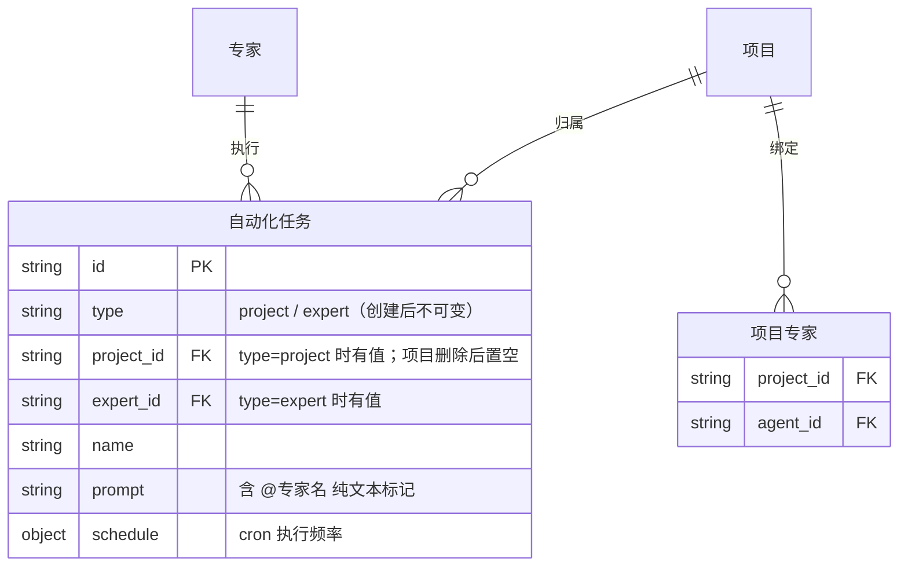
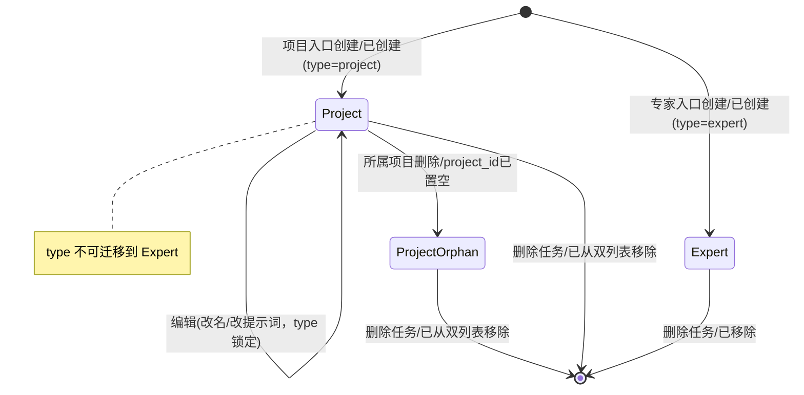
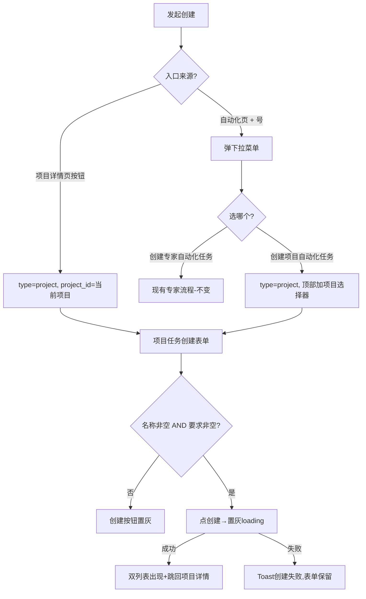

# 需求分析：纳米Work-项目支持创建定时任务（NAMI-053）

**创建日期**：2026-07-02  
**存放路径**：`Plans/需求分析/2026-07-02-纳米Work-项目创建定时任务.md`  
**状态**：已采纳（4 个 P0 已由产品/研发确认闭环，p0_open=0）  
**lifecycle_state**：requirement  
**真理源**：本文件为后续架构 / 开发 / 测试 / 部署的唯一需求基准。  
**PRD**：项目支持创建定时任务 PRD v1.3.0（飞书，2026-06-23）

> ⚠️ 本需求强依赖「项目二期·项目内专家团」（@专家组件、项目绑定专家名单来源）。

---

# 人类卷（产品/开发 3 分钟读完即可开工）

## A. 用户使用地图

| 角色 | 场景（什么时候） | 任务（要干什么） |
|------|------------------|------------------|
| 用户 | 在某个项目里，想让这个项目定时自动跑一件事 | 项目详情页点「创建自动化任务」→ 填表 → 创建，任务归属该项目 |
| 用户 | 在自动化页，想给某个项目建定时任务 | 点 + →「创建项目自动化任务」→ 选项目 → 填表 → 创建 |
| 用户 | 在自动化页，想建原来的专家定时任务 | 点 + →「创建专家自动化任务」→ 走现有专家任务流程（不变） |
| 用户 | 写项目任务提示词时，想指定"这步交给谁做" | 输入框输入 @ → 从本项目专家里选 → 插入「@专家名」纯文本 |
| 用户 | 在自动化列表里 | 同时看到专家任务和项目任务，靠左侧图标区分 |

## B. 关键业务时刻

```text
用户进入创建入口 → 【已确定任务归属类型(project/expert)】 →（填表，可选 @引用专家）→ 【已提交创建请求】 → 【任务已创建】 → 双列表可见 → 回到入口页
```

| 时刻（事件） | 谁触发 | 用户看到/得到什么 |
|--------------|--------|-------------------|
| 已选择创建入口 | 用户 | 项目入口→无选择器；自动化页项目入口→需选项目；自动化页专家入口→选专家 |
| 已插入 @专家引用 | 用户 | 提示词光标处出现「@专家名」纯文本 |
| 已提交创建请求 | 用户 | 「创建」按钮置灰 + loading |
| 项目任务已创建 | 系统 | 项目任务 Tab 会话流 + 自动化列表页 同时出现该任务；跳回项目详情页 |
| 项目已删除 | 系统 | 该项目下任务保留，project_id 置空，项目名显示「已删除的项目」 |

## C. 关键业务规则（Do / Don't）

- **Do**：任务 type 由创建入口决定（project / expert），一旦创建**不可更改**。
- **Do**：项目任务同时出现在「项目任务 Tab 会话流」和「自动化列表页」（双列表）。
- **Do**：@引用候选范围 = 当前项目已绑定的专家；@专家名是**纯文本标记**，不改变执行者、不改变归属。
- **Don't**：项目任务**不绑定执行专家**，不能切换为专家任务。
- **Don't**：@ 不支持 @所有人、@外部专家；项目无专家时 @ 不触发浮层（降级为普通输入）。
- **前提 → 后果**：项目被删除 → 任务保留但 project_id 置空、项目名显示「已删除的项目」；任务被删除 → 两个列表同时移除。

## D. 需求问题清单（产品必读 · 不确认无法开工）

| # | 类 | 一句话问题 | 要产品拍板的 |
|---|----|-----------|-------------|
| P0-1 | 🤔 不理解 | 项目任务说"无执行专家"，但定时任务到点必须有个"执行体"才能跑，这个执行体是什么？ | 项目任务到点用什么身份执行（项目默认助理 / 纳米AI助理兜底 / 后端指定）？没有它任务无法落地 |
| P0-2 | 🕳️ 遗漏 | 客户端怎么告诉后端"这是项目任务"？现有创建接口只有专家字段，没有 type / project_id | 后端 `cron.create` 是否新增 `type` + `project_id` 字段？payload 结构长什么样？（阻塞 Data 层开发） |
| P0-3 | ⚔️ 矛盾 | PRD 3.6 要"键盘上方浮层、点选即插入、无确定键"，但现有 @专家组件是全屏弹窗带确定/取消 | 新建轻量浮层，还是复用现有全屏弹窗降级？候选专家数据源是"项目绑定专家"（现有组件默认取"我的专家"，不一致） |
| P0-4 | 🕳️ 遗漏 | 项目任务点进去 = 什么？能编辑吗？编辑时能改归属项目吗？PRD 只讲了创建和列表，没讲详情/编辑 | 项目任务的详情页 / 编辑页规格；type 不可变，那 project_id、@引用、提示词能不能改？ |
| P1-5 | 🕳️ 遗漏 | 项目任务创建页要不要"选择模型"？现有创建页有模型选择器，PRD 3.3 只说"选专家换成选项目"没提模型 | 项目任务是否保留模型选择器？默认模型是哪个？ |
| P1-6 | 🕳️ 遗漏 | 项目任务在"项目任务 Tab 会话流"里长什么样？与普通会话混排时怎么标识它是定时任务？ | 会话流里的项目任务卡片形态（复用自动化卡片还是会话卡片） |
| P1-7 | 🕳️ 遗漏 | 项目任务支不支持暂停/启用/删除？PRD 边界只提了删除，没提暂停/启用 | 项目任务是否复用专家任务的启停能力 |

---

<!-- AI工作底稿 ↓ -->

# AI 工作底稿

## 〇、战略层（Why）

- **痛点**：项目是用户组织工作的核心单元，但定时任务只能建"专家任务"、无法归属项目；用户要在"项目"和"自动化"两个页面间反复跳转，任务与项目割裂。
- **量化目标**：为项目提供"从项目内直接创建定时任务"能力（对标 Notion Database Automations 的"从数据库内创建"）；创建路径从"仅自动化页 1 个入口"扩展到"项目详情 + 自动化页下拉"双入口。
- **用户故事**：作为用户，我想在项目内直接创建归属该项目的定时任务、并在提示词里 @ 项目专家，以便让项目自动化运转、减少跨页跳转。

## 一、PRD 摘要（3–5 句）

给定时任务引入"归属类型"概念：除现有 expert（专家任务）外，新增 project（项目任务）。项目任务通过两个入口创建——项目详情页「创建自动化任务」按钮、自动化页 + 号下拉「创建项目自动化任务」，type 由入口决定且创建后不可变。项目任务不绑定执行专家、归属某项目，同时展示在项目任务 Tab 会话流与自动化列表页（双列表，靠图标区分）。项目任务的提示词输入框支持 @ 引用当前项目内专家（纯文本标记，不改变执行者）。

## 一·五、范围层（What）

| 包含功能 | 优先级 |
|----------|--------|
| 项目详情页新增「创建自动化任务」按钮（3.1） | P0 |
| 自动化页 + 号下拉菜单：专家/项目 二选一（3.2） | P0 |
| 项目自动化任务创建页·项目入口（无项目/专家选择器，3.3） | P0 |
| 项目自动化任务创建页·自动化页入口（多项目选择器，3.4） | P0 |
| 自动化列表页混排项目任务 + 图标区分类型（3.5 / D2） | P0 |
| @引用项目内专家浮层（3.6 / D1） | P0 |
| 项目删除后任务保留、project_id 置空、显示「已删除的项目」（四·边界） | P1 |

**明确不做**：项目任务切换为专家任务（type 不可变）；@所有人 / @外部专家；专家任务创建流程改造（保持不变）；专家本身的创建/安装（复用既有链路）。

## 一·六、事件风暴 + 业务逻辑图

**⓪ 事件风暴表**

| 命令（动作） | 聚合 / 不变条件（业务规则） | 业务事件（过去式） |
|--------------|------------------------------|---------------------|
| 从项目详情点「创建自动化任务」 | type=project 且 project_id=当前项目；无专家 | 已进入项目任务创建页（带上下文） |
| 从自动化页点「创建项目自动化任务」 | type=project 且 project_id=用户选择；无专家 | 已进入项目任务创建页（需选项目） |
| 从自动化页点「创建专家自动化任务」 | type=expert 且 expert_id=用户选择；无项目 | 已进入专家任务创建页（现流程） |
| 输入 @（项目有专家） | 候选=当前项目绑定专家 | 已弹出 @专家浮层 |
| 点选 @专家 | @专家名为纯文本，不改执行者 | 已插入 @专家引用 |
| 点「创建」（名称非空+要求非空） | 防连点，type 不可变 | 已提交创建请求 → 任务已创建 |
| 删除项目 | 任务不级联删除 | 项目已删除、任务 project_id 已置空 |
| 删除任务 | 双列表一致 | 任务已删除（两列表同时移除） |

> 悬空点：**「任务已创建」到点后如何触发执行**——PRD 未定义 project 任务的执行体（见 P0-1），此事件链在"执行"环节断裂。

**① 实体关系（ER 图）**



**② 状态机（自动化任务归属类型 · type 不可变）**



**④ 决策流程图（创建入口 → 表单差异）**



## 二、范围与入口矩阵

| 入口/场景 | PRD 描述 | 触发条件 | 目标页面 | 现状 |
|-----------|----------|----------|----------|------|
| 项目详情页「创建自动化任务」 | 3.1 | 项目详情列表底部/右上角按钮 | 项目任务创建页（3.3） | 🆕 项目详情页现无此按钮 |
| 自动化页 + 号 | 3.2 | 点 + 弹下拉 | 下拉菜单 | ⚠️ 现在 + 直接进创建页（`NMTaskListContainerViewController.openScheduledTaskCreatePage`），需改为先弹菜单 |
| 菜单·创建专家任务 | 3.2 | 点菜单项 | 现有专家创建页 | ✅ 复用 `NMScheduledTaskCreateViewController()` |
| 菜单·创建项目任务 | 3.2 | 点菜单项 | 项目任务创建页（3.4） | 🆕 需项目选择器 |
| @引用浮层 | 3.6 | 提示词输入 @ 且项目有专家 | 键盘上方浮层 | ⚠️ 现 `NMMentionExpertPopupController` 是全屏弹窗带确定键，形态不符 |

## 三、数据字典 / 字段规则

| 字段 | 类型 | 必填 | 来源 | 校验/激活 | 疑问 |
|------|------|------|------|-----------|------|
| type | string(project/expert) | 是 | 入口决定 | 创建后不可变 | 后端 cron 是否落此字段（P0-2） |
| project_id | string | type=project 必填 | 项目入口带上下文 / 选择器 | 项目删除后置空 | 后端字段名与结构（P0-2） |
| expert_id / agentid | string | type=expert 必填 | 专家选择器 | 现有 payload.agentTurn.agentid | project 任务此字段是否为空/兜底（P0-1） |
| name | string | 是 | 用户输入 | 非空、≤50 字（现有 `taskNameMaxLength=50`） | 同项目可重复（PRD 明确不校验唯一） |
| prompt | string | 是 | 用户输入 | 非空；含 @专家名纯文本 | 编辑回显时 @ 是否高亮识别（P0-4） |
| model | string | ? | 云控 homepage 模型 | 现有创建页有模型选择器 | 项目任务是否保留模型选择（P1-5） |
| schedule | cron | 是 | 频率表单 | 现有 once/period/interval | 复用现有 builder |

## 四、边界情况清单

| # | 边界场景 | 期望行为 | PRD 写明 | 严重度 |
|---|----------|----------|--------------|--------|
| B1 | 项目无绑定专家 | 按钮仍可用；@ 不触发浮层，正常输入 | ☑（四·边界 / 3.6空态） | P1 |
| B2 | 用户一个项目都没有（3.4 项目选择器） | 项目列表空态？能否创建？ | ☐ 未写明 | P1 |
| B3 | 项目被删除 | 任务保留、project_id 置空、名显示「已删除的项目」 | ☑ | P1 |
| B4 | 重复点击「创建」 | 首次点后置灰 + loading 直到返回 | ☑（四·错误态） | P0 |
| B5 | 创建请求失败（网络/5xx） | Toast「创建失败，请重试」，表单内容保留不清空 | ☑ | P0 |
| B6 | 项目选择器加载失败（3.4） | 显示「加载失败，点击重试」 | ☑ | P1 |
| B7 | @ 后继续输入过滤到空结果 | 浮层如何展示（PRD 3.6 只说按名过滤） | ☐ 未写明空结果态 | P2 |
| B8 | 项目任务到点执行（无专家） | **执行体未定义** | ❌ 缺失 | P0（=P0-1） |

## 五、异常流程矩阵

| 触发条件 | 用户可见反馈 | 系统行为 | 可恢复 | PRD 写明 |
|----------|--------------|----------|------------|--------------|
| 名称/要求为空 | 「创建」置灰 | 阻止提交 | 是 | ☑ |
| 创建接口 4xx/5xx | Toast「创建失败，请重试」 | 表单保留 | 是 | ☑ |
| 重复提交 | 按钮置灰+loading | 幂等防连点 | 是 | ☑ |
| 项目选择器加载失败 | 「加载失败，点击重试」 | 可重试 | 是 | ☑ |
| 自动化列表加载失败 | 同现有降级 | 不额外处理 | — | ☑ |

## 五·五、集成与人机协同边界

| 集成点 | 类型 | 触发事件 | 失败/补偿 |
|-------------------|------|----------|---------------|
| cron.create（创建任务） | 同步 RPC | 已提交创建请求 | 失败 Toast + 表单保留 |
| 项目绑定专家名单（@候选源） | 同步查询 | 已弹 @浮层 | 空则不弹浮层 |
| 项目任务执行（到点触发） | 定时任务 | 任务已创建 | **执行体未定义（P0-1）** |

## 六、逻辑问题

| # | 类型 | 问题 | PRD 摘录 | 严重度 |
|---|------|------|----------|--------|
| L1 | 缺执行体 | project 任务"不绑定具体专家"，但定时任务到点需执行身份；现有 cron payload 强依赖 agentid，模型 `isValidForSubmit` 要求 clawId/agentName 非空 | S1「无执行专家」/「project 类型任务的执行不绑定具体专家」 | P0（=P0-1） |
| L2 | 字段缺失 | 现有创建链路（模型/接口）无 type、project_id 字段 | S1「type 一旦创建不可更改」 | P0（=P0-2） |
| L3 | 复用一致性 | 现有创建页有"选择模型"，PRD 3.3 只说"选专家换成选项目"，未提模型去留 | 3.3「与自动化任务创建页一致，仅将选择专家替换为选择项目」 | P1（=P1-5） |

## 七、交互冲突

| # | 场景 A | 场景 B | 问题 | 建议问产品 |
|---|--------|--------|------|------------|
| I1 | PRD 3.6：键盘上方浮层、点选即插入、无确定键、候选=项目专家 | 现有 `NMMentionExpertPopupController`：全屏弹窗、确定/取消、候选=我的专家 | 形态与数据源都不一致 | 新建轻量 @浮层 or 改造现有；候选源改为项目绑定专家（P0-3） |
| I2 | + 号现在直接进创建页 | PRD 3.2 要先弹下拉菜单 | 入口交互变更，需确认专家路径完全不变 | 确认「创建专家自动化任务」100% 走现流程 |
| I3 | 专家任务点击 → 任务详情页 | PRD 3.5：项目任务点击 → 进项目 + 定位会话 | 同一列表两类任务点击行为不同 | 确认项目任务点击目标（项目详情+定位 vs 任务详情）（关联 P0-4） |

## 八、整体需求遗漏

```mermaid
flowchart LR
  A[进入创建入口] --> B[填表/@引用]
  B --> C[创建]
  C --> D[双列表可见]
  D --> E[点击/编辑/暂停/删除]
```

| 环节 | PRD 写明 | 若未写，缺什么 |
|------|--------------|----------------|
| 进入/退出 | ☑ | — |
| 创建 | ☑ | — |
| 项目任务**详情/编辑** | ☐ | 点进去看什么、能否编辑、能否改归属项目（P0-4） |
| 项目任务在**会话流**的展示 | ☐ | 项目任务 Tab 会话流里的卡片形态（P1-6） |
| **暂停/启用/删除** | 半 | 仅提删除；暂停/启用是否复用专家任务能力（P1-7） |
| 项目选择器空态 | ☐ | 用户无项目时（B2） |
| 编辑时 @ 回显 | ☐ | @专家名纯文本如何高亮/识别（P0-4 关联） |

## 九、验收标准（可测）

| # | 验收项 | 锚定事件 | Given | When | Then | 优先级 |
|---|--------|----------|-------|------|------|--------|
| AC1 | 项目入口创建 | 任务已创建 | 在项目 P 详情页 | 点「创建自动化任务」→ 填名+要求 → 创建 | type=project、project_id=P，任务出现在 P 任务 Tab + 自动化列表，跳回 P 详情 | P0 |
| AC2 | 自动化页项目入口 | 任务已创建 | 自动化页 | 点 + →「创建项目自动化任务」→ 选项目 P → 填表 → 创建 | 任务归属 P、双列表可见 | P0 |
| AC3 | 专家入口不变 | 任务已创建 | 自动化页 | 点 + →「创建专家自动化任务」 | 走现有专家创建流程，type=expert | P0 |
| AC4 | @引用插入 | 已插入 @专家引用 | 项目有绑定专家 E | 提示词输入 @ → 选 E | 光标处插入「@E」纯文本，浮层收起，不改执行者 | P0 |
| AC5 | 列表图标区分 | — | 自动化列表含两类任务 | 查看列表 | 项目任务左侧=项目图标+「项目名·时间」；专家任务=专家头像+「专家名·时间」 | P0 |
| AC6 | 创建防连点 | 已提交创建请求 | 表单合法 | 连点「创建」 | 首次后按钮置灰+loading，仅发一次请求 | P0 |
| AC7 | 创建失败保留 | — | 网络异常 | 点创建请求失败 | Toast「创建失败，请重试」，表单内容不清空 | P0 |
| AC8 | 项目删除降级 | 项目已删除 | 项目 P 下有任务 T | 删除 P | T 保留、project_id 置空、显示「已删除的项目」 | P1 |
| AC4-反 | 无专家不弹浮层 | — | 项目无绑定专家 | 提示词输入 @ | 不弹浮层，@ 作为普通字符输入 | P0 |
| AC5-反 | 类型不可变 | — | 已存在 project 任务 | 尝试编辑 | 不提供"切换为专家任务"入口 | P1 |

## 十、待产品确认 → 已闭环（2026-07-02 产品/研发答复）

**P0（已闭环）**
- ✅ P0-1：**执行体是服务端问题，客户端不用管**。客户端只按下方 P0-2 方式传参，执行身份由后端解析处理。
- ✅ P0-2：**项目本身就是一个智能体**——创建项目任务时，把 `project_id` 当作 `agentid` 传给现有 `cron.create`。**无需后端新增 type/project_id 契约，直接复用现有 cron 创建链路**（`NMScheduledTaskScheduleBuilder.makeSubmitParams` + `rpc.cronAdd`），Data 层不再阻塞。
- ✅ P0-3：**新建输入体验**。点「具体要求」→ 打开独立文本输入页面，右下角有 @ 按钮（Figma 有），点 @ 按钮或输入框输入 @ 都触发插入项目内专家；**参考现有插入专家开发（交互范式一致，但页面与数据源不同）**。候选数据源 = 当前项目绑定专家。
- ✅ P0-4：**能编辑；详情页/编辑页复用现有定时任务的详情/编辑**。需区分"项目创建"还是"专家创建"——**创建任务时新增「智能体类型」字段做区分**（字段具体传法先预留，后续与服务端商定），不阻塞主流程。

**P1（已确认）**
- ✅ P1-5：**保留模型选择器**——项目任务创建页要选择模型。
- ⏸️ P1-6：项目任务在项目任务 Tab 会话流的卡片形态——**先不管，后续再定**。
- ✅ P1-7：**暂停/启用/删除跟现有专家定时任务一样**（复用启停能力）。

## 十一、分析结论

| 项 | 结论 |
|----|------|
| 可否进入架构设计 | ✅ 4 个 P0 已闭环，可进入技术方案；P0-2 明确"项目当智能体、project_id 传 agentid"，复用现有 cron 链路，Data 层不阻塞 |
| 关联架构 plan | [ ] `Plans/客户端技术方案/2026-07-02-纳米Work-项目创建定时任务.md` |
| p0_open | 0 |

### 关键决策沉淀（供架构阶段消费）

1. **项目 = 智能体**：项目任务创建时 `project_id` 充当 `agentid` 传入现有 `cron.create`，不引入新字段、不改后端契约。执行体由后端处理。
2. **创建流程复用**：`NMScheduledTaskCreateViewController` / `NMScheduledTaskModel` / `NMScheduledTaskScheduleBuilder` / `rpc.cronAdd` 整链复用；差异仅在"选专家→选项目"、模型选择保留、提示词 @ 输入。
3. **详情/编辑复用**：复用现有定时任务详情页 + 编辑页；"项目 vs 专家创建"的区分点待与服务端对齐（不阻塞）。
4. **@ 输入新建**：独立文本输入页 + 右下角 @ 按钮（Figma），交互参考现有插入专家，数据源换为项目绑定专家。
5. **启停/删除复用**：与专家定时任务一致。

---

## 续做

```
/resume plan=Plans/需求分析/2026-07-02-纳米Work-项目创建定时任务.md 进度=待产品确认4个P0
```

**下一阶段 Skill**：`/architecture-design-assistant`（P0-1/P0-2 闭环后引用本 plan）。

---

```yaml
skill_run:
  skill: requirement-analyst
  date: 2026-07-02
  utility: high
  reason: >
    PRD 描述 project 任务"无执行专家"，但现有代码 cron payload 强依赖 agentid、
    模型 isValidForSubmit 要求专家非空——需求分析暴露了"缺执行体"这一 PRD 未定义的
    致命断点（P0-1），以及 @浮层形态/数据源与现有组件冲突（P0-3）。这些若不在需求阶段
    拦截，会直接导致 Data 层返工。
  followups:
    - P0-1/P0-2 需 push 后端确认 cron 契约后才能进 Data 层
    - @浮层复用现有 NMMentionExpertPopupController 还是新建，需架构阶段定
```
