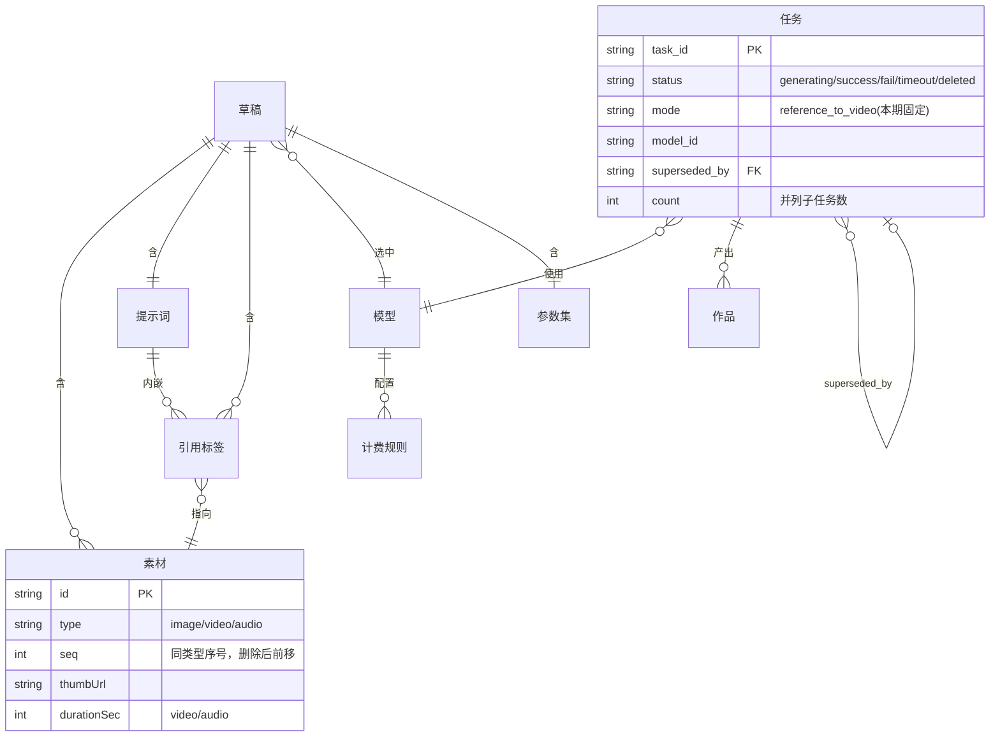
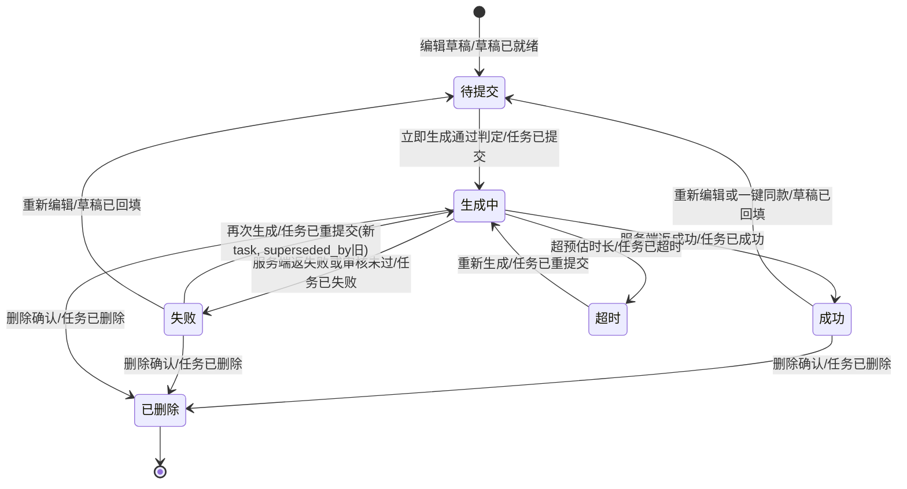
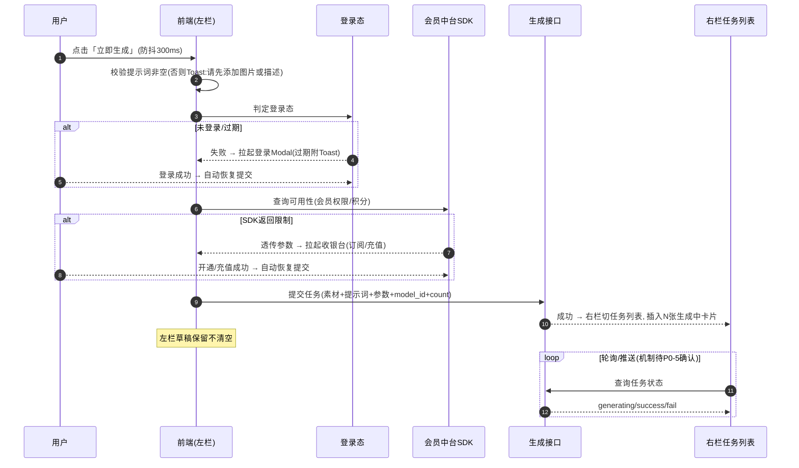
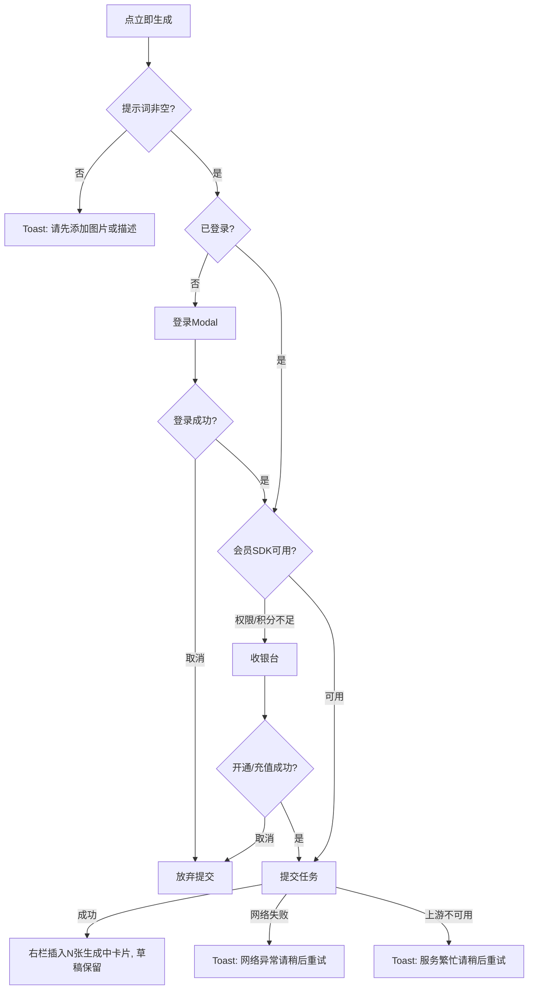
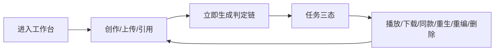

# 需求分析：纳米P视频web视频生成-参考生视频

**创建日期**：2026-07-05
**存放路径**：`Plans/需求分析/2026-07-05-纳米P视频web视频生成参考生视频.md`
**状态**：评审中（待产品回收 7 条 P0）
**lifecycle_state**：requirement
**真理源**：本文件为后续架构 / 开发 / 测试的**唯一需求基准**；架构变动须先回看本文件。
**范围**：仅「参考生视频」模式。首尾帧（§3.5）、特效玩法、灵感中心内容数据源均排除，见范围层。

---

# 人类卷（产品/开发 3 分钟读完即可开工）

## A. 用户使用地图

| 角色 | 场景（什么时候） | 任务（要干什么） |
|------|------------------|------------------|
| 新创作者 | 第一次进「视频生成」、没思路 | 看空态引导，点「灵感中心」找热门案例回填 |
| 熟练创作者 | 已有素材、想混合参考生成 | 传图/视频/音频 → 提示词里 @图片1 引用 → 调模型参数 → 立即生成 |
| 会员创作者 | 想批量出多条候选 | 数量选 2~4，一次提交并列多张生成中卡片 |
| 非会员创作者 | 积分耗尽时点生成 | 被会员/积分收银台拦截，充值/升级后自动续提交，草稿不丢 |
| 失败任务创作者 | 某条任务失败了 | 从失败卡片「再次生成」原位替换，或「重新编辑」回填左栏改了再提交 |

## B. 关键业务时刻

```text
进入视频生成 → 【素材已上传】→（可选【@引用已插入】）→ 【参数/模型已选定】
  → 点立即生成 →〔登录/会员/积分判定〕→ 【任务已提交】→ 右栏出现生成中卡片
  → 轮询/推送 → 【任务已成功】或【任务已失败】
      成功：播放/下载/一键同款   失败：再次生成(新任务 superseded_by 旧)/重新编辑(回填左栏)
```

| 时刻（事件） | 谁触发 | 用户看到/得到什么 |
|--------------|--------|-------------------|
| 素材已上传 | 用户点/拖框 | 缩略图卡片 + 聚合标签条刷新 |
| @引用已插入 | 用户选 @下拉 | 提示词里出现不可拆的 @图片1 标签 |
| 素材已删除 | 用户点 × | 同类型序号整体前移，提示词内引用标签原子回写/移除 |
| 任务已提交 | 用户点立即生成且通过判定 | 右栏切「任务列表」，顶部插入 N 张生成中卡片，左栏草稿保留 |
| 任务已成功 | 服务端返成功 | 成功卡片：首帧+时长+播放/下载/删除/一键同款 |
| 任务已失败 | 服务端返失败/超时 | 失败卡片：再次生成/重新编辑 |
| 提交已恢复 | 登录/会员/积分拦截完成 | 自动重跑用户原提交动作 |

## C. 关键业务规则（Do / Don't）

- **Do**：参考生视频模式**只要提示词非空**即可提交（素材可空）。
- **Do**：切 Tab / 切走页面回来，任务状态**以最新接口为准**；左栏草稿在同一会话内原地保留。
- **Do**：删素材 → 提示词内对应 @引用**自动同步删除**，同类型后续序号整体前移并回写标签文本，**不二次确认**。
- **Do**：预估消耗、字数上限、参数/模型选项**全部由云控/接口驱动**，前端不硬编码业务值。
- **Don't**：刷新页面**不**保留草稿（本期不做本地持久化）。
- **Don't**：下载产物**必带水印、不可去除**；下载本身不消耗积分。
- **Don't**：置灰态的「立即生成」点击**不上报**埋点。
- **前提 → 后果**：切模型导致素材类型/数量不被新模型支持 → 被动移除 + Toast，且对应 @引用一并清理。

## D. 需求问题清单（产品必读 · 不确认无法开工）

| # | 类 | 一句话问题 | 要产品拍板的 |
|---|----|-----------|-------------|
| P0-1 | 🕳️ | 「预估消耗」按 会员等级×分辨率×是否含参考视频×参考视频时长×时长×数量 的计费矩阵算，但**前端拿不到当前用户 member_type**，也没说时长/数量怎么乘 | 定「预估消耗」到底是**前端本地按 cost 矩阵算**还是**调接口返数**；若本地算，明确 member_type 来源、time/count 乘法口径、参考视频时长档(le_4s/gt_4s)如何判定 |
| P0-2 | ⚔️ | 删中间素材后「序号前移+提示词回写」是原子操作，但 PRD 举例最终态 `参考  的色调`（残留一个空格）——这个「保留空格」是**期望行为还是笔误** | 确认残留空格是刻意保留（§3.1 插入标签追加半角空格）还是应清理；影响回写算法与 AC |
| P0-3 | 🕳️ | 「再次生成」新任务 `superseded_by` 指向旧任务做列表去重，但**旧任务卡片是从列表移除还是保留为灰态**、成功态能否再次生成、去重是前端还是后端维护，全未写明 | 定 superseded_by 的展示与生命周期：旧卡消失/置灰？谁维护链？成功卡有无「再次生成」 |
| P0-4 | 🕳️ | 会员/积分拦截「透传会员中台SDK参数拉起收银台」——**SDK 的接入方式、返回结构、成功回调如何触发续提交**，本 PRD 未定义，依赖「会员体系PRD」 | 提供会员中台SDK 对接文档/契约，或确认本期用 Mock 桩模拟(可用/权限不足/积分不足/取消)四态 |
| P0-5 | 🕳️ | 任务「生成中→成功/失败」靠**服务端推送或前端轮询**二选一，但轮询间隔/超时阈值/连续失败 N 次的 N、推送通道（WS/SSE）均未定义 | 定感知机制：本期用轮询还是推送？轮询周期与超时/重试 N 值 |
| P0-6 | 🤔 | 视图切换器「列表/卡片」PRD 说「本期默认隐藏，仍上报」——**本期到底做不做这个切换器 UI** | 确认本期是否实现视图切换（隐藏=不做UI只保留卡片视图？还是做了但入口藏起来） |
| P0-7 | 🕳️ | 「从资产库中选择」素材、「一键同款」回填、资产库按钮跳转——依赖**资产库页/灵感中心页的数据契约**，本期这些页不在范围 | 确认本期这几个入口是**灰置/占位**还是需要 Mock 数据打通回填 |
| P1-8 | 🤔 | 提示词「业务上限随模型变、切模型不回改已输入内容」，但计数器超业务上限标红仅提示、提交才拦截——**切到上限更小的模型后已超限内容**是否即时标红 | 确认切模型后计数器/标红的即时刷新行为 |
| P1-9 | 🕳️ | 多张素材 hover 浮层「图片1（1/9）」带左右切换箭头，切换的是**浮层预览**还是**左栏选中态**，箭头循环还是到头禁用，未写明 | 确认 hover 浮层切换的范围与边界 |
| P1-10 | 🕳️ | 参考音频/视频有 min_dur_single/max_dur_total 约束（云控），但**总时长超限**的异常文案与拦截时机 PRD 异常表未覆盖（只写了单文件大小/格式） | 补总时长超限的反馈 |

> **7 条 P0 未闭环前禁止进入架构/开发**（P0 遗漏与矛盾同等阻塞）。

---

<!-- AI工作底稿 ↓ -->

# AI 工作底稿（供 architecture / test 阶段消费，人类有疑问再翻）

## 〇、战略层（Why）

- **痛点**：创作者要把多元参考素材（图/文/音/视频）组合成短视频，目前无统一工作台；灵感承接缺失导致新用户流失。
- **量化目标**：新用户首次生成率、立即生成点击→提交转化率、任务成功率、拦截转化率（埋点 key=`namivideo_video_gen`）。
- **用户故事**：作为创作者，我想用 @图片1 模仿 @视频1 的动作、音色参考 @音频1 这样自由组合参考描述目标，以便一次生成符合预期的短视频。

## 一、PRD 摘要（3–5 句）

「视频生成」工作台左栏创作、右栏任务结果两栏布局。左栏参考生视频模式：素材上传→提示词与 @引用→参数胶囊→模型胶囊→立即生成+积分预估。右栏任务列表三态（生成中/成功/失败）闭环 + 删除二次确认 + 灵感中心承接 Tab。立即生成串行判定登录→会员SDK→提交/收银台，拦截结束自动续提交。模型/参数/计费/字数上限均云控驱动，全量埋点。

## 一·五、范围层（What）

| 包含功能 | 优先级 |
|----------|--------|
| 顶栏（复用首页导航 + 视频生成高亮 + 积分胶囊 + 资产库入口 + 头像） | P0 |
| 左栏素材上传（空态框/点击拖拽/本地上传/缩略图卡片/+追加/hover浮层/聚合标签条） | P0 |
| 提示词 + @引用（下拉/快捷按钮/删素材序号前移回写/替换保位/粘贴降级/无素材拦截） | P0 |
| 参数胶囊（比例/时长/分辨率/数量，云控选项，切模型纠偏默认） | P0 |
| 模型胶囊（Seedance 2.0 / 2.0 Fast 云控，切模型联动重算） | P0 |
| 立即生成 + 预估消耗 + 判定链（登录→会员→提交/收银台）+ 防抖300ms | P0 |
| 右栏任务列表三态 + 全屏播放 + 删除二次确认 + superseded_by 去重 | P0 |
| 灵感中心承接 Tab（仅承接 + 一键同款回填契约，内容数据源不在本期） | P1 |
| 全量埋点 §9.1 + 服务端 §9.2（attr 固定 video_gen_reference） | P1 |
| 从资产库选择 / 视图切换器 | P2（待 D 清单确认） |

**明确不做**：首尾帧模式（§3.5）、特效玩法（外链跳转占位）、灵感中心内容瀑布流数据源、本地草稿持久化、并发任务上限、积分预扣退还总口径（详见会员体系PRD）。

## 一·六、事件风暴 + 业务逻辑图

**⓪ 事件风暴表**

| 命令（动作） | 聚合 / 不变条件（业务规则） | 业务事件（过去式） |
|--------------|------------------------------|---------------------|
| 上传素材 | 素材集：类型/大小/时长/数量 ≤ 当前模型云控上限 | 素材已上传 |
| 删除素材 | 素材集：同类型序号连续，删除后整体前移 | 素材已删除 + 引用已回写 |
| 插入 @引用 | 提示词富文本：至少 1 个素材存在，标签不可拆 | 引用已插入 |
| 切换模型 | 草稿：新模型不支持的素材/参数被动纠偏 | 模型已切换 + 素材/参数已重算 |
| 立即生成 | 提示词非空 且 通过 登录→会员→积分 判定 且 防抖300ms | 任务已提交 |
| （系统）任务结算 | 任务：轮询/推送感知 | 任务已成功 / 任务已失败 / 任务已超时 |
| 再次生成 | 新任务 superseded_by 旧任务，列表去重 | 任务已重提交 |
| 重新编辑 | 覆盖当前草稿前若非空须二次确认；不自动提交 | 草稿已回填 |
| 删除任务 | 二次确认主按钮 | 任务已删除 |
| 拦截结束回调 | 登录/会员/充值成功；用户未取消 | 提交已恢复 |

> 闭环自检：所有事件均有命令触发；「任务已超时」由系统计时命令触发；无悬空。

**① 实体关系（ER 图）**



**② 状态机（任务生命周期 · 迁移挂事件）**



**③ 主流程（立即生成判定链时序）**



**④ 用户路径决策图（立即生成）**



## 二、范围与入口矩阵

| 入口/场景 | PRD 描述 | 触发条件 | 目标 |
|-----------|----------|----------|------|
| 顶栏「视频生成」 | 主导航当前页高亮 | 进入页面 | 本工作台 |
| 素材虚线框 / +占位 | 点击或拖拽 | 空态或追加 | 本地上传/资产库菜单 |
| 工具栏 @ / 输入 @ | 弹下拉列已传素材 | 有素材 | 插入引用标签 |
| 参数/模型胶囊 | 点击弹浮层 | — | 选项浮层(云控) |
| 立即生成 | 底部胶囊按钮 | 提示词非空 | 判定链→提交 |
| 右栏顶部 Tab | 任务列表/灵感中心 | 进入默认任务列表 | 切视图 |
| 空态「灵感中心」链接 | 可点击文字 | 任务列表空态 | 切右栏灵感中心Tab |
| 失败卡片再次生成/重新编辑 | 卡片按钮 | 任务失败 | 重提交/回填草稿 |
| 成功卡片播放/下载/一键同款 | 卡片按钮组 | 任务成功 | 全屏播放/下载(带水印)/回填 |
| 积分胶囊 | 顶栏点击 | — | 积分消耗明细面板 |

## 三、数据字典 / 字段规则（核心）

| 字段 | 类型 | 必填 | 范围 | 默认 | 来源 | 校验/激活 | 疑问 |
|------|------|------|------|------|------|-----------|------|
| model_id | string(en key) | 是 | doubao-seedance-2.0 / -fast | 云控 default | 云控 video_model_list | 埋点用稳定key | — |
| ratios | enum | 是 | 模型 ratios 集合 | 模型 default_config.ratios | 云控 | 切模型不支持→取默认 | — |
| duration | int(秒) | 是 | 模型 duration [min,max] | default_config.duration=5 | 云控 | — | 时长如何进计费乘法(P0-1) |
| resolutions | enum | 是 | 模型 resolutions 集合 | default_config | 云控 | fast 仅 720p | — |
| counts | int | 是 | 模型 counts [1,2,3,4] | default_config.counts=4 | 云控 | ≥2 并列N卡, 预扣×N | — |
| prompt | richtext | 参考模式否 | ≤ min(业务上限, 10000) | 空 | 用户 | 硬10000实时截断; 业务上限仅提交拦截 | 切模型即时标红(P1-8) |
| prompt_count(业务上限) | int | — | 云控 prompt_count=3000 | 云控 | 云控 | 必须 ≤10000 | — |
| reference_image.max_count | int | — | 9 | 云控 | 云控 | 超限Toast | — |
| reference_video | obj | — | max_count3/max_dur_total15/min_dur_single2 | 云控 | 云控 | 总时长超限文案缺(P1-10) | — |
| reference_audio | obj | — | max_count3/max_dur_total15/min_dur_single2 | 云控 | 云控 | 同上 | — |
| member_type | string | — | 4/5/6 | — | ？前端未知来源 | 计费取价 | 来源未定(P0-1) |
| 引用标签.seq | int | 是 | 同类型连续 | — | 派生 | 删除后前移+回写 | 残留空格(P0-2) |
| superseded_by | string | — | 旧 task_id | — | 再次生成派生 | 列表去重 | 维护方(P0-3) |

## 四、边界情况清单

| # | 边界场景 | 期望行为 | PRD 写明 | 严重度 |
|---|----------|----------|----------|--------|
| B1 | 任务列表空态 | 大字「生成你的第一个视频」+插画+灵感中心链接 | ☑ | P0 |
| B2 | 素材数量超模型上限 | 超限不再可加；切模型超限被动移除+Toast | ☑ | P0 |
| B3 | 防抖期内重复点提交 | 仅第一次生效，静默忽略 | ☑ | P0 |
| B4 | 未登录/登录过期点提交 | 拉登录Modal，成功后自动续提交 | ☑ | P0 |
| B5 | 上传网络中断 | Inline占位+「重试」 | ☑ | P0 |
| B6 | 模型列表拉取失败 | 静默降级用本地缓存兜底，空则仅默认模型 | ☑ | P0 |
| B7 | 参考视频总时长超 max_dur_total | 文案/拦截时机未定义 | ☐ | P1(P1-10) |
| B8 | 切模型后已输入超新业务上限 | 不回改内容，标红提示，提交拦截 | ☑(即时刷新未明) | P1(P1-8) |
| B9 | 提交时提示词与素材均空 | Toast「请先添加图片或描述」 | ☑ | P0 |
| B10 | 重新编辑时原素材已过期 | Toast「部分参考素材已过期，已自动移除N个」 | ☑ | P1 |
| B11 | 视频源加载失败 | 缩略回退灰占位，播放器内Inline重试 | ☑ | P1 |
| B12 | 刷新页面 | 草稿丢失（本期不持久化） | ☑ | P0 |

## 五、异常流程矩阵

| 触发条件 | 用户可见反馈 | 系统行为 | 可恢复 | PRD写明 |
|----------|--------------|----------|--------|---------|
| 文件格式不符 | Toast「请上传{允许格式}格式的文件」 | 拒绝 | 否 | ☑ |
| 文件大小超限 | Toast「文件大小需小于{N}M」 | 拒绝 | 否 | ☑ |
| 单类型数量超限 | Toast「最多支持{N}个…」 | 拒绝 | 否 | ☑ |
| 上传网络中断 | Inline占位+重试 | 保留占位 | 是 | ☑ |
| 视频解码失败 | Toast「参考视频解析失败，请重新上传」 | 移除 | 否 | ☑ |
| 无素材点@ | Toast「引用前，请先上传素材」 | 不弹下拉 | — | ☑ |
| 字数超业务上限 | Toast「最多支持{N}个字符」 | 提交拦截 | 是 | ☑ |
| 未登录/过期 | 登录Modal(过期附Toast) | 拦截+续提交 | 是 | ☑ |
| 会员/积分不足 | 透传SDK参数拉收银台 | 拦截+续提交 | 是 | ☑(SDK契约缺P0-4) |
| 提交请求失败 | Toast「网络异常，请稍后重试」 | 按钮保持可点 | 是 | ☑ |
| 上游模型不可用 | Toast「服务繁忙，请稍后重试」 | — | 是 | ☑ |
| 任务超时 | Inline「任务处理超时，请重新生成」 | — | 是(重生) | ☑(阈值缺P0-5) |
| 轮询接口失败 | 静默纠偏，连续N次后Inline+刷新 | 切下周期 | 是 | ☑(N缺P0-5) |
| 下载失败 | Toast「网络异常，请稍后重试」 | — | 是 | ☑ |
| 删除请求失败 | Toast「网络异常，请稍后重试」 | — | 是 | ☑ |

## 五·五、集成与人机协同边界

| 集成点 / 异步 | 类型 | 触发事件 | 失败/补偿 |
|---------------|------|----------|-----------|
| 会员中台SDK | 同步API | 立即生成判定 | 透传参数拉收银台；本期建议Mock四态(P0-4) |
| 生成提交接口 | 同步API | 任务已提交 | Toast重试，按钮保持可点 |
| 任务状态轮询/推送 | 轮询或WS(待定) | 任务结算 | 静默纠偏，N次后Inline(P0-5) |
| 模型云控 video_model_list | 同步API | 进入页/切模型 | 本地缓存兜底，空则默认模型 |
| 预估消耗 | 本地算或接口(待定) | 参数/模型/数量变化 | 接口失败按钮仍可点(P0-1) |
| 资产库/灵感中心回填 | 跨页数据契约 | 从资产库选/一键同款 | 本期范围外(P0-7) |

| 动作 / 事件 | 全自动 | AI建议+人工确认 | 纯人工 |
|-------------|:------:|:---------------:|:------:|
| 删素材→引用回写 | ☑ | | |
| 切模型→素材/参数纠偏 | ☑(Toast告知) | | |
| 重新编辑覆盖非空草稿 | | ☑(二次确认) | |
| 删除任务 | | ☑(二次确认) | |
| 立即生成 | | | ☑ |

## 六、逻辑问题

| # | 类型 | 问题 | PRD摘录 | 严重度 |
|---|------|------|---------|--------|
| L1 | 计费口径 | 预估消耗计费矩阵含 member_type/input_video/时长档，但前端取值口径与 member_type 来源缺 | §5.1 cost 矩阵 | P0(P0-1) |
| L2 | 回写残留 | 删素材回写后示例保留一个空格，是否期望行为不明 | §3.2「参考  的色调」 | P0(P0-2) |
| L3 | 去重生命周期 | superseded_by 去重后旧卡展示/维护方未定 | §4.3/§1核心场景 | P0(P0-3) |
| L4 | 标红时机 | 切到更小业务上限模型后已超内容是否即时标红 | §3.2双层上限 | P1(P1-8) |

## 七、交互冲突

| # | 场景A | 场景B | 问题 | 建议问产品 |
|---|-------|-------|------|------------|
| I1 | 视图切换器「本期默认隐藏」 | 「仍上报」埋点 | 本期做不做切换器UI | P0-6 |
| I2 | 从资产库选择素材 | 资产库页不在本期 | 入口灰置还是Mock打通 | P0-7 |
| I3 | hover浮层「(1/9)」箭头切换 | 切换范围/边界未定 | 浮层预览切换还是选中态 | P1-9 |

## 八、整体需求遗漏



| 环节 | PRD写明 | 缺什么 |
|------|---------|--------|
| 预估消耗计费取值 | ☐ | member_type 来源 + 乘法口径(P0-1) |
| 任务感知机制 | ☐ | 轮询/推送选型 + 阈值(P0-5) |
| superseded_by 生命周期 | ☐ | 旧卡展示 + 维护方(P0-3) |
| 会员SDK契约 | ☐ | 接入方式/返回结构/回调(P0-4) |
| 视图切换器本期范围 | ☐ | 做/不做(P0-6) |
| 资产库/灵感回填 | ☐ | 灰置/Mock(P0-7) |
| 参考音视频总时长超限 | ☐ | 文案/时机(P1-10) |

## 九、验收标准（可测，Then 锚定事件）

| # | 验收项 | 锚定事件 | Given | When | Then | 优先级 |
|---|--------|----------|-------|------|------|--------|
| AC1 | 提示词非空可提交 | 任务已提交 | 参考模式，提示词非空、素材可空 | 点立即生成且通过判定 | 右栏切任务列表并插入生成中卡片，「任务已提交」发生 | P0 |
| AC1-反 | 空提交拦截 | — | 提示词与素材均空 | 点立即生成 | Toast「请先添加图片或描述」，不提交 | P0 |
| AC2 | 删中间素材序号前移 | 素材已删除+引用已回写 | 传图片1/2/3，提示词引用@图片1@图片3，@图片2 | 删除图片2 | 原图片3变图片2，提示词@图片3回写为@图片2，@图片2标签移除 | P0 |
| AC3 | 无素材点@拦截 | — | 未上传任何素材 | 点工具栏@ | Toast「引用前，请先上传素材」，不弹下拉 | P0 |
| AC4 | 字数硬上限截断 | — | 粘贴>10000字符 | 粘贴 | 实时截断至10000 | P0 |
| AC5 | 超业务上限提交拦截 | — | 输入>prompt_count 但≤10000 | 点立即生成 | Toast「最多支持{N}个字符」，编辑期不截断、计数器标红 | P0 |
| AC6 | 数量≥2并列多卡 | 任务已提交 | count=3 通过判定 | 提交 | 右栏顶部并列插入3张生成中卡片，预扣×3 | P0 |
| AC7 | 切模型素材类型不支持被动移除 | 模型已切换 | 已传音频，切到不支持音频的模型 | 切模型 | 音频被移除+Toast，对应@引用清理 | P0 |
| AC8 | 未登录提交拦截并续提交 | 提交已恢复 | 未登录 | 点立即生成→登录成功 | 登录后自动重跑提交，草稿不丢 | P0 |
| AC9 | 失败再次生成去重 | 任务已重提交 | 任务失败 | 点再次生成 | 新任务 superseded_by 旧，列表去重(旧卡处理待P0-3) | P0 |
| AC10 | 重新编辑覆盖非空草稿二次确认 | 草稿已回填 | 当前Tab草稿非空 | 点失败卡重新编辑 | 先二次确认再覆盖回填，不自动提交 | P0 |
| AC11 | 删除任务二次确认 | 任务已删除 | 任意任务卡 | 点删除 | Modal「删除后无法恢复，是否继续？」，确认后移除 | P0 |
| AC12 | 切走回来状态以接口为准 | 任务已成功/失败 | 生成中，切Tab/离开页面回来 | 回到列表 | 卡片状态取最新接口，不依赖前端长链 | P1 |
| AC13 | 模型列表拉取失败兜底 | — | 云控接口失败 | 进入页面 | 用本地缓存，空则仅展示默认模型 | P1 |
| AC14 | 下载带水印不耗积分 | — | 成功任务 | 点下载 | 产物含不可去除水印，不扣积分 | P1 |

**非功能验收**：埋点 key=`namivideo_video_gen`、attr 固定 `video_gen_reference`、置灰态提交不上报、show 类同会话去重；性能：素材上限9图/3视频/3音频、提示词硬上限10000。

## 十、P0 默认假设决议（用户授权按第一直觉开发，全部标「待产品确认」）

> 用户 2026-07-05 授权「按第一直觉直接开发」。以下 7 条 P0 采用工程默认假设推进，全 Mock 契约先行；每条仍为**待产品回收项**，产品结论若与假设冲突则回本 plan 修订并重开受影响切片。

| # | 假设决议 | 依据 |
|---|----------|------|
| P0-1 | 预估消耗**调接口** `POST /video-gen/estimate`(入参 model_id/params/count/素材摘要，返 `{cost:number, breakdown[]}`)，前端不感知 member_type；接口失败按钮仍可点、消耗区显占位 | 计费矩阵含 member_type 前端不可得，后端算最稳；与 PRD「预估积分由接口返回汇率/计费规则」一致 |
| P0-2 | 回写后**保留**被删标签原位的单个半角空格 | PRD §3.2 明确解释该空格来自插入标签时的自动追加，属期望行为 |
| P0-3 | 再次生成：**旧卡从列表移除**、新「生成中」卡插入原位；`superseded_by` 前端维护指向旧 task_id；**仅失败/超时卡**有「再次生成」，成功卡无 | PRD「列表去重」「旧卡被新卡替换」；成功态操作组不含再次生成 |
| P0-4 | 会员中台SDK 用 **Mock 桩**，模拟五态：available / need_login / no_permission / insufficient_credit / user_cancel；成功回调触发续提交 | 会员体系PRD 未随本期交付，与首页同样走 Mock |
| P0-5 | 任务感知用**前端轮询**：间隔 3s、单任务超时 120s、连续失败 3 次弹 Inline 刷新 | PRD「服务端推送或前端轮询任一」，轮询实现成本低、无需 WS 通道 |
| P0-6 | 视图切换器**不做 UI**，固定卡片视图；保留 switch_view 埋点桩不触发 | PRD「本期默认隐藏」 |
| P0-7 | 「从资产库选择」「一键同款」回填走**统一 draft 回填契约**(Mock 数据打通)；资产库独立页跳转做**灰置占位**(toast 敬请期待) | 回填是本工作台内闭环、需打通；资产库页不在本期 |

**P1 处理**：P1-8 切模型后即时重算计数器/标红；P1-9 hover 浮层左右箭头切换预览、到头禁用不循环；P1-10 参考音/视频总时长超 max_dur_total → Toast「参考{视频/音频}总时长需小于{N}秒」。

## 十一、分析结论

| 项 | 结论 |
|----|------|
| 可否进入架构设计 | ✅ 用户授权按默认假设推进，P0 已决议(p0_open=0)，进入架构 |
| 关联架构 plan | [ ] `Plans/技术方案/2026-07-05-纳米P视频web视频生成参考生视频.md` |

> **备注**：P0-4/P0-5/P0-7 若产品同意「本期全 Mock 桩、契约先行」，可将 P0 降级为「Mock 契约假设」并在架构阶段固化，从而解除阻塞——这是与首页一致的做法（见 [[pvideo-web-home-delivery]] H1/H3 假设处理）。

---

## 续做

```
/resume plan=Plans/需求分析/2026-07-05-纳米P视频web视频生成参考生视频.md 进度=待产品回收7条P0
```

**下一阶段 Skill**：`/architecture-design-assistant`，引用本 plan。

---

## 反馈（skill_run）

```yaml
skill_run:
  skill: requirement-analyst
  plan: Plans/需求分析/2026-07-05-纳米P视频web视频生成参考生视频.md
  date: 2026-07-05
  contexts_used:
    - path: Contexts/需求分析/需求分析规范.md
      utility: high
      reason: "依 §三事件建模+四图与 §五逐类挑问题(逻辑/交互/遗漏)扫描 PRD"
    - path: Templates/需求分析-带验收标准模板.md
      utility: high
      reason: "分卷骨架(人类卷A/B/C/D + AI底稿)与AC表结构单一可信源"
    - path: Templates/模板约定.md
      utility: high
      reason: "分卷分隔符与人类校验门禁规范"
  contexts_missing:
    - "会员中台SDK对接契约(返回结构/回调续提交口径)——本PRD依赖会员体系PRD但库内无对照"
    - "视频生成计费矩阵前端取值规范(member_type来源/时长数量乘法口径)"
    - "任务轮询/推送选型与阈值默认值规范(跨功能可复用)"
  contexts_stale: []
```

