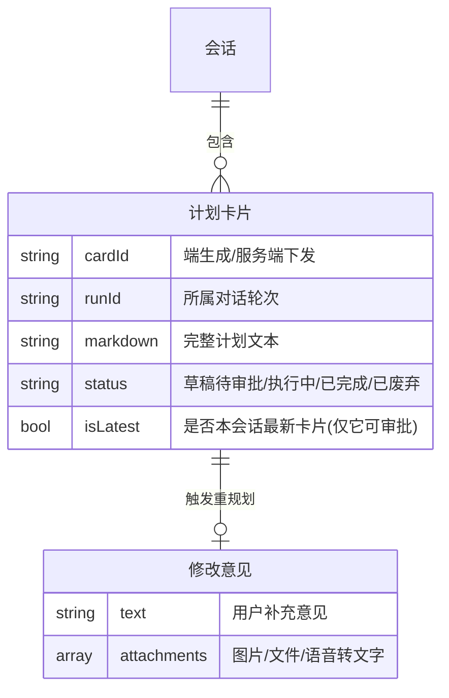
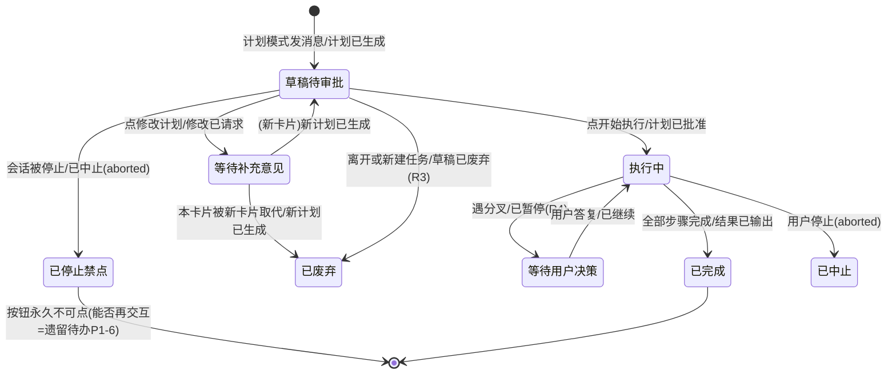
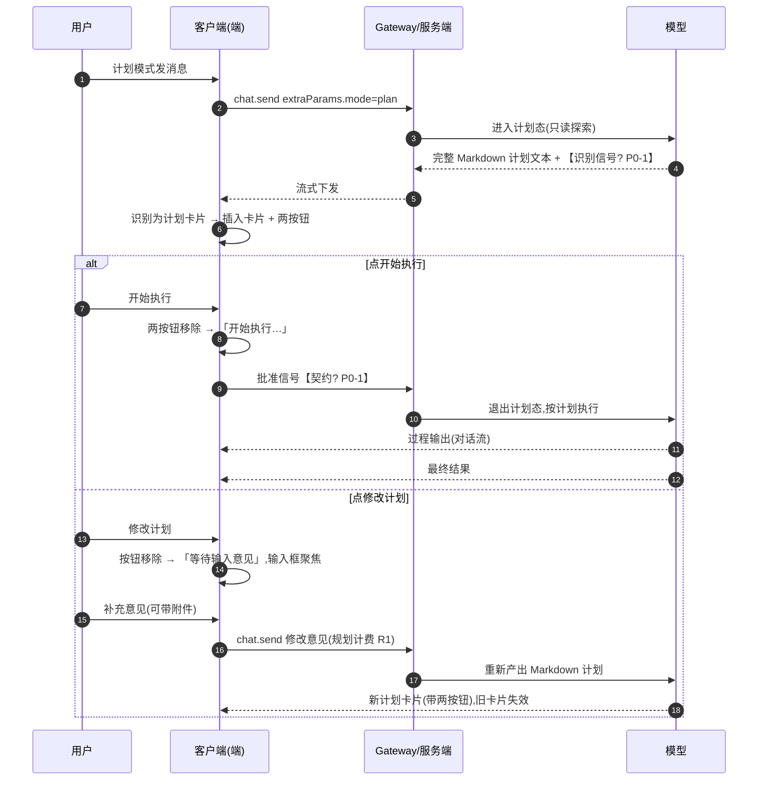
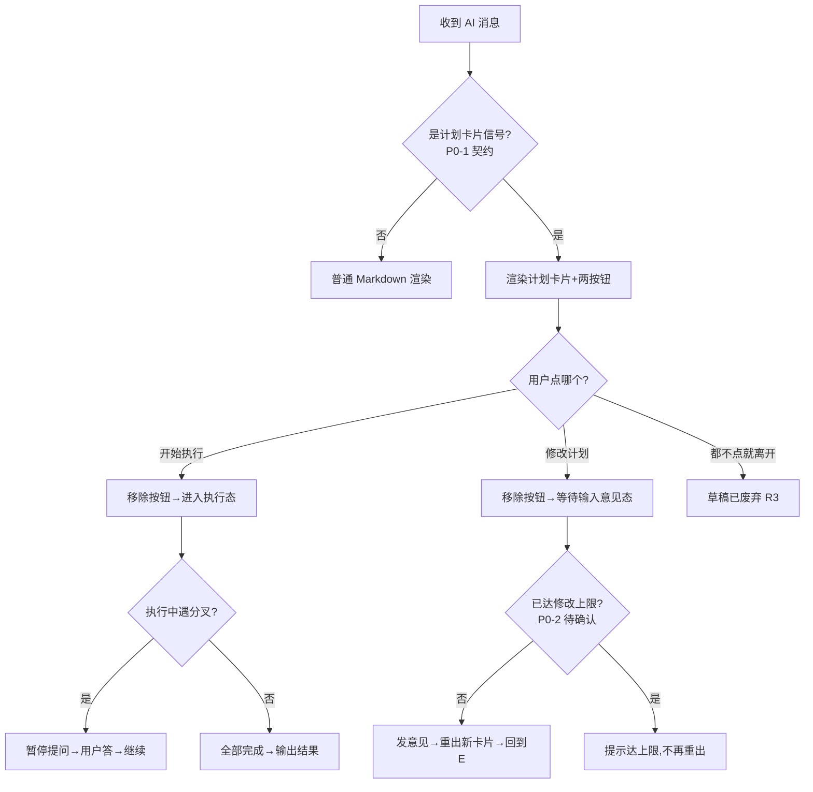
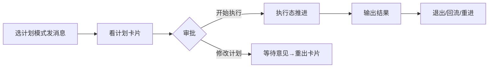

# 需求分析：纳米AI助理 · 计划模式结果展示计划卡片（二期）

**创建日期**：2026-07-06
**存放路径**：`Plans/需求分析/2026-07-06-纳米AI助理计划模式计划卡片.md`
**状态**：评审中
**真理源**：本文件为后续架构 / 开发 / 测试的唯一需求基准。
**输入**：PRD《纳米AI助理 · 模式选择器（二期）计划模式完整交互》（飞书 docx WLN4dylWWoFBM1xNFf3ccLQPnOg）+ Figma 37886-7206（0706 计划模式卡片）+ **接口文档**（飞书 docx Hh2rdLmLSo4cgyxiTALc69pJncf，`chat.answerPlan` 节点）。

> **一句话**：给 `agent:namiai` 的「计划模式」补上真正的差异化交互——AI 先出一张 Markdown 计划卡片，用户点「开始执行 / 修改计划」做审批闸门，批准后才进入执行态推进。

---

# 人类卷（产品/开发 3 分钟读完即可开工）

## A. 用户使用地图

| 角色   | 场景（什么时候）                | 任务（要干什么）                          |
| ---- | ----------------------- | --------------------------------- |
| 普通用户 | 底部模式胶囊已选「计划模式」，发一条较复杂需求 | 想先看 AI 的方案，对齐后再让它动手               |
| 普通用户 | 看到计划卡片，觉得方案 OK          | 点「开始执行」，让 AI 按计划推进                |
| 普通用户 | 看到计划卡片，想调整方向            | 点「修改计划」，补一句意见（可带图/文件/语音），AI 重出新卡片 |
| 普通用户 | 执行过程中 AI 遇到分叉提问         | 回答后让 AI 继续                        |
| 普通用户 | 杀进程/切设备后重进这条会话          | 希望看到之前那张卡片和它当时的状态（能不能再点按钮）        |

## B. 关键业务时刻

```text
用户选计划模式发消息 → 【计划已生成：卡片插入对话流，底部两按钮】
   → 分支A：点开始执行 → 【计划已批准：按钮移除，进入执行态推进】 → 【执行已完成：输出最终结果】
   → 分支B：点修改计划 → 【修改已请求：卡片进入"等待输入意见"，输入框聚焦】
            → 用户补意见发送 → 【新计划已生成：旧卡片按钮失效，新卡片带两按钮，回到闸门】
   → 分支C：未点按钮就离开/新建任务 → 【草稿已废弃：不执行、不计执行费】
```

| 时刻（事件） | 谁触发 | 用户看到/得到什么 |
|--------------|--------|-------------------|
| 计划已生成 | AI（计划态只读探索后产出） | 一张完整 Markdown 计划卡片 + 底部「修改计划 / 开始执行」 |
| 计划已批准 | 用户点「开始执行」 | 两按钮同时移除 → 显示「开始执行…」，进入执行态 |
| 修改已请求 | 用户点「修改计划」 | 两按钮移除 → 卡片下显示「等待输入意见」，输入框聚焦、键盘弹起 |
| 新计划已生成 | 用户提交修改意见 | 显示「提交修改意见…」→ AI 重出一张新计划卡片（新卡片重新带两按钮） |
| 执行已完成 | AI 跑完全部步骤 | 对话流展示过程输出 + 最终结果（不回写卡片） |
| 草稿已废弃 | 用户「开始执行」前离开/新建 | 计划不执行，只按规划口径计费（R1/R3） |

## C. 关键业务规则（Do / Don't）

- **Do**：审批操作始终以**最新一张**计划卡片为准；点任一按钮后，该卡片两按钮 + 草稿态提示**同时移除**，只留进行态文案。
- **Do**：计划卡片的「开始执行」**永远按计划模式执行**——即使用户已把胶囊切到目标/标准模式，这张卡片仍按已批准的计划走（R10）。
- **Do**：修改意见输入能力与普通消息对齐（图片/文件/语音转文字），附件解析计入**规划计费**（R1）。
- **Don't**：计划态**不产出正式结果、不消耗执行算力**；只做只读探索（查资料、设计方案）。
- **Don't**：执行进度**不回写计划卡片**（卡片是静态 Markdown，无步骤状态）；进度由对话流过程输出体现。
- **Don't**：「等待输入意见」态**无超时、无取消入口、不恢复按钮**；用户下一条消息即视为修改意见（含"不用改了按原计划来"这类反悔，AI 识别后重出同款卡片）。
- **本期不做**：目标模式维持一期形态（消息气泡下静态目标徽标），其完整交互（自主推进/中断/完成小结）留待后续版本。

## D. 需求问题清单（产品必读 · 不确认无法开工）

> 三类标签：🤔 不理解 / ⚔️ 矛盾 / 🕳️ 遗漏。**P0 不闭环禁止进架构/开发**。
> ✅ **原 P0-1（端如何识别计划卡片）已由接口文档 `chat.answerPlan` 节点解决**，详见底稿 §一·七 接口契约。
> ✅ **2026-07-06 客户端侧已拍板**：以下问题从客户端视角已全部有结论（见"结论"列），客户端阻塞清零；仅剩 2 条**待办**（多设备同步、执行态停止后可否再交互）不阻塞本期客户端开发。

| #        | 类   | 一句话问题 | ✅ 客户端结论（2026-07-06 拍板） |
| -------- | --- | ---------- | ------------------------------- |
| **P0-2** | ⚔️  | 修改次数限不限（D2 vs R12 矛盾） | **客户端不关心**——端不做次数限制/计数，无脑允许连续修改。若要限，是服务端下发提示，端只渲染，不自己拦。**已闭环（客户端无关）**。 |
| **P0-3** | 🕳️ | 历史/切设备后计划卡片按钮还能不能点 | **按钮可点 = `phase==toolCall` AND `会话未停止`（两个条件同时成立）**。① 收到 `toolResult`（phase=result）→ 不可点（正常审批已消费）。② **⚠️ 关键：用户主动停止后，tool 永远停在 `toolCall`、不会再来 `toolResult`**——所以单靠 phase 判定会让按钮永远可点，**必须叠加"会话已停止/中止(stopped/aborted)→ 一律不可点"**这一条把它兜住。历史 transcript 回读同理。**已闭环**。 |
| **P0-4** | 🕳️ | 多设备审批状态同步 | **本期先不考虑**，记为**待办**（多设备一致性）。不阻塞本期。 |
| **P1-5** | 🤔  | 等待输入意见态想问无关问题（无逃生舱） | **本期先不管**，接受"下一条消息即修改意见"设定。 |
| **P1-6** | 🕳️ | 执行态能否中止 | **可以停止**（复用聊天页现有「停止」能力）；但停止后**是否可再交互/重新开始执行**记为**待办**，本期不定。 |
| **P1-7** | 🤔  | answerPlan 与重出新卡片的时序渲染 | **客户端只管调接口**（`chat.answerPlan`）；具体节点怎么渲染**沿用现有节点渲染策略，无变化**——新 ExitPlanMode tool 事件回来就按既有 tool 渲染链渲染。**已闭环**。 |

**遗留待办**（不阻塞本期，记入 Epic 变更日志）：
1. 多设备下计划卡片审批状态同步（P0-4）。
2. 执行态用户主动停止后，能否再交互/重新开始执行（P1-6 后半）。

---

<!-- AI工作底稿 ↓ -->

# AI 工作底稿（供 architecture / test 阶段消费）

## 〇、战略层（Why）

- **痛点**：一期只搭了模式选择框架（标准/计划/目标胶囊 + 记忆），计划模式「可选中、可发起，但不改变对话过程」——和标准模式体验完全一样，差异化价值没落地。
- **量化目标**：让计划模式真正区别于标准模式 = 「先出方案 → 用户审批 → 批准后执行」闭环可用。
- **用户故事**：作为处理复杂任务的用户，我想在 AI 动手前先看到并确认它的计划，以便对齐方案、避免它跑偏后返工。
- **设计原理**：对齐 Claude Code 的 `EnterPlanMode`——计划 = 执行前审批闸门（`ExitPlanMode` 请求批准）。

---

## 一、PRD 摘要（3–5 句）

二期仅实现**计划模式**的完整差异化交互，目标模式不动。核心三件：① 计划卡片（完整 Markdown，端直接按 Markdown 渲染，**不做结构化 steps 列表**）；② 审批闸门（开始执行 / 修改计划，按钮单次消费、点后移除、以最新卡片为准）；③ 执行态推进（按计划逐步执行、过程走对话流、遇分叉暂停提问、完成输出结果）。计费上计划/修改按规划计费、执行才按过程计费。

---

## 一·五、范围层（What）

| 包含功能 | 优先级 |
|----------|--------|
| D1 计划卡片：Markdown 渲染 + 底部两按钮 + 草稿态标识 | P0 |
| D2 审批闸门：开始执行 / 修改计划 / 等待输入意见态 / 单次消费 / 最新卡片为准 | P0 |
| D2 修改意见支持附件（图片/文件/语音，复用普通输入能力） | P1 |
| D3 执行态推进：过程走对话流、遇分叉暂停、完成输出结果 | P0 |
| R 系列边界：草稿离开(R3)、切模式不影响当前计划(R5/R10)、弱网缓存(R9) | P0/P1 |
| S1/S2/S3 服务端：计划态只读探索、重规划、规划/执行分段计费 | P0（依赖服务端） |

**明确不做**：① 目标模式任何改动（维持一期静态徽标）；② 计划卡片的结构化步骤/进度回写（明确 Markdown 静态文本）；③ 一期已有的模式选择器/记忆/发起对话（复用不改）。

---

## 一·六、事件风暴 + 业务逻辑图

**⓪ 事件风暴表**

| 命令（动作） | 聚合 / 不变条件（业务规则） | 业务事件（过去式） |
|--------------|------------------------------|---------------------|
| 计划模式发消息（`extraParams.mode="plan"`） | 会话；计划态只读、不耗执行算力 | 计划已生成（卡片已插入） |
| 点「开始执行」 | 计划卡片；**仅最新一张可审批**、按钮单次消费 | 计划已批准（执行已开始） |
| 点「修改计划」 | 计划卡片；进入等待态、按钮移除、无超时 | 修改已请求（等待输入意见） |
| 提交修改意见（可带附件） | 会话；等待态下任意消息=修改意见 | 新计划已生成（旧卡片失效，新卡片带按钮） |
| 「开始执行」前离开/新建任务 | 草稿；不执行、不计执行费（R3） | 草稿已废弃 |
| 执行中遇分叉 | 执行态；不自行拍板（R4） | 已暂停等待用户决策 |
| 全部步骤完成 | 执行态 | 执行已完成（结果已输出） |

> **闭环自检发现的悬空项**（→ 已进 D 问题清单）：
> - 「计划已生成」缺**触发端识别的信号契约**（P0-1，命令有了但端收不到"这是计划卡片"这一事件语义）。
> - 「计划已批准/修改已请求」在**多设备**下缺同步事件（P0-4）。
> - 状态机存在「执行中 → 已中止」迁移但**无对应命令**（P1-6，用户停止未定义）。
> - 「草稿已废弃 / 各卡片态」缺**历史持久化事件**，重进无法还原（P0-3）。

**① 实体关系（ER 图）**



**② 状态机（计划卡片生命周期 · 迁移挂事件）**



> **关键**：`草稿待审批` 下若会话被停止（aborted），tool 仍停在 toolCall、**不会再来 toolResult**，卡片进入「已停止禁点」——按钮置灰。这是按钮态必须叠加"会话未停止"判定的原因（见 §D P0-3）。

**③ 主流程（时序）**



**④ 决策流程图**



### 画图后自检

- [x] 事件链闭环——**悬空项已全部转化为 D 问题清单**（P0-1 信号 / P0-3 持久化 / P0-4 多设备 / P1-6 中止）
- [x] 核心实体已识别（会话 / 计划卡片 / 修改意见）
- [x] 主路径 + 异常分支（离开草稿 / 遇分叉 / 修改上限）已画
- [x] 时序区分端/服务端/模型职责
- [x] 决策图菱形均有是/否出线
- [x] 退出/返回（离开=草稿废弃 R3）已体现

---

## 一·七、接口契约（来自接口文档 `chat.answerPlan` 节点 · 已定，非推测）

> 这是原 P0-1「端如何识别计划卡片」的答案。契约已明确，架构阶段直接落地。

**① 计划卡片下发（上游 → 端）**：一条 `stream:"nami_panel"` 外层事件，拆包后内层为 `stream:"tool"` 的 ExitPlanMode 工具调用：

```jsonc
// 外层 payload.stream = "nami_panel"，端已有 handleNamiPanelEvent 拆包（见落点）
// 拆包后内层：
{
  "stream": "tool",
  "data": {
    "phase": "start",
    "toolCallId": "toolu_014dLLRchCEbrB9JMMp3cFmF", // ★ 审批回传的 requestId
    "name": "ExitPlanMode",                          // ★ 端据此识别 = 计划卡片
    "originalToolName": "ExitPlanMode",
    "args": {
      "plan": "# 计划：...\n\n## Context...",        // ★ 完整 Markdown，卡片主体
      "planFilePath": "/Users/.../plans/xxx.md",
      "timeout": 300000                               // 300s（注意与 D2"无限期等待"的关系，见 P1）
    }
  }
}
```

**② 审批回传（端 → 上游）**：`chat.answerPlan` RPC：

```jsonc
{
  "type": "req",
  "method": "chat.answerPlan",
  "params": {
    "requestId": "toolu_014dLLRchCEbrB9...", // = 上面的 toolCallId 配对
    "approve": true,     // true=开始执行；false=打回修改
    "feedback": ""       // approve=false 时的修改意见，透传给模型
  }
}
```

**契约关键点**：
- **识别信号 = tool name `ExitPlanMode`**（对齐 Claude Code）。端只需在 tool 事件里判 `name == "ExitPlanMode"` 即渲染计划卡片。
- **卡片主体 = `args.plan`**（Markdown）；**审批句柄 = `toolCallId`**。
- **开始执行** = `answerPlan(approve:true)`；**修改计划** = `answerPlan(approve:false, feedback:<用户意见>)`。
- **timeout=300000（5 分钟）**：接口带超时，但 D2 明确"等待补充意见无限期、无超时"——**⚠️ 端 UI 语义与接口 timeout 存在口径差**，需与服务端确认超时后行为（见 P1-7 相邻问题）。

**契约仍未覆盖（→ 仍是 D 问题清单阻塞项）**：
- 历史 transcript 里 ExitPlanMode 回来后如何回读"已批准/已打回"状态（P0-3）。
- 多设备下审批后其他端的同步事件（P0-4）。
- answerPlan 打回后新计划的下发时序（P1-7）。

---

## 二、范围与入口矩阵


| 入口/场景 | PRD 描述 | 触发条件 | 目标 |
|-----------|----------|----------|------|
| 计划模式发消息 | D1 | 胶囊=计划模式 + 发送 | 生成计划卡片 |
| 开始执行 | D2 | 点最新卡片「开始执行」 | 进入执行态 |
| 修改计划 | D2 | 点最新卡片「修改计划」 | 等待输入意见态 |
| 提交修改意见 | D2 | 等待态发送任意消息 | 重出新计划卡片 |
| 执行遇分叉 | D3/R4 | 模型下发提问 | 暂停等用户决策 |

---

## 三、数据字典 / 字段规则（**关键契约缺口，需服务端补全**）

| 字段 | 类型 | 必填 | 来源 | 说明/疑问 |
|------|------|------|------|-----------|
| 计划卡片识别信号 | ？ | 是 | 服务端 | **P0-1：PRD 未定义**。端靠什么把 assistant 流认成计划卡片？tool 名 / stopReason / message metadata？ |
| markdown | String | 是 | 服务端 | 完整计划文本，端直接 Markdown 渲染 |
| cardId / runId | String | 是 | 服务端 | 卡片唯一标识 + 所属轮次；多卡片联动、最新卡片判定、历史还原都靠它 |
| status | Enum | 是 | 端+服务端 | 草稿待审批/执行中/已完成/已废弃；**P0-3：如何写进/读出 transcript 未定义** |
| isLatest | Bool | 是 | 端 | 仅最新卡片可审批；旧卡片按钮永久失效 |
| 修改意见 attachments | Array | 否 | 端 | 图片/文件/语音转文字，沿用普通消息限制；计入规划计费 R1 |
| 修改次数计数 | Int | ？ | ？ | **P0-2：D2 说不限、R12 说限 5 次，矛盾**；归属端还是服务端未定 |

---

## 四、边界情况清单

| # | 边界场景 | 期望行为 | PRD 是否写明 | 严重度 |
|---|----------|----------|--------------|--------|
| B1 | 计划态生成失败/超时 | 卡片生成失败的反馈？可否重试？ | ✗ 未写明 | P1 |
| B2 | 弱网/断网（R9） | 计划态/执行态本地缓存，恢复后同步 | ✓ 部分（同步细节缺） | P1 |
| B3 | 重进会话/切设备历史还原 | 卡片按当时 status 还原按钮态 | ✗ 未写明（P0-3） | P0 |
| B4 | 多设备并发审批 | A 点执行后 B 按钮同步移除 | ✗ 未写明（P0-4） | P0 |
| B5 | 修改反复不收敛 | 达上限提示（R12）——与 D2 矛盾 | ⚠ 矛盾（P0-2） | P0 |
| B6 | 等待态用户发无关消息 | 一律当修改意见，无逃生舱 | ✓ 写明但体验存疑（P1-5） | P1 |
| B7 | 执行态用户主动停止 | 未定义（P1-6） | ✗ 未写明 | P1 |

---

## 五、异常流程矩阵

| 触发条件 | 用户可见反馈 | 系统行为 | 可恢复 | PRD 写明 |
|----------|--------------|----------|--------|----------|
| 计划态产出失败 | ？ | ？ | ？ | ✗ |
| 「开始执行」网络失败 | 「开始执行…」卡住？回退按钮？ | ？ | ？ | ✗ |
| 修改意见发送失败 | ？（普通消息重试口径？） | 沿用普通消息 | ？ | ⚠ 隐含 |
| 达修改上限 | 提示可直接执行或新建（R12） | 不再重出卡片 | 是 | ⚠ 与 D2 矛盾 |
| 执行中断网（R9） | 本地缓存，恢复同步 | 缓存执行态 | 是 | ✓ 部分 |

---

## 五·五、集成与人机协同边界

| 集成点 | 类型 | 触发事件 | 失败/补偿 |
|--------|------|----------|-----------|
| chat.send（extraParams.mode=plan） | 同步 RPC | 计划模式发消息 | 沿用现有网络层（AES 签名） |
| 计划态只读探索（S1） | 服务端/模型 | 进入计划态 | 只读，不产出正式结果 |
| 审批信号回传（开始执行/修改） | ？ | 计划已批准/修改已请求 | **契约缺失 P0-1/P0-4** |
| 计费分段（S3/R1） | 服务端 | 规划期 vs 执行期 | 规划计费不含执行 |

**人机协同边界**

| 动作 / 事件 | 全自动 | AI建议+人工确认 | 纯人工 |
|-------------|:------:|:---------------:|:------:|
| 计划生成 | ☑ | | |
| 执行前确认（审批闸门） | | ☑ | |
| 遇分叉决策（R4） | | ☑ | |
| 执行推进 | ☑ | | |

---

## 六、逻辑问题

| # | 类型 | 问题 | PRD 摘录 | 严重度 |
|---|------|------|----------|--------|
| L1 | 自相矛盾 | 修改次数限不限 | D2「端不限制修改次数」 vs R12「连续达上限(默认5)→提示」【R12 自标待确认】 | **P0**（=P0-2） |
| L2 | 契约缺失 | 端无法识别计划卡片 | S1「产出完整 Markdown 计划文本供端渲染卡片」但无识别字段 | **P0**（=P0-1） |
| L3 | 口径隐含 | 卡片状态持久化未定 | R9 只说"状态本地缓存" | **P0**（=P0-3） |

## 七、交互冲突

| # | 场景 A | 场景 B | 问题 | 建议问产品 |
|---|--------|--------|------|------------|
| I1 | 等待输入意见态（无取消） | 用户想问无关问题 | 消息被强制当修改意见，无逃生舱 | 是否加"退出修改"入口（P1-5） |
| I2 | 多张历史计划卡片 | 只有最新可审批 | 旧卡片按钮失效的视觉表达 PRD 未描述 | 旧卡片按钮是隐藏还是置灰 |
| I3 | 执行态胶囊仍显示"计划" | 用户切到目标模式 | R5/R10 已明确"仅对下一条新消息生效"——**此条 PRD 讲清了，非问题**，列此备忘 | — |

## 八、整体需求遗漏（核心 KPI）



| 环节 | PRD 写明 | 若未写，缺什么 |
|------|----------|----------------|
| 计划卡片识别信号 | ✗ | **P0-1** 端识别契约（最致命，无此无法开工） |
| 卡片状态持久化+历史还原 | ✗ | **P0-3** transcript 存/读规则、重进按钮态 |
| 多设备审批同步 | ✗ | **P0-4** A 端审批 B 端按钮同步（本项目红线） |
| 执行态主动中止 | ✗ | **P1-6** 停止后卡片态/可恢复性 |
| 计划态失败反馈 | ✗ | B1 生成失败/超时的可见反馈与重试 |
| 修改上限口径 | ⚠ 矛盾 | **P0-2** 与 D2 对齐 |

---

## 九、验收标准（可测，Then 锚定事件）

| # | 验收项 | 锚定事件 | Given | When | Then（含事件已发生） | 优先级 |
|---|--------|----------|-------|------|---------------------|--------|
| AC1 | 计划卡片渲染 | 计划已生成 | 胶囊=计划模式 | 发一条复杂需求 | 对话流插入一张 Markdown 计划卡片，底部「修改计划/开始执行」，标未确认草稿态 | P0 |
| AC2 | 开始执行进执行态 | 计划已批准 | 最新卡片草稿态 | 点开始执行 | 两按钮+草稿提示同时移除，显示「开始执行…」，进入执行态推进 | P0 |
| AC3 | 修改计划进等待态 | 修改已请求 | 最新卡片草稿态 | 点修改计划 | 按钮移除，卡片下显示「等待输入意见」，输入框聚焦、键盘弹起 | P0 |
| AC4 | 提交意见重出卡片 | 新计划已生成 | 等待输入意见态 | 发送修改意见（可带附件） | 显示「提交修改意见…」→ 重出新计划卡片（新卡片带两按钮），旧卡片按钮失效 | P0 |
| AC5 | 反悔重出同款 | 新计划已生成 | 等待态 | 发"不用改了按原计划来" | AI 识别后重出同款计划卡片，可在新卡片点开始执行 | P1 |
| AC6 | 草稿离开不计执行费 | 草稿已废弃 | 卡片草稿态 | 未点开始执行就新建任务 | 计划不执行、无执行计费（仅规划计费 R1/R3） | P0 |
| AC7 | 计划归属优先胶囊 | 计划已批准 | 卡片草稿态且胶囊已切目标 | 点该卡片开始执行 | 仍按计划模式逐步推进，不按目标模式 | P0 |
| AC8 | 执行遇分叉暂停 | 已暂停等待决策 | 执行态 | 模型下发分叉提问 | 暂停提问，用户答复后继续（不自行拍板 R4） | P1 |
| AC9 | 停止后按钮禁点 | 已中止(aborted) | 计划卡片草稿态（停在 toolCall） | 用户点「停止」中止会话 | 该卡片「同意计划/修改计划」按钮**置灰不可点**；因 tool 停在 toolCall 不再来 toolResult，须靠会话停止态兜住 | P0 |
| **AC1-反** | 非计划模式不出卡片 | — | 胶囊=标准模式 | 发同样消息 | **不应**出现计划卡片，走普通即问即答 | P0 |
| **AC2-反** | 旧卡片不可审批 | — | 已有多张历史卡片 | 点非最新卡片按钮 | **不应**响应；审批仅最新卡片有效 | P0 |
| **AC6-反** | 计划态不耗执行算力 | — | 计划态 | 生成/修改计划 | **不应**产生执行计费，仅规划计费 | P0 |
| **AC9-反** | 停止会话仍不可审批 | — | 会话已停止、卡片仍停在 toolCall | 再点开始执行/修改计划 | **不应**响应、**不应**发 answerPlan；已停止会话禁止审批 | P0 |

**非功能验收**：历史还原（末轮 aborted 则禁点）、弱网缓存恢复（R9）；多设备一致性列为遗留待办。

---

## 十、待产品/服务端确认（阻塞项汇总）

✅ **2026-07-06 客户端侧已全部拍板，客户端阻塞清零**（详见 §D 结论列）：
- P0-1 识别信号 → 接口文档已定：tool `ExitPlanMode`，`args.plan`=Markdown，`toolCallId`=审批句柄。
- P0-2 修改次数 → 客户端不关心（端不限制，服务端要限则下发提示）。
- P0-3 历史/切设备按钮态 → **按 tool 阶段判定**：`toolCall`(phase=start)可点、`toolResult`(phase=result)禁点，无需额外持久化字段。
- P1-7 渲染时序 → 端只调 `answerPlan` 接口，节点渲染沿用现有 tool 渲染策略、无变化。

**遗留待办（不阻塞本期客户端开发，记入 Epic）**：
- P0-4 多设备审批状态同步。
- P1-6 后半：执行态停止后能否再交互/重新开始执行。
- P1-5 等待意见态逃生入口（本期不管）。
- B1 计划态生成失败/超时的反馈与重试（服务端侧，可后补）。

---

## 十一、分析结论

| 项 | 结论 |
|----|------|
| 一期基础 | ✅ 已落地：`NMAssistantWorkMode`（standard/plan/goal）、`NMAssistantWorkModeStore`（记忆+会话锁）、`extraParams.mode="plan"` 透传 |
| 二期新增 | 🆕 计划卡片/审批闸门/开始执行/修改计划 业务代码**零命中**，纯新增 |
| 可否进入架构设计 | ✅ **可进**。P0-1/2/3、P1-7 已闭环；剩余为不阻塞待办。`status: 已采纳`、`p0_open: 0`，门禁可放行 `/architecture-design-assistant` |
| 关联架构 plan | [ ] `Plans/技术方案/2026-07-06-纳米AI助理计划模式计划卡片.md`（下一步产出） |

### 落点预判（供架构阶段参考，非承诺）

- **Cell 体系**：新增 `NMChatPlanCardCellVM`（`NAMIWork/Features/ClawChat/ViewModel/CellViewModels/`），参考现有 `NMGeneratedAgentCardCellVM`（同为"带底部按钮的卡片 + 状态机"，本需求状态机高度相似）。
- **识别 + 命令链**：识别信号 = tool `name == "ExitPlanMode"`，落在 `NMChatCommandProcessor` 现有 tool 分支（`processSwarmPlanTool` 同款写法，`NMChatCommandProcessor.swift:289` 是先例）；`NMChatCommand` 增计划卡片 case；`NMChatViewModel.applyCommand` 落卡片态。
- **按钮态由 tool 阶段 AND 会话状态双重驱动**：`可点 = phase==toolCall && 会话未停止`。**⚠️ 主动停止后 tool 停在 toolCall 不会再来 toolResult**，故必须叠加停止判定——复用现有中止链路：本地停止镜像服务端 `aborted`（`NMChatCommandProcessor.swift:736`「用户停止的本地终态命令」+ `NMChatViewModel.swift:222`），计划卡片 CellVM 需订阅同一终态信号（final/error/aborted）把按钮置灰。历史恢复时若该轮已 aborted，同样禁点。
- **审批 RPC**：新增 `chat.answerPlan`（`GatewayRPCClient` 现**零命中**，需加），参数 `requestId`(=toolCallId)/`approve`/`feedback`。
- **红线提示**：触碰 Gateway 事件协议 + 聊天渲染链路，属**重量级**，架构阶段须走运行时/动态特性审查；多设备同步列为遗留待办不在本期。

---

## 续做

```
/resume plan=Plans/需求分析/2026-07-06-纳米AI助理计划模式计划卡片.md 进度=P0问题已澄清,进入架构设计
```

**下一阶段 Skill**：P0 闭环后 `/architecture-design-assistant`，引用本 plan。

---

## 反馈（skill_run）

```yaml
skill_run:
  skill: requirement-analyst
  plan: Plans/需求分析/2026-07-06-纳米AI助理计划模式计划卡片.md
  date: 2026-07-06
  contexts_used:
    - path: Contexts/需求分析/需求分析规范.md
      utility: high
      reason: "依 §〇事件驱动+§三四图 建卡片状态机与事件链,§五逐类挑逻辑/交互/遗漏定位P0-1识别信号等核心缺口"
    - path: Templates/需求分析-带验收标准模板.md
      utility: high
      reason: "分卷骨架(人类卷A/B/C/D + AI底稿)与AC正反例表结构单一可信源"
    - path: Templates/模板约定.md
      utility: high
      reason: "分卷分隔符与人类校验门禁"
  contexts_missing:
    - "计划模式/审批闸门(ExitPlanMode)端-服务端事件协议契约——库内无对照,PRD亦缺(本次最大阻塞P0-1)"
    - "对话卡片状态写入/读出transcript的通用规范(草稿/已消费/历史还原),多需求可复用"
    - "多设备场景下卡片类交互(审批/按钮)状态同步的通用口径"
  contexts_stale: []
```
