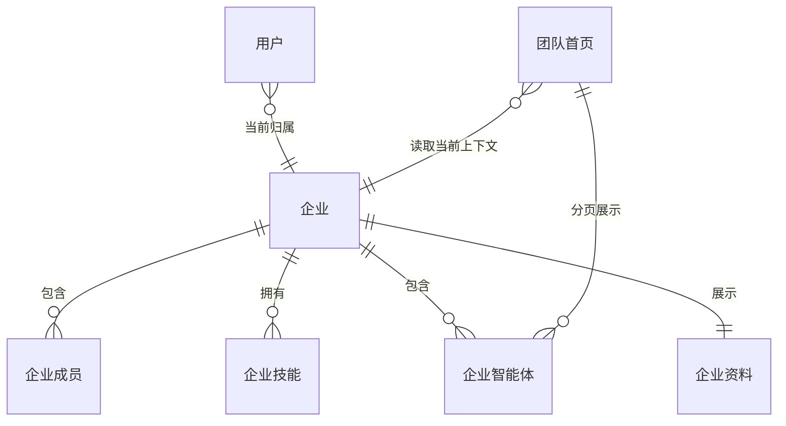
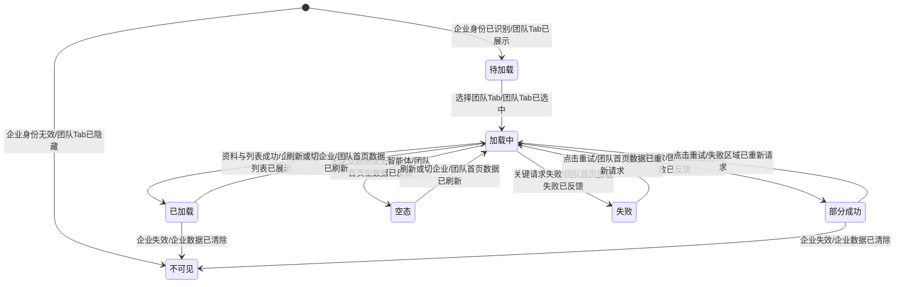
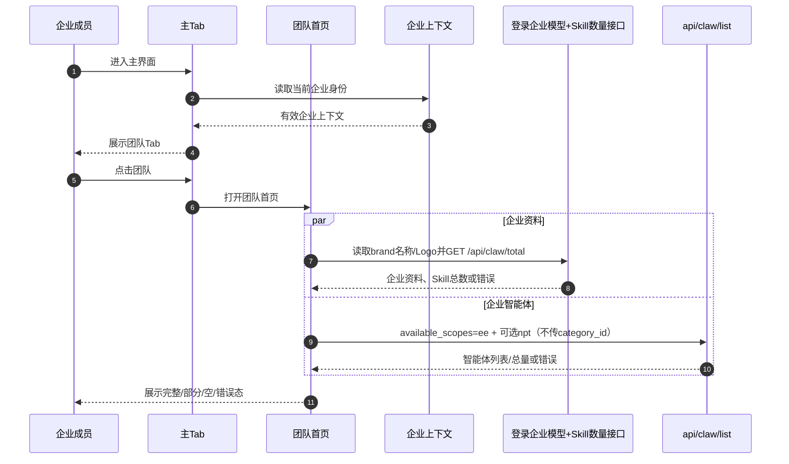
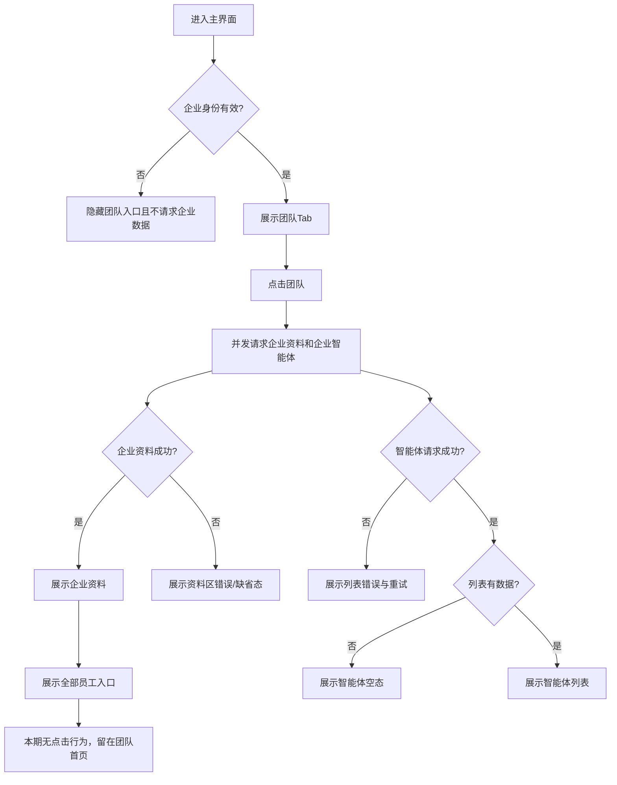
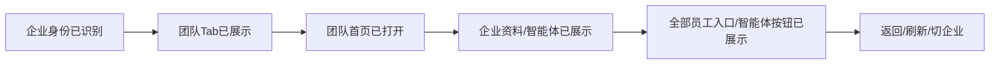

# 需求分析：团队首页

**创建日期**：2026-07-16  
**存放路径**：`Plans/需求分析/2026-07-16-团队首页.md`  
**状态**：已采纳（P0 已清零）  
**lifecycle_state**：requirement  
**真理源**：本文件为后续架构、开发和测试的唯一需求基准；产品结论须先回写本文。

**输入材料**：
- 口头需求：新增“团队”Tab；展示企业 Logo、名称、Skill/智能体数量、“全部员工”入口和企业智能体；`api/claw/list` 固定传 `available_scopes=ee`，不传 `category_id`。
- [新增团队入口后的首页（Figma `13:1519`）](https://www.figma.com/design/Ljv8hHoMjFRTNMdeEptgjI/移动端-0714?node-id=13-1519&m=dev)
- [团队首页（Figma `14:1090`）](https://www.figma.com/design/Ljv8hHoMjFRTNMdeEptgjI/移动端-0714?node-id=14-1090&m=dev)

---

# 人类卷（产品/开发 3 分钟读完即可评审）

## A. 用户使用地图

| 角色 | 场景（什么时候） | 任务（要干什么） |
|------|------------------|------------------|
| 企业成员 | 登录企业版后进入主界面 | 从底栏进入团队页，确认当前企业及团队规模 |
| 企业成员 | 想寻找企业提供的智能体 | 浏览企业智能体头像、名称和简介，并执行已确认的后续操作 |
| 企业成员 | 想查看企业成员 | 看到“全部员工”入口；组织架构页面与跳转下个任务实现 |
| 企业管理员 | 企业资料或成员发生变化后 | 返回团队页看到当前企业的最新资料和智能体 |
| 非企业用户 | 进入普通版主界面 | 不被错误展示企业数据或发起无企业上下文请求 |

## B. 关键业务时刻

```text
企业身份已被识别 → 团队 Tab 已被展示 → 团队 Tab 已被选中
→ 企业资料已被加载 + 企业范围智能体列表已被请求
→ 企业智能体列表已被展示 → “全部员工”入口与“雇佣”按钮视觉已被展示
```

| 时刻（事件） | 谁触发 | 用户看到/得到什么 |
|--------------|--------|-------------------|
| 当前企业身份已被识别 | 登录、切企业或构建主界面 | 团队入口按账号规则出现 |
| 团队 Tab 已被选中 | 企业成员点击“团队” | 进入团队首页并开始加载 |
| 企业资料已被加载 | 系统 | 企业 Logo、名称、Skill 数和智能体数 |
| 企业智能体列表已被展示 | 系统 | `available_scopes=ee` 范围内的智能体列表 |
| 组织架构入口已被展示 | 系统 | 本期仅展示“全部员工”入口，不承诺点击行为 |
| 团队首页加载失败/空数据已被反馈 | 系统 | 可理解、可恢复的空态或错误态 |

## C. 关键业务规则（Do / Don't）

- **Do**：“团队”Tab 仅企业账号展示；非企业账号保持原有底栏且不请求企业数据。
- **Do**：企业名称与 Logo 读取登录模型 `brand.company_name/company_logo`；多租户时使用当前租户对应字段。
- **Do**：`api/claw/list` 固定传 `available_scopes=ee`，不传 `category_id`；分页沿用 `npt`。
- **Do**：智能体数量等于 `available_scopes=ee` 范围下智能体总数；不得把首屏条数误作总数，若响应无总数字段，技术方案需定义完整计数方式。
- **Do**：Skill 数量请求 `GET /api/claw/total`，读取 `data.skill_total`；沿用登录态 Cookie 及平台要求的 `qid`、`tenant-id`、`idaas-uid` 请求头，本页不传可选分类参数。
- **Do**：企业资料与智能体列表允许独立加载、独立失败，成功区域不被另一失败清空。
- **Don't**：不得把 Figma 示例企业、数字或智能体作为线上兜底数据。
- **Don't**：“雇佣”本期只还原按钮视觉，不发请求、不改变状态、不展示成功/失败反馈。
- **Don't**：新增团队入口不得破坏首页、项目、专家、自动化、云盘、我的既有路由语义。
- **范围外**：组织架构页面及其跳转/业务逻辑、服务端企业资料维护、组织架构编辑、智能体创建/发布、智能体详情/会话跳转、雇佣业务功能。

## D. 需求问题清单（P0 已清零）

| # | 类 | 一句话问题 | 要产品拍板的 |
|---|----|-----------|-------------|
| P1-1 | ⚔️ 矛盾 | 两个 Figma 链接的文字描述与实际节点内容疑似对调 | 统一节点命名，确认 `13:1519` 是入口稿、`14:1090` 是团队页 |
| P1-2 | 🕳️ 遗漏 | 没写何时刷新以及切企业后如何清旧数据 | 首次加载、重复进入、下拉刷新、切企业策略 |
| P1-3 | 🕳️ 遗漏 | 当前代码有逻辑 Tab 下标与溢出槽位，新增后兼容规则没写 | 既有 DeepLink/统计/路由按语义兼容，不依赖旧裸下标 |
| P1-4 | 🕳️ 遗漏 | 用户被移出企业或企业失效时页面如何退场没写 | 清数据、跳转位置和提示文案 |

### 已拍板结论（2026-07-16）

| 原问题 | 结论 | 证据 / 落地约束 |
|--------|------|-----------------|
| 原 P0-1 Tab 展示人群 | 仅企业账号展示 | 非企业账号不展示团队 Tab，不请求企业数据 |
| 原 P0-2 企业智能体传参 | 固定传 `available_scopes=ee`，不传 `category_id` | 直接复用 `api/claw/list`，分页仅追加既有 `npt` |
| 原 P0-3 企业资料与数量 | 名称/Logo 取登录模型；智能体数为 `ee` 范围智能体总数；Skill 数走 `/api/claw/total` | `NMMineModel.brand.company_name/company_logo` 与 `tenant[]` 已存在；Skill 读取 `data.skill_total` |
| 原 P0-4 组织架构 | 本期只展示“全部员工”入口 | 组织架构页面、跳转和业务逻辑整体移到下个任务 |
| 原 P0-5 雇佣 | 只展示按钮，业务功能本期不做 | 按钮点击不发请求、不改状态；智能体卡片也不承诺跳转 |
| 原 P0-6 全状态 | 接受区域独立加载/空/失败/重试方案 | 企业资料区与列表区独立保留成功结果、独立重试 |

---

<!-- AI工作底稿 ↓ -->

# AI 工作底稿（供 architecture / test 阶段消费）

## 〇、战略层（Why）

- **痛点**：当前主界面没有企业团队聚合入口，企业成员无法在 App 内快速确认当前企业、查看组织成员入口和浏览企业智能体。
- **用户价值**：把企业身份、团队规模、组织入口和企业智能体集中到一个一级页面，减少跨页面查找。
- **量化目标**：需求输入未提供。建议产品补“团队页到达率、组织架构点击率、企业智能体点击/雇佣转化率、首屏成功率与耗时”。
- **用户故事**：作为企业成员，我想从首页一级 Tab 查看企业资料、成员入口和企业智能体，以便快速使用企业提供的组织与智能体能力。

## 一、PRD 摘要

1. iOS 首页底栏新增“团队”一级 Tab。
2. 团队页顶部展示企业 Logo、名称、Skill 数和智能体数，并提供“全部员工”入口。
3. 页面主体展示企业范围智能体；设计稿示例含头像、名称、简介和“雇佣”按钮。
4. 企业智能体复用现有 `api/claw/list`，固定传 `available_scopes=ee`、不传 `category_id`；现有分页游标为 `npt`。
5. “雇佣”本期只展示按钮；页面采用企业资料区与智能体列表区独立的加载、空、失败和重试状态。

## 一·五、范围层（What）

| 包含功能 | 优先级 |
|----------|--------|
| 主底栏增加团队入口与选中态 | P0 |
| 企业 Logo、名称、Skill 总数、智能体总数 | P0 |
| “全部员工”组织架构入口 | P0 |
| 企业范围智能体列表 | P0 |
| 加载、空、失败、重试、部分失败状态 | P0 |
| 企业切换与权限失效后的数据隔离 | P0 |
| 既有 Tab 路由、DeepLink、统计兼容 | P1 |
| “雇佣”按钮视觉还原（无业务行为） | P0 |

**明确不做**：组织架构页面及入口点击行为、服务端企业资料管理、组织架构编辑、智能体创建/发布、智能体详情/会话跳转、雇佣请求与状态流转。

## 一·六、事件风暴 + 业务逻辑图

### ⓪ 事件风暴表

| # | 命令（动作） | 聚合 / 不变条件（业务规则） | 业务事件（过去式） | 上游 / 下游 |
|---|--------------|------------------------------|---------------------|---------------|
| E1 | 进入主界面 / 切换企业 | 企业上下文：必须属于当前登录用户且有效 | 当前企业身份已被识别 | 登录/切企业 → E2 |
| E2 | 构建主 Tab | 主导航：仅企业账号展示团队入口 | 团队 Tab 已被展示 | E1 → E3 |
| E3 | 点击“团队” | 主导航：目标必须是团队首页 | 团队 Tab 已被选中 | E2 → E4/E5 |
| E4 | 加载企业资料 | 企业资料：数据必须属于当前企业 | 企业资料已被加载 | E3 → 顶部展示 |
| E5 | 请求企业智能体 | 企业智能体目录：固定 `available_scopes=ee`，不得传 `category_id`，分页可传 `npt` | 企业范围智能体列表已被请求 | E3 → E6/E10/E11 |
| E6 | 渲染列表 | 企业智能体目录：只展示 `ee` 范围结果 | 企业智能体列表已被展示 | E5 → E8/E9 |
| E7 | 渲染“全部员工”入口 | 企业组织：本期仅视觉展示，无页面与跳转逻辑 | 组织架构入口已被展示 | E4 → 留在团队首页 |
| E8 | 渲染智能体卡片 | 智能体：本期不承诺卡片跳转 | 企业智能体卡片已被展示 | E6 → 留在当前页 |
| E9 | 渲染“雇佣”按钮 | 企业智能体：仅视觉展示，无业务行为 | 雇佣按钮已被展示 | E6 → 点击不发请求 |
| E10 | 请求失败/超时 | 页面加载状态：成功区域不可被错误清空 | 团队首页加载失败已被反馈 | E4/E5 → 重试 |
| E11 | 企业/列表为空 | 页面加载状态：不得展示假数据 | 团队首页空数据已被反馈 | E4/E5 → 空态 |
| E12 | 下拉刷新/再次进入/切企业 | 团队页数据：只接纳当前企业最新响应 | 团队首页数据已被刷新 | E1/E4/E5 → 新数据 |

**闭环检查**：E7/E8/E9 已按“纯展示、无业务行为”闭环；E10/E11 采用区域独立状态。Skill 数量接口和企业智能体范围参数均已确认，P0 已清零。

### ① 实体关系（ER 图）



### ② 状态机（团队首页加载状态）



### ③ 主流程时序



### ④ 用户路径决策图



## 二、范围与入口矩阵

| 入口/场景 | 当前材料 | 触发条件 | 目标页面 / 结果 |
|-----------|----------|----------|-----------------|
| 主底栏“团队” | Figma `13:1519` | 仅有效企业账号 | 团队首页 `14:1090` |
| “全部员工” | Figma `14:1090` | 企业资料已展示 | 仅视觉入口；本期无页面、跳转和业务行为 |
| 智能体卡片 | Figma `14:1090` | 列表有数据 | 本期仅展示，无跳转承诺 |
| “雇佣” | Figma `14:1090` | 列表有数据 | 仅视觉按钮；点击不发请求、不改变状态 |
| 下拉刷新 | 未提供 | 页面可见 | 推荐只重拉当前企业数据 |
| 企业切换 | 现有应用能力 | 当前企业变化 | 清旧数据并加载新企业 |

## 三、数据字典 / 字段规则

| 字段 | 类型 | 必填 | 长度/范围 | 默认值 | 来源 | 校验/激活 | 疑问 |
|------|------|------|-----------|--------|------|-----------|------|
| enterprise_id | String | 是 | 非空 | 无 | 企业上下文 | 请求前必须与当前账号匹配 | 是否显式传给各接口 |
| enterprise_logo | URL/String | 否 | 合法图片地址 | 缺省企业图标待设计 | 当前登录 `brand.company_logo` / 当前 `tenant.company_logo` | 图片失败展示占位 | 多租户取当前 tenant |
| enterprise_name | String | 是 | 最大长度待定 | 不得用示例名 | 当前登录 `brand.company_name` / 当前 `tenant.company_name` | 超长截断规则待设计 | 多租户取当前 tenant |
| skill_total | Int | 是 | ≥0 | 0 | `GET /api/claw/total` 的 `data.skill_total` | 使用服务端总量；请求沿用 Cookie、`qid`、`tenant-id`、`idaas-uid` | 本页不传 `category_id/team_user_qid/organization_id` |
| agent_total | Int | 是 | ≥0 | 0 | `api/claw/list?available_scopes=ee` | 企业范围全部智能体数量，不得使用首屏条数冒充总数 | 响应无 total 时需完整计数 |
| available_scopes | String | 是 | 固定枚举 | `ee` | 产品确认 | 请求 `api/claw/list` 时固定传入 | 不传 `category_id` |
| npt | String | 否 | 接口游标 | 无 | `api/claw/list` | 分页连续、去重 | 首次请求不传 |
| agent_id | String | 是 | 非空 | 无 | `api/claw/list` | 列表项与跳转主键 | 返回字段名 |
| agent_avatar | URL/String | 否 | 合法图片地址 | 缺省头像 | `api/claw/list` | 加载失败占位 | — |
| agent_name | String | 是 | 最大长度待定 | 不展示空名项或占位待定 | `api/claw/list` | 单行截断 | — |
| agent_intro | String | 否 | 最大长度待定 | 空简介展示规则待定 | `api/claw/list` | 设计稿约 1–2 行 | 精确行数 |
| hire_button | UI-only | 是 | 按 Figma | “雇佣” | 本地静态文案 | 仅视觉展示，不触发业务 | 无需 hire_status |

## 四、边界情况清单

| # | 边界场景 | 期望行为 | PRD 是否写明 | 严重度 |
|---|----------|----------|--------------|--------|
| B1 | 非企业账号 / 企业上下文为空 | 隐藏团队入口且不请求企业数据 | 是（2026-07-16 拍板） | P0 已闭环 |
| B2 | 企业存在但无企业智能体 | 展示企业资料与智能体空态，不展示示例数据 | 否 | P0 |
| B3 | 智能体总量超过单页 | 沿用 `available_scopes=ee` 分页、排序和去重，总数不随已加载条数变化 | 是 | P0 已闭环 |
| B4 | 企业名称、智能体名称、简介超长 | 按设计截断，不挤压 Logo、入口和操作按钮 | 部分 | P1 |
| B5 | 数量为 0、极大值或字段缺失 | 0/缺失展示规则明确，大数字不破版 | 否 | P1 |
| B6 | 快速切 Tab、重复进入、重复重试 | 合并/取消旧请求，只渲染当前企业最新响应 | 否 | P1 |
| B7 | 企业 A 请求未完成时切到企业 B | A 响应作废，不得覆盖 B 页面 | 否 | P0 |
| B8 | 企业被移除、失效或权限下降 | 清除敏感缓存并按 P1-4 退场 | 否 | P1 |
| B9 | 企业资料成功、列表失败（或相反） | 成功区域保留，失败区域单独提示和重试 | 否 | P0 |
| B10 | 智能体已下架 / 雇佣按钮被点击 | 卡片和按钮本期均不触发业务请求，不产生状态变化 | 是（2026-07-16 拍板） | P0 已闭环 |
| B11 | 小屏、刘海屏、底部安全区 | 7 个视觉入口等宽可点，文本和安全区不重叠 | 仅默认稿 | P1 |
| B12 | 既有路由使用旧逻辑下标 | 路由语义保持正确，新增团队不导致错跳 | 否 | P1 |

## 五、异常流程矩阵

| 触发条件 | 用户可见反馈 | 系统行为 | 是否可恢复 | PRD 是否写明 |
|----------|--------------|----------|------------|--------------|
| 企业上下文校验失败 | 隐藏团队入口；若已在团队页则按 P1-4 提示并离开 | 清企业页面数据，不发后续请求 | 是，重新登录/切企业 | 部分 |
| 企业资料接口 4xx | 企业资料区错误或无权限提示 | 不展示旧企业敏感数据；列表按权限决定是否保留 | 条件可恢复 | 否 |
| `api/claw/list` 4xx / `ee` 范围无效 | 列表错误态与重试 | 不把其他范围列表当成功结果 | 是，契约修正/重试 | 是 |
| 任一接口 5xx / 超时 | 对应区域错误态与重试 | 记录诊断日志，保留另一成功区域 | 是 | 否 |
| 图片加载失败 | 企业 Logo/头像占位 | 不影响文本与列表操作 | 是，图片重试 | 否 |
| 分页失败 | 列表底部重试，不清已加载项 | 保留游标与已加载项，避免重复追加 | 是 | 否 |
| 切企业时旧请求回包 | 用户无额外提示 | 丢弃与当前企业不匹配的响应 | 自动恢复 | 否 |
| 智能体下架 | 提示不可用并刷新列表 | 不进入失效详情/会话 | 是，刷新 | 否 |
| 点击“雇佣”按钮 | 无业务反馈 | 不发网络请求、不修改模型、不刷新列表 | 不涉及 | 是（2026-07-16 拍板） |

## 五·五、集成与人机协同边界

| 集成点 / 异步任务 | 类型 | 触发事件 | 失败/补偿策略 |
|-------------------|------|----------|---------------|
| 企业上下文 | 本地/服务状态 | 当前企业身份已被识别 | 失效则清数据并按 P1-4 退场 |
| 登录企业模型 | 本地登录态 | 团队 Tab 已被选中 | 读取当前 `brand/tenant`；缺失则隐藏入口/退场 |
| `GET /api/claw/total` | 同步 API | 团队 Tab 已被选中 | 读取 `data.skill_total`；区域级错误与重试，不使用假数据 |
| `api/claw/list` 企业范围 | 同步分页 API | 企业范围智能体列表已被请求 | 固定 `available_scopes=ee`、不传 `category_id`；分页重试、旧企业响应丢弃 |
| “全部员工”入口 | 本地 UI | 企业资料已被展示 | 仅视觉展示，无路由和外部集成 |
| “雇佣”按钮 | 本地 UI | 雇佣按钮已被展示 | 无外部集成、无请求、无补偿 |

| 动作 / 事件 | 全自动 | AI建议+人工确认 | 纯人工 |
|-------------|:------:|:---------------:|:------:|
| 识别企业身份、加载资料和列表 | ☑ | ☐ | ☐ |
| 查看“全部员工”入口 | ☑ | ☐ | ☐（本期只渲染） |
| 点击智能体卡片或“雇佣”按钮 | ☐ | ☐ | ☑（本期无业务结果） |
| 刷新/重试 | ☐ | ☐ | ☑ |

## 六、逻辑问题

| # | 类型 | 问题 | PRD 现状 | 严重度 |
|---|------|------|----------|--------|
| L1 | 已闭环 | “雇佣”仅展示按钮，本期不实现请求、状态或结果反馈 | 2026-07-16 产品拍板 | 已闭环 |
| L2 | 已闭环 | 智能体数为 `available_scopes=ee` 全部智能体数；Skill 数取 `/api/claw/total.data.skill_total` | 参数、字段与口径均已确认 | 已闭环 |
| L3 | 已闭环 | “全部员工”本期只展示入口 | 页面、跳转与业务逻辑下个任务实现 | 已闭环 |

## 七、交互冲突

| # | 场景 A | 场景 B | 问题 | 建议问产品 |
|---|--------|--------|------|------------|
| I1 | 新增“团队”一级入口 | 当前底栏代码保留逻辑 Tab 和隐藏云盘映射 | 新入口会改变视觉顺序与逻辑下标 | 是否确认顺序为首页/项目/专家/团队/自动化/云盘/我的，并要求 DeepLink 语义兼容 |
| I2 | 设计稿列表按钮为“雇佣” | 本期不做业务功能 | 保留视觉但点击无请求，避免被误认为已完成能力 | 已拍板：不承诺卡片跳转或雇佣结果 |
| I3 | 企业资料与列表来自不同数据源 | 设计表现为一个完整页面 | 一个成功一个失败时采用区域独立状态 | 已拍板：成功区域保留，失败区域独立重试 |
| I4 | Figma 输入描述称“团队tab/首页” | 节点实际内容相反 | 开发可能对错节点 | 确认 `13:1519` 为入口稿、`14:1090` 为团队页 |

## 八、整体需求遗漏



| 环节 | PRD 是否写明 | 若未写，缺什么 | 补全方案 |
|------|--------------|----------------|----------|
| 入口人群 | 是 | 仅企业账号展示 | 已闭环：非企业隐藏且不请求 |
| 数据来源 | 是 | — | 企业名称/Logo 复用登录模型；Skill 取 `/api/claw/total.data.skill_total`；智能体列表固定 `available_scopes=ee` |
| 列表规则 | 部分 | 排序、分页、去重、总数 | A 沿用 `api/claw/list` 标准契约；B 产品指定新规则 |
| 组织架构 | 是 | 本期只显示入口 | 页面、路由、权限和返回整体延期到下个任务 |
| 智能体操作 | 是 | 按钮只展示，不做卡片/雇佣业务 | 已闭环：无请求、无状态变化 |
| 状态异常 | 是 | 加载、空、失败、重试、部分失败 | 已闭环：区域独立状态 |
| 刷新与数据隔离 | 否 | 缓存、重复进入、切企业 | A 短缓存+下拉强刷+切企业失效；B 每次进入全量请求 |
| 权限退场 | 否 | 被移出企业/企业失效 | A 清数据回首页并提示；B 保留入口展示失效页 |
| 埋点与指标 | 否 | 页面、入口、组织架构、智能体操作 | 补页面曝光/点击/成功率/耗时与错误码 |
| 无障碍与适配 | 否 | 7 入口点击区、动态字体、小屏 | 明确最小点击区、VoiceOver 文案和截断规则 |

## 九、验收标准（Given-When-Then）

| # | 验收项 | 锚定事件 | Given（前置） | When（操作/命令） | Then（期望，含事件已发生） | 优先级 |
|---|--------|----------|---------------|-------------------|---------------------------|--------|
| AC1 | 团队入口展示 | 团队 Tab 已被展示 | 用户具有有效企业上下文 | 主界面构建完成 | 底栏按确认顺序出现团队入口，且“团队 Tab 已被展示”事件发生；非企业账号不展示 | P0 |
| AC2 | 进入团队首页 | 团队 Tab 已被选中 | 团队入口已显示 | 用户点击团队 | 入口呈选中态并打开 `14:1090` 页面，“团队 Tab 已被选中”事件发生 | P0 |
| AC3 | 企业资料展示 | 企业资料已被加载 | 当前登录模型与数量接口成功 | 页面渲染顶部 | 名称/Logo 来自当前 `brand/tenant`；Skill 数等于 `/api/claw/total.data.skill_total`；智能体数为 `available_scopes=ee` 全量总数，E4 发生 | P0 |
| AC4 | 企业范围请求 | 企业范围智能体列表已被请求 | 用户具有有效企业上下文 | 页面请求智能体 | `api/claw/list` 固定传 `available_scopes=ee`，不传 `category_id`；下一页只追加 `npt`，E5 发生 | P0 |
| AC5 | 智能体列表 | 企业智能体列表已被展示 | 企业智能体返回至少一项 | 列表渲染 | 每项展示头像、名称、简介并按设计截断，E6 发生 | P0 |
| AC6 | 全部员工入口 | 组织架构入口已被展示 | 企业资料已展示 | 页面渲染 | “全部员工”入口视觉与 Figma 一致；本期不实现页面、跳转或业务行为，E7 发生 | P0 |
| AC7 | 非企业账号 | — | 用户无有效企业上下文 | 主界面构建完成 | 隐藏团队入口且不发企业数据请求 | P0 |
| AC8 | 区域部分失败 | 团队首页加载失败已被反馈 | 企业资料成功、智能体失败（或相反） | 两请求完成 | 成功区域保留，失败区域显示错误与重试，E10 发生 | P0 |
| AC9 | 空智能体 | 团队首页空数据已被反馈 | 企业存在且智能体总数为 0 | 列表渲染 | 展示确认空态、不展示示例卡片，E11 发生 | P0 |
| AC10 | 分页 | 企业智能体列表已被展示 | 总量超过单页 | 滚动触发下一页 | 后续请求继续传 `available_scopes=ee` 并追加 `npt`，去重追加，总数不随已加载数波动 | P0 |
| AC11 | 企业切换 | 团队首页数据已被刷新 | 页面显示企业 A | 切到企业 B | A 数据立即失效，只接纳 B 响应，E12 发生 | P0 |
| AC12 | 并发旧响应 | — | 企业 A 请求未完成且已切企业 B | A 响应晚于 B 返回 | A 响应不得覆盖 B 页面 | P0 |
| AC13 | 弱网重试 | 团队首页数据已被刷新 | 请求超时或离线 | 用户点击失败区域重试 | 只重试失败区域，成功后展示真实数据并清错误态 | P1 |
| AC14 | 视觉边界 | 企业智能体列表已被展示 | 企业名/智能体名/简介超长、数字位数大 | 页面渲染 | 文案按确认行数截断，Logo、入口、操作区和底栏不重叠 | P1 |
| AC15 | 既有路由回归 | — | 新增团队入口后 | 触发首页/项目/专家/自动化/云盘/我的既有路由 | 每条仍到原语义目标，不因旧下标错跳团队 | P1 |
| AC16 | 企业失效 | 企业数据已被清除 | 用户停留团队页 | 企业失效/用户被移出 | 清除企业数据并按 P1-4 规则退场，不继续展示敏感信息 | P1 |
| AC17 | 雇佣按钮纯展示 | 雇佣按钮已被展示 | 企业智能体列表有数据 | 页面渲染并点击“雇佣” | 按钮视觉与 Figma 一致；点击不发请求、不修改状态、不展示业务结果 | P0 |
| AC1-反 | 不串企业 | — | 当前企业为 B | A 的缓存或响应到达 | 不应展示 A 的名称、数量、成员或智能体 | P0 |
| AC4-反 | 不请求错误范围 | — | 页面请求企业智能体 | 检查请求参数 | 不应传 `category_id`，也不应缺少或篡改 `available_scopes=ee` | P0 |
| AC17-反 | 不做雇佣业务 | — | 本期仅还原按钮 | 用户连续点击“雇佣” | 不应产生接口请求、loading、成功/失败提示或列表状态变化 | P0 |

**非功能验收**：首屏性能阈值、缓存 TTL、列表最大量、VoiceOver、动态字体与埋点尚无产品指标，进入技术方案前至少确认性能与埋点口径。

## 十、待产品 / 设计 / 服务端确认

**P0：无。**

**已关闭 P0**：团队 Tab 仅企业账号展示；`api/claw/list` 固定传 `available_scopes=ee` 且不传 `category_id`；企业名称/Logo 取登录模型；智能体数取 `ee` 范围全量总数；Skill 数取 `GET /api/claw/total` 的 `data.skill_total`；“全部员工”只做入口视觉，组织架构页面下个任务实现；“雇佣”只做视觉；采用区域独立全状态。

**P1（技术方案/测试前确认）**：Figma 节点命名、刷新缓存、逻辑 Tab 路由兼容、企业失效退场、埋点/性能/无障碍。

## 十一、分析结论

| 项 | 结论 |
|----|------|
| 事件风暴 | ✅ E1–E12 已建立；雇佣已收敛为纯展示事件 |
| 四图 | ✅ ER、状态机、时序、决策图已完成 |
| 实例化需求 | ✅ 17 条正向 AC + 3 条反例，覆盖主链路、边界、异常与回归 |
| 可否进入架构设计 | ✅ 可以；P0 已清零，`status: 已采纳`、`p0_open: 0` |
| 关联架构 plan | [ ] `Plans/技术方案/2026-07-16-团队首页.md`（下一阶段创建） |

## 阶段执行记录

| WBS | Skill | 结果 |
|-----|-------|------|
| 1 | event-storming-assistant | E1–E12、角色交互与热点已形成 |
| 2 | spec-by-example-assistant | ≥10 组 GWT 已完成，并收敛为 AC1–AC17 + 反例 |
| requirement review | requirement-analyst | 分卷、四图、数据字典、边界、异常与 Push 清单已完成 |

## 续做

```text
/resume plan=Plans/需求分析/2026-07-16-团队首页.md 进度=需求已采纳，P0已清零，下一步进入技术方案
```

**下一阶段 Skill**：调用 `/architecture-design-assistant`。

## 反馈（skill_run）

```yaml
skill_run:
  skill: requirement-analyst
  plan: Plans/需求分析/2026-07-16-团队首页.md
  date: 2026-07-16
  contexts_used:
    - path: Contexts/需求分析/需求分析规范.md
      utility: high
      reason: "用于按事件驱动、四图、分卷、边界异常与可测 AC 完成需求评审"
    - path: Templates/需求分析-带验收标准模板.md
      utility: high
      reason: "用于落实人类卷四件套、AI 底稿与工作流要求的章节契约"
    - path: Templates/模板约定.md
      utility: high
      reason: "用于保持 Plan frontmatter、分卷分隔符与续做格式一致"
  contexts_missing: []
  contexts_stale: []
  outcome_status: pass
  friction: ""
  revisit_needed: false
```
