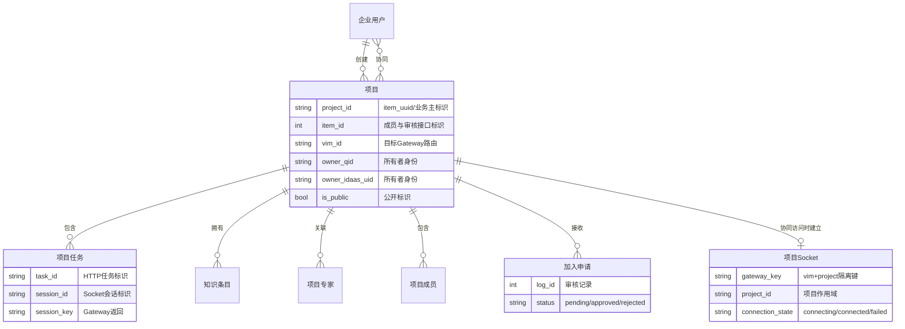
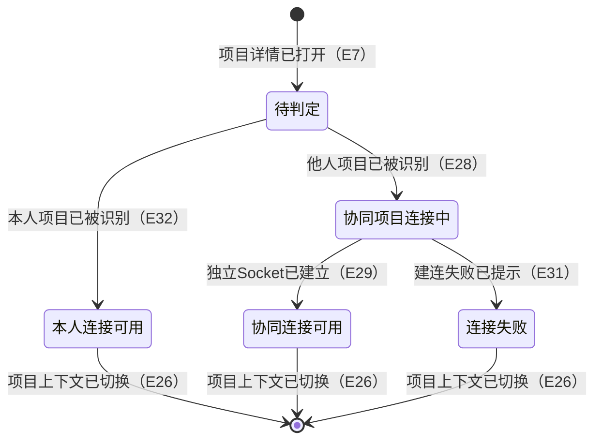
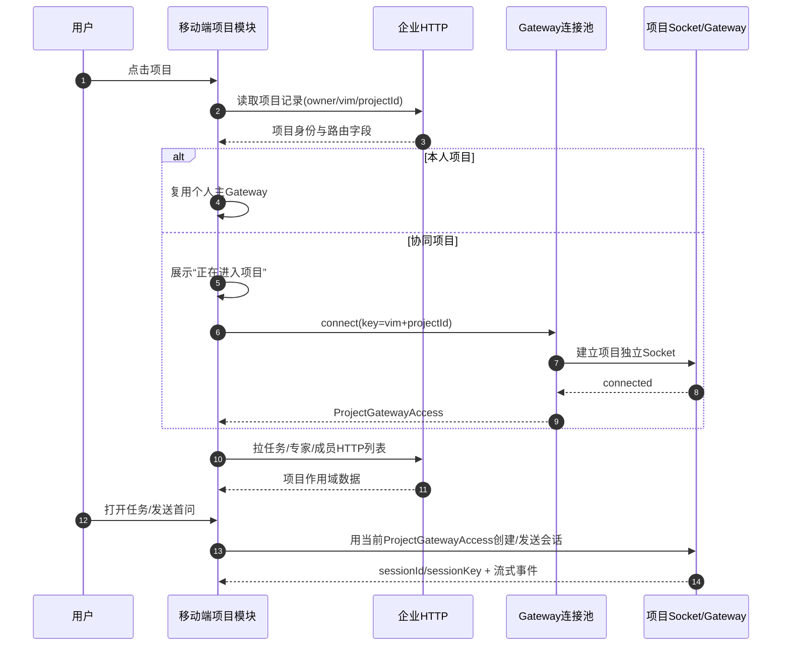
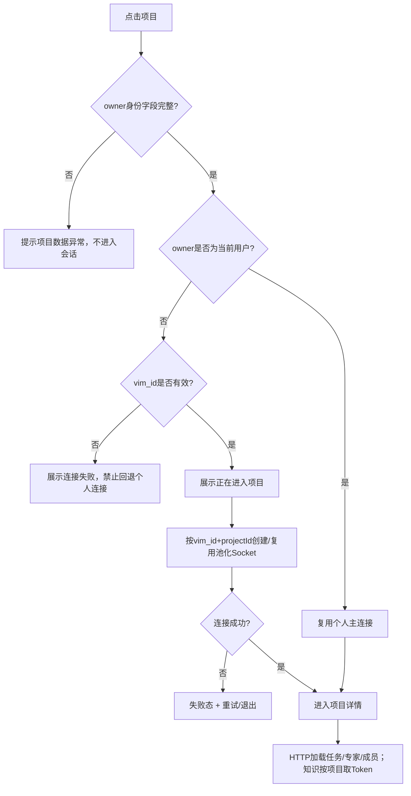

# 事件风暴：项目模块重构

**目标**：把现有移动端项目模块升级为项目列表 + 任务/知识/专家/成员四 Tab，并明确 Gateway、HTTP、项目知识库 Token 三类能力的边界。

## 需求一句话

用户在移动端查看和创建项目，进入项目后管理任务、知识、专家与成员；创建沿用现有 Gateway 能力，任务/专家/成员改用 HTTP 数据源，知识库按项目获取独立 Token；进入非本人创建的项目时，为该项目创建独立 Socket 会话，未明确逻辑参考 Web 端。

**需求来源**：

- Geelib《企业版移动版客户端》：<https://geelib.qihoo.net/geelib/knowledge/doc?spaceId=4424&docId=435879#anchor=1f34df0b2c474581a5b9e14591e715fd>（已读取 2026-07-27 修订版）
- Figma：项目列表 `209:3939`
- Figma：任务 Tab `209:3723`
- Figma：成员 Tab `264:1883`
- Figma：管理成员 `209:4157`
- Figma：申请记录 `219:10371`

**技术事实来源**：

- 移动端现有实现：`NamiWork/NAMIWork/Features/Projects/`
- Web 端参考：`openclaw360-web/specs/features/projects/SPEC.md`
- Web 端项目知识 Token：`openclaw360-web/src/lib/yunpan/project-token.ts`
- Web 端成员管理：`openclaw360-web/src/ui/controllers/project-members.ts`
- Web 端他人项目 Gateway 路由：`openclaw360-web/src/ui/enterprise-gateway-pool.ts`
- 移动端通用连接池：`NamiWork/NAMIWork/Core/Services/GatewayCore/ConnectionPool/NMGatewayConnectionPool.swift`
- 移动端池化 Chat Access：`NamiWork/NAMIWork/Features/ClawChat/GatewayAccess/NMPooledChatGatewayAccess.swift`

---

## 人类卷 A：用户使用地图

| 谁     | 从哪里进入            | 想完成什么                 | 最终得到什么                  |
| ----- | ---------------- | --------------------- | ----------------------- |
| 项目创建者 | 底部“项目”→项目列表      | 创建/编辑项目，管理任务、知识、专家与成员 | 项目使用本人资源，成员协作状态可控       |
| 项目协作者 | 项目列表中的协同项目       | 进入项目并继续任务、使用项目知识和专家   | 经独立连接使用项目所有者资源，不与个人对话串线 |
| 项目管理员 | 成员 Tab→管理成员/申请记录 | 批量增删成员、处理协作申请         | 权威成员列表和申请状态同步更新         |
| 未加入员工 | 团队模块→公开项目        | 只读浏览并申请协同             | 申请中/通过后不重复提交            |

## 人类卷 B：关键业务时刻

1. 用户进入项目列表，同时看到本人项目和协同项目，公开项目有明确标识。
2. 用户创建项目时继续复用 Gateway；成功后由 HTTP 项目列表完成对账。
3. 用户进入本人项目时直接复用个人连接；进入他人项目时先看到连接中，再建立项目独立 Socket。
4. 进入详情后，任务/专家/成员列表从 HTTP 获取，任务会话和流式消息使用当前项目对应 Socket。
5. 切到知识 Tab 时为当前项目准备专属 Token，项目切换后旧 Token 立即失去使用资格。
6. 管理成员时勾选新增、取消普通成员，确认后批量提交；任何协作者都不能删除项目所有者。
7. 从团队模块查看未加入项目时四 Tab 只读，申请中或已通过时不能重复申请。

## 人类卷 C：业务规则 Do / Don't

| Do | Don't |
|----|-------|
| 本人项目复用个人主连接 | 不为所有项目无差别新建 Socket |
| 他人项目按目标 VIM + 项目 ID 建独立 Socket | 不允许他人项目回退个人主连接 |
| 任务列表走 HTTP，任务会话走项目 Socket | 不把 HTTP DTO 当作 Socket 会话真源 |
| 协作者对话使用项目所有者资源 | 不消耗协作者个人云主机/算力豆/模型 |
| 知识 Token 与项目严格绑定 | 不跨项目复用 Token |
| 成员确认后批量修改，owner 永不可删 | 不因取消勾选删除项目所有者 |
| 未加入项目只读 | 不在只读态暴露写入口 |

## 人类卷 D：需求问题清单

| 优先级 | 类型     | 需要拍板的问题              | 当前建议                    |
| --- | ------ | -------------------- | ----------------------- |
| P1  | 🤔 不理解 | 页面标题“知识广场”是否为最终产品文案  | 无新结论时按 2026-07-27 Figma |
| P1  | 🕳️ 遗漏 | 四 Tab 空态/错误态是否有新增视觉稿 | 无新增稿则沿用移动端通用状态组件        |
| P1  | 🕳️ 遗漏 | 他人项目 Socket 空闲回收时长   | 沿用现有连接池 LRU 与生命周期清理     |

> 终审结论：以上均不改变核心业务结果，可在设计/架构阶段落定；当前无 P0 阻塞。

<!-- AI工作底稿 ↓ -->

## 一、参与角色

| 角色 | 关注点 | 是否确认 |
|------|--------|----------|
| 项目创建者 | 创建项目、配置项目、管理专家与成员、处理加入申请 | ☐ |
| 项目成员 | 查看项目内容、使用任务/知识/专家能力、邀请成员的权限边界 | ☐ |
| 待加入员工 | 提交加入申请、查看申请结果 | ☐ |
| 产品 | 四 Tab 范围、角色权限、申请状态与异常流程 | ☐ |
| 移动端开发 | 混合协议编排、数据模型复用、Token 隔离、缓存防串 | ☐ |
| 测试 | 项目切换、权限、空/错/分页态、旧请求回包与 Token 串用 | ☐ |
| 设计 | 五个节点的页面链路、四 Tab 与成员管理状态 | ☐ |

---

## 二、领域事件墙

| # | 事件（过去式） | 触发命令 | 聚合/对象 | 上游 | 下游 |
|---|----------------|----------|-----------|------|------|
| E1 | 项目列表页已打开 | 点击底部“项目”入口 | 项目列表 | App 导航 | E2/E4 |
| E2 | 项目列表已加载 | 拉取项目列表 | 项目集合 | E1 | E3/E7 |
| E3 | 项目列表加载失败已提示 | 项目列表请求失败 | 项目集合 | E2 | 重试→E2 |
| E4 | 项目创建流程已打开 | 点击创建入口 | 项目草稿 | E1 | E5 |
| E5 | 项目已通过 Gateway 创建 | 提交项目名称/图标/配置 | 项目 | E4 | E6 |
| E6 | 新项目已进入 HTTP 项目集合 | 创建成功后刷新/对账 | 项目集合 | E5 | E2/E7 |
| E7 | 项目详情已打开 | 点击项目卡片 | 当前项目上下文 | E2 | 本人项目→E8/E12/E17/E21；他人项目→E28 |
| E8 | 项目任务列表已加载 | 切到“任务”Tab | 项目任务集合 | E7 | E9/E10 |
| E9 | 项目任务已打开 | 点击任务 | 项目会话 | E8 | 会话页 |
| E10 | 项目新任务已创建 | 输入问题并发送 | 项目会话 | E8 | E11 |
| E11 | 项目任务列表已刷新 | 新任务创建/任务状态变化 | 项目任务集合 | E10 | E8 |
| E12 | 项目知识 Token 已获取 | 进入项目/切到“知识”Tab | 项目知识访问上下文 | E7 | E13 |
| E13 | 项目知识列表已加载 | 携项目 Token 拉取知识目录 | 项目知识库 | E12 | E14/E15 |
| E14 | 项目知识已新增或上传 | 创建目录/上传文件 | 项目知识库 | E13 | E13 |
| E15 | 项目知识已修改或删除 | 重命名/移动/删除 | 项目知识库 | E13 | E13 |
| E16 | 旧项目知识 Token 已失效 | 切换项目/退出账号 | 项目知识访问上下文 | E12/E13 | 新项目→E12 |
| E17 | 项目专家列表已加载 | 切到“专家”Tab | 项目专家集合 | E7 | E18/E19 |
| E18 | 项目专家已选中并用于任务 | 点击专家/输入框选择专家 | 项目专家选择 | E17 | E10 |
| E19 | 项目专家集合已更新 | 添加/移除专家 | 项目专家集合 | E17 | E17 |
| E20 | 下架或失效专家已被过滤/降级 | 专家接口返回失效项 | 项目专家集合 | E17 | E17 |
| E21 | 项目成员列表已加载 | 切到“成员”Tab | 项目成员集合 | E7 | E22/E24 |
| E22 | 成员管理页已打开 | 点击“管理成员” | 成员管理会话 | E21 | E23 |
| E23 | 项目成员集合已同步 | 选择/取消成员并提交 | 项目成员集合 | E22 | E21 |
| E24 | 加入申请记录已加载 | 打开“申请记录” | 加入申请集合 | E21/E22 | E25 |
| E25 | 加入申请已通过或拒绝 | 点击通过/拒绝 | 加入申请 | E24 | E21/E24 |
| E26 | 项目上下文已切换 | 从项目 A 进入项目 B | 当前项目上下文 | E7 | 旧请求作废→E8/E12/E17/E21 |
| E27 | 当前项目子模块加载失败已提示 | HTTP/Token/Gateway 请求失败 | 当前项目子资源 | E8/E12/E17/E21 | 对应模块重试 |
| E28 | 他人项目已被识别 | 比较项目所有者与当前用户身份 | 项目访问上下文 | E7 | E29 |
| E29 | 他人项目独立 Socket 会话已建立 | 使用项目 `vim_id` + 项目 ID 建连 | 项目 Gateway 会话 | E28 | E8/E9/E10 |
| E30 | 他人项目任务已通过独立 Socket 打开或创建 | 打开任务/发送首问 | 项目会话 | E29 | 会话页/流式事件 |
| E31 | 他人项目 Socket 建连失败已提示 | 独立 Socket 超时/鉴权失败 | 项目 Gateway 会话 | E29 | 重试；禁止回退个人连接 |
| E32 | 本人项目已被识别 | 比较项目所有者与当前用户身份 | 项目访问上下文 | E7 | 复用个人主连接→E8/E9/E10 |

---

## 三、热点与分歧

| # | 优先级 | 热点 | 类型 | 当前证据 / 推进建议 | 处理状态 |
|---|--------|------|------|----------------------|----------|
| H1 | P0 | Geelib 正文尚未读取，页面范围、权限和接口细节可能不完整 | 不理解 | 已读取《企业版移动版客户端》2026-07-27 修订版；范围含项目协作、成员管理、申请加入、协作者对话与公开配置 | ✅ 已闭环 |
| H2 | P0 | Gateway 创建结果如何与 HTTP 项目列表的 `projectId` / `item_id` / `item_uuid` 对账 | 遗漏 | HTTP 展示/Socket 路由以 `item_uuid` 为项目主标识；numeric `item_id` 仅用于成员/审核接口；`vim_id` + owner 身份用于协同项目 Gateway 路由 | ✅ 已闭环 |
| H3 | P0 | “任务走 HTTP”指任务列表，还是连任务创建/移动/删除也全部改 HTTP | 不理解 | 任务列表/展示数据走 HTTP；任务会话创建、打开、发送、终止与流式事件属于 Socket/Gateway 会话能力 | ✅ 已闭环 |
| H4 | P0 | 任务 HTTP 与现有 `NMProjectSession*` 是否同构，`sessionKey`/`sessionId` 是否仍由 Gateway 返回 | 矛盾 | HTTP DTO 通过 Mapper 投影到领域展示模型；Socket 会话的 `sessionKey/sessionId` 仍以目标 Gateway 返回为准，禁止客户端猜测 | ✅ 已闭环 |
| H5 | P0 | 专家 HTTP 的列表、增删、下架过滤与执行专家字段是否同构现有 `NMProjectExpertRow` | 遗漏 | 专家读写走 HTTP；Provider 继续管理项目专家统一状态；DTO 同构才直接复用，否则新建 Mapper，业务层不绑定传输结构 | ✅ 已闭环 |
| H6 | P0 | 成员管理权限：创建者、普通成员分别可查看、邀请、移除、审核哪些动作 | 遗漏 | PRD：创建者与协作者权限基本一致，但协作者不能删除项目所有者；管理页勾选/取消后确认批量修改；搜索仅本部门范围 | ✅ 已闭环 |
| H7 | P0 | 项目知识 Token 的 HTTP 路径、请求字段、缓存时长与失败策略 | 遗漏 | 按 Web 参考 `POST /api/brand/claw/yp/project_token?appsource=so`，body `project_id`；Token/云盘 Service 以项目隔离，切项目重新准备；失败禁止复用旧项目 Token | ✅ 已闭环 |
| H8 | P0 | 申请记录的范围、分页、状态枚举和通过/拒绝后的成员刷新规则 | 遗漏 | 申请列表/审核走 `/api/items/audit_list` 与 `/api/items/audit`；按 pending/approved/rejected 展示；处理成功刷新申请与成员权威列表 | ✅ 已闭环 |
| H9 | P1 | 项目列表、任务、专家、成员各自的空态/错误态/分页/下拉刷新设计未在给定节点中完整出现 | 遗漏 | 可沿用当前移动端通用状态组件，但需产品/设计确认 | 待确认 |
| H10 | P1 | Figma 项目页标题显示“知识广场”，是否为正式产品命名 | 矛盾 | 五个节点均沿用“知识广场”，但顶层 frame 名为“项目/任务/成员”等 | 待确认 |
| H11 | P0 | 非本人项目是否必须创建独立 Socket 会话 | 规则 | 用户已明确“如果不是自己的项目，需要创建新的 Socket 对话”；本人项目复用个人主连接，他人项目禁止误用个人连接 | ✅ 用户已定 |

### 三·一、已确认 Socket 业务规则

- R-S1：本人项目继续复用个人主 Gateway 连接；非本人项目必须创建或复用该项目对应的独立 Socket 会话。
- R-S2：项目归属判定必须基于 HTTP 项目记录的所有者身份与当前企业身份；现有移动端已具备 `ownerQID`、`ownerIdaasUID`、`vimID` 字段，具体优先级在字段契约确认后定稿。
- R-S3：他人项目 Socket 必须按目标 Gateway/VIM 与项目 ID 隔离；不得仅用会话 ID 或项目名称作为连接池 key。
- R-S4：他人项目的会话创建、历史消息、发送、终止和流式事件必须使用同一个项目 Socket 上下文。
- R-S5：他人项目 Socket 建连失败时展示失败并允许重试，禁止静默回退到个人主连接。
- R-S6：项目 A→B 快速切换时，A Socket 的晚到事件不得写入 B 项目；登出、企业切换和环境切换必须清理池化连接。
- R-S7：移动端现有 `NMGatewayConnectionPool`、`NMPooledChatGatewayAccess`、`NMChatGatewayAccessStore` 可作为复用候选；是否直接复用由技术方案阶段决定。

---

## 四、角色-系统交互

| 角色 | 命令 | 系统行为 | 结果事件 | 异常 |
|------|------|----------|----------|------|
| 项目创建者 | 新建项目 | 复用既有 Gateway 创建能力；成功后用 HTTP 列表对账 | E5/E6 | Gateway 成功但 HTTP 暂未收录时不得重复创建 |
| 项目用户 | 打开项目 | 建立 currentProject 上下文，按需加载四 Tab | E7 | 项目失效/无权限时退出详情并刷新列表 |
| 项目用户 | 查看任务 | 通过 HTTP 拉任务并映射到展示模型 | E8 | 字段不兼容时使用独立 DTO/Mapper |
| 项目用户 | 发起任务 | 按最终契约创建会话并发送首问 | E10/E11 | 创建成功、列表延迟时需对账而非生成假 ID |
| 他人项目成员 | 打开项目任务/发起任务 | 识别非本人项目→建立项目独立 Socket→使用同一项目 Gateway 上下文完成会话操作 | E28/E29/E30 | 建连失败不得回退个人连接；旧项目事件不得串入当前项目 |
| 项目用户 | 查看知识 | 获取当前项目专属 Token 后加载目录 | E12/E13 | Token 失败不得回退使用上一个项目 Token |
| 项目用户 | 切换项目 | 取消/失效旧项目请求、Token 与缓存写入 | E16/E26 | A 项目晚回包不得覆盖 B |
| 项目用户 | 查看/选择专家 | HTTP 拉取项目专家并更新统一 Provider | E17/E18 | 失效专家不应成为默认执行专家 |
| 有管理权限的用户 | 管理专家 | 通过专家 HTTP 增删并回灌 Provider | E19 | 部分失败需以服务端权威列表回滚 |
| 项目成员 | 查看成员 | HTTP 拉取成员列表 | E21 | 无权限/空列表/分页失败需区分 |
| 有邀请权限的用户 | 邀请成员 | 加载组织候选并提交选中成员 | E22/E23 | 重复成员、缺租户身份、部分失败 |
| 项目创建者/管理员 | 处理申请 | 拉申请记录并通过/拒绝，成功后刷新成员 | E24/E25 | 重复审核应幂等或展示服务端最终态 |

---

## 五、输出到实例化需求

- 必须覆盖的主链路事件：E1–E31。
- 必须写成 Given-When-Then 的边界：Gateway 创建成功但 HTTP 暂未收录；本人项目复用个人连接；他人项目创建独立 Socket；同一他人项目重进复用连接；A→B 快速切项目；独立 Socket 建连失败且禁止回退个人连接；Token 获取失败；任务/专家 DTO 不同构；无管理权限；重复邀请；申请重复审核；空/错/分页态。
- 暂不纳入范围：项目内会话底层流式协议重构、Web 端非移动页面能力、未出现在需求/Figma 中的项目搜索与高级设置。
- H1–H8 已闭环，可进入实例化需求与终审。

---

## 六、核心规则

| # | 规则 | 适用角色 | 反例 |
|---|------|----------|------|
| R1 | 项目列表合并展示“我的项目”和“我协同的项目”，公开项目显示公开标识 | 企业用户 | 只展示本人创建项目 |
| R2 | 创建项目继续使用既有 Gateway 接口；企业版创建/编辑默认公开，可后续修改 | 项目创建者 | 改用 HTTP 创建；默认私密 |
| R3 | Gateway 创建成功后以返回项目 ID 对账 HTTP 列表；HTTP 暂未收录时不得重复创建 | 项目创建者 | 因列表延迟再次提交创建 |
| R4 | 本人项目直接进入并复用个人主 Gateway 连接 | 项目创建者 | 为本人项目额外创建池化 Socket |
| R5 | 非本人项目先展示连接中，再创建或复用该项目独立 Socket 会话 | 项目协作者 | 使用个人主连接访问所有者项目 |
| R6 | 协作者对话使用项目所有者的云主机、算力豆、模型等资源 | 项目协作者 | 使用协作者个人资源 |
| R7 | 协作者与创建者权限基本一致，但任何协作者都不能删除项目所有者 | 项目协作者 | 成员管理把 owner 取消 |
| R8 | 任务、专家、成员列表及管理数据走 HTTP；项目会话创建/发送/历史/流式走项目对应 Socket | 全部项目用户 | 任务列表继续绑定个人 Gateway |
| R9 | HTTP DTO 与现有领域模型同构且协议已抽象时复用，否则使用独立 DTO + Mapper | 移动端 | 为复用 UI 强行让传输模型污染领域层 |
| R10 | 知识库使用当前项目专属 Token；切项目、退出账号、切企业后旧 Token 不得复用 | 全部项目用户 | 项目 B 复用项目 A Token |
| R11 | 项目成员管理采用“勾选即加入、取消即移除、确认后批量提交”，成员搜索只覆盖本部门 | 有成员管理权限的用户 | 输入关键字搜索全公司员工 |
| R12 | 团队模块进入未加入项目时，任务/专家/成员/知识均只读；申请中或已通过时“申请协同”置灰 | 未加入/申请中用户 | 未加入仍能编辑成员或知识 |
| R13 | 申请记录区分 pending/approved/rejected；通过或拒绝后以服务端最终状态刷新 | 项目创建者/管理员 | 仅本地改状态，不刷新成员 |
| R14 | 所有项目级异步结果必须携带项目/企业作用域；旧项目晚回包不得覆盖当前项目 | 全部项目用户 | A 项目 Socket/HTTP 回包写入 B |

---

## 六·一、业务逻辑四图

### ① ER 图：核心实体与身份/连接关系



### ② 状态机：项目连接生命周期



### ③ 时序图：本人项目与协同项目的数据/会话分流



### ④ 决策流程图：进入项目与连接失败分支



## 六·二、数据字典

| 字段 | 业务含义 | 来源 | 必需性 / 规则 |
|------|----------|------|---------------|
| `projectId` | 项目业务主标识 | HTTP `item_uuid`，Gateway project id | P0 必填；缓存、Token、Socket、会话均以此作用域隔离 |
| `itemId` | 成员/审核接口使用的 numeric id | HTTP `id/item_id` | 成员列表、移除、申请审核时必填 |
| `vimId` | 项目所有者 Gateway/云主机路由 | HTTP `vim_id` | 他人项目建连必填；本人项目不因此新建连接 |
| `ownerQID` | 项目所有者 QID | HTTP `qid/userinfoid` | 与 ownerIdaasUID 共同判定归属 |
| `ownerIdaasUID` | 项目所有者企业身份 | HTTP `idaas_uid/userinfoid` | 优先用于企业身份匹配；缺失时按契约回退 ownerQID |
| `currentIdaasUID` | 当前企业用户身份 | 登录/企业上下文 | 项目归属判定必填 |
| `isPublic` | 是否在团队模块公开展示 | HTTP `is_pub` / Gateway create-update | 企业创建默认 true，可编辑 |
| `gatewayKey` | 池化连接唯一键 | `vimId + projectId` 规范化生成 | 不含 Token；同项目复用、跨项目隔离 |
| `sessionId` | 项目任务会话 ID | 项目 Socket/Gateway | 禁止从 HTTP task id 猜测 |
| `sessionKey` | 项目任务会话路由 Key | 项目 Socket/Gateway | 会话所有 RPC 与事件过滤使用同一 key |
| `knowledgeToken` | 项目知识库访问凭据 | project_token HTTP | 仅对对应 projectId 生效，不跨项目复用 |
| `memberIsMaster` | 是否项目所有者 | 成员 HTTP `is_master` | true 时不可移除 |
| `applicationStatus` | 加入申请状态 | 审核 HTTP | pending/approved/rejected |

## 六·三、集成边界

| 能力 | 权威来源 | 客户端职责 | 禁止事项 |
|------|----------|------------|----------|
| 项目创建/编辑 | Gateway | 校验、提交、HTTP 对账 | 不改为 HTTP create |
| 项目/任务/专家/成员展示 | 企业 HTTP | DTO 映射、作用域防串、状态展示 | 不依赖个人 activeRPC 拉列表 |
| 项目会话 | 当前项目 Gateway Access | 选择个人/池化 Access、传递到 Chat、隔离事件 | 不默认全部使用 personal Access |
| 知识库 | project token + 云盘服务 | 按项目准备/失效 Token | 不复用上一项目 Token |
| 成员/申请 | 企业 HTTP | 权限控制、批量差异、终态刷新 | 不允许删除 owner |

## 六·四、终审问题扫描

| 分类 | 结论 | 严重度 |
|------|------|--------|
| 逻辑矛盾 | “任务走 HTTP”与“协同项目新 Socket”已拆为列表/展示走 HTTP、会话/流式走 Socket，无冲突 | 已闭环 |
| 交互冲突 | 本人项目直接进入；协同项目展示连接中；失败停留错误态，不出现先进入再跳出的闪烁 | 已闭环 |
| 整体遗漏 | 标题文案、空错态新增视觉、Socket 空闲 TTL 未在 PRD 定稿，但都有安全默认且不改变业务结果 | P1 |
| 安全/隔离 | owner/vim/projectId 缺失即阻断；Token/Socket/异步回包均按项目与企业作用域隔离 | 已闭环 |

---

## 七、边界情况清单

| # | 边界场景 | 期望行为 | 严重度 |
|---|----------|----------|--------|
| B1 | 项目列表同时含本人、协同、公开项目 | 合并展示并按项目记录显示公开标识；不得重复 | P0 |
| B2 | Gateway 创建成功但 HTTP 列表短暂未返回新项目 | 保留创建结果/加载态并有限重试对账；禁止重复创建 | P0 |
| B3 | 项目缺 owner 身份 | 不得擅自判为本人项目；阻断 Socket 会话并提示数据异常 | P0 |
| B4 | 本人项目有 `vim_id` | 仍按 owner 身份复用个人主连接，不因 `vim_id` 误建新 Socket | P0 |
| B5 | 非本人项目缺 `vim_id` | 显示连接失败/项目暂不可用；禁止回退个人连接 | P0 |
| B6 | 同一协同项目重复进入 | 复用同一项目池化连接，不重复建连 | P1 |
| B7 | 从协同项目 A 快速切到 B | A 的 HTTP/Socket 晚回包全部丢弃；B 使用独立作用域 | P0 |
| B8 | 同一所有者的两个协同项目 | 连接 key 仍包含项目 ID，事件和会话不得串项目 | P0 |
| B9 | 连接池达到上限 | 按既有 LRU 策略淘汰最久未用连接；当前活跃会话不串线 | P1 |
| B10 | 项目知识 Token 获取失败 | 显示知识加载失败，可重试；不得使用旧项目 Token | P0 |
| B11 | 任务/专家 HTTP 字段与现有模型不同构 | 经独立 Mapper 映射；缺必需 ID 的行丢弃并记录 | P1 |
| B12 | 项目所有者出现在成员选择列表 | 始终锁定已选且不可取消 | P0 |
| B13 | 成员批量提交包含重复/失效人员 | 客户端去重；服务端拒绝时刷新权威成员列表 | P1 |
| B14 | 成员搜索为空或仅空白 | 不发搜索请求，恢复本部门候选列表 | P1 |
| B15 | 加入申请已被他端处理 | 当前操作返回最终状态后刷新，不重复写入 | P1 |
| B16 | 未加入项目从团队模块进入 | 四 Tab 只读；不能创建任务、改专家/成员或写知识 | P0 |
| B17 | 退出登录、切企业或切环境 | 清理项目 Token、池化 Chat Access 与 Socket 连接 | P0 |

---

## 八、异常流程矩阵

| 触发条件 | 用户可见反馈 | 系统行为 | 是否可恢复 |
|----------|--------------|----------|------------|
| 项目列表 HTTP 4xx/5xx/超时 | 列表错误态 + 重试 | 不展示其它企业缓存 | 是 |
| Gateway 创建失败 | 保留创建页输入并提示失败 | 不刷新 HTTP 列表，不生成本地项目 ID | 是 |
| 创建成功、HTTP 对账超时 | 显示“项目已创建，正在同步” | 使用 Gateway 返回 ID 幂等重试列表，不再次 create | 自动/手动重试 |
| 协同项目 Socket 建连超时/鉴权失败 | 项目连接失败页 + 重试 | 不打开会话，不回退个人连接 | 是 |
| 协同项目 Socket 中途断开 | 会话离线态/重连提示 | 仅重连当前项目 key；发送按钮受连接态控制 | 是 |
| 任务 HTTP 失败 | 任务 Tab 错误态 + 重试 | 不清其它 Tab 已加载数据 | 是 |
| 项目知识 Token 失败 | 知识 Tab 错误态 + 重试 | 清除该项目无效 Token，不使用旧 Token | 是 |
| 专家 HTTP 增删部分失败 | 提示保存失败 | 用服务端权威列表回滚 Provider | 是 |
| 成员批量修改失败 | 保留选择并提示失败 | 重新拉成员列表校准；owner 不受影响 | 是 |
| 申请审核业务拒绝/重复处理 | 展示服务端最终结果 | 刷新申请记录；通过后同时刷新成员列表 | 是 |
| A 项目旧请求在 B 项目回包 | 无额外提示 | 作用域校验失败，直接丢弃 | 自动 |
| 登出/切企业发生在建连中 | 返回登录/企业页 | 取消连接任务并清空连接池、Token 与缓存写入权 | 自动 |

---

## 九、Given-When-Then 场景

| ID | Given | When | Then | 类型 |
|----|-------|------|------|------|
| GWT-001 | 当前企业同时存在本人项目、协同项目和公开项目 | 用户打开项目列表 | HTTP 返回的项目合并展示且不重复，公开项目显示公开标识 | 主链路 |
| GWT-002 | 用户在创建项目页，公开配置保持默认值 | 用户填写合法名称并提交 | 仅调用既有 Gateway create；成功后以返回 ID 对账 HTTP 项目列表并进入新项目 | 主链路 |
| GWT-003 | Gateway create 已成功，但 HTTP 列表尚未收录 | 用户等待或触发重试 | 页面显示同步中并幂等刷新列表，不再次调用 create | 边界 |
| GWT-004 | HTTP 项目 owner 与当前企业用户一致 | 用户点击项目 | 直接进入项目详情并复用个人主 Gateway，不展示协同项目连接中 | 主链路 |
| GWT-005 | HTTP 项目 owner 与当前企业用户不同且 `vim_id` 有效 | 用户点击项目 | 先展示连接中，再用 `vim_id + projectId` 创建/复用独立 Socket；成功后进入详情 | 主链路 |
| GWT-006 | 用户已进入某协同项目并建立 Socket | 用户打开任务或发送首问 | 会话创建、历史、发送与流式事件全部走该项目 Socket，资源归项目所有者 | 主链路 |
| GWT-007 | 协同项目 Socket 建连失败 | 用户等待超时或收到鉴权失败 | 展示连接失败与重试，不使用个人主 Gateway 发起会话 | 异常/反例 |
| GWT-008 | 用户连续打开协同项目 A、B | A 的 HTTP 或 Socket 事件在 B 打开后返回 | A 的结果被作用域校验丢弃，B 页面和会话不被覆盖 | 并发边界 |
| GWT-009 | 用户进入项目“任务”Tab | 页面加载 | 任务列表来自 HTTP；每行展示任务信息并能用服务端标识打开对应项目会话 | 主链路 |
| GWT-010 | 任务 HTTP DTO 与现有模型字段不同 | Mapper 执行 | 成功映射必需 ID/标题/状态；缺必需 ID 的记录不进入 UI，不污染 Socket 模型 | 边界 |
| GWT-011 | 用户切到项目“知识”Tab | 页面首次加载 | 先按 `project_id` 获取项目专属 Token，再用该 Token 加载知识目录 | 主链路 |
| GWT-012 | 项目 A Token 已缓存 | 用户切到项目 B 的知识 Tab | B 重新准备自身 Token；任何 A Token 请求都不能用于 B | 反例 |
| GWT-013 | 用户进入项目“专家”Tab | HTTP 返回项目专家 | Provider 以 HTTP 权威列表更新；失效专家不成为默认执行专家 | 主链路 |
| GWT-014 | 管理专家保存失败 | HTTP 返回错误 | Provider 回滚/刷新为服务端权威列表，输入框专家选择同步一致 | 异常 |
| GWT-015 | 用户进入项目“成员”Tab | HTTP 成功返回成员 | 展示当前成员，项目所有者明确标识且不可被协作者删除 | 主链路 |
| GWT-016 | 用户打开管理成员页 | 勾选新增成员、取消普通成员并点击确认 | 一次批量提交差异；成功后返回并刷新成员列表 | 主链路 |
| GWT-017 | 管理成员页处于某部门 | 用户输入搜索词 | 仅搜索当前部门范围候选；清空关键字恢复当前部门列表 | 边界 |
| GWT-018 | 协作者试图取消项目所有者 | 用户点击 owner 的选择控件 | 控件不可取消或操作被阻止，不发送删除 owner 请求 | 权限反例 |
| GWT-019 | 存在 pending 加入申请 | 管理员打开申请记录并点击通过/拒绝 | 调审核 HTTP；成功后状态变为 approved/rejected，通过时刷新成员列表 | 主链路 |
| GWT-020 | 申请已被另一端处理 | 当前用户再次处理 | 展示服务端最终状态并刷新申请列表，不重复变更成员 | 幂等边界 |
| GWT-021 | 用户从团队模块查看未加入项目 | 用户浏览任务/专家/成员/知识 | 四 Tab 只读；写入口不可用；“申请协同”可进入申请页 | 主链路 |
| GWT-022 | 项目申请状态为申请中或已通过 | 用户查看项目 | “申请协同”按钮置灰，不能重复提交 | 反例 |
| GWT-023 | 用户退出登录/切企业/切环境 | 生命周期事件发生 | 项目 Token、池化 Chat Access 和独立 Socket 被清理，旧事件不可写入新作用域 | 安全边界 |
| GWT-024 | 同一协同项目已存在已连接池条目 | 用户再次进入该项目 | 复用相同项目 key 的连接，不重复创建 Socket | 性能/边界 |

---

## 十、线框 / 交互草图位

| 页面/区域 | 状态 | 设计来源 | 说明 |
|-----------|------|----------|------|
| 项目列表 | 默认/加载/协同项目连接中/公开标识 | Figma `209:3939` + Geelib 项目说明 | 同时展示我的与协同项目；协同项目点击后有连接状态 |
| 项目详情四 Tab | 任务/知识/专家/成员 | Figma `209:3723`、`264:1883` | 从现有三 Tab 扩为四 Tab |
| 任务 Tab | 默认/空/错误/会话创建中 | Figma `209:3723` | 列表 HTTP，输入框会话走项目 Socket |
| 知识 Tab | Token 准备/列表/错误 | Figma `209:3723` 中 Tab 结构 | 切项目必须重建知识访问上下文 |
| 专家 Tab | 列表/管理/失效专家 | Figma `209:3723` 中 Tab 结构 | HTTP 权威列表回灌现有 Provider |
| 成员 Tab | 已添加成员/管理入口 | Figma `264:1883` | owner 不可删除 |
| 管理成员 | 部门筛选/搜索/选中/未选中 | Figma `209:4157` | 勾选差异确认后批量提交；搜索仅本部门 |
| 申请记录 | 近三天/三天前/pending/已通过/已拒绝 | Figma `219:10371` | pending 展示处理动作，终态只读 |

---

## 十一、验收标准

| AC | 来源场景 | 优先级 | 验收描述 | 测试映射 |
|----|----------|--------|----------|----------|
| AC1 | GWT-001 | P0 | 项目列表合并本人/协同项目且公开标识正确 | Mapper UT + API IT + UI |
| AC2 | GWT-002/GWT-003 | P0 | 创建仅走 Gateway，HTTP 延迟不重复创建且最终对账 | Service UT + IT |
| AC3 | GWT-004 | P0 | 本人项目复用个人主 Gateway，不新建池化 Socket | Resolver UT + IT |
| AC4 | GWT-005/GWT-024 | P0 | 他人项目按 `vim_id + projectId` 创建或复用独立 Socket，并展示连接状态 | Resolver/Pool UT + E2E |
| AC5 | GWT-006 | P0 | 他人项目会话全链路与流式事件均使用项目 Socket和所有者资源 | Chat IT + E2E |
| AC6 | GWT-007 | P0 | 他人项目建连失败可重试且绝不回退个人主连接 | Failure UT + E2E |
| AC7 | GWT-008 | P0 | A→B 快切时 A 的 HTTP/Socket 晚回包无法覆盖 B | Scope UT + Concurrency IT |
| AC8 | GWT-009/GWT-010 | P0 | 任务列表走 HTTP，经 Mapper 提供会话标识；坏数据不进入 UI | Mapper UT + API IT |
| AC9 | GWT-011/GWT-012 | P0 | 知识 Token 按项目获取和隔离，跨项目不可复用 | Token UT + API IT |
| AC10 | GWT-013/GWT-014 | P0 | 专家 HTTP 权威列表驱动 Provider，失败回滚且输入框同步 | Provider UT + IT |
| AC11 | GWT-015 | P0 | 成员 HTTP 列表展示 owner，协作者不能删除 owner | Permission UT + UI |
| AC12 | GWT-016 | P0 | 成员勾选差异一次批量提交，成功后刷新权威列表 | ViewModel UT + API IT |
| AC13 | GWT-017 | P1 | 成员搜索只在当前部门范围，清空恢复 | Search UT + UI |
| AC14 | GWT-018 | P0 | 所有者选择不可取消且不会发删除请求 | Permission UT + UI |
| AC15 | GWT-019/GWT-020 | P0 | 申请可通过/拒绝，重复处理按服务端终态收敛，通过后刷新成员 | API IT + UI |
| AC16 | GWT-021/GWT-022 | P0 | 未加入项目四 Tab 只读；申请中/已通过不能重复申请 | Permission UT + E2E |
| AC17 | GWT-023 | P0 | 登出/切企业/切环境清理池化连接、Access、Token 和旧事件写入权 | Lifecycle UT + IT |
| AC18 | GWT-024 | P1 | 同项目重复进入复用连接，连接池容量与 LRU 行为保持既有约束 | Pool UT |
| AC19 | R2 | P1 | 企业项目创建/编辑默认公开且可修改，列表公开标识同步 | ViewModel UT + E2E |
| AC20 | B1–B17 | P1 | 四 Tab 均覆盖加载、空、错误、重试和分页/刷新状态 | UI/E2E |

---

## 十二、待确认问题

| 优先级 | 问题 | 建议决策 | 负责人 |
|--------|------|----------|--------|
| P1 | Figma 页面标题“知识广场”是否为最终文案 | 若无另行说明，以 2026-07-27 Figma 文案为准 | 产品/设计 |
| P1 | 项目列表、四 Tab 的空态/错误态是否有新增视觉稿 | 无新增稿则沿用现有移动端通用状态组件 | 设计 |
| P1 | 他人项目 Socket 空闲回收时长 | 先沿用现有连接池 LRU/生命周期清理，技术方案记录参数 | 开发 |

---

## 十三、阶段执行记录

| WBS | Skill | 结果 |
|-----|-------|------|
| 1 | event-storming-assistant | 32 个领域事件、11 个热点与五类角色交互已形成；补充非本人项目独立 Socket 规则 |
| 2 | spec-by-example-assistant | 24 组 GWT、17 条边界、12 类异常、20 条可测 AC；H1–H8 已闭环，p0_open=0 |
| 需求变更 | change-impact-analysis | 确认影响需求、项目模型、Gateway 路由、Chat 导航与连接隔离测试；当前仍在 requirement，未产生下游 Plan，无需重开已完成代码 |
| 需求终审 | requirement-analyst | Why/What/How、事件墙、ER/状态/时序/决策四图、字段字典、异常边界和 AC 均满足可开发最低标准；P0=0，结论为已采纳 |

```
[x] 1. 事件风暴工作坊（领域事件墙 / 热点 / 角色-系统）
[x] 2. 实例化需求（≥10 组 Given-When-Then + 线框草图）
```

## 续做

```text
/resume plan=Plans/需求分析/2026-07-27-项目模块重构.md 进度=需求已采纳，24组GWT与20条AC已形成，P0清零，进入架构设计
```

**下一阶段 Skill**：`architecture-design-assistant`。

## 反馈（skill_run）

```yaml
skill_run:
  skill: requirement-analyst
  plan: Plans/需求分析/2026-07-27-项目模块重构.md
  date: 2026-07-27
  contexts_used:
    - path: Contexts/需求分析/需求分析规范.md
      utility: high
      reason: "用于按 Why/What/How、事件与四图、逻辑冲突、交互冲突和需求遗漏完成终审"
    - path: Contexts/需求分析/需求分析产出标准.md
      utility: high
      reason: "用于验证可开发最低字段、边界场景、异常处理、数据契约与 p0_open=0"
    - path: Plans/Epic/2026-07-27-项目模块重构.md
      utility: high
      reason: "确认范围、Socket 需求变更、五个 Figma 节点与 Gateway/HTTP 协议约束"
  contexts_missing: []
  contexts_stale: []
  outcome_status: pass
  friction: "Geelib 引用的接口汇总页当前显示暂无内容，字段契约以现有移动端 NMEnterpriseAPI 与 Web 已落地实现交叉确认"
  revisit_needed: false
```
