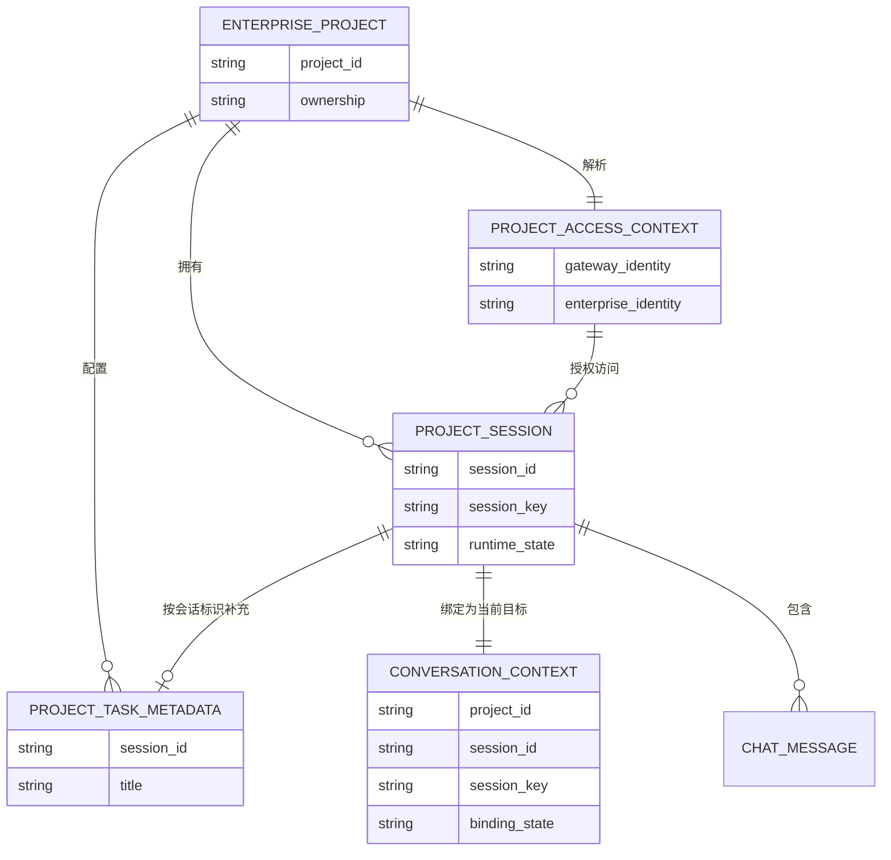
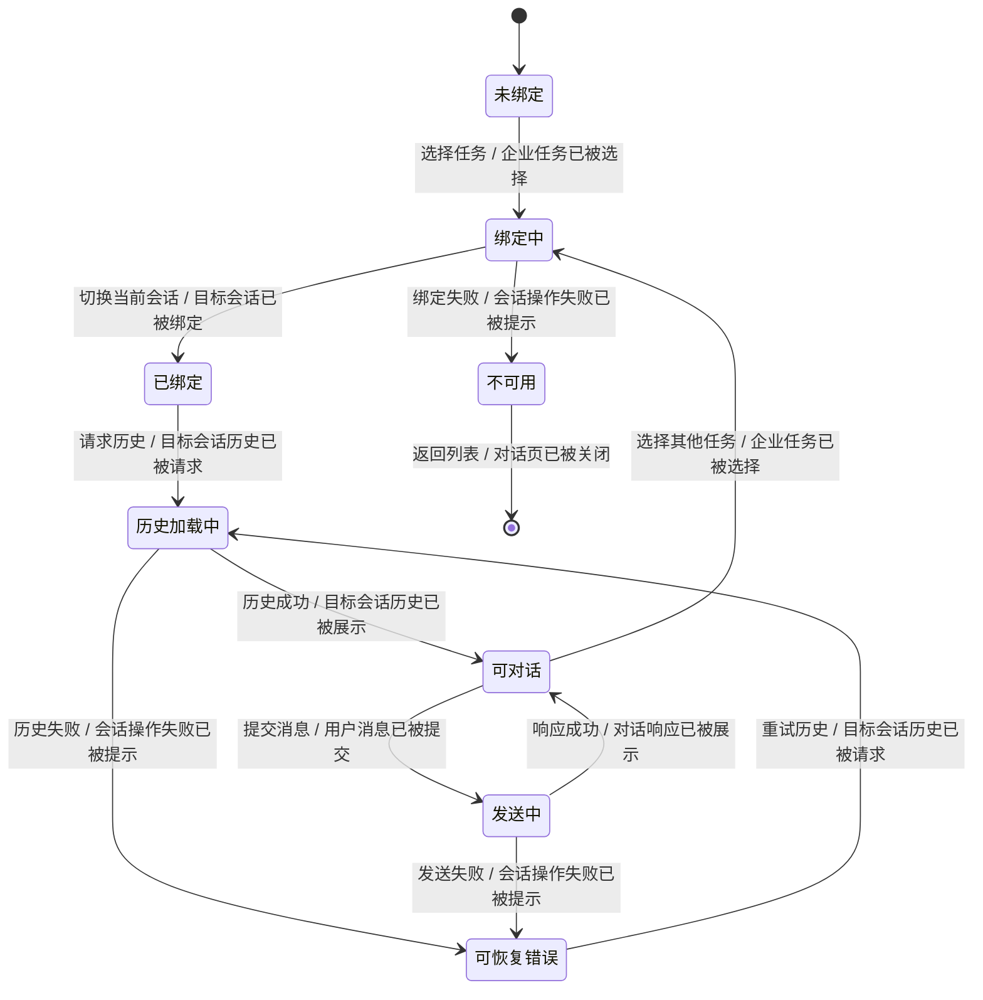
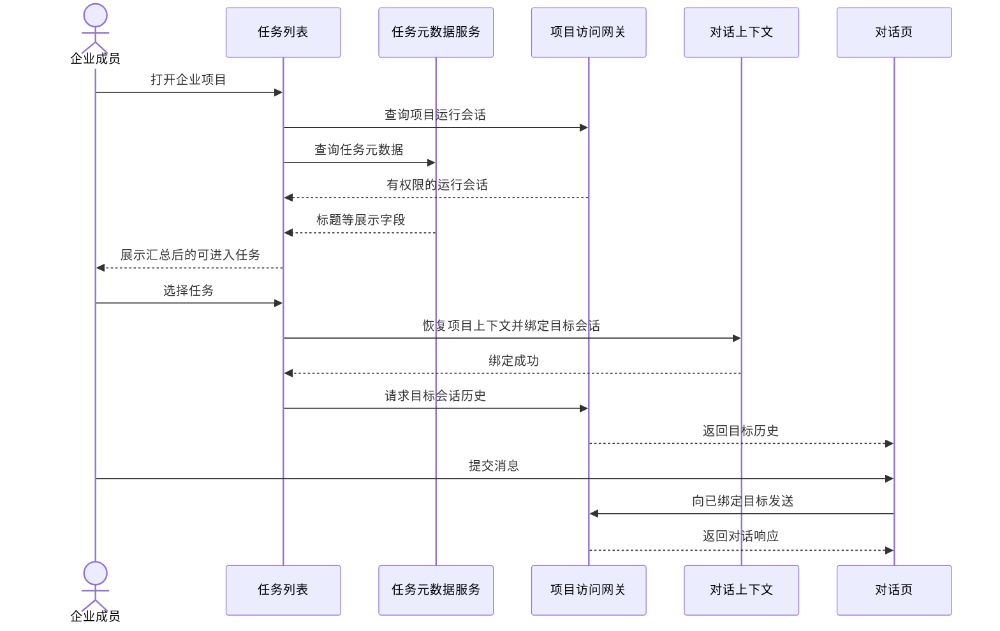
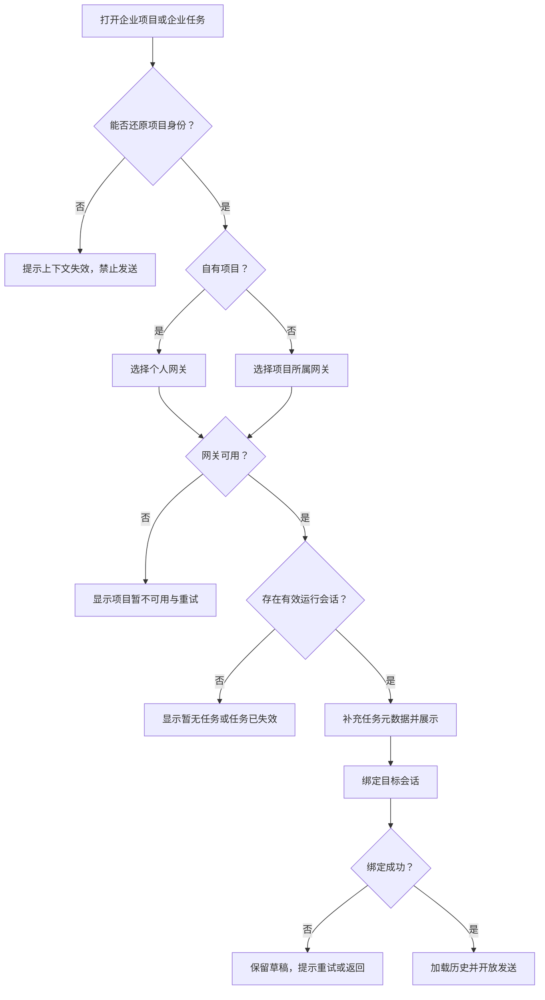
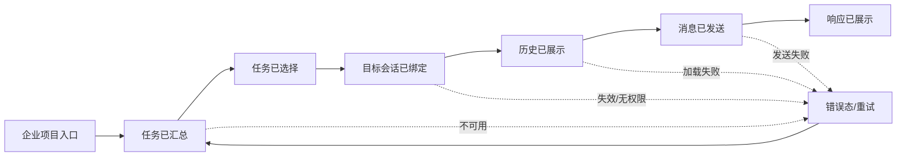

# 需求分析：企业项目对话与任务入口 Web 对齐

**创建日期**：2026-07-28  
**存放路径**：`Plans/需求分析/2026-07-28-企业项目对话与任务入口Web对齐.md`  
**状态**：已采纳（P0 已清零）  
**真理源**：本文件是后续架构、测试与开发的唯一需求基准。

# 人类卷（产品/开发 3 分钟读完即可评审）

> **术语说明**：“App 主任务页（项目外入口）”指底部导航的「任务」页，包含「全部 / 专家 / 其他专家」分段及任务搜索结果；它不等于项目详情内的任务列表。

## A. 用户使用地图

| 角色 | 场景（什么时候） | 任务（要干什么） |
|------|------------------|------------------|
| 企业项目拥有者 | 在 iPhone 或 iPad 打开自己创建的企业项目 | 浏览有效任务，进入指定任务并继续对话 |
| 共享项目成员 | 打开别人共享给自己的企业项目 | 通过项目所属访问通道查看获权任务并对话 |
| 企业成员 | 新建企业任务并发送第一条消息 | 确认新会话已就绪后只发送一次 |
| 企业成员 | 项目网关、会话或权限异常 | 明确知道失败原因，保留草稿并安全重试或返回 |

## B. 关键业务时刻

```text
项目已打开 → 访问网关已确定 → 可用任务已汇总 → 任务已选择
→ 目标会话已绑定 → 历史已展示 → 消息已发往目标会话 → 响应已展示
```

| 时刻（事件） | 谁触发 | 用户看到/得到什么 |
|--------------|--------|-------------------|
| 企业项目已被打开 | 用户 | 项目任务页开始加载 |
| 可用任务已被汇总 | 系统 | 只看到当前可访问、可进入的任务 |
| 目标会话已被绑定 | 用户点击任务后由系统完成 | 对话页指向所选任务，发送不会串台 |
| 目标会话历史已被展示 | 系统 | 看到该任务的历史，而非上一任务历史 |
| 消息已被发往目标会话 | 用户 | 消息只进入当前项目的当前任务 |
| 会话操作失败已被提示 | 系统 | 看到明确错误、草稿保留，可重试或返回 |

## C. 关键业务规则（Do / Don't）

- **Do**：自有项目和共享项目均按项目归属选择正确访问网关。
- **Do**：有效运行会话决定任务是否可进入；任务配置只补充标题等展示信息。
- **Do**：点击任务后先绑定目标会话，再加载历史和开放发送。
- **Do**：iPhone 与 iPad 的项目内入口保留相同的项目/会话身份。
- **Don't**：不能因为 HTTP 任务配置存在，就认定对应对话会话仍然有效。
- **Don't**：共享企业任务不能静默回退到个人默认网关。
- **Don't**：兼容旧网关时不能以消息发往错误会话为代价。
- **前提 → 后果**：项目网关不可用或会话无法绑定 → 任务不可进入可发送态，页面显示可恢复错误。

## D. 需求问题清单（产品必读 · 不确认无法进入架构）

| # | 类 | 一句话问题 | 要产品拍板的 | 状态 |
|---|----|-----------|-------------|------|
| P0-1 | ⚔️ 矛盾 | Web 把“运行会话”当可进入事实，iOS 把“任务配置”直接当列表，两边任务口径不同 | 可进入任务必须存在有效运行会话 | ✅ 2026-07-28 已确认 |
| P0-2 | 🕳️ 遗漏 | App 主任务页是否可能出现企业项目任务 | 数据源保证不会返回项目任务；客户端不增加过滤或项目路由 | ✅ 2026-07-28 已确认 |
| P0-3 | 🕳️ 遗漏 | 项目网关不可用但任务配置仍可加载时，空态、错误态和可点击状态未定义 | 显示明确错误态并禁止进入任务 | ✅ 2026-07-28 已确认 |
| P1-1 | 🤔 不理解 | 旧网关不支持显式会话参数时，兼容边界和停止兼容版本不清楚 | `set.current` 为必需能力；发送 sid 仅在绑定有效时受控降级 | ✅ 架构已决策 |
| P1-2 | 🕳️ 遗漏 | Web 发送带 `chat_source`，iOS 是否必须补齐尚无契约说明 | 无已确认路由依赖，本次不改，后续按独立接口契约处理 | ✅ 本次范围已关闭 |

---

<!-- AI工作底稿 ↓ -->

# AI 工作底稿（供 architecture / test 阶段消费）

## 〇、战略层（Why）

- **痛点**：企业项目任务当前可能“列表可见但对话不可用”，或者在缺少项目/会话绑定时加载错误历史、发送失败甚至串入错误会话；共享项目风险高于普通项目。
- **量化目标**：
  - 可复现的企业项目错误路由/串会话用例由当前失败降为 0；
  - 16 组核心场景全部具备自动化或集成测试映射；
  - 项目网关不可用、会话失效、无权限三类异常均有独立可观察状态，不再误报为空列表；
  - iPhone 与 iPad 项目内入口的目标会话一致性达到 100%。
- **用户故事**：作为企业项目成员，我想从任一受支持入口可靠进入所选任务并继续对话，以便消息始终发往我有权限访问的正确项目会话。

## 一、PRD 摘要

企业项目任务列表需与 Web 对齐：有效运行会话决定任务能否进入，HTTP 项目任务配置仅补充展示元数据。用户点击既有或新建任务后，客户端必须先恢复项目访问上下文并绑定目标会话，再加载历史或发送消息。自有项目使用个人网关，共享项目使用项目所属网关，iPhone 与 iPad 的项目内入口行为一致。App 主任务页数据源保证不返回项目任务，本需求不增加客户端过滤或项目路由。

## 一·五、范围层（What）

| 包含功能 | 优先级 |
|----------|--------|
| 企业项目任务列表：运行会话与任务元数据汇总 | P0 |
| 既有任务进入：项目上下文恢复、会话绑定、历史加载 | P0 |
| 新建任务：创建、绑定、首条消息单次发送 | P0 |
| 自有/共享项目网关路由一致性 | P0 |
| iPhone、iPad 项目内入口一致性 | P0 |
| 网关不可用、无权限、会话失效、快速切换异常态 | P0 |
| 旧网关能力探测与安全降级 | P1 |
| `chat_source` 协议对齐 | P1 |

**明确不做**：App 主任务页的项目任务过滤/路由、项目权限模型重构、Web 端交互改版、任务批量删除/重命名策略调整、富文本编辑器改造。

## 一·六、参与角色

| 角色 | 关注点 | 是否确认 |
|------|--------|----------|
| 企业成员 | 从正确项目进入任务后，看到正确历史并继续对话 | 待产品确认 |
| 项目拥有者 | 自有项目继续复用个人网关，不串入共享项目 | 待产品确认 |
| 共享项目成员 | 使用项目所属网关访问被授权的任务和会话 | 待产品确认 |
| 产品 | iOS 与 Web 的任务可见性、不可用态和进入行为一致 | 待确认 |
| 开发 | 任务身份、项目身份、会话身份在全链路不丢失 | 已完成现状核对 |
| 测试 | 手机/iPad、自有/共享、项目内入口可组合验收 | 待评审 |

## 一·七、事件风暴

| # | 事件（过去式） | 触发命令 | 聚合/对象 | 上游 | 下游 |
|---|----------------|----------|-----------|------|------|
| E1 | 企业项目已被打开 | 打开企业项目 | 企业项目 | 登录身份、项目列表 | E2 |
| E2 | 项目访问网关已被确定 | 解析项目访问上下文 | 项目访问上下文 | E1、项目归属/共享信息 | E3 |
| E3 | 项目运行会话已被获取 | 查询项目会话 | 项目会话集合 | E2、网关可用 | E5 |
| E4 | 项目任务元数据已被获取 | 查询项目任务配置 | 项目任务配置 | E1、企业身份有效 | E5 |
| E5 | 可展示任务已被汇总 | 合并运行会话与任务元数据 | 项目任务列表 | E3、E4 | E6 |
| E6 | 企业任务已被选择 | 点击项目内任务 | 企业任务 | E5 | E7 |
| E7 | 目标会话已被绑定 | 切换当前会话 | 对话上下文 | E2、E6 | E8、E10 |
| E8 | 目标会话历史已被请求 | 加载历史 | 会话历史 | E7 | E9 或 E14 |
| E9 | 目标会话历史已被展示 | 渲染历史 | 对话页面 | E8 | E10 |
| E10 | 用户消息已被提交 | 发送消息 | 待发送消息 | E7、用户输入 | E11 |
| E11 | 消息发送目标已被确定 | 解析项目/网关/会话目标 | 发送上下文 | E2、E7、E10 | E12 或 E14 |
| E12 | 消息已被发往目标会话 | 调用对话发送 | 项目会话 | E11 | E13 或 E14 |
| E13 | 对话响应已被展示 | 接收并渲染响应 | 对话页面 | E12 | 后续对话 |
| E14 | 会话操作失败已被提示 | 呈现可恢复错误 | 错误状态 | E3/E7/E8/E11/E12 失败 | 重试或返回列表 |

### 1.7.1 实体关系



**不变条件**

1. 可发送上下文必须同时具备项目标识、访问网关、会话标识和已绑定状态。
2. 任务展示元数据缺失可以降级，运行会话缺失不得降级为可对话任务。
3. 同名任务不能合并；会话标识是历史、缓存和发送目标的隔离键。
4. 共享项目不得在项目网关不可用时回退到个人默认网关。

### 1.7.2 对话上下文状态机



### 1.7.3 主流程时序



### 1.7.4 用户路径决策图



## 二、范围与入口矩阵

| 入口/场景 | 当前描述 | 触发条件 | 目标页面/结果 |
|-----------|----------|----------|---------------|
| iPhone 企业项目任务列表 | 展示项目内可进入任务 | 自有或共享项目打开 | 项目任务列表 |
| iPhone 项目内既有任务 | 绑定并恢复指定任务 | 点击有效任务 | 项目对话页 |
| iPhone 项目内新建任务 | 创建、绑定、发送首条消息 | 点击新建并提交内容 | 新任务对话页 |
| iPad 企业项目任务列表 | 与 iPhone 同口径 | 分栏进入企业项目 | 项目内容区任务列表 |
| iPad 项目内既有/新建任务 | 全程保留项目标识 | 选择或创建任务 | 项目对话页 |
| App 主任务页 | 明确不在本需求范围；数据源保证不返回项目任务 | 打开「任务」页或搜索 | 沿用普通任务行为，不增加项目过滤/路由 |
| 项目网关不可用 | 不允许 HTTP-only 任务进入 | 网关查询失败 | 项目错误态与重试 |

## 三、数据字典 / 字段规则

| 字段 | 类型 | 必填 | 来源 | 激活/校验规则 | 需求疑问 |
|------|------|------|------|---------------|----------|
| `projectId` | String | 是 | 企业项目 | 进入企业任务后全链路保留 | iPad 既有入口当前可能缺失 |
| `ownership` | Enum | 是 | 项目详情 | own 选个人网关，shared 选项目网关 | 无 |
| `gatewayIdentity` | String/Handle | 是 | 项目访问上下文 | 绑定、历史和发送必须使用同一身份 | 不可静默回退 |
| `sessionId` | String | 是 | 运行会话/任务配置 | 非空且与当前运行会话匹配 | 旧网关兼容策略 P1 |
| `sessionKey` | String | 是 | 运行会话 | 用于项目归属解析和会话切换 | 缺失时任务不可直接发送 |
| `taskTitle` | String | 否 | HTTP 元数据优先，会话信息兜底 | 不参与会话唯一性判断 | 兜底文案待设计复核 |
| `bindingState` | Enum | 是 | 对话上下文 | 仅 `bound` 可开放发送 | 无 |
| `clientMessageId` | String | 是 | 客户端生成 | 重试保持一致，防首条消息重复 | 与现有接口契约待方案确认 |
| `chatSource` | String | 否/P1 | 客户端 | 若契约要求则固定为 `namiwork` | P1-2 |

## 四、事件链中的已知差异

| 环节 | Web 当前口径 | iOS 当前口径 | 需求风险 |
|------|--------------|--------------|----------|
| E3–E5 任务形成 | 运行会话是可进入任务的事实来源，HTTP 任务配置用于补充标题等元数据 | 企业项目直接以 HTTP 任务配置形成列表 | 已失效或无运行会话的任务仍可能被当作可对话任务 |
| E6–E8 进入任务 | 先切换并确认当前会话，再加载历史 | 项目任务被直接包装成历史会话进入 | 页面展示的任务与网关当前会话可能不一致 |
| E10–E12 首次发送 | 新建或选择会话后先完成会话绑定，再发送消息 | HTTP 任务被标记为活动会话，发送前可能跳过绑定 | 首条消息可能失败或发往旧会话 |
| App 主任务页入口 | 项目任务不会进入该列表 | 数据源保证不返回项目任务 | 已确认不适用；客户端不改造 |
| iPad 既有任务入口 | 项目上下文持续保留 | 既有任务进入时可能未传递项目标识 | 后续知识库、路由或恢复流程缺少项目上下文 |

## 五、热点与分歧

| # | 热点 | 类型 | 优先级 | 建议口径 | 决策人 | 处理状态 |
|---|------|------|--------|----------|--------|----------|
| H1 | 任务列表的可进入事实源是运行会话，还是 HTTP 任务配置 | 口径冲突 | P0 | 以运行会话为准，HTTP 仅补充展示字段 | 产品/服务端 | ✅ 已确认 |
| H2 | 企业项目会话是否继续出现在 App 主任务页（项目外入口） | 范围遗漏 | P0 | 数据源不返回项目任务，客户端无需过滤或补项目路由 | 产品 | ✅ 已确认 |
| H3 | 项目网关不可用但 HTTP 仍返回任务时如何展示 | 异常遗漏 | P0 | 不允许进入对话；显示项目暂不可用并提供重试 | 产品/设计 | ✅ 已确认 |
| H4 | 旧网关不接受会话标识参数时的兼容策略 | 兼容分歧 | P1 | `set.current` 为必需能力；发送 sid 仅在绑定有效时受控降级 | 客户端/服务端 | ✅ 架构已决策 |
| H5 | iOS 是否需要补齐 Web 的 `chat_source` 来源标记 | 统计/协议遗漏 | P1 | 无已确认路由依赖，本次不改，后续按独立接口契约处理 | 产品/服务端 | ✅ 本次范围已关闭 |

## 六、角色—系统交互

| 角色 | 命令 | 系统行为 | 结果事件 | 异常 |
|------|------|----------|----------|------|
| 企业成员 | 打开自有企业项目 | 使用个人网关查询项目运行会话并补充任务元数据 | E2–E5 | 个人网关不可用时进入 E14 |
| 企业成员 | 打开共享企业项目 | 使用项目所属网关查询被授权的运行会话并补充任务元数据 | E2–E5 | 身份无效、无权限或项目网关不可用时进入 E14 |
| 企业成员 | 点击项目内任务 | 保留项目上下文，绑定目标会话，绑定成功后加载历史 | E6–E9 | 绑定失败时不进入可发送态 |
| 企业成员 | 在既有任务中发送消息 | 校验项目、网关和会话目标一致后发送 | E10–E13 | 不一致或会话失效时进入 E14 |
| 企业成员 | 在新建任务中发送第一条消息 | 创建会话、绑定成功后发送第一条消息 | E7、E10–E13 | 创建成功但绑定失败时保留草稿并允许重试 |

## 七、输出到实例化需求

- 必须覆盖的主链路事件：E1–E13。
- 必须写成 Given-When-Then 的边界：
  - 自有项目与共享项目；
  - iPhone 与 iPad；
  - 既有任务与新建任务首条消息；
  - 网关不可用、会话失效、无权限、快速切换任务；
  - 旧网关能力降级但不得串会话。
- 暂不纳入范围：
  - 项目权限模型重构；
  - Web 端交互改版；
  - 与对话入口无关的富文本编辑器能力；
  - 企业项目任务的批量删除、重命名策略调整。

## 八、实例化需求

### 8.1 核心规则

| # | 规则 | 适用角色 | 反例 |
|---|------|----------|------|
| R1 | 只有存在有效运行会话且当前成员可访问的任务，才能进入可对话态 | 所有企业成员 | 仅 HTTP 配置中存在的任务被当作可对话任务 |
| R2 | HTTP 任务配置只补充标题、图标等展示信息，不单独证明会话可用 | 所有企业成员 | HTTP 返回成功便将任务标记为活动会话 |
| R3 | 进入既有任务必须先恢复项目访问上下文，再绑定目标会话 | 所有入口 | 直接打开历史页并沿用上一次当前会话 |
| R4 | 会话绑定成功前，不得加载为可发送态，也不得提交消息 | 所有入口 | 绑定失败后输入框仍可发送 |
| R5 | 自有项目使用个人网关，共享项目使用项目所属网关 | 项目拥有者、共享成员 | 共享项目任务默认发往个人网关 |
| R6 | iPhone 与 iPad 的项目内入口必须保留同一组项目/会话身份 | 所有企业成员 | iPad 既有任务丢失项目标识 |
| R7 | 降级兼容不得以“发送到非目标会话”为代价 | 旧网关用户 | 会话标识不被支持时无条件移除标识并继续发送 |
| R8 | 快速切换任务时，较早请求的返回不得覆盖当前任务 | 所有企业成员 | A 任务历史晚返回后覆盖 B 任务页面 |

### 8.2 Given–When–Then 场景

> H1–H3 均已于 2026-07-28 确认。App 主任务页的数据源保证不返回项目任务，因此 GWT-009 仅保留为跨模块数据契约，不产生客户端过滤或路由开发项。

| ID | Given | When | Then | 类型 |
|----|-------|------|------|------|
| GWT-001 | iPhone 上打开自有企业项目，个人网关可用，存在 2 个有权限的运行会话 | 用户进入项目任务列表 | 展示 2 个可进入任务，且“可展示任务已被汇总”事件已发生 | 主链路 |
| GWT-002 | iPhone 上打开共享企业项目，项目所属网关可用，成员有权限 | 用户进入项目任务列表 | 通过项目所属网关展示运行会话对应任务，且“项目访问网关已被确定”事件已发生 | 主链路 |
| GWT-003 | 一个运行会话在 HTTP 任务配置中有标题，另一个没有 | 任务列表完成汇总 | 前者使用配置标题，后者使用会话兜底标题，两者均可进入 | 边界 |
| GWT-004 | HTTP 任务配置中存在一条任务，但运行会话集合中不存在对应会话 | 任务列表完成汇总 | 该任务不进入可对话列表，不发生“可展示任务已被汇总（包含该任务）” | 反例 |
| GWT-005 | 用户从项目内列表点击既有任务，项目网关可用 | 客户端打开对话 | 先绑定目标会话，绑定成功后才请求历史，且 E7 先于 E8 发生 | 主链路 |
| GWT-006 | 目标会话已绑定且历史已展示 | 用户发送一条消息 | 消息发往当前项目的目标会话并展示响应，E10–E13 顺序发生 | 主链路 |
| GWT-007 | 用户在企业项目中新建任务，会话创建成功但尚未绑定 | 用户发送第一条消息 | 系统先绑定新会话，绑定成功后只发送一次首条消息 | 主链路 |
| GWT-008 | iPad 用户从企业项目进入既有任务 | 用户发送消息或恢复页面 | 项目标识、项目网关和会话标识均被保留，消息不落到个人默认会话 | 端一致性 |
| GWT-009 | App 主任务页按既有数据源加载任务 | 返回「全部」任务或搜索结果 | 返回结果不包含企业项目任务，客户端不执行项目任务过滤或项目网关路由 | 数据契约/范围反例 |
| GWT-010 | 项目网关不可用，但 HTTP 任务配置仍可获取 | 用户打开项目任务列表 | 页面显示项目暂不可用与重试入口，不将 HTTP 任务开放为可对话态 | 异常 |
| GWT-011 | 成员权限已被移除或企业身份无效 | 用户打开共享项目任务或发送消息 | 系统提示无权限并退出可发送态，不改用个人网关兜底 | 异常/反例 |
| GWT-012 | 列表中的会话在点击前已失效 | 用户进入该任务 | 绑定失败被明确提示，输入草稿保留，消息未被发送 | 异常 |
| GWT-013 | 用户先点击任务 A，随后立即点击任务 B，A 的历史较晚返回 | 两次异步请求依次返回 | 页面最终只展示 B 的历史，A 的返回被丢弃 | 并发 |
| GWT-014 | 旧网关不接受显式会话标识参数，但已通过会话切换确认目标 | 用户发送消息 | 可按能力探测结果受控降级并仍发往目标会话；若无法证明目标一致则终止发送 | 兼容 |
| GWT-015 | 任务会话已成功绑定，但历史接口暂时失败 | 用户重试加载 | 保持当前目标会话和输入草稿，重试只重新加载历史，不重复切换到其他会话 | 可恢复 |
| GWT-016 | 同一项目存在同名任务但会话标识不同 | 用户分别进入两个任务 | 系统按会话标识隔离历史和发送目标，不按标题合并 | 数据边界 |

### 8.3 线框/交互草图位

| 页面/区域 | 状态 | 草图/链接 | 说明 |
|-----------|------|-----------|------|
| 项目任务列表 | 加载 | 待设计稿 | 保留现有骨架加载，不提前展示 HTTP-only 任务 |
| 项目任务列表 | 正常 | 沿用现有 UI | 只改变任务汇总与可进入口径，不新增视觉层级 |
| 项目任务列表 | 空 | 待复核现有空态 | 区分“项目暂无任务”和“项目暂不可用” |
| 项目任务列表 | 网关不可用 | 待设计稿 | 明确错误文案与重试按钮，任务不可点击进入 |
| 对话页 | 会话绑定中 | 沿用加载态 | 输入区不可发送，避免消息抢跑 |
| 对话页 | 历史加载失败 | 待复核现有错误态 | 保留目标会话和草稿，支持重试 |
| 对话页 | 无权限/会话失效 | 待设计稿 | 退出可发送态，提供返回任务列表 |

## 九、边界情况清单

| # | 边界场景 | 期望行为 | 当前输入是否写明 | 严重度 |
|---|----------|----------|------------------|--------|
| B1 | 项目没有运行会话 | 展示“暂无任务”，不以 HTTP-only 任务填充 | 否 | P0 |
| B2 | 运行会话存在但无 HTTP 元数据 | 使用会话兜底标题，仍可进入 | 否 | P1 |
| B3 | HTTP 元数据存在但运行会话不存在 | 不开放为可对话任务 | 否 | P0 |
| B4 | 同名、不同会话标识 | 按会话标识隔离，不按标题合并 | 否 | P0 |
| B5 | 快速连续切换任务 | 只接受最后一次选择对应的异步结果 | Web 有参考，iOS 需求未写 | P0 |
| B6 | 新建会话首条消息重复点击 | 绑定成功后最多发送一次，重复提交被抑制 | 否 | P0 |
| B7 | iPad 分栏切换后恢复既有任务 | 项目与会话上下文完整恢复 | 否 | P0 |
| B8 | App 主任务页数据源意外返回企业项目会话 | 视为上游契约违反；不在本需求中增加客户端兜底过滤 | ✅ 已确认不会发生 | P1/契约 |
| B9 | 旧网关不支持显式会话参数 | 仅在目标已被可靠绑定时降级 | 否 | P1 |
| B10 | 列表加载期间成员权限被撤回 | 点击或发送前再次失败即退出可发送态 | 否 | P0 |

## 十、异常流程矩阵

| 触发条件 | 用户可见反馈 | 系统行为 | 是否可恢复 | 当前输入是否写明 |
|----------|--------------|----------|------------|------------------|
| 企业身份无效 | 提示登录或企业身份失效 | 停止请求，不回退到个人普通会话 | 是，重新认证 | 否 |
| 项目无访问权限（4xx） | 提示无权限并返回项目列表 | 清理当前项目可发送态，不泄露历史 | 视权限恢复 | 否 |
| 项目/个人网关不可用 | 提示项目暂不可用并提供重试 | 不把 HTTP-only 任务标记为活动会话 | 是 | 否 |
| 运行会话查询失败（5xx/超时） | 列表错误态，不显示为“暂无任务” | 保留上次可靠数据需由方案评估，不开放未知任务 | 是 | 否 |
| 会话绑定失败 | 对话页提示任务已失效或重试 | 禁用发送，保留输入草稿 | 是 | 否 |
| 历史加载失败 | 历史区域提示重试 | 保持已绑定目标和草稿，不切到其他会话 | 是 | 否 |
| 消息发送失败 | 当前消息显示失败并可重试 | 重试保持同一项目/网关/会话和同一客户端消息标识 | 是 | 否 |
| 快速切换导致旧请求晚返回 | 用户无额外提示 | 丢弃陈旧返回，不覆盖当前任务 | 自动恢复 | Web 有参考 |
| 旧网关拒绝会话参数 | 若不能确认目标则提示版本不兼容 | 能力探测后受控降级，禁止盲目去参发送 | 视网关能力 | 否 |

## 十·五、集成与人机协同边界

| 集成点 / 异步任务 | 类型 | 触发事件 | 失败/补偿策略 |
|-------------------|------|----------|---------------|
| 企业项目任务元数据接口 | 同步 API | 企业项目已被打开 | 失败时有效运行会话可使用兜底标题；不得反向用缓存元数据证明会话有效 |
| 项目运行会话查询 | Gateway RPC | 项目访问网关已被确定 | 失败显示错误态并重试，不误判为空列表 |
| 当前会话切换/绑定 | Gateway RPC | 企业任务已被选择 | 失败禁用历史后续链路和发送，保留草稿 |
| 会话历史查询 | Gateway RPC | 目标会话已被绑定 | 失败保留绑定上下文，允许只重试历史 |
| 消息发送 | Gateway RPC/流式响应 | 用户消息已被提交 | 同目标、同客户端消息标识重试，禁止改网关或会话 |
| 本地会话缓存 | 本地异步读写 | 目标会话历史已被展示 | 必须按项目+会话隔离；旧任务返回不得覆盖当前任务 |

| 动作 / 事件 | 全自动 | AI 建议+人工确认 | 纯人工 |
|-------------|:------:|:----------------:|:------:|
| 解析项目网关 | ✅ |  |  |
| 汇总运行会话与元数据 | ✅ |  |  |
| 选择任务 |  |  | ✅ |
| 绑定目标会话 | ✅ |  |  |
| 异常后点击重试/返回 |  |  | ✅ |
| App 主任务页不包含项目任务 | ✅ |  |  |

## 十·六、逻辑问题

| # | 类型 | 问题 | 现状证据摘要 | 严重度 |
|---|------|------|--------------|--------|
| L1 | 事实源冲突 | HTTP 任务配置与运行会话谁决定任务可进入 | Web 聚合两者并以运行会话为准；iOS 企业列表直接读取 HTTP 任务 | P0 |
| L2 | 前置条件缺失 | 既有任务进入没有统一要求“绑定成功后再加载/发送” | Web 先切换当前会话；iOS 活动历史路径可能跳过绑定 | P0 |
| L3 | 已关闭 | App 主任务页数据源不返回项目任务，无需恢复项目上下文 | 产品确认的数据契约 | 已关闭 |
| L4 | 端行为不一致 | iPad 既有任务入口可能缺少项目标识 | 新建任务传项目标识，既有任务链路不一致 | P0 |
| L5 | 兼容风险 | 旧网关拒绝会话参数时的去参重试可能失去目标证明 | 当前存在参数降级能力，但业务安全边界未定义 | P1 |

## 十·七、交互冲突

| # | 场景 A | 场景 B | 问题 | 建议问产品 |
|---|--------|--------|------|------------|
| I1 | 项目没有任务 | 项目网关查询失败 | 两者都可能呈现空列表，用户无法区分 | 是否按建议拆成空态与错误态 |
| I2 | App 主任务页 | 企业项目任务 | 已确认二者数据隔离，不存在点击路由冲突 | 已关闭，无客户端改造 |
| I3 | 历史加载失败 | 会话已经绑定成功 | 若整页回退，草稿和目标会话是否保留不明确 | 是否保持页面并仅重试历史 |
| I4 | 旧网关可降级发送 | 不能串入其他会话 | “尽量发送”和“目标安全”冲突 | 是否确认安全失败优先于发送成功率 |

## 十·八、整体需求遗漏



| 环节 | 当前输入是否写明 | 若未写，缺什么 |
|------|------------------|----------------|
| 进入/退出 | 部分 | 项目内绑定失败后的返回行为 |
| 列表刷新 | 否 | 网关恢复后的刷新、旧可靠数据是否保留 |
| 创建 | 部分 | 创建成功但绑定失败的草稿和重试策略 |
| 历史恢复 | 部分 | iPad/重启/快速切换的缓存隔离 |
| 发送重试 | 否 | 客户端消息标识、重复提交和目标一致性 |
| 权限变化 | 否 | 列表加载后权限撤回的清理与提示 |
| 可观测性 | 否 | 项目/会话关联日志与敏感字段边界 |

## 十一、验收标准

| AC | 来源场景 | 锚定事件 | 验收描述 | 测试映射 |
|----|----------|----------|----------|----------|
| AC-01 | GWT-001 | E5 可展示任务已被汇总 | 自有项目列表只展示个人网关返回的有效运行会话，并正确补充元数据 | IT/E2E |
| AC-02 | GWT-002 | E2 项目访问网关已被确定 | 共享项目列表及后续对话均使用项目所属网关 | IT/E2E |
| AC-03 | GWT-003 | E5 可展示任务已被汇总 | 缺少 HTTP 元数据不影响有效会话进入，展示字段有确定兜底值 | UT/IT |
| AC-04 | GWT-004 | — | HTTP-only 任务不得触发“可进入任务已形成”或进入对话 | UT/IT |
| AC-05 | GWT-005 | E7 目标会话已被绑定 | 既有任务必须在 E7 成功后才触发 E8，绑定失败时历史和发送均不继续 | IT/E2E |
| AC-06 | GWT-006 | E12 消息已被发往目标会话 | 发送请求的项目、网关、会话与当前任务一致 | IT/E2E |
| AC-07 | GWT-007 | E12 消息已被发往目标会话 | 新建任务首条消息在会话绑定后恰好发送一次 | UT/IT/E2E |
| AC-08 | GWT-008 | E11 消息发送目标已被确定 | iPad 既有任务进入与恢复均保留项目标识并选择正确网关 | IT/E2E |
| AC-09 | GWT-009 | — | 契约测试确认 App 主任务页数据源不返回企业项目任务；客户端不新增过滤和项目路由逻辑 | Contract |
| AC-10 | GWT-010 | E14 会话操作失败已被提示 | 网关不可用与空任务呈现不同状态，HTTP-only 任务不可发送 | UI/IT/E2E |
| AC-11 | GWT-011 | E14 会话操作失败已被提示 | 无权限时不加载受限历史、不发送消息、不回退错误网关 | Security/IT |
| AC-12 | GWT-012 | E14 会话操作失败已被提示 | 会话失效时草稿保留、发送禁用且可返回列表 | UI/IT |
| AC-13 | GWT-013 | E9 目标会话历史已被展示 | 快速切换后只允许最后选择任务的历史更新当前页面 | UT/IT/E2E |
| AC-14 | GWT-014 | E12 或 E14 | 旧网关降级必须证明仍是目标会话，否则终止发送并提示 | Compatibility/IT |
| AC-15 | GWT-015 | E9 或 E14 | 历史重试不改变已绑定会话，不清空未发送草稿 | UI/IT |
| AC-16 | GWT-016 | E7、E9、E12 | 同名不同会话的历史、缓存和发送目标全程隔离 | UT/IT/E2E |

**非功能验收**

- 兼容性：覆盖当前支持的最低 iOS/iPadOS 版本，以及旧/新网关能力组合。
- 安全：无权限、项目切换和身份失效场景不得展示上一项目历史或向上一会话发送。
- 可观测性：列表汇总、会话绑定、历史加载、发送失败日志必须可关联项目标识与会话标识，但不得记录消息正文或令牌。

## 十二、待确认问题

| 优先级 | 问题 | 建议决策 | 负责人 | 状态 |
|--------|------|----------|--------|------|
| P0 | 可进入任务以运行会话还是 HTTP 任务配置为准 | 运行会话为准，HTTP 仅补充展示 | 产品/服务端 | ✅ 已确认 |
| P0 | App 主任务页是否展示企业项目会话 | 数据源不返回项目任务，客户端无需过滤或项目路由 | 产品 | ✅ 已确认 |
| P0 | 项目网关不可用但 HTTP 可用时，显示空列表还是错误态 | 显示明确错误态和重试，不允许进入任务 | 产品/设计 | ✅ 已确认 |
| P1 | 旧网关会话参数兼容到哪个版本 | `set.current` 为必需能力；发送 sid 仅在绑定有效时受控降级 | 客户端/服务端 | ✅ 架构已决策 |
| P1 | 是否补齐 `chat_source=namiwork` | 无已确认路由依赖，本次不改，后续按独立接口契约处理 | 产品/服务端 | ✅ 本次范围已关闭 |

## 十三、分析结论

| 项 | 结论 |
|----|------|
| 事件链是否闭环 | ✅ 主链路、失败与重试事件已闭环 |
| 实例是否足够测试 | ✅ 16 组 GWT，覆盖主链路、边界、异常、反例与并发 |
| 可否进入架构设计 | ✅ 当前 `p0_open: 0`，需求已采纳 |
| 建议技术方向（非已采纳方案） | 运行会话事实源 + HTTP 元数据补充；项目内进入前绑定；手机/iPad 保持项目上下文 |
| 关联架构 Plan | `Plans/技术方案/2026-07-28-企业项目对话与任务入口Web对齐.md`（已采纳） |

## 续做

```text
/resume plan=Plans/Epic/2026-07-28-企业项目对话与任务入口Web对齐.md 进度=架构设计 / WBS 3
```

**下一阶段 Skill**：进入 `architecture-design-assistant`。

## 十四、变更影响记录（2026-07-28）

**变更点**：App 主任务页（「任务」Tab 的「全部」分段及搜索）数据源保证不返回企业项目任务，客户端无需过滤，也无需为该入口补项目网关路由。

| 受影响产物 | 阶段 | 影响类型 | 已执行动作 |
|------------|------|----------|------------|
| 本需求 Plan | 需求 | 范围收缩 | 移除 App 主任务页客户端改造，重写 H2、GWT-009、AC-09 与边界项 |
| Epic | 编排 | 状态同步 | P0 从 1 清零，需求阶段改为已采纳 |
| 技术方案 Plan | 架构 | 无既有产物 | 尚未创建，无需标记 `pending-change` |
| 功能开发 Plan | 开发 | 无既有产物 | 尚未创建，无需返工 |
| 自动化测试 Plan | 测试 | 无既有产物 | 尚未创建；后续仅保留数据源契约测试，不实现客户端过滤测试 |
| 部署 Plan | 部署 | 无既有产物 | 无影响 |

**明确不改的客户端模块**：`NAMIWork/Features/Conversation/MainList/`、`NAMIWork/Features/Conversation/NMTaskSearchViewController.swift` 不因本需求增加项目任务过滤或项目网关路由。

## 实例化需求反馈（skill_run）

```yaml
skill_run:
  skill: spec-by-example-assistant
  plan: Plans/需求分析/2026-07-28-企业项目对话与任务入口Web对齐.md
  date: 2026-07-28
  contexts_used:
    - path: Templates/实例化需求模板.md
      utility: high
      reason: "按模板补充核心规则、16 组 GWT、线框状态和可测验收标准"
    - path: Contexts/需求分析/需求分析规范.md
      utility: high
      reason: "确保场景覆盖主链路、边界、异常与反例，并将 Then 锚定到领域事件"
    - path: Plans/需求分析/2026-07-28-企业项目对话与任务入口Web对齐.md
      utility: high
      reason: "以同一 Plan 中的事件墙和热点作为实例化需求输入"
  contexts_missing: []
  contexts_stale: []
  outcome_status: pass
  revisit_needed: false
```

## 事件风暴反馈（skill_run）

```yaml
skill_run:
  skill: event-storming-assistant
  plan: Plans/需求分析/2026-07-28-企业项目对话与任务入口Web对齐.md
  date: 2026-07-28
  contexts_used:
    - path: Templates/事件风暴模板.md
      utility: high
      reason: "按模板建立角色、过去式领域事件墙、热点和角色—系统交互"
    - path: Plans/Epic/2026-07-28-企业项目对话与任务入口Web对齐.md
      utility: high
      reason: "依据 client-dev Epic 的范围、仓库、分支与 WBS 1 建立需求子 Plan"
    - path: .workflows/blueprints/client-dev.json
      utility: high
      reason: "依据需求阶段门禁保留 P0 决策并衔接实例化需求"
  contexts_missing: []
  contexts_stale: []
  outcome_status: pass
  revisit_needed: false
```

## 需求分析反馈（skill_run）

```yaml
skill_run:
  skill: requirement-analyst
  plan: Plans/需求分析/2026-07-28-企业项目对话与任务入口Web对齐.md
  date: 2026-07-28
  contexts_used:
    - path: Templates/需求分析-带验收标准模板.md
      utility: high
      reason: "按人类卷/AI 底稿分卷补齐 Why、What、边界、异常、验收与结论"
    - path: Contexts/需求分析/需求分析规范.md
      utility: high
      reason: "以事件驱动方式建立 ER、状态机、时序、决策图和事件锚定验收标准"
    - path: Plans/Epic/2026-07-28-企业项目对话与任务入口Web对齐.md
      utility: high
      reason: "保持需求范围、WBS 和 client-dev 阶段门禁一致"
  contexts_missing: []
  contexts_stale: []
  outcome_status: partial
  revisit_needed: true
```

## 产品确认回写反馈（skill_run）

```yaml
skill_run:
  skill: requirement-analyst
  plan: Plans/需求分析/2026-07-28-企业项目对话与任务入口Web对齐.md
  date: 2026-07-28
  contexts_used:
    - path: Plans/需求分析/2026-07-28-企业项目对话与任务入口Web对齐.md
      utility: high
      reason: "将用户对 P0-1、P0-3 的确认回写到人类卷、热点、待确认项和阶段结论"
    - path: Contexts/需求分析/需求分析规范.md
      utility: high
      reason: "保持未确认的 P0-2 继续阻塞架构阶段，并将项目外入口术语改为产品可理解表述"
  contexts_missing: []
  contexts_stale: []
  outcome_status: partial
  revisit_needed: true
```

## 范围收缩反馈（skill_run）

```yaml
skill_run:
  skill: change-impact-analysis
  plan: Plans/需求分析/2026-07-28-企业项目对话与任务入口Web对齐.md
  date: 2026-07-28
  contexts_used:
    - path: Skills/change_impact_analysis.md
      utility: high
      reason: "按变更影响流程反查架构、开发、测试与部署产物，并确认尚无下游 Plan 需要返工"
    - path: Plans/需求分析/2026-07-28-企业项目对话与任务入口Web对齐.md
      utility: high
      reason: "将 App 主任务页从客户端开发范围移除，并同步重写场景、边界与验收标准"
    - path: Contexts/决策/Skill反馈协议.md
      utility: high
      reason: "按协议记录本次已归位的范围收缩与执行结果"
  contexts_missing: []
  contexts_stale: []
  outcome_status: pass
  revisit_needed: false
```
