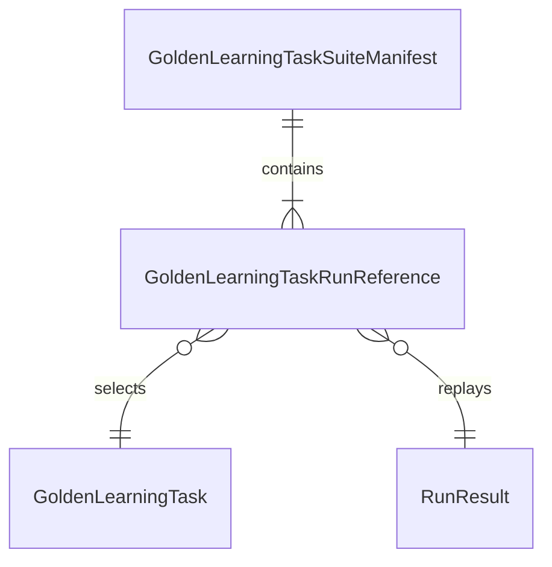
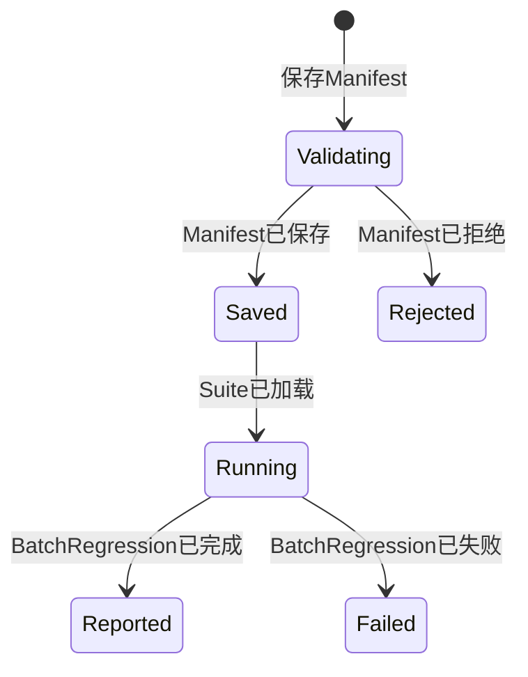
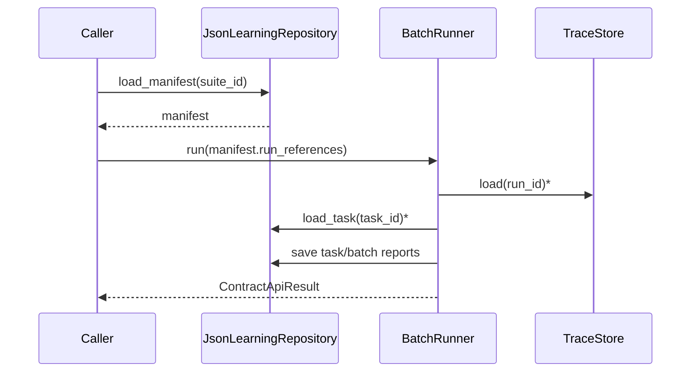
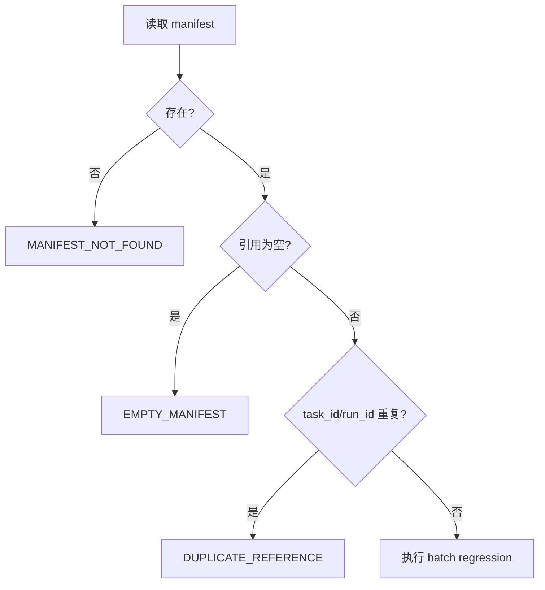

# 需求分析：Golden Learning Task Suite Manifest

# 人类卷

## A. 用户使用地图

| 角色 | 场景 | 任务 |
|------|------|------|
| Agent 系统开发者 | 修改 prompt、runtime 或图谱操作后 | 只提供 suite_id，重复运行一组固定 golden learning tasks 并读取回归报告。 |

价值：调用方不再每次临时拼装 task_id/run_id；suite 定义可保存、审查、复跑，并能稳定表达空、重复和缺失边界。

## B. 关键业务时刻

```text
Manifest 已提交 → Manifest 已校验 → Manifest 已保存 → Suite 已加载 → Batch Regression 已完成 → Report 已保存
```

| 时刻 | 触发者 | 得到什么 |
|------|--------|----------|
| Manifest 已保存 | 开发者/测试运行器 | 可复用 suite_id。 |
| Batch Regression 已完成 | 持久化 batch runner | 单任务报告与 suite 汇总报告。 |

## C. 关键业务规则

- **Do**：manifest 至少包含一个 run reference；task_id 与 run_id 在同一 suite 中分别唯一。
- **Do**：执行时只以持久化 manifest 为引用真理源。
- **Don't**：缺失、空或重复引用的 manifest 不得启动 batch regression。
- **Don't**：本切片不接 CLI/HTTP，不改变 GoldenLearningTaskReport 的通过判定。

## D. 需求问题清单

| # | 类 | 一句话问题 | 结论 |
|---|----|------------|------|
| P0-1 | 🕳️ | 空 manifest 是否可执行？ | 不可执行，返回专用错误码。 |
| P0-2 | 🕳️ | 同一 task_id 或 run_id 能否重复？ | 不能，分别返回专用重复引用错误码。 |
| P0-3 | 🤔 | suite_id 缺失时是否回退到临时引用？ | 不回退，明确返回 manifest not found。 |

P0 已由用户“继续开发”及父 plan AC-S2 确认闭环，`p0_open=0`。

<!-- AI工作底稿 ↓ -->

# AI 工作底稿

## 〇、Why / What / How

- **Why**：让多任务回归从一次性参数调用升级为可持久化、可复跑的 suite。
- **What**：manifest schema、JSON 往返、校验、suite_id runner、错误码。
- **How**：复用 `JsonLearningRepository`、现有 batch runner 与 `ContractApiResult`。

## 一、事件风暴

| 命令 | 聚合 / 不变条件 | 事件 |
|------|-----------------|------|
| 保存 Suite Manifest | suite_id 有值；引用非空；task_id/run_id 分别唯一 | Manifest 已保存 |
| 运行 Golden Suite | manifest 存在且合法；引用的 task/trace 可加载 | Batch Regression 已完成 |
| 保存回归结果 | task report 与 batch report 结构合法 | Regression Report 已保存 |

事件链闭环：每个命令都有成功事件；失败通过 `ContractApiResult.error_code` 收口，不产生成功事件。

## 二、四图

### ER 图



### 状态机



### 时序图



### 决策图



## 三、数据字典

| 字段 | 类型 | 必填 | 规则 |
|------|------|------|------|
| suite_id | string | 是 | JSON 记录主键。 |
| run_references | array | 是 | 至少一项。 |
| task_id | string | 是 | suite 内唯一。 |
| run_id | string | 是 | suite 内唯一。 |

## 四、异常矩阵

| 场景 | 系统行为 | 可恢复 |
|------|----------|--------|
| manifest 缺失 | 返回专用 not found，不执行 batch | 是，先保存 manifest。 |
| manifest 空 | 拒绝保存/执行 | 是，补 run reference。 |
| task_id/run_id 重复 | 拒绝保存/执行 | 是，去重。 |
| task/trace/replay 失败 | 复用第三十二刀分阶段错误码 | 是，按错误码修复或重试。 |

## 五、验收标准

| # | 验收项 | 锚定事件 | Given | When | Then | 优先级 |
|---|--------|----------|-------|------|------|--------|
| AC-S2-1 | Manifest 往返 | Manifest 已保存 | 合法 suite 与引用 | 保存后重新加载 | 加载结果与原对象相等 | P0 |
| AC-S2-2 | suite_id 重跑 | Batch Regression 已完成 | manifest、task、trace 均存在 | 只传 suite_id 运行 | 生成并保存单任务与 batch report | P0 |
| AC-S2-3 | 缺失 manifest | — | suite_id 不存在 | 运行 suite | 返回 `GOLDEN_LEARNING_TASK_SUITE_MANIFEST_NOT_FOUND` | P0 |
| AC-S2-4 | 空 manifest | Manifest 已拒绝 | run_references 为空 | 保存或运行 | 返回 `EMPTY_GOLDEN_LEARNING_TASK_SUITE_MANIFEST` | P0 |
| AC-S2-5 | 重复引用 | Manifest 已拒绝 | task_id 或 run_id 重复 | 保存或运行 | 返回对应重复引用错误码 | P0 |

## 六、分析结论

- P0：0。
- 可进入架构与开发。
- 需求范围只覆盖 AC-S2，不包含 CLI、HTTP、数据库和新的评分算法。

## 反馈（skill_run）

```yaml
skill_run:
  skill: requirement-analyst
  plan: Plans/需求分析/2026-08-03-GoldenLearningTaskSuiteManifest.md
  date: 2026-08-03
  contexts_used:
    - path: Contexts/需求分析/需求分析规范.md
      utility: high
      reason: "用事件链、四图、异常矩阵与可测 AC 收敛 Suite Manifest 的缺失、空和重复边界。"
    - path: Plans/学习循环/2026-08-02-学习实践-智能体开发-09-R4知识图谱驱动学习系统.md
      utility: high
      reason: "复用用户确认的开发优先调度和 AC-S2，不引入新的产品范围。"
    - path: Templates/需求分析-带验收标准模板.md
      utility: high
      reason: "按人类卷与 AI 工作底稿分卷输出机械门禁所需需求真理源。"
  contexts_missing: []
  contexts_stale: []
  outcome_status: pass
  revisit_needed: false
```
