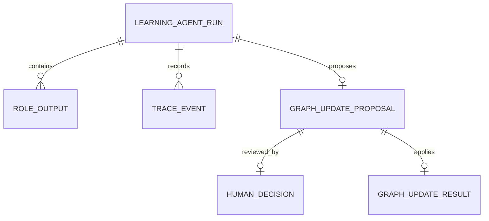
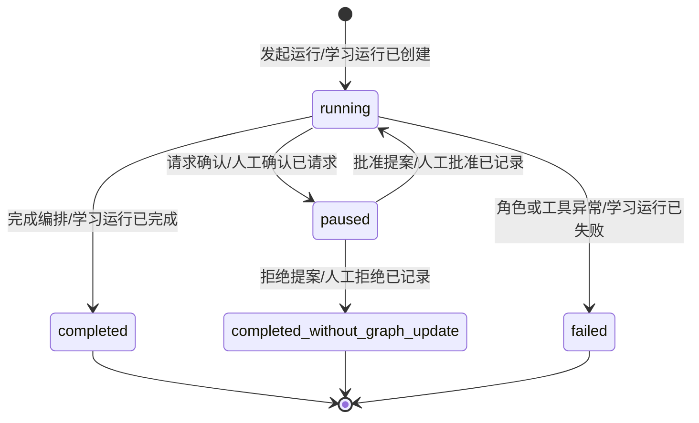
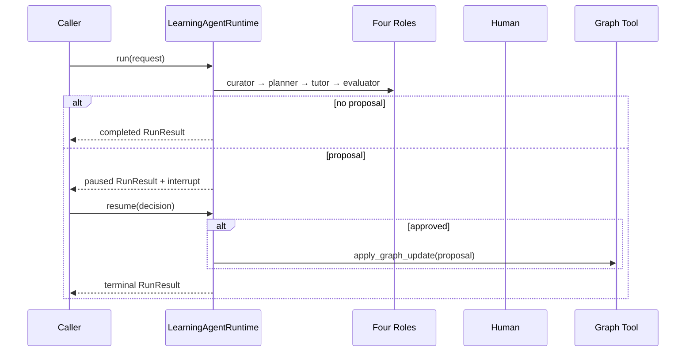
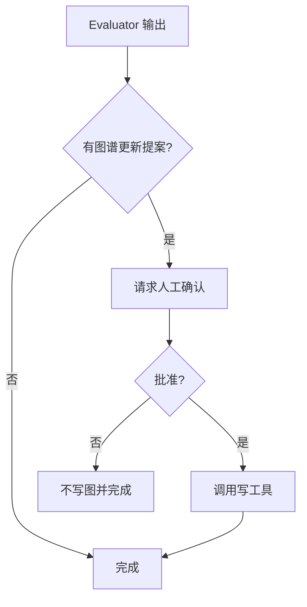

# 需求分析：Learning Agent Runtime 角色与工具接入

# 人类卷

## A. 用户使用地图

| 角色 | 场景 | 任务 |
|------|------|------|
| 学习系统调用方 | 发起一次受控学习编排 | 让 GraphCurator、LearningPlanner、TutorAgent、EvaluatorAgent 按固定边界协作，并获得可追踪结果 |
| 学习者 | 图谱更新需要人工判断 | 查看提案并批准或拒绝，拒绝时不得改写图谱 |
| 系统开发者 | 角色或工具运行异常 | 从 Trace 与失败终态定位具体失败节点 |

## B. 关键业务时刻

```text
学习运行已创建 → 图谱上下文已整理 → 学习计划已生成 → 辅导内容已生成 → 学习效果已评估
  → 无图谱提案：运行已完成
  → 有图谱提案：人工确认已请求 → 已批准/已拒绝 → 图谱更新已应用或运行未更新图谱而完成
任一角色或工具异常 → 运行已失败
```

## C. 关键业务规则（Do / Don't）

- **Do**：Runtime 决定节点顺序、checkpoint、interrupt、Trace 和终态；角色只返回结构化结果。
- **Do**：图谱更新提案必须先 interrupt，获批准后才能调用写工具。
- **Don't**：人工拒绝不是系统异常；应正常收口为 `completed_without_graph_update`。
- **Don't**：本切片不接真实 LLM、HTTP、Flutter，也不实现完整 LearningSession 产品生命周期。

## D. 需求问题清单

| # | 类 | 一句话问题 | 结论 |
|---|----|-----------|------|
| P0-1 | 🕳️ | 角色能否自行决定跳转或写图？ | 否；控制流与写边界归 Runtime，P0 已闭环 |
| P0-2 | 🤔 | 人工拒绝算失败还是正常结束？ | 正常结束且不写图，P0 已闭环 |
| P0-3 | 🕳️ | 异常后是否仍需保存可诊断 Trace？ | 是；必须以 `run failed` 终态保存，P0 已闭环 |

<!-- AI工作底稿 ↓ -->

# AI 工作底稿

## 〇、战略层与范围

- **痛点**：现有 learning contracts 与 eval/replay 已可用，但四个学习角色尚未进入同一可恢复编排，无法证明 S3 的生产级 Runtime 边界。
- **目标**：用一个可注入、可测试的最小 Runtime 完成四角色串联、人工确认、checkpoint、Trace 与失败收口。
- **包含**：确定性角色端口、图谱写工具端口、LangGraph 状态图、run/resume/checkpoint history、RunResult Trace。
- **不包含**：真实模型调用、检索、会话 UI、持久化业务仓库、多用户并发、任意动态路由。

## 一、事件风暴与四图

| 命令 | 聚合 / 不变条件 | 业务事件 |
|------|-----------------|----------|
| 发起学习运行 | LearningAgentRun；同一 run 内节点顺序由 Runtime 唯一控制 | 学习运行已创建 |
| 执行四个角色 | 角色只能返回 JSON 可序列化结构，不得直接改图 | 角色输出已生成 |
| 请求图谱更新确认 | 有非空提案才能 interrupt；未批准禁止调用写工具 | 人工确认已请求 |
| 恢复运行 | thread checkpoint 必须存在，decision 可归一化为 approved/rejected | 人工决定已记录 |
| 应用图谱更新 | 仅 approved 分支可调用一次写工具 | 图谱更新已应用 |
| 收口异常 | 任一未处理异常必须转为错误结果并写失败终态 | 学习运行已失败 |









## 二、数据字典与边界

| 字段 | 类型 | 必填 | 规则 |
|------|------|------|------|
| request | object | 是 | 调用方输入，Runtime 原样交给首角色 |
| role output | object | 是 | 必须为 dict；否则按角色失败收口 |
| graph_update_proposal | object/null | 否 | 空则不 interrupt；非空则必须人工确认 |
| decision.approved | bool | 是 | 同时兼容 bool 或含 approved 的 object |
| outcome | string | 终态是 | `completed` / `completed_without_graph_update` |
| error | string/null | 否 | 异常时填写并写 `run failed` TraceEvent |

| 边界/异常 | 期望行为 |
|-----------|----------|
| 无图谱提案 | 不暂停，不调用写工具，正常完成 |
| 有提案但尚未决定 | 保存 checkpoint，返回 interrupts，outcome 为空 |
| 人工拒绝 | 不调用写工具，正常结束为 `completed_without_graph_update` |
| 角色返回非 dict 或抛错 | 失败终态，Trace 保留失败节点与错误信息 |
| 图谱写工具抛错 | 失败终态，不伪造成功结果 |
| 恢复不存在的 thread | 返回失败结果，不创建虚假成功运行 |

## 三、验收标准

| # | 验收项 | 锚定事件 | Given | When | Then | 优先级 |
|---|--------|----------|-------|------|------|--------|
| AC-S3-1 | 四角色受控串联 | 角色输出已生成 | 注入四个确定性角色 | 发起无提案运行 | 调用顺序固定且 Trace 含四个角色节点，运行已完成 | P0 |
| AC-S3-2 | 图谱更新人工确认 | 人工确认已请求 | evaluator 返回图谱提案 | 发起运行 | 运行暂停、有 checkpoint 和 interrupt，写工具尚未调用 | P0 |
| AC-S3-3 | 批准后恢复 | 图谱更新已应用 | 运行暂停且提案待审 | resume approved | 仅调用一次写工具并完成 | P0 |
| AC-S3-4 | 拒绝不写图 | 人工拒绝已记录 | 运行暂停且提案待审 | resume rejected | 写工具调用为零，终态为 completed_without_graph_update | P0 |
| AC-S3-5 | 异常可诊断 | 学习运行已失败 | 任一角色或工具抛错 | 执行或恢复 | 返回 error，最后 TraceEvent 为 run failed | P0 |
| AC-S3-反 | 禁止越权写图 | — | 提案未获批准 | 检查工具调用 | 不应发生图谱更新已应用事件 | P0 |

## 四、分析结论

P0=0，可进入架构与测试先行开发。本切片只闭合 AC-S3，不提前扩张 L3 学习问答或 S4 Flutter。

## 反馈（skill_run）

```yaml
skill_run:
  skill: requirement-analyst
  plan: Plans/需求分析/2026-08-03-LearningAgentRuntime角色工具接入.md
  date: 2026-08-03
  contexts_used:
    - path: Contexts/需求分析/需求分析规范.md
      utility: high
      reason: "用事件链和四图明确暂停、恢复、拒绝与失败终态的差异。"
    - path: Plans/学习循环/2026-08-02-学习实践-智能体开发-09-R4知识图谱驱动学习系统.md
      utility: high
      reason: "承接系统开发线 AC-S3 与开发优先的范围事实。"
  contexts_missing: []
  contexts_stale: []
  outcome_status: pass
  revisit_needed: false
```
