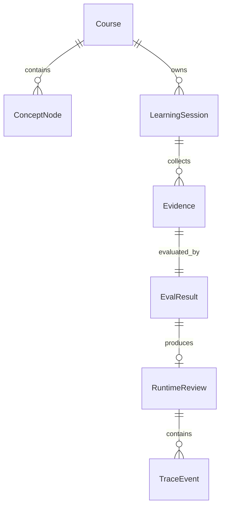
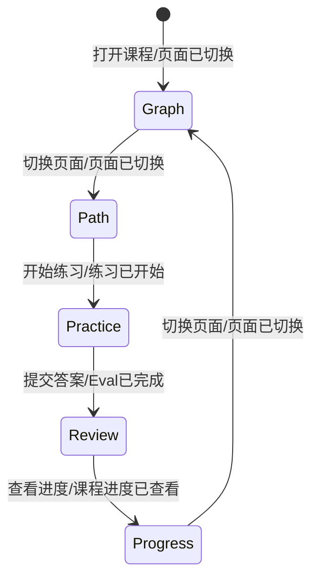
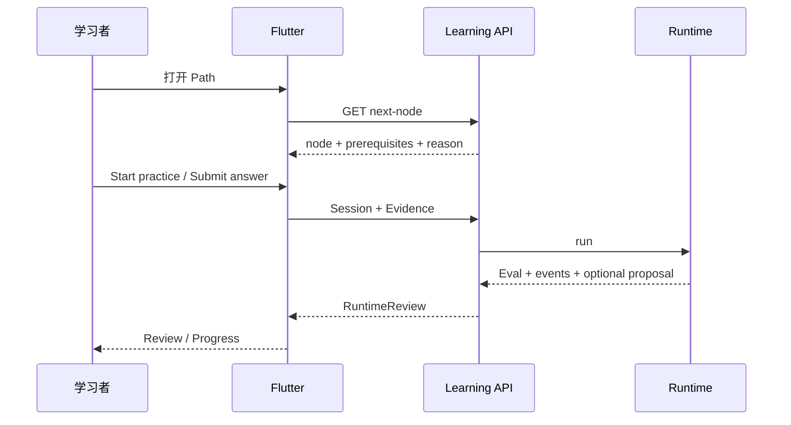
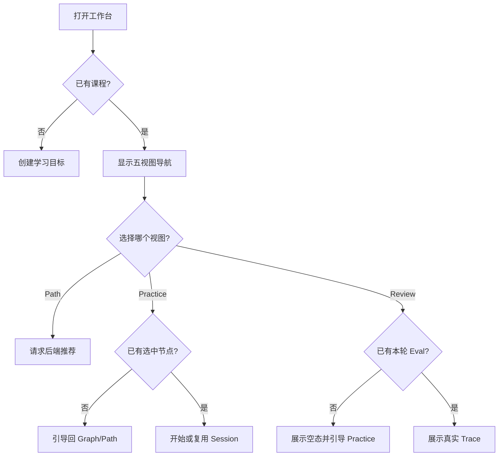

# 需求分析：R4 Flutter 学习工作台补全

# 人类卷

## A. 用户使用地图

| 角色 | 场景 | 任务 |
|------|------|------|
| 学习者 | 已有一门知识图谱课程 | 查看系统推荐的下一节点与推荐理由 |
| 学习者 | 准备验证当前知识节点 | 进入练习页、提交自己的解释并获得评估 |
| 学习者 | 完成一次 Evidence/Eval | 查看本次角色执行、评估与人工图谱决策结果 |
| 学习者 | 想判断整体学习进展 | 查看课程掌握度与不同节点状态分布 |

## B. 关键业务时刻

```text
工作台已打开 → 页面已切换 → 下一节点已推荐 → 练习已开始 → Evidence 已提交
→ Eval 已完成 →（有提案：人工决策已完成）→ 本轮复盘已展示 → 课程进度已查看
```

| 时刻 | 谁触发 | 用户得到什么 |
|------|--------|--------------|
| 页面已切换 | 用户 | 当前导航高亮且主内容唯一切换 |
| 下一节点已推荐 | 系统 | 节点、前置依赖和可解释理由 |
| 练习已开始 | 用户 | 与选中节点绑定的题目和 Evidence 输入 |
| Eval 已完成 | 系统 | score、passed、reason 与 Runtime phase |
| 人工决策已完成 | 用户 | apply 或 preserve 的确定结果 |
| 本轮复盘已展示 | 用户 | Evidence、Eval、Trace 与图谱决策串成一条时间线 |
| 课程进度已查看 | 用户 | mastery 与各状态节点计数 |

## C. 关键业务规则（Do / Don't）

- **Do**：Graph、Path、Practice、Review、Progress 是同一课程工作台的五个视图，共享同一 `LearningController` 状态。
- **Do**：下一节点必须来自后端领域规则，并展示 prerequisite 与 reason；Flutter 不自行伪造推荐。
- **Do**：Practice 必须绑定已创建的 `LearningSession`；答案提交后才形成 Evidence/Eval。
- **Do**：Review 展示实际 Runtime events，不以静态文案冒充 trace。
- **Don't**：Progress 不允许用户手工改 mastery；只消费后端课程图谱与进度。
- **Don't**：本切片不接真实 LLM、账号、云同步、资料导入或远程部署。

## D. 需求问题清单

| # | 类 | 一句话问题 | 结论 |
|---|----|-----------|------|
| P1-1 | 🕳️ | 页面刷新后是否恢复最近一次 Review？ | 本地 MVP 仅保证当前进程内复盘；持久化历史另立 WBS。 |
| P1-2 | 🤔 | Practice 是否包含自动出题模型？ | 本切片使用与节点绑定的确定性问题；真实模型不在范围。 |

<!-- AI工作底稿 ↓ -->

# AI 工作底稿

## 〇、战略层与范围

- **痛点**：S4b 已能跑通 API，但 Flutter 仍偏“图谱页面 + 侧面板”，无法完整表达父 plan MVP-4 的学习路径、练习、复盘和进度体验。
- **目标**：一个 Flutter 工程内可触达 5 个工作台视图；端到端主链不新增第二套状态或假数据源。
- **包含**：工作台导航、下一节点、练习、当轮复盘、课程进度。
- **排除**：真实模型、流式 token、登录、多用户、云部署、历史复盘库。

## 一、事件风暴与四图

| 命令 | 聚合 / 不变条件 | 业务事件 |
|------|-----------------|----------|
| 切换工作台页面 | Workspace / 目标必须属于已声明 destination | 页面已切换 |
| 请求下一节点 | CourseGraph / 前置与 mastery 必须满足选择规则 | 下一节点已推荐 |
| 开始练习 | LearningSession / 必须绑定 course + node | 练习已开始 |
| 提交答案 | Evidence / 必须绑定 session + node | Evidence 已提交 |
| 执行评估 | EvalResult / 必须引用 Evidence | Eval 已完成 |
| 查看本轮复盘 | ReviewSnapshot / 必须来自真实 runtime response | 本轮复盘已展示 |
| 查看课程进度 | CourseGraph / mastery 只读 | 课程进度已查看 |









## 二、数据字典

| 字段 | 类型 | 必填 | 来源 | 规则 |
|------|------|------|------|------|
| destination | enum | 是 | Flutter | graph/path/practice/review/progress |
| recommendation.node_id | string | 是 | API | 必须存在于 CourseGraph |
| recommendation.reason | string | 是 | API | 不得由 Flutter 拼接 |
| practice.answer | string | 是 | 用户 | trim 后非空 |
| review.events | array | 是 | Runtime response | 按 sequence 显示 |
| progress.mastery | int | 是 | API | 0–100，只读 |

## 三、边界与异常

| 场景 | 用户反馈 | 可恢复 |
|------|----------|--------|
| 没有课程 | 回到 Goal 创建页 | 是 |
| 无可推荐节点 | Path 显示课程已无可选节点 | 是 |
| 未选节点进入 Practice | 引导去 Graph/Path 选择 | 是 |
| 未产生 Eval 进入 Review | 空态，不伪造 Trace | 是 |
| API 失败 | 保留当前页面并显示顶部错误条 | 是 |
| 390px 视口 | 底部导航与纵向内容，无主体横向溢出 | 是 |

## 四、验收标准

| # | 验收项 | 锚定事件 | Given | When | Then | 优先级 |
|---|--------|----------|-------|------|------|--------|
| AC-S6-1 | 工作台导航 | 页面已切换 | 已创建课程 | 点击任一 destination | 当前项高亮且只显示对应主内容 | P0 |
| AC-S6-2 | 学习路径 | 下一节点已推荐 | 图谱与进度存在 | 打开 Path | 显示后端返回的 node、prerequisites、reason | P0 |
| AC-S6-3 | 练习闭环 | Eval 已完成 | 已选择节点 | 提交非空答案 | Evidence/Eval 已生成并进入 Review 可见 | P0 |
| AC-S6-4 | 当轮复盘 | 本轮复盘已展示 | Runtime 已运行 | 打开 Review | 按序显示实际 phases、score、reason、人工决策状态 | P0 |
| AC-S6-5 | 进度视图 | 课程进度已查看 | CourseGraph 已加载 | 打开 Progress | 显示 mastery 与节点状态分布；桌面/390px 无溢出 | P0 |
| AC-S6-反 | 禁止客户端伪业务 | — | API 未返回推荐/Trace | 打开 Path/Review | 不得展示伪造推荐或静态 Trace | P0 |

## 五、分析结论

P0=0，可进入架构设计。P1 历史复盘持久化与真实出题模型均明确排除，不阻塞当前单进程 MVP。

## 反馈（skill_run）

```yaml
skill_run:
  skill: requirement-analyst
  plan: Plans/需求分析/2026-08-03-R4Flutter学习工作台补全.md
  date: 2026-08-03
  contexts_used:
    - path: Contexts/需求分析/需求分析规范.md
      utility: high
      reason: "按事件链、四图、异常与锚事件 AC 将父 plan MVP-4 缺口收敛为可测 S5 范围。"
    - path: Plans/学习循环/2026-08-02-学习实践-智能体开发-09-R4知识图谱驱动学习系统.md
      utility: high
      reason: "以既有 US-2/3/4/6 与 MVP-4 页面清单作为需求真理源，不扩张到新产品方向。"
  contexts_missing: []
  contexts_stale: []
  outcome_status: pass
  friction: "既有 S4b 只完成图谱和学习面板，MVP-4 其余视图需独立 S5 承载。"
  revisit_needed: false
```
