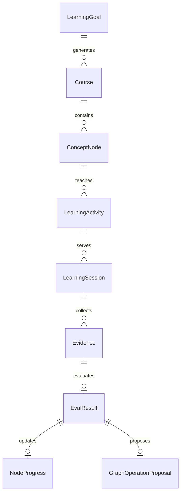
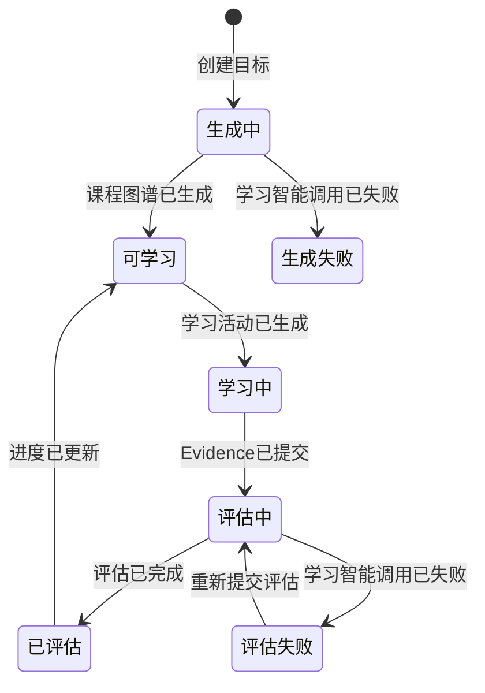
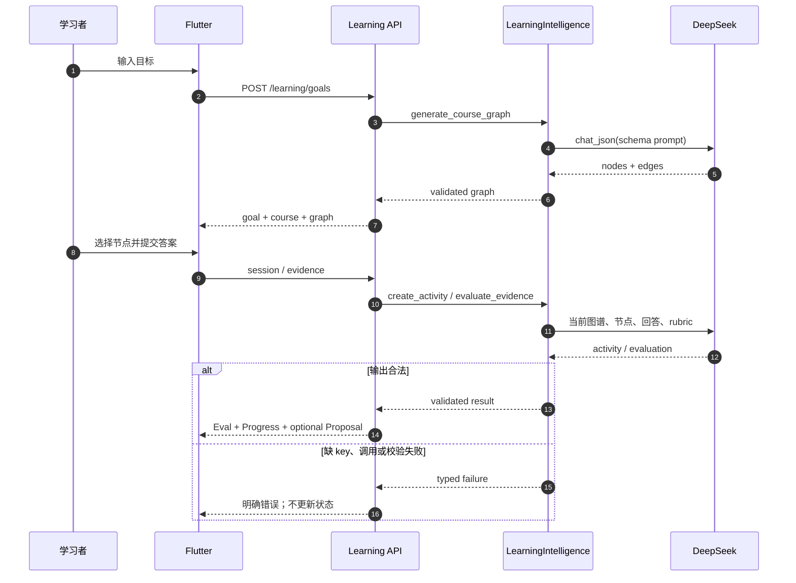
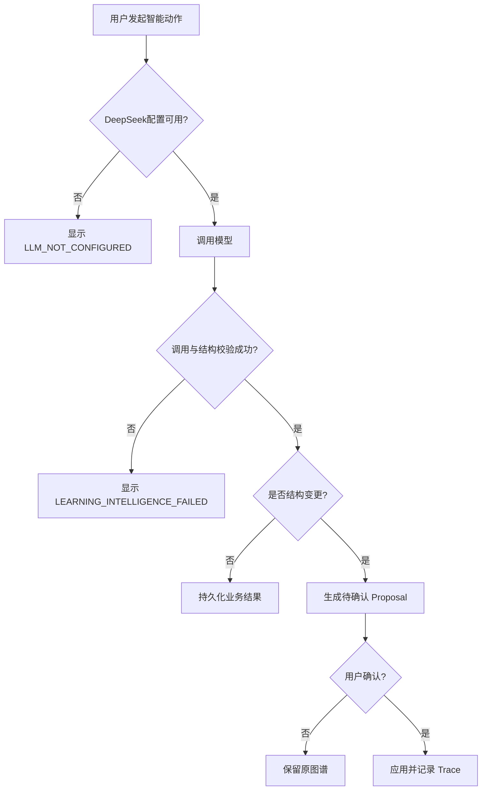
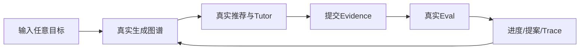

# 需求分析：R4 真实 DeepSeek 学习智能接入

# 人类卷

## A. 用户使用地图

| 角色 | 场景 | 任务 |
|------|------|------|
| 学习者 | 输入任意学习目标 | 得到由真实模型生成、与目标匹配的课程图谱，而不是固定 Agent Runtime 示例。 |
| 学习者 | 选择一个可学习节点 | 得到真实 Tutor 生成的讲解、洞察、练习题与验收要求。 |
| 学习者 | 提交答案 | 得到真实 Evaluator 对 Evidence 的评分、原因、薄弱点和图谱变更建议。 |
| 开发者 | 模型或输出异常 | 看到可诊断失败与 trace；系统不伪装成功、不写入假进度。 |

## B. 关键业务时刻

```text
目标已提交 → 课程图谱已生成 → 节点已推荐 → 学习活动已生成 → Evidence 已提交
→ 评估已完成 → 进度已更新 →（可选）图谱变更已提案 → 用户确认后图谱已更新
```

| 时刻 | 谁触发 | 用户得到什么 |
|------|--------|--------------|
| 课程图谱已生成 | 学习者 + DeepSeek | 与目标相关的节点、依赖和初始状态。 |
| 学习活动已生成 | 学习者 + Tutor | 当前节点专属内容与题目。 |
| 评估已完成 | 学习者 + Evaluator | 基于回答内容的分数、判断、原因与薄弱点。 |
| 图谱变更已提案 | Evaluator | 可审阅、可拒绝、可追踪的结构建议。 |

## C. 关键业务规则（Do / Don't）

- **Do**：所有语义生成与语义判断均通过通用底座 `agent/infrastructure/llm.py` 调用真实 DeepSeek。
- **Do**：模型结构化输出必须经过 schema、引用完整性和 DAG 校验后才能落库。
- **Do**：推荐节点必须属于当前课程且前置依赖已满足；图谱写入保持 proposal → confirm → apply。
- **Don't**：缺 key、超时、模型错误或 JSON 非法时，不得回退到固定节点、固定题目、长度评分或伪 Tutor 文案。
- **Don't**：不存在账号/连续学习能力时，不展示 Vincent、Level、12 days 等虚构信息。
- **前提 → 后果**：只有真实 Eval 成功并持久化后，才能更新 NodeProgress；失败时 Evidence 可保留，但进度和图谱不变。

## D. 需求问题清单

| # | 类 | 一句话问题 | 结论 |
|---|----|-----------|------|
| P0-1 | 🕳️ | 当前演示端口是否允许继续作为失败兜底？ | 不允许；失败必须显式。已闭环。 |
| P0-2 | 🤔 | “全都接入真的”是否包含 UI 中的假用户和固定布局？ | 包含；删除假身份，图谱动态布局。已闭环。 |
| P0-3 | 🕳️ | 模型生成图谱可否直接写入？ | 不可；创建期须校验，结构变更期须人工确认。已闭环。 |

<!-- AI工作底稿 ↓ -->

## 〇、战略层（Why）

- **痛点**：现有 API 虽真实走 HTTP，但目标图谱、Tutor、题目、评分、推荐和提案由固定内容或字符串长度启发式产生，产品行为仍是演示。
- **量化目标**：生产路径固定学习内容为 0；语义评分启发式为 0；无效模型输出造成的状态误写为 0；任意非空学习目标均可触发真实课程生成。
- **用户故事**：作为学习者，我希望每个学习环节由真实模型结合当前目标、图谱和 Evidence 推理，以便获得可信的个性化学习闭环。

## 一、PRD 摘要

在现有本地优先 R4 学习系统上新增真实 DeepSeek 学习智能层。创建目标、推荐、Tutor/练习、Evidence 评估和图谱提案均使用 `agent/infrastructure/llm.py` 的 DeepSeek 客户端。Flutter 只展示 API 返回的事实，不再本地拼固定内容或虚构账号指标。模型不可用时返回明确错误，校验失败不得污染图谱、评估、进度或 proposal。

## 一·五、范围层（What）

| 包含功能 | 优先级 |
|----------|--------|
| DeepSeek 结构化学习智能端口与严格校验 | P0 |
| 动态课程图谱与下一节点推荐 | P0 |
| 动态 Tutor 学习活动与练习题 | P0 |
| Evidence 语义评估、薄弱点与图谱提案 | P0 |
| Flutter 动态渲染、图布局和假数据清理 | P0 |
| mock 契约回归 + 显式开启的在线 DeepSeek smoke | P0 |

**明确不做**：账号体系、云同步、连续学习统计、外部知识库/RAG、流式 token、自动应用图谱变更、远程部署。

## 一·六、事件风暴 + 业务逻辑图

| 命令 | 聚合 / 不变条件 | 业务事件 |
|------|-----------------|----------|
| 创建学习目标 | LearningGoal；标题非空，模型输出为合法 DAG | 课程图谱已生成 |
| 请求下一节点 | Course/Progress；节点存在且前置已满足 | 节点已推荐 |
| 开始节点学习 | LearningSession；节点属于课程 | 学习活动已生成 |
| 提交 Evidence | Evidence；内容非空 | Evidence 已提交 |
| 评估 Evidence | EvalResult；结果引用本 Evidence/节点且 schema 合法 | 评估已完成 |
| 更新进度 | NodeProgress；仅消费成功 EvalResult | 进度已更新 |
| 提交结构建议 | GraphOperationProposal；节点/边合法 | 图谱变更已提案 |
| 确认并应用 | Graph；必须有人确认且 proposal 未过期 | 图谱已更新 |









## 二、范围与入口矩阵

| 入口/场景 | 触发条件 | 目标页面 |
|-----------|----------|----------|
| Goal 输入 | 标题非空 | Graph/Path |
| Graph 节点 | 节点可学习 | Tutor/Practice |
| Practice 提交 | answer 非空 | Review |
| Proposal 卡片 | Evaluator 给出结构建议 | Graph confirm |

## 三、数据字典 / 字段规则

| 字段 | 类型 | 必填 | 来源 | 校验 |
|------|------|------|------|------|
| CourseDraft.nodes | array[6..12] | 是 | DeepSeek | id/title 唯一、非空、均属于课程 |
| CourseDraft.edges | array | 是 | DeepSeek | 引用存在节点、无自环、DAG |
| LearningActivity.content | string | 是 | DeepSeek Tutor | 非空 |
| LearningActivity.question | string | 是 | DeepSeek Tutor | 可回答且与节点相关 |
| Evaluation.score | number[0..1] | 是 | DeepSeek Evaluator | 有限数值 |
| Evaluation.passed | bool | 是 | DeepSeek Evaluator | 与 score/rubric 自洽 |
| Evaluation.gaps | array[string] | 是 | DeepSeek Evaluator | 可为空但必须存在 |
| proposal | object/null | 是 | DeepSeek Evaluator | 若存在则通过图谱校验且须人工确认 |

## 四、边界情况清单

| # | 边界场景 | 期望行为 | 严重度 |
|---|----------|----------|--------|
| B1 | 缺 `DEEPSEEK_API_KEY` | 503 + `LLM_NOT_CONFIGURED`，不创建课程假数据 | P0 |
| B2 | 模型超时/限流/网络失败 | 502 + 可重试错误，不改业务状态 | P0 |
| B3 | JSON 非法或修复后仍不合 schema | 502 + 校验摘要，不落库 | P0 |
| B4 | 图谱有悬空边/环/重复节点 | 拒绝整个 draft | P0 |
| B5 | 推荐不存在或依赖未满足节点 | 拒绝模型建议，不创建 session | P0 |
| B6 | 重复提交 Evidence | 沿用现有幂等/独立 Evidence 规则；每次真实评估可追踪 | P1 |
| B7 | 动态节点超过屏幕 | 动态拓扑布局并可滚动/缩放，不重叠在同一点 | P0 |

## 五、异常流程矩阵

| 触发条件 | 用户可见反馈 | 系统行为 | 可恢复 |
|----------|--------------|----------|--------|
| key 缺失 | “未配置 DeepSeek” | 终止调用，无状态写入 | 是，配置后重试 |
| DeepSeek 4xx/5xx/超时 | “学习智能暂不可用” | trace 失败，保留已提交 Evidence | 是 |
| 输出 schema 失败 | “模型返回无法验证” | 不更新进度/图谱 | 是 |
| recommendation 非法 | “未找到合法下一节点” | 不创建 session | 是 |
| proposal 非法 | Eval 可保留，proposal 丢弃并记录校验失败 | 不改图谱 | 是 |

## 五·五、集成与人机协同边界

| 集成点 | 类型 | 触发事件 | 失败/补偿 |
|--------|------|----------|-----------|
| DeepSeek chat completion | 同步 API | 目标/推荐/活动/评估请求已发起 | 明确失败，由用户重试；无固定兜底 |

| 动作 | 全自动 | AI建议+人工确认 | 纯人工 |
|------|:------:|:---------------:|:------:|
| 生成初始课程草案并经代码校验保存 | ✓ | | |
| 推荐下一节点、生成学习活动、评估 Evidence | ✓ | | |
| 应用后续图谱结构变更 | | ✓ | |
| 提交答案、批准/拒绝图谱变更 | | | ✓ |

## 六～八、扫描结论

- **逻辑问题已闭环**：HTTP 真实不等于智能行为真实；S6 以语义来源和失败语义为准。
- **交互冲突已闭环**：删除无后端来源的用户身份/连续学习显示；空白 goal 输入不再预填特定主题。
- **整体遗漏已闭环**：补齐模型不可用、结构校验、状态原子性、动态图布局、在线 smoke 门禁。



## 九、验收标准

| # | 验收项 | 锚定事件 | Given | When | Then | 优先级 |
|---|--------|----------|-------|------|------|--------|
| AC-S7-1 | 动态课程图谱 | 课程图谱已生成 | 配置真实 DeepSeek，输入任意非固定目标 | 创建目标 | API 返回模型生成且通过 DAG 校验的 6–12 节点图谱，生产路径无 `INITIAL_NODES/EDGES` | P0 |
| AC-S7-2 | 真实推荐 | 节点已推荐 | 有当前图谱和真实进度 | 请求推荐 | DeepSeek 返回 node/reason，服务端验证节点与依赖后响应 | P0 |
| AC-S7-3 | 真实 Tutor/练习 | 学习活动已生成 | 选择合法节点 | 开始 session | API 返回该节点专属 content/insight/question/rubric，Flutter 原样消费 | P0 |
| AC-S7-4 | 真实 Evidence Eval | 评估已完成 | 提交有语义差异的答案 | 触发 evaluator | score/passed/reason/gaps 来自 DeepSeek 且只有成功后更新进度 | P0 |
| AC-S7-5 | 真实图谱提案 | 图谱变更已提案 | Eval 判断需补前置/拆分 | 返回 proposal | 提案内容动态生成并经校验，未经确认不能 apply | P0 |
| AC-S7-6 | 动态 Flutter | 学习事实已展示 | 任意动态节点集合 | 打开五视图 | 无固定题目/Tutor/节点坐标/假用户指标，节点不重叠 | P0 |
| AC-S7-7 | 在线验证 | DeepSeek闭环已验证 | `R4_LIVE_DEEPSEEK=1` 且 key 可用 | 执行 live smoke | 完成 goal→activity→evidence/eval 并保留测试证据 | P0 |
| AC-S7-8 | 声明式 Agent 统一 | 学习角色定义已加载 | R3 已有 AgentDefinition loader/runtime，R4 有四个学习角色 | 启动 Learning API 并运行学习闭环 | 四角色各有独立 JSON+Markdown Definition；模型 prompt 与 Runtime trace 使用同一 definition id/version；API 不再手写角色 callable | P0 |
| AC-S7-反1 | 不静默降级 | — | key 缺失或模型失败 | 请求任一智能动作 | 返回明确错误，固定内容和进度更新均不发生 | P0 |
| AC-S7-反2 | 非法输出不污染 | — | 模型返回非法 JSON、悬空边或环 | 服务端校验 | 图谱/进度/proposal 不发生写入 | P0 |

## 十、待产品确认

**P0：0。** 用户已明确“全都接入真的”，当前由 `agent/infrastructure/llm.py` 提供通用 DeepSeek 适配；四个学习角色必须复用 R3 声明式 AgentDefinition 体系，API 内不得保留第二套角色定义。失败不使用演示兜底。账号体系、知识库与流式输出是明确非目标。

## 十一、分析结论

| 项 | 结论 |
|----|------|
| 可否进入架构设计 | ✅ P0=0，可进入 |
| 关联架构 plan | `Plans/技术方案/2026-08-03-R4真实DeepSeek学习智能接入.md` |

## 反馈（skill_run）

```yaml
skill_run:
  skill: requirement-analyst
  plan: Plans/需求分析/2026-08-03-R4真实DeepSeek学习智能接入.md
  date: 2026-08-03
  contexts_used:
    - path: Contexts/需求分析/需求分析规范.md
      utility: high
      reason: "用事件链、四图、异常矩阵和反例把真实模型与状态写入边界收敛为可测需求。"
    - path: Plans/学习循环/2026-08-02-学习实践-智能体开发-09-R4知识图谱驱动学习系统.md
      utility: high
      reason: "复用既有领域对象、HITL 图谱写入和双主线边界，避免重建项目。"
  contexts_missing: []
  contexts_stale: []
  outcome_status: pass
  revisit_needed: false
```
