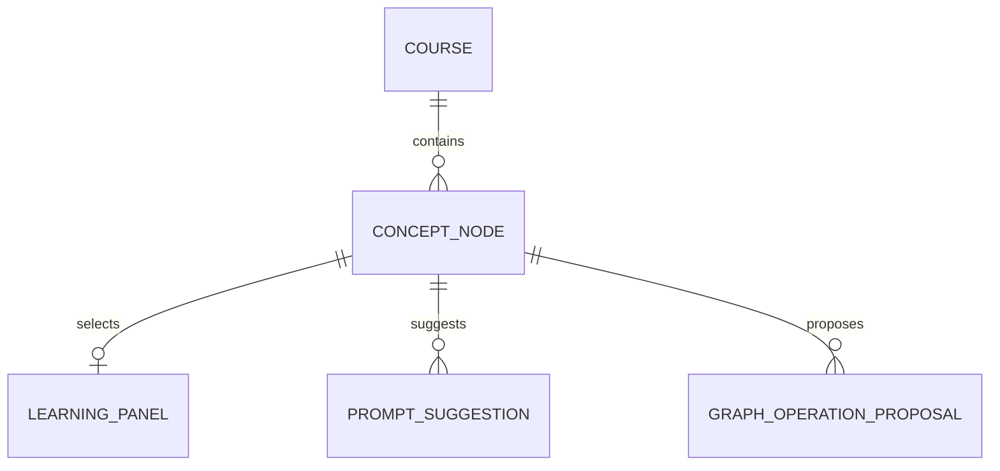
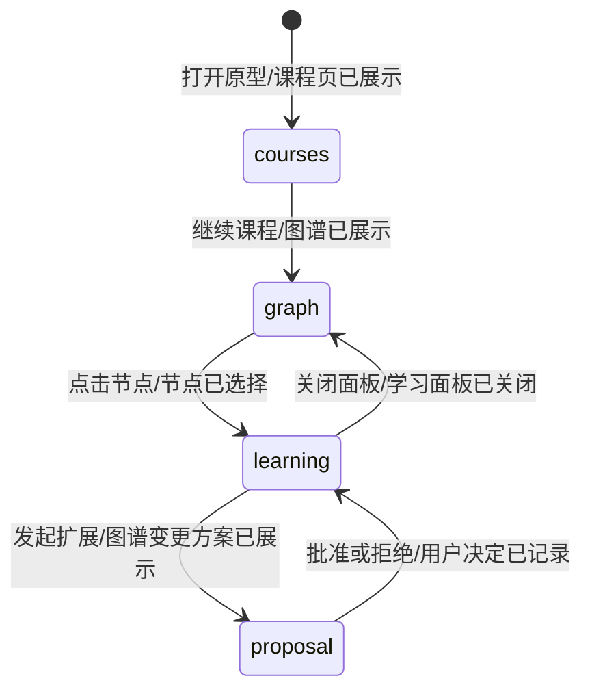
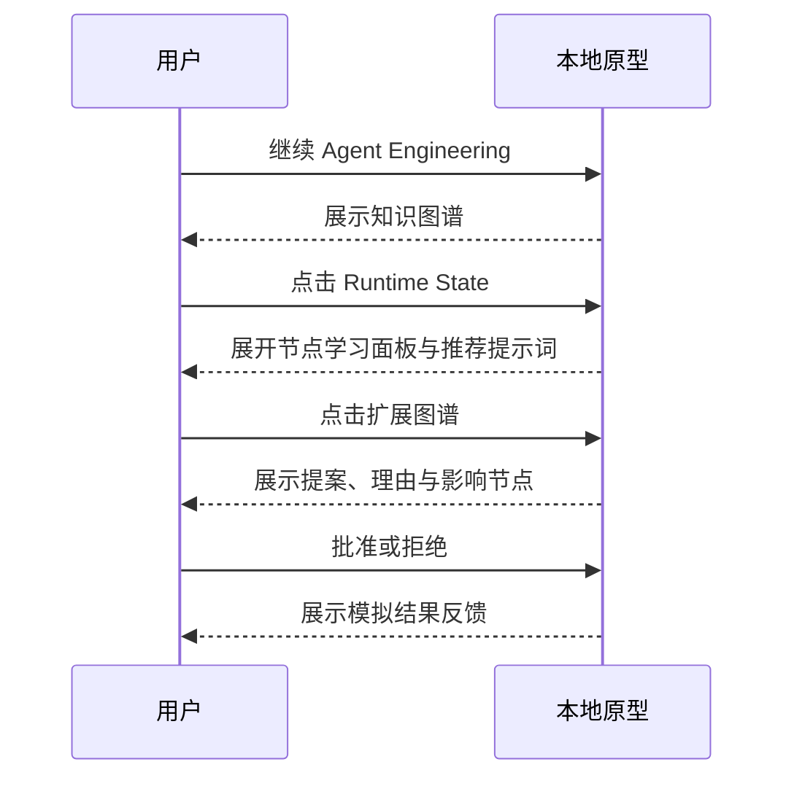
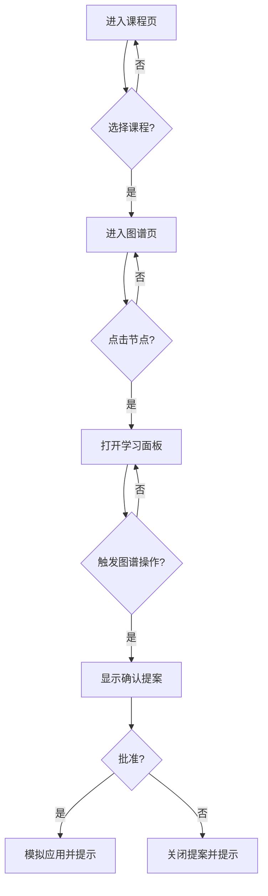

# 需求分析：知识图谱学习系统深色 UI 原型

# 人类卷

## A. 用户使用地图

| 角色 | 场景 | 任务 |
|------|------|------|
| 学习者 | 想系统学习一个主题 | 输入目标、选择课程并查看当前进度 |
| 学习者 | 进入课程 | 在知识图谱中选择节点，打开绑定该节点的学习面板 |
| 学习者 | 需要深化知识点 | 发起扩展/拆分操作，阅读方案后批准或拒绝 |

## B. 关键业务时刻

```text
课程页已展示 → 课程已选择 → 图谱已展示 → 节点已选择 → 学习面板已展开
→ 提问已提交 / 图谱变更方案已展示 → 用户决定已记录 → 原型反馈已展示
```

## C. 关键业务规则

- **Do**：深色现代视觉，信息密度适中，知识图谱是主视觉，状态和进度可一眼识别。
- **Do**：节点学习内容、推荐提示词与图谱操作始终绑定当前节点。
- **Do**：图谱结构变更先展示理由、影响节点与风险，再允许批准或拒绝。
- **Don't**：UI 不直接声称修改真实图谱，不调用 API，不实现登录、存储或 Agent 业务逻辑。
- **交付载体变更**：用户明确要求放在仓库 `tmp`；因本机无 Flutter SDK，本轮交付可运行 HTML/CSS/JS 高保真交互原型，后续再移植 Flutter。

## D. 需求问题清单

| # | 类 | 一句话问题 | 结论 |
|---|----|-----------|------|
| P0-1 | 🤔 | 没有设计稿时视觉真理源是什么？ | 用户确认“深色、现代 UI”，由本轮原型建立第一版视觉基准，已闭环 |
| P0-2 | 🕳️ | 原型放在外部 Figma 还是仓库？ | 用户指定 `tmp`，已闭环 |
| P0-3 | 🕳️ | 没有 Flutter SDK 是否冒充 Flutter 成品？ | 否；交付浏览器原型并明确 Flutter 待移植，已闭环 |

<!-- AI工作底稿 ↓ -->

# AI 工作底稿

## 〇、战略与范围

- **痛点**：后端 Runtime、Trace、Eval 已具备，但缺少可直观验证产品闭环的 UI 载体。
- **目标**：在一个本地可打开的原型中表达课程入口、图谱学习、节点面板、流式内容和图谱确认交互。
- **包含**：桌面/移动响应式布局、深色视觉 token、模拟数据、关键点击交互、确认弹层、截图验证。
- **不包含**：真实 Flutter 编译、网络请求、持久化、账户、埋点、运行时接线。

## 一、事件风暴与四图

| 命令 | 聚合 / 不变条件 | 业务事件 |
|------|-----------------|----------|
| 打开原型 | PrototypeApp；默认进入课程页 | 课程页已展示 |
| 继续课程 | CourseCard；必须存在目标课程 | 图谱已展示 |
| 点击图谱节点 | SelectedNode；学习面板只绑定当前节点 | 节点已选择 |
| 提交问题 | LearningPanel；空输入不得提交 | 提问已提交 |
| 发起图谱扩展 | GraphOperationProposal；不得直接应用 | 图谱变更方案已展示 |
| 批准/拒绝方案 | HumanDecision；只能产生模拟反馈 | 用户决定已记录 |









## 二、视觉与交互数据字典

| 项 | 类型 | 规则 |
|----|------|------|
| Theme | enum | 仅深色；背景接近黑蓝，表面层分级，青色主强调、紫色次强调 |
| CourseProgress | 0–100 | 卡片与图谱节点均显示，但不允许原型直接修改真实进度 |
| NodeStatus | enum | complete / active / available / locked，需通过颜色、形状和文本冗余表达 |
| LearningPanel | overlay | 桌面侧滑、移动端底部抽屉；可关闭，不遮挡关键退出路径 |
| ProposalModal | dialog | 显示摘要、理由、影响节点、风险与批准/拒绝按钮 |
| Toast | status | 模拟交互结果，自动消失并使用 `aria-live` |

## 三、边界与异常

| 场景 | 期望行为 |
|------|----------|
| 目标输入为空 | 生成按钮不执行并提示输入学习目标 |
| 提问输入为空 | 不新增消息 |
| 小屏设备 | 侧栏变底部导航，学习面板变底部抽屉，图谱可横向浏览 |
| 节点锁定 | 可查看依赖提示，不进入可编辑状态 |
| 拒绝提案 | 不新增节点，仅提示已保留原图谱 |
| 无 Flutter SDK | 不虚报 Flutter 成品，浏览器原型作为移植输入 |

## 四、验收标准

| # | 验收项 | 锚定事件 | Given | When | Then | 优先级 |
|---|--------|----------|-------|------|------|--------|
| AC-S4-1 | 课程入口 | 课程页已展示 | 打开 index.html | 页面加载 | 能看到目标输入、最近学习与课程卡片 | P0 |
| AC-S4-2 | 图谱主视图 | 图谱已展示 | 位于课程页 | 点击继续课程 | 显示节点、依赖线、状态图例与进度 | P0 |
| AC-S4-3 | 节点学习面板 | 节点已选择 | 位于图谱页 | 点击节点 | 面板展示绑定节点、流式内容、推荐提示词和输入框 | P0 |
| AC-S4-4 | 人工确认 | 图谱变更方案已展示 | 学习面板已打开 | 点击扩展图谱 | 弹层显示理由/影响/风险，批准前不出现应用成功反馈 | P0 |
| AC-S4-5 | 响应式 | 原型已展示 | 视口宽度 390px | 打开课程页和图谱页 | 无主体横向溢出，关键操作可触达 | P0 |
| AC-S4-反 | 禁止伪接入 | — | 原型未接 API | 执行任意操作 | 不应写入真实课程、图谱或 Runtime | P0 |

## 五、分析结论

P0=0，可进入纯 UI 原型开发。交付介质变更已限定为 `tmp` 本地原型，不扩大业务范围。

## 反馈（skill_run）

```yaml
skill_run:
  skill: requirement-analyst
  plan: Plans/需求分析/2026-08-03-知识图谱学习系统深色UI原型.md
  date: 2026-08-03
  contexts_used:
    - path: Plans/学习循环/2026-08-02-学习实践-智能体开发-09-R4知识图谱驱动学习系统.md
      utility: high
      reason: "投影课程页、图谱页、节点面板与 proposal-confirm 交互范围。"
    - path: Contexts/需求分析/需求分析规范.md
      utility: high
      reason: "用事件链与四图把本地视觉原型的入口、退出、确认和响应式验收写成可测契约。"
  contexts_missing: []
  contexts_stale: []
  outcome_status: pass
  revisit_needed: false
```
