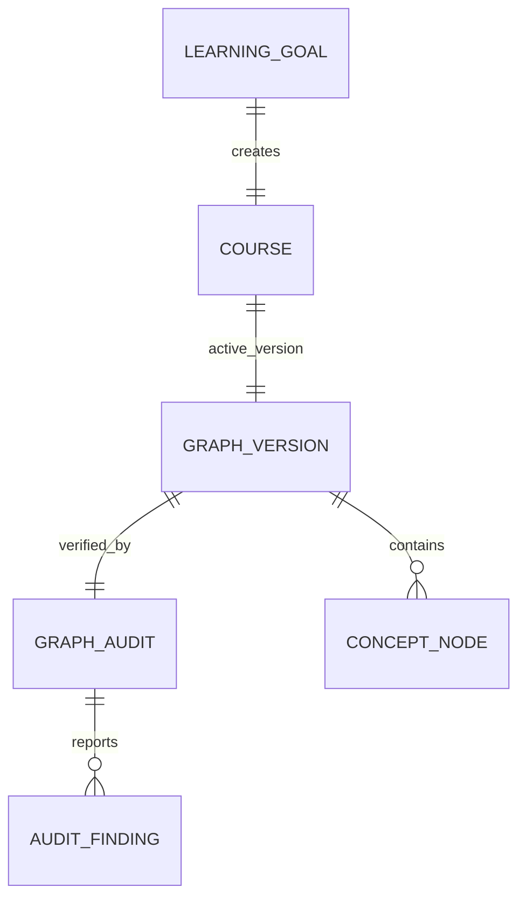
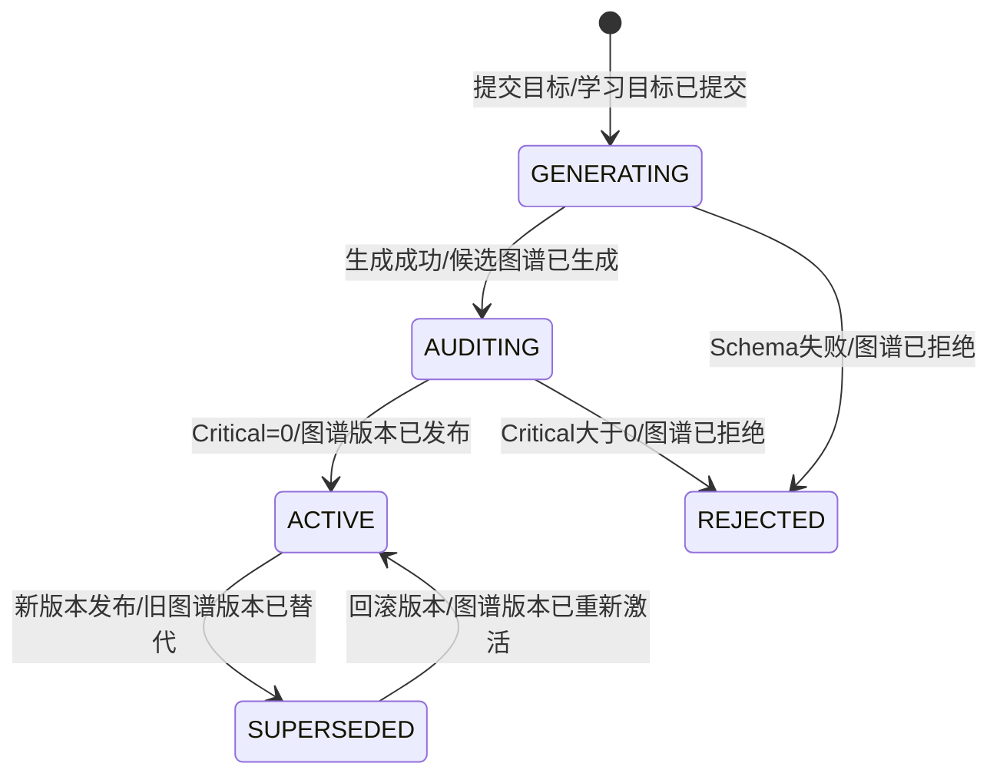
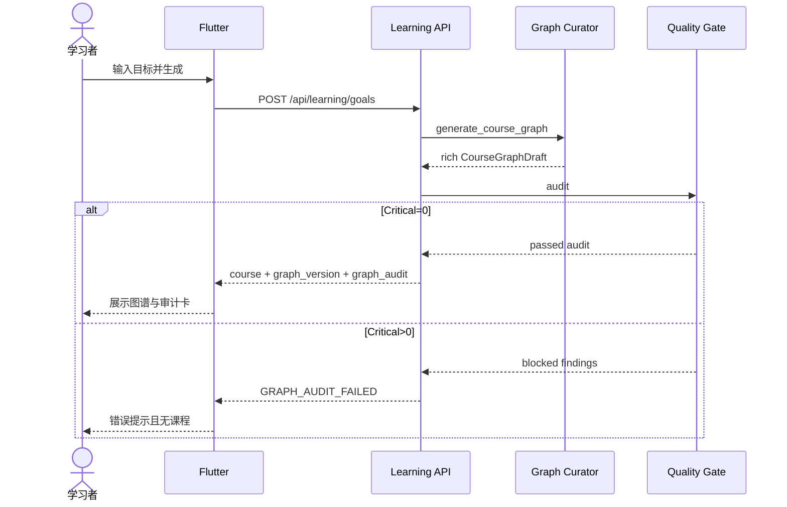
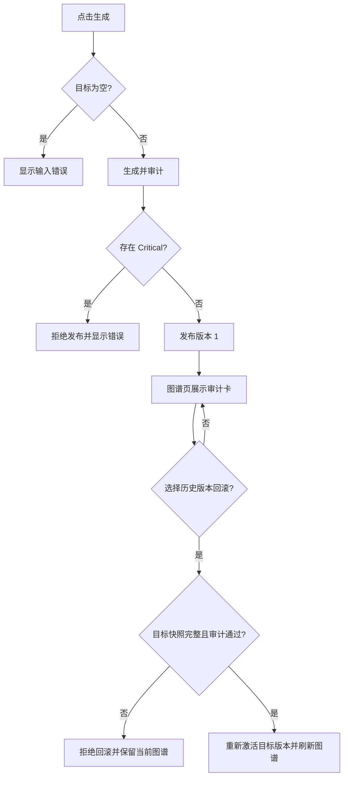

# 需求分析：图谱质量审计

# 人类卷

## A. 用户使用地图

| 角色 | 场景 | 任务 |
|---|---|---|
| 学习者 | 输入学习目标并等待图谱生成 | 只接收通过关键质量门禁的图谱，并看到版本和审计结果 |

## B. 关键业务时刻

```text
提交目标 → 候选图谱已生成 → 图谱已审计 →（通过）图谱版本已发布 /（不通过）图谱已拒绝
```

| 时刻 | 谁触发 | 用户得到什么 |
|---|---|---|
| 学习目标已提交 | 学习者 | 生成中的明确状态 |
| 候选图谱已生成 | Graph Curator | 尚未对用户发布的候选图 |
| 图谱已审计 | Quality Gate | 分数、检查项与问题 |
| 图谱版本已发布 | 系统 | 可查看、可学习的版本 1 |
| 图谱已拒绝 | 系统 | 明确错误，不产生任何课程数据 |

## C. 关键业务规则

- **Do**：每个节点必须有学习目标；每个叶子节点必须有关键问题、至少两项掌握量规和至少两类活动能力。
- **Do**：结构、节点信息和审计通过后才持久化课程。
- **Do**：图谱页展示版本、审计状态、得分、检查项与问题数。
- **Don't**：模型返回 JSON 不能绕过 schema 与质量门禁直接入库。
- **Don't**：审计失败时不能创建残留 Goal/Course/Node 数据。
- **Do**：节点增删改拆的 Proposal 必须基于当前版本预审计，获批时再次校验并发布为下一版本。
- **Do**：每个发布版本保存不可变节点/边快照；回滚只切换激活版本，不删除新版本、证据或进度。
- **本轮边界**：US-003 交付历史版本快照、查询与回滚；版本差异可视化留待后续。

## D. 需求问题清单

| # | 类 | 一句话问题 | 结论 |
|---|---|---|---|
| P1-01 | 🕳️ | 来源真实性需要检索与可信度校验，本 Story 是否实现？ | 本 Story 只检查引用完整性；可信来源检索后续实现 |
| P1-02 | 🕳️ | 节点操作后如何生成新版本？ | US-002：预审计 + 获批重验 + 发布 vN+1 |
| P1-03 | 🕳️ | 如何恢复历史版本完整节点快照？ | US-003 保存不可变快照并通过激活版本切换恢复 |

<!-- AI工作底稿 ↓ -->

# AI 工作底稿

## 〇、战略层

- **痛点**：当前图谱只有 6–12 节点严格树和标题，生成成功不等于可教、可练、可评。
- **目标**：首次发布的图谱 Critical 审计问题为 0；图谱页 100% 展示审计事实。
- **用户故事**：作为学习者，我想在图谱生成后查看质量审计报告，并阻止 Critical 图谱发布，以便避免在明显不完整的路径上学习。

## 一、范围

| 包含功能 | 优先级 |
|---|---|
| 丰富候选节点契约 | P0 |
| 确定性质量审计与拒绝入库 | P0 |
| 初始 GraphVersion 与 Audit 持久化 | P0 |
| Flutter 图谱审计卡 | P0 |
| 节点增删改拆后生成下一版本并重新审计 | P0 |
| 历史版本查询、不可变快照与非破坏性回滚 | P0 |

**明确不做**：外部来源抓取、LLM Critic、版本差异可视化、A/B 实验、活动策略。

## 二、事件风暴与四图

| 命令 | 聚合 / 不变条件 | 业务事件 |
|---|---|---|
| 提交学习目标 | Goal 标题非空 | 学习目标已提交 |
| 生成候选图谱 | 输出通过结构 schema | 候选图谱已生成 |
| 审计候选图谱 | Critical=0 才允许发布 | 图谱已审计 |
| 发布首次版本 | 版本号=1、状态=active | 图谱版本已发布 |
| 拒绝候选图谱 | Critical>0、禁止领域写入 | 图谱已拒绝 |
| 审批图谱变更 | base version 必须仍为 active | 图谱变更已确认 |
| 发布变更版本 | 候选变更 Critical=0 | 新图谱版本已发布 |
| 回滚图谱版本 | 目标版本属于课程且审计通过 | 图谱版本已重新激活 |









## 三、数据字典

| 字段 | 类型 | 必填 | 规则 | 来源 |
|---|---|---:|---|---|
| node.objective | string | 是 | 非空、面向可观察能力 | 模型输出 |
| node.key_questions | string[] | 叶子必填 | 至少 1 项 | 模型输出 |
| node.misconceptions | string[] | 否 | 可为空 | 模型输出 |
| node.activity_capabilities | enum[] | 叶子必填 | 至少 2 种 | 模型输出 |
| node.mastery_rubric | string[] | 叶子必填 | 至少 2 项 | 模型输出 |
| node.source_refs | string[] | 否 | 缺失记 warning | 模型输出 |
| graph_version.version | int | 是 | 首次固定为 1 | 系统 |
| graph_version.base_version_id | string | 否 | 变更版本指向生成它的 active 版本 | 系统 |
| graph_snapshot.nodes/edges | object | 是 | 与 graph_version 一一对应，发布后内容不可覆盖 | 系统 |
| graph_audit.score | int | 是 | 0–100 | Quality Gate |
| finding.severity | enum | 是 | critical/warning | Quality Gate |

## 四、边界情况清单（必填）

| # | 边界场景 | 期望行为 | PRD 是否写明 | 严重度 |
|---|---|---|---|---|
| B1 | 首次课程、没有历史版本 | 只显示 active v1；历史列表为空回滚项 | 是 | P0 |
| B2 | 图谱增长到 40 节点上限 | 允许审计与发布；超过上限按结构校验拒绝 | 是 | P1 |
| B3 | Proposal 基于旧 base version 重复确认 | 返回 GRAPH_VERSION_CONFLICT，active 图谱不变 | 是 | P0 |
| B4 | 目标版本属于其他课程 | 返回 INVALID_GRAPH_ROLLBACK，禁止跨课程读取/激活 | 是 | P0 |
| B5 | 模型或网络超时 | 使用既有错误通道，不产生半成品或部分版本 | 是 | P0 |
| B6 | 旧课程没有版本、审计或快照 | 客户端显示 legacy/unavailable；不提供回滚 | 是 | P0 |
| B7 | 回滚到当前 active 版本 | 返回 INVALID_GRAPH_ROLLBACK，避免无意义写入 | 是 | P1 |
| B8 | 回滚后再次发布 | 新版本号取历史最大值加一，不覆盖被保留的后续版本 | 是 | P0 |

## 五、异常流程矩阵（必填）

| 触发条件 | 用户可见反馈 | 系统行为 | 是否可恢复 | PRD 是否写明 |
|---|---|---|---|---|
| 模型输出缺少富字段或结构非法 | 显示生成内容未通过校验 | 最多重试一次；失败时不创建课程记录 | 是，可修改目标重试 | 是 |
| 候选图存在 Critical | 显示候选图未通过质量门禁 | 返回 GRAPH_AUDIT_FAILED；当前图和版本不变 | 是，可重新生成 Proposal | 是 |
| Proposal base version 已过期 | 显示版本冲突并提示重新操作 | 返回 GRAPH_VERSION_CONFLICT；不进入 apply | 是，重新生成 Proposal | 是 |
| 回滚目标跨课程或等于当前版本 | 显示回滚请求无效 | 返回 INVALID_GRAPH_ROLLBACK；零领域写入 | 是，选择其他历史版本 | 是 |
| 快照缺失、损坏、hash 不一致或审计未通过 | 显示历史版本无法恢复 | 返回 GRAPH_SNAPSHOT_INVALID；active projection 不变 | 否，需修复历史数据 | 是 |
| 回滚 API 网络/服务异常 | 显示通用 API 错误，可再次点击 | 前端保留当前 Course；服务端不删除版本/证据/进度 | 是，可重试 | 是 |
| 回滚期间界面离开或刷新 | 重新读取 active Course 和版本历史 | 以服务端 active_version_id 为准恢复界面 | 是 | 是 |

## 六、验收标准

| # | 验收项 | 锚定事件 | Given | When | Then | 优先级 |
|---|---|---|---|---|---|---|
| AC1 | 合格图谱发布 | 图谱版本已发布 | 模型返回结构和富字段完整的图谱 | 用户生成课程 | 返回 active version=1、passed audit，课程已持久化 | P0 |
| AC2 | Critical 图谱拒绝 | 图谱已拒绝 | 叶子缺少掌握量规或活动能力 | 用户生成课程 | 返回 GRAPH_AUDIT_FAILED，且没有 Goal/Course/Node 文件 | P0 |
| AC3 | 审计报告可见 | 图谱已审计 | AC1 已发生 | 用户进入图谱页 | 看到版本、状态、分数、检查项和问题数 | P0 |
| AC4 | 节点契约完整 | 候选图谱已生成 | 合格模型输出 | API 解析并返回课程 | 每个节点包含 objective 等富字段 | P0 |
| AC5 | 旧响应兼容 | — | API 响应不含 v2 审计字段 | Flutter 解析旧课程 | 页面不崩溃并显示审计不可用 | P0 |
| AC2-反 | 不允许半成品 | — | 审计存在 Critical | 创建失败 | 不应发生“图谱版本已发布”事件和领域写入 | P0 |
| AC6 | 获批变更发布下一版本 | 新图谱版本已发布 | active v1 且变更候选通过审计 | 用户确认 expand/split/update/delete | 返回 active v2 和对应 passed audit，审计卡更新 | P0 |
| AC7 | 低质变更不可应用 | 图谱已拒绝 | 新节点缺少学习目标、量规或活动能力 | 用户提交/确认变更 | 返回 GRAPH_AUDIT_FAILED，当前图和版本号不变 | P0 |
| AC8 | 并发版本冲突不可覆盖 | — | Proposal 基于旧 base version | 用户确认变更 | 返回 GRAPH_VERSION_CONFLICT，当前版本不变 | P0 |
| AC9 | 发布版本保存完整快照 | 图谱版本已发布 | 首次或变更版本发布成功 | 系统持久化版本 | 对应版本可恢复完整富节点和边，content hash 一致 | P0 |
| AC10 | 非破坏性回滚 | 图谱版本已重新激活 | 当前 active v2 且 v1 审计通过 | 用户在图谱页回滚 v1 | v1 节点/边恢复并成为 active；v2 快照、证据和进度仍保留 | P0 |
| AC11 | 非法回滚零变更 | — | 目标属于其他课程、为当前版本、缺少/损坏快照或审计未通过 | 用户请求回滚 | 返回明确 409/422 错误，当前图和版本不变 | P0 |

## 六、分析结论

| 项 | 结论 |
|---|---|
| P0 未决 | 0 |
| 可否开发 | ✅ 用户已确认 US-001～US-003，每个 Story 8 点 Scope |
| 架构 | `Plans/技术方案/2026-08-08-自适应知识图谱学习系统架构设计.md` |

## 反馈（skill_run）

```yaml
skill_run:
  skill: requirement-analyst
  plan: Plans/需求分析/2026-08-08-图谱质量审计.md
  date: 2026-08-08
  contexts_used:
    - path: Contexts/需求分析/需求分析规范.md
      utility: high
      reason: 按事件链补齐版本治理边界与异常恢复矩阵
    - path: Templates/需求分析-带验收标准模板.md
      utility: high
      reason: 对齐 workflow gate 要求的强制章节结构
  contexts_missing: []
  contexts_stale: []
  workflow_stage: requirement
  outcome_status: pass
  revisit_needed: false
```

## 反馈（skill_run）

```yaml
skill_run:
  skill: requirement-analyst
  plan: Plans/需求分析/2026-08-08-图谱质量审计.md
  date: 2026-08-08
  contexts_used:
    - path: Contexts/需求分析/需求分析规范.md
      utility: high
      reason: 使用事件链、四图、边界矩阵和锚事件 AC 固化已确认范围
    - path: Contexts/决策/Skill反馈协议.md
      utility: high
      reason: 按统一 schema 记录需求分析反馈
  contexts_missing:
    - 知识图谱质量评分与发布阈值规范
  contexts_stale: []
  outcome_status: pass
  revisit_needed: false
```
