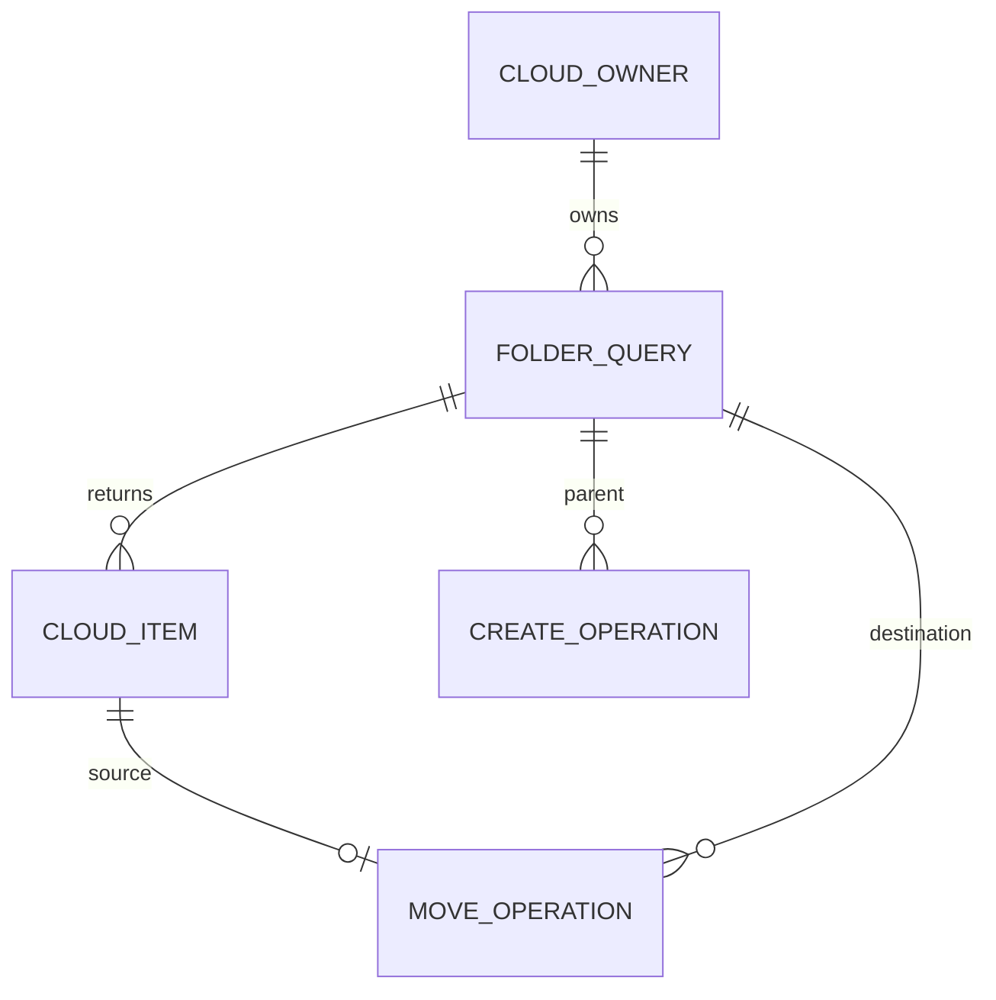
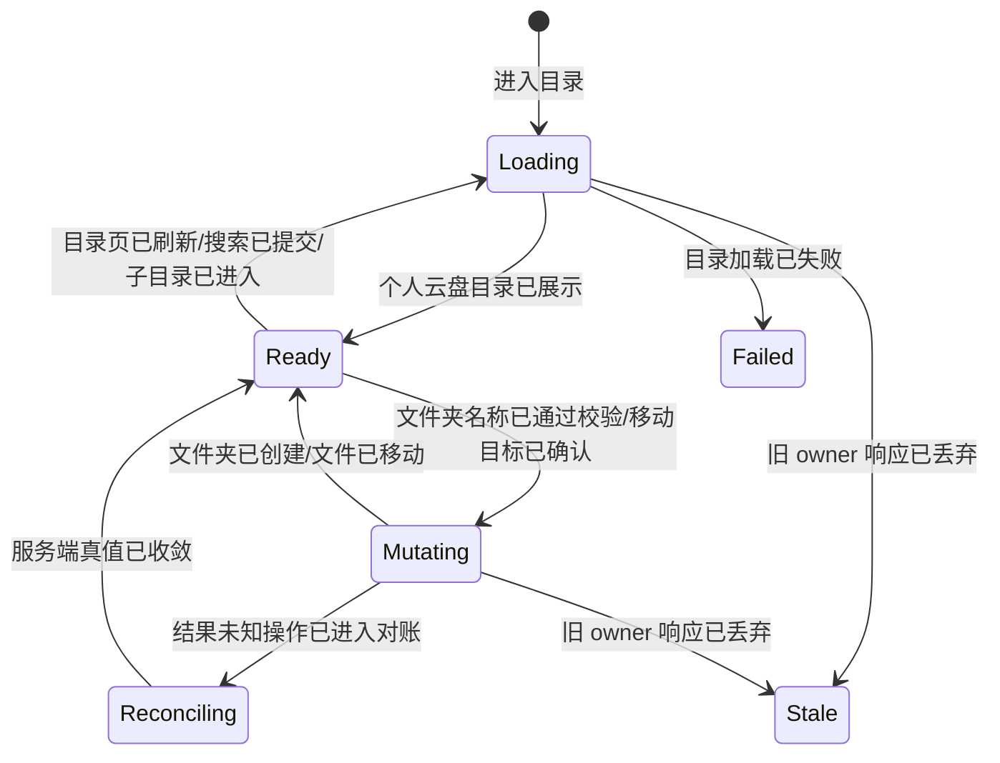
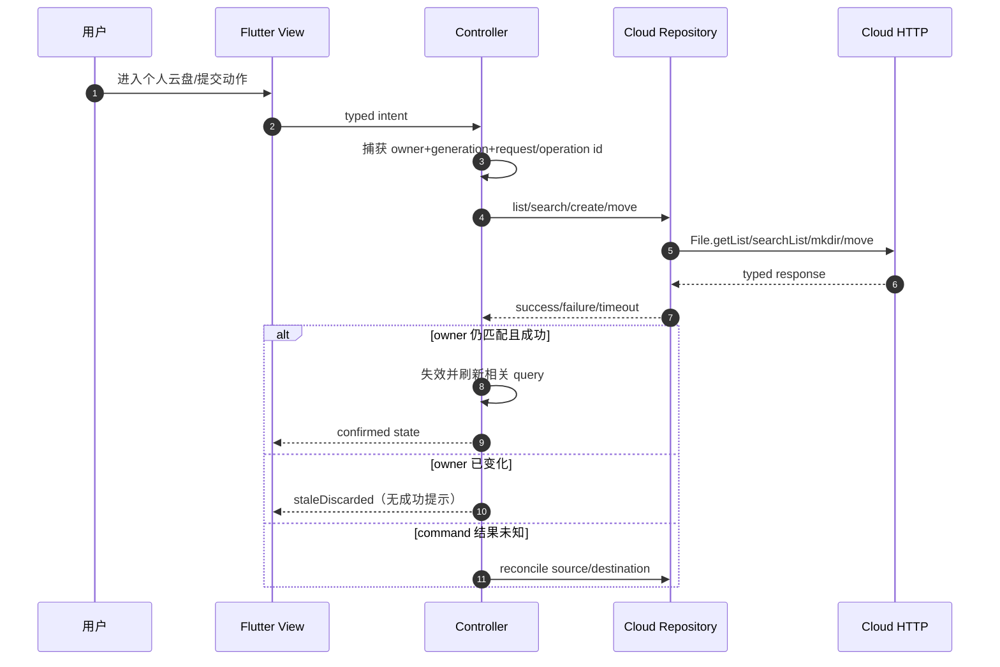
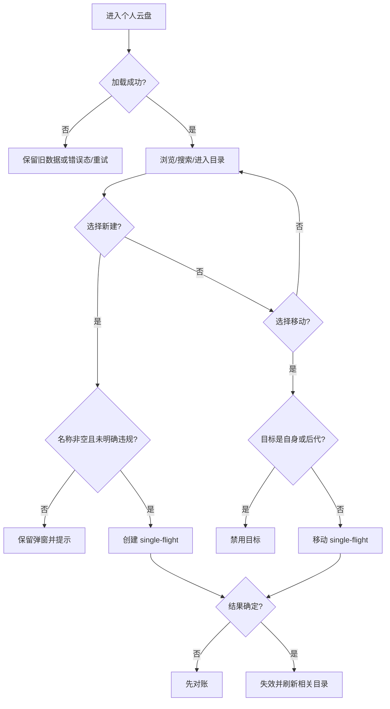
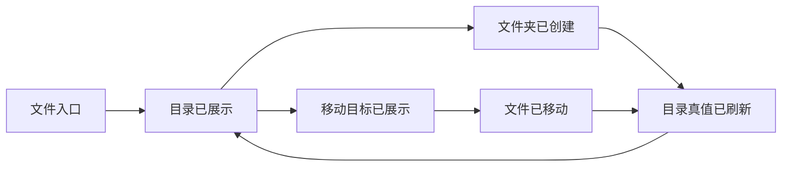

# 需求分析：个人云盘浏览、新建文件夹与移动

# 人类卷

## A. 用户使用地图

| 角色 | 场景 | 任务 |
|------|------|------|
| 已登录用户 | 在“文件”入口整理个人云盘 | 浏览/搜索目录、刷新和分页 |
| 已登录用户 | 需要归类文件 | 创建文件夹，并立即在当前目录看到它 |
| 已登录用户 | 文件位置不正确 | 在目录选择器中选择目标并移动，源/目标列表同步收敛 |

## B. 关键业务时刻

```text
进入文件页 → 个人云盘目录已展示 → 浏览/搜索/进入子目录
                                  ├→ 文件夹名称已校验 → 文件夹已创建 → 当前目录已刷新
                                  └→ 移动目标已展示 → 移动目标已确认 → 文件已移动 → 源/目标已刷新
```

| 时刻 | 谁触发 | 用户看到/得到什么 |
|------|--------|-------------------|
| 个人云盘目录已展示 | 用户进入/刷新 | 当前账号的服务端目录真值；可继续搜索、翻页和进入文件夹 |
| 文件夹已创建 | 用户确认名称 | 弹窗关闭、成功反馈、当前目录出现新文件夹 |
| 移动目标已展示 | 用户点文件操作“移动” | 近全高目录弹层、面包屑、可选目录和“移动到此” |
| 文件已移动 | 用户确认目标且服务端成功 | 弹层关闭，源目录移除该项，目标目录可找到该项 |

## C. 关键业务规则（Do / Don't）

- **Do**：个人云盘固定使用 Cloud HTTP/YunPan provider；AI 文件和 Workspace 可继续使用 Gateway provider。
- **Do**：列表/搜索/分页、创建和移动都绑定 `environment + qid + provider + folder/query/cursor + generation`。
- **Do**：创建明确违规名称时阻断；名称风控网络失败按 iOS 行为降级放行，再由创建接口给最终结果。
- **Do**：创建成功失效当前目录；移动成功同时失效源目录、目标目录及相关搜索。
- **Don't**：不得继续用 Gateway filesystem 根目录冒充个人云盘。
- **Don't**：不得把文件夹移动到自身或任何后代目录。
- **Don't**：command 超时后不得直接重发；先对账服务端真值。
- **Don't**：窗口布局、账号或 provider 切换不得让旧响应更新新 owner。

## D. 需求问题清单（已裁决）

| # | 类 | 问题 | 裁决 |
|---|----|------|------|
| P0-1 | ⚔️ | 现有 Flutter 把个人云盘、AI 文件、Workspace 都接到 Gateway，但 iOS 个人云盘使用 Cloud HTTP | 个人云盘拆回独立 provider adapter；Gateway 只保留其真实子域 |
| P0-2 | 🕳️ | 现有新建和移动仅是通用文本输入，缺失 iOS 已验收交互 | 新建还原居中键盘弹窗；移动还原目录选择底部弹层 |
| P0-3 | 🕳️ | 现有 mutation 缺少完整 owner、结果未知对账和缓存失效 | 按两项 VERIFIED PRE 落地 typed owner、single-flight、reconcile 与失效矩阵 |
| P1-1 | ⚔️ | iOS 移动列表只过滤源目录自身，未可靠过滤后代 | Flutter 收紧为自身与所有后代均禁止 |

<!-- AI工作底稿 ↓ -->

# AI 工作底稿

## 〇、战略层（Why）

- **痛点**：当前页面虽可点，但个人云盘接错 provider，创建/移动是开发骨架而非产品界面，无法以真实账号完成三张任务。
- **目标**：用一套 Flutter 状态与 UI 在五种设备形态上提供与 iOS 产品基线一致的三条链路；旧 owner 回写和重复 mutation 为 0。
- **用户故事**：作为云盘用户，我想浏览目录、创建文件夹并安全移动文件，以便在手机、平板和折叠屏上整理同一份个人文件。

## 一、PRD 摘要

本轮覆盖正式任务 `BUS-046`、`BUS-048`、`BUS-053`。个人云盘列表支持首屏、刷新、分页、搜索和文件夹导航；创建文件夹使用 iOS 风格输入弹窗并处理名称规则；移动文件使用 iOS 风格目录选择弹层并在成功后收敛源/目标目录。所有异步结果按 Cloud owner/generation 隔离，个人云盘与 Gateway AI/Workspace 不混用 provider。上传、下载、重命名、删除和 picker 不在本轮新增范围。

## 一·五、范围层（What）

| 包含功能 | 优先级 |
|----------|--------|
| 个人云盘目录浏览、刷新、分页、搜索、面包屑/返回 | P0 |
| 新建文件夹的名称校验、风控降级、single-flight、失败恢复 | P0 |
| 移动目标目录浏览、禁止非法目标、single-flight、结果未知对账 | P0 |
| iOS 视觉/动效基线与 Compact/Medium/Expanded 状态保持 | P0 |
| owner 变化迟到丢弃、目录/搜索失效 | P0 |

**明确不做**：上传、下载、预览、分享、重命名、删除、文件选择、AI 文件和 Workspace 的新增能力；不复制 iOS 已确认的 owner/filter 缺陷。

## 一·六、事件风暴 + 业务逻辑图

### 事件风暴表

| 命令 | 聚合/不变条件 | 业务事件（过去式） |
|------|---------------|---------------------|
| 进入/刷新目录 | 当前 CloudOwnerKey；仅当前 generation 可提交 | 个人云盘目录已展示 / 目录页已刷新 |
| 加载下一页 | query/cursor 快照；stable identity 去重 | 下一页已合并 |
| 提交搜索 | folder+keyword 新 generation | 搜索结果已展示 |
| 进入文件夹 | 路径必须属于当前 provider/root | 子目录已进入 |
| 提交文件夹名称 | trim 非空；明确违规阻断；single-flight | 文件夹名称已通过校验 / 文件夹已创建 |
| 打开移动选择器 | source owner 固定；仅展示目录 | 移动目标目录已展示 |
| 确认移动 | 目标非自身/后代；single-flight | 移动目标已确认 / 文件已移动 |
| owner 改变 | 先递增 fence，再处理取消 | 旧 owner 响应已丢弃 |
| command 结果未知 | 不直接重发 | 结果未知操作已进入对账 |

### 实体关系



### 状态机



### 主流程时序



### 用户决策图



## 二、范围与入口矩阵

| 入口/场景 | 触发条件 | 目标页面 |
|-----------|----------|----------|
| App Shell“文件”→个人云盘 | 已登录且 Cloud provider 可用 | 个人云盘列表/目录 |
| 列表顶部新建入口或移动弹层右上新建 | 当前目录可写 | 新建文件夹居中弹窗 |
| 文件/文件夹操作菜单“移动” | 当前项属于个人云盘且可移动 | 移动目标底部弹层 |

## 三、数据字典 / 字段规则

| 字段 | 类型 | 必填 | 规则 | 来源 |
|------|------|------|------|------|
| owner | CloudOwnerKey | 是 | environment、qid、provider、stableID、generation | 登录/环境/Cloud adapter |
| folderPath | String | 是 | adapter canonical root 下的规范目录路径 | 服务端/导航 |
| query | String | 否 | trim；空值表示目录列表 | 用户输入 |
| cursor | PageCursor | 否 | provider adapter typed page/cursor，不向 UI 暴露页码差异 | 服务端 |
| item | CloudItem | 是 | provider+remote id/path 形成 stable identity | 服务端 |
| folderName | String | 是 | trim 后非空；明确风控违规阻断 | 用户输入/policy |
| operationId | String | mutation 是 | 同一点击 single-flight；重试必须是新意图且先对账 | Controller |

## 四、边界情况清单

| # | 边界场景 | 期望行为 | 严重度 |
|---|----------|----------|--------|
| B1 | 空目录/空搜索 | 空态但刷新、新建、清除搜索仍可达 | P0 |
| B2 | 大目录分页 | cursor 快照、stable identity 去重，失败不丢既有页 | P0 |
| B3 | 重叠刷新/搜索/分页 | 只接收最新 owner+query generation | P0 |
| B4 | 未登录/provider 不可用 | typed unsupported/denied，不展示假空成功 | P0 |
| B5 | 弱网/超时 | read 可重试；command 结果未知先 reconcile | P0 |
| B6 | 名称空白/违规/policy 网络失败 | 分别禁用/阻断/降级继续 | P0 |
| B7 | 移动到自身/后代 | 目标不可选且不发请求 | P0 |
| B8 | Compact↔Expanded/键盘/旋转 | 路径、搜索、草稿、滚动、pending 保持 | P0 |

## 五、异常流程矩阵

| 触发条件 | 用户反馈 | 系统行为 | 可恢复 |
|----------|----------|----------|--------|
| 本地校验失败 | 按钮禁用或字段提示 | 不请求 | 是 |
| 明确风控拒绝 | 名称不符合规范 | 不调用 mkdir，保留草稿 | 是 |
| policy 网络失败 | 不误报违规 | 允许继续 mkdir并保留降级证据 | 是 |
| HTTP 401/403 | 登录/权限安全提示 | 不清空旧数据；等待 owner/credential 修复 | 是 |
| HTTP 4xx 业务拒绝 | 服务端安全文案 | 恢复按钮，保持当前上下文 | 是 |
| HTTP 5xx/read timeout | 局部错误与重试 | read 不污染现有页 | 是 |
| command timeout/断连 | “正在确认结果” | reconcile 源/目标，禁止直接重发 | 是 |
| owner 已变化 | 无旧成功提示 | staleDiscarded，不写缓存/UI | 自动 |

## 五·五、集成与人机协同边界

| 集成点 | 类型 | 触发事件 | 失败/补偿 |
|--------|------|----------|----------|
| Cloud HTTP adapter | 同步 API | 目录/搜索/创建/移动命令 | typed failure；command timeout reconcile |
| Auth/environment owner | 状态流 | 登录、切号、切环境 | 先换 generation fence，旧响应隔离 |
| Name policy | 同步 API | 提交名称 | 明确违规阻断；网络失败降级继续 |
| Cache invalidation | 应用事件 | 文件夹已创建/文件已移动 | 当前/源/目标/搜索 query refetch |

所有业务选择由用户完成；系统只自动执行校验、请求、owner fencing 和缓存收敛。

## 六、逻辑问题

| # | 问题 | 结论 | 严重度 |
|---|------|------|--------|
| L1 | Gateway filesystem 与个人云盘 Cloud HTTP 被混为一个 Repository | 拆 provider adapter，共享业务模型但不共享远端 identity | P0 已闭环 |
| L2 | iOS 的缓存更新注释掉，成功后依赖通知刷新 | Flutter 明确维护失效矩阵，以 refetch 服务端真值收敛 | P0 已闭环 |
| L3 | iOS move 对自身/后代过滤不足 | Flutter 收紧，不复制缺陷 | P1 已闭环 |

## 七、交互冲突

| # | 场景 A | 场景 B | 结论 |
|---|--------|--------|------|
| I1 | 当前 Flutter 使用 Material AlertDialog 文本路径 | iOS 为产品化居中弹窗/目录底部弹层 | 以 iOS 固定源码和运行结果为主视觉 Oracle |
| I2 | iOS 手机近全高底部弹层 | 平板/折叠屏有更宽窗口 | 保持内容结构与动效；按窗口约束限制宽度/使用 pane，不按平台分叉业务 |

## 八、整体需求遗漏



已补齐：入口、加载/空/错态、分页、搜索、目录导航、新建校验、移动目标、失败/取消/结果未知、成功回流、owner 切换、多端状态保持与生产接线责任。

## 九、验收标准

| ID | Given | When | Then（锚定事件） | 类型 |
|----|-------|------|------------------|------|
| GWT-001 | 根目录有文件和文件夹 | 进入个人云盘 | 按服务端真值展示且“个人云盘目录已展示” | 主链路 |
| GWT-002 | `hasMore=true` | 滚动到底 | 去重追加且“下一页已合并” | 分页 |
| GWT-003 | 已有旧数据 | 刷新失败 | 旧数据保留并显示可恢复错误 | 异常 |
| GWT-004 | 搜索 alpha 在飞 | 立即搜索 beta 且 alpha 后返 | 仅 beta 提交，alpha“旧 owner 响应已丢弃” | 并发 |
| GWT-005 | 当前有子目录 | 进入后点面包屑返回 | 路径正确且“子目录已进入” | 导航 |
| GWT-006 | 目录为空 | 首屏成功 | 空态、新建和刷新入口可达 | 空态 |
| GWT-007 | 新建弹窗打开 | 输入空白 | 确认禁用，无 policy/mkdir 请求 | 反例 |
| GWT-008 | 合法名称 | 确认 | single-flight 成功、弹窗关闭、刷新且“文件夹已创建” | 创建 |
| GWT-009 | policy 明确违规 | 确认 | 保留草稿、不 mkdir、提示违规 | 拒绝 |
| GWT-010 | policy 网络失败 | 确认 | 降级继续 mkdir，最终结果显式 | 降级 |
| GWT-011 | mkdir 在飞 | 重复点击或切号 | 只发一次；旧结果不关闭新 owner UI | 反例 |
| GWT-012 | 文件可移动 | 点“移动” | iOS 结构弹层展示且“移动目标目录已展示” | 移动入口 |
| GWT-013 | 源是 `/a/` | 浏览目标 | `/a/` 和 `/a/**` 不可进入/确认 | 反例 |
| GWT-014 | 目标合法 | 点“移动到此” | single-flight 成功、双目录收敛且“文件已移动” | 移动 |
| GWT-015 | move 明确失败 | 响应返回 | 弹层/路径保留、按钮恢复、安全错误可见 | 异常 |
| GWT-016 | move 结果未知 | 再次操作 | 先 reconcile，确认未执行后才允许新 operation | 恢复 |
| GWT-017 | 弹窗/弹层已打开 | 三档窗口切换 | 草稿/路径/滚动/pending 保持且不重复请求 | 自适应 |
| GWT-018 | owner 变化 | 旧请求返回 | 不写缓存/UI、不弹成功，且“旧 owner 响应已丢弃” | 隔离 |

**非功能验收**：三档 Widget/Golden；键盘、焦点、鼠标/触控板、语义标签；真实账号 Android Phone/Pad/Fold、iPhone/iPad 核心链路；代表性 iOS 视觉/动效对照。

## 十、待产品确认

- **P0：0**。provider、视觉 Oracle、风控降级、非法移动目标和结果未知语义均已有源码/PRE/用户裁决支撑。
- **P1：0**。Android 独有平台差异仅在真机发现硬差异时补充，不预先分叉样式。

## 十一、分析结论

| 项 | 结论 |
|----|------|
| 可否进入需求排序 | ✅ 可以；`p0_open=0` |
| 完成真实性 | contract/Fake/骨架不能代表任务完成；生产 Cloud adapter、入口、视觉/动效和五形态证据全部计入范围 |
| 关联架构 plan | `Plans/技术方案/2026-08-10-cloud-drive-browser-folder-move.md` |

## 反馈（skill_run）

```yaml
skill_run:
  skill: event-storming-assistant
  plan: Plans/需求分析/2026-08-10-cloud-drive-browser-folder-move.md
  date: 2026-08-10
  contexts_used:
    - path: Contexts/决策/AI-Work-Kit工作流总览.md
      utility: high
      reason: "确认 client-dev 需求阶段以领域事件为主线"
  contexts_missing: []
  contexts_stale: []
  outcome_status: pass
  revisit_needed: false
```

```yaml
skill_run:
  skill: spec-by-example-assistant
  plan: Plans/需求分析/2026-08-10-cloud-drive-browser-folder-move.md
  date: 2026-08-10
  contexts_used:
    - path: Contexts/需求分析/需求分析规范.md
      utility: high
      reason: "将事件链转换为 18 组覆盖主链路、反例和异常的可测场景"
  contexts_missing: []
  contexts_stale: []
  outcome_status: pass
  revisit_needed: false
```

```yaml
skill_run:
  skill: requirement-analyst
  plan: Plans/需求分析/2026-08-10-cloud-drive-browser-folder-move.md
  date: 2026-08-10
  contexts_used:
    - path: Contexts/需求分析/需求分析规范.md
      utility: high
      reason: "按 Why/What/How、四图和遗漏门禁重排并评审三张正式任务"
    - path: Contexts/需求分析/需求分析产出标准.md
      utility: high
      reason: "校验范围、异常、AC、P0 和可进入下一阶段的最低事实"
  contexts_missing: []
  contexts_stale: []
  outcome_status: pass
  revisit_needed: false
```
