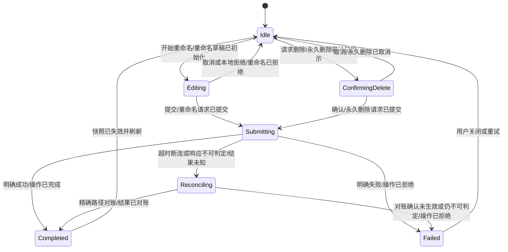

# 需求分析：个人云盘重命名与永久删除

**状态**：已采纳  
**真理源**：本文件定义本轮重命名与删除的产品边界、事件语义和验收标准。

# 人类卷

## A. 用户使用地图

| 角色 | 场景 | 任务 |
|---|---|---|
| 已登录的个人云盘用户 | 在文件 Tab 浏览自己的文件或文件夹 | 从项目操作菜单修改名称 |
| 已登录的个人云盘用户 | 确认某项目不再需要 | 明确确认后永久删除该项目 |

## B. 关键业务时刻

```text
项目操作菜单已打开 → 重命名草稿已初始化 / 删除确认已展示
→ 输入已校验 / 删除已确认 → 请求已提交
→ 操作结果已确认，或结果未知后已对账 → 列表快照已失效并刷新
```

| 时刻（事件） | 谁触发 | 用户看到/得到什么 |
|---|---|---|
| 重命名草稿已初始化 | 用户点“重命名” | 输入框预填完整原名称，可编辑并取消 |
| 重命名已完成 | 用户提交有效新名称 | 当前目录显示新名称，旧名称不再出现 |
| 永久删除已确认 | 用户点危险确认按钮 | 删除请求才允许发出 |
| 永久删除已完成 | 服务端明确成功或对账确认 | 当前目录不再显示该项目 |

## C. 关键业务规则（Do / Don't）

- **Do**：删除必须先展示项目名及“删除后无法恢复”的危险确认。
- **Do**：重命名先去除首尾空白；名称最长 256 个字符，禁止 `\\ / * : ? \" < > |` 和 emoji。
- **Do**：文件夹的源路径保留尾 `/` 语义；操作成功后失效当前分页与相关搜索快照。
- **Do**：超时、断连或响应无法解析导致结果未知时，用精确旧/新路径对账后再给最终结论。
- **Don't**：取消确认、名称未改变或本地校验失败时不得发请求。
- **Don't**：同一 owner、同一项目、同一操作在进行中不得重复提交；账号/空间切换后的迟到结果不得污染当前列表。
- **Don't**：本轮删除不进入回收站；实际 Files Tab 调用 `File.delete` 且 `is_clean_master=1`。

## D. 需求问题清单

| # | 类 | 一句话问题 | 裁决 |
|---|---|---|---|
| P1-1 | 🕳️ | Android 固定源码路径未配置，无法核对 Android 独有表现 | 不阻塞共享 Pure Dart 开发；保留为真实设备验收缺口，不宣称 VERIFIED |
| P1-2 | 🤔 | iOS 搜索页局部更新存在陈旧风险，是否照搬 | 不照搬缺陷；统一使相关搜索快照失效并重新获取 |

<!-- AI工作底稿 ↓ -->

# AI 工作底稿

## 〇、战略层（Why）

- **痛点**：Flutter 文件 Tab 只能浏览、新建和移动，用户无法完成日常文件整理闭环。
- **目标**：重命名和永久删除共享一套跨端业务状态、错误语义和分页失效策略，不复制 iOS/Android 两套流程。
- **用户故事**：作为个人云盘用户，我想安全地重命名或永久删除文件项目，以便直接在文件 Tab 维护云端内容。

## 一、范围

| 包含功能 | 优先级 |
|---|---|
| 单个个人云盘文件/文件夹重命名 | P0 |
| 单个个人云盘文件/文件夹永久删除（含二次确认） | P0 |
| 本地校验、单飞、owner fence、结果未知对账、分页/搜索失效 | P0 |

**明确不做**：批量操作、回收站、恢复、上传、下载、文件选择器、Workspace 云盘、分享与权限管理。

## 二、事件风暴

| 命令（动作） | 聚合 / 不变条件 | 业务事件（过去式） |
|---|---|---|
| 打开项目操作菜单 | 项目属于当前 environment/account/space owner | 项目操作菜单已打开 |
| 开始重命名 | 输入预填完整原名称 | 重命名草稿已初始化 |
| 提交重命名 | 去空白后非空、≤256、字符合法、不同于原名；同操作单飞 | 重命名请求已提交 |
| 收敛重命名结果 | 明确成功，或旧路径不存在且新路径存在 | 重命名已完成 |
| 拒绝重命名 | 本地非法、内容风控明确拒绝或服务端明确失败 | 重命名已拒绝 |
| 对账重命名 | 只在 mutation 结果未知时按精确旧/新路径查询 | 重命名结果已对账 |
| 请求删除 | 必须先展示不可恢复确认 | 永久删除确认已展示 |
| 取消删除 | 未确认前可退出 | 永久删除已取消 |
| 确认删除 | 当前 owner 未改变；同操作单飞 | 永久删除请求已提交 |
| 收敛删除结果 | 明确成功，或精确路径对账确认不存在 | 永久删除已完成 |
| 对账删除 | 只在 mutation 结果未知时查精确路径 | 永久删除结果已对账 |
| 刷新数据 | 成功结果归属当前 owner | 列表与搜索快照已失效 |
| 切换 owner | environment/account/space 任一改变 | 操作 owner 已更换；迟到结果已丢弃 |

### 聚合与状态机



## 三、入口与字段规则

| 入口/场景 | 触发条件 | 目标 UI |
|---|---|---|
| 文件 Tab 列表项操作菜单 | 当前 owner 下存在可操作项目 | 重命名输入对话框或删除确认框 |
| 重命名输入框 | 点“重命名” | 预填原名称，展示校验/提交状态 |
| 删除确认框 | 点“删除” | 展示项目名、不可恢复文案、取消与危险确认 |

| 字段 | 类型 | 必填 | 规则 | 来源 |
|---|---|---|---|---|
| sourcePath | String | 是 | owner 根内规范化绝对路径；目录保留 `/` | 当前列表项 |
| originalName | String | 是 | 显示名称 | 当前列表项 |
| newName | String | 是 | trim 后 1..256；禁用字符与 emoji；不得等于原名 | 用户输入 |
| knowledgeSpaceId | String | 否 | 个人云盘为空；契约保留服务端参数能力 | 当前空间 |
| operationOwner | value object | 是 | environment/account/space/generation 全匹配才可提交结果 | 会话状态 |

## 四、边界情况清单

| 场景 | 期望行为 | 严重度 |
|---|---|---|
| 空列表或项目已消失 | 不显示/禁用操作；刷新后保持空态 | P1 |
| 分页列表中操作 | 成功后失效整条查询而非只改当前页，避免重复/漏项 | P0 |
| 连续双击提交 | 只产生一次 mutation | P0 |
| 未登录/token 失效 | 按既有 token 刷新一次；仍失败则明确报错 | P0 |
| 明确 4xx/业务拒绝 | 保留当前项目和输入，展示可理解错误，可修改后重试 | P0 |
| mutation 超时/断连/响应不可解析 | 标记结果未知并精确路径对账；对账前不重复 mutation | P0 |
| 对账仍不可判定 | 不声称成功，提示稍后刷新/重试并保留一致性保护 | P0 |
| owner 切换 | 取消或隔离旧操作；迟到结果丢弃 | P0 |
| 重命名目标同名冲突 | 以服务端明确拒绝为准，当前列表不变 | P1 |
| 内容风控不可用 | 明确拒绝则阻止；网络降级允许继续并由服务端兜底，对齐 iOS | P1 |

## 五、异常流程矩阵

| 触发条件 | 用户可见反馈 | 系统行为 | 是否可恢复 |
|---|---|---|---|
| 本地名称校验失败 | 就地显示具体校验错误 | 不发请求，保留输入 | 是 |
| 服务端明确拒绝 | 显示服务端可理解错误 | 不改列表，允许修改或重试 | 是 |
| token 首次失效 | 提交状态保持；最终失败才提示 | 按既有认证策略刷新并至多重试一次 | 是 |
| mutation 结果未知 | 显示正在确认结果 | 不重复 mutation，转精确路径对账 | 是 |
| 对账仍不可判定 | 提示稍后刷新/重试 | 不伪造成功，失效查询以便后续恢复 | 是 |
| owner 已切换 | 新 owner 页面不显示旧操作结果 | 丢弃迟到结果，不污染新缓存 | 是 |

## 六、实例化需求（Given-When-Then）

| ID | Given | When | Then | 类型 |
|---|---|---|---|---|
| GWT-001 | 当前个人云盘目录有文件 `report.pdf` | 打开操作菜单并选择重命名 | 输入框预填 `report.pdf`，重命名草稿已初始化 | 主链路 |
| GWT-002 | 新名称 `report-final.pdf` 合法且服务端明确成功 | 用户提交一次 | 只发一次 `File.rename`；新名称出现、旧名称消失，重命名已完成 | 主链路 |
| GWT-003 | 当前项目是目录 `/docs/` | 改名为 `archive` | 请求的源路径保留目录尾 `/`，刷新后显示 `archive` 目录 | 边界 |
| GWT-004 | 输入为首尾空白包裹的 ` final.pdf ` | 用户提交 | 以 `final.pdf` 校验和提交，不携带首尾空白 | 边界 |
| GWT-005 | 输入为空、超长、含禁用字符或 emoji | 用户提交 | 本地展示对应错误，不发网络请求，重命名已拒绝 | 反例 |
| GWT-006 | trim 后名称与原名一致 | 用户提交 | 提示名称未修改，不发网络请求 | 反例 |
| GWT-007 | 重命名 mutation 已在进行 | 用户再次点击确认 | 第二次提交被抑制，仍只有一个请求 | 并发 |
| GWT-008 | 重命名请求超时，但服务端实际上成功 | 系统对账发现旧路径不存在且新路径存在 | 判定成功并刷新，不再重复 rename，结果已对账 | 异常恢复 |
| GWT-009 | 重命名 mutation 明确失败 | 收到业务错误 | 当前项目与输入保留，展示错误，可修改后重试 | 异常 |
| GWT-010 | 用户点某项目的删除 | 确认框展示 | 文案含项目名和“删除后无法恢复”，尚未发请求 | 主链路 |
| GWT-011 | 删除确认框已展示 | 用户点取消或返回 | 不发 `File.delete`，项目仍存在，永久删除已取消 | 反例 |
| GWT-012 | 用户确认永久删除且服务端明确成功 | 请求完成 | 只发一次永久删除请求；项目从刷新后的列表消失 | 主链路 |
| GWT-013 | 删除请求超时但服务端实际成功 | 对账确认精确路径不存在 | 判定删除完成且不重复删除，结果已对账 | 异常恢复 |
| GWT-014 | 删除明确失败或对账确认项目仍存在 | 系统收敛结果 | 项目保留并展示错误，不伪造成功 | 异常 |
| GWT-015 | 操作期间账号或空间被切换 | 旧请求迟到返回成功 | 旧结果不修改新 owner 的列表/搜索状态 | 并发 |
| GWT-016 | 操作对象来自第 2 页且搜索中也可见 | 操作成功 | 当前目录所有分页与相关搜索快照失效并重取，无重复/幽灵项 | 分页 |
| GWT-017 | token 首次返回未授权且刷新成功 | 系统重试 | mutation 仅按既有认证策略重试一次并给出最终结果 | 鉴权 |
| GWT-018 | Compact/Medium/Expanded 任一布局正在提交 | 用户尝试关闭弹层或重复操作 | 提交状态不丢失、不重复发请求；布局变化不更换 owner | 自适应 |

## 七、线框位与验收标准

| 页面/区域 | 状态 | 说明 |
|---|---|---|
| 文件列表项操作菜单 | 默认 | 提供重命名、删除；删除为危险操作样式 |
| 重命名对话框 | 默认/校验失败/提交中/失败 | 预填全名；提交中禁止重复提交和意外退出 |
| 删除确认框 | 默认/提交中/失败 | 明示不可恢复；取消安全，提交中保持操作上下文 |

| AC | 来源场景 | 验收描述 | 测试映射 |
|---|---|---|---|
| AC1 | GWT-001..009 | 重命名覆盖合法、非法、单飞、明确失败与结果未知对账 | unit + widget + integration |
| AC2 | GWT-010..014 | 永久删除只在确认后提交，覆盖取消、成功、失败与对账 | unit + widget + integration |
| AC3 | GWT-015..017 | owner fence、分页/搜索失效、token 单次刷新不变量成立 | unit + integration |
| AC4 | GWT-018 | 三档约束共享同一操作状态，提交期间不丢失/重复 | widget |
| AC5 | 原生视觉与真机 | iPhone/iPad/Android 手机/Pad/折叠屏核心链路有证据 | device；未完成前保持 PARTIAL |

## 八、事实源与决策

- iOS Files Tab 行为：`NMCloudDrivePopupMenuHandler.swift`、`NMCloudDriveUserUploadViewModel.swift`。
- iOS Cloud API：`NMCloudDrive+FileOperation.swift`；重命名调用 `File.rename`，删除调用 `File.delete` + `is_clean_master=1`。
- Flutter 任务：05 中个人云盘重命名与删除任务卡及已验证 MAP/PRE。
- Android：`local.config` 仍为占位路径，固定源码不可访问；实现不臆造 Android 行为，真实多形态证据作为交付缺口。

## 九、分析结论

| 项 | 结论 |
|---|---|
| P0 未决项 | 0 |
| 可否进入排序/架构 | ✅ 可以；删除语义、失败恢复和 owner 边界已锁定 |
| 残余风险 | Android oracle 不可访问、真实账号写操作与五形态证据尚未执行，最终状态不得高于 PARTIAL |

## 续做

```text
/resume plan=Plans/需求分析/2026-08-10-cloud-drive-rename-delete.md 进度=需求已采纳，进入需求排序
```

## 反馈（skill_run）

```yaml
skill_run:
  skill: event-storming-assistant
  workflow_stage: requirement
  plan: Plans/需求分析/2026-08-10-cloud-drive-rename-delete.md
  date: 2026-08-10
  contexts_used:
    - path: Contexts/需求分析/需求分析规范.md
      utility: high
      reason: "用事件、命令和不变条件收敛永久删除、结果未知对账与 owner 切换语义"
  contexts_missing: []
  contexts_stale: []
  outcome_status: pass
  revisit_needed: false
```

```yaml
skill_run:
  skill: spec-by-example-assistant
  workflow_stage: requirement
  plan: Plans/需求分析/2026-08-10-cloud-drive-rename-delete.md
  date: 2026-08-10
  contexts_used:
    - path: Contexts/需求分析/需求分析规范.md
      utility: high
      reason: "把重命名、永久删除、反例、并发、弱网对账和三档布局转成 18 条可测 GWT"
  contexts_missing: []
  contexts_stale: []
  outcome_status: pass
  revisit_needed: false
```
