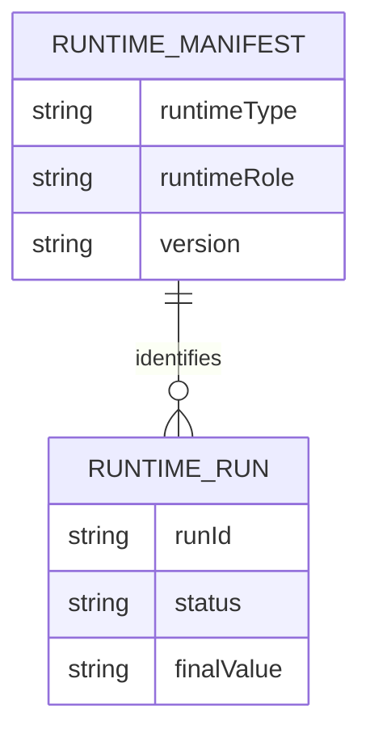
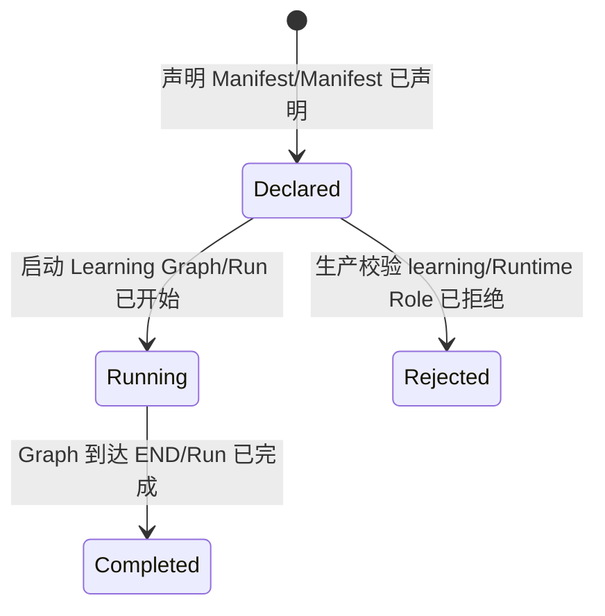
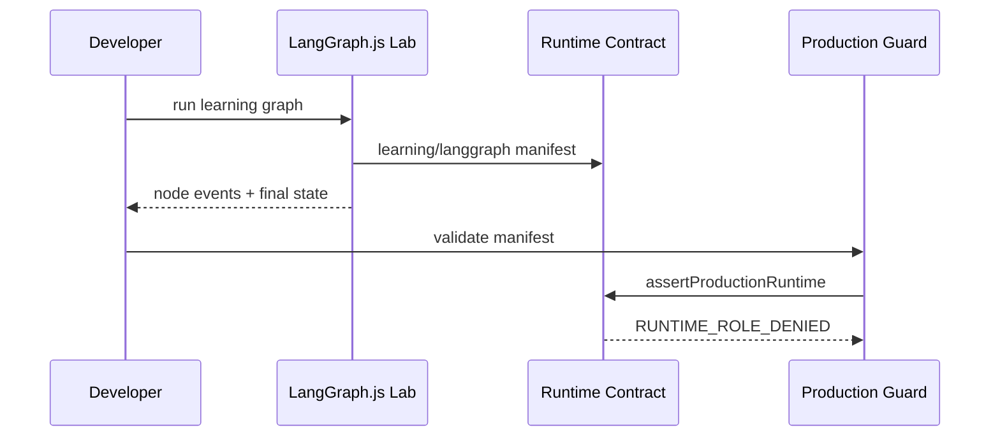
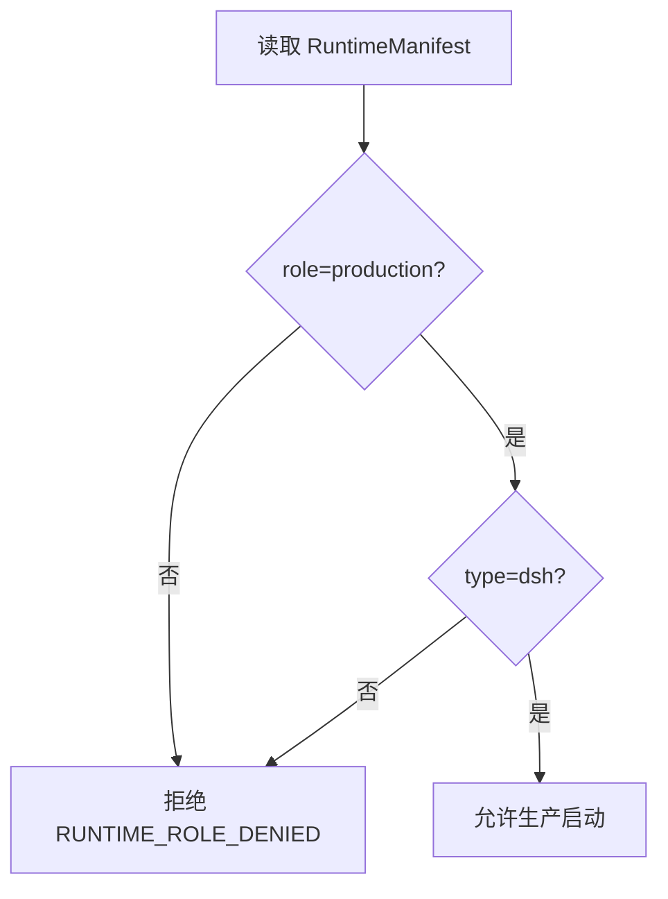

# 需求分析：Agent 双 TypeScript Runtime 基座

# 人类卷

## A. 用户使用地图

| 角色 | 场景 | 任务 |
|---|---|---|
| 系统开发者 | 开始把 Python Agent 一次性改为 TypeScript | 运行真实 LangGraph.js Learning Runtime，并确保它不能成为生产入口 |
| 系统开发者 | 后续学习两种 Runtime | 使用相同定义和离线任务理解 LangGraph.js 与 DSH 的编排差异 |

## B. 关键业务时刻

```text
独立 worktree 已创建
→ TS workspace 已安装
→ Runtime Manifest 已声明
→ LangGraph.js 学习运行已完成
→ 生产角色校验已执行
→ Learning Runtime 已被生产入口拒绝
```

| 事件 | 谁触发 | 得到什么 |
|---|---|---|
| TS Workspace 已就绪 | 开发者 | 可 typecheck/test |
| Learning Run 已完成 | 开发者 | 真实节点事件和终态 |
| Runtime Role 已校验 | 生产守卫 | DSH production 接纳或 Learning 拒绝 |

## C. 关键规则

- **Do**：全仓目标语言是 TypeScript；DSH 是生产默认；LangGraph.js 可独立学习运行。
- **Do**：生产与学习 Runtime 共享稳定 contract/definition，但只做离线任务对照。
- **Don't**：Learning Runtime 不得进入生产 import/deploy graph，不得持生产凭证，不得热切换。
- **Don't**：首个 Story 不删除 Python、不宣称 DSH 接入或全量迁移完成。

## D. 需求问题清单

本 Story 的 P0 已由用户确认：开始开发、全仓 TypeScript、保留 DSH 与 LangGraph.js 两个 Runtime、DSH 生产默认。DSH 正式包接入、Evaluation Case、Safety Executor 和 Ledger 存储属于后续 Story，不阻塞本纵切。

<!-- AI工作底稿 ↓ -->

# AI 工作底稿

## 〇、战略层（Why）

- **痛点**：直接全量覆盖会破坏用户脏工作区；没有角色隔离会让学习 Runtime 漂移成第二生产入口。
- **目标**：先产生一个真实可运行的 LangGraph.js TS 纵切，并用自动化测试证明生产拒绝 Learning Runtime。
- **用户故事**：作为系统开发者，我想运行隔离的 LangGraph.js Learning Runtime，以便安全开始双 Runtime TS 改造。

## 一、范围层（What）

| 包含 | 优先级 |
|---|---|
| pnpm/TypeScript/Vitest workspace | P0 |
| RuntimeManifest 与 production/learning 角色 | P0 |
| 最小真实 LangGraph.js StateGraph/stream/CLI | P0 |
| 生产拒绝 Learning Runtime | P0 |
| 独立 worktree 保护 | P0 |

明确不做：DSH 正式启动、Cordis 插件、生产写、安全执行器、可信 Evaluation Case、Python 删除、60 tests 全量迁写。

## 二、事件风暴

| 命令 | 聚合/不变条件 | 事件 |
|---|---|---|
| 初始化 TS workspace | 不修改原脏工作区 | Workspace 已就绪 |
| 运行 Learning Graph | Manifest 必须为 learning/langgraph | Learning Run 已完成 |
| 校验生产 Runtime | 只接受 production/dsh | Runtime Role 已接纳 / 已拒绝 |









## 三、数据字典

| 字段 | 类型 | 必填 | 范围 | 来源 | 校验 |
|---|---|---|---|---|---|
| runtimeType | enum | 是 | dsh/langgraph | Runtime | production 只允许 dsh |
| runtimeRole | enum | 是 | production/learning | Runtime | learning 必须拒绝生产启动 |
| runtimeVersion | string | 是 | 非空 | lockfile/package | 进入 Manifest |
| runId | string | 是 | 非空 | Learning Runtime | 每次运行唯一 |

## 四、边界与异常

| 场景 | 期望 | 严重度 |
|---|---|---|
| learning Manifest 交给生产守卫 | 明确抛出 `RUNTIME_ROLE_DENIED` | P0 |
| production 但 runtimeType=langgraph | 明确拒绝 | P0 |
| Graph 无终态 | 测试失败，不伪造 completed | P0 |
| 原工作区有未提交修改 | 只在独立 worktree 写入 | P0 |
| DSH 尚未正式接入 | 只验证 Manifest 接纳，不宣称 DSH 可运行 | P0 |

## 五、逻辑/交互/遗漏结论

- 已解决矛盾：保留两个 Runtime 不等于保留两种语言；LangGraph 使用官方 TypeScript 实现。
- 已解决矛盾：两个 Runtime 不等于双生产入口；通过 `runtimeRole` 和依赖图硬隔离。
- 后续遗漏：DSH 正式 Profile/Bundle、真实 Evaluation Case、安全执行器和 60 tests 全量迁写，分别进入后续 Story。

## 六、验收标准

| AC | 锚定事件 | Given | When | Then |
|---|---|---|---|---|
| AC1 | Workspace 已就绪 | 独立 worktree | 安装并运行 typecheck/test | 命令成功且原脏工作区未变化 |
| AC2 | Learning Run 已完成 | LangGraph.js package 已安装 | 执行 StateGraph stream | 至少一个节点事件和确定终态已产生 |
| AC3 | Runtime Role 已拒绝/接纳 | 两种 Manifest | 调用生产守卫 | learning/langgraph 拒绝，production/dsh 接纳 |
| AC4 | Runtime 已隔离 | workspace dependency graph | 扫描生产 imports | 无生产 package 指向 labs |
| AC5 | 用户修改已保护 | 原工作区有三类 dirty 状态 | 完成 Story | dirty 状态内容和路径保持不变 |

## 七、分析结论

| 项 | 结论 |
|---|---|
| 可否开发 | ✅ 本纵切 P0 已闭环 |
| 后续未决是否阻塞 | 否；明确排除在本 Story 外 |
| 关联架构 | `Plans/技术方案/2026-08-17-智能体控制系统工程架构-v0.1.md` |

## 续做

```text
/resume plan=Plans/需求分析/2026-08-17-agent-ts双runtime基座.md 进度=需求已采纳，进入 US-TS-001 Red
```

## 反馈（skill_run）

```yaml
skill_run:
  skill: requirement-analyst
  workflow_stage: requirement
  plan: Plans/需求分析/2026-08-17-agent-ts双runtime基座.md
  date: 2026-08-17
  contexts_used:
    - path: Contexts/需求分析/需求分析规范.md
      utility: high
      reason: "用事件链、四图和锚事件 AC 收敛首个可开发纵切"
    - path: Plans/技术方案/2026-08-17-智能体控制系统工程架构-v0.1.md
      utility: high
      reason: "限定 DSH 生产默认、LangGraph.js Learning Runtime 与一次切换边界"
  contexts_missing: []
  contexts_stale: []
  outcome: "把用户已确认的双 TS Runtime 决策收敛为无 P0 缺口的首个开发 Story"
  utility: high
  reason: "既满足正式开发门禁，也避免把未确认的 DSH 接入、安全和评估范围偷带进首个 Story"
```
