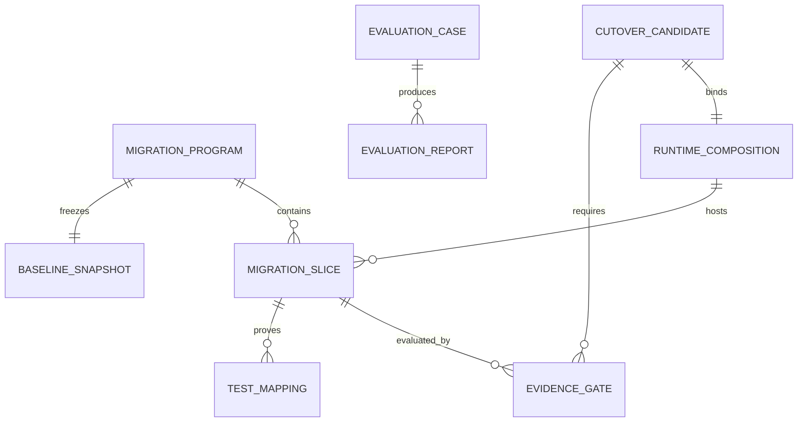
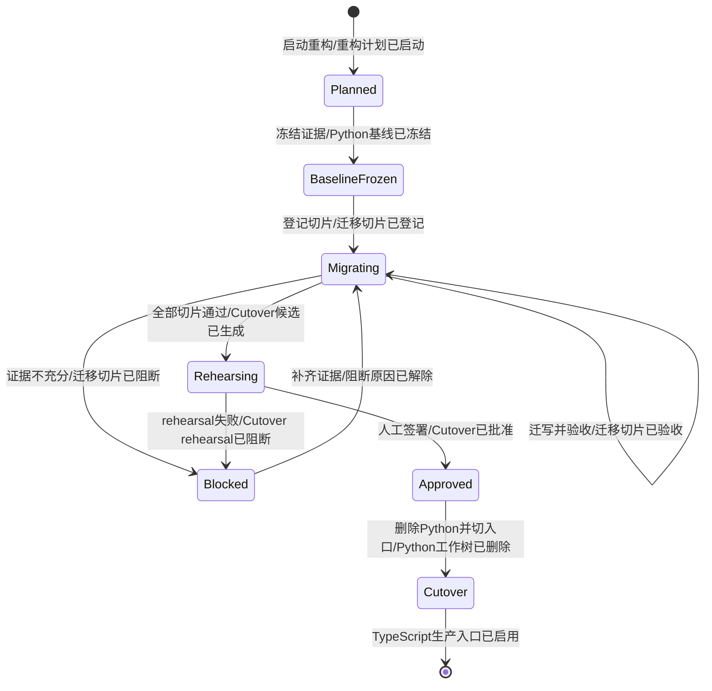
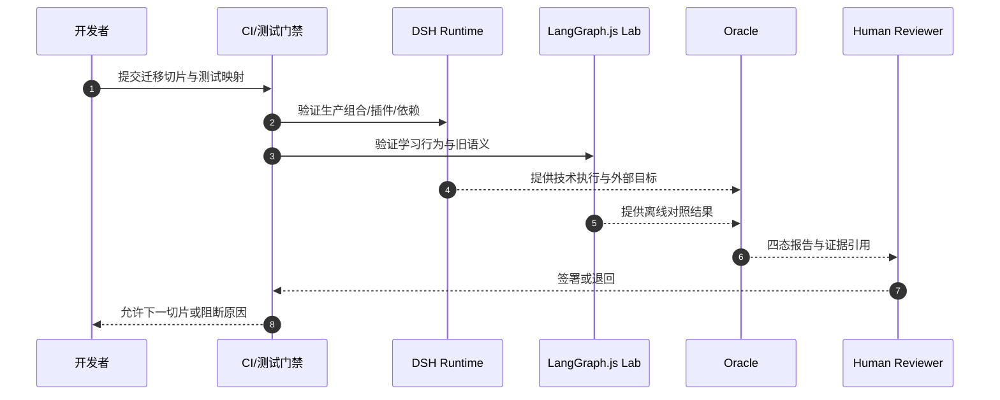
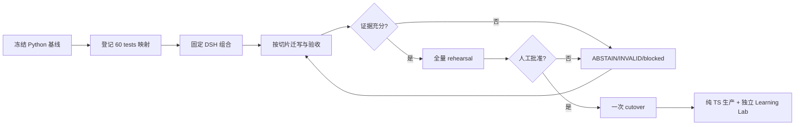

# 需求分析：agent全仓TypeScript重构

**创建日期**：2026-08-17
**存放路径**：`Plans/需求分析/2026-08-17-agent全仓TypeScript重构.md`
**状态**：草稿 | 进行中 | 评审中 | 已采纳 | 搁置 | pending-change
**lifecycle_state**：requirement
**真理源**：本文件为后续架构 / 开发 / 测试 / 部署的**唯一需求基准**；架构变动须先回看本文件。

> 基础分析仍遵循 [[Templates/需求分析模板]]；本模板**强制**补充边界、异常、验收标准。
> 方法论：先填战略层(Why)与范围层(What)对齐目标，再展开细节(How)。见 [[需求分析规范]]。
> **分卷**：人类卷三件套在前（≤3 页），`<!-- AI工作底稿 ↓ -->` 之后是 AI 推理底稿，规范见 [[Templates/模板约定]] §分卷规范。

---

# 人类卷（产品/开发 3 分钟读完即可开工）

## A. 用户使用地图

按「角色 → 场景 → 任务」列一张表，不画时序图。

| 角色 | 场景（什么时候） | 任务（要干什么） |
|------|------------------|------------------|
| 系统开发者 | 开始全仓重构或迁移一个行为切片时 | 从不可变 Python 基线提取语义，使用 TDD 重建 TS 能力 |
| Runtime 维护者 | 装配生产 Runtime 时 | 固定 DSH 版本并通过 Cordis plugin/Profile/Bundle 组合能力 |
| Learning Runtime 学习者 | 学习和对照原 LangGraph 行为时 | 独立运行 LangGraph.js，不获得生产凭证或部署入口 |
| 评估负责人 | 判断一个切片或 cutover 是否可信时 | 检查参考解、负对照、Oracle、证据和人工签署，允许阻断 |
| 安全负责人 | Runtime 申请现实写操作时 | 确认 Safety Executor 权限域、Lease、幂等和效果核验 |
| 发布负责人 | 所有迁移切片完成后 | 执行 rehearsal，只有门禁全绿才一次性删除 Python 并切换 |

## B. 关键业务时刻

把核心**业务事件**（过去式）按时间串成一条人话流程线，标人工介入点。

```text
重构已启动 → 基线已冻结 → 迁移清单已确认 → DSH 组合已固定 → TS 切片已迁写 → 证据已验证 → cutover 已批准/已阻断 → Python 已删除或基线已保留
```

| 时刻（事件） | 谁触发 | 用户看到/得到什么 |
|--------------|--------|-------------------|
| Python 基线已冻结 | 开发者/CI | 基线 SHA、60 tests 清单、行为 transcript 和回滚引用 |
| 迁移切片已验收 | 开发者/测试 | 对应 TS 实现、Red/Green 证据和旧测试语义映射 |
| Runtime 组合已验证 | Runtime 维护者/CI | 固定 DSH commit、Profile/Bundle/Provider 指纹和生命周期结果 |
| Evaluation Case 已资格化或已阻断 | Oracle/人工 reviewer | PASS/FAIL/ABSTAIN/INVALID 与不可变证据；无证据不放行 |
| Cutover 已批准或已阻断 | 发布负责人/人工 reviewer | rehearsal 结果、删除清单和明确的停留状态 |
| Python 工作树已删除 | 发布负责人 | 最终纯 TS 目录；旧实现仅存 baseline tag/worktree |

## C. 关键业务规则（Do / Don't）

只讲「能不能」，不讲实现。

- **Do**：每个旧行为和测试都先登记映射，再写 Red；生产使用 DSH 原生 Agent Loop，学习使用 LangGraph.js 原生 StateGraph。
- **Do**：技术完成、现实效果和人工裁决分账；未知或证据不足必须 ABSTAIN/INVALID/blocked。
- **Do**：内部允许分步骤开发，最终只做一次生产 cutover。
- **Don't**：不 fork/vendoring DSH，不维护生产 LangGraph Adapter，不在门禁前删除 Python。
- **Don't**：不以目录已创建、测试数量相等或 Runtime 自报成功代替行为等价和现实证据。
- **前提 → 后果**：G-EQ、60 tests parity、插件/故障/安全门禁、rehearsal 和人工签署全部通过 → 才允许生成 Python 删除 cutover；任一不通过 → 保持基线并停止切换。

## D. 需求问题清单（产品必读 · 不确认无法开工）

> 把底稿 §六逻辑/§七交互/§八遗漏的问题**浓缩成产品视角一句话**，让没读底稿的产品也能直接拍板。三类标签：**🤔 不理解（语义不清）/ ⚔️ 矛盾（自相打架）/ 🕳️ 遗漏（该有没写）**。P0 不闭环禁止进架构/开发。

| # | 类 | 一句话问题 | 要产品拍板的 |
|---|----|-----------|-------------|
| P1-1 | 🤔 | Control Ledger 首版存储未确定 | 在 append-only、稳定序号、重放和删除证明约束下选择 Provider |

**已闭环决策**：

- P0-1：生产基线固定为 `@deepseek-ai/dsh@0.1.0-rc.6`，所有直接使用的 `@deepseek-ai/dsh-*` 固定同一 rc.6，`@deepseek-ai/cordis@4.0.1`、Node `22.19.0`、pnpm `11.7.0`、TypeScript `6.0.3`；完整规则和可重现证据见 §九·六。
- P0-2：已通过 §九·五的 60/60 语义迁移登记闭环；依据是用户已明确要求现有 LangGraph 和当前代码全部迁为 TypeScript，因此本轮没有 `waive`，每项处置均为 `migrate`。实际 Green 证据仍属于后续 Story 验收，不在需求阶段伪造完成。
- P0-3：用户于 2026-08-17 确认采用 §十·五的 Safety Executor v0.1 边界：独立进程/身份/凭证域，Runtime 只提交 `ActionIntent`，无长期目标写凭证；旁路不可证明时只允许 evaluation/read-only。
- P0-4：指定 reviewer `wanglongxiang` 于 2026-08-17 确认 Case v1 实际证据；签署后重新运行资格检查，结果为 `qualified=true`、`reasons=[]`。签署只覆盖当前 Case/Oracle/fixture 版本。

---

<!-- AI工作底稿 ↓ -->

# AI 工作底稿（供 architecture / test 阶段消费，人类有疑问再翻）

## 〇、战略层（Why）

- **痛点**：当前仓库是 Python 根结构与少量 TS package 并存的过渡态；生产 Runtime 未落 DSH，学习 Runtime 只具备最小图，无法兑现全仓单语言和可控切换。
- **量化目标**：工作树 `.py` 数从当前值降为 0；旧 60 tests 语义映射覆盖率 100%；生产依赖图中 LangGraph.js 引用数 0；所有 cutover P0 门禁 100% 通过，否则切换次数为 0。
- **用户故事**：作为系统维护者，我想要一个 DSH 生产 Runtime 与 LangGraph.js 学习 Runtime 组成的纯 TypeScript monorepo，以便在保留学习价值的同时获得可验证、可回滚、权限隔离的生产控制系统。

---

## 一、PRD 摘要（3–5 句）

本 Epic 不是给当前仓库“换目录皮肤”，而是重建生产 Runtime、学习 Runtime、控制/评估/安全能力和全部测试语义。迁移以旧 Python 基线作为只读证据，按纵向切片 Red→Green；最终 cutover 前 Python 始终可运行。最终状态只允许纯 TypeScript 工作树、DSH 唯一生产 Agent Loop、LangGraph.js 隔离 Learning Runtime。

---

## 一·五、范围层（What）

| 包含功能 | 优先级 |
|----------|--------|
| B0：冻结 baseline SHA、60 tests、资产和真实行为 transcript | P0 |
| B1：完整 pnpm monorepo、固定 DSH/dsh-bridge、LangGraph.js 原生骨架 | P0 |
| B2：Definition/Tools/Capabilities/Runtime 行为和 60 tests 语义迁写 | P0 |
| B3：control-domain、ledger、observer、supervisor、outcome-feedback | P0 |
| B4：Safety Executor、Watchdog、受控工具和 recovery Profile | P0 |
| B5：全量评估、故障注入、rehearsal、一次 cutover 与 Python 删除 | P0 |

**明确不做**：fork DSH、复制 DSH 源码、Python/TS 长期双生产、生产 Runtime 热切换、让 LangGraph.js 持生产凭证、未签署情况下删除 Python、把多 Agent 组织平台纳入本轮。

---

## 一·六、事件风暴 + 业务逻辑图（事件驱动，详见 [[需求分析规范]] §三）

> 先抓事件、再理逻辑、后画图。事件链是脊柱：状态机每条迁移必须挂一个事件。

**⓪ 事件风暴表（真相单元，先填这张）**

| 命令（动作） | 聚合 / 不变条件（业务规则） | 业务事件（过去式） |
|--------------|------------------------------|---------------------|
| 启动全仓重构 | MigrationProgram；必须绑定仓库、分支、目标架构和一次 cutover 规则 | 重构计划已启动 |
| 冻结旧实现证据 | BaselineSnapshot；SHA、60 tests、资产清单和行为输出必须可重放 | Python 基线已冻结 |
| 登记迁移切片 | MigrationSlice；每个旧行为/测试必须有 TS 目标、AC 和 Red | 迁移切片已登记 |
| 固定 DSH 组合 | RuntimeComposition；commit、Profile、Bundle、Patch、Provider 顺序必须可指纹化 | DSH 组合已固定 |
| 迁写一个行为切片 | MigrationSlice；必须使用目标 Runtime 原生机制且不破坏生产/学习隔离 | TS 行为切片已迁写 |
| 执行切片验收 | EvidenceGate；Red/Green/refactor/smoke 和旧语义映射缺一不可 | 迁移切片已验收 / 迁移切片已阻断 |
| 运行可信评估 | EvaluationCase；参考 PASS、负对照 FAIL、unknown/invalid 可区分 | Evaluation Case 已资格化 / 已失效 |
| 装卸 Cordis 插件 | PluginComposition；dispose 必须撤销全部 Service/Event/Effect | 插件效果已注册 / 已撤销 |
| 请求现实写操作 | SafetyBoundary；Runtime 无长期凭证，Intent 必须经 Lease/幂等/效果核验 | ActionIntent 已拒绝 / 已授权 / 效果已核验 / 效果未知 |
| 发起 cutover rehearsal | CutoverCandidate；全量测试、故障注入、依赖隔离和回滚必须通过 | Cutover rehearsal 已通过 / 已阻断 |
| 批准最终切换 | CutoverCandidate；必须有人工签署且 P0=0 | Cutover 已批准 / 已拒绝 |
| 执行 Python 删除与入口切换 | RepositoryState；只能在已批准 cutover 中执行且 baseline 引用存在 | Python 工作树已删除 / TypeScript 生产入口已启用 |

> 闭环自检：每个事件是否都有命令触发？每个命令是否都有结果事件？悬空项即遗漏。

**① 实体关系（ER 图）**



**② 状态机（核心聚合根生命周期 · 迁移必挂事件）**



**角色—系统交互**



**事件风暴热点**

| 热点 | 级别 | 影响 | 当前处理 |
|---|---|---|---|
| DSH rc.6 已固定、尚未进入仓库实现 | 已关闭需求 P0 | 最小 out-of-tree 插件已成功安装、typecheck，CLI 版本可复现 | B1 按 §九·六写入 lockfile 和 composition fingerprint；不得浮动升级 |
| 60 tests 语义映射已登记、尚未实现 | 已关闭需求 P0 | 60/60 已有 TS 目标和保留语义；尚无 Green 证据 | 后续 Story 按矩阵逐项 Red/Green，不得只比较数量 |
| Safety Executor v0.1 边界已确认、尚未实现 | 已关闭需求 P0 | 独立进程、身份、凭证、网络/IAM 与旁路证明边界已固定 | 后续 Story 用安全反例和 `AuthorityAttestation` 验证，不因需求确认开放现实写 |
| Case v1 已人工签署并资格化 | 已关闭需求 P0 | 参考解 PASS、两类负对照 FAIL、坏环境 INVALID，资格检查 `qualified=true` | Case/Oracle/fixture 版本变化必须重新签署 |
| Control Ledger 存储未定 | P1 | B3 具体 Provider 无法落点 | 先冻结 append-only/序号/重放契约，Provider 后决策 |
| master 已含过渡 TS 代码 | P1 | 新分支可能误把最小实现当完整迁移 | 所有现有 TS 模块重新登记为 baseline/待扩展切片 |

**③ 主流程（泳道/时序）** ＋ **④ 用户路径决策图**：见 §八 用户旅程，或在此补 `sequenceDiagram` / `graph TD`。

---

## 二、范围与入口矩阵

| 入口/场景 | 需求描述 | 触发条件 | 交互载体 |
|-----------|----------|----------|----------|
| 基线冻结 | 固定 Python SHA、60 tests 清单、运行日志、资产指纹和回滚引用 | B0 启动且工作区修改已保护 | CI 日志 + Baseline Manifest |
| 迁移映射 | 为每个旧测试登记 TS 目标、保留语义、Red 和处置状态 | 基线冻结完成 | Migration Matrix |
| DSH 组合验证 | 固定上游来源、commit/版本和 Profile/Bundle/Patch/Provider 指纹 | P0-1 已确认 | Runtime Composition Report |
| 切片验收 | 对一个纵向切片运行 Red→Green→Refactor、语义映射和真实证据检查 | 切片已登记 | Story/CI Evidence View |
| Evaluation Case | 运行参考解、负对照、未知证据和坏环境资格检查 | Case 配置与 Oracle 可用 | Evaluation Report |
| 生产写申请 | DSH Runtime 仅提交 ActionIntent，由独立安全域授权和核验 | controlled Profile 运行且 P0-3 已确认 | Safety Receipt View |
| 学习运行 | 独立启动 LangGraph.js、恢复 checkpoint、运行迁写测试 | 本地显式 Learning CLI | Learning CLI + offline transcript |
| Cutover rehearsal | 汇总全量测试、故障注入、依赖隔离、回滚和人工签署 | B0—B5 候选证据齐全 | Cutover Gate Dashboard |

---

## 三、数据字典 / 字段规则

| 字段 | 类型 | 必填 | 约束 | 来源 | 校验/激活 |
|------|------|------|------|------|-----------|
| `baselineSha` | git SHA | 是 | 必须解析为冻结提交且可从 baseline tag/worktree 访问 | Git | B0 冻结时校验 |
| `testMappingId` | string | 是 | 稳定唯一；一个 Python 测试至少对应一个处置记录 | Migration Matrix | 重复或缺失即阻断 |
| `disposition` | enum | 是 | `migrate\|replace\|waive`；`waive` 必须附人工理由和证据 | 人工评审 | B2 验收前激活 |
| `runtimeRole` | enum | 是 | `production\|learning`；生产入口只接受 `production` | Runtime Manifest | launcher 校验 |
| `runtimeType` | enum | 是 | 生产固定 `dsh`；学习固定 `langgraph` | Runtime Manifest | 组合验证时校验 |
| `compositionFingerprint` | hash | 是 | 覆盖 DSH commit、Profile、Bundle、Patch、Provider 顺序 | 构建系统 | 启动和 rehearsal 比对 |
| `dshVersion` | exact semver | 是 | 固定 `0.1.0-rc.6`；禁止 `latest`、`next`、`^`、`~` | npm lockfile | B1 安装、CI 与启动校验 |
| `dshLockHash` | SHA-256 | 是 | 覆盖完整 `pnpm-lock.yaml`，升级后必须变化并重新资格化 | 构建系统 | composition fingerprint 输入 |
| `verdict` | enum | 是 | `PASS\|FAIL\|ABSTAIN\|INVALID`；未知不得映射成功 | Oracle/人工 | 报告生成时校验 |
| `evidenceRefs` | array | 是 | PASS/FAIL 至少一个不可变引用；ABSTAIN/INVALID 记录原因 | Evaluation Case | 资格与人工评审 |
| `commandId` | UUID/string | 是 | 全链唯一且幂等 | control-supervisor | 接纳时校验 |
| `actionId` | UUID/string | 是 | 与幂等键、作用域、风险级别绑定 | DSH plugin | Safety Executor 校验 |
| `effectStatus` | enum | 是 | `verified\|failed\|unknown\|not-applicable` | Safety/现实核验 | 禁止由 technical success 推导 |
| `humanDecision` | enum | 条件必填 | `approved\|rejected`；不得由 AI 代填 | 指定 reviewer | cutover 前校验 |

---

## 四、边界情况清单（必填）

| # | 边界场景 | 期望行为 | PRD 是否写明 | 严重度 |
|---|----------|----------|--------------|--------|
| B1 | 无 Python 测试被发现 | 基线冻结 INVALID；不得把 0/0 当 100% parity | 是 | P0 |
| B2 | 测试映射数量超过 60 | 允许一个旧测试映射多个 TS 测试，但必须保持旧 ID 唯一覆盖统计 | 是 | P1 |
| B3 | 同一 ActionIntent 重复提交 | Safety Executor 按幂等键返回同一现实效果，不重复执行 | 是 | P0 |
| B4 | Learning Runtime 误用生产入口 | launcher 以 `RUNTIME_ROLE_DENIED` 拒绝且不加载凭证 | 是 | P0 |
| B5 | DSH 请求成功但现实目标错误 | 外部 Oracle 输出 FAIL，不受 turn/step success 覆盖 | 是 | P0 |
| B6 | Oracle 读不到证据 | 输出 ABSTAIN 或 INVALID 并阻断，不猜测 PASS | 是 | P0 |
| B7 | DSH 上游提交或 Patch 漂移 | `COMPOSITION_MISMATCH`，停止启动或 rehearsal | 是 | P0 |
| B8 | 插件初始化中途失败 | 撤销已注册 Effect，Context 无残留服务/监听器 | 是 | P0 |
| B9 | Safety Executor 超时且外部效果未知 | 标记 `EFFECT_UNKNOWN`，进入 reconcile/人工处理，禁止盲重试 | 是 | P0 |
| B10 | cutover 过程中进程中断 | baseline tag 保持可用；Python 删除不得被标记完成 | 是 | P0 |

---

## 五、异常流程矩阵（必填）

| 触发条件 | 用户可见反馈 | 系统行为 | 是否可恢复 | PRD 是否写明 |
|----------|--------------|----------|------------|--------------|
| Baseline Manifest 缺 SHA/测试日志 | `BASELINE_INCOMPLETE` 和缺项列表 | 不生成“基线已冻结”事件 | 是，补证据 | 是 |
| DSH 固定依赖不可构建 | `UPSTREAM_INCOMPATIBLE` 和构建证据 | 不创建生产组合指纹 | 是，换经确认的版本 | 是 |
| Contract/Schema 校验失败 | `CONTRACT_INVALID` 和字段路径 | 拒绝事件/命令，不部分写入 | 是，修复输入 | 是 |
| Evaluation 证据不足 | ABSTAIN 与缺失证据 | 保留报告，阻断切片/cutover | 是，补证据或人工裁决 | 是 |
| Case/环境本身失效 | INVALID 与失效原因 | Case 降级为不可用，不评价被测 Runtime | 是，修复并发布新 Case 版本 | 是 |
| Safety 策略拒绝 | `POLICY_DENIED` 与规则引用 | 不发 Lease、不执行现实写 | 需改请求或人工审批 | 是 |
| Safety/外部系统 5xx 或超时 | `EFFECT_UNKNOWN` 或明确失败 | 停止自动重试，进入 reconcile | 是，核验/补偿 | 是 |
| Cordis 插件 dispose 失败 | lifecycle gate 红色和残留项 | 隔离 Runtime，禁止进入生产组合 | 是，修复生命周期 | 是 |
| Watchdog 失联/水位停滞 | degraded/isolated 状态 | Runtime 降级只读或停止受控写 | 是，恢复后重新资格化 | 是 |
| 人工 reviewer 拒绝 | rejected 和理由 | 保持 blocked，不删除 Python | 是，整改后重新提交 | 是 |

---

## 五·五、集成与人机协同边界

**外部交互点 + 异步/补偿**（事件链上的跨系统边界）

| 集成点 / 异步任务 | 类型 | 触发事件 | 失败/补偿策略 |
|-------------------|------|----------|---------------|
| DSH 上游依赖 | 构建时固定依赖 | DSH 组合已固定 | commit 不可构建则阻断；禁止静默升级 |
| 模型 Provider | 流式 API | Agent request 已发起 | 记录技术失败；不推导现实结果 |
| Safety Executor | 同步提交 + 异步效果核验 | ActionIntent 已提交 | 幂等重试仅限提交；效果未知转 reconcile |
| 现实 Oracle | 只读 API/文件/人工采样 | 技术执行已结束 | 无法观测时 ABSTAIN/INVALID，不补造结果 |
| Git/CI | 构建与证据归档 | 迁移切片已提交 | SHA/日志不可追溯则切片阻断 |
| Human Review | 人工异步门禁 | 资格报告/cutover 候选已生成 | 未签署保持 blocked；AI 不代签 |

**人机协同边界**（每个关键动作标注自动化程度）

| 动作 / 事件 | 全自动 | AI建议+人工确认 | 纯人工 |
|-------------|:------:|:---------------:|:------:|
| 生成基线清单和测试日志 | ☑ | ☐ | ☐ |
| 确认测试语义迁移/豁免 | ☐ | ☑ | ☐ |
| 运行参考解、负对照和坏环境 | ☑ | ☐ | ☐ |
| 解释 ABSTAIN/INVALID 并建议补证据 | ☐ | ☑ | ☐ |
| 签署 Case v1 实际证据 | ☐ | ☐ | ☑ |
| 批准生产写权限边界 | ☐ | ☐ | ☑ |
| 批准最终 cutover | ☐ | ☐ | ☑ |

---

## 六、逻辑问题

| # | 类型 | 问题 | PRD 摘录 | 严重度 |
|---|------|------|----------|--------|
| L1 | 依赖漂移 | DSH 已固定 rc.6；后续不得因 npm dist-tag 或 master 变化静默升级 | “固定 DSH 版本” | 已关闭需求 P0，转 B1/B5 自动门禁 |
| L2 | 证明缺口 | 测试数量相等不代表语义等价，必须逐项映射 | “60 tests 语义映射覆盖率 100%” | 已关闭需求 P0，转逐 Story Red/Green 门禁 |
| L3 | 权限缺口 | Runtime 内插件不能同时充当不可绕过的 Safety Executor | “Runtime 无长期生产写凭证” | 已关闭需求 P0，v0.1 边界已确认 |
| L4 | 人工责任 | 自动资格结果不能替代实际证据签署 | “AI 不代签” | 已关闭需求 P0，Case v1 已人工签署并资格化 |
| L5 | 存储选择 | Ledger Provider 未定，但 append-only/稳定序号/重放契约可先确认 | “Provider 后决策” | P1 |
| L6 | 状态一致性 | Epic 曾写 `p0_open: 0`，与需求真理源的 4 个 P0 冲突 | “P0 不闭环禁止进入开发” | P0（已同步修正） |

---

## 七、交互冲突

| # | 场景 A | 场景 B | 问题 | 建议问产品 |
|---|--------|--------|------|------------|
| I1 | 用户要求“一次性改成 TS” | 可信评估必须允许阻断 | 一次性应指发布切换，不是跳过内部 TDD/门禁 | 维持当前定义 |
| I2 | 保留两个 Runtime 学习 | DSH 必须是唯一生产 Runtime | 若共享 launcher/凭证会形成隐性双生产 | 用 runtimeRole、依赖扫描和独立入口硬隔离 |
| I3 | Cordis 万物皆插件 | Safety/Watchdog 不得被 Agent 卸载 | 安全边界不能只是普通同权限插件 | 保持独立进程/凭证域，插件仅提交 Intent |
| I4 | 自动化推动进度 | Case/cutover 要人工签署 | 自动补签会制造虚假评估 | UI 明示“等待人工”，不提供自动通过动作 |
| I5 | 删除 Python 达成目标 | baseline 必须可审计回滚 | 删除工作树不等于删除历史证据 | 仅删除工作树，保留 baseline tag/worktree 引用 |

---

## 八、整体需求遗漏

### 用户旅程闭环



| 环节 | PRD 是否写明 | 若未写，缺什么 |
|------|--------------|----------------|
| 启动/退出 | 是 | 由分支、Epic、baseline SHA 进入；blocked/cutover 为明确退出态 |
| 创建/修改/删除 | 是 | 切片登记与迁写是修改；Python 删除仅在批准 cutover 中发生 |
| 进度刷新 | 是 | 由 CI Evidence、Migration Matrix 和 Gate 状态投影，不靠人工口头宣称 |
| 失败恢复 | 是 | 保留 baseline；补证据后重新资格化，不覆盖原始报告 |
| 审计回看 | 是 | SHA、composition fingerprint、evidence refs 和人工决定可追溯 |

### 线框/交互草图位

| 页面/区域 | 状态 | 草图位 | 必须展示 |
|-----------|------|--------|----------|
| Migration Matrix | 默认/筛选/缺失 | `[旧测试] → [TS目标] → [处置] → [Red/Green证据]` | 60 个旧测试覆盖率、缺失 ID、豁免理由 |
| Runtime Composition | 正常/漂移/构建失败 | `[DSH commit] [Profile] [Bundle] [Patch] [Provider] → fingerprint` | 固定来源、最终配置树、漂移差异 |
| Evaluation Report | PASS/FAIL/ABSTAIN/INVALID | `[技术状态] ≠ [Oracle结论] → [证据] → [人工裁决]` | 四态、证据引用、配置指纹、reviewer 状态 |
| Safety Receipt | denied/authorized/unknown/verified | `Intent → Lease → Execute → Effect` | 每段时间、水位、规则、幂等键与 effect status |
| Cutover Gate Dashboard | blocked/ready/approved | `[G-EQ] [60 parity] [lifecycle] [fault] [safety] [rehearsal] [human]` | 任一红灯原因、禁止删除提示、baseline 回滚引用 |
| Learning CLI | running/resumed/isolated | `learning manifest → StateGraph → checkpoint → offline transcript` | `runtimeRole=learning`、无生产凭证、独立测试结果 |

---

## 九、验收标准（必填，可测）

用 **Given-When-Then** 写关键场景，每条可测、无歧义，**Then 锚定一个业务事件已发生**，并补**反例**。

| ID | Given | When | Then（可观察结果与锚定事件） | 类型 | 测试映射 |
|----|-------|------|--------------------------------|------|----------|
| GWT-001 | clean baseline commit 可解析，Python 测试和资产可读取 | 执行 B0 冻结 | 输出 SHA、测试清单、日志、资产指纹和回滚引用，且“Python 基线已冻结” | 主链路 | acceptance/baseline-manifest |
| GWT-002 | 未发现 Python 测试或测试运行日志缺失 | 尝试冻结基线 | 返回 `BASELINE_INCOMPLETE`，不发生“Python 基线已冻结” | 反例 | qualification/baseline-invalid |
| GWT-003 | 60 个旧测试已登记稳定 ID | 生成 Migration Matrix | 每个 ID 都有 TS 目标、保留语义、处置和 Red 位置，且“迁移清单已确认” | 主链路 | acceptance/test-mapping |
| GWT-004 | 至少一个旧测试无映射或 waiver 无人工证据 | 申请切片/最终验收 | 门禁 blocked，不发生“迁移切片已验收”或“Cutover 已批准” | 反例 | acceptance/mapping-gap |
| GWT-005 | DSH 来源、commit/版本及配置层顺序已确认且可构建 | 固定生产组合 | 生成可复现 fingerprint 和最终配置树，且“DSH 组合已固定” | 主链路 | integration/dsh-composition |
| GWT-006 | 已固定组合中的 commit、Patch 或 Provider 顺序发生漂移 | 启动生产 Runtime 或 rehearsal | 返回 `COMPOSITION_MISMATCH`，且“Cutover rehearsal 已阻断” | 异常 | fault-injection/composition-drift |
| GWT-007 | Cordis 插件成功注册 Service/Event/Effect | 卸载插件 | 所有效应和监听器均被撤销，且“插件效果已撤销” | 主链路 | plugin-lifecycle/dispose |
| GWT-008 | 插件初始化一半后抛错 | Runtime 回滚安装 | Context 无该插件残留，组合不可进入 Ready，且“插件安装已阻断” | 异常 | plugin-lifecycle/partial-failure |
| GWT-009 | DSH turn/step 返回 success，但目标文件内容与 Case 期望不同 | 外部 Oracle 评估 | verdict=FAIL，并发生“Evaluation Report 已生成”；技术成功不得覆盖 FAIL | 反例 | qualification/technical-success-fails |
| GWT-010 | Oracle 无法访问目标证据，但 Case 本身仍有效 | 运行评估 | verdict=ABSTAIN、列出缺证，且“迁移切片已阻断” | 边界 | qualification/evidence-abstain |
| GWT-011 | Case 配置、参考资产或环境本身无效 | 运行资格检查 | verdict=INVALID，不评价 Runtime，且“Evaluation Case 已失效” | 异常 | qualification/case-invalid |
| GWT-012 | 参考解 PASS、负对照 FAIL、未知和坏环境可区分，但 reviewer 未签署 | 申请 G-EQ 放行 | 状态保持 `HUMAN_REVIEW_INCOMPLETE`，不发生“Evaluation Case 已资格化” | 反例 | qualification/human-required |
| GWT-013 | LangGraph.js manifest 为 `runtimeRole=learning` | 从 Learning CLI 启动并恢复 checkpoint | StateGraph 可独立运行/恢复，生成离线 transcript，且“学习运行已完成” | 主链路 | labs/runtime-resume |
| GWT-014 | Learning Runtime 被交给生产 launcher，或生产依赖图 import Lab | 执行启动/依赖扫描 | 返回 `RUNTIME_ROLE_DENIED` 或隔离测试失败，不发生“TypeScript 生产入口已启用” | 反例 | integration/learning-isolation |
| GWT-015 | DSH Runtime 无长期写凭证并提交合法 ActionIntent | Safety Executor 完成策略、Lease、幂等和效果核验 | 形成分段 ActionReceipt，且“效果已核验” | 主链路 | integration/safety-happy-path |
| GWT-016 | Runtime 试图绕过 Safety Executor、修改策略或直接使用生产凭证 | 执行写操作 | `POLICY_DENIED`，现实写未发生，且“ActionIntent 已拒绝” | 安全反例 | fault-injection/safety-bypass |
| GWT-017 | 同一幂等键的 ActionIntent 被重复提交 | Safety Executor 接收重复请求 | 返回同一执行引用，现实动作仅一次，且“重复 Intent 已去重” | 边界 | integration/action-idempotency |
| GWT-018 | 外部调用超时且无法确定是否生效 | Safety Executor 结算 | `effectStatus=unknown`，停止盲重试并产生 reconcile 任务，且“效果未知已记录” | 异常 | fault-injection/effect-unknown |
| GWT-019 | control command 有唯一 commandId 和预期接纳点 | supervisor 执行 pause/restrict/stop | 依次记录 intercepted/delegated/admitted/applied/effect_verified，且“控制命令效果已核验” | 主链路 | integration/control-receipt |
| GWT-020 | Watchdog 检测 Runtime 心跳失联或控制水位停滞 | 触发降级策略 | Runtime 进入只读/隔离，受控写停止，且“Runtime 已降级” | 故障 | fault-injection/watchdog |
| GWT-021 | G-EQ、60-test parity、插件生命周期、故障、安全、rehearsal 全绿且指定 reviewer 批准 | 执行最终 cutover | 删除 Python 工作树、切换 DSH 入口、保留 baseline 引用，且“TypeScript 生产入口已启用” | 主链路 | acceptance/cutover |
| GWT-022 | 任一门禁红灯、证据不足或 reviewer 未批准 | 请求最终 cutover | 状态保持 blocked，Python 工作树和生产入口不变，且“Cutover 已拒绝/已阻断” | 反例 | acceptance/cutover-blocked |

### 2026-08-20 本地仓库 Cutover 裁决

- 用户明确确认当前尚无任何生产部署，当前目标是直接完成本地仓库切换；因此 production OS/IAM/network/certificate deployment evidence 对本次 cutover 为不适用，而非缺失。
- 不得用伪造的 production evidence 通过门禁；改由版本化 `local-cutover-decision` 记录 `scope=local_repository`、candidate、composition、workspace owner 明确批准及本文件引用。
- GWT-021 的其余条件不变：固定自动门禁全绿、精确 44-path/before-hash 清单、baseline annotated tag 可达、expected target tree 可计算、一次删除与入口切换、切换后全量验证。
- 若未来发生真实部署，必须重新建立 production deployment boundary evidence；本次本地裁决不得外推为生产发布批准。

**非功能验收**：

- 可重放：同一版本的 Session/Control 前缀产生同一投影和证据引用；
- 可逆：任一插件 dispose 后不残留 Service/Event/Effect；
- 安全：生产 Runtime 依赖图中不存在 LangGraph.js Lab 或长期写凭证；
- 可追溯：所有 PASS/FAIL、控制效果和 cutover 决策可定位到 SHA、fingerprint、evidence refs 和 reviewer；
- 失败关闭：unknown、timeout、失联和配置漂移不会自动转成功。

### 九·五、Python 60 tests → TypeScript 语义迁移矩阵

> 2026-08-17 在 `/Users/wanglongxiang/git/agent` 的 `codex/full-ts-restructure` 分支执行 `pytest --collect-only -q`，得到 **60 tests collected**。本表只确认迁移语义与目标 Red 位置，不宣称 TS 已实现或已通过。全部处置为 `migrate`，没有按数量凑齐或无证据豁免。

| ID | Python source node ID | 必须保留的可观察语义 | TypeScript Red 目标 | 处置 |
|----|-----------------------|----------------------|---------------------|------|
| M001 | `test_act.py::ActionSessionTests::test_generates_runtime_action_ids_for_model_tool_calls` | 模型工具调用获得稳定 runtime action ID | `labs/runtimes/langgraph-ts/test/act.spec.ts` + `packages/contracts/test/action.spec.ts` | migrate |
| M002 | `test_act.py::ActionSessionTests::test_human_confirmation_of_no_execution_closes_the_action_as_failed` | 人工确认未执行后动作结算为 failed | `labs/runtimes/langgraph-ts/test/act.spec.ts` | migrate |
| M003 | `test_act.py::ActionSessionTests::test_human_resolution_continues_without_replaying_the_call` | 人工补录成功结果后继续且不重放工具 | `labs/runtimes/langgraph-ts/test/act.spec.ts` | migrate |
| M004 | `test_act.py::ActionSessionTests::test_keeps_unknown_action_pending_when_human_result_is_invalid` | 非法人工结果不能关闭 unknown action | `labs/runtimes/langgraph-ts/test/act.spec.ts` | migrate |
| M005 | `test_act.py::ActionSessionTests::test_preserves_the_pending_call_when_execution_is_unknown` | 执行结果未知时保留 pending call 与 action ID | `labs/runtimes/langgraph-ts/test/act.spec.ts` + `services/safety-executor/test/effect-unknown.spec.ts` | migrate |
| M006 | `test_act.py::ActionSessionTests::test_records_safe_calls_before_later_approval_is_requested` | 同轮先记录安全调用，再为高风险调用暂停 | `labs/runtimes/langgraph-ts/test/act.spec.ts` | migrate |
| M007 | `test_act.py::ActionSessionTests::test_rejection_discards_later_calls_from_the_same_model_turn` | 拒绝高风险调用后丢弃同轮后续调用 | `labs/runtimes/langgraph-ts/test/act.spec.ts` | migrate |
| M008 | `test_act.py::ActionSessionTests::test_step_session_includes_executor_definition_and_input_safety_rules` | step prompt 包含角色定义和输入安全规则 | `labs/runtimes/langgraph-ts/test/act.spec.ts` + `packages/agent-definition/test/prompt.spec.ts` | migrate |
| M009 | `test_act.py::ActionSessionTests::test_treats_instructions_in_tool_output_as_untrusted_data` | 工具输出中的指令按不可信数据处理 | `labs/runtimes/langgraph-ts/test/act.spec.ts` + `plugins/domain-tools/test/untrusted-output.spec.ts` | migrate |
| M010 | `test_act.py::ActionSessionTests::test_virtual_input_call_does_not_receive_an_action_id` | 虚拟用户输入不被当作现实 action | `labs/runtimes/langgraph-ts/test/act.spec.ts` | migrate |
| M011 | `test_act.py::ActionSessionTests::test_waits_for_missing_input_and_discards_stale_tool_calls` | 缺输入时暂停并丢弃基于猜测的陈旧调用 | `labs/runtimes/langgraph-ts/test/act.spec.ts` | migrate |
| M012 | `test_agent_definition.py::AgentDefinitionTests::test_default_definition_exposes_policy_version_in_prompt_context` | 默认定义向 prompt 暴露 policy version | `packages/agent-definition/test/definition.spec.ts` | migrate |
| M013 | `test_agent_definition.py::AgentDefinitionTests::test_external_tools_follow_the_definition_allowlist_but_input_is_always_available` | 外部工具服从 allowlist，虚拟输入始终可用 | `packages/agent-definition/test/tool-allowlist.spec.ts` | migrate |
| M014 | `test_agent_definition.py::AgentDefinitionTests::test_loads_default_definition` | 可加载默认 general assistant 定义与 prompt | `packages/agent-definition/test/definition.spec.ts` | migrate |
| M015 | `test_agent_definition.py::AgentDefinitionTests::test_rejects_non_semantic_policy_version` | 拒绝非语义化 policy version | `packages/agent-definition/test/definition.spec.ts` | migrate |
| M016 | `test_agent_definition.py::AgentDefinitionTests::test_rejects_unknown_tools` | 定义引用未知工具时失败关闭 | `packages/agent-definition/test/tool-allowlist.spec.ts` | migrate |
| M017 | `test_llm.py::ChatJsonTests::test_preserves_markdown_fence_inside_json_string` | JSON 字符串内部 fenced code 不被破坏 | `labs/runtimes/langgraph-ts/test/llm-json.spec.ts` | migrate |
| M018 | `test_llm.py::ChatJsonTests::test_repairs_one_malformed_json_response` | 只允许一次结构化输出修复 | `labs/runtimes/langgraph-ts/test/llm-json.spec.ts` | migrate |
| M019 | `test_llm.py::ChatJsonTests::test_reports_failure_after_one_repair_attempt` | 一次修复仍失败后返回明确失败 | `labs/runtimes/langgraph-ts/test/llm-json.spec.ts` | migrate |
| M020 | `test_llm.py::ChatJsonTests::test_unwraps_outer_markdown_json_fence` | 仅解包 JSON 外层 markdown fence | `labs/runtimes/langgraph-ts/test/llm-json.spec.ts` | migrate |
| M021 | `test_planning.py::PlanningTests::test_plan_receives_execution_capabilities_not_just_planner_policy` | planning 同时受执行能力边界约束 | `labs/runtimes/langgraph-ts/test/planning.spec.ts` | migrate |
| M022 | `test_planning.py::PlanningTests::test_rejects_non_string_steps_before_they_enter_graph_state` | 非字符串步骤不得进入 graph state | `labs/runtimes/langgraph-ts/test/planning.spec.ts` | migrate |
| M023 | `test_planning.py::PlanningTests::test_risk_adjustment_keeps_the_same_capability_boundary` | 风险调整不扩大原能力边界 | `labs/runtimes/langgraph-ts/test/planning.spec.ts` | migrate |
| M024 | `test_role_definitions.py::RoleDefinitionTests::test_default_roles_load_distinct_definitions` | 默认角色加载各自独立定义 | `labs/runtimes/langgraph-ts/test/roles.spec.ts` + `packages/agent-definition/test/roles.spec.ts` | migrate |
| M025 | `test_role_definitions.py::RoleDefinitionTests::test_roles_pass_their_definition_to_shared_capabilities` | role 调用共享能力时传入自身 definition | `labs/runtimes/langgraph-ts/test/roles.spec.ts` | migrate |
| M026 | `test_runtime.py::LangGraphRuntimeTests::test_captures_planning_failure_as_a_structured_result` | planning 异常转为结构化 RunResult | `labs/runtimes/langgraph-ts/test/runtime.spec.ts` | migrate |
| M027 | `test_runtime.py::LangGraphRuntimeTests::test_pauses_for_user_input_and_resumes_the_same_session` | 用户输入 interrupt 在同一 thread/session 恢复 | `labs/runtimes/langgraph-ts/test/runtime.spec.ts` | migrate |
| M028 | `test_runtime.py::LangGraphRuntimeTests::test_pauses_unknown_action_and_continues_from_a_human_result` | unknown action 暂停后接受人工结果继续 | `labs/runtimes/langgraph-ts/test/runtime.spec.ts` | migrate |
| M029 | `test_runtime.py::LangGraphRuntimeTests::test_persists_normal_completion_trace` | 正常完成 trace 可持久化和读取 | `labs/runtimes/langgraph-ts/test/runtime.spec.ts` | migrate |
| M030 | `test_runtime.py::LangGraphRuntimeTests::test_records_replan_trace_and_framework_checkpoints` | replan trace 与框架 checkpoint 均被记录 | `labs/runtimes/langgraph-ts/test/runtime.spec.ts` | migrate |
| M031 | `test_runtime.py::LangGraphRuntimeTests::test_recovery_fork_rejects_state_that_could_bypass_approval` | recovery fork 不能修改状态绕过审批 | `labs/runtimes/langgraph-ts/test/recovery.spec.ts` | migrate |
| M032 | `test_runtime.py::LangGraphRuntimeTests::test_reenters_the_same_human_interrupt_node_without_replaying_an_action` | 恢复进入同一 interrupt 节点且不重放 action | `labs/runtimes/langgraph-ts/test/runtime.spec.ts` | migrate |
| M033 | `test_runtime.py::LangGraphRuntimeTests::test_replays_and_forks_from_a_selected_checkpoint` | 可从选定 checkpoint replay/fork | `labs/runtimes/langgraph-ts/test/recovery.spec.ts` | migrate |
| M034 | `test_runtime.py::LangGraphRuntimeTests::test_resumes_from_sqlite_after_creating_a_fresh_runtime` | 新 Runtime 实例能从 SQLite checkpoint 恢复 | `labs/runtimes/langgraph-ts/test/persistence.spec.ts` | migrate |
| M035 | `test_runtime.py::LangGraphRuntimeTests::test_resumes_the_exact_tool_proposal_without_restarting_the_session` | 恢复精确工具 proposal，不重启 session | `labs/runtimes/langgraph-ts/test/runtime.spec.ts` | migrate |
| M036 | `test_runtime.py::LangGraphRuntimeTests::test_stops_when_a_tool_response_violates_its_output_contract` | 工具成功响应违反 schema 时停止 | `labs/runtimes/langgraph-ts/test/runtime.spec.ts` | migrate |
| M037 | `test_runtime.py::LangGraphRuntimeTests::test_trace_failure_is_a_warning_not_a_business_failure` | trace 持久化失败只产生 warning | `labs/runtimes/langgraph-ts/test/runtime.spec.ts` | migrate |
| M038 | `test_team_graph_runtime.py::TeamGraphRuntimeTests::test_pauses_team_execution_when_an_action_is_unknown` | Team learning graph 遇 unknown action 暂停 | `labs/runtimes/langgraph-ts/test/team-runtime.spec.ts` | migrate |
| M039 | `test_team_graph_runtime.py::TeamGraphRuntimeTests::test_resumes_the_exact_team_tool_proposal_without_restarting_the_session` | Team graph 恢复精确 proposal 且不重启 | `labs/runtimes/langgraph-ts/test/team-runtime.spec.ts` | migrate |
| M040 | `test_team_graph_runtime.py::TeamGraphRuntimeTests::test_routes_risk_and_review_rejection_through_graph_edges` | 风险和 review rejection 通过显式 graph edge 路由 | `labs/runtimes/langgraph-ts/test/team-runtime.spec.ts` | migrate |
| M041 | `test_team_graph_runtime.py::TeamGraphRuntimeTests::test_routes_safe_plan_to_execution_and_persists_handoffs` | 安全计划路由到执行并持久化角色 handoff | `labs/runtimes/langgraph-ts/test/team-runtime.spec.ts` | migrate |
| M042 | `test_team_graph_runtime.py::TeamGraphRuntimeTests::test_stops_after_the_configured_retry_limit` | 达到 retry limit 后停止 replan | `labs/runtimes/langgraph-ts/test/team-runtime.spec.ts` | migrate |
| M043 | `test_team_graph_runtime.py::TeamGraphRuntimeTests::test_trace_failure_is_only_a_warning_for_team_execution` | Team trace 失败不改写业务结果 | `labs/runtimes/langgraph-ts/test/team-runtime.spec.ts` | migrate |
| M044 | `test_tool_results.py::ToolResultTests::test_act_rejects_a_success_result_that_violates_output_schema` | success 结果违反 output schema 时拒绝 | `labs/runtimes/langgraph-ts/test/tools.spec.ts` + `plugins/domain-tools/test/output-contract.spec.ts` | migrate |
| M045 | `test_tool_results.py::ToolResultTests::test_all_local_tools_return_schema_valid_structured_content` | 本地工具成功结果符合 MCP structuredContent schema | `labs/runtimes/langgraph-ts/test/tools.spec.ts` | migrate |
| M046 | `test_tool_results.py::ToolResultTests::test_explicit_tool_errors_keep_the_mcp_error_shape` | 显式工具错误保持 MCP error 形状 | `labs/runtimes/langgraph-ts/test/tools.spec.ts` | migrate |
| M047 | `test_tool_results.py::ToolResultTests::test_shell_timeout_reports_an_unavailable_tool_response` | shell timeout 表达为结果不可用而非成功 | `labs/runtimes/langgraph-ts/test/tools.spec.ts` | migrate |
| M048 | `test_tui.py::TuiFormattingTests::test_formats_paused_approval_with_operator_commands` | 暂停审批显示工具、原因和 approve/reject 命令 | `labs/runtimes/langgraph-ts/test/cli.spec.ts` | migrate |
| M049 | `test_tui.py::TuiFormattingTests::test_formats_successful_run_with_events_and_warnings` | 完成视图包含 run/thread、事件、warning 和结果 | `labs/runtimes/langgraph-ts/test/cli.spec.ts` | migrate |
| M050 | `test_tui.py::TuiResumeDecisionTests::test_approval_interrupt_accepts_short_commands` | 审批 interrupt 支持短命令与显式拒绝 | `labs/runtimes/langgraph-ts/test/cli.spec.ts` | migrate |
| M051 | `test_tui.py::TuiResumeDecisionTests::test_input_interrupt_uses_text_value` | 输入 interrupt 保留原始文本值 | `labs/runtimes/langgraph-ts/test/cli.spec.ts` | migrate |
| M052 | `test_tui.py::TuiResumeDecisionTests::test_unknown_interrupt_requires_json_resolution` | unknown interrupt 强制结构化 JSON resolution | `labs/runtimes/langgraph-ts/test/cli.spec.ts` | migrate |
| M053 | `test_tui.py::TuiControllerTests::test_arg_parser_exposes_team_mode` | Learning CLI 显式暴露 team learning mode | `labs/runtimes/langgraph-ts/test/cli.spec.ts` | migrate |
| M054 | `test_tui.py::TuiControllerTests::test_fullscreen_accepts_wide_character_input` | 宽字符输入不被截断 | `labs/runtimes/langgraph-ts/test/cli.spec.ts` | migrate |
| M055 | `test_tui.py::TuiControllerTests::test_fullscreen_captures_runtime_prints_inside_log` | Runtime 输出被 UI 日志捕获 | `labs/runtimes/langgraph-ts/test/cli.spec.ts` | migrate |
| M056 | `test_tui.py::TuiControllerTests::test_fullscreen_mode_uses_curses_wrapper` | 原 curses fullscreen 语义以 TS TUI adapter 测试替代 | `labs/runtimes/langgraph-ts/test/cli.spec.ts` | migrate |
| M057 | `test_tui.py::TuiControllerTests::test_line_tui_keeps_chinese_input_as_unicode_text` | 行式 CLI 保持中文 Unicode | `labs/runtimes/langgraph-ts/test/cli.spec.ts` | migrate |
| M058 | `test_tui.py::TuiControllerTests::test_submission_error_is_rendered_inside_tui` | 提交错误在 CLI 内可见且可操作 | `labs/runtimes/langgraph-ts/test/cli.spec.ts` | migrate |
| M059 | `test_tui.py::TuiControllerTests::test_tracks_paused_result_and_resumes_same_thread` | CLI 跟踪暂停结果并恢复同一 thread | `labs/runtimes/langgraph-ts/test/cli.spec.ts` | migrate |
| M060 | `test_tui.py::TuiControllerTests::test_tui_starts_without_prechecking_api_key` | CLI 启动不提前索取或强校验 API key | `labs/runtimes/langgraph-ts/test/cli.spec.ts` | migrate |

覆盖核对：`M001—M060` 连续、源 node ID 唯一、`migrate=60`、`replace=0`、`waive=0`。其中 DSH 生产路径应优先复用上游原生工具/LLM/Session 能力；表中 Learning Lab 目标用于保留旧行为，不代表在生产路径重新实现第二套 Agent Loop。

### 九·六、DSH 固定基线与可重现验证

**依赖裁决**：

| 项 | 固定值 | 规则 |
|----|--------|------|
| DSH launcher | `@deepseek-ai/dsh@0.1.0-rc.6` | 根依赖精确版本，不使用 dist-tag/range |
| DSH seam packages | 直接 import 的 `@deepseek-ai/dsh-*` 全部 `0.1.0-rc.6` | peer/dev 版本一致；经 `dsh-bridge` 收口 |
| Cordis | `@deepseek-ai/cordis@4.0.1` | peer/dev 版本一致 |
| Node | `22.19.0` 作为 CI/开发基线 | 满足官方 `^22.19.0 || >=24.0.0`；未来 Node 升级独立验证 |
| pnpm | `11.7.0` | 根 `packageManager` 精确固定 |
| TypeScript | `6.0.3` | DSH-facing Host/Client 聚合按官方 compiler face 对齐；不沿用当前 TS 7 过渡配置 |
| 构建脚本白名单 | 复制并最小化官方 `allowBuilds` | install script 默认拒绝；新增项必须审计 |
| 升级策略 | ADR + 新 lock hash + dsh-bridge compatibility + lifecycle/qualification/rehearsal | 禁止自动浮动升级生产组合 |

**2026-08-17 可重现证据**：

1. 官方仓库明确标注 developer preview 和 breaking changes，且 GitHub 没有 release，因此本轮选择 npm 精确 rc 包而不是追踪 `master`。
2. `npm view @deepseek-ai/dsh version dist-tags` 返回 `0.1.0-rc.6`；包完整性为 `sha512-brpZfED7ieRa2PQ5tUxMhHrM1pb2CmKFVM/f6yMULBDMicahk+Z2OsHgTwTDnoiZm23Ftu9rQz0NN4pflaoJcg==`。
3. 临时 clean 工程使用 Node `v25.3.0`、pnpm `11.7.0`、TypeScript `6.0.3`，安装精确 `dsh rc.6`、`dsh-tools rc.6`、Cordis `4.0.1`。
4. 按官方 hook 示例注册 `tools/pre-execute` waterfall，`tsc --noEmit` 通过，`dsh --version` 输出 `0.1.0-rc.6`。
5. 验证 lockfile SHA-256：`fb5534a5d9bf4396450d2248a940c152676febacac9c11cefb27bb3598f809d9`。此 SHA 只是资格验证样本；B1 必须提交 `/agent` 自己的 lockfile 和新 hash。

官方依据：[DeepSeek Harness README](https://github.com/deepseek-ai/deepseek-harness)、[architecture](https://github.com/deepseek-ai/deepseek-harness/blob/master/docs/architecture.md)、[development guide](https://github.com/deepseek-ai/deepseek-harness/blob/master/docs/development.md)、[npm package](https://www.npmjs.com/package/@deepseek-ai/dsh/v/0.1.0-rc.6)。

---

## 十、待产品确认

| 优先级 | 问题 | 建议决策 | 责任人/证据 |
|--------|------|----------|-------------|
| P1-1 | Control Ledger 首版 Provider | 先确认 append-only、稳定序号、幂等、重放和删除证明，再选 SQLite/Postgres 等 Provider | 架构负责人 |

已关闭：P0-1、P0-2、P0-3、P0-4。DSH rc.6 已通过最小插件 typecheck；60/60 均登记为迁移；Safety Executor v0.1 边界已由用户确认；Case v1 已由指定 reviewer 签署且资格检查通过。后续实现仍必须提交仓库 lockfile、组合指纹、安全反例和逐行 Red/Green 证据，才能把“需求已固定”升级为“实现已完成”。

### 十·五、已确认 P0 证据包

#### P0-3 · Safety Executor 权限与部署边界

**推荐裁决（v0.1）**：

> **确认结果（2026-08-17）**：用户已确认以下 7 条作为 Safety Executor v0.1 的需求边界。该确认不等于实现或生产写门禁已经通过。

1. `services/safety-executor` 是独立 TypeScript 进程和独立 OS/容器身份，不作为可由 DSH Profile 卸载的普通插件运行；
2. DSH Runtime 只持提交 `ActionIntent` 的客户端身份，不持任何受保护目标系统的长期写凭证；目标写凭证只注入 Safety Executor；
3. 单机开发通过 Unix Domain Socket + 文件权限隔离；生产跨主机通过 mTLS HTTPS，双方复用同一版本化 `action-intent.v1/action-receipt.v1` Schema；
4. Safety 配置、凭证、部署清单和急停通道由 Runtime 身份只读或不可见，Runtime 不得修改、卸载或重启 Executor/Watchdog；
5. 目标系统网络/IAM 只允许 Executor 身份写入；DSH Runtime 到目标写端点默认拒绝，以凭证扫描、网络策略和旁路测试共同形成 `AuthorityAttestation`；
6. Executor 只签发短时、最小作用域、绑定 `actionId/idempotencyKey/policyVersion/compositionFingerprint` 的 Lease；timeout 或回执不确定进入 `EFFECT_UNKNOWN`，禁止盲重试；
7. Watchdog 使用独立身份观察 Runtime、Executor、凭证与旁路状态；证明不完整时系统只能运行 `evaluation/read-only` Profile。

备选处理：

- 若当前没有独立身份/IAM/网络隔离条件：需求边界保持已确认，但实现/生产门禁必须保持 blocked；本轮只交付只读与 fixture，不开放现实写；
- 不采纳“同进程普通 Cordis 插件持生产凭证”方案，因为 Agent/Runtime 可能修改配置、卸载插件或获得旁路权，无法满足母模型的安全不变式。

#### P0-4 · Case v1 实际证据签署

2026-08-17 在 `codex/full-ts-restructure` 重新执行 `pnpm evaluate:legacy-case`：

| 检查 | 结果 | 实际证据 |
|------|------|----------|
| reference | PASS | actual=expected=`d9ebadbb29b8176d1b86a349cf55efc0c577bf971c1a9c49506525f7e71476ec`；只变更 `definitions/general-assistant.json` |
| invalid version negative | FAIL | actual=`ccd6596e3ff7de3d166aef464ab02be4a3e5ce331c89083589a4428732f556e1`，与 expected 不同 |
| forbidden side-effect negative | FAIL | 目标 hash 正确，但额外变更 `prompts/general-assistant.md`，Oracle 成功识别禁止副作用 |
| missing target / bad environment | INVALID | `oracle-error://legacy-agent-definition-v1/INVALID_ARTIFACT_IDENTITY` |
| qualification | qualified | reviewer=`wanglongxiang`，`signed=true`，`qualified=true`，`reasons=[]` |

指定 reviewer 已明确确认“以上实际证据足以证明 Case v1 能区分正确、已知错误和坏环境”。`case.json` 已记录签署时间、理由和不可变证据引用，重新运行资格检查通过。确认不是对未来所有 Case 的永久背书；Case/Oracle/fixture 任何版本变化都必须重新签署。

---

## 十一、分析结论

| 项 | 结论 |
|----|------|
| 实例化需求是否完成 | ✅ 已形成 22 组 GWT，覆盖主链路、边界、异常、安全与反例 |
| 可否进入需求正式评审 | ✅ 可以，由 `requirement-analyst` 检查矛盾、遗漏和 P0 决策材料 |
| 可否采纳需求并进入排序 | ✅ 可以；`status=已采纳`、`p0_open=0` |
| 可否进入代码开发 | ❌ 暂不可以；不得用现有 TS 过渡模块冒充 B1/B2 完成 |
| 关联架构 plan | `Plans/技术方案/2026-08-17-智能体控制系统工程架构-v0.1.md`（草稿，待需求与排序门禁） |

---

## 续做

```
/resume plan=Plans/Epic/2026-08-17-agent全仓TypeScript重构.md 进度=需求已采纳且P0=0；进入需求排序
```

**下一阶段 Skill**：`backlog-prioritization-assistant`。

## 反馈（skill_run）

```yaml
skill_run:
  skill: event-storming-assistant
  workflow_stage: requirement
  plan: Plans/需求分析/2026-08-17-agent全仓TypeScript重构.md
  date: 2026-08-17
  contexts_used:
    - path: Plans/Epic/2026-08-17-agent全仓TypeScript重构.md
      utility: high
      reason: "提供完整重构范围、阶段门禁和新分支边界"
    - path: Plans/技术方案/2026-08-17-智能体控制系统工程架构-v0.1.md
      utility: high
      reason: "提供 DSH 生产、LangGraph.js 学习、Safety/Watchdog 和一次 cutover 约束"
    - path: /Users/wanglongxiang/git/agent
      utility: high
      reason: "确认当前仍为 Python 根结构与最小 TS package 并存的迁移态"
  contexts_missing:
    - "DSH 固定发布包或 commit"
    - "Safety Executor 传输与凭证域"
    - "Case v1 实际证据人工签署"
  contexts_stale: []
  outcome: "形成从基线冻结到一次 cutover 的事件链、聚合、状态机、角色交互和 P0 热点"
  utility: high
  reason: "把完整结构重构约束为事件与停止条件，防止再次用新增目录冒充迁移完成"
```

```yaml
skill_run:
  skill: spec-by-example-assistant
  workflow_stage: requirement
  plan: Plans/需求分析/2026-08-17-agent全仓TypeScript重构.md
  date: 2026-08-17
  contexts_used:
    - path: Plans/需求分析/2026-08-17-agent全仓TypeScript重构.md
      utility: high
      reason: "复用事件墙、P0 热点、状态机和已确认的生产/学习边界生成可测试场景"
    - path: Plans/技术方案/2026-08-17-智能体控制系统工程架构-v0.1.md
      utility: high
      reason: "提供 DSH/Cordis、Safety Executor、Watchdog、四态评估和一次 cutover 的可观察契约"
    - path: Plans/代码重构/2026-08-17-agent控制系统工程落点-v0.1.md
      utility: high
      reason: "用于把 GWT 映射到 qualification、plugin-lifecycle、integration、fault-injection、acceptance 和 labs 测试层"
  contexts_missing:
    - "DSH 固定发布包或 commit 及可构建证据"
    - "60 个 Python tests 的逐项语义映射矩阵"
    - "Safety Executor 传输、凭证与旁路部署决策"
    - "Case v1 实际证据人工签署"
  contexts_stale: []
  outcome: "形成 22 组可测试 Given-When-Then、反例、边界异常矩阵、线框位和测试映射，并保持 4 个 P0 为阻断态"
  utility: high
  reason: "让后续排序、Story 拆分和测试计划有明确可执行输入，同时阻止用技术自报成功或目录变化替代可信证据"
```

```yaml
skill_run:
  skill: requirement-analyst
  workflow_stage: requirement
  plan: Plans/需求分析/2026-08-17-agent全仓TypeScript重构.md
  date: 2026-08-17
  contexts_used:
    - path: Contexts/需求分析/需求分析规范.md
      utility: high
      reason: "用于检查事件链闭环、四图、逻辑矛盾、交互冲突、遗漏和人类卷可读性"
    - path: Plans/需求分析/2026-08-17-agent全仓TypeScript重构.md
      utility: high
      reason: "正式评审事件风暴与 22 组实例化需求，并校正 P0 状态"
    - path: /Users/wanglongxiang/git/agent/tests
      utility: high
      reason: "以 pytest 实际采集的 60 个 node ID 建立逐项 TypeScript 语义迁移矩阵"
    - path: Plans/技术方案/2026-08-17-智能体控制系统工程架构-v0.1.md
      utility: high
      reason: "把官方 DSH rc.6、Cordis seam 和 Host/Client 基线验证结果对照到既定目标架构"
    - path: /Users/wanglongxiang/git/agent/evaluation/cases/legacy-agent-definition-v1
      utility: high
      reason: "重新运行 Case v1 实际参考解、负对照和坏环境证据，生成可供 reviewer 签署的哈希摘要"
  contexts_missing:
    - "Safety Executor 传输、凭证与旁路部署决策"
    - "Case v1 实际证据人工签署"
  contexts_stale: []
  outcome: "完成需求正式评审，形成 60/60 测试语义映射，并以最小 out-of-tree 插件验证固定 DSH rc.6，将开放 P0 从 4 降为 2"
  utility: high
  reason: "在不改代码、不伪造 Green 证据的前提下，把全量 Python 行为迁移范围变成可拆 Story、可追踪验收的明确契约"
```

```yaml
skill_run:
  skill: resume-assistant
  workflow_stage: requirement
  plan: Plans/需求分析/2026-08-17-agent全仓TypeScript重构.md
  date: 2026-08-17
  contexts_used:
    - path: Plans/Epic/2026-08-17-agent全仓TypeScript重构.md
      utility: high
      reason: "回放 client-dev 当前阶段、P0 数量和 requirement 退出条件"
    - path: Plans/需求分析/2026-08-17-agent全仓TypeScript重构.md
      utility: high
      reason: "确认 DSH 与 60/60 测试映射已闭环，剩余两项均要求人工承担确认责任"
    - path: /Users/wanglongxiang/git/agent/evaluation/cases/legacy-agent-definition-v1
      utility: high
      reason: "确认 Case review 仍为 signed=false，不能把笼统的继续指令改写为证据签署"
  contexts_missing:
    - "Safety Executor v0.1 权限与部署边界的明确人工确认"
    - "Case v1 实际证据的明确 reviewer 签署"
  contexts_stale: []
  outcome: "恢复 requirement 工作流并复核机械门禁；保持 p0_open=2、status=评审中，未生成 Backlog、未修改 agent 代码"
  utility: high
  reason: "防止把‘继续’误当安全决策和评估签名，遵守用户要求的可信评估停止条件"
```

```yaml
skill_run:
  skill: requirement-analyst
  workflow_stage: requirement
  plan: Plans/需求分析/2026-08-17-agent全仓TypeScript重构.md
  date: 2026-08-17
  contexts_used:
    - path: Plans/Epic/2026-08-17-agent全仓TypeScript重构.md
      utility: high
      reason: "同步 client-dev requirement 退出条件与开放 P0 数量"
    - path: Plans/技术方案/2026-08-17-智能体控制系统工程架构-v0.1.md
      utility: high
      reason: "确认 Safety Executor v0.1 的独立权限域边界与母模型安全不变式一致"
    - path: /Users/wanglongxiang/git/agent/evaluation/cases/legacy-agent-definition-v1
      utility: high
      reason: "把 reviewer 签署接入运行器并重新验证正例、负例、坏环境与资格结果"
  contexts_missing:
    - "Control Ledger 首版 Provider（P1，不阻塞需求排序）"
  contexts_stale: []
  outcome: "用户确认 Safety Executor v0.1 边界与 Case v1 实际证据；Case 资格检查 qualified=true，需求状态改为已采纳且 p0_open=0"
  utility: high
  reason: "两项人工裁决均有明确责任人和可重放证据，使需求可以进入排序但仍不把未实现能力标成已完成"
```
