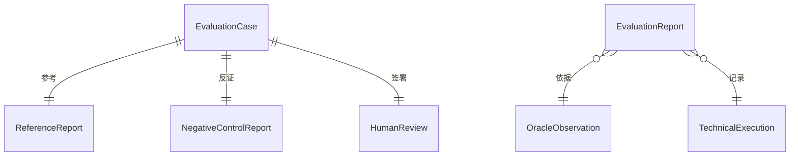
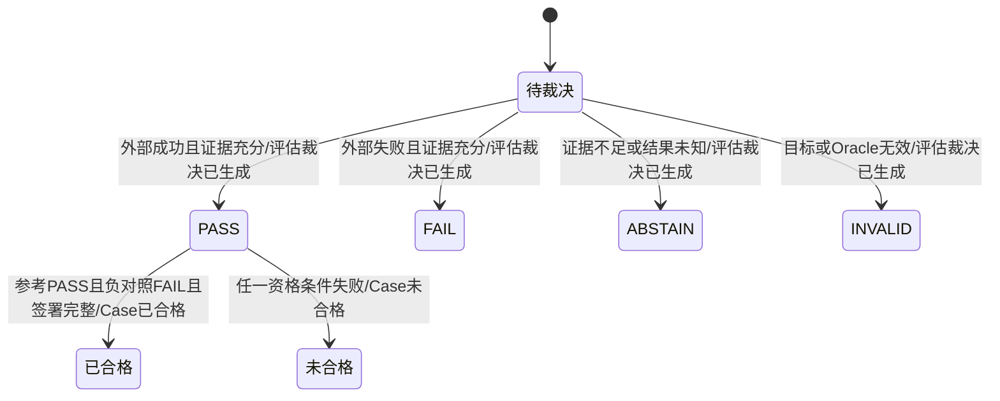
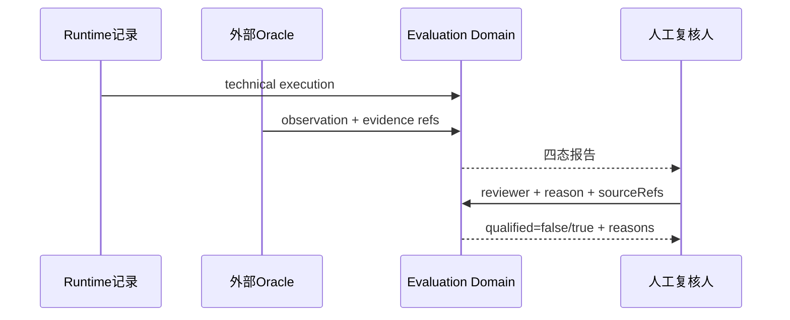
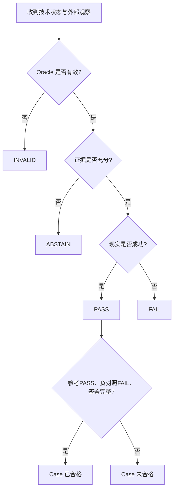

# Agent 可信评估资格门禁需求分析

## 人类卷

### A. 用户使用地图

评估负责人需要先判断“这道题和它的裁判是否可信”，再讨论某个 Runtime 是否通过。输入不是模型自述，而是技术执行状态、外部 Oracle 观察、证据引用、参考解、负对照和人工签署。输出只有四种现实裁决：`PASS`、`FAIL`、`ABSTAIN`、`INVALID`，以及 Case 是否具备评估资格。

本轮价值不是提高通过率，而是阻止虚假通过：缺外部证据、参考解失败、负对照未失败或人工签署不完整时，系统必须明确拒绝用于切换判断。

### B. 关键业务时刻

1. 技术执行已记录；
2. 外部观察已提交；
3. 证据充分性已检查；
4. 四态裁决已生成；
5. 参考解和负对照已复核；
6. 人工签署已检查；
7. Case 已被判定为“合格”或“未合格”。

### C. 业务规则 Do / Don't

- Do：只有外部成功观察且存在可追溯证据时才允许 `PASS`。
- Do：技术执行完成但外部现实失败时必须 `FAIL`。
- Do：证据不足返回 `ABSTAIN`，目标或 Oracle 无效返回 `INVALID`。
- Do：参考解稳定 `PASS`、负对照稳定 `FAIL` 且人工签署完整，Case 才合格。
- Don't：不能从 `technicalStatus=completed` 推导现实成功。
- Don't：不能把缺证据、坏题或坏环境强制改成 `PASS`。
- Don't：本轮不声明真实 Evaluation Case 已合格，也不接入 DSH 生产插件。

### D. 需求问题清单

| 级别 | 类型 | 当前处理 |
|---|---|---|
| 已确认 | 首个真实 Case、Oracle 类型和 reviewer | `general-assistant.json` 版本升级；FileStateOracle；reviewer=`wanglongxiang`，最终签署须在运行后另行确认 |
| P1 | 🕳️遗漏：DSH 固定 commit、Profile 和沙箱身份尚未确认 | 本轮禁止实现或伪造 DSH 集成 |
| P1 | 🤔不理解：首个 Oracle 应为文件状态还是测试结果 | 由后续人工确认；本轮只消费抽象 OracleObservation |

<!-- AI工作底稿 ↓ -->

## 一、战略、范围与事件链

战略目标：把“评估可信”变成可执行的不变条件，使不可靠评估可以诚实地产生 `ABSTAIN/INVALID/未合格`。范围包含纯 TypeScript 四态裁决、资格检查，以及已确认真实遗留任务的 FileStateOracle、参考解和负对照；不包含 DSH/Cordis、报告持久化和真实切换结论。

| 命令 | 聚合/不变条件 | 事件 |
|---|---|---|
| 提交技术执行与外部观察 | PASS 必须有外部 success 和 evidence refs | 评估裁决已生成 |
| 检查参考解 | 参考解必须 PASS | 参考解已复核 |
| 检查负对照 | 已知错误必须 FAIL | 负对照已复核 |
| 提交人工签署 | reviewer/reason/sourceRefs 不得为空 | 人工签署已记录 |
| 判定 Case 资格 | 三项检查全部通过 | Case 已合格 / Case 未合格 |
| 观察遗留定义升级工作区 | 目标身份固定、只允许目标文件变化、内容匹配参考解 | FileStateObservation 已生成 |

事件链闭环：每个命令均产生可观察事件；未合格是合法终态，不存在为了推进而隐式跳过的命令。

## 二、四图









## 三、数据字典

| 字段 | 类型 | 规则 |
|---|---|---|
| technicalStatus | completed/failed/interrupted | 只描述执行，不决定 PASS |
| oracleOutcome | success/failure/unknown/invalid | 决定现实裁决候选 |
| evidenceRefs | string[] | PASS/FAIL 必须非空且可追溯 |
| verdict | PASS/FAIL/ABSTAIN/INVALID | 四态，禁止布尔化 |
| reviewer | string | Case 合格时必填 |
| reason | string | 人工签署必填 |
| sourceRefs | string[] | 人工签署必填 |
| qualification.reasons | string[] | 未合格原因不得丢失 |

## 四、边界与异常矩阵

| 场景 | 结果 |
|---|---|
| technical completed + external failure + evidence | FAIL |
| external success 但无 evidence | ABSTAIN |
| Oracle/目标无效 | INVALID |
| 参考解不是 PASS | Case 未合格 |
| 负对照不是 FAIL | Case 未合格 |
| reviewer/reason/sourceRefs 任一缺失 | Case 未合格 |
| 所有资格条件满足 | Case 合格，但不自动触发生产切换 |

## 五、验收标准

- AC1：Given 外部 success 且至少一个 evidence ref，When 裁决，Then `PASS` 已生成。
- AC2：Given 技术 completed 但外部 failure 且证据充分，When 裁决，Then `FAIL` 已生成。
- AC3：Given 结果未知/缺证据或目标无效，When 裁决，Then 分别生成 `ABSTAIN` 或 `INVALID`。
- AC4：Given 参考解 PASS、负对照 FAIL 和完整人工签署，When 资格检查，Then Case 已合格；任一不满足则 Case 未合格并列明原因。
- AC5：Given 生产包边界，When 检查依赖，Then evaluation-domain 不依赖 DSH、Cordis 或 LangGraph，原脏工作区保持不变。
- AC6：Given 已确认的遗留定义升级 Case，When 运行参考 fixture，Then FileStateOracle 稳定生成带哈希证据的 success/PASS。
- AC7：Given 非法版本负对照，When 运行 Oracle，Then 稳定生成 failure/FAIL。
- AC8：Given 正确目标但额外修改 prompt 的负对照，When 运行 Oracle，Then 因禁止副作用生成 failure/FAIL。
- AC9：Given 目标文件缺失或身份越界，When 运行 Oracle，Then 生成 INVALID，不能伪装为 FAIL/PASS。
- AC10：Given reviewer 仅被指定但尚未复核运行证据，When 生成资格预览，Then `qualified=false/HUMAN_REVIEW_INCOMPLETE`；不得提前签署。

## 六、确认记录与真实 Case

2026-08-17 用户确认采用以下 Case，并担任首轮 reviewer：在隔离 fixture 中把 `definitions/general-assistant.json` 从 `1.0.0` 升为 `1.1.0`，新增“每个结论附带可追溯证据引用。”验收项，同时保持工具白名单、其他字段和其他文件不变。

该确认批准 Case、Oracle 类型和 reviewer 身份，不等于 reviewer 已检查运行结果。参考解、非法版本负对照、禁止副作用负对照和缺目标异常必须先自动运行；实际证据交付后才允许单独记录人工签署。

## 反馈（skill_run）

```yaml
skill_run:
  skill: requirement-analyst
  workflow_stage: requirement
  plan: Plans/需求分析/2026-08-17-agent可信评估资格门禁.md
  date: 2026-08-17
  contexts_used:
    - path: Plans/代码重构/2026-08-17-agent可信评估最小改造-v0.1.md
      utility: high
      reason: "提供四态、资格门禁和不得强行 PASS 的核心规则"
    - path: Contexts/需求分析/需求分析规范.md
      utility: high
      reason: "按事件链、四图、异常矩阵和 AC 形成闭环需求"
  contexts_missing:
    - "真实 Case、Oracle 与人工责任人仍待确认，明确阻塞后续真实评估而不阻塞纯领域门禁"
  contexts_stale: []
  outcome: "将可信评估收敛为可测试的四态裁决与 Case 资格门禁"
  utility: high
  reason: "允许系统诚实拒绝坏题、坏证据和不完整人工签署"
```

```yaml
skill_run:
  skill: change-impact-analysis
  workflow_stage: requirement
  plan: Plans/需求分析/2026-08-17-agent可信评估资格门禁.md
  date: 2026-08-17
  contexts_used:
    - path: Plans/代码重构/2026-08-17-agent可信评估最小改造-v0.1.md
      utility: high
      reason: "确认真实 Case 必须包含参考解、负对照、Oracle 和运行后人工签署"
    - path: /Users/wanglongxiang/git/agent-ts-rewrite/definitions/general-assistant.json
      utility: high
      reason: "提供真实遗留定义、工具白名单和版本升级输入"
  contexts_missing:
    - "DSH 固定 commit/Profile 仍不进入本轮"
  contexts_stale: []
  outcome: "Case、FileStateOracle 和 reviewer 已确认；最终人工签署仍等待实际运行证据"
  utility: high
  reason: "把用户确认准确落成可测试 Scope，同时避免把设计确认冒充结果签署"
```
