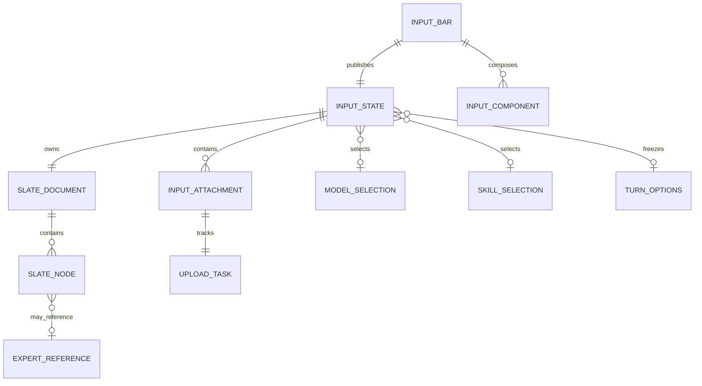
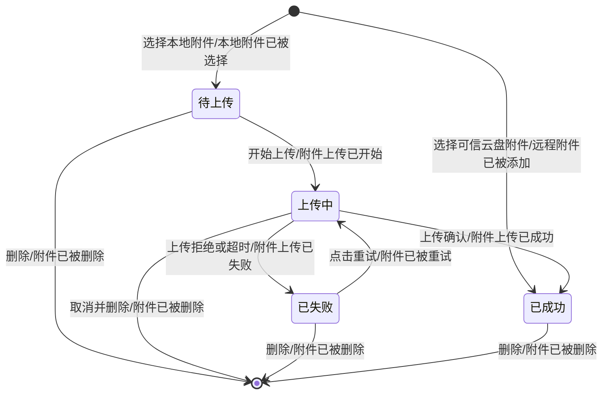
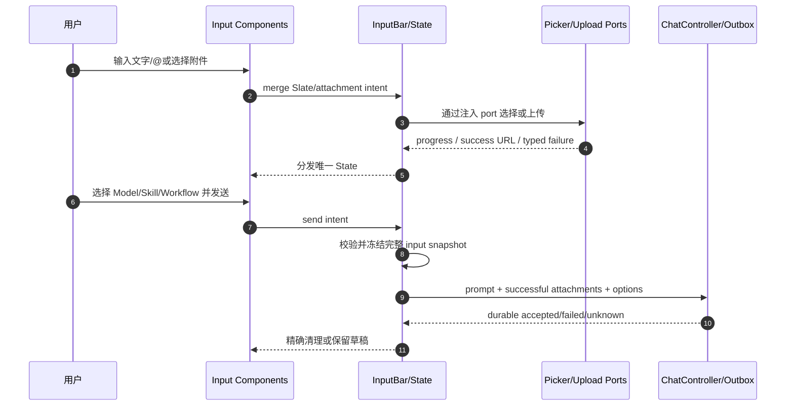
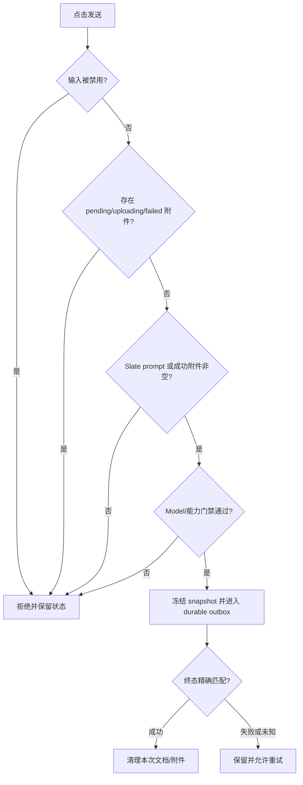

# 需求分析：Flutter 组件化 InputBar

**状态**：已采纳 · **P0 未关闭**：0
**真理源**：本文件取代“基础 TextField 即完整 InputBar”的旧范围；后续架构、Story 和测试必须覆盖真实生产组件与完整输入链。

# 人类卷（产品/开发 3 分钟读完即可开工）

## A. 用户使用地图

| 角色 | 场景 | 要完成的任务 |
|---|---|---|
| 聊天用户 | 在普通、项目或专家团会话输入任务 | 输入文本、@专家、选择照片/文件、查看上传进度并发送 |
| 高级能力用户 | 会话支持模型、Skill 声明时 | 在 InputBar 内选择本轮能力，并让本轮发送冻结选择快照 |
| 页面开发者 | 为不同 Chat 入口组装输入区 | 复用与 iOS 同构的组件集合，不复制选择、上传和发送逻辑 |

## B. 关键业务时刻

```text
输入栏已按场景组装
  → Slate 文档已被编辑（可含 @专家）
  → 照片或文件已被选择
  → 附件上传已成功（失败可重试/删除）
  → 本轮模型/Skill 已冻结
  → 输入快照已进入 durable 发送
  → 成功后已清理，失败/未知时已保留可恢复草稿
```

| 事件 | 谁触发 | 用户得到什么 |
|---|---|---|
| 生产组件已被组装 | Chat 场景 | 只出现当前会话可用的 Text、File、MediaPreview、Model、Skill 组件 |
| 专家引用已被插入 | 用户输入 `@` 并选择成员 | 编辑器中出现不可拆散的 `@名称`，发送时导出 `@[名称](agentId)` |
| 本地附件已被选择 | 用户使用相机/相册/文件/云盘入口 | 附件立即进入预览列表并开始上传 |
| 附件上传已结算 | 上传服务 | 成功可发送；失败展示重试/删除；上传中禁止发送 |
| 输入快照已被冻结 | 用户点击发送 | 文档、成功附件、模型、Skill 属于同一 delivery，不被后续选择改变 |
| 草稿已恢复或清理 | durable 终态 | 成功精确清理；失败、未知或 owner 换代不误删新草稿 |

## C. 关键业务规则（Do / Don't）

- **Do**：按用户最终范围实现 5 类生产组件：Slate Text、FileInput、MediaPreview、Model、Skill；不迁复合 TextAndVoice、Voice 和 AIGC。
- **Do**：文本内核仍使用 Flutter，但状态真值必须是可序列化 Slate 文档；`TextEditingValue` 只是当前编辑投影。
- **Do**：`@` 仅在会话存在可提及专家时启用；引用是原子节点，展示文本与发送文本分离。
- **Do**：InputBar 只定义 `NamiMentionCandidate` 等最小投影值；`AgentSummary`、Skill 等外部业务数据结构和适配在对应模块契约稳定后接入。
- **Do**：照片、视频、本地文件与云盘文件统一进入 typed attachment；本地项必须经历 pending/uploading/success/failed。
- **Do**：上传中或存在未成功附件时禁止发送；失败项可重试或删除，成功项可预览。
- **Do**：发送冻结 Slate prompt、成功附件远程 URL、model/skill 快照，并沿 ChatController/durable outbox 提交。
- **Do**：Flutter 复用系统相机/相册/文件选择器和现有 owner-bound 上传能力；平台能力可用类型安全 port/Channel。
- **Don't**：不迁 Dark 组件、旧 FormTextView、自研相机/相册 UI、FileCreator 等当前 Chat 没有注册的实现。
- **Don't**：不使用 PlatformView 桥接文本编辑器；不以空接口、占位按钮或 Fake 上传冒充完成。
- **Don't**：不保留 iOS 手工高度契约；Flutter 组件高度由布局树和 `AnimatedSize` 自动处理。
- **Don't**：不记录正文、Slate JSON、附件 URL/内容、Token 或签名；10 万字性能仍不作为本 Epic 门禁。

## D. 需求问题清单（均已拍板）

| # | 类 | 问题 | 拍板结果 |
|---|---|---|---|
| P0-01 | ⚔️ | `TextEditingValue` 无法表达 Slate mention，旧状态模型与 @ 功能冲突 | Slate 文档为真值，Flutter selection/composing 为编辑投影 |
| P0-02 | 🕳️ | “组件化”只做了 Text 组件，哪些具体组件必须迁 | 用户最终裁决为 Slate Text、FileInput、MediaPreview、Model、Skill；排除复合 TextAndVoice、Voice、AIGC |
| P0-03 | 🕳️ | 选择、上传、预览和发送附件没有闭环 | 统一 attachment 状态机；成功 URL 进入冻结发送快照，上传中/失败禁止发送 |
| P0-04 | ⚔️ | InputBar 不能直接调用业务，但组件又需要 Picker/Upload | 组件依赖 typed port；Repository/平台适配由 Composition Root 注入，Bar 仍不依赖 Gateway |
| P1-01 | 🤔 | `@` agentId 是否另设协议字段 | 对齐 iOS：发送 prompt 使用 `@[名称](agentId)`；同时保留去重 ID 供未来协议扩展 |

当前没有未关闭 P0/P1；以上结论来自用户本轮四项纠偏、固定 iOS 源码和 Flutter 现有生产能力。

---

<!-- AI工作底稿 ↓ -->

# AI 工作底稿

## 〇、战略层（Why）

- **痛点**：只有框架和 TextField 时，用户无法完成 iOS 已有的 @、附件、能力选择和上传发送，所谓组件化没有用户价值。
- **目标**：让 Flutter Chat 的 InputBar 覆盖 iOS 生产输入链，同时保留单一状态、owner 围栏和 durable 发送语义。
- **可测指标**：5 类生产组件有真实消费者；Slate/@、选择、上传、预览、发送、失败恢复均有自动化测试；Fake/接口占位不计完成。
- **用户故事**：作为 Chat 用户，我要在同一个输入栏组合文本、专家、附件和本轮能力，以便一次可靠提交完整任务上下文。

## 一、范围层（What）

| 功能 | 优先级 |
|---|---|
| InputBar 中心 State/Component/双 Delegate/四位置底座 | P0 |
| Slate document、codec、display/prompt 导出、Flutter 编辑投影 | P0 |
| @专家触发、选择、原子插入/删除、prompt 导出 | P0 |
| 相机/相册/本地文件/云盘选择与权限/数量/大小校验 | P0 |
| MediaPreview、上传进度、失败重试、删除、预览 | P0 |
| Qiniu/对象存储生产上传与 owner/generation 围栏 | P0 |
| Model、Skill 组件及本轮选择快照 | P0 |
| ChatController/durable outbox 携带 prompt、attachments、options | P0 |

**明确不做**：Dark/旧表单/自研 Picker UI、PlatformView 文本桥接、10 万字性能结论、未被当前 Chat 组合消费的组件。

## 二、事件风暴与四图

### ⓪ 命令 → 聚合 → 事件

| 命令 | 聚合 / 不变条件 | 事件 |
|---|---|---|
| 组装场景组件 | 只注册当前场景支持的 5 类生产组件 | 生产组件已被组装 |
| 编辑 Slate 文档 | 节点范围、selection、composing 必须一致 | Slate 文档已被编辑 |
| 选择专家引用 | agentId/name 非空且属于当前 provider 快照 | 专家引用已被插入 |
| 选择本地媒体/文件 | 数量、大小、权限与 owner 有效 | 本地附件已被选择 |
| 添加云盘文件 | 必须已有可信远程引用 | 远程附件已被添加 |
| 上传附件 | pending 项才能上传；迟到结果不得跨 owner | 附件上传已成功 / 已失败 |
| 重试或删除附件 | 只操作当前 owner 和 attachmentId | 附件已被重试 / 已被删除 |
| 选择 Model/Skill | 选择项来自当前能力快照 | 本轮能力已被选择 |
| 点击发送 | 无上传中/失败项，且文本或成功附件非空 | 输入快照已被冻结并提交 |
| durable 终态结算 | delivery/revision/owner 精确匹配 | 草稿已清理 / 已保留 |

### ① 实体关系



### ② Attachment 状态机



### ③ 主流程时序



### ④ 发送决策



## 三、数据字典

| 字段 | 类型 | 来源 | 规则 |
|---|---|---|---|
| document | `NamiSlateDocument` | Flutter editor / 外部草稿 | 真值；含 paragraph/text/mention(agent) 节点 |
| editingValue | `TextEditingValue` | 当前 renderer | 投影；不得单独持久化覆盖 document |
| mentionedAgentIds | `List<String>` | Slate document | 去重；prompt 同时导出 markdown mention |
| attachments | `List<NamiInputAttachment>` | Picker/Upload | attachmentId 唯一；只 success 可进入发送 |
| attachment.phase | pending/uploading/success/failed | Upload Repository | 终态必须携带 owner/generation |
| remoteUrl | HTTPS URI? | Qiniu/云盘 | 仅 success 必填；不得进入普通日志 |
| isUploading | bool derived | attachments | 任一 pending/uploading 即 true |
| model/skill | typed selection | 对应 provider | 点击发送时冻结到 turnOptions |
| sendEnable | derived/policy | InputState | disabled、chatting policy、未就绪附件优先阻断 |

## 四、边界情况清单（必填）

| 场景 | 期望 | 严重度 |
|---|---|---|
| 连续输入 `@`、取消 picker | 保留字面 `@`，不插空 mention | P0 |
| mention 邻接中文/emoji/换行 | range 正确，删除一次移除整个引用 | P0 |
| provider 更新/成员移除 | 既有 mention 保留展示与 agentId，新选择只看新快照 | P1 |
| 照片权限拒绝 | 展示安全文案与设置引导，不创建附件 | P0 |
| 文件超限或数量超限 | 拒绝超限项，已选/已上传项不丢 | P0 |
| 上传失败/超时/未知 | failed 或 reconcile-required；发送禁用，可重试/删除 | P0 |
| owner 切换后旧上传成功 | 丢弃迟到 URL，不写入新会话 | P0 |
| 删除上传中附件 | 取消 token；迟到 progress/success 忽略 | P0 |
| 仅成功附件、无文本 | 允许发送，prompt 按附件模板生成 | P0 |
| 发送后修改 model/skill | 已提交 delivery 保留旧快照，新选择只影响下一条 | P0 |
| 队列/Retry | 复用同 idempotencyKey 和同一冻结输入快照 | P0 |
| 旋转/分屏/重建 | Slate、附件、上传和选择不重置、不重复上传 | P0 |

## 五、异常流程矩阵（必填）

| 触发条件 | 用户可见反馈 | 系统行为 | 是否可恢复 | 产品裁决 |
|---|---|---|---|---|
| Picker 被取消 | 面板保持当前内容，不提示伪错误 | 不创建 attachment，不改变既有 Slate/附件 | 是，可重新选择 | 已明确 |
| 相机/相册/文件权限被拒绝 | 展示本地化拒绝提示；系统允许时提供设置引导 | 返回 typed rejected，不启动上传 | 是，授权后重试 | 已明确 |
| 文件数量或大小超限 | 指明超限原因，既有附件仍可操作 | 只拒绝超限候选，不清空草稿、不创建上传任务 | 是，删除附件或更换文件 | 已明确 |
| 上传接口 4xx/业务拒绝 | 对应卡片进入失败态并显示重试/删除 | 终止当前 operation，保留 attachmentId 和本地来源 | 是，创建新 operation 重试 | 已明确 |
| 上传接口 5xx、超时或断网 | 对应卡片进入可恢复失败态 | 不伪造成功 URL；旧 operation 结果受 generation 围栏 | 是，网络恢复后重试 | 已明确 |
| 回执 URL 非 HTTPS 或为空 | 显示上传失败 | 将回执视为协议失败，phase 不得进入 success | 是，重试或删除 | 已明确 |
| 上传中删除附件 | 卡片立即消失 | 取消 token；迟到 progress/success 被 operation 围栏丢弃 | 是，可重新选择 | 已明确 |
| owner/会话已切换 | 新会话不出现旧附件反馈 | 丢弃旧 picker/upload 返回，不覆盖新 owner 状态 | 是，原 owner 按其生命周期结算 | 已明确 |
| 存在 pending/uploading/failed 附件时发送 | 发送按钮保持禁用或拒绝发送 | 不触发 send callback，不冻结不完整快照 | 是，等待成功、重试或删除 | 已明确 |
| 组件接收外部状态时子组件同步回报 | 用户无额外感知 | applyExternalState 期间抑制回报，避免 State→Component→State 死循环 | 自动恢复 | 已明确 |

## 六、实例化需求与验收标准

| ID | Given | When | Then（锚定事件） | 优先级 |
|---|---|---|---|---|
| AC-IB-001 | Chat 场景声明 5 类能力 | 构建 InputBar | Slate Text、FileInput、MediaPreview、Model、Skill 按约定 position/order 出现，且“生产组件已被组装” | P0 |
| AC-IB-002 | 空 Slate 文档 | 输入多段纯文本 | document 可 JSON round-trip，display/prompt 均保持文本且“Slate 文档已被编辑” | P0 |
| AC-IB-003 | 外部模块已注入专家候选 A | 输入 `@` 并选择 A | 编辑器显示原子 `@A`，prompt 导出 `@[A](agentId)` 且“专家引用已被插入” | P0 |
| AC-IB-003-反 | 无 mention provider 或用户取消 | 输入 `@` | 不插伪引用、不丢字符、无 agentId，引用事件不发生 | P0 |
| AC-IB-004 | 光标邻接 mention | 按一次退格或选中删除 | 整个 mention 被删除，其他文本/selection/composing 保持正确 | P0 |
| AC-IB-005 | 相机/相册/文件权限允许 | 选择合法照片、视频或文件 | typed attachment 进入预览并自动开始上传，“本地附件已被选择” | P0 |
| AC-IB-005-反 | 权限拒绝、取消、超大小或超数量 | 尝试选择 | 不创建 attachment；已有输入不变；展示可恢复反馈 | P0 |
| AC-IB-006 | pending attachment 且 owner 当前 | 上传服务发 progress→success URL | 进度单调、phase=success、URL 仅存状态，“附件上传已成功” | P0 |
| AC-IB-007 | 上传失败或未知 | 点击重试或删除 | 重试复用 attachment 身份但新 operation；删除取消旧操作；对应事件已发生 | P0 |
| AC-IB-008 | 多个图片/文件含不同 phase | 展示 MediaPreview | 可查看类型/名称/进度/失败态并执行预览、重试、删除 | P0 |
| AC-IB-009 | 任一附件未成功 | 点击发送 | send callback 为 0、正文和附件均保留，冻结事件不发生 | P0 |
| AC-IB-010 | 仅成功附件或 Slate+成功附件 | 点击发送 | prompt 含 mention/附件远程引用，快照含成功附件与“输入快照已被冻结并提交” | P0 |
| AC-IB-011 | 已选择 model/skill | 发送后立即改选 | delivery 使用点击时旧选择，新选择仅影响下一次发送 | P0 |
| AC-IB-012 | durable 发送失败/未知/owner 换代 | 旧结果返回 | 当前 owner 的 Slate/附件不被错误清理，“草稿已保留” | P0 |
| AC-IB-013 | 精确 delivery 成功 | 终态确认 | 只清理该 revision 的 Slate/附件，持久选择按策略保留，“草稿已清理” | P0 |

## 七、集成边界

| 集成点 | 责任 | 失败补偿 |
|---|---|---|
| Mention candidate adapter（后置） | 外部 Agent 模块把稳定业务模型投影为 InputBar 最小候选 | 未接入时保留字面 @，InputBar 不反向定义 AgentSummary |
| ImagePicker/DocumentPicker/CloudPicker | 只返回 typed local/remote source | 取消无副作用；临时文件必须 release |
| UploadRepository | token、上传、progress、owner/generation、cancel/reconcile | 失败 typed 化；迟到结果丢弃；不记录 URL/正文 |
| Model/Skill providers | 当前能力与选择 | 快照失败时禁止把空/陈旧选择当成功 |
| ChatController/Outbox | 冻结并持久提交完整 input snapshot | retry 复用 delivery；终态按 owner/revision 结算 |

## 八、分析结论

| 项 | 结论 |
|---|---|
| 可否进入架构设计 | ✅ P0/P1 已由用户裁决和固定源码闭合 |
| 旧实现结论 | `474e5cd2` 仅是可复用底座，整体保持 PARTIAL |
| 下一步 | 重排 Backlog → 重写架构 → 重新拆 Story |

## 反馈（skill_run）

```yaml
skill_run:
  skill: spec-by-example-assistant
  workflow_stage: requirement
  plan: Plans/需求分析/2026-08-18-Flutter组件化InputBar.md
  date: 2026-08-19
  contexts_used:
    - path: Contexts/需求分析/需求分析规范.md
      utility: high
      reason: "按事件链把 mention、选择、上传、重试、发送与草稿结算转成 14 组可测 AC"
    - path: Templates/需求分析-带验收标准模板.md
      utility: high
      reason: "补齐正例、反例、边界、异常和集成责任"
  contexts_missing: []
  contexts_stale: []
  outcome_status: pass
  revisit_needed: false
```

```yaml
skill_run:
  skill: requirement-analyst
  workflow_stage: requirement
  plan: Plans/需求分析/2026-08-18-Flutter组件化InputBar.md
  date: 2026-08-19
  contexts_used:
    - path: Contexts/需求分析/需求分析规范.md
      utility: high
      reason: "用 Why/What/How、事件风暴和四图重建完整生产 InputBar 范围"
    - path: Templates/需求分析-带验收标准模板.md
      utility: high
      reason: "确保人类卷可快速确认，AI 底稿可直接供架构和测试消费"
  contexts_missing:
    - "InputBar 生产上传 prompt 模板的跨端统一配置说明"
  contexts_stale: []
  outcome_status: pass
  revisit_needed: false
```

## 续做

```text
/resume plan=Plans/需求分析/2026-08-18-Flutter组件化InputBar.md 进度=进入 prioritization
```

## 反馈（skill_run）

```yaml
skill_run:
  skill: event-storming-assistant
  plan: Plans/需求分析/2026-08-18-Flutter组件化InputBar.md
  date: 2026-08-19
  contexts_used:
    - path: Plans/Epic/2026-08-18-Flutter组件化InputBar.md
      utility: high
      reason: "确认 client-dev 当前回放卡在 requirement，并保持用户已裁决的五组件 Epic 范围"
    - path: Plans/功能开发/2026-08-18-Flutter组件化InputBar-US-IB-002.impl.json
      utility: high
      reason: "把 picker、上传、owner/operation 围栏和组件回写风险还原为可测异常事件"
    - path: Templates/事件风暴模板.md
      utility: high
      reason: "复核既有命令-事件墙、热点和角色交互已覆盖，只补机械门禁缺失的边界与异常契约"
  contexts_missing: []
  contexts_stale: []
  outcome_status: pass
  friction: "既有需求已包含边界与异常内容，但合并标题无法被 client-dev 机械门禁识别"
  revisit_needed: false
```
