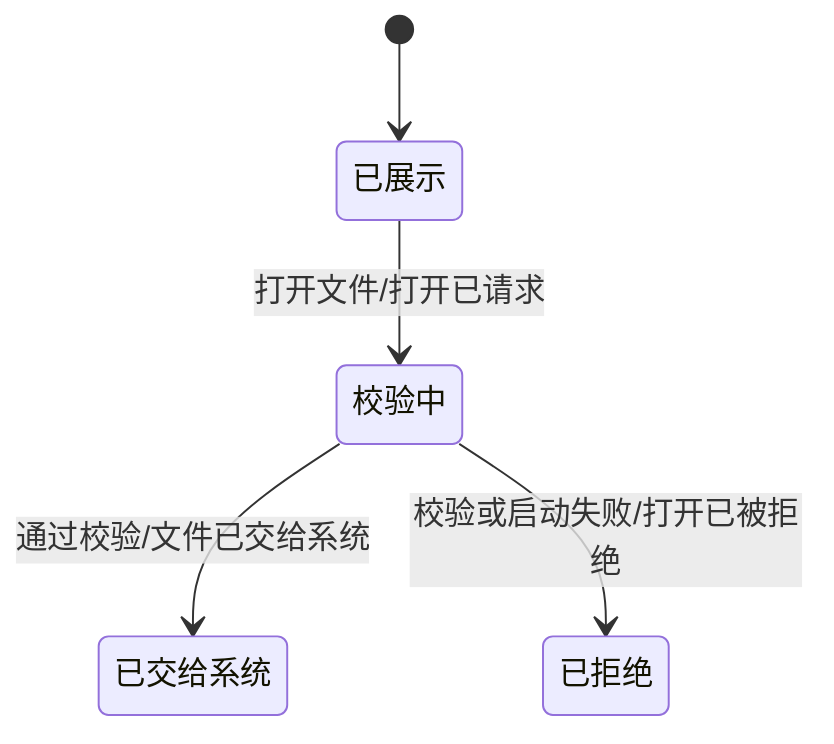
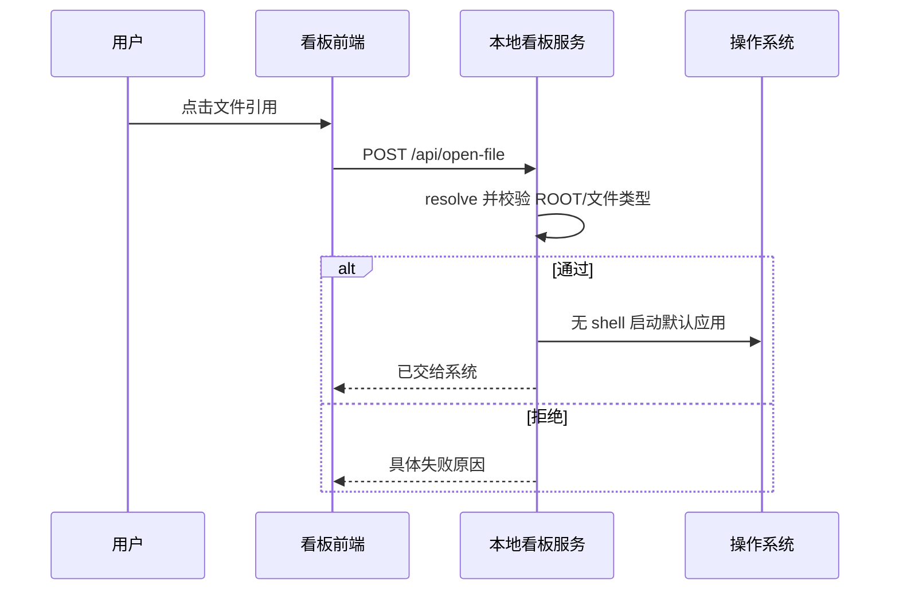
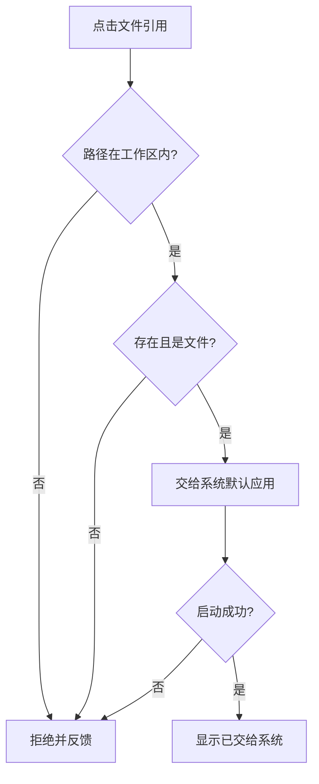

# 需求分析：看板引用文件系统打开

# 人类卷

## A. 用户使用地图

| 角色 | 场景 | 任务 |
|------|------|------|
| 工作流执行者 | 在看板核对 Plan、实现落点或测试证据 | 不离开看板定位文件，点击后由系统默认应用打开 |

## B. 关键业务时刻

```text
已看到文件引用 → 已请求打开 → 路径已校验 → 文件已交给系统，或打开已被拒绝
```

| 事件 | 谁触发 | 用户得到什么 |
|------|--------|----------------|
| 打开已请求 | 用户 | 按钮显示处理中，避免连点 |
| 文件已交给系统 | 看板服务 | 明确成功反馈 |
| 打开已被拒绝 | 看板服务 | 看到缺失、越界、目录或系统打开器失败的原因 |

## C. 关键业务规则

- **Do**：只给明确的 Epic/Plan、Story Plan、实现落点、TDD 证据、产物模板和事件 Plan 引用提供打开入口。
- **Don't**：不把 commit、event_id、snapshot、状态、Skill 名或普通描述文字视为文件。
- **前提 → 后果**：路径 resolve 后仍位于 AI-Work-Kit 根目录且是存在的普通文件，才能交给系统默认应用。

## D. 需求问题清单

| # | 类 | 一句话问题 | 结论 |
|---|----|-------------|------|
| P0-1 | 🤔 | 是否允许打开工作区外路径 | 不允许，用户已确认安全接口范围 |
| P0-2 | 🤔 | 历史缺失引用是否补数据 | 不补历史，只保证现在的设计合理 |

<!-- AI工作底稿 ↓ -->

# AI 工作底稿

## 〇、Why / What / How

- **Why**：看板已经展示文件路径，但用户仍要复制路径并另行查找，审计和续做断链。
- **What**：让已知工作区文件引用可以通过本地看板交给操作系统打开。
- **How 边界**：前端只表达打开意图；后端不信任传入路径，校验后无 shell 启动系统打开器。
- **不做**：不做文件内容预览、编辑、远程打开、历史数据补录或任意绝对路径访问。

## 一、事件风暴与四图

| 命令 | 聚合 / 不变条件 | 事件 |
|------|-----------------|------|
| 打开引用文件 | 文件引用：工作区内、已存在、非目录 | 文件已交给系统 |
| 打开引用文件 | 任意不变条件未满足，或系统打开器启动失败 | 打开已被拒绝 |








## 二、边界与异常矩阵

| 场景 | 期望行为 | 可恢复 |
|------|----------|--------|
| 引用缺失 | 显示文件不存在，不调用系统 | 是，补文件后重试 |
| 路径穿越或符号链接越界 | 拒绝且不泄露外部文件内容 | 否，必须改为合法引用 |
| 路径指向目录 | 明确说明不是文件 | 是，改选文件 |
| 系统打开器不可用 | 显示启动失败原因 | 是，修复本机环境后重试 |
| 连续点击 | 处理期间按钮禁用 | 是，请求结束后自动恢复 |

## 三、数据字典与人机边界

| 字段 | 类型 | 必填 | 来源 | 校验 |
|------|------|------|------|------|
| file | string | 是 | 看板已知文件字段 | 非空、无 NUL、resolve 后在 ROOT 内、exists、is_file |

用户只确认“打开这个引用”；路径判定和系统调用由本地服务自动完成，不要求用户为每个文件再次审批。

## 四、逻辑、交互与遗漏结论

- 逻辑：工作区边界、缺失文件和普通文件类型已确认，无未解 P0。
- 交互：成功与失败均用 toast 反馈；缺失文件直接显示不可打开状态。
- 遗漏：Windows/Linux 打开器命令已保留兼容分支；远程访问和文件预览不在本轮 Scope。

## 五、验收标准

| # | 验收项 | 锚定事件 | Given | When | Then | 优先级 |
|---|--------|----------|-------|------|------|--------|
| AC-OPEN-001 | 已知引用可操作 | 打开已请求 | 看板展示真实文件引用 | 点击打开 | 发出本地打开请求，“打开已请求”发生 | P0 |
| AC-OPEN-002 | 系统打开 | 文件已交给系统 | 路径在工作区内且是真实文件 | 服务处理请求 | 无 shell 调用默认应用，“文件已交给系统”发生 | P0 |
| AC-OPEN-003 | 越界拒绝 | 打开已被拒绝 | 路径穿越、缺失、是目录或符号链接越界 | 服务处理请求 | 不调用系统并显示具体原因，“打开已被拒绝”发生 | P0 |
| AC-OPEN-004 | 非文件不增加入口 | — | 看板展示 commit、event_id、snapshot 或状态 | 页面渲染 | 这些字段保持纯文本，不发生打开请求 | P0 |

## 六、分析结论

Why、Scope、事件链、四图、安全边界和可测 AC 均已闭环；无 P0 未决问题，允许进入功能开发。

## 反馈（skill_run）

```yaml
skill_run:
  skill: requirement-analyst
  workflow_stage: requirement
  plan: Plans/需求分析/2026-08-18-看板引用文件系统打开.md
  date: 2026-08-18
  contexts_used:
    - path: Contexts/需求分析/需求分析规范.md
      utility: high
      reason: "用事件链、四图、边界矩阵和 GWT 把口头需求固化为可测契约"
    - path: Templates/需求分析-带验收标准模板.md
      utility: high
      reason: "保持人类卷与 AI 底稿的分卷结构"
  contexts_missing: []
  contexts_stale: []
  outcome: "看板文件打开的入口、安全边界、成败反馈和非 Scope 已确认"
  utility: high
  reason: "需求稿消除了任意本地路径是否可打开的关键歧义"
```
