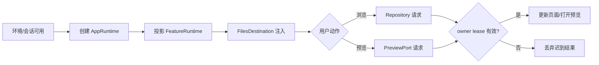
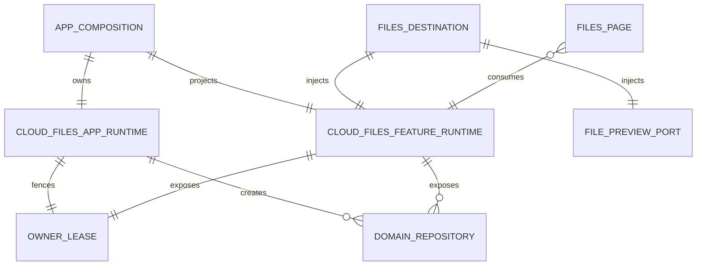
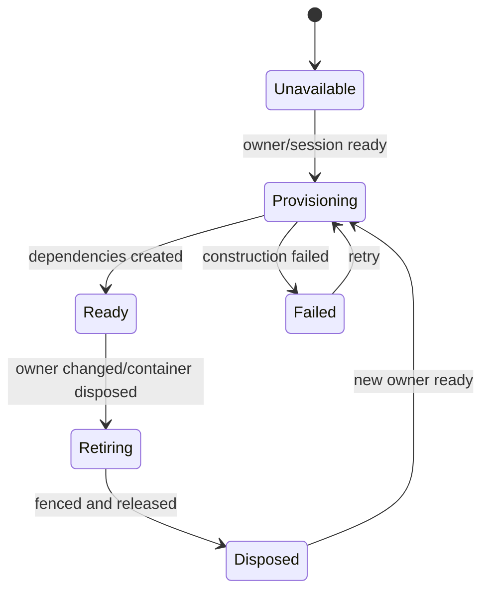
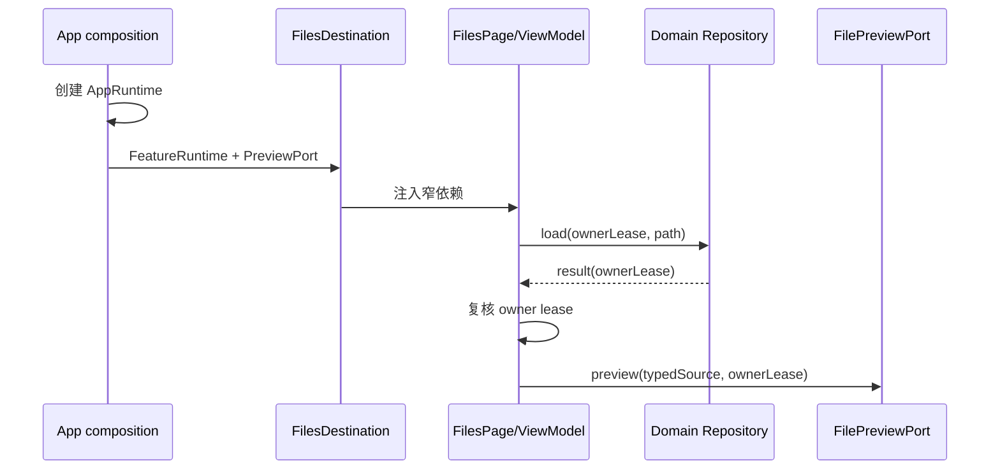
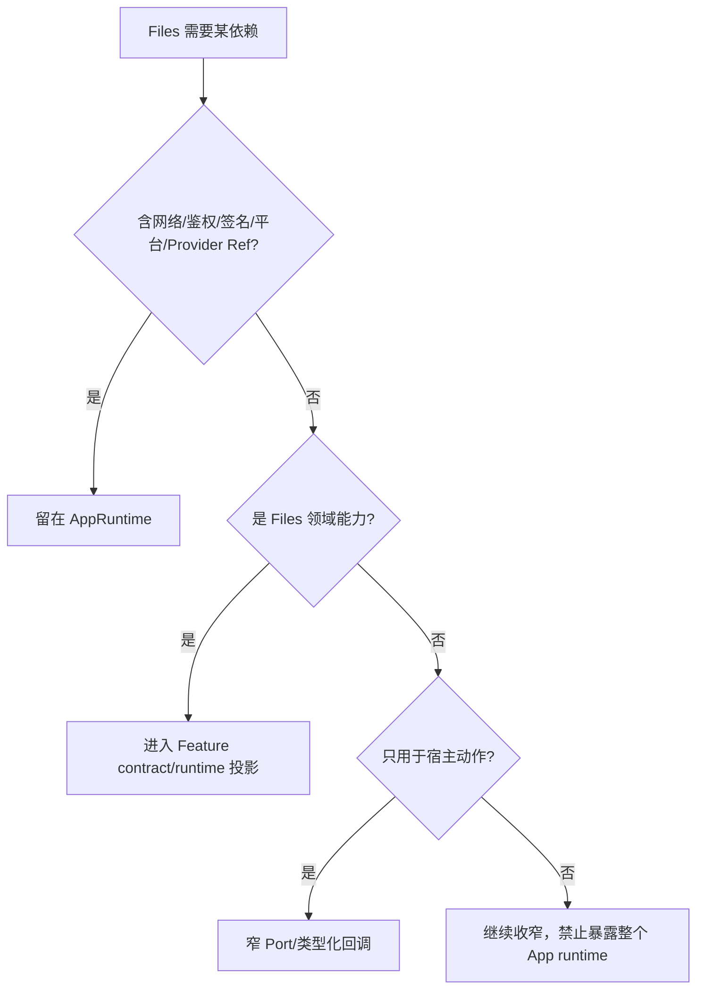

# Flutter CloudFiles 与文件预览依赖边界重构｜需求分析

## 结论

本轮是一次**不改变产品行为的架构重构**：保留 CloudFiles、Workspace 文件浏览、上传下载与系统文件预览的现有生产能力，只修正依赖方向、运行时职责和 Provider 装配边界。

1. 具体生产对象由 App composition 创建和绑定；预览 UI、协调逻辑与 Flutter 插件适配归独立 `features/file_preview` 分层，鉴权/签名凭据不进入 Presentation/Domain。
2. `lib/features/files/**` 不再导入 `lib/app/**`，Files 页面只依赖 Feature 自己的窄接口、仓库和状态对象。
3. 当前 `CloudFilesRuntime` 拆分为 App 内部运行时与 Feature 可见能力投影；暂定 `CloudFilesAppRuntime` 与 `CloudFilesFeatureRuntime`。
4. `FilesDestination` 作为 App host 读取 Provider，并向 Files 注入窄依赖；具体预览能力由 `features/file_preview` 实现，App 只经 `FilePreviewPort` 或等价类型化接口完成绑定。
5. `lib/app/composition/**` 不得反向导入 `composition_root.dart`；共享前置依赖进入无反向依赖的叶子装配模块。
6. owner identity、generation/lease、迟到结果隔离、缓存 namespace、协议、签名、持久化格式及 UI 均保持不变。

## 一、人类工作区

### 角色与目标

| 角色 | 目标 | 不可接受结果 |
|---|---|---|
| 终端用户 | 云盘浏览、文件操作和预览与重构前一致 | 页面不可用、预览方式改变、切换 owner 后串数据 |
| Flutter 维护者 | 能从目录判断依赖方向，独立演进 Files 与 App composition | Feature 感知 App runtime，Provider 互相反向导入 |
| 测试与发布人员 | 用定向测试证明边界和生产行为未回退 | 只有 Contract/Fake 通过，生产入口未闭合 |
| 后续开发者 | 新文件能力有明确装配入口和窄契约 | 为拿一个 Repository 注入整个 Runtime |

### 用户/系统事件时间线

1. 重构范围与不变量已确认。
2. 旧依赖方向和组合环已被边界测试锁定。
3. App composition 已创建内部生产运行时。
4. App host 已将内部运行时投影成 Files 所需窄能力。
5. Files 页面已通过注入的 Repository、owner lease 与预览端口工作。
6. owner 切换后，旧请求结果已被拒绝写入新 owner 状态。
7. 文件预览已由 App 侧解析平台实现并保持原有行为。
8. 生产链、失败恢复和定向回归均已验证。

### 本轮做 / 不做

做：

- 消除 Files/CloudFiles/文件预览链路中的 Feature → App 导入。
- 消除 App composition 子模块 → `composition_root.dart` 的反向导入。
- 拆分 App 内部实现细节与 Feature 可消费能力。
- 将 Provider 读取集中到 App host/装配层，向页面注入窄接口。
- 增加依赖边界、无环和 owner fencing 回归测试。
- 修订导致“Provider 都进入聚合根”误解的约束文字。

不做：

- 不调整产品交互、Gateway/Claw 协议、签名算法和请求语义。
- 不修改缓存 namespace、持久化格式或发起数据迁移。
- 不扩展为全仓所有 Feature 的统一依赖治理。
- 不处理 InputBar 或当前工作树其他改动。
- 本阶段不改任何生产代码。

### 待确认项

本轮没有阻断需求分析的 P0 问题。以下 P1 建议进入架构评审：

| 编号 | 问题 | 建议裁决 |
|---|---|---|
| P1-01 | Feature 能力对象命名 | 暂用 `CloudFilesFeatureRuntime`；若最终只含仓库与 lease，可改为 `CloudFilesFeatureScope` |
| P1-02 | 预览能力用接口还是多个回调 | 优先单一窄接口 `FilePreviewPort`，避免 callback 携带整个 Runtime |
| P1-03 | 边界规则是否推广全仓 | 本 Epic 只执行 Files 范围，规则写成可推广形式，后续另立治理任务 |

<!-- AI工作底稿 ↓ -->

## 二、AI 工作底稿

## Why / What / How

### Why

问题不是“App composition 不应该存在”，而是装配对象和 Feature 消费对象混成同一个 `CloudFilesRuntime`：

- Files 页面直接导入 App Provider 和 App runtime；
- composition 子模块为了共享依赖反向导入聚合根；
- 根既是总入口又被子模块依赖，形成潜在或实际 import cycle；
- 新能力持续塞入大 Runtime，职责向聚合根集中；
- 现有测试只检查少数 Provider 没有直接定义在根文件，无法阻止错误依赖方向。

### What

```text
App composition / App host
  ├─ CloudFilesAppRuntime（网络、鉴权、签名、平台能力）
  ├─ CloudFilesFeatureRuntime（owner lease、领域 Repository）
  └─ FilePreviewPort
             ↓ 注入
Files Feature（页面、ViewModel、Feature contract）
```

### How

先以边界测试锁定禁止关系和行为不变量；再提取无反向依赖的 composition leaf module，拆分 Runtime，由 `FilesDestination` 完成投影和注入；逐一迁移生产消费者，最后收窄旧 Runtime。

## 领域事件墙

| 事件 | 命令 | 责任主体 | 不变量 | 下游 |
|---|---|---|---|---|
| App 文件运行时已被创建 | 创建生产依赖 | App composition | client/auth/signing/platform 仅 App 可见 | 能力投影 |
| Feature 文件能力已被投影 | 投影 Files 依赖 | Host adapter | 只暴露 owner lease 与领域 Repository | 页面注入 |
| Files 页面已接收窄依赖 | 打开 Files 页面 | `FilesDestination` | 页面不读取 App Provider | 浏览/预览 |
| 云盘目录已被加载 | 加载当前目录 | Cloud Repository | 结果只能写回发起 owner | UI 更新 |
| Workspace 文件已被加载 | 加载 Workspace 文件 | Workspace Repository | 不泄漏 Cloud client | UI 更新 |
| 文件预览请求已被发起 | 预览文件 | `FilePreviewPort` | 传 typed source，不传 App runtime | 平台预览 |
| 当前 owner 结果已被接纳 | 提交异步结果 | ViewModel/Repository | identity 与 generation/lease 匹配 | UI 更新 |
| 过期 owner 结果已被丢弃 | 拒绝迟到结果 | owner fence | 旧结果不覆盖新 owner | 脱敏日志 |
| App 文件运行时已被释放 | 释放旧运行时 | App composition | 资源只释放一次 | 新运行时/终止 |

## 热点

| 热点 | 风险 | 裁决 |
|---|---|---|
| Runtime 粒度 | 参数爆炸或继续泄漏 App 细节 | Feature 对象只聚合领域 Repository、owner lease 与必要 capability |
| Preview 所属层 | App 变成跨 Feature 实现仓库 | 独立 `file_preview` Feature 持有 UI/application/infrastructure，App 只装配 |
| Provider 生命周期 | 拆模块后重复创建 client/coordinator | 生命周期与当前 ProviderContainer 一致，并增加 identity/dispose 测试 |
| Projects 消费旧 Runtime | 只迁 Files 会残留大对象依赖 | 架构影响矩阵列全生产消费者与迁移顺序 |
| 文档规则歧义 | “由 Composition Root 注册”被理解成写进根文件 | 改为“对应 App composition 模块装配，root 只汇聚/暴露” |

## 事件链



## 四图推演

### 概念 ER 图



说明：这是依赖关系模型，不新增数据库表。

### Runtime 状态机



### Host 注入时序



### 依赖归属决策



## 边界情况清单

| 编号 | 边界情况 | 期望行为 |
|---|---|---|
| B01 | 环境存在但鉴权未就绪 | Runtime unavailable/provisioning，不构造半成品 |
| B02 | owner 在目录请求期间切换 | 旧结果被 lease/generation fence 丢弃 |
| B03 | owner 在预览下载期间切换 | 旧请求不使用新 owner 凭据续跑 |
| B04 | 相同 owner 重建 ProviderContainer | 旧资源仅释放一次，新资源仅创建一次 |
| B05 | Preview source 无法解析 | 显式失败，不回退到错误 source 或伪成功 |
| B06 | Workspace 与 Cloud 共用预览入口 | Host 依据 typed source 选实现，Feature 不判断 Provider |
| B07 | 平台不支持某预览方式 | 保留现有 download/cache/external-open 降级链 |
| B08 | Repository 被测试 override | 无需构建 Auth、Dio 或 App root 即可测试 |
| B09 | Projects 继续使用云文件能力 | 通过 App 内部接口/窄投影，不反向污染 Feature |
| B10 | 缓存仍含 `personal-cloud` namespace | 保持不变，不迁移、不换 key |

## 异常流程矩阵

| 场景 | 检测点 | 用户表现 | 状态与恢复 | 诊断 |
|---|---|---|---|---|
| Runtime 创建失败 | App composition | 既有失败/重试 UI | Failed；同 owner 显式 retry | 脱敏记录 generation 与阶段 |
| 目录加载超时/离线 | Repository | 既有错误和重试 | 请求终止；用户重试/网络恢复 | 不记录 Token/正文/二进制 |
| owner 切换迟到结果 | owner fence | 不闪回旧数据 | 丢弃；新 owner 单独加载 | 记录 stale result 类别 |
| 预览下载失败 | Preview adapter | 既有失败提示 | 不写成功缓存；允许既有重试 | 遵循 HTTP 日志安全约束 |
| 平台打开器拒绝 | Platform preview | 显式失败 | 既有替代方式或重试 | 记录错误码，不记录内容 |
| Runtime 重复释放 | Provider lifecycle | 不应可见 | dispose 幂等 | 测试捕获重复 close |
| 边界被后续提交破坏 | 静态测试 | 构建前阻断 | 移除非法 import/调整注入 | 输出非法路径 |

## 数据字典

| 名称 | 定义 | 约束 |
|---|---|---|
| `CloudFilesAppRuntime` | 文件生产链完整实现依赖 | 仅 App 可见，不被 Feature import |
| `CloudFilesFeatureRuntime` | owner lease 与领域 Repository/capability 投影 | 不含 Dio/auth/signing/platform/Provider Ref |
| `OwnerIdentity` | environment/account/workspace/gateway 等 owner 组合 | 与现有语义一致、可比较 |
| `OwnerGeneration` | owner 生命周期内的运行时代次 | 异步返回必须复核 |
| `OwnerLease` | identity + generation 的有效性判断 | 不含 secret；过期结果不得提交 |
| `FilePreviewSource` | workspace/cloud/local 等 typed request | 不携带 App runtime 或文件二进制 |
| `FilePreviewPort` | 发起预览并返回显式结果的 Feature contract | 具体下载、缓存和平台实现由 App 注入 |

## 实例化需求

| ID | Given | When | Then |
|---|---|---|---|
| GWT-01 | 扫描 `lib/features/files/**` | 发现 import | 不得指向 `lib/app/**` |
| GWT-02 | 扫描 `lib/app/composition/**` | 发现 import | 不得指向 `composition_root.dart` |
| GWT-03 | 当前 owner 生产依赖就绪 | 打开 Files | Host 注入 Feature runtime，页面不读 App Provider |
| GWT-04 | 云盘目录可访问 | 用户进入目录 | 注入的 cloud Repository 返回与重构前一致状态 |
| GWT-05 | Workspace 文件可访问 | 用户进入列表 | 注入 workspace Repository，不泄漏 Cloud client |
| GWT-06 | 可预览文件已展示 | 点击预览 | Feature 发送 typed source，App 选择平台实现 |
| GWT-07 | 目录请求进行中 | owner generation 改变后旧请求返回 | 旧结果丢弃，不覆盖新 owner |
| GWT-08 | 预览下载进行中 | owner 切换 | 旧请求终止/作废，不借新凭据续跑 |
| GWT-09 | Runtime 构造失败 | 页面请求依赖 | 显式 unavailable/failed，可重试，无半成品 |
| GWT-10 | 测试只关心 Files 状态 | 注入 Fake Repo/PreviewPort | 无需初始化 App root、Dio、Auth、插件 |
| GWT-11 | Projects 仍需云文件能力 | 迁移旧消费者 | 由 App 内部能力/窄投影满足 |
| GWT-12 | 已有缓存/持久化数据 | 重构后首次启动 | namespace/格式不变，不迁移或失效 |
| GWT-13 | ProviderContainer 销毁并重建 | 新 runtime 创建 | 旧资源最多释放一次，新资源最多创建一次 |
| GWT-14 | 重构完成 | 对比 Files/上传下载/预览 | 文案、导航、布局、交互无新增变化 |

## 反例

- 把 Dio、AuthSession 或签名工厂移入 Files Feature。
- 将 WidgetRef、Provider 或整个 AppRuntime 作为页面参数。
- 只移动 Provider 文件，但子模块仍反向 import root。
- FeatureRuntime 仍含 preview coordinator、platform previewer 或 signed client。
- owner 切换后换 key/凭据盲重试旧操作。
- 通过改变缓存 namespace 或清缓存规避生命周期问题。

## 验收标准

| AC | 内容 | 证据 |
|---|---|---|
| AC-01 | Files Feature 对 App 静态依赖为零 | 自动边界测试 |
| AC-02 | composition 子模块不反向依赖聚合根 | 自动边界测试 |
| AC-03 | App runtime 与 Feature 投影职责分离 | 类型字段审查 + 单测 |
| AC-04 | Files 入口由 Host 注入窄依赖 | 生产调用链/Widget 测试 |
| AC-05 | 预览 UI、编排与插件适配归 `features/file_preview`，App 只经 port/provider 装配 | contract + adapter + 边界定向测试 |
| AC-06 | owner 切换与迟到结果隔离有效 | 目录加载与预览 fencing 回归 |
| AC-07 | 协议、签名、缓存 namespace、持久化和 UI 不变 | diff 审查 + focused regression |
| AC-08 | Provider 生命周期无重复创建/释放 | ProviderContainer lifecycle 测试 |
| AC-09 | 所有旧生产消费者有迁移落点 | 架构影响矩阵逐项关闭 |
| AC-10 | 文档不再暗示 Provider 必须写进单一根文件 | 规则文档审查 |

## 需求影响初判

| 区域 | 预期影响 | 产品变化 |
|---|---|---|
| `lib/app/cloud_files_runtime.dart` | Runtime 职责拆分 | 无 |
| `lib/app/composition/**files**` | Provider 依赖方向调整 | 无 |
| `lib/app/composition_root.dart` | 收敛为汇聚入口，不被子模块依赖 | 无 |
| `lib/app/integrations/files_destination.dart` | runtime 投影与 port 注入 | 无 |
| `lib/features/files/**` | 删除 App import，消费 Feature contract | 无 |
| Projects/Main 等消费者 | 迁移旧 Runtime 引用 | 无 |
| 边界与定向测试 | 增加禁止关系和不变量回归 | 无 |
| 约束文档 | 澄清 composition module 与 root file | 无 |

## 需求评审结论

- P0 开放问题：0。
- 当前状态：**已采纳**。
- 可以进入 Backlog 排序与架构设计。
- 未授权：生产代码修改、Story 开发、提交与推送。

## 反馈（skill_run）

```yaml
skill_run:
  skill: event-storming-assistant
  workflow_stage: requirement
  plan: Plans/需求分析/2026-08-19-Flutter-CloudFiles与文件预览依赖边界重构.md
  date: 2026-08-19
  action: domain_event_discovery
  inputs:
    - Plans/Epic/2026-08-19-Flutter-CloudFiles与文件预览依赖边界重构.md
    - Templates/事件风暴模板.md
  outputs:
    - Plans/需求分析/2026-08-19-Flutter-CloudFiles与文件预览依赖边界重构.md
  contexts_used:
    - path: Contexts/需求分析/需求分析规范.md
      utility: high
      reason: 用事件链、四图和人机分区约束事件风暴产出。
    - path: Contexts/需求分析/需求分析产出标准.md
      utility: high
      reason: 确保边界、异常和验收锚点可进入后续阶段。
  contexts_missing: []
  contexts_stale: []
  outcome_status: pass
  revisit_needed: false
```

```yaml
skill_run:
  skill: spec-by-example-assistant
  workflow_stage: requirement
  plan: Plans/需求分析/2026-08-19-Flutter-CloudFiles与文件预览依赖边界重构.md
  date: 2026-08-19
  action: specify_examples
  inputs:
    - Plans/需求分析/2026-08-19-Flutter-CloudFiles与文件预览依赖边界重构.md
    - Templates/实例化需求模板.md
  outputs:
    - Plans/需求分析/2026-08-19-Flutter-CloudFiles与文件预览依赖边界重构.md
  contexts_used:
    - path: Contexts/需求分析/需求分析规范.md
      utility: high
      reason: 用 Given-When-Then 把边界与 owner fencing 转成可测行为。
    - path: Contexts/需求分析/需求分析产出标准.md
      utility: high
      reason: 校验反例、异常流程和验收标准的完整度。
  contexts_missing: []
  contexts_stale: []
  outcome_status: pass
  revisit_needed: false
```

```yaml
skill_run:
  skill: requirement-analyst
  workflow_stage: requirement
  plan: Plans/需求分析/2026-08-19-Flutter-CloudFiles与文件预览依赖边界重构.md
  date: 2026-08-19
  action: requirement_review
  inputs:
    - Plans/Epic/2026-08-19-Flutter-CloudFiles与文件预览依赖边界重构.md
    - Plans/需求分析/2026-08-19-Flutter-CloudFiles与文件预览依赖边界重构.md
  outputs:
    - Plans/需求分析/2026-08-19-Flutter-CloudFiles与文件预览依赖边界重构.md
  contexts_used:
    - path: Contexts/需求分析/需求分析规范.md
      utility: high
      reason: 约束 Why/What/How、四图、人机分区和问题分级。
    - path: Contexts/需求分析/需求分析产出标准.md
      utility: high
      reason: 确认 P0 清零且验收标准足以支撑架构设计。
    - path: Contexts/决策/Skill反馈协议.md
      utility: high
      reason: 按统一协议记录本次技能运行证据。
  contexts_missing: []
  contexts_stale: []
  outcome_status: pass
  revisit_needed: false
```
