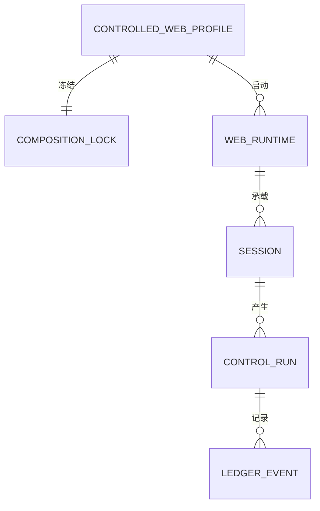
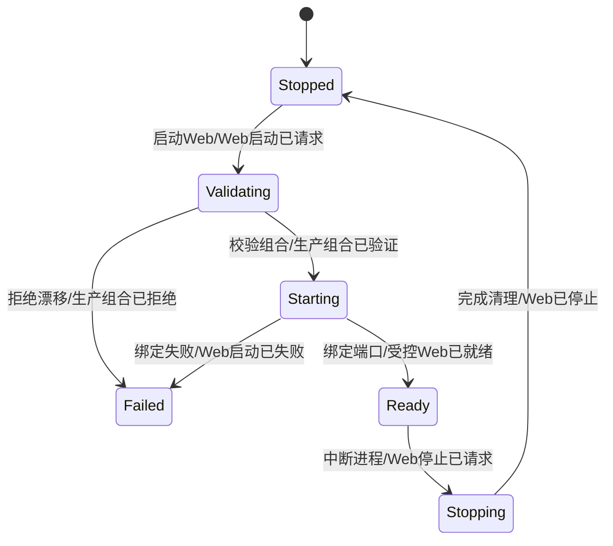
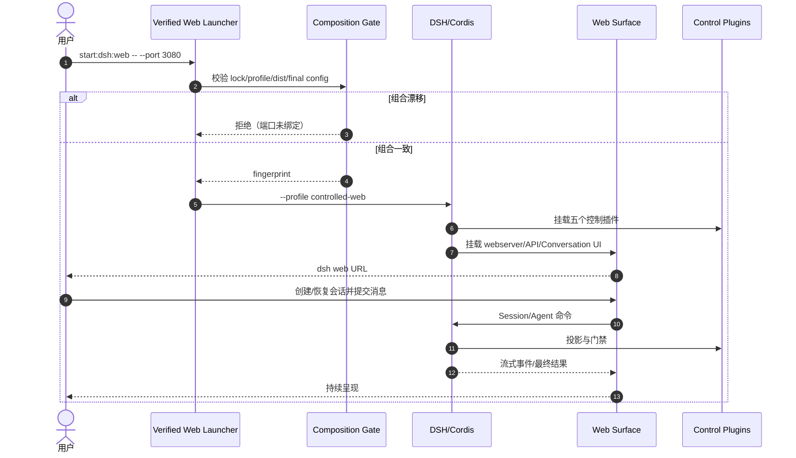
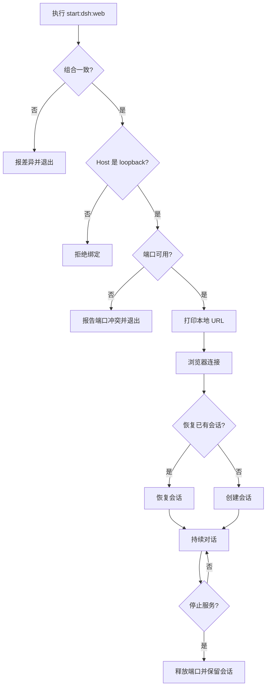

# 需求分析：Agent 受控 DSH 交互式 Web 入口

**创建日期**：2026-08-20  
**状态**：已采纳 · P0=0  
**真理源**：本文件是本 Epic 后续架构、Story、实现与测试的唯一需求基准。

# 人类卷

## A. 用户使用地图

| 角色 | 场景 | 任务 |
|------|------|------|
| 本地开发者 | 需要连续对话、查看工具过程或响应 Agent 追问 | 一条命令打开受控 DSH Web，并在浏览器持续使用 |
| 自动化调用方 | CI、脚本或后台调度提交一次性任务 | 继续使用现有 headless 入口，不受 Web 改造影响 |
| 控制系统维护者 | 检查生产交互入口是否绕过控制面 | 确认 Web 与 headless 都加载同一组控制插件 |

## B. 关键业务时刻

```text
开发者启动 Web → 生产组合已验证 → 受控 Web 已监听 loopback → 浏览器已连接
→ 会话已创建/恢复 → 用户消息已提交 → Agent 结果已呈现 → Web 已安全停止
```

| 时刻（事件） | 谁触发 | 用户看到/得到什么 |
|--------------|--------|-------------------|
| 生产组合已验证 | 启动器 | 漂移时启动被阻断，未占用端口 |
| 受控 Web 已就绪 | Web Surface | 明确的本地 URL，可打开官方 DSH 页面 |
| 会话已创建或恢复 | 用户 | 可连续发送消息并查看历史 |
| 控制事实已记录 | 控制插件 | Web 运行仍受 Ledger/Authority/Safety 约束 |
| Web 已停止 | 用户/系统信号 | 端口释放，会话数据保留 |

## C. 关键业务规则（Do / Don't）

- **Do**：保留 `start`/`start:dsh` 为受控 headless；新增独立 `start:dsh:web`。
- **Do**：Web 默认只绑定 `127.0.0.1`，默认端口沿用上游 3080，允许传 `--port`。
- **Do**：Web 使用官方 `@deepseek-ai/dsh-web-app`，复用现有两层控制 bundle 和五个控制插件。
- **Do**：headless 与 Web 分别冻结 profile、最终配置和 composition fingerprint。
- **Don't**：不把裸 `dsh web` 宣称为受控入口，不修改官方前端，不把 LangGraph 接到生产凭证。
- **Don't**：不允许 `--profile` 或未记录的 `--patch` 覆盖受控 Web；不允许 Executor-only secrets 进入进程。
- **前提 → 后果**：组合、依赖锁、生成 JS 或 profile 漂移 → Web 在绑定端口前失败关闭。

## D. 需求问题清单

| # | 类 | 一句话问题 | 已采纳决策 |
|---|----|-----------|------------|
| P0-1 | ⚔️ | Web 是否替换现有一次性生产入口？ | 不替换；headless 与 Web 双入口并存 |
| P0-2 | 🕳️ | 直接 `dsh web` 会绕过控制插件吗？ | 会；只把新的 verified `start:dsh:web` 作为受控入口 |
| P0-3 | 🕳️ | Web 是否允许对公网监听？ | 本轮仅 loopback；沿用上游对 `0.0.0.0` 的拒绝 |
| P0-4 | 🤔 | 是否重做 Web/TUI？ | 不重做 UI；复用官方 Web Surface，TUI 不在 Scope |

<!-- AI工作底稿 ↓ -->

# AI 工作底稿

## 〇、战略层（Why）

- **痛点**：当前唯一受控生产入口是 headless，一次任务后退出；用户若直接用官方 Web profile，会绕过本仓库的组合指纹和控制插件。
- **量化目标**：新增 1 条受控 Web 启动命令；控制插件 5/5 出现在 Web 配置树；headless 回归 100%；漂移/非法覆盖/端口冲突 100% 非零退出。
- **用户故事**：作为本地开发者，我想在保留生产门禁的前提下持续与 DSH 交互，以便追问、恢复会话并查看工具过程。

## 一、PRD 摘要

新增独立 `controlled-web` DSH profile，在官方 `dsh-base + dsh-web-app` 上叠加既有 `control-base + control-production`。新增 verified Web launcher、独立 composition lock 和根脚本入口；默认只监听 loopback。现有 `controlled` headless、recovery 和 Learning Runtime 均保持原语义。

## 一·五、范围层（What）

| 包含功能 | 优先级 |
|----------|--------|
| 受控 Web profile、依赖锁与 patch | P0 |
| Web 专用组合采集、冻结、验证和启动器 | P0 |
| `start:dsh:web` / `composition:web:*` 命令与 README | P0 |
| Web 配置树、HTTP 可达、非法覆盖、端口冲突、信号关闭及 headless 回归 | P0 |
| 浏览器内真实模型连续对话人工 smoke | P1 |

**明确不做**：重写官方 UI、终端 TUI、公网部署、SSO、多租户、移动端适配、修改模型/Session 核心、自动启动 Safety Executor/Watchdog。

## 一·六、事件风暴 + 业务逻辑图

### ⓪ 事件风暴表

| 命令（动作） | 聚合 / 不变条件 | 业务事件（过去式） |
|--------------|-----------------|---------------------|
| 启动 `start:dsh:web` | ControlledWebRuntime；生产角色、固定 profile、无 Executor secret | Web 启动已请求 |
| 校验 Web composition | Composition；锁、profile、bundle、dist、最终配置完全一致 | 生产组合已验证 / 生产组合已拒绝 |
| 绑定 Web 端口 | WebRuntime；仅可信 host、端口可用 | 受控 Web 已就绪 / Web 启动已失败 |
| 浏览器建立连接 | WebSession；连接来自受信 host | 浏览器已连接 |
| 创建或恢复会话 | Session；持久化会话身份有效 | 会话已创建 / 会话已恢复 |
| 提交用户消息 | Session；Runtime ready | 用户消息已提交 |
| Agent 调用受控能力 | ControlRun；控制插件 5/5 ready | 控制事实已记录 / 动作已拒绝 |
| 完成一轮 | Session；结果已投影 | Agent 结果已呈现 |
| SIGINT/SIGTERM 停止 | WebRuntime；释放端口且不删会话 | Web 已停止 |

### ① 实体关系



### ② Web Runtime 状态机



### ③ 主流程时序



### ④ 用户路径决策图



## 二、范围与入口矩阵

| 入口/场景 | 描述 | 触发条件 | 目标表面 |
|-----------|------|----------|----------|
| `start` / `start:dsh` | 一次性受控任务 | 提供任务文本 | headless stdout |
| `start:dsh:web` | 持续受控交互 | 环境变量就绪，可选 host/port | 官方 DSH Web |
| `composition:web:verify` | 只读完整性检查 | Node 22.19.0 | 终端指纹 |
| `dsh web` | 官方裸 Web | 非受控调试 | 不属于本 Epic 生产入口 |

## 三、数据字典 / 参数规则

| 字段 | 类型 | 必填 | 默认值 | 来源 | 校验 |
|------|------|------|--------|------|------|
| profileName | literal | 是 | `controlled-web` | launcher | 禁止覆盖 |
| host | string | 否 | `127.0.0.1` | Web CLI | `0.0.0.0` 拒绝；本轮只验 loopback |
| port | integer | 否 | `3080` | Web CLI | 1—65535；占用则失败 |
| compositionFingerprint | sha256 | 是 | lock 值 | verified launcher | 与当前采集完全一致 |
| databasePath/socketPath/runId | string | 是 | 无 | 环境变量 | 复用 headless 规则 |
| sessionId | string | 创建后 | DSH 生成 | Session | 可持久化、可恢复 |

## 四、边界情况清单

| # | 边界场景 | 期望行为 | 严重度 |
|---|----------|----------|--------|
| B1 | 首次启动、无 Web profile 状态 | 仓库内固定 profile 直接启动，不运行在线初始化 | P0 |
| B2 | 端口已占用 | 明确失败、非零退出，不切换随机端口 | P0 |
| B3 | 重复启动 | 第二实例因端口冲突失败，第一实例不受影响 | P0 |
| B4 | `--profile`/`--patch` 注入 | launcher 在 DSH 前拒绝 | P0 |
| B5 | `--host 0.0.0.0` | 上游 Web startup 拒绝 | P0 |
| B6 | composition/dist 漂移 | 绑定前阻断并报告差异路径 | P0 |
| B7 | 没有 API Key | Web 可启动和查看设置；发送模型请求时显示凭证错误 | P1 |
| B8 | SIGINT/SIGTERM | 释放端口、保留会话数据 | P0 |

## 五、异常流程矩阵

| 触发条件 | 用户可见反馈 | 系统行为 | 是否可恢复 |
|----------|--------------|----------|------------|
| 组合不一致 | `COMPOSITION_MISMATCH` + 差异路径 | 不启动 DSH Web | 是 |
| Executor secret 泄漏 | 明确列出非法 key | 启动前失败关闭 | 是 |
| Web 端口冲突 | bind/EADDRINUSE 信息 | 非零退出，不污染 lock | 是 |
| 模型凭证缺失 | Web 会话显示凭证错误 | 不伪造成功 | 是 |
| 控制/Safety 依赖不可用 | 动作拒绝或失败关闭 | 不绕过门禁 | 是 |
| 用户中断 | 终端结束 | Cordis/Web 清理，端口释放 | 是 |

## 五·五、集成与人机协同边界

| 集成点 | 类型 | 触发事件 | 失败/补偿策略 |
|--------|------|----------|---------------|
| DSH Web App | 本地 HTTP/SSE | 受控 Web 已就绪 | 启动失败、非零退出 |
| 模型 Provider | 外部同步/流式 | 用户消息已提交 | 显示凭证/网络错误，不写假成功 |
| Control Ledger | 本地 SQLite | 控制事实已记录 | 失败关闭 |
| Authority/Safety Socket | 本地 IPC | 受控动作已请求 | 拒绝动作，不旁路 |

| 动作 / 事件 | 全自动 | AI建议+人工确认 | 纯人工 |
|-------------|:------:|:---------------:|:------:|
| 组合验证与服务启动 | ✅ |  |  |
| 普通对话与只读工具 | ✅ |  |  |
| 需要审批的受控动作 |  | ✅ |  |
| 公网暴露/生产部署 |  |  | ✅（本轮不做） |

## 六、逻辑问题

| # | 类型 | 问题 | 结论 | 严重度 |
|---|------|------|------|--------|
| L1 | 入口语义 | 若把 `start` 改为 Web，会破坏自动化 | 新增 `start:dsh:web`，默认入口不变 | P0 已闭环 |
| L2 | 完整性 | 单一 lock 无法同时表示 headless/Web 最终树 | 两个 profile 各自独立 lock/fingerprint | P0 已闭环 |

## 七、交互冲突

| # | 场景 A | 场景 B | 问题 | 结论 |
|---|--------|--------|------|------|
| I1 | Web 持续运行 | launcher 当前等待子进程退出再返回 | 脚本让 DSH 子进程持有前台，信号正常传递 | 实现/测试覆盖 |
| I2 | Web 人工审批 | Safety Executor 可独立不可用 | UI 不得把缺失依赖呈现为批准成功 | 失败关闭 |

## 八、整体需求遗漏


| 环节 | 是否写明 | 结论 |
|------|----------|------|
| 进入/退出 | ✅ | 命令、URL、信号关闭齐全 |
| 创建/恢复 | ✅ | 复用官方 Session 与 Web UI，不另建数据模型 |
| 失败反馈 | ✅ | 组合、端口、凭证、控制依赖均定义 |
| 公网部署 | ✅ 排除 | 另立安全部署 Epic |

## 九、实例化需求与验收标准

| # | 验收项 | 锚定事件 | Given | When | Then | 优先级 |
|---|--------|----------|-------|------|------|--------|
| AC-01 | 受控 Web 启动 | 受控 Web 已就绪 | 环境满足且组合一致 | 执行 `start:dsh:web -- --port <空闲端口>` | 输出 loopback URL、HTTP 首页可访问 | P0 |
| AC-02 | 控制插件完整 | 控制插件已挂载 | controlled-web profile 已冻结 | dump 最终配置 | Web Surface 与五个控制插件同时存在 | P0 |
| AC-03 | Headless 不回退 | Headless 任务已完成 | 原 controlled lock 一致 | 执行 `start -- --help` | 仍是一次性 headless，不加载 Web host | P0 |
| AC-04 | 独立组合指纹 | Web 组合已验证 | 两个 profile 均存在 | 分别 verify | 得到各自稳定指纹，互不冒充 | P0 |
| AC-05 | 漂移阻断 | 生产组合已拒绝 | 篡改 Web profile/lock/dist 任一输入 | 启动 Web | 绑定端口前报差异并非零退出 | P0 |
| AC-06 | 禁止 profile 覆盖 | Web 启动已拒绝 | verified launcher 可用 | 传 `--profile` | 启动前抛出明确错误 | P0 |
| AC-07 | 禁止 patch 覆盖 | Web 启动已拒绝 | verified launcher 可用 | 传 `--patch` | 启动前拒绝且不绑定端口 | P0 |
| AC-08 | Executor secret 隔离 | Web 启动已拒绝 | 环境含 Executor-only key | 启动 Web | 列出非法 key 并失败关闭 | P0 |
| AC-09 | 端口冲突 | Web 启动已失败 | 目标端口已占用 | 启动 Web | 非零退出并保留原监听者 | P0 |
| AC-10 | 外网绑定反例 | Web 启动已拒绝 | Web 组合一致 | 传 `--host 0.0.0.0` | 明确拒绝，不监听公网 | P0 |
| AC-11 | 无凭证边界 | 凭证错误已呈现 | 未配置 API Key | 打开 Web 后提交消息 | 不伪造结果，错误可见 | P1 |
| AC-12 | 会话恢复 | 会话已恢复 | 已有持久化 Session | 重启 Web 并选择会话 | 历史可见并可继续提交消息 | P1 |
| AC-13 | 安全停止 | Web 已停止 | Web 正在监听 | 发送 SIGTERM/SIGINT | 进程退出、端口释放、会话保留 | P0 |
| AC-14 | 非法入口反例 | — | 裸 `dsh web` 可运行 | 检查文档与 release gate | 不被标记为受控生产入口 | P0 |

**非功能验收**：冷启动至 URL 输出本机目标 ≤15 秒；默认仅 loopback；不打印 API Key；Node 22.19.0；macOS/Linux 自动回归，Windows 至少通过类型/脚本兼容检查。

## 十、待产品确认

- **P0：无**。用户已要求完善；本轮采用最小安全方案：双入口、官方 Web、loopback、独立 lock。
- **P1：真实模型多轮 smoke** 依赖用户本地 API Key，自动化不得读取或记录该 Key。

## 十一、分析结论

| 项 | 结论 |
|----|------|
| 可否进入需求排序 | ✅，P0=0，事件链/四图/14 条 AC 已闭环 |
| 关联架构 plan | `Plans/技术方案/2026-08-20-agent受控DSH交互式Web入口.md`（待生成） |

## 续做

```text
/resume plan=Plans/需求分析/2026-08-20-agent受控DSH交互式Web入口.md 进度=prioritization
```

## 反馈（skill_run）

```yaml
skill_run:
  skill: event-storming-assistant
  workflow_stage: requirement
  plan: Plans/需求分析/2026-08-20-agent受控DSH交互式Web入口.md
  date: 2026-08-20
  contexts_used:
    - path: Plans/Epic/2026-08-20-agent受控DSH交互式Web入口.md
      utility: high
      reason: "以双入口与受控生产边界限定事件墙"
    - path: /Users/wanglongxiang/git/agent/node_modules/@deepseek-ai/dsh/README.zh.md
      utility: high
      reason: "确认 DSH 启动器与 Web/headless Surface 的职责边界"
  contexts_missing: []
  contexts_stale: []
  outcome: "形成 Web 启动、组合验证、会话、控制、停止的闭环事件链和四图"
  utility: high
  reason: "事件链暴露了裸 dsh web 绕过控制与单 lock 不能表达双 Surface 两个 P0"
  outcome_status: pass
  revisit_needed: false
```

```yaml
skill_run:
  skill: spec-by-example-assistant
  workflow_stage: requirement
  plan: Plans/需求分析/2026-08-20-agent受控DSH交互式Web入口.md
  date: 2026-08-20
  contexts_used:
    - path: /Users/wanglongxiang/git/agent/node_modules/.pnpm/@deepseek-ai+dsh-web-app@0.1.0-rc.6_539f8eb61e63c7c169c9d771c66e69a3/node_modules/@deepseek-ai/dsh-web-app/README.zh.md
      utility: high
      reason: "将官方 host/port/help/前端 dist 行为转化为可测场景"
    - path: /Users/wanglongxiang/git/agent/packages/dsh-bridge/src/launcher.ts
      utility: high
      reason: "复用现有 profile/patch/Executor secret 反例契约"
  contexts_missing: []
  contexts_stale: []
  outcome: "产出 14 组 Given-When-Then，覆盖主链、边界、异常和反例"
  utility: high
  reason: "AC 可映射到 profile dump、HTTP smoke、进程信号和组合漂移测试"
  outcome_status: pass
  revisit_needed: false
```

```yaml
skill_run:
  skill: requirement-analyst
  workflow_stage: requirement
  plan: Plans/需求分析/2026-08-20-agent受控DSH交互式Web入口.md
  date: 2026-08-20
  contexts_used:
    - path: Contexts/需求分析/需求分析规范.md
      utility: high
      reason: "按 Why/What/How、事件脊柱、四图与分卷门禁完成需求评审"
    - path: Plans/Epic/2026-08-17-agent全仓TypeScript重构.md
      utility: high
      reason: "保护已完成 DSH/headless、控制插件和 Learning Runtime 边界不回退"
    - path: /Users/wanglongxiang/git/agent/profiles/controlled/package.json
      utility: high
      reason: "确认当前生产 profile 仅有 headless Surface，新增 Web 应独立建模"
  contexts_missing: []
  contexts_stale: []
  outcome: "需求已采纳，P0=0；双入口、loopback、独立组合锁与 14 条 AC 可进入排序"
  utility: high
  reason: "在写代码前闭环入口语义、完整性、安全边界、异常与回归范围"
  outcome_status: pass
  revisit_needed: false
```
