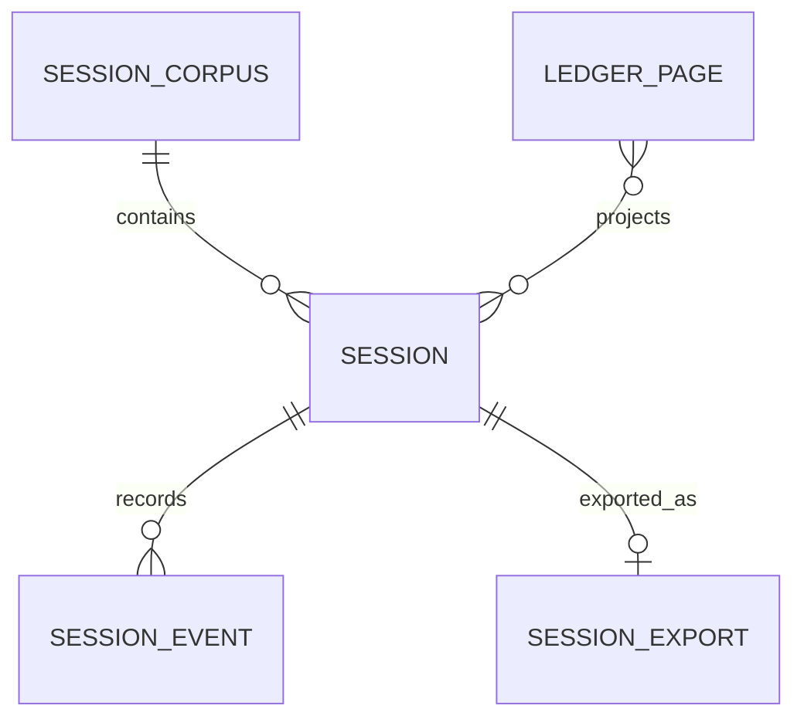
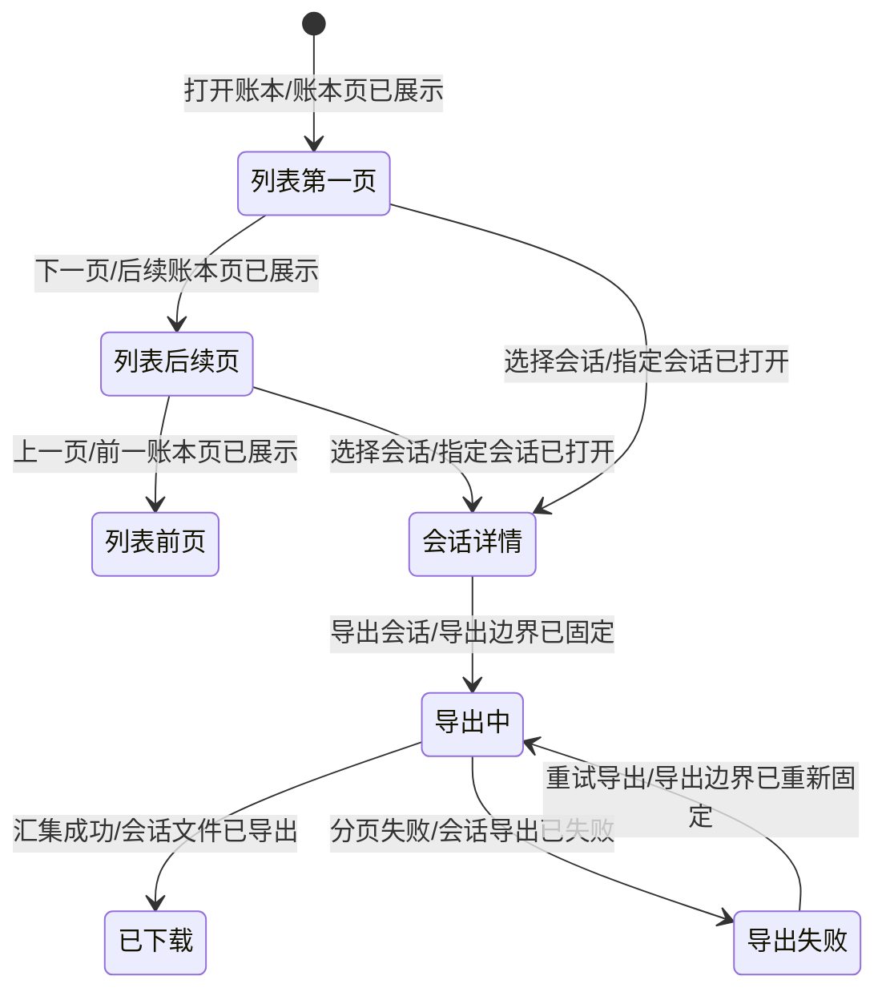
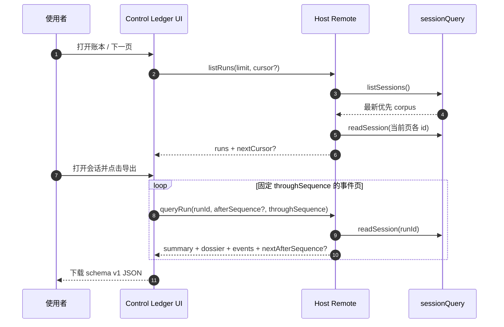
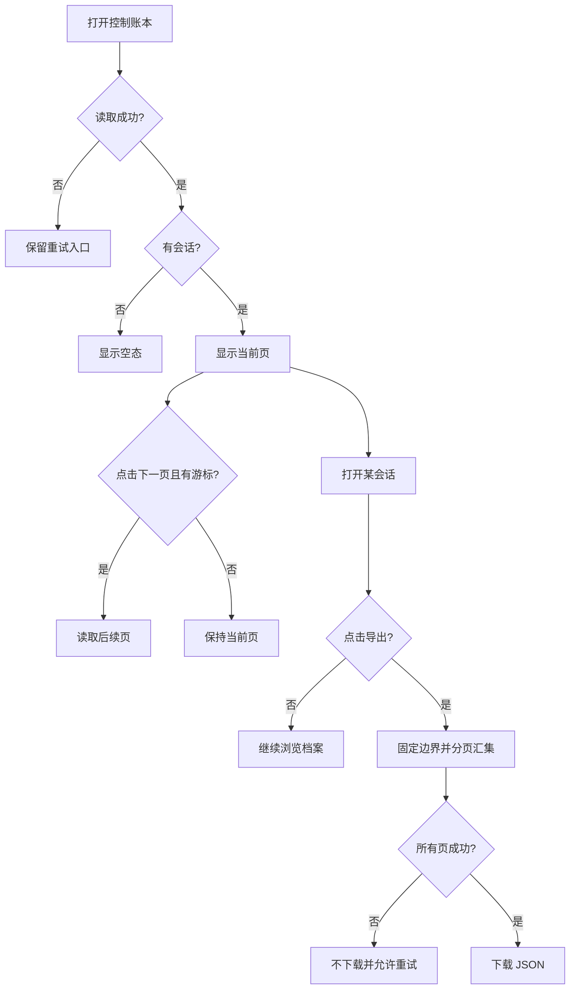
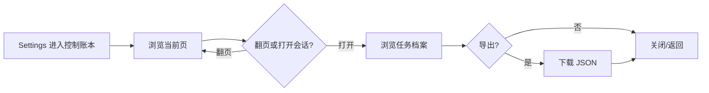

# 需求分析：控制账本分页与会话导出

**创建日期**：2026-08-28  
**存放路径**：`Plans/需求分析/2026-08-28-控制账本分页与会话导出.md`  
**状态**：已采纳  
**lifecycle_state**：requirement  
**真理源**：本文件为后续架构 / 开发 / 测试 / 部署的**唯一需求基准**；架构变动须先回看本文件。

> 基础分析仍遵循 [[Templates/需求分析模板]]；本模板**强制**补充边界、异常、验收标准。
> 方法论：先填战略层(Why)与范围层(What)对齐目标，再展开细节(How)。见 [[需求分析规范]]。
> **分卷**：人类卷三件套在前（≤3 页），`<!-- AI工作底稿 ↓ -->` 之后是 AI 推理底稿，规范见 [[Templates/模板约定]] §分卷规范。

---

# 人类卷（产品/开发 3 分钟读完即可开工）

## A. 用户使用地图

按「角色 → 场景 → 任务」列一张表，不画时序图。

| 角色 | 场景（什么时候） | 任务（要干什么） |
|------|------------------|------------------|
| 控制账本使用者 | 历史会话超过一屏时 | 稳定向前/向后翻页，查看所有会话而不是只看到最新 50 条 |
| 控制账本使用者 | 需要留档、排查或传递单次运行证据时 | 在会话详情页显式导出该 Session 的完整 JSON 快照 |

## B. 关键业务时刻

把核心**业务事件**（过去式）按时间串成一条人话流程线，标人工介入点。

```text
打开控制账本 → 会话语料已列出 → 当前页摘要已投影 → 账本页已展示
选择会话 → 指定会话已打开 → 导出边界已固定 → 会话事件页已汇集 → 会话文件已导出
```

| 时刻（事件） | 谁触发 | 用户看到/得到什么 |
|--------------|--------|-------------------|
| 账本页已展示 | 使用者打开/翻页 | 当前页会话卡片、页码提示、可用的上一页/下一页 |
| 指定会话已打开 | 使用者点击会话 | 七部分任务档案与有界审计事件窗口 |
| 会话文件已导出 | 使用者点击“导出会话” | 一个包含固定快照边界内完整证据的 UTF-8 JSON 文件 |

## C. 关键业务规则（Do / Don't）

只讲「能不能」，不讲实现。

- **Do**：列表默认每页 20 条，以当前页末项作为下一页游标；支持上一页/下一页；详情页显式导出当前会话。
- **Do**：导出固定首次读取时的末尾事件序号，分页汇集后一次性生成 schema v1 JSON。
- **Don't**：不做随机跳页、总页数、多会话批量导出、CSV/PDF、服务端落盘、导入恢复。
- **Don't**：导出任一页失败时不得生成半文件；失效游标不得静默回到第一页。
- **前提 → 后果**：运行中会话继续写入 → 本次导出只包含点击导出时捕获边界内事件，下次导出才能包含新增事件。

## D. 需求问题清单（产品必读 · 不确认无法开工）

> 把底稿 §六逻辑/§七交互/§八遗漏的问题**浓缩成产品视角一句话**，让没读底稿的产品也能直接拍板。三类标签：**🤔 不理解（语义不清）/ ⚔️ 矛盾（自相打架）/ 🕳️ 遗漏（该有没写）**。P0 不闭环禁止进架构/开发。

| # | 类 | 一句话问题 | 要产品拍板的 |
|---|----|-----------|-------------|
| P1-01 | 🕳️ | 是否必须显示总页数并支持随机跳页？ | 本轮采用稳定前后翻页，不计算总页数 |
| P1-02 | 🕳️ | 是否需要 CSV/PDF 或可配置脱敏？ | 本轮只导出与详情权限一致的 UTF-8 JSON |

> P0 已按现有 API 与最小增量原则闭环：分页对象为会话历史列表；导出对象为当前单会话的固定边界快照。

---

<!-- AI工作底稿 ↓ -->

# AI 工作底稿（供 architecture / test 阶段消费，人类有疑问再翻）

## 〇、战略层（Why）

- **痛点**：当前客户端硬编码只读取最新 50 个会话，较旧账本不可达；详情页虽然能分页看事件，却无法一次导出完整会话证据。
- **量化目标**：任意 corpus 规模下所有会话均可经连续翻页到达；导出结果覆盖点击时捕获边界内 100% 事件，失败时半文件数为 0。
- **用户故事**：作为控制账本使用者，我想逐页浏览全部会话并导出一个会话的完整证据，以便审计、排查和离线留档。

---

## 一、PRD 摘要（3–5 句）

在现有只读 Control Ledger 上扩展两项能力：会话历史列表改为 Host 游标分页，客户端提供稳定的前后翻页；会话详情页新增单会话 JSON 导出。导出复用 `queryRun` 的事件分页，但引入固定捕获末尾序号，保证运行中会话的导出是有限且内部一致的快照。插件仍只读取官方 `sessionQuery` corpus，不新增持久化、写操作或安全决策。

---

## 一·五、范围层（What）

| 包含功能 | 优先级 |
|----------|--------|
| 会话列表游标分页 Remote 契约与 Host 投影 | P0 |
| 列表上一页/下一页/页码/加载失败恢复 | P0 |
| `queryRun` 固定 `throughSequence` 事件边界 | P0 |
| 当前会话 schema v1 JSON 导出与浏览器下载 | P0 |
| 中英文文案、类型、Typert 描述与回归测试 | P0 |

**明确不做**：总页数/随机跳页、搜索筛选、批量导出、CSV/PDF、服务端文件生成与保存、导入恢复、额外脱敏/权限系统。

---

## 一·六、事件风暴 + 业务逻辑图（事件驱动，详见 [[需求分析规范]] §三）

> 先抓事件、再理逻辑、后画图。事件链是脊柱：状态机每条迁移必须挂一个事件。

**⓪ 事件风暴表（真相单元，先填这张）**

| 命令（动作） | 聚合 / 不变条件（业务规则） | 业务事件（过去式） |
|--------------|------------------------------|---------------------|
| 请求账本页 | Session corpus；顺序由官方最新优先列表决定，游标必须存在，limit 为 1–100 整数 | 当前页会话已选定 |
| 投影页内会话 | 只读取当前页 Session，单 Session 读取失败使该请求明确失败 | 当前页摘要已投影 |
| 打开会话详情 | runId 非空且 Session 可读 | 指定会话已打开 |
| 请求导出 | 只导出当前 runId；首次响应的 latestSequence 为固定上界 | 导出边界已固定 |
| 拉取导出后续页 | seq 严格递增且 `seq <= throughSequence` | 会话事件页已汇集 |
| 下载导出 | 所有事件页成功且 JSON 可序列化 | 会话文件已导出 |

> 闭环自检：每个事件是否都有命令触发？每个命令是否都有结果事件？悬空项即遗漏。

**① 实体关系（ER 图）**



**② 状态机（核心聚合根生命周期 · 迁移必挂事件）**



**③ 主流程（时序）**



**④ 用户路径决策图**



---

## 二、范围与入口矩阵

| 入口/场景 | PRD 描述 | 触发条件 | 目标页面 |
|-----------|----------|----------|----------|
| Settings → 控制账本 | 默认显示最新一页会话 | 插件已挂载且 Host 可用 | 控制账本列表区 |
| 列表分页区 | 前后翻页并保留当前页失败恢复 | 当前结果存在上一页栈或 `nextCursor` | 同一列表区 |
| 会话卡片 | 新标签页打开指定档案 | 点击有效会话卡片 | `control-ledger-run=<runId>` overlay |
| 档案标题区 | 导出当前会话固定快照 | 详情加载成功并点击导出 | 浏览器 JSON 下载 |

---

## 三、数据字典 / 字段规则

| 字段 | 类型 | 必填 | 长度/范围 | 默认值 | 来源 | 校验/激活 | 疑问 |
|------|------|------|-----------|--------|------|-----------|------|
| `limit` | number | 否 | 整数 1–100 | 20（列表）/100（事件） | 客户端 | Host `boundedInteger` + Typert number | 无 |
| `cursor` | string / SessionId | 否 | 必须对应当前 corpus 中的会话 | 无（第一页） | 上一页响应 | Host 查找锚点，不存在时报错 | 不公开内部结构 |
| `runs` | `ControlLedgerRunSummary[]` | 是 | 0–limit | `[]` | Host 当前页投影 | 保持最新优先顺序 | 无 |
| `nextCursor` | string / SessionId | 否 | 当前页最后一条 id | 无 | Host | 仅仍有后续项时返回 | 无 |
| `throughSequence` | number | 否 | -1–MAX_SAFE_INTEGER 整数 | 当前快照末序号 | 首次 query summary | 后续页过滤 `seq <=` | 空会话用 -1 |
| `schemaVersion` | 1 | 是 | 固定常量 | 1 | 客户端导出器 | JSON 根对象校验 | 无 |
| `exportedAt` | ISO 8601 string | 是 | 合法 UTC 时间 | 点击完成时 | 客户端时钟 | `new Date().toISOString()` | 无 |
| `events` | `ControlLedgerEvent[]` | 是 | 0..throughSequence | `[]` | 分页汇集 | seq 严格升序且不越界 | 无 |

---

## 四、边界情况清单（必填）

| # | 边界场景 | 期望行为 | PRD 是否写明 | 严重度 |
|---|----------|----------|--------------|--------|
| B1 | 空数据 / 首次使用 | 空列表无下一页；空会话可导出合法空事件数组 | ☑ | P0 |
| B2 | 数据量极大 / 分页 | 每次只投影当前页；导出按 100 条事件分页汇集 | ☑ | P0 |
| B3 | 并发 / 重复提交 | 新会话不扰动游标后续页；导出按钮忙碌时禁用 | ☑ | P0 |
| B4 | 权限不足 / 未登录 | 继承现有 `/api` RPC 与详情权限，不新增旁路 | ☑ | P0 |
| B5 | 网络超时 / 弱网 | 保留当前列表；导出失败不下载半文件并可重试 | ☑ | P0 |
| B6 | 依赖服务不可用 | 明确错误态，列表/导出均不伪造成功 | ☑ | P0 |
| B7 | 游标目标已消失 | Host 明确拒绝 cursor，UI 保留当前页 | ☑ | P0 |
| B8 | 导出期间 Session 增长 | 固定首次捕获末尾序号，不包含之后事件 | ☑ | P0 |

---

## 五、异常流程矩阵（必填）

| 触发条件 | 用户可见反馈 | 系统行为 | 是否可恢复 | PRD 是否写明 |
|----------|--------------|----------|------------|--------------|
| limit / cursor 校验失败 | 分页区显示读取失败 | 不更新当前页，不读取无关 Session | 是 | ☑ |
| `/api` RPC 失败 | 显示读取或导出失败 | 保留当前页面，不生成下载 | 是 | ☑ |
| sessionQuery 不可用 | 初始错误态或导出失败 | 失败关闭，不回退其他数据源 | 是 | ☑ |
| Session 在读取前消失 | 显示读取/导出失败 | 不生成不完整结果 | 是 | ☑ |
| 用户关闭页面 | 无额外反馈 | 浏览器中止后续链路，不落服务端状态 | 否 | ☑ |

---

## 五·五、集成与人机协同边界

**外部交互点 + 异步/补偿**（事件链上的跨系统边界）

| 集成点 / 异步任务 | 类型 | 触发事件 | 失败/补偿策略 |
|-------------------|------|----------|---------------|
| `ctx.sessionQuery` | 同步 API | 会话语料已列出 / 指定会话已读取 | 原样失败关闭，UI 提供重试 |
| Typert `/api` Remote | 异步 RPC | 当前页已请求 / 会话事件页已请求 | 保留当前显示，不提交部分结果 |
| Browser Blob 下载 | 本地浏览器 API | 会话事件页已汇集 | 创建失败时显示错误并释放临时 URL |

**人机协同边界**（每个关键动作标注自动化程度）

| 动作 / 事件 | 全自动 | AI建议+人工确认 | 纯人工 |
|-------------|:------:|:---------------:|:------:|
| 列出并投影当前页 | ☑ | ☐ | ☐ |
| 选择要导出的会话 | ☐ | ☐ | ☑ |
| 汇集事件与生成下载 | ☑ | ☐ | ☐ |

---

## 六、逻辑问题

| # | 类型 | 问题 | PRD 摘录 | 严重度 |
|---|------|------|----------|--------|
| L1 | 语义不清 | “分页”未指明列表还是事件；现有事件已分页 | 用户：“控制账本要支持分页” | P0，已闭环为会话列表 |
| L2 | 快照一致性 | 运行中会话持续追加时，逐页导出若无固定上界会漂移 | 用户未说明 | P0，已闭环为 throughSequence |
| L3 | 导出格式 | 未给格式与最小字段 | 用户：“支持导出某个会话” | P0，已闭环为 schema v1 JSON |

---

## 七、交互冲突

| # | 场景 A | 场景 B | 问题 | 建议问产品 |
|---|--------|--------|------|------------|
| I1 | 初次加载失败可全区重试 | 后续翻页失败 | 翻页失败不应清空用户刚才看到的页 | 采用“保留当前页 + 分页区错误/重试” |
| I2 | 覆盖度徽标位于详情标题右侧 | 新增导出动作 | 小屏可能挤压标题 | 导出按钮与徽标允许换行，保持键盘焦点可见 |

---

## 八、整体需求遗漏

### 用户旅程闭环



| 环节 | PRD 是否写明 | 若未写，缺什么 |
|------|--------------|----------------|
| 进入/退出 | ☑ | Settings 进入，新标签页可关闭返回 |
| 创建/编辑/删除 | ☑ | 本插件只读，明确不涉及 |
| 列表刷新 | ☑ | 初次加载和失败重试；翻页保留当前页 |
| 分页首尾 | ☑ | 首页面无上一页、末页无下一页 |
| 导出成功/失败 | ☑ | 成功下载、失败不落半文件并可重试 |

---

## 九、验收标准（必填，可测）

用 **Given-When-Then** 写关键场景，每条可测、无歧义，**Then 锚定一个业务事件已发生**，并补**反例**。

| # | 验收项 | 锚定事件 | Given（前置） | When（操作/命令） | Then（期望，含事件已发生） | 优先级 |
|---|--------|----------|---------------|-------------------|---------------------------|--------|
| AC1 | 默认列表页 | 当前页摘要已投影 | 45 个会话，无游标 | 请求默认页 | 返回最新 20 条和 nextCursor，且“当前页摘要已投影”事件已发生 | P0 |
| AC2 | 稳定下一页 | 后续账本页已展示 | 第一页后新增一个会话 | 用第一页游标翻页 | 无重复/跳过旧项，且“后续账本页已展示”事件已发生 | P0 |
| AC3 | 末页 | 账本页已展示 | 仅余不足一页 | 请求末页 | 无 nextCursor，且“账本页已展示”事件已发生 | P0 |
| AC4 | 固定导出边界 | 导出边界已固定 | 首次捕获 latestSequence=249 | 点击导出 | 所有分页请求上界为 249，且“导出边界已固定”事件已发生 | P0 |
| AC5 | 完整导出 | 会话文件已导出 | 250 条可读事件 | 完成汇集 | 下载 schema v1 JSON 且含 250 条有序事件，且“会话文件已导出”事件已发生 | P0 |
| AC6-反 | 失效游标 | — | cursor 不在 corpus | 请求下一页 | 不应发生“账本页已展示”，保留旧页并报错 | P0 |
| AC7-反 | 半文件 | — | 第二个事件页失败 | 导出 | 不应发生“会话文件已导出”，不生成下载 | P0 |
| AC8-反 | 重复导出 | — | 首次导出进行中 | 再次点击 | 不应发生第二次“导出边界已固定” | P0 |

**非功能验收**：性能——Host 只读取/投影当前列表页；兼容性——旧 `queryRun` 未传 `throughSequence` 时语义不变；安全——仅显式本地下载且不绕过现有 RPC 权限。

---

## 十、待产品确认

**P0** · 无，均已按最小增量和现有代码证据闭环。  
**P1** · 是否显示总页数/随机跳页；是否增加 CSV/PDF/脱敏配置，均排除在本轮。  
**遗漏（P0）** · 无。

---

## 十一、分析结论

| 项 | 结论 |
|----|------|
| 可否进入需求排序 | ✅ 可以；P0=0，事件链、四图、边界、异常与 AC 已闭环 |
| 关联 Epic | `Plans/Epic/2026-08-28-控制账本分页与会话导出.md` |

---

## 续做

```
/resume plan=Plans/需求分析/2026-08-28-控制账本分页与会话导出.md 进度=已采纳
```

**下一阶段 Skill**：`/backlog-prioritization-assistant`，引用本 plan。

## 十二、事件风暴

### 12.1 参与角色

| 角色 | 关注点 | 是否确认 |
|------|--------|----------|
| 控制账本使用者 | 能逐页浏览大量会话，并把某一会话的完整证据带走 | ☑ 由用户原始需求确认 |
| 插件开发者 | API 向后兼容、只投影当前页、导出快照可复现 | ☑ 由现有代码约束确认 |
| 测试者 | 页边界、翻页期间新增会话、空会话、导出完整性和失败恢复 | ☑ 已纳入后续实例化需求 |

### 12.2 领域事件墙

| # | 事件（过去式） | 触发命令 | 聚合/对象 | 上游 | 下游 |
|---|----------------|----------|-----------|------|------|
| E1 | 会话语料已列出 | 打开或刷新控制账本 | Session corpus | 官方 `sessionQuery` | E2 |
| E2 | 指定页的会话已选定 | 请求第一页或携带游标请求下一页 | 会话列表页 | E1 | E3 |
| E3 | 当前页的账本摘要已投影 | 投影页内 Session | `ControlLedgerRunSummary` | E2 | E4 |
| E4 | 账本页已展示 | 渲染摘要页和前后页控制 | 控制账本列表 UI | E3 | E2 / E5 |
| E5 | 指定会话已打开 | 点击一条会话 | Session | E4 | E6 |
| E6 | 会话导出已请求 | 点击“导出会话” | 会话导出任务 | E5 | E7 |
| E7 | 导出边界已固定 | 读取首次查询捕获到的末尾序号 | Session 快照边界 | E6 | E8 |
| E8 | 会话事件页已汇集 | 按序拉取且不越过固定末尾序号 | 导出数据集 | E7 | E9 |
| E9 | 会话文件已导出 | 生成并下载 JSON 文件 | `ControlLedgerSessionExport` | E8 | 完成 |

### 12.3 热点与分歧

| # | 热点 | 类型 | 级别 | 处理状态 |
|---|------|------|------|----------|
| H1 | “账本分页”指历史会话列表；档案内事件流已有 `afterSequence` 分页，不重复造另一套事件分页 | 不理解 | P0 | 按现有代码证据收敛 |
| H2 | 会话列表使用不透明游标而非页码偏移，避免浏览期间新增会话导致下一页重复/跳项 | 遗漏 | P0 | 采用“上一页游标栈 + 下一页游标” |
| H3 | 默认每页 20 条，Host 允许 1–100；无下一游标即末页 | 遗漏 | P1 | 采用默认值，可由 API 调整 |
| H4 | 导出格式未指定 | 不理解 | P0 | 采用 UTF-8 JSON，包含 schemaVersion、exportedAt、summary、dossier、完整事件 |
| H5 | 运行中的会话在导出时仍可能追加事件 | 矛盾 | P0 | 首次读取固定 `capturedThroughSequence`，后续页只导出该边界内事件 |
| H6 | 导出包含系统提示词、工具参数等敏感运行证据 | 遗漏 | P0 | 仅由详情页显式点击触发、本地下载、不上传；内容与当前详情权限一致，不额外脱敏 |
| H7 | 大会话不能要求一次 Remote 返回全部事件 | 遗漏 | P0 | 客户端按现有事件分页协议汇集，按钮显示忙碌并阻止重复导出 |

### 12.4 角色-系统交互

| 角色 | 命令 | 系统行为 | 结果事件 | 异常 |
|------|------|----------|----------|------|
| 使用者 | 打开控制账本 | 读取第一页并仅投影页内会话 | 账本页已展示 | 读取失败时保留重试入口 |
| 使用者 | 点击下一页 | 以当前页末尾会话游标请求后续记录 | 后续账本页已展示 | 游标失效时提示失败，不静默回第一页 |
| 使用者 | 点击上一页 | 使用本地游标栈返回上一页 | 前一账本页已展示 | 请求失败时保持当前页可恢复 |
| 使用者 | 点击会话 | 在新标签页加载档案与首批事件 | 指定会话已打开 | 会话不存在/读取失败时显示错误 |
| 使用者 | 点击导出会话 | 固定首次读取边界、分页汇集事件并下载 JSON | 会话文件已导出 | 任一页失败则不下载半文件，并允许重试 |

### 12.5 输出到实例化需求

- 必须覆盖的主链路事件：E1 → E2 → E3 → E4；E5 → E6 → E7 → E8 → E9。
- 必须写成 Given-When-Then 的边界：空语料、恰好一页、超过一页、翻页时新增会话、非法/失效游标、空会话导出、运行中会话导出、大会话多页汇集、任一页失败、重复点击导出。
- 暂不纳入范围：CSV/PDF、多会话批量导出、服务端落盘、导入恢复、事件内容脱敏策略配置。

## 反馈（skill_run）

```yaml
skill_run:
  skill: event-storming-assistant
  plan: Plans/需求分析/2026-08-28-控制账本分页与会话导出.md
  date: 2026-08-28
  contexts_used:
    - path: Contexts/决策/AI-Work-Kit工作流总览.md
      utility: high
      reason: "按 client-dev requirement 阶段先完成事件墙，再进入实例化需求"
  contexts_missing: []
  contexts_stale: []
  outcome_status: pass
  revisit_needed: false
```

## 十三、实例化需求

### 13.1 核心规则

| # | 规则 | 适用角色 | 反例 |
|---|------|----------|------|
| R1 | 会话列表按官方 corpus 的确定性最新优先顺序分页，第一页不携带游标 | 使用者 / Host | 用客户端数组先截 50 条再分页，导致旧会话永远不可达 |
| R2 | 每次 Host 只读取并投影当前页会话，默认 20 条，允许 1–100 条 | Host | 为显示 20 条而读取全部 Session 的完整事件日志 |
| R3 | 下一页游标锚定当前页最后一条会话；浏览期间前方新增会话不应造成后续页重复 | 使用者 / Host | 使用 offset=20，新增一条会话后第二页重复原第 20 条 |
| R4 | 游标在当前 corpus 中不存在时明确失败，不得静默回到第一页 | Host | 失效游标返回第一页，让使用者误以为仍在翻页 |
| R5 | 列表 UI 提供上一页、下一页、当前页提示，并在首尾页禁用不可用动作 | 使用者 | 末页仍可点击下一页后得到空白页 |
| R6 | 导出只针对当前详情页的一个 Session，并由使用者显式点击触发 | 使用者 | 进入详情页自动下载或批量导出其他会话 |
| R7 | 导出为 UTF-8 JSON，包含版本、导出时间、runId、summary、dossier 与完整有序事件 | 使用者 / 测试者 | 只导出当前已展开的前 100 条事件 |
| R8 | 首次查询固定捕获末尾序号，导出后续分页不得越过该边界 | Host / 客户端 | 运行中追加事件导致导出永远追赶或前后统计不一致 |
| R9 | 汇集任一页失败时不生成半成品文件，并恢复可重试状态 | 使用者 | 下载一个缺失尾部事件但没有任何不完整标记的文件 |
| R10 | 导出期间按钮禁用，防止重复并发导出同一会话 | 使用者 | 连续点击生成多个重复下载和重复 Remote 流量 |

### 13.2 Given-When-Then 场景

| ID | Given | When | Then | 类型 |
|----|-------|------|------|------|
| GWT-001 | corpus 有 45 个会话且未提供游标 | 请求默认列表页 | 返回最新 20 个摘要、`nextCursor` 指向第 20 个会话，且“当前页已投影”事件已发生 | 主链路 |
| GWT-002 | 第一页返回了 `nextCursor` | 使用该游标请求下一页 | 返回随后 20 个且不与第一页重复，新的 `nextCursor` 指向第 40 个会话 | 主链路 |
| GWT-003 | 第二页之后仅余 5 个会话 | 请求第三页 | 返回 5 个摘要且不返回 `nextCursor` | 边界 |
| GWT-004 | corpus 为空 | 请求第一页 | 返回空 `runs` 且无 `nextCursor`，UI 显示空态 | 边界 |
| GWT-005 | corpus 恰好 20 个会话 | 请求默认第一页 | 返回 20 个且无 `nextCursor`，下一页按钮不可用 | 边界 |
| GWT-006 | 使用者已看完第一页，随后 corpus 顶部新增一个会话 | 使用第一页的末项游标请求下一页 | 下一页从该锚点之后开始，既不重复第一页旧项，也不混入新增项 | 并发边界 |
| GWT-007 | 请求的游标不在当前 corpus 中 | 请求下一页 | Host 以明确的 `cursor` 校验错误拒绝，UI 保留当前页并显示可重试错误 | 异常 |
| GWT-008 | `limit` 为 0、101、小数或非有限数 | 请求列表页 | Host 拒绝请求且不读取任何 Session 详情 | 反例 |
| GWT-009 | 使用者位于第一页 | 点击上一页 | 不发起 Remote 请求，页面内容保持不变 | 反例 |
| GWT-010 | 使用者位于末页 | 点击下一页 | 不发起 Remote 请求，页面内容保持不变 | 反例 |
| GWT-011 | 详情页首次查询捕获到序号 249，事件每页 100 条 | 点击导出 | 客户端依次得到 0–99、100–199、200–249，并下载包含 250 条有序事件的 JSON | 主链路 |
| GWT-012 | 会话在首次查询后又追加了序号 250–259 | 导出继续拉取后续页 | 所有请求均携带固定边界 249，导出不包含 250–259，且“导出边界已固定”事件已发生 | 并发边界 |
| GWT-013 | 会话无事件、summary 的 `latestSequence` 为 null | 点击导出 | 下载合法 JSON，`events` 为空数组，summary 与 dossier 仍存在 | 边界 |
| GWT-014 | 导出第二页 Remote 失败 | 客户端汇集事件 | 不调用浏览器下载，显示导出失败并恢复按钮供重试 | 异常 |
| GWT-015 | 导出正在进行 | 再次点击导出按钮 | 按钮保持禁用且不启动第二条导出链路 | 反例 |
| GWT-016 | 导出完成 | 读取下载文件名与内容 | 文件名含安全化标题和 runId，JSON 含 `schemaVersion: 1`、ISO `exportedAt`、runId、summary、dossier、完整事件 | 验收 |

### 13.3 线框 / 交互草图位

| 页面/区域 | 状态 | 草图/说明 |
|-----------|------|-----------|
| Settings / 控制账本列表底部 | 默认 | `[上一页（禁用）]  第 1 页  [下一页]`，列表卡片保持现有布局 |
| Settings / 控制账本列表底部 | 加载下一页 | 保留当前页，分页按钮禁用；完成后原位替换列表，避免页面闪空 |
| Settings / 控制账本列表底部 | 翻页失败 | 保留当前页并在分页区显示失败与重试，不回到全屏初始错误态 |
| 会话档案页标题区 | 默认 | 标题右侧增加“导出会话”按钮，不挤占 `7 / 7` 覆盖度信息 |
| 会话档案页标题区 | 导出中 | 按钮文案“正在导出…”，禁用重复点击 |
| 会话档案页标题区 | 导出失败 | 按钮恢复，旁边显示短错误提示；不生成文件 |

### 13.4 可测验收标准

| AC | 来源场景 | 验收描述 | 测试映射 |
|----|----------|----------|----------|
| AC1 | GWT-001–003 | 列表 Remote 返回 `{ runs, nextCursor? }`，默认 20、上限 100，并按锚点游标覆盖全部会话 | UT / IT |
| AC2 | GWT-004–005 | 空 corpus 与恰好一页均无伪下一页 | UT / UI |
| AC3 | GWT-006–007 | 新增会话不扰动已开始的向后浏览；失效游标明确失败 | IT |
| AC4 | GWT-008 | 所有非法 `limit` 在读取详情前失败 | UT / IT |
| AC5 | GWT-009–010 | 首尾页分页控件正确禁用且不产生无效 Remote 调用 | UI |
| AC6 | GWT-011–013 | 单会话导出固定首次捕获边界，能汇集多页或空事件并输出 schema v1 JSON | UT / UI |
| AC7 | GWT-014–015 | 导出失败不落半文件，导出期间不能重复启动 | UI |
| AC8 | GWT-016 | 下载名安全、数据包含 summary/dossier/完整事件且通过 JSON 解析 | UT / UI |
| AC9 | 全部 | 现有 `queryRun` 事件“加载更多”行为与旧调用者继续可用 | 回归 |
| AC10 | 全部 | `npm test`、`npm run typecheck`、`npm run build` 全部通过并更新 `lib/` | 集成 |

### 13.5 待确认问题

| 优先级 | 问题 | 建议决策 | 负责人 |
|--------|------|----------|--------|
| P0 | 分页对象是否就是会话历史列表，而非已具备分页的详情事件？ | 是；以当前代码和用户措辞作最小增量解释 | 已按工程证据代确认 |
| P0 | 导出格式与边界未指定 | schema v1 UTF-8 JSON；单会话；固定首次捕获末尾序号 | 已按可复现性代确认 |
| P1 | 是否需要总页数/随机跳页？ | 本轮不做；游标仅支持稳定前后翻页 | 后续需求再扩展 |
| P1 | 是否需要 CSV/PDF 或脱敏配置？ | 本轮不做；内容权限与详情页一致 | 后续需求再扩展 |

## 反馈（skill_run）

```yaml
skill_run:
  skill: spec-by-example-assistant
  plan: Plans/需求分析/2026-08-28-控制账本分页与会话导出.md
  date: 2026-08-28
  contexts_used:
    - path: Contexts/需求分析/需求分析规范.md
      utility: high
      reason: "把事件链、游标边界、导出快照与反例落成 16 组可测试场景"
  contexts_missing: []
  contexts_stale: []
  outcome_status: pass
  revisit_needed: false
```

## 反馈（skill_run）

```yaml
skill_run:
  skill: requirement-analyst
  plan: Plans/需求分析/2026-08-28-控制账本分页与会话导出.md
  date: 2026-08-28
  contexts_used:
    - path: Contexts/需求分析/需求分析规范.md
      utility: high
      reason: "按 Why/What/How、事件链、四图、边界异常与 AC 完成需求评审并闭环 P0"
    - path: Contexts/需求分析/需求分析产出标准.md
      utility: high
      reason: "对照 requirement 阶段门禁补齐已采纳状态、p0_open 与可测验收字段"
  contexts_missing: []
  contexts_stale: []
  outcome_status: pass
  revisit_needed: false
```
