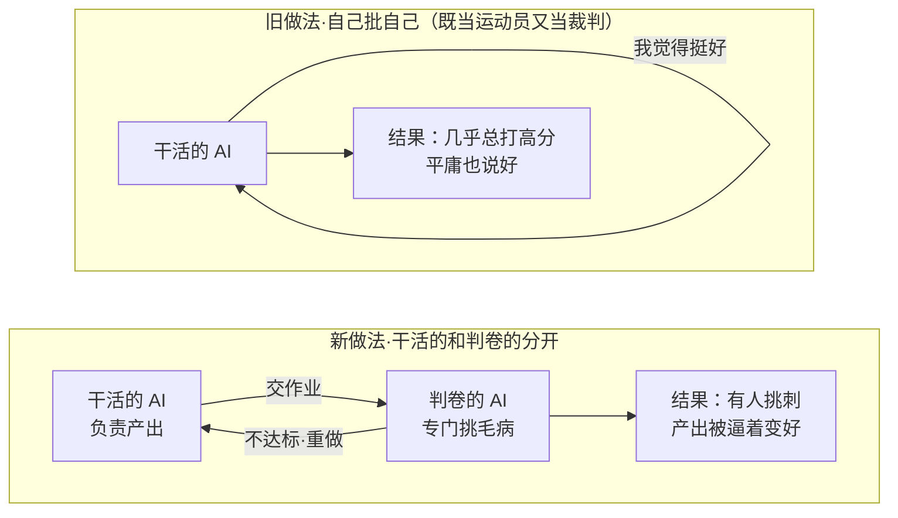

# 海外资讯周报助手 Skill

知识库：`/Users/wanglongxiang/git/AI-Work-Kit`
原则：[[Contexts/决策/Kit核心原则]]（Plans 临时 · Contexts 固定 · 做完删 plan）

## 触发条件

- 「**找 CC/Codex 文章**」「**周报选题**」「**海外资讯**」「**整理分享帖**」「**Claude Code 分享**」
- `/intel` / `/weekly-intel-digest`

**不响应（让位）**：项目日报/迭代复盘 → `report-assistant`；课程化 LLM 学习 → `learn-assistant`；PM 通用物料 → `material-prep-assistant`。

## 必读资产（长期资产在 Contexts/情报源/）

- [[Contexts/情报源/follow名单]] —— 种子源/源健康参考，不是唯一来源
- [[Contexts/情报源/筛选评分标准]] —— 怎么挑
- [[Contexts/情报源/周帖模板]] —— 怎么排版
- [[Contexts/情报源/已发去重清单]] —— 别重复

## 能力边界（先说清楚我能/不能）

| 环节 | Agent 能做 | 人工节点 |
|------|-----------|----------|
| 候选发现 | ✅ 以 follow 名单为种子，同时主动搜索官方文档、engineering blog、研究/概念文章、社区一手长文；优先覆盖 agent 开发、app 开发新范式、AI 原生开发工具链、端到端产品构建方式 | 你可指定本期主题或补充私域来源 |
| 抓取·官方文档站 | ✅ 有 **DocShark MCP** 时优先爬取+索引结构化文档站；没有该工具时用可用 Web 搜索/浏览能力降级核验 | ⏸ 降级后仍取不到全文时，你贴原文链接/正文 |
| 抓取·X/零散博客 | ⚠️ DocShark 不擅长单帖；优先用可用 Web 搜索/浏览能力核验 | ⏸ 抓不到时你贴原文链接/正文 |
| 筛选 | ✅ 按评分标准打分去重 | 你终审选 1 篇（每期只深挖 1 篇） |
| 中文导语 | ✅ 写技术看点/通用看点/导语 | — |
| **炫酷网页** | ✅ **Agent 直接产自渲染 `.html` 成品**（遵 [[Contexts/规范/炫酷建站规范]]，内嵌 mermaid.js + 浏览器自检）| 你把 `.html` 交纳米Work，它**只上传 CDN + 返回短链**，不改内容 |
| 发帖 | ⚠️ 平台已定「先攒不自动发」 | 你贴到频道 |

## 抓取工具：DocShark MCP（可用时优先）

DocShark 是可选增强能力，不是本 Skill 的硬依赖。当前会话能看到 `manage_library`、`search_docs`、`list_libraries`、`get_doc_page` 这类工具时，官方文档站按「先建库、再搜索」使用；看不到这些工具时，直接降级为可用的 Web 搜索/浏览能力，或请用户贴原文链接/正文，不阻塞整条周报流程。

DocShark 工具（若可用）：

| 工具 | 用途 |
|------|------|
| `manage_library` | 给文档站根 URL → 爬取并建 FTS5 索引（首次较慢，之后可复用） |
| `search_docs` | 在已建库里全文搜索（BM25 排序），拿候选 |
| `list_libraries` | 看已索引哪些站，避免重复建库 |
| `get_doc_page` | 取某页完整 Markdown 正文（喂评分/写导语用） |

**适配**：DocShark 强于**结构化文档站**（官方 engineering / docs），弱于 X 推文与零散个人博客单帖。故官方源有 DocShark 就优先用；无 DocShark 或单帖抓不到时，降级 Web 搜索/浏览，仍抓不到则 ⏸ 人工贴链接。**它不产出中文/纳米Work链接**——传播链接仍是人工节点，硬规则不变。

## 执行协议（每期九步 · 双卷分离）

```
1. 开场读资产 → follow名单（种子源/源健康参考）+ 评分标准 + 去重清单
2. 候选发现 → 不局限 follow；围绕智能体/AI 编程方向主动搜索，优先找 agent 开发、app 开发新范式、AI 原生 IDE/框架/工具链、端到端产品构建方式、多人/多 agent 协作模式等主题；优先选有机制、有方法、有可复用启发的英文一手内容
3. 抓取     → 官方文档源有 DocShark 时用 list_libraries/manage_library/search_docs/get_doc_page；无 DocShark 时降级 Web 搜索/浏览；X/零散博客抓不到 → ⏸ 交你贴链接/正文
4. 硬门槛过滤 → 非英文一手 / 纯视频 / 近8周已发 → 淘汰
5. 筛选打分 → 按评分标准算分，输出候选表（分数+理由）交你终审，**每期只选 1 篇最高分**深挖
6. 去重确认 → 与已发去重清单比对，避免重复选题
7. 组装人类卷 → 按「人类卷写作规范」写**纯净正文** `.md`（从标题开始，无提示词/注释/元说明），过「信息完整性自查清单」（正文不含 YAML）
8. 生成炫酷网页 → **Agent 直接产自渲染 `.html` 成品**（遵 [[Contexts/规范/炫酷建站规范]]：内嵌 mermaid.js 自渲染 + 渐进增强 + 炫酷标准），并**用本地浏览器过自检清单**（图渲染成 SVG / console 无报错 / 正文全可见 / 移动端不溢出）
9. 生成 AI 卷 → 同名 .meta.yaml：skill_run 块，把「读这篇暴露 Kit 缺什么」写进 contexts_missing + 源健康自检
10. 收尾     → 三个文件存 Plans/情报周报/：`.md`（正文）+ `.html`（Agent 产的炫酷网页，已过自检）+ `.meta.yaml`（AI卷）；**交你把 `.html` 给纳米Work → 它只做「上传 CDN + 返回短链」，不再生成网页**；发布后追加去重清单一行、删 plan
```

**双卷分离**（与 `best-practice-digest` 同源机制）：人类卷(.md)是**技术博客水准的署名文章**给同事读，无 YAML 噪音；AI 卷(.meta.yaml)给脚本读——`feedback-aggregate.py` 优先扫 `Plans/**/*.meta.yaml`。两卷同源，一次萃取。**网页由 Agent 直接产 `.html`**（遵 [[Contexts/规范/炫酷建站规范]]），纳米Work 降级为纯托管。

## 选题侧重（筛选加分项）

候选文章不只看“是不是新”，更看是否揭示开发范式变化。以下主题优先加分，但不作为硬排除：

- **Agent 开发**：agent runtime、tool use、memory、planning/evaluation、multi-agent 协作、human-in-the-loop、agent observability、权限与安全边界。
- **App 开发新范式**：AI 原生 IDE、自然语言到应用、设计到代码、规格驱动开发、agentic coding workflow、应用生成后的维护/测试/部署方式。
- **产品构建方式变化**：从“写代码”转向“定义目标、约束、验收与反馈回路”的实践；团队角色、交付节奏、质量门禁如何变化。
- **可迁移工程方法**：能落到本 Kit 的 Skill、workflow、模板、评审清单或自动化脚本，而不是只展示某个产品发布。

## 人类卷写作规范（技术博客水准 · 每期深挖 1 篇）

发出去的是**署名技术文章**，不是资讯罗列帖。**每期只写 1 篇**——把这一篇讲透，而不是三篇都浅尝。

**深度标准（"透彻"的可操作定义，四段都要达到）**：
- **讲机制，不止讲结论**：原文的方法/架构怎么运作、为什么这么设计、解决了什么旧方案的痛点——拆到"读完能自己复述给别人"的程度。
- **有前因后果**：这个做法的背景动机是什么、作者试过什么失败了才走到这一步、边界与代价在哪。
- **有对照**：和我们现在的做法逐点对比——哪里相同、哪里更优、我们缺的是什么。
- **可落地**：复用建议要具体到某个 Skill/流程/文件的改动，不是"值得借鉴"这类空话。

**行文结构**（四段递进，每段用 `####` 子标题分隔，不要用加粗代替标题——加粗当分段视觉太弱、读起来糊成一片）：
1. **#### 主题** —— 这篇讲的核心问题是什么、作者的背景动机（一句话点题不够，要交代为什么值得写这一篇）。
2. **#### 想法** —— 深挖主体：拆解原文的方法/机制细节 + 作者的推理链 + 你的判断。这一段是全篇重心，最长，必要处配图。
3. **#### 结论** —— 最该记住的 takeaway，以及适用边界（什么情况下成立、什么情况下不）。
4. **#### 复用** —— 对我们工作流/开发实践的具体改动建议（落到 Skill/流程/文件）。

**铁律**：
- **正文纯净，网页是 Agent 另产的 `.html`**：人类卷 `.md` 是**纯净正文**（从文章标题开始，不含任何提示词/注释/元说明）；网页由 Agent 依 [[Contexts/规范/炫酷建站规范]] 直接产同名 `.html` 成品（不再写 `.prompt.md` 生成指令）。正文里**不写对文章本身的要求/元说明**（如「面向技术同学…」「本文图示用大白话」）——那是给写作者的规范，不是给读者的内容。
- 说明性小标题（如「为什么 harness 会过期」），不用装饰性标题。
- 专业、中性笔调；**禁装饰图标/emoji**，**禁娱乐化比喻、段子、网络梗**。
- 正文保持技术博客的专业表达；网页视觉由 Agent 在 `.html` 里实现（遵炫酷建站规范），做成有科技感和产品感的专题页，而不是普通 Markdown 皮肤。
- **图示优先，面向非技术受众**（硬要求，不是可选）：受众含产品/设计/运营，纯文本理解成本高。凡涉及**架构、流程、角色协作、前后对比、概念关系**，一律先用图表达再用文字补充——**每篇至少 2 张图**。首选 Mermaid（`flowchart`/`sequenceDiagram`/对比用并排 `flowchart`），次选 Markdown 表格。图中标签用大白话，不堆术语；一个非技术同事只看图+小标题应能懂大意。
- 双视角（技术看点/通用看点）**融入行文本身**，不贴标签、不在正文里声明"这是给谁看的"。
- 不含任何 YAML/机器块。

#### 每期产两个文件：纯净正文 + 炫酷网页成品

| 文件 | 内容 |
|------|------|
| `YYYY-MM-DD-第N期.md` | **纯净正文**，从文章标题开始，无提示词/注释/元说明 |
| `YYYY-MM-DD-第N期.html` | **Agent 直接产的炫酷自渲染网页成品**，遵 [[Contexts/规范/炫酷建站规范]]，过浏览器自检 |

**网页由 Agent 产 `.html`，纳米Work 只托管**：完整建站标准、技术基线（内嵌 mermaid.js 自渲染、渐进增强、变量避坑）、浏览器自检清单、交接话术，全部见 [[Contexts/规范/炫酷建站规范]]。要点复述：

- 第一屏就不能像「白底 Markdown」——大标题 + 摘要 + 来源/日期/标签 + 与主题相关的代码生成视觉主画面；深色 AI 开发者工具风。
- **Mermaid 页面内自渲染成图形**（内嵌 `mermaid@11`，`securityLevel:'loose'`），节点标签里的 `<br/>` 转义成 `&lt;br/&gt;`。
- 滚动渐显等动效**渐进增强**：默认可见、JS 正常才隐藏渐显 + setTimeout 兜底，正文可读性不赌 JS。
- **关键数字主角化**：量化结论（如 `p50↓~60%`）用特大字（`clamp(34px..)`）独占卡、成组、count-up 入场，别挤角落；核心论点也数字化/公式化成锚点卡。
- **动态适配硬指标**：卡片容器用 `auto-fit minmax` 流式栅格随视口 3→2→1 列自动重排，排版全程 `clamp()`，不靠单一断点硬切。
- 产完**用本地浏览器过自检**：图全 `hasSVG`、console 0 error、section 全可见、**375/768/1440 三宽度无横溢出**；清理自检残留。
- 交接纳米Work 的话术只要一句：「把这个 `.html` 传 CDN、返回短链，不改内容」。

#### 图示范式（照这个模板画，让非技术人也懂）

用途分三类，覆盖大多数技术文章：

| 想表达什么 | 用哪种图 | 关键 |
|-----------|---------|------|
| 一个新做法为什么比旧做法好 | 并排 `flowchart TB` + `subgraph` 装「旧做法/新做法」 | 每个子图末尾画出「结果」节点，让对比落到后果 |
| 多角色/多步骤怎么协作 | `flowchart LR` 画角色，箭头标动作 | 箭头标签写动作大白话（如「交作业」「打回重做」） |
| 两个概念的差异 | 并排 `subgraph` 各画一条流程线，用 `~~~` 隔开 | 两条线步骤数对齐，肉眼可逐格对比 |

**大白话铁律**：节点/子图标签**先写角色的通俗身份、再补技术名**（如 `判卷的 AI<br/>Evaluator`），动作用日常动词。子图标题用「旧做法·…」「新做法·…」而非缩写。**禁 emoji**（含 ❌✅，用「旧做法/新做法」文字代替状态）。

范例（新旧对比 + 结果节点 + 大白话，可直接改用）：



### 信息完整性自查清单（人类卷写完必过）

- [ ] 产出 `.md`（纯净正文，从标题开始，无提示词/注释）+ 同名 `.html`（Agent 产的炫酷网页，过浏览器自检）两个文件
- [ ] 正文里**无对文章本身的要求/元说明**（如"面向技术同学…"），不在正文声明给谁看
- [ ] 本期只写 1 篇，且四段结构齐全，用 `#### 主题/想法/结论/复用` 子标题分隔（非加粗）
- [ ] 达到深度标准：讲了机制（非只结论）、有前因后果、有与我们做法的对照、复用落到具体改动
- [ ] 「想法」段是全篇重心，把原文方法拆到可复述程度
- [ ] 每个论断有原文出处/数据支撑，无凭空断言
- [ ] 小标题是说明性的，无装饰性标题、无 emoji、无段子
- [ ] 至少 2 张图（架构/流程/角色协作/前后对比/概念关系），图中标签用大白话，非技术同事只看图+小标题能懂大意
- [ ] 技术看点 + 通用看点都已覆盖
- [ ] 英文原文 URL 完整、可核实
- [ ] 全篇无 YAML/skill_run 等机器块
- [ ] **网页 `.html` 已产并过浏览器自检**（图全 SVG / console 0 error / section 全可见 / 移动端不溢出，遵 [[Contexts/规范/炫酷建站规范]]）

**进化萃取 = 复用已有 `skill_run`，不新造 schema**：读某篇文章暴露的「Kit 本该有却缺的能力」→ 直接写进 `contexts_missing`（语义即外部方案的 `capability_gap`）。这样自动流入 `feedback-aggregate.py → vault-evolve.py` 月度报告的「补全候选」池（同字符串累计 ≥2 触发），作为下月新 Contexts/Skill 的**外部需求证据**。是否真的沉淀由你月度 review 拍板，Skill 不自作主张写 Contexts。

AI 卷 `.meta.yaml` 样例：

```yaml
skill_run:
  skill: weekly-intel-digest
  date: 2026-07-01          # 第 N 期
  contexts_used:
    - path: Contexts/情报源/筛选评分标准.md
      utility: high
      reason: 按加权分选出 Top3
  contexts_missing:          # ← capability_gap：读入选文章暴露的 Kit 能力缺口，通常至少一项；确实无缺口则填 [] 并在 notes 说明
    - "subagents 配置与并行任务拆分"
  contexts_stale: []
  notes: |                   # 源健康自检写这里
    source_stale_warning: Cat Wu 连续 3 期无入选，建议人工复核 follow 名单
```

## 产物位置

- **人类卷正文（临时）**：`Plans/情报周报/YYYY-MM-DD-第N期.md`，纯净正文，发完即删。
- **炫酷网页（临时）**：同目录同名 `.html`，Agent 直接产、过浏览器自检，交纳米Work 托管，发完即删。
- **AI 卷（临时）**：同目录同名 `.meta.yaml`，喂 `feedback-aggregate`。
- **长期沉淀**：去重清单追加、follow 名单增补淘汰、建站规范/模板迭代 → `Contexts/情报源/`、`Contexts/规范/`。

## 硬规则

1. 进入人类卷的原文**必须英文一手**；对外传播的网页由 **Agent 产 `.html` 成品 → 纳米Work 上传 CDN 出短链**（遵 [[Contexts/规范/炫酷建站规范]]），正文与网页缺一不发。
2. 不接受小红书/抖音/纯视频独立传播。
3. 面向技术为主、产品设计运营也参与 → 每篇必含「技术看点 + 通用看点」双视角（融入行文，非贴标签）。
4. **人类卷是技术博客水准的署名文章，不含机器块**：正文按写作规范四段结构，`skill_run`/YAML 不得出现在 .md 里。
5. **进化萃取强制**：每期 `.meta.yaml` 必须包含 `contexts_missing` 字段；通常至少填一项（读入选文章暴露的 Kit 能力缺口），确实无缺口则写 `contexts_missing: []` 并在 `notes` 写明理由，不得省略此字段。
6. **源健康自检**：follow 名单只做种子与巡检，不限制候选来源；某 follow 源连续 3 期无入选文章，`.meta.yaml` 的 `notes` 必须输出 `source_stale_warning`，提醒人工复核名单。判据来自 [[Contexts/情报源/已发去重清单]] 的历史入选记录。
7. 写 Contexts/情报源/ 下资产前，若非「增补去重清单/follow名单」这类既定动作，须用户确认（遵 CLAUDE.md 规则 2）。

## 反馈回路（遵 CLAUDE.md 规则 5）

任务结束把 `skill_run` 写入**独立 `.meta.yaml`**（人类卷 .md 不含 YAML）——一次输出双处使用：对外交作业，对内喂 `feedback-aggregate → vault-evolve` 进化链。`contexts_missing` 即外部需求证据（学到的先进理念→Kit 缺口）。若无独立 plan，不再把完整过程小票追加到孤立反馈；未归位缺口写 `## 待整理`，已归位结论只写 `## 已归位` 摘要。
