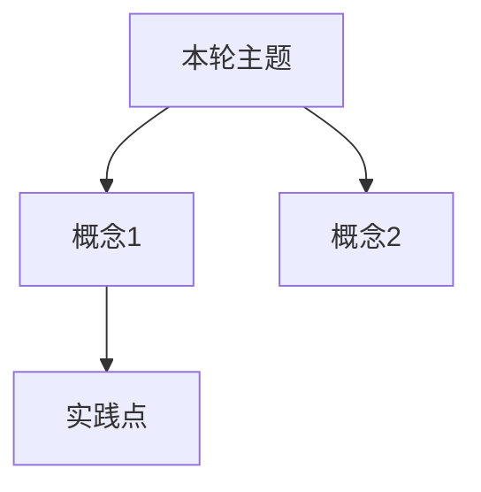

# 学习循环：{{title}}

**创建日期**：{{date}}  
**存放路径**：`Plans/学习循环/{{date}}-{{stage}}-{{title}}.md`  
**状态**：草稿 | 进行中 | 评审中 | 已采纳 | 搁置  
**workflow**：`learning-loop`  
**原则**：AI 可以准备、验证、复盘和记录，但不能替用户确认「学完」。

---

## 一、学习主题

| 项 | 内容 |
|----|------|
| 本轮主题 | 【】 |
| 所属旅程 | `Plans/Epic/【】.md` |
| 用户当前水平 | 【完全陌生 / 看过概念 / 做过小实验 / 能独立讲解】 |
| 本轮目标 | 【】 |

---

## 二、完成门槛

| 类型 | 门槛 |
|------|------|
| 概念门槛 | 能用自己的话解释【】 |
| 实践门槛 | 能完成【】 |
| 验证门槛 | AI 验证通过，且用户能回答关键问题 |
| 结束门槛 | 用户明确说「本轮学完了」 |

---

## 三、资料准备

| 资料 | 为什么读/看 | 使用方式 | 状态 |
|------|-------------|----------|------|
| 【】 | 【】 | 必读/选读/查阅 | ⬜ |

### AI 讲解稿

【用学习者当前水平解释本轮主题。】

---

## 四、最小概念树



| 概念 | 一句话解释 | 常见误区 | 对应实践 |
|------|------------|----------|----------|
| 【】 | 【】 | 【】 | 【】 |

---

## 五、学习过程

| 时间 | 学习动作 | 结果 |
|------|----------|------|
| 【】 | 【阅读/提问/讨论】 | 【】 |

---

## 六、问题与澄清

| 问题 | AI 回答 | 是否已懂 |
|------|---------|----------|
| 【】 | 【】 | ⬜ |

---

## 七、设计决策

> 用户根据概念理解，做出架构/方案选择。AI 只提供选项和 trade-off，不替用户决定。

| 决策点 | 选项 | 用户选择 | 理由 |
|--------|------|----------|------|
| 【】 | 【A / B / C】 | 【】 | 【】 |

```
[ ] 1. 明确要实现的目标功能
[ ] 2. AI 列出关键设计决策点和选项
[ ] 3. 用户逐项选择并说明理由
[ ] 4. 确认最终设计方案
```

---

## 八、编码实现

> AI 与用户一起写代码。AI 写框架，用户理解每一行；遇到不懂的概念当场澄清。

| 任务 | 输入 | 产物 | 验收 |
|------|------|------|------|
| 【】 | 【】 | 【代码/测试/文档】 | 【】 |

```
[ ] 1.  搭建代码骨架
[ ] 2.  逐步实现核心逻辑
[ ] 3.  运行验证
[ ] 4.  记录编码前后的概念理解变化
```

---

## 九、代码产物

| 产物 | 路径/链接 | 说明 |
|------|-----------|------|
| 【】 | 【】 | 【】 |

---

## 十、验证清单

| 验证项 | 方法 | 结果 |
|--------|------|------|
| 概念问答 | AI 提问，用户回答 | ⬜ |
| 实践检查 | 运行测试 / review / 输出检查 | ⬜ |
| 反例检查 | 故意失败或边界输入 | ⬜ |

---

## 十一、验证结论

| 项 | 结论 |
|----|------|
| 是否通过 | ✅ / ⚠️ / ❌ |
| 证据 | 【命令输出 / review 结论 / 问答结果】 |
| 需要返工 | 【】 |

---

## 十二、复盘

| 维度 | 内容 |
|------|------|
| 已掌握 | 【】 |
| 未掌握 | 【】 |
| 误区 | 【】 |
| 最有价值的一点 | 【】 |

---

## 十三、下一步建议

| 方向 | 建议 | 理由 |
|------|------|------|
| 继续深化 | 【】 | 【】 |
| 进入下一主题 | 【】 | 【】 |
| 生成总结 | 【】 | 【】 |

---

## 十四、学习记录

| 日期 | 本轮主题 | 结果 | 实践产物 |
|------|----------|------|----------|
| {{date}} | {{title}} | 【】 | 【】 |

---

## 十五、知识图谱增量

```mermaid
graph TD
  A[{{title}}] --> B[新增概念]
```

| 新增概念 | 关系 | 应更新到旅程图谱 |
|----------|------|------------------|
| 【】 | 【】 | ⬜ |

---

## 十六、用户确认

- [ ] 用户确认本轮学完
- [ ] 用户选择继续下一个主题
- [ ] 用户要求生成阶段总结
- [ ] 用户确认整个学习旅程结束

---

## 续做

```text
/resume plan=Plans/学习循环/{{date}}-{{stage}}-{{title}}.md 进度=【当前阶段】
```

## 反馈（skill_run）

```yaml
skill_run:
  skill: workflow-router
  plan: Plans/学习循环/{{date}}-{{stage}}-{{title}}.md
  date: {{date}}
  contexts_used:
    - path: Contexts/决策/Skill反馈协议.md
      utility: high
      reason: "学习循环阶段完成后必须留下反馈，供后续流程进化。"
  contexts_missing: []
  contexts_stale: []
```
