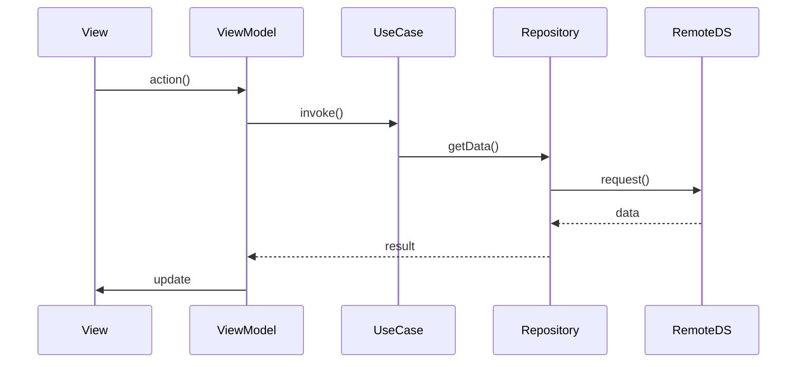

# 客户端技术方案：{{title}}

**创建日期**：{{date}}
**存放路径**：`Plans/客户端技术方案/{{date}}-{{title}}.md`
**状态**：草稿 | 评审中 | 已采纳
**平台**：iOS / Android / Flutter / Compose Multiplatform（标注最低版本）
**负责人**：【】
**AI 角色**：辅助开发（代码生成、重构、测试）

---

## 1. 背景与目标（明确「为什么」）

- **业务需求/痛点**：【用户反馈、崩溃数据、功能缺失、性能劣化】
- **成功指标**：【可量化，如崩溃率 < 0.1%、首帧 < 500ms、任务完成率 +20%】
- **非目标**：【明确排除范围，防止 Agent 过度设计】

---

## 2. 软件工程原则（必须遵守）

| 原则 | 要求 | 示例 |
|------|------|------|
| **SRP** | 每个类/模块只因一个理由变化 | `UserRepository` 只负责数据存取 |
| **OCP** | 对扩展开放，对修改关闭 | 接口定义缓存策略，可切换实现 |
| **DIP** | 依赖抽象 | ViewModel 依赖 `ILoginUseCase` |
| **ISP** | 接口精简 | 回调只暴露需要的方法 |
| **LSP** | 子类可替换父类 | `DataSource` 子类正确处理空数据 |
| **DRY** | 避免重复 | 提取公用工具 |
| **KISS** | 保持简单 | 优先标准库 |
| **YAGNI** | 不做未来功能 | 不提前做同步冲突 |
| **关注点分离** | UI / 业务 / 数据分层 | UI 层不写网络请求 |
| **最小惊讶** | 符合惯例命名 | `getUserById` |

> 关键类注释标注原则（如 `// SRP: 仅负责网络请求`）。

---

## 3. 约束与前提

- **系统版本**：iOS 【】+ / Android 【】+
- **设备内存**：最低 【】GB
- **特性开关**：AB/灰度，支持远程关闭
- **依赖服务**：API 版本、超时重试、鉴权【】
- **合规**：隐私要求【】

---

## 4. 架构设计

### 4.1 分层（Clean Architecture + MVVM）

```
[Presentation]  → UI + ViewModel
[Domain]        → UseCases、实体、Repository 接口
[Data]          → Repository 实现、DataSource
[Infrastructure]→ 日志、监控、网络客户端
```

- Presentation 仅依赖 Domain
- Data 实现 Domain 接口

### 4.2 模块边界

| 模块 | 职责 | 输入/输出 | 原则 |
|------|------|-----------|------|
| 【ViewModel】 | 【】 | 【】 | SRP, DIP |
| 【DataSource】 | 【】 | 【】 | ISP, OCP |

### 4.3 关键流程



---

## 5. 方案选项与推荐

### 方案 A / B …

## 6. 推荐方案

- **选择**：【】
- **理由**：【】
- **风险与缓解**：【】

---

## 7. 实施计划

| 阶段 | 内容 | 预估 |
|------|------|------|
| 1 | Domain + UseCase | 【】 |
| 2 | Data 层 | 【】 |
| 3 | UI + 联调 | 【】 |
| 4 | 测试 + 灰度 | 【】 |

---

## 8. 验收标准

- [ ] 成功指标达标
- [ ] 分层无违规
- [ ] 特性开关可关闭
- [ ] 关键路径有测试

---

## 9. AI 输出要求

1. 先输出模块划分 + 接口草案 + 原则对照。
2. 禁止 UI 层写网络/DB；遵守 YAGNI。
3. 缺信息列「待确认」，不猜测。

---

## 10. 相关决策

- `Contexts/【】`：【】

## 续做

```
/template-generator 任务类型=客户端方案，背景=...
@Skills/resume_assistant.md 续做，plan文件名=客户端技术方案/本文件名，当前进度=...
```
